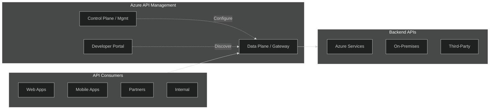
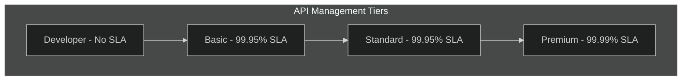
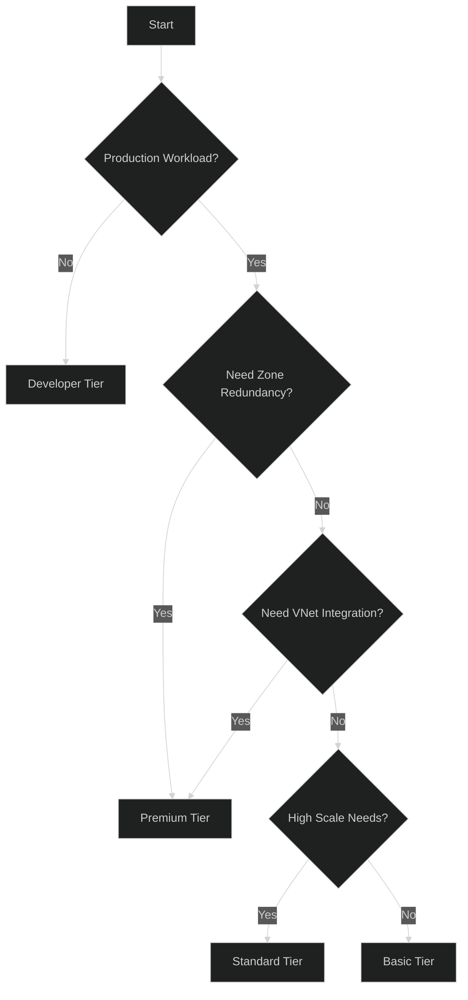
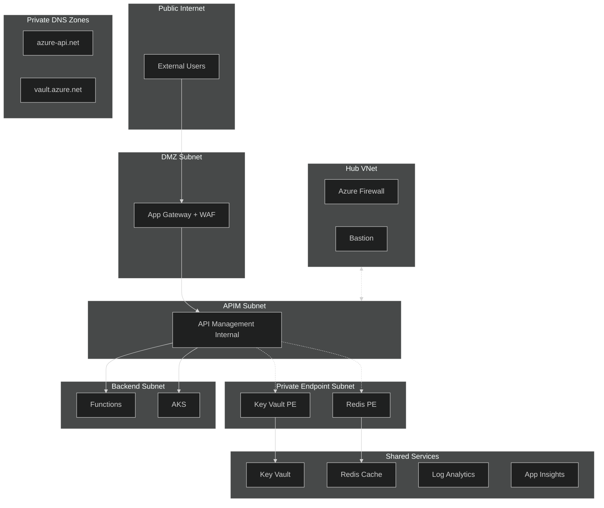

# 01 - Architecture Overview

> Azure API Management architecture patterns for enterprise deployments

---

## 🎯 What is Azure API Management?

Azure API Management (APIM) is a **fully managed platform** for:
- Publishing, securing, and analyzing APIs
- Acting as a facade between consumers and backend services
- Implementing cross-cutting concerns (auth, rate limiting, caching, logging)



---

## 🏛️ Core Components

### 1. Gateway (Data Plane)
The runtime component that:
- Proxies API requests to backends
- Enforces policies (auth, rate limiting, transformation)
- Collects telemetry and analytics

### 2. Management Plane (Control Plane)
- Azure Resource Manager interface
- Configuration via Portal, CLI, ARM/Bicep, Terraform
- API for automation (APIOps)

### 3. Developer Portal
- Self-service portal for API consumers
- API documentation (OpenAPI/Swagger)
- Subscription and key management
- Try-it-out console

---

## 📊 Service Tiers Comparison



### Detailed Feature Matrix

| Feature | Developer | Basic | Standard | Premium | Standard v2 | Premium v2 |
|---------|:---------:|:-----:|:--------:|:-------:|:-----------:|:----------:|
| **SLA** | None | 99.95% | 99.95% | 99.99% | 99.95% | 99.99% |
| **Scale Units** | 1 | 2 | 4 | 12/region | 10 | 10/region |
| **Zone Redundancy** | ❌ | ❌ | ❌ | ✅ | ❌ | ✅ |
| **Multi-Region** | ❌ | ❌ | ❌ | ✅ | ❌ | ✅ |
| **VNet - External** | ✅ | ❌ | ❌ | ✅ | ✅ | ✅ |
| **VNet - Internal** | ✅ | ❌ | ❌ | ✅ | ✅ | ✅ |
| **Private Endpoint** | ❌ | ❌ | ❌ | ✅ | ✅ | ✅ |
| **Self-Hosted Gateway** | ✅ | ❌ | ❌ | ✅ | ❌ | ✅ |
| **Workspaces** | ❌ | ❌ | ❌ | ✅ | ❌ | ✅ |
| **Built-in Cache** | 10MB | 10MB | 50MB | 1GB | 100MB | 1GB |
| **Defender for APIs** | ✅ | ✅ | ✅ | ✅ | ✅ | ✅ |

### Tier Selection Decision Tree



---

## 🏗️ Landing Zone Architecture

The recommended enterprise architecture based on Microsoft's Landing Zone Accelerator:



### Key Design Decisions

| Design Area | Recommendation |
|-------------|----------------|
| **Network Mode** | Internal VNet integration (no public IP on gateway) |
| **Ingress** | Application Gateway + WAF v2 for internet traffic |
| **DNS** | Private DNS zones for all endpoints |
| **Identity** | System-assigned managed identity for APIM |
| **Secrets** | Azure Key Vault with private endpoint |
| **Caching** | Azure Cache for Redis with private endpoint |
| **Monitoring** | Application Insights + Log Analytics |

---

## 🔧 Core Concepts

### Products
Bundle APIs and apply policies at the product level:

```
Product: "Data Mesh API - Standard"
├── APIs: Dataset Service, Catalog Service
├── Policies: Rate Limit (100/min), Quota (10000/day)
├── Subscription Required: Yes
└── Approval Required: Yes
```

### APIs & Operations
```
API: Dataset Web Service
├── Base URL: /dataset
├── Operations:
│   ├── GET /items      → Get all datasets
│   ├── GET /items/{id} → Get dataset by ID
│   ├── POST /items     → Create dataset
│   └── DELETE /items/{id} → Delete dataset
└── Policies: JWT Validation, Caching
```

### Subscriptions
- Unique API key per subscription
- Scoped to: All APIs, Single API, or Product
- State: Active, Suspended, Cancelled

### Backends
Named backend configurations for:
- Load balancing
- Circuit breakers  
- Connection pooling

---

## 📋 Design Checklist

### ✅ Before You Start

- [ ] Identified all APIs to be managed
- [ ] Determined tier requirements (SLA, features)
- [ ] Designed network topology (VNet, subnets)
- [ ] Planned authentication strategy (OAuth, subscription keys)
- [ ] Defined products and rate limiting strategy
- [ ] Established monitoring requirements
- [ ] Planned for disaster recovery
- [ ] Reviewed compliance requirements

### ✅ Production Readiness

- [ ] Premium tier for zone redundancy (if required)
- [ ] Minimum 2 scale units for HA
- [ ] VNet integration configured
- [ ] WAF in front of APIM
- [ ] TLS 1.2+ enforced
- [ ] Legacy protocols disabled
- [ ] Managed identities configured
- [ ] Key Vault integration for secrets
- [ ] Diagnostic settings enabled
- [ ] Alerts configured
- [ ] Backup/DR strategy documented

---

## 🔗 Related Documents

| Document | Description |
|----------|-------------|
| [02-Reliability](./02-reliability.md) | Zone redundancy, scaling, DR |
| [03-Security](./03-security.md) | Authentication, network, OWASP |
| [05-DevOps-APIOps](./05-devops-apiops.md) | CI/CD and IaC patterns |

---

> **Next**: [02-Reliability](./02-reliability.md) - Zone redundancy and disaster recovery patterns
