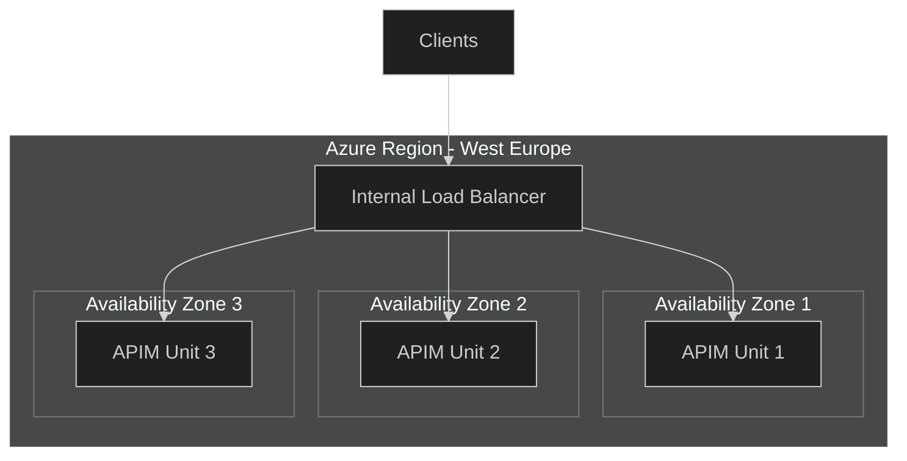
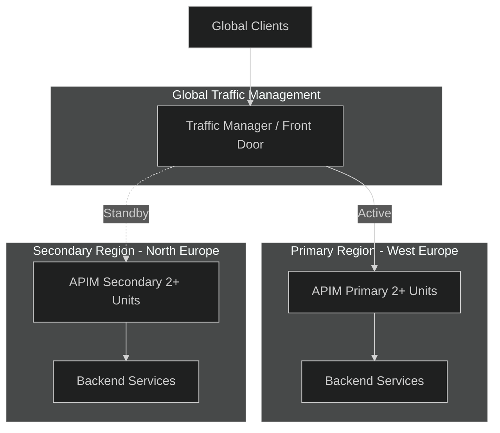
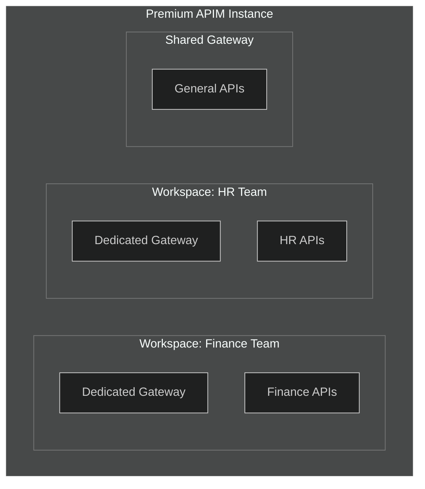
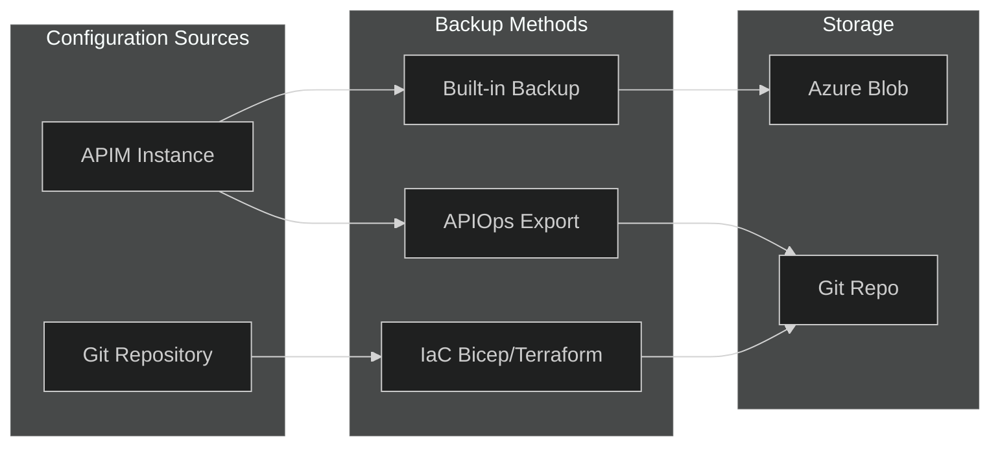

# 02 - Reliability

> Building resilient API Management deployments with zone redundancy, multi-region, and disaster recovery

[](https://learn.microsoft.com/azure/well-architected/reliability/checklist)

---

## 📋 WAF Workload Design Checklist

> Based on [Azure Well-Architected Framework - Reliability Checklist](https://learn.microsoft.com/azure/well-architected/reliability/checklist)

| # | Recommendation | Status |
|---|----------------|--------|
| ✅ | **(Service)** Evaluate gateway capabilities for reliability - determine tier and features needed | ☐ |
| ✅ | **(Service)** Enable zone redundancy in Premium tier with minimum 2 units | ☐ |
| ✅ | **(Service)** Enable automatic scale-out based on traffic demands | ☐ |
| ✅ | **(Service)** Use multiregion topology for complete regional failure resiliency | ☐ |
| ✅ | **(Service)** Isolate unrelated APIs with workspaces or additional instances | ☐ |
| ✅ | **(Service)** Review observability capabilities (Azure Monitor, App Insights) | ☐ |
| ✅ | **(Service)** Factor gateway SLA into your workload's SLOs | ☐ |
| ✅ | **(API)** Plan for both expected and unexpected backend faults | ☐ |
| ✅ | **(API)** Implement quotas, rate limits, retry, circuit breakers, load balancing | ☐ |
| ✅ | **(API)** Thoroughly test policy expressions with resilient error handling | ☐ |
| ✅ | **(Service)** Use Azure Load Testing from within your network | ☐ |
| ✅ | **(Service)** Plan DR with backup/restore and APIOps/IaC solutions | ☐ |

---

## 🎯 Reliability Goals

| Metric | Target |
|--------|--------|
| **Availability** | 99.99% (Premium tier with zones) |
| **RTO** | < 1 hour for regional failover |
| **RPO** | Near-zero with active-active |
| **Recovery** | Automated failover where possible |

---

## 🏗️ High Availability Patterns

### Zone Redundancy (Single Region)



**Requirements:**
- Premium tier only
- Minimum 2 units (recommended 3 for full zone coverage)
- All zones active-active

### Multi-Region Deployment



---

## 📋 Reliability Configuration Checklist

### Zone Redundancy Setup

| Configuration | Recommendation | Benefit |
|---------------|----------------|---------|
| **Tier** | Premium | Required for zone redundancy |
| **Units** | Minimum 2, recommended 3 | Full zone coverage |
| **Distribution** | Automatic across zones | No manual zone selection needed |
| **Load Balancing** | Built-in | Active-active across all zones |

### Multi-Region Setup

| Configuration | Recommendation | Benefit |
|---------------|----------------|---------|
| **Regions** | 2+ in different geographies | Geographic resilience |
| **Traffic Manager** | Priority or Weighted routing | Intelligent failover |
| **Backend Sync** | Replicate to all regions | Data consistency |
| **DNS TTL** | Low (60 seconds) | Fast failover |

---

## 🏢 Workload Isolation with Workspaces

> WAF Recommendation: Isolate critical workloads using dedicated gateways



| Isolation Approach | Use Case | Benefit |
|--------------------|----------|---------|
| **Workspaces** | Multi-team, same instance | Cost-effective isolation |
| **Dedicated Gateway** | Critical APIs | Compute isolation |
| **Separate Instance** | Strict boundaries | Full isolation |

---

## 📊 Reliability Metrics

> WAF Recommendation: Collect reliability metrics for deviation detection

### Key Metrics to Monitor

| Metric | Description | Alert Threshold |
|--------|-------------|-----------------|
| **Capacity** | Gateway resource utilization | > 80% |
| **Requests** | Total requests per period | Baseline deviation > 50% |
| **Failed Requests** | 4xx and 5xx responses | > 5% of total |
| **Backend Duration** | Time to backend response | > 5 seconds |
| **Gateway Errors** | Gateway-originated errors | > 1% |
| **Rate Limit Violations** | Quota exceeded responses | Any occurrence |
| **Health Check Failures** | Dependency health | Any failure |

---

## 🔄 Scaling Strategies

### Capacity Metric

The **Capacity** metric is the key indicator for scaling:

| Capacity % | Action |
|------------|--------|
| < 40% | Consider scaling in |
| 40-70% | Optimal range |
| 70-80% | Plan to scale out |
| > 80% | Scale out immediately |

### Autoscale Configuration (Bicep)

```bicep
resource autoscale 'Microsoft.Insights/autoscalesettings@2022-10-01' = {
  name: 'apim-autoscale'
  location: location
  properties: {
    targetResourceUri: apim.id
    enabled: true
    profiles: [
      {
        name: 'Auto Scale Profile'
        capacity: {
          minimum: '2'
          maximum: '10'
          default: '2'
        }
        rules: [
          {
            metricTrigger: {
              metricName: 'Capacity'
              metricResourceUri: apim.id
              timeGrain: 'PT1M'
              statistic: 'Average'
              timeWindow: 'PT10M'
              timeAggregation: 'Average'
              operator: 'GreaterThan'
              threshold: 70
            }
            scaleAction: {
              direction: 'Increase'
              type: 'ChangeCount'
              value: '1'
              cooldown: 'PT20M'
            }
          }
          {
            metricTrigger: {
              metricName: 'Capacity'
              metricResourceUri: apim.id
              timeGrain: 'PT1M'
              statistic: 'Average'
              timeWindow: 'PT30M'
              timeAggregation: 'Average'
              operator: 'LessThan'
              threshold: 40
            }
            scaleAction: {
              direction: 'Decrease'
              type: 'ChangeCount'
              value: '1'
              cooldown: 'PT60M'
            }
          }
        ]
      }
    ]
  }
}
```

---

## 🛡️ Resilience Policies

### Circuit Breaker Pattern

```xml
<backend id="backend-service">
    <circuit-breaker 
        trip-duration="PT1M"
        accept-retriable-5xx="false">
        <failure-condition count="10" interval="PT10S" />
    </circuit-breaker>
</backend>
```

### Retry Policy

```xml
<retry condition="@(context.Response.StatusCode >= 500)" 
       count="3" 
       interval="1" 
       delta="1" 
       max-interval="10" 
       first-fast-retry="true">
    <forward-request buffer-request-body="true" />
</retry>
```

### Backend Load Balancing

```xml
<backend id="load-balanced-backend">
    <backend-pool>
        <backend url="https://backend1.example.com" priority="1" weight="3"/>
        <backend url="https://backend2.example.com" priority="1" weight="1"/>
        <backend url="https://backend3.example.com" priority="2" weight="1"/>
    </backend-pool>
</backend>
```

---

## 💾 Disaster Recovery

### Backup Strategy



### Built-in Backup (Azure CLI)

```bash
# Create backup
az apim backup \
  --name "apim-westeu-prod-mesh" \
  --resource-group "rg-apim-prod" \
  --backup-name "backup-20251215" \
  --storage-account-name "stbackup001" \
  --storage-account-container "apim-backups" \
  --storage-account-key "<key>"

# Restore from backup
az apim restore \
  --name "apim-westeu-prod-mesh" \
  --resource-group "rg-apim-prod" \
  --backup-name "backup-20251215" \
  --storage-account-name "stbackup001" \
  --storage-account-container "apim-backups" \
  --storage-account-key "<key>"
```

### What's Backed Up

| Included | Not Included |
|----------|--------------|
| ✅ API definitions | ❌ User subscriptions (keys) |
| ✅ Products | ❌ Custom domain certificates |
| ✅ Policies | ❌ Managed identity assignments |
| ✅ Named values | ❌ VNet configuration |
| ✅ Developer portal content | ❌ Diagnostic settings |
| ✅ Certificates (public) | ❌ Azure AD B2C config |

---

## 📊 Reliability Metrics

### Key Metrics to Monitor

| Metric | Description | Alert Threshold |
|--------|-------------|-----------------|
| **Capacity** | Gateway resource utilization | > 80% |
| **Requests** | Total requests per period | Baseline deviation > 50% |
| **Failed Requests** | 4xx and 5xx responses | > 5% of total |
| **Backend Duration** | Time to backend response | > 5 seconds |
| **Gateway Errors** | Gateway-originated errors | > 1% |

### Alert Configuration (Bicep)

```bicep
resource capacityAlert 'Microsoft.Insights/metricAlerts@2018-03-01' = {
  name: 'apim-capacity-alert'
  location: 'global'
  properties: {
    description: 'APIM Capacity exceeded 80%'
    severity: 2
    enabled: true
    scopes: [apim.id]
    evaluationFrequency: 'PT1M'
    windowSize: 'PT5M'
    criteria: {
      'odata.type': 'Microsoft.Azure.Monitor.SingleResourceMultipleMetricCriteria'
      allOf: [
        {
          name: 'CapacityThreshold'
          metricName: 'Capacity'
          operator: 'GreaterThan'
          threshold: 80
          timeAggregation: 'Average'
        }
      ]
    }
    actions: [
      {
        actionGroupId: actionGroup.id
      }
    ]
  }
}
```

---

## ✅ Reliability Checklist

### Design Phase
- [ ] Selected Premium tier for zone redundancy
- [ ] Planned minimum 2 scale units
- [ ] Identified multi-region requirements
- [ ] Designed backend failover strategy
- [ ] Documented RTO/RPO requirements

### Implementation Phase
- [ ] Enabled zone redundancy
- [ ] Configured autoscaling rules
- [ ] Implemented circuit breakers
- [ ] Set up retry policies
- [ ] Configured backend load balancing

### Operations Phase
- [ ] Configured capacity alerts
- [ ] Set up automated backups
- [ ] Documented DR runbooks
- [ ] Tested failover procedures
- [ ] Scheduled regular DR drills

---

## 🔗 Related Documents

| Document | Description |
|----------|-------------|
| [03-Security](./03-security.md) | Network isolation and protection |
| [06-Monitoring](./06-monitoring.md) | Metrics, alerts, and diagnostics |
| [09-Cost-Optimization](./09-cost-optimization.md) | Scaling cost considerations |

---

> **Next**: [03-Security](./03-security.md) - OWASP protection and network isolation
