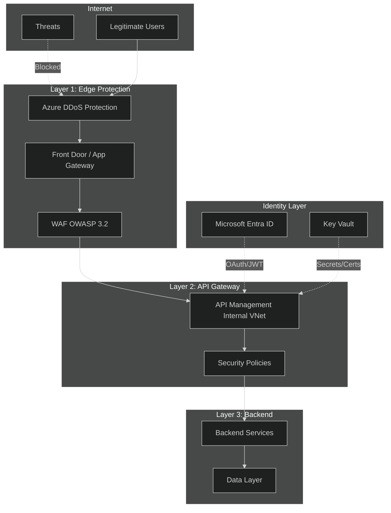
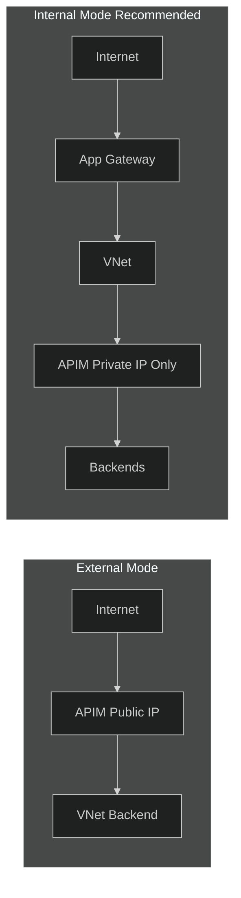
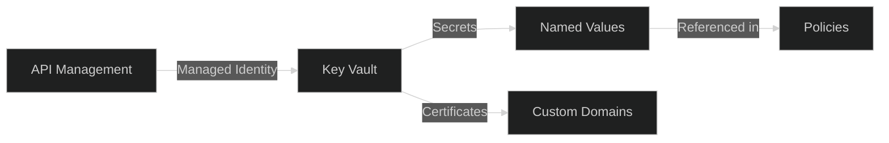

# 03 - Security

> Comprehensive security patterns including OWASP protection, network isolation, and authentication

[](https://learn.microsoft.com/azure/well-architected/security/checklist)

---

## 📋 WAF Workload Design Checklist

> Based on [Azure Well-Architected Framework - Security Checklist](https://learn.microsoft.com/azure/well-architected/security/checklist)

| # | Recommendation | Status |
|---|----------------|--------|
| ✅ | **(Service)** Establish security baseline from [API Management Security Baseline](https://learn.microsoft.com/security/benchmark/azure/baselines/api-management-security-baseline) | ☐ |
| ✅ | **(Service)** Disable the direct management API (deprecated) - use Azure Resource Manager | ☐ |
| ✅ | **(Service)** Disable developer portal if not in use; if used, disable anonymous access | ☐ |
| ✅ | **(Service)** Limit gateway exposure to legitimate client sources using VNet/NSG | ☐ |
| ✅ | **(Service)** Set narrowest supported TLS versions (minimum 1.2, prefer 1.3) | ☐ |
| ✅ | **(Service)** Store custom certificates in Key Vault | ☐ |
| ✅ | **(Service)** Backends should only accept traffic from API gateways | ☐ |
| ✅ | **(Service)** Use workspaces for team isolation on shared instances | ☐ |
| ✅ | **(API)** Store secrets in Key Vault, expose through named values | ☐ |
| ✅ | **(API)** Use different managed identities for different APIs | ☐ |
| ✅ | **(API)** Require OAuth 2.0 over preshared keys where possible | ☐ |
| ✅ | **(API)** Suppress HTTP headers that expose implementation details | ☐ |
| ✅ | **(API)** Don't use API tracing in production | ☐ |
| ✅ | **(API)** Use Defender for APIs for security insights and threat detection | ☐ |
| ✅ | **(API)** Protect backends with validate-jwt, ip-filter, validate-headers, validate-content | ☐ |
| ✅ | **(Service & API)** Use managed identities for all service dependencies | ☐ |
| ✅ | **(Service & API)** Use private network connections for Key Vault, Event Hubs, backends | ☐ |
| ✅ | **(Service & API)** Use WAF and DDoS Protection for internet-exposed APIs | ☐ |

---

## 🔐 Critical WAF Security Configurations

### Disable Direct Management API

```bicep
resource apim 'Microsoft.ApiManagement/service@2023-05-01-preview' = {
  name: apimName
  location: location
  properties: {
    // Disable deprecated direct management API
    disableGateway: false
    apiVersionConstraint: {
      minApiVersion: '2019-12-01'  // Enforce minimum API version
    }
  }
}
```

### Microsoft Defender for APIs

```bicep
// Enable Defender for Cloud on the subscription
resource defenderForAPIs 'Microsoft.Security/pricings@2023-01-01' = {
  name: 'Api'
  properties: {
    pricingTier: 'Standard'
  }
}
```

> **Defender for APIs provides:**
> - API security insights and recommendations
> - Threat detection for anomalous API usage
> - Integration with Microsoft Sentinel for SIEM

---

## 🎯 Security Goals

| Goal | Implementation |
|------|----------------|
| **Confidentiality** | TLS 1.2+, encryption at rest, private networks |
| **Integrity** | Input validation, content verification, signing |
| **Availability** | DDoS protection, rate limiting, WAF |
| **Authentication** | OAuth 2.0, JWT validation, managed identities |
| **Authorization** | RBAC, product subscriptions, policy enforcement |

---

## 🏗️ Security Architecture



---

## 🔐 TLS & Protocol Hardening

### Disable Insecure Protocols (Bicep)

```bicep
resource apim 'Microsoft.ApiManagement/service@2023-05-01-preview' = {
  name: apimName
  location: location
  properties: {
    customProperties: {
      // Disable legacy TLS versions
      'Microsoft.WindowsAzure.ApiManagement.Gateway.Security.Protocols.Tls10': 'false'
      'Microsoft.WindowsAzure.ApiManagement.Gateway.Security.Protocols.Tls11': 'false'
      'Microsoft.WindowsAzure.ApiManagement.Gateway.Security.Protocols.Ssl30': 'false'
      
      // Disable for backend connections too
      'Microsoft.WindowsAzure.ApiManagement.Gateway.Security.Backend.Protocols.Tls10': 'false'
      'Microsoft.WindowsAzure.ApiManagement.Gateway.Security.Backend.Protocols.Tls11': 'false'
      'Microsoft.WindowsAzure.ApiManagement.Gateway.Security.Backend.Protocols.Ssl30': 'false'
      
      // Disable weak ciphers
      'Microsoft.WindowsAzure.ApiManagement.Gateway.Security.Ciphers.TripleDes168': 'false'
      'Microsoft.WindowsAzure.ApiManagement.Gateway.Security.Ciphers.TLS_RSA_WITH_AES_128_CBC_SHA': 'false'
      'Microsoft.WindowsAzure.ApiManagement.Gateway.Security.Ciphers.TLS_RSA_WITH_AES_256_CBC_SHA': 'false'
      
      // Enable HTTP/2
      'Microsoft.WindowsAzure.ApiManagement.Gateway.Protocols.Server.Http2': 'true'
    }
  }
}
```

### TLS Configuration Summary

| Setting | Recommendation |
|---------|----------------|
| **Minimum TLS** | 1.2 (1.3 when clients support) |
| **SSL 3.0** | ❌ Disabled |
| **TLS 1.0** | ❌ Disabled |
| **TLS 1.1** | ❌ Disabled |
| **3DES Cipher** | ❌ Disabled |
| **HTTP/2** | ✅ Enabled |

---

## 🛡️ OWASP API Security Top 10

### Protection Matrix

| OWASP Threat | APIM Mitigation | Policy |
|--------------|-----------------|--------|
| **API1: Broken Object Level Auth** | validate-jwt with claims | `validate-jwt`, `validate-azure-ad-token` |
| **API2: Broken Authentication** | OAuth 2.0, Entra ID | `validate-azure-ad-token` |
| **API3: Broken Object Property Level Auth** | Content validation | `validate-content` |
| **API4: Unrestricted Resource Consumption** | Rate limiting | `rate-limit`, `quota` |
| **API5: Broken Function Level Auth** | Product/operation policies | `validate-jwt` with roles |
| **API6: Unrestricted Access to Sensitive Flows** | IP filtering, WAF | `ip-filter`, Application Gateway |
| **API7: Server Side Request Forgery** | URL validation | Policy expressions |
| **API8: Security Misconfiguration** | TLS hardening, disable features | Custom properties |
| **API9: Improper Inventory Management** | API Center | Governance |
| **API10: Unsafe Consumption of APIs** | Backend validation | `validate-content` |

---

## 🔑 Authentication Patterns

### JWT Validation (Microsoft Entra ID)

```xml
<validate-azure-ad-token tenant-id="{{tenant-id}}" output-token-variable-name="jwt">
    <client-application-ids>
        <application-id>{{client-app-id}}</application-id>
    </client-application-ids>
    <audiences>
        <audience>api://{{api-app-id}}</audience>
    </audiences>
    <required-claims>
        <claim name="roles" match="any">
            <value>API.Read</value>
            <value>API.Write</value>
        </claim>
    </required-claims>
</validate-azure-ad-token>
```

### Generic JWT Validation

```xml
<validate-jwt header-name="Authorization" 
              failed-validation-httpcode="401" 
              failed-validation-error-message="Unauthorized"
              require-expiration-time="true"
              require-signed-tokens="true"
              clock-skew="60">
    <openid-config url="https://login.microsoftonline.com/{{tenant-id}}/v2.0/.well-known/openid-configuration"/>
    <issuers>
        <issuer>https://login.microsoftonline.com/{{tenant-id}}/v2.0</issuer>
    </issuers>
    <required-claims>
        <claim name="aud" match="all">
            <value>{{api-audience}}</value>
        </claim>
    </required-claims>
</validate-jwt>
```

### Client Certificate Authentication

```xml
<validate-client-certificate 
    validate-revocation="true"
    validate-trust="true"
    validate-not-before="true"
    validate-not-after="true"
    ignore-error="false">
    <identities>
        <identity thumbprint="{{cert-thumbprint}}" />
    </identities>
</validate-client-certificate>
```

---

## 🌐 Network Isolation

### VNet Integration Modes



### Internal VNet Configuration (Bicep)

```bicep
resource apim 'Microsoft.ApiManagement/service@2023-05-01-preview' = {
  name: apimName
  location: location
  sku: {
    name: 'Premium'
    capacity: 2
  }
  properties: {
    virtualNetworkType: 'Internal'
    publicIpAddressId: publicIP.id
    virtualNetworkConfiguration: {
      subnetResourceId: apimSubnet.id
    }
    publicNetworkAccess: 'Disabled'
  }
}
```

### NSG Rules for APIM Subnet

| Priority | Name | Direction | Source | Destination | Port | Action |
|----------|------|-----------|--------|-------------|------|--------|
| 100 | AllowAppGateway | Inbound | AppGW Subnet | APIM Subnet | 443 | Allow |
| 110 | AllowManagement | Inbound | ApiManagement | VirtualNetwork | 3443 | Allow |
| 120 | AllowAzureLB | Inbound | AzureLoadBalancer | VirtualNetwork | 6390 | Allow |
| 1000 | DenyAllInbound | Inbound | Any | Any | Any | Deny |

---

## 🔥 WAF Integration

### Application Gateway + WAF Policy

```bicep
resource wafPolicy 'Microsoft.Network/ApplicationGatewayWebApplicationFirewallPolicies@2023-05-01' = {
  name: 'waf-apim-policy'
  location: location
  properties: {
    policySettings: {
      mode: 'Prevention'
      state: 'Enabled'
      requestBodyCheck: true
      maxRequestBodySizeInKb: 128
      fileUploadLimitInMb: 100
    }
    managedRules: {
      managedRuleSets: [
        {
          ruleSetType: 'OWASP'
          ruleSetVersion: '3.2'
        }
        {
          ruleSetType: 'Microsoft_BotManagerRuleSet'
          ruleSetVersion: '1.0'
        }
      ]
    }
    customRules: [
      {
        name: 'BlockBadBots'
        priority: 1
        ruleType: 'MatchRule'
        action: 'Block'
        matchConditions: [
          {
            matchVariables: [{ variableName: 'RequestHeaders', selector: 'User-Agent' }]
            operator: 'Contains'
            matchValues: ['scanner', 'bot', 'crawler']
            transforms: ['Lowercase']
          }
        ]
      }
    ]
  }
}
```

---

## 🔐 Secrets Management

### Key Vault Integration



### Named Value with Key Vault Reference (Bicep)

```bicep
resource namedValue 'Microsoft.ApiManagement/service/namedValues@2023-05-01-preview' = {
  parent: apim
  name: 'backend-api-key'
  properties: {
    displayName: 'backend-api-key'
    secret: true
    keyVault: {
      secretIdentifier: 'https://${keyVaultName}${environment().suffixes.keyvaultDns}/secrets/backend-api-key'
    }
  }
}
```

### Using Named Values in Policies

```xml
<set-header name="X-API-Key" exists-action="override">
    <value>{{backend-api-key}}</value>
</set-header>
```

---

## 🛡️ IP Filtering

### Allow Specific IPs

```xml
<ip-filter action="allow">
    <!-- Office IP ranges -->
    <address-range from="203.0.113.0" to="203.0.113.255"/>
    <!-- Partner network -->
    <address>198.51.100.42</address>
    <!-- Azure services -->
    <address-range from="10.0.0.0" to="10.255.255.255"/>
</ip-filter>
```

### Dynamic IP Filtering

```xml
<choose>
    <when condition="@(context.Request.IpAddress.StartsWith("10."))">
        <!-- Internal traffic - allow -->
    </when>
    <otherwise>
        <!-- External traffic - require additional auth -->
        <validate-jwt header-name="Authorization" ... />
    </otherwise>
</choose>
```

---

## ✅ Security Checklist

### Network Security
- [ ] Internal VNet mode enabled
- [ ] NSG rules configured
- [ ] Private endpoints for dependencies
- [ ] WAF in front of APIM
- [ ] DDoS Protection enabled
- [ ] Public network access disabled

### Protocol Security
- [ ] TLS 1.2+ enforced
- [ ] Legacy protocols disabled
- [ ] Weak ciphers disabled
- [ ] HTTP/2 enabled

### Authentication
- [ ] OAuth 2.0 / JWT validation configured
- [ ] Subscription keys as fallback only
- [ ] Managed identities for backend auth
- [ ] Client certificates where required

### Secret Management
- [ ] Secrets stored in Key Vault
- [ ] Named values reference Key Vault
- [ ] Certificate rotation automated
- [ ] No secrets in policy code

### Monitoring
- [ ] Defender for APIs enabled
- [ ] Diagnostic logs enabled
- [ ] Security alerts configured
- [ ] Failed auth monitoring

---

## 🔗 Related Documents

| Document | Description |
|----------|-------------|
| [04-Policies](./04-policies.md) | Detailed policy patterns |
| [06-Monitoring](./06-monitoring.md) | Security monitoring |
| [10-Repository-Examples](./10-repository-examples.md) | Implementation from repository |

---

> **Next**: [04-Policies](./04-policies.md) - Rate limiting, caching, and transformation policies
