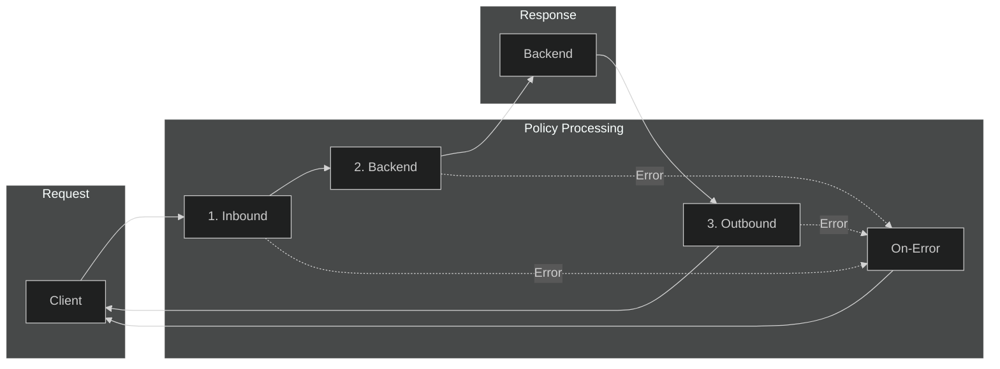
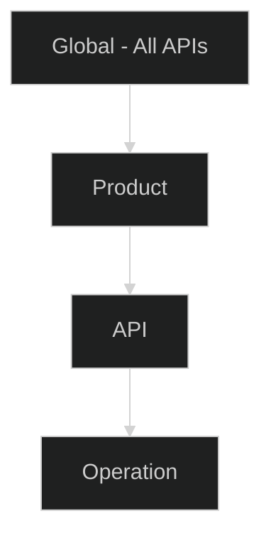

# 04 - Policies

> Rate limiting, caching, validation, and transformation policies for production

---

## 🎯 Policy Overview

Policies are XML-based configurations that run at different stages of API request/response processing:



---

## 📋 Policy Structure

```xml
<policies>
    <inbound>
        <!-- Runs before request is sent to backend -->
        <base />
        <!-- Your inbound policies -->
    </inbound>
    <backend>
        <!-- Controls forwarding to backend -->
        <base />
    </backend>
    <outbound>
        <!-- Runs after response from backend -->
        <base />
        <!-- Your outbound policies -->
    </outbound>
    <on-error>
        <!-- Runs if error occurs in any section -->
        <base />
        <!-- Your error handling policies -->
    </on-error>
</policies>
```

---

## ⚡ Rate Limiting & Throttling

### Rate Limit (Requests per Time Window)

```xml
<!-- Simple rate limit: 100 calls per 60 seconds per subscription -->
<rate-limit calls="100" renewal-period="60" />

<!-- Rate limit by key (e.g., by IP address) -->
<rate-limit-by-key 
    calls="50" 
    renewal-period="60" 
    counter-key="@(context.Request.IpAddress)" 
    increment-condition="@(context.Response.StatusCode >= 200 && context.Response.StatusCode < 300)" />

<!-- Rate limit with retry-after header -->
<rate-limit calls="100" 
            renewal-period="60" 
            retry-after-header-name="Retry-After" 
            retry-after-variable-name="retryAfter" />
```

### Quota (Total Calls per Period)

```xml
<!-- Quota: 10,000 calls per week per subscription -->
<quota calls="10000" renewal-period="604800" />

<!-- Quota by key with bandwidth limit -->
<quota-by-key 
    calls="1000" 
    bandwidth="10485760" 
    renewal-period="86400" 
    counter-key="@(context.Subscription.Id)" />
```

### Concurrency Limit

```xml
<!-- Limit concurrent requests -->
<limit-concurrency key="@(context.Subscription.Id)" max-count="10">
    <forward-request />
</limit-concurrency>
```

### Production Rate Limit Example (from Data Mesh)

```xml
<policies>
    <inbound>
        <!-- Tier-based rate limiting -->
        <rate-limit calls="5" renewal-period="60" />
        <quota calls="100" renewal-period="604800" />
        <base />
    </inbound>
    <backend>
        <base />
    </backend>
    <outbound>
        <base />
    </outbound>
</policies>
```

---

## 💾 Caching Policies

### Response Caching

```xml
<inbound>
    <!-- Check cache before calling backend -->
    <cache-lookup 
        vary-by-developer="false" 
        vary-by-developer-groups="false"
        allow-private-response-caching="true"
        downstream-caching-type="none">
        <vary-by-header>Accept</vary-by-header>
        <vary-by-header>Accept-Encoding</vary-by-header>
        <vary-by-query-parameter>version</vary-by-query-parameter>
    </cache-lookup>
</inbound>

<outbound>
    <!-- Store response in cache -->
    <cache-store duration="900" />
</outbound>
```

### External Cache (Redis)

```xml
<!-- Use external Redis cache -->
<cache-lookup-value key="@("user-" + context.Request.Headers.GetValueOrDefault("X-User-Id"))" 
                    variable-name="cachedData" 
                    caching-type="external" />

<choose>
    <when condition="@(context.Variables.ContainsKey("cachedData"))">
        <return-response>
            <set-body>@((string)context.Variables["cachedData"])</set-body>
        </return-response>
    </when>
</choose>
```

### Cache Configuration (from Data Mesh Repository)

```xml
<!-- Collibra API Caching Policy -->
<policies>
    <inbound>
        <cache-lookup 
            vary-by-developer="false" 
            vary-by-developer-groups="false" 
            allow-private-response-caching="true" 
            downstream-caching-type="none">
            <vary-by-header>Accept</vary-by-header>
            <vary-by-header>Authorization</vary-by-header>
        </cache-lookup>
        <base />
    </inbound>
    <backend>
        <base />
    </backend>
    <outbound>
        <cache-store duration="900" />
        <base />
    </outbound>
    <on-error>
        <base />
    </on-error>
</policies>
```

---

## ✅ Validation Policies

### Content Validation (JSON/XML Schema)

```xml
<validate-content 
    unspecified-content-type-action="prevent" 
    max-size="102400"
    size-exceeded-action="prevent"
    errors-variable-name="validationErrors">
    <content type="application/json" validate-as="json" action="prevent" />
    <content type="application/xml" validate-as="xml" action="prevent" />
</validate-content>
```

### Header Validation

```xml
<validate-headers specified-header-action="ignore" unspecified-header-action="ignore">
    <header name="Content-Type" action="prevent">
        <value>application/json</value>
        <value>application/xml</value>
    </header>
    <header name="X-Request-Id" action="prevent" />
</validate-headers>
```

### Parameter Validation

```xml
<validate-parameters specified-parameter-action="ignore" unspecified-parameter-action="prevent">
    <query name="limit" action="prevent">
        <value>10</value>
        <value>50</value>
        <value>100</value>
    </query>
</validate-parameters>
```

### Status Code Validation

```xml
<validate-status-code unspecified-status-code-action="ignore">
    <status-code code="200" action="ignore">
        <content type="application/json" validate-as="json" action="prevent" />
    </status-code>
    <status-code code="500" action="detect">
        <content type="application/json" validate-as="json" action="ignore" />
    </status-code>
</validate-status-code>
```

---

## 🔄 Transformation Policies

### Request Transformation

```xml
<inbound>
    <!-- Set/override headers -->
    <set-header name="X-Forwarded-Host" exists-action="override">
        <value>@(context.Request.OriginalUrl.Host)</value>
    </set-header>
    
    <!-- Add correlation ID -->
    <set-header name="X-Correlation-Id" exists-action="skip">
        <value>@(Guid.NewGuid().ToString())</value>
    </set-header>
    
    <!-- Remove sensitive headers -->
    <set-header name="X-Internal-Key" exists-action="delete" />
    
    <!-- Rewrite URL -->
    <rewrite-uri template="/api/v2{context.Request.Url.Path}" />
    
    <!-- Set query parameter -->
    <set-query-parameter name="api-version" exists-action="override">
        <value>2024-01-01</value>
    </set-query-parameter>
</inbound>
```

### Response Transformation

```xml
<outbound>
    <!-- Remove server headers -->
    <set-header name="X-Powered-By" exists-action="delete" />
    <set-header name="Server" exists-action="delete" />
    <set-header name="X-AspNet-Version" exists-action="delete" />
    
    <!-- Add custom headers -->
    <set-header name="X-Request-Id" exists-action="override">
        <value>@(context.RequestId.ToString())</value>
    </set-header>
    
    <!-- Transform JSON response -->
    <set-body>@{
        var response = context.Response.Body.As<JObject>();
        response.Add("requestId", context.RequestId.ToString());
        response.Add("timestamp", DateTime.UtcNow.ToString("o"));
        return response.ToString();
    }</set-body>
</outbound>
```

---

## 🔐 Authentication Policies

### Backend Authentication with Managed Identity

```xml
<authentication-managed-identity resource="https://database.windows.net/" 
                                  client-id="{{user-assigned-identity-client-id}}" 
                                  output-token-variable-name="accessToken" />

<set-header name="Authorization" exists-action="override">
    <value>@("Bearer " + (string)context.Variables["accessToken"])</value>
</set-header>
```

### Backend Authentication with Certificate

```xml
<authentication-certificate thumbprint="{{backend-cert-thumbprint}}" />
```

### Forward Authorization Header

```xml
<set-header name="Authorization" exists-action="override">
    <value>@(context.Request.Headers.GetValueOrDefault("Authorization",""))</value>
</set-header>
```

---

## ⚠️ Error Handling

### Custom Error Responses

```xml
<on-error>
    <set-header name="Content-Type" exists-action="override">
        <value>application/json</value>
    </set-header>
    
    <choose>
        <when condition="@(context.Response.StatusCode == 401)">
            <set-body>@{
                return new JObject(
                    new JProperty("error", "Unauthorized"),
                    new JProperty("message", "Invalid or missing authentication token"),
                    new JProperty("requestId", context.RequestId.ToString())
                ).ToString();
            }</set-body>
        </when>
        <when condition="@(context.Response.StatusCode == 429)">
            <set-body>@{
                return new JObject(
                    new JProperty("error", "TooManyRequests"),
                    new JProperty("message", "Rate limit exceeded. Please retry after the specified time."),
                    new JProperty("retryAfter", context.Variables.GetValueOrDefault<int>("retryAfter", 60))
                ).ToString();
            }</set-body>
        </when>
        <otherwise>
            <set-body>@{
                return new JObject(
                    new JProperty("error", "InternalServerError"),
                    new JProperty("message", "An unexpected error occurred"),
                    new JProperty("requestId", context.RequestId.ToString())
                ).ToString();
            }</set-body>
        </otherwise>
    </choose>
</on-error>
```

---

## 📊 Logging Policies

### Log to Application Insights

```xml
<trace source="API Gateway" severity="information">
    <message>@($"Request: {context.Request.Method} {context.Request.Url.Path}")</message>
    <metadata name="SubscriptionId" value="@(context.Subscription?.Id ?? "anonymous")" />
    <metadata name="ClientIP" value="@(context.Request.IpAddress)" />
    <metadata name="UserAgent" value="@(context.Request.Headers.GetValueOrDefault("User-Agent", "unknown"))" />
</trace>
```

### Log to Event Hub

```xml
<log-to-eventhub logger-id="eventhub-logger">@{
    return new JObject(
        new JProperty("timestamp", DateTime.UtcNow.ToString("o")),
        new JProperty("requestId", context.RequestId),
        new JProperty("method", context.Request.Method),
        new JProperty("url", context.Request.Url.ToString()),
        new JProperty("statusCode", context.Response.StatusCode),
        new JProperty("duration", context.Elapsed.TotalMilliseconds),
        new JProperty("subscriptionId", context.Subscription?.Id)
    ).ToString();
}</log-to-eventhub>
```

---

## 📋 Policy Scope & Inheritance



| Scope | Use Case |
|-------|----------|
| **Global** | Authentication, logging, CORS |
| **Product** | Rate limiting, quota per tier |
| **API** | Backend routing, caching |
| **Operation** | Specific transformations |

### Using `<base />` Tag

```xml
<!-- Operation level - inherits from API, Product, Global -->
<policies>
    <inbound>
        <base />  <!-- Execute parent policies first -->
        <!-- Operation-specific policies here -->
    </inbound>
</policies>
```

---

## ✅ Policy Best Practices Checklist

- [ ] Use `<base />` to inherit parent policies
- [ ] Apply rate limiting at product level
- [ ] Validate content types for all APIs
- [ ] Remove server headers in outbound
- [ ] Add correlation IDs for tracing
- [ ] Use named values for secrets
- [ ] Implement proper error handling
- [ ] Log key metrics to Event Hub for real-time processing
- [ ] Test policies in non-production first

---

## 🔗 Related Documents

| Document | Description |
|----------|-------------|
| [03-Security](./03-security.md) | JWT validation and auth policies |
| [07-AI-Gateway](./07-ai-gateway.md) | Token limiting for AI backends |
| [10-Repository-Examples](./10-repository-examples.md) | Policies from Data Mesh |

---

> **Next**: [05-DevOps-APIOps](./05-devops-apiops.md) - CI/CD and IaC patterns
