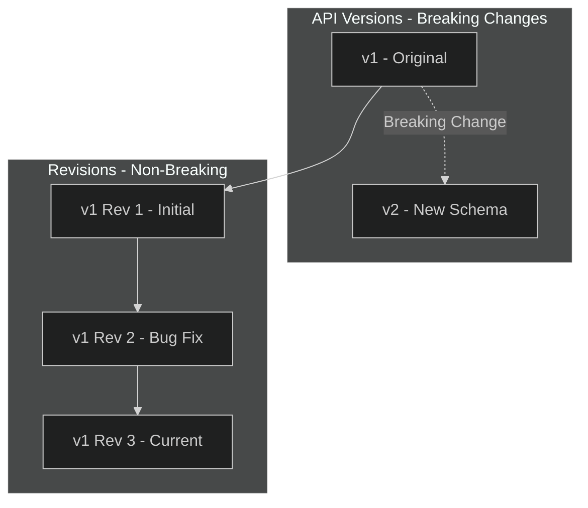
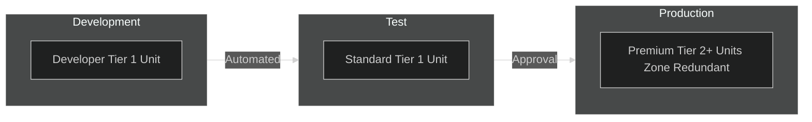

# 05 - DevOps & APIOps

> Infrastructure as Code, CI/CD pipelines, versioning, and deployment patterns

[](https://learn.microsoft.com/azure/well-architected/operational-excellence/checklist)

---

## 📋 WAF Workload Design Checklist

> Based on [Azure Well-Architected Framework - Operational Excellence](https://learn.microsoft.com/azure/well-architected/operational-excellence/checklist)

| # | Recommendation | Status |
|---|----------------|--------|
| ✅ | **(Service)** Review key knowledge: API lifecycle, DevOps, networking, monitoring, software dev | ☐ |
| ✅ | **(Service)** Document processes for service-level and API-level configuration | ☐ |
| ✅ | **(Service)** Adopt APIOps methods (GitOps, CI/CD) to publish and manage APIs | ☐ |
| ✅ | **(Service)** Use IaC tooling for service-level configuration changes | ☐ |
| ✅ | **(Service)** Integrate linter (e.g., Spectral) into API approval pipelines | ☐ |
| ✅ | **(Service)** Configure Azure diagnostics resource logs | ☐ |
| ✅ | **(Service)** Use Azure Event Grid for automation on lifecycle events (APICreated, etc.) | ☐ |
| ✅ | **(Service)** Apply Azure Policy to govern instance and align with requirements | ☐ |
| ✅ | **(API)** Always define backends using the `backends` feature of APIM | ☐ |
| ✅ | **(API)** Reference backends by ID in policy using `set-backend-service` | ☐ |
| ✅ | **(API)** Design versioning approach to align with APIM's versioning and revision capabilities | ☐ |
| ✅ | **(API)** Support API tracing in development only (not production) | ☐ |
| ✅ | **(Service & API)** Prefer IaC-based approach over portal-based management | ☐ |

---

## 🔔 Event Grid Automation

> WAF Recommendation: Use Event Grid for automation based on APIM lifecycle events

```bicep
// Event Grid System Topic for APIM
resource apimEventGridTopic 'Microsoft.EventGrid/systemTopics@2023-12-15-preview' = {
  name: 'evgt-apim-events'
  location: location
  properties: {
    source: apim.id
    topicType: 'Microsoft.ApiManagement.Service'
  }
}

// Subscription for API Created events
resource apiCreatedSubscription 'Microsoft.EventGrid/systemTopics/eventSubscriptions@2023-12-15-preview' = {
  name: 'api-created-notification'
  parent: apimEventGridTopic
  properties: {
    destination: {
      endpointType: 'AzureFunction'
      properties: {
        resourceId: notificationFunction.id
      }
    }
    filter: {
      includedEventTypes: [
        'Microsoft.ApiManagement.APICreated'
        'Microsoft.ApiManagement.APIUpdated'
        'Microsoft.ApiManagement.APIDeleted'
      ]
    }
  }
}
```

### Available APIM Event Types

| Event Type | Use Case |
|------------|----------|
| `APICreated` | Trigger governance checks, documentation updates |
| `APIUpdated` | Notify teams, audit logging |
| `APIDeleted` | Cleanup, archive documentation |
| `ProductCreated` | Billing integration |
| `SubscriptionCreated` | Onboarding workflows |
| `UserCreated` | Welcome emails, access provisioning |

---

## 🔧 Backend Service Configuration

> WAF Recommendation: Always define backends using the `backends` feature

### Define Backend (Bicep)

```bicep
resource backend 'Microsoft.ApiManagement/service/backends@2023-05-01-preview' = {
  name: 'backend-inventory-service'
  parent: apim
  properties: {
    url: 'https://inventory-api.internal.company.com'
    protocol: 'http'
    description: 'Inventory microservice backend'
    credentials: {
      header: {
        'x-functions-key': ['{{inventory-api-key}}']
      }
    }
    tls: {
      validateCertificateChain: true
      validateCertificateName: true
    }
  }
}

// Load-balanced backend pool
resource backendPool 'Microsoft.ApiManagement/service/backends@2023-05-01-preview' = {
  name: 'backend-pool-inventory'
  parent: apim
  properties: {
    url: 'http://placeholder'  // Required but overridden by pool
    protocol: 'http'
    type: 'Pool'
    pool: {
      services: [
        {
          id: '/backends/backend-inventory-primary'
          priority: 1
          weight: 3
        }
        {
          id: '/backends/backend-inventory-secondary'
          priority: 1
          weight: 1
        }
      ]
    }
  }
}
```

### Reference Backend in Policy

```xml
<!-- WAF Best Practice: Reference backend by ID, not URL -->
<inbound>
    <base />
    <set-backend-service backend-id="backend-inventory-service" />
</inbound>

<!-- Load-balanced backend pool -->
<inbound>
    <base />
    <set-backend-service backend-id="backend-pool-inventory" />
</inbound>
```

---

## 🎯 APIOps Overview

APIOps applies GitOps principles to API lifecycle management:

```mermaid
---
config:
  theme: dark
  flowchart:
    wrappingWidth: 180
    nodeSpacing: 50
    rankSpacing: 50
---
flowchart LR
    subgraph Dev["Development"]
        Code["API Specs OpenAPI"]
        Policy["Policies"]
        IaC["Bicep/Terraform"]
    end

    subgraph VCS["Version Control"]
        Git["Git Repository"]
    end

    subgraph CI["CI Pipeline"]
        Lint["Lint & Validate"]
        Test["API Tests"]
        Build["Build Artifacts"]
    end

    subgraph CD["CD Pipeline"]
        WhatIf["What-If / Plan"]
        Deploy["Deploy"]
        Smoke["Smoke Tests"]
    end

    subgraph Env["Environments"]
        DevEnv["Dev"]
        TestEnv["Test"]
        ProdEnv["Prod"]
    end

    Dev --> Git --> CI --> CD
    CD --> DevEnv --> TestEnv --> ProdEnv
```



---

## 🏗️ Infrastructure as Code

### Bicep Module Structure

```
modules/
├── api-management.bicep         # Core APIM resource
├── api-management-api.bicep     # API definitions
├── api-management-product.bicep # Products
├── api-management-policy.bicep  # Policies
├── keyvault-generic.bicep       # Key Vault
├── private-endpoint-*.bicep     # Private endpoints
└── roles/
    └── roles-keyvaultsecretsuser.bicep

scenarios/
└── apim.bicep                   # Complete deployment scenario

parameters/
├── apim.dev.json
├── apim.tst.json
└── apim.prd.json
```

### Core APIM Resource (Bicep)

```bicep
targetScope = 'resourceGroup'

@allowed(['prd', 'tst', 'dev'])
param phase string

param location string = resourceGroup().location
param tags object = {}
param apiManagementTier string
param apimSubnetResourceId string

var apimName = 'apim-${location}-${phase}-mesh'

resource apim 'Microsoft.ApiManagement/service@2023-05-01-preview' = {
  name: apimName
  location: location
  tags: tags
  sku: {
    capacity: phase == 'prd' ? 2 : 1
    name: apiManagementTier
  }
  identity: {
    type: 'SystemAssigned'
  }
  properties: {
    publisherName: 'Data Mesh'
    publisherEmail: 'datamesh@example.com'
    virtualNetworkType: 'Internal'
    virtualNetworkConfiguration: {
      subnetResourceId: apimSubnetResourceId
    }
    customProperties: {
      'Microsoft.WindowsAzure.ApiManagement.Gateway.Security.Protocols.Tls10': 'false'
      'Microsoft.WindowsAzure.ApiManagement.Gateway.Security.Protocols.Tls11': 'false'
      'Microsoft.WindowsAzure.ApiManagement.Gateway.Security.Protocols.Ssl30': 'false'
      'Microsoft.WindowsAzure.ApiManagement.Gateway.Security.Ciphers.TripleDes168': 'false'
      'Microsoft.WindowsAzure.ApiManagement.Gateway.Protocols.Server.Http2': 'true'
    }
  }
}

// Default global policy
resource apimPolicy 'Microsoft.ApiManagement/service/policies@2023-05-01-preview' = {
  name: 'policy'
  parent: apim
  properties: {
    format: 'rawxml'
    value: loadTextContent('../policies/global-policy.xml')
  }
}

output apimId string = apim.id
output apimName string = apim.name
output apimIdentityPrincipalId string = apim.identity.principalId
output apimPrivateIpAddress string = apim.properties.privateIPAddresses[0]
```

### Product Definition (Bicep)

```bicep
resource product 'Microsoft.ApiManagement/service/products@2023-05-01-preview' = {
  name: 'dataset-web-service-standard'
  parent: apim
  properties: {
    displayName: 'Dataset Web Service - Standard'
    description: 'Standard tier access to Dataset APIs'
    subscriptionRequired: true
    approvalRequired: true
    state: 'published'
    terms: 'By subscribing, you agree to the terms of service.'
  }
}

resource productPolicy 'Microsoft.ApiManagement/service/products/policies@2023-05-01-preview' = {
  name: 'policy'
  parent: product
  properties: {
    format: 'rawxml'
    value: '''
<policies>
    <inbound>
        <rate-limit calls="100" renewal-period="60" />
        <quota calls="10000" renewal-period="604800" />
        <base />
    </inbound>
    <backend><base /></backend>
    <outbound><base /></outbound>
</policies>
'''
  }
}
```

---

## 🔄 Azure DevOps Pipeline

### Complete Pipeline (YAML)

```yaml
# azure-pipelines.yml
trigger:
  branches:
    include:
      - main
  paths:
    include:
      - 'modules/api-management*.bicep'
      - 'scenarios/apim.bicep'
      - 'parameters/apim.*.json'

parameters:
  - name: environment
    displayName: 'Target Environment'
    type: string
    default: 'dev'
    values:
      - dev
      - tst
      - prd

variables:
  - name: serviceConnection
    value: 'Azure-${{ parameters.environment }}'
  - name: resourceGroup
    value: 'rg-apim-${{ parameters.environment }}'
  - name: location
    value: 'westeurope'

stages:
  - stage: Validate
    displayName: 'Validate Infrastructure'
    jobs:
      - job: ValidateBicep
        displayName: 'Validate Bicep'
        pool:
          vmImage: 'ubuntu-latest'
        steps:
          - task: AzureCLI@2
            displayName: 'Bicep Build'
            inputs:
              azureSubscription: $(serviceConnection)
              scriptType: 'bash'
              scriptLocation: 'inlineScript'
              inlineScript: |
                az bicep build --file scenarios/apim.bicep
          
          - task: AzureCLI@2
            displayName: 'What-If Deployment'
            inputs:
              azureSubscription: $(serviceConnection)
              scriptType: 'bash'
              scriptLocation: 'inlineScript'
              inlineScript: |
                az deployment sub what-if \
                  --location $(location) \
                  --template-file scenarios/apim.bicep \
                  --parameters @parameters/apim.${{ parameters.environment }}.json \
                  --parameters phase=${{ parameters.environment }}

  - stage: Deploy
    displayName: 'Deploy Infrastructure'
    dependsOn: Validate
    condition: succeeded()
    jobs:
      - deployment: DeployAPIM
        displayName: 'Deploy API Management'
        pool:
          vmImage: 'ubuntu-latest'
        environment: ${{ parameters.environment }}
        strategy:
          runOnce:
            deploy:
              steps:
                - checkout: self
                
                - task: AzureCLI@2
                  displayName: 'Deploy Bicep'
                  inputs:
                    azureSubscription: $(serviceConnection)
                    scriptType: 'bash'
                    scriptLocation: 'inlineScript'
                    inlineScript: |
                      az deployment sub create \
                        --location $(location) \
                        --template-file scenarios/apim.bicep \
                        --parameters @parameters/apim.${{ parameters.environment }}.json \
                        --parameters phase=${{ parameters.environment }} \
                        --name "apim-$(Build.BuildId)"

  - stage: Test
    displayName: 'API Tests'
    dependsOn: Deploy
    condition: succeeded()
    jobs:
      - job: SmokeTests
        displayName: 'Run Smoke Tests'
        pool:
          vmImage: 'ubuntu-latest'
        steps:
          - task: AzureCLI@2
            displayName: 'Health Check'
            inputs:
              azureSubscription: $(serviceConnection)
              scriptType: 'bash'
              scriptLocation: 'inlineScript'
              inlineScript: |
                # Get APIM gateway URL
                APIM_URL=$(az apim show \
                  --name apim-westeurope-${{ parameters.environment }}-mesh \
                  --resource-group $(resourceGroup) \
                  --query 'gatewayUrl' -o tsv)
                
                # Health check
                curl -f "${APIM_URL}/status-0123456789abcdef" || exit 1
```

---

## 📋 API Versioning Strategy

### Versioning Schemes

| Scheme | Example | Pros | Cons |
|--------|---------|------|------|
| **URL Path** | `/v1/users` | Clear, cacheable | URL changes |
| **Query String** | `?api-version=2024-01` | No URL change | Can be missed |
| **Header** | `X-API-Version: 1.0` | Clean URLs | Not visible |

### Bicep: API with Versions

```bicep
resource apiV1 'Microsoft.ApiManagement/service/apis@2023-05-01-preview' = {
  name: 'dataset-api-v1'
  parent: apim
  properties: {
    displayName: 'Dataset API'
    apiRevision: '1'
    apiVersion: 'v1'
    apiVersionSetId: apiVersionSet.id
    path: 'datasets'
    protocols: ['https']
    subscriptionRequired: true
  }
}

resource apiV2 'Microsoft.ApiManagement/service/apis@2023-05-01-preview' = {
  name: 'dataset-api-v2'
  parent: apim
  properties: {
    displayName: 'Dataset API'
    apiRevision: '1'
    apiVersion: 'v2'
    apiVersionSetId: apiVersionSet.id
    path: 'datasets'
    protocols: ['https']
    subscriptionRequired: true
  }
}

resource apiVersionSet 'Microsoft.ApiManagement/service/apiVersionSets@2023-05-01-preview' = {
  name: 'dataset-api-version-set'
  parent: apim
  properties: {
    displayName: 'Dataset API'
    versioningScheme: 'Segment'  // URL path: /v1/datasets, /v2/datasets
  }
}
```

### Revisions vs Versions



---

## 📦 API Definition Export/Import

### Export API Definition

```bash
# Export OpenAPI specification
az apim api export \
  --resource-group rg-apim-prod \
  --service-name apim-westeurope-prod-mesh \
  --api-id dataset-api \
  --export-format openapi+json \
  > api-specs/dataset-api.json
```

### Import from OpenAPI

```bicep
resource api 'Microsoft.ApiManagement/service/apis@2023-05-01-preview' = {
  name: 'dataset-api'
  parent: apim
  properties: {
    format: 'openapi+json'
    value: loadTextContent('../api-specs/dataset-api.json')
    path: 'datasets'
    protocols: ['https']
  }
}
```

---

## 🔐 Secrets in Pipelines

### Azure Key Vault Integration

```yaml
steps:
  - task: AzureKeyVault@2
    inputs:
      azureSubscription: $(serviceConnection)
      KeyVaultName: 'kv-apim-$(environment)'
      SecretsFilter: 'apim-subscription-key,backend-api-key'
      RunAsPreJob: true

  - task: AzureCLI@2
    displayName: 'Configure Named Values'
    inputs:
      azureSubscription: $(serviceConnection)
      scriptType: 'bash'
      scriptLocation: 'inlineScript'
      inlineScript: |
        az apim nv create \
          --resource-group $(resourceGroup) \
          --service-name $(apimName) \
          --named-value-id backend-api-key \
          --display-name "Backend API Key" \
          --secret true \
          --value "$(backend-api-key)"
```

---

## 📊 Deployment Environments



### Environment Parameters

```json
// parameters/apim.prd.json
{
  "$schema": "https://schema.management.azure.com/schemas/2019-04-01/deploymentParameters.json#",
  "contentVersion": "1.0.0.0",
  "parameters": {
    "configuration": {
      "value": {
        "targetResourceGroup": {
          "name": "rg-apim-prd",
          "location": "westeurope"
        },
        "apiManagementTier": "Premium",
        "apiManagementNetwork": {
          "resourceGroupName": "rg-network-prd",
          "vnetName": "vnet-hub-prd",
          "subnetApim": "snet-apim",
          "subnetKeyVault": "snet-pep"
        },
        "apiManagementCache": {
          "cacheDuration": 900,
          "cachePlan": "Standard"
        }
      }
    }
  }
}
```

---

## ✅ DevOps Checklist

### Repository Structure
- [ ] Bicep modules organized by resource type
- [ ] Parameter files per environment
- [ ] Policy files externalized
- [ ] API specs in version control

### CI Pipeline
- [ ] Bicep linting/validation
- [ ] What-if analysis
- [ ] API spec validation (Spectral)
- [ ] Unit tests for policies

### CD Pipeline
- [ ] Environment-specific deployments
- [ ] Approval gates for production
- [ ] Smoke tests post-deployment
- [ ] Rollback capability

### Governance
- [ ] Branch protection rules
- [ ] Code review requirements
- [ ] Automated security scanning
- [ ] Audit logging

---

## 🔗 Related Documents

| Document | Description |
|----------|-------------|
| [02-Reliability](./02-reliability.md) | DR and backup strategies |
| [06-Monitoring](./06-monitoring.md) | Deployment monitoring |
| [10-Repository-Examples](./10-repository-examples.md) | Pipeline examples |

---

> **Next**: [06-Monitoring](./06-monitoring.md) - Metrics, alerts, and observability
