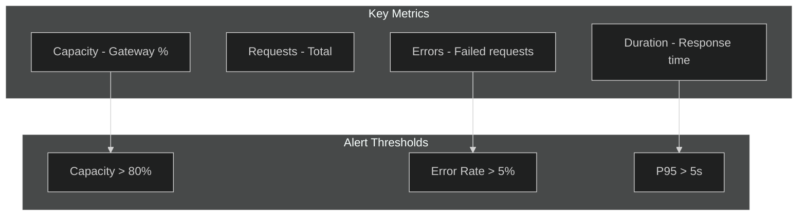

# 06 - Monitoring & Observability

> Metrics, logging, Application Insights, and alerting for API Management

[](https://learn.microsoft.com/azure/well-architected/operational-excellence/checklist)
[](https://learn.microsoft.com/azure/well-architected/performance-efficiency/checklist)

---

## 📋 WAF Workload Design Checklist

> Based on [Azure Well-Architected Framework - Observability](https://learn.microsoft.com/azure/api-management/observability)

| # | Recommendation | Status |
|---|----------------|--------|
| ✅ | **(Service)** Configure Azure diagnostics resource logs | ☐ |
| ✅ | **(Service)** Review observability capabilities (Azure Monitor, App Insights, built-in analytics) | ☐ |
| ✅ | **(Service)** Familiarize with "Diagnose and solve problems" in Azure portal | ☐ |
| ✅ | **(Service)** Use Network status blade for connectivity troubleshooting | ☐ |
| ✅ | **(API)** Use Event Hubs for near real-time log/event streams | ☐ |
| ✅ | **(API)** Support API tracing in development only (not production) | ☐ |
| ✅ | **(Service & API)** Define Application Insights sampling percentage for balance | ☐ |
| ✅ | **(Service & API)** Collect performance metrics: request time, resource usage, throughput, cache hit | ☐ |
| ✅ | **(Service & API)** Collect reliability metrics: rate limit violations, error rate, health checks | ☐ |

---

## ⚙️ Application Insights Sampling

> WAF Recommendation: Define sampling percentage for sufficient visibility without performance impact

```bicep
resource apimLogger 'Microsoft.ApiManagement/service/loggers@2023-05-01-preview' = {
  name: 'appinsights-logger'
  parent: apim
  properties: {
    loggerType: 'applicationInsights'
    credentials: {
      instrumentationKey: appInsights.properties.InstrumentationKey
    }
    isBuffered: true
  }
}

resource apiDiagnostics 'Microsoft.ApiManagement/service/diagnostics@2023-05-01-preview' = {
  name: 'applicationinsights'
  parent: apim
  properties: {
    alwaysLog: 'allErrors'
    loggerId: apimLogger.id
    sampling: {
      samplingType: 'fixed'
      percentage: 25  // WAF: Balance visibility vs performance
    }
    frontend: {
      request: {
        headers: ['X-Correlation-ID', 'X-Request-ID']
        body: {
          bytes: 1024  // Limit body logging
        }
      }
      response: {
        headers: ['X-Correlation-ID']
        body: {
          bytes: 1024
        }
      }
    }
    backend: {
      request: {
        headers: []
        body: {
          bytes: 0
        }
      }
      response: {
        headers: []
        body: {
          bytes: 0
        }
      }
    }
  }
}
```

### Sampling Guidance

| Environment | Sampling % | Rationale |
|-------------|-----------|-----------|
| Development | 100% | Full visibility for debugging |
| Test | 50% | Balance during load tests |
| Production | 10-25% | Performance over visibility |
| Critical APIs | 50-100% | Higher visibility for key flows |

---

## 📨 Event Hubs for Real-Time Streaming

> WAF Recommendation: Use Event Hubs for near real-time log availability

```bicep
resource eventHubLogger 'Microsoft.ApiManagement/service/loggers@2023-05-01-preview' = {
  name: 'eventhub-logger'
  parent: apim
  properties: {
    loggerType: 'azureEventHub'
    credentials: {
      connectionString: eventHubNamespace.listKeys().primaryConnectionString
      name: 'apim-logs'
    }
    isBuffered: true
  }
}
```

### Log to Event Hub Policy

```xml
<outbound>
    <log-to-eventhub logger-id="eventhub-logger">@{
        return new JObject(
            new JProperty("timestamp", DateTime.UtcNow),
            new JProperty("correlationId", context.RequestId),
            new JProperty("api", context.Api.Name),
            new JProperty("operation", context.Operation.Name),
            new JProperty("statusCode", context.Response.StatusCode),
            new JProperty("duration", context.Elapsed.TotalMilliseconds),
            new JProperty("subscriptionId", context.Subscription?.Id ?? "anonymous")
        ).ToString();
    }</log-to-eventhub>
</outbound>
```

---

## 🔧 Diagnose and Solve Problems

> WAF Recommendation: Use Azure portal's built-in diagnostics

| Blade | Purpose |
|-------|---------|
| **Diagnose and solve problems** | Guided troubleshooting for common issues |
| **Network status** | VNet connectivity, DNS resolution, NSG rules |
| **API Management Diagnostics** | Capacity, performance, availability recommendations |
| **Resource health** | Azure platform health events |

---

## 🎯 Observability Goals

| Area | Tool | Purpose |
|------|------|---------|
| **Metrics** | Azure Monitor | Capacity, requests, latency |
| **Logs** | Log Analytics | Diagnostic logs, audit |
| **Tracing** | Application Insights | End-to-end request tracing |
| **Real-time** | Event Hubs | Stream processing |
| **Security** | Defender for APIs | Threat detection |

---

## 📊 Key Metrics

### Capacity & Performance



### Metric Reference

| Metric | Description | Aggregation | Alert Threshold |
|--------|-------------|-------------|-----------------|
| **Capacity** | Gateway CPU/memory utilization | Average | > 80% |
| **Requests** | Total API requests | Sum | Baseline ± 50% |
| **SuccessfulRequests** | 2xx responses | Sum | Baseline |
| **FailedRequests** | 4xx + 5xx responses | Sum | > 5% |
| **TotalRequests** | All requests | Sum | Baseline |
| **Duration** | End-to-end latency | Average, P95 | P95 > 5s |
| **BackendDuration** | Backend response time | Average, P95 | P95 > 3s |
| **EventHubDroppedEvents** | Lost log events | Sum | > 0 |
| **EventHubRejectedEvents** | Rejected events | Sum | > 0 |

---

## 🔍 Diagnostic Settings

### Enable Diagnostics (Bicep)

```bicep
resource diagnosticSettings 'Microsoft.Insights/diagnosticSettings@2021-05-01-preview' = {
  name: 'apim-diagnostics'
  scope: apim
  properties: {
    workspaceId: logAnalyticsWorkspace.id
    logs: [
      {
        category: 'GatewayLogs'
        enabled: true
        retentionPolicy: {
          enabled: true
          days: 90
        }
      }
      {
        category: 'WebSocketConnectionLogs'
        enabled: true
      }
    ]
    metrics: [
      {
        category: 'AllMetrics'
        enabled: true
        retentionPolicy: {
          enabled: true
          days: 90
        }
      }
    ]
  }
}
```

### Log Categories

| Category | Description | Use Case |
|----------|-------------|----------|
| **GatewayLogs** | All API requests/responses | Troubleshooting, analytics |
| **WebSocketConnectionLogs** | WebSocket connections | Real-time API monitoring |
| **DeveloperPortalAuditLogs** | Portal actions | Security audit |

---

## 📈 Application Insights Integration

### Configure Application Insights (Bicep)

```bicep
resource appInsights 'Microsoft.Insights/components@2020-02-02' = {
  name: 'appi-${apimName}'
  location: location
  kind: 'web'
  properties: {
    Application_Type: 'web'
    WorkspaceResourceId: logAnalyticsWorkspace.id
  }
}

resource apimLogger 'Microsoft.ApiManagement/service/loggers@2023-05-01-preview' = {
  name: 'appinsights-logger'
  parent: apim
  properties: {
    loggerType: 'applicationInsights'
    credentials: {
      instrumentationKey: appInsights.properties.InstrumentationKey
    }
    isBuffered: true
  }
}

resource apimDiagnostics 'Microsoft.ApiManagement/service/diagnostics@2023-05-01-preview' = {
  name: 'applicationinsights'
  parent: apim
  properties: {
    loggerId: apimLogger.id
    alwaysLog: 'allErrors'
    sampling: {
      percentage: 100
      samplingType: 'fixed'
    }
    frontend: {
      request: {
        headers: ['X-Correlation-Id', 'X-Request-Id']
        body: { bytes: 1024 }
      }
      response: {
        headers: ['X-Correlation-Id']
        body: { bytes: 1024 }
      }
    }
    backend: {
      request: {
        headers: ['Authorization']
        body: { bytes: 1024 }
      }
      response: {
        body: { bytes: 1024 }
      }
    }
  }
}
```

### Sampling Recommendations

| Environment | Sampling % | Rationale |
|-------------|------------|-----------|
| **Development** | 100% | Full visibility |
| **Test** | 100% | Complete test coverage |
| **Production (Low Traffic)** | 50-100% | Sufficient data |
| **Production (High Traffic)** | 10-25% | Cost optimization |

---

## 🚨 Alerting

### Alert Configuration (Bicep)

```bicep
resource actionGroup 'Microsoft.Insights/actionGroups@2023-01-01' = {
  name: 'ag-apim-alerts'
  location: 'global'
  properties: {
    groupShortName: 'APIMAlerts'
    enabled: true
    emailReceivers: [
      {
        name: 'Platform Team'
        emailAddress: 'platform-team@example.com'
        useCommonAlertSchema: true
      }
    ]
    azureAppPushReceivers: []
    smsReceivers: []
    webhookReceivers: []
  }
}

// Capacity Alert
resource capacityAlert 'Microsoft.Insights/metricAlerts@2018-03-01' = {
  name: 'alert-apim-capacity'
  location: 'global'
  properties: {
    description: 'APIM capacity exceeded 80%'
    severity: 2
    enabled: true
    scopes: [apim.id]
    evaluationFrequency: 'PT1M'
    windowSize: 'PT5M'
    criteria: {
      'odata.type': 'Microsoft.Azure.Monitor.SingleResourceMultipleMetricCriteria'
      allOf: [
        {
          name: 'CapacityHigh'
          metricName: 'Capacity'
          operator: 'GreaterThan'
          threshold: 80
          timeAggregation: 'Average'
        }
      ]
    }
    actions: [
      { actionGroupId: actionGroup.id }
    ]
  }
}

// Error Rate Alert
resource errorRateAlert 'Microsoft.Insights/metricAlerts@2018-03-01' = {
  name: 'alert-apim-error-rate'
  location: 'global'
  properties: {
    description: 'High error rate detected'
    severity: 1
    enabled: true
    scopes: [apim.id]
    evaluationFrequency: 'PT1M'
    windowSize: 'PT5M'
    criteria: {
      'odata.type': 'Microsoft.Azure.Monitor.SingleResourceMultipleMetricCriteria'
      allOf: [
        {
          name: 'HighErrorRate'
          metricName: 'FailedRequests'
          operator: 'GreaterThan'
          threshold: 100
          timeAggregation: 'Total'
        }
      ]
    }
    actions: [
      { actionGroupId: actionGroup.id }
    ]
  }
}

// Backend Latency Alert
resource latencyAlert 'Microsoft.Insights/metricAlerts@2018-03-01' = {
  name: 'alert-apim-backend-latency'
  location: 'global'
  properties: {
    description: 'Backend response time exceeded threshold'
    severity: 2
    enabled: true
    scopes: [apim.id]
    evaluationFrequency: 'PT1M'
    windowSize: 'PT5M'
    criteria: {
      'odata.type': 'Microsoft.Azure.Monitor.SingleResourceMultipleMetricCriteria'
      allOf: [
        {
          name: 'SlowBackend'
          metricName: 'BackendDuration'
          operator: 'GreaterThan'
          threshold: 5000
          timeAggregation: 'Average'
        }
      ]
    }
    actions: [
      { actionGroupId: actionGroup.id }
    ]
  }
}
```

### Alert Matrix

| Alert | Metric | Threshold | Severity | Action |
|-------|--------|-----------|----------|--------|
| **Critical Capacity** | Capacity | > 90% | 0 (Critical) | Page on-call |
| **High Capacity** | Capacity | > 80% | 2 (Warning) | Email team |
| **High Error Rate** | FailedRequests | > 5% | 1 (Error) | Page on-call |
| **Backend Slow** | BackendDuration | P95 > 5s | 2 (Warning) | Email team |
| **Gateway Errors** | Requests (5xx) | > 10/min | 1 (Error) | Page on-call |

---

## 📝 Log Analytics Queries

### Top Failed APIs

```kusto
ApiManagementGatewayLogs
| where TimeGenerated > ago(1h)
| where ResponseCode >= 400
| summarize FailedRequests = count() by ApiId, OperationId, ResponseCode
| order by FailedRequests desc
| take 10
```

### Latency Analysis

```kusto
ApiManagementGatewayLogs
| where TimeGenerated > ago(1h)
| summarize 
    AvgDuration = avg(TotalTime),
    P50 = percentile(TotalTime, 50),
    P95 = percentile(TotalTime, 95),
    P99 = percentile(TotalTime, 99)
    by bin(TimeGenerated, 5m), ApiId
| order by TimeGenerated desc
```

### Top Consumers

```kusto
ApiManagementGatewayLogs
| where TimeGenerated > ago(24h)
| summarize 
    RequestCount = count(),
    AvgLatency = avg(TotalTime)
    by SubscriptionId
| order by RequestCount desc
| take 20
```

### Error Distribution

```kusto
ApiManagementGatewayLogs
| where TimeGenerated > ago(1h)
| where ResponseCode >= 400
| summarize Count = count() by ResponseCode
| render piechart
```

### Rate Limit Violations

```kusto
ApiManagementGatewayLogs
| where TimeGenerated > ago(1h)
| where ResponseCode == 429
| summarize Count = count() by SubscriptionId, ApiId
| order by Count desc
```

---

## 📊 Built-in Analytics Dashboard

### Access Analytics

1. Azure Portal → API Management → **Analytics**
2. View pre-built reports:
   - **Timeline** - Request trends
   - **Geography** - Request origins
   - **APIs** - Per-API statistics
   - **Products** - Product usage
   - **Subscriptions** - Consumer analytics
   - **Users** - Developer activity

### Export to Power BI

```kusto
// Export query for Power BI
ApiManagementGatewayLogs
| where TimeGenerated > ago(30d)
| project 
    TimeGenerated,
    ApiId,
    OperationId,
    SubscriptionId,
    ResponseCode,
    TotalTime,
    BackendTime,
    ClientTime,
    RequestSize,
    ResponseSize
```

---

## 🛡️ Defender for APIs

### Enable Defender

```bicep
resource defenderForApis 'Microsoft.Security/pricings@2023-01-01' = {
  name: 'Api'
  properties: {
    pricingTier: 'Standard'
    subPlan: 'P1'
  }
}
```

### Defender Capabilities

| Capability | Description |
|------------|-------------|
| **API Discovery** | Automatic inventory of APIs |
| **Security Posture** | Configuration recommendations |
| **Threat Detection** | OWASP attack detection |
| **Anomaly Detection** | ML-based unusual patterns |
| **Integration** | Microsoft Sentinel alerts |

---

## 🔄 Real-time Streaming (Event Hubs)

### Event Hub Logger (Bicep)

```bicep
resource eventHubLogger 'Microsoft.ApiManagement/service/loggers@2023-05-01-preview' = {
  name: 'eventhub-logger'
  parent: apim
  properties: {
    loggerType: 'azureEventHub'
    credentials: {
      name: 'apim-logs'
      connectionString: eventHubNamespace.listKeys().primaryConnectionString
    }
    isBuffered: true
  }
}
```

### Log to Event Hub Policy

```xml
<log-to-eventhub logger-id="eventhub-logger" partition-id="0">@{
    return new JObject(
        new JProperty("timestamp", DateTime.UtcNow.ToString("o")),
        new JProperty("requestId", context.RequestId.ToString()),
        new JProperty("api", context.Api.Name),
        new JProperty("operation", context.Operation.Name),
        new JProperty("subscriptionId", context.Subscription?.Id),
        new JProperty("statusCode", context.Response.StatusCode),
        new JProperty("duration", context.Elapsed.TotalMilliseconds),
        new JProperty("clientIp", context.Request.IpAddress)
    ).ToString();
}</log-to-eventhub>
```

---

## ✅ Monitoring Checklist

### Setup
- [ ] Diagnostic settings enabled
- [ ] Log Analytics workspace configured
- [ ] Application Insights connected
- [ ] Sampling percentage set appropriately

### Alerts
- [ ] Capacity alerts (warning & critical)
- [ ] Error rate alerts
- [ ] Latency alerts
- [ ] Rate limit violation alerts
- [ ] Action groups configured

### Dashboards
- [ ] Built-in analytics reviewed
- [ ] Custom Log Analytics dashboards
- [ ] Power BI reports (if needed)

### Security
- [ ] Defender for APIs enabled
- [ ] Security recommendations reviewed
- [ ] Threat detection alerts configured

---

## 🔗 Related Documents

| Document | Description |
|----------|-------------|
| [02-Reliability](./02-reliability.md) | Capacity-based scaling |
| [03-Security](./03-security.md) | Security monitoring |
| [04-Policies](./04-policies.md) | Logging policies |

---

> **Next**: [07-AI-Gateway](./07-ai-gateway.md) - OpenAI and LLM integration
