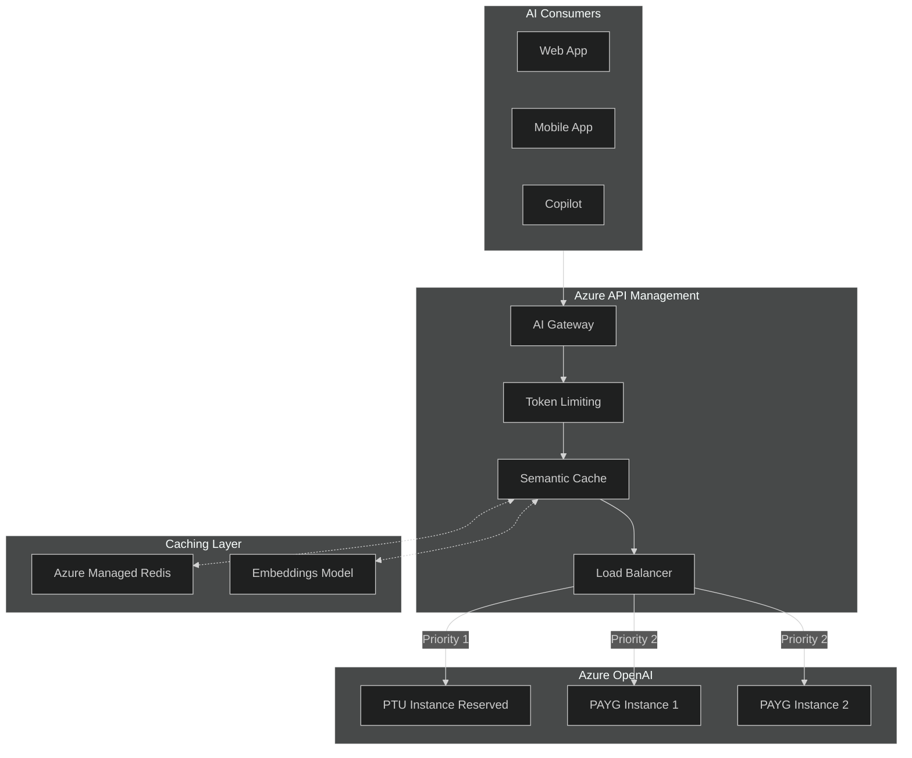
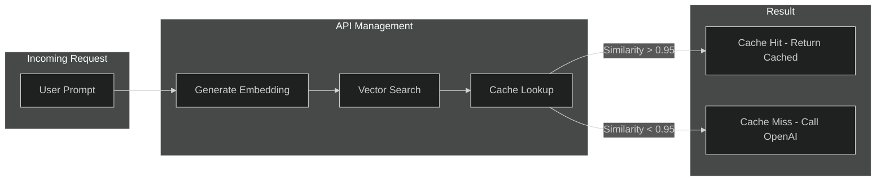

# 07 - AI Gateway

> Azure OpenAI integration, token limiting, semantic caching, and load balancing

---

## 🎯 AI Gateway Use Cases

| Use Case | APIM Capability |
|----------|-----------------|
| **Token Rate Limiting** | `llm-token-limit` policy |
| **Semantic Caching** | Redis + embeddings |
| **Load Balancing** | Backend pools with priority/weight |
| **Circuit Breaker** | Automatic failover |
| **Cost Tracking** | Token metering per subscription |
| **Streaming** | Server-Sent Events (SSE) |

---

## 🏗️ AI Gateway Architecture



---

## ⚡ Token Rate Limiting

### LLM Token Limit Policy

```xml
<inbound>
    <base />
    <!-- Token-based rate limiting for Azure OpenAI -->
    <llm-token-limit
        tokens-per-minute="10000"
        counter-key="@(context.Subscription.Id)"
        estimate-prompt-tokens="true"
        tokens-consumed-header-name="x-]tokens-consumed"
        remaining-tokens-header-name="x-tokens-remaining" />
</inbound>

<outbound>
    <base />
    <!-- Add token usage to response headers -->
    <set-header name="x-prompt-tokens" exists-action="override">
        <value>@(context.Response.Headers.GetValueOrDefault("x-ms-prompt-tokens", "0"))</value>
    </set-header>
    <set-header name="x-completion-tokens" exists-action="override">
        <value>@(context.Response.Headers.GetValueOrDefault("x-ms-completion-tokens", "0"))</value>
    </set-header>
</outbound>
```

### Token Quota per Subscription

```xml
<inbound>
    <!-- Monthly token quota -->
    <llm-token-limit
        tokens-per-minute="50000"
        counter-key="@(context.Subscription.Id)"
        estimate-prompt-tokens="true"
        retry-after-header-name="Retry-After" />
    
    <!-- Alternative: Custom quota tracking -->
    <cache-lookup-value 
        key="@("token-usage-" + context.Subscription.Id)" 
        variable-name="tokenUsage" 
        caching-type="external" />
</inbound>
```

---

## 💾 Semantic Caching

### How Semantic Caching Works



### Semantic Cache Policy

```xml
<inbound>
    <base />
    <!-- Semantic cache with Azure Managed Redis -->
    <llm-semantic-cache-lookup
        score-threshold="0.95"
        embeddings-backend-id="embeddings-backend"
        embeddings-backend-auth="system-assigned" />
</inbound>

<outbound>
    <base />
    <!-- Store response in semantic cache -->
    <llm-semantic-cache-store duration="3600" />
</outbound>
```

### Redis Configuration for Semantic Cache

```bicep
resource redis 'Microsoft.Cache/redisEnterprise@2023-11-01' = {
  name: 'redis-apim-ai-cache'
  location: location
  sku: {
    name: 'Enterprise_E10'
    capacity: 2
  }
  properties: {
    minimumTlsVersion: '1.2'
  }
}

resource redisDatabase 'Microsoft.Cache/redisEnterprise/databases@2023-11-01' = {
  parent: redis
  name: 'default'
  properties: {
    clientProtocol: 'Encrypted'
    evictionPolicy: 'NoEviction'
    modules: [
      {
        name: 'RediSearch'
      }
      {
        name: 'RedisJSON'
      }
    ]
  }
}
```

---

## ⚖️ Load Balancing OpenAI Instances

### Backend Pool Configuration

```bicep
resource openaiBackend 'Microsoft.ApiManagement/service/backends@2023-05-01-preview' = {
  name: 'openai-backend-pool'
  parent: apim
  properties: {
    type: 'Pool'
    pool: {
      services: [
        {
          id: '/backends/openai-ptu-eastus'
          priority: 1        // PTU first (reserved capacity)
          weight: 1
        }
        {
          id: '/backends/openai-payg-westus'
          priority: 2        // PAYG as fallback
          weight: 3
        }
        {
          id: '/backends/openai-payg-northeu'
          priority: 2
          weight: 1
        }
      ]
    }
  }
}
```

### Individual Backend Definitions

```bicep
resource openaiPtuBackend 'Microsoft.ApiManagement/service/backends@2023-05-01-preview' = {
  name: 'openai-ptu-eastus'
  parent: apim
  properties: {
    url: 'https://aoai-ptu-eastus.openai.azure.com/openai'
    protocol: 'http'
    circuitBreaker: {
      rules: [
        {
          name: 'openai-circuit-breaker'
          failureCondition: {
            count: 5
            interval: 'PT1M'
            statusCodeRanges: [
              { min: 429, max: 429 }
              { min: 500, max: 599 }
            ]
          }
          tripDuration: 'PT1M'
        }
      ]
    }
  }
}
```

### Load Balancing Policy

```xml
<inbound>
    <base />
    <!-- Route to backend pool with automatic failover -->
    <set-backend-service backend-id="openai-backend-pool" />
    
    <!-- Authentication via managed identity -->
    <authentication-managed-identity resource="https://cognitiveservices.azure.com" />
</inbound>

<backend>
    <!-- Retry on transient failures -->
    <retry condition="@(context.Response.StatusCode == 429 || context.Response.StatusCode >= 500)"
           count="3"
           interval="1"
           delta="1"
           max-interval="10"
           first-fast-retry="true">
        <forward-request buffer-request-body="true" />
    </retry>
</backend>
```

---

## 🔄 Streaming Support (SSE)

### Streaming Configuration

```xml
<inbound>
    <base />
    <!-- Disable buffering for streaming responses -->
    <set-header name="Accept" exists-action="override">
        <value>text/event-stream</value>
    </set-header>
</inbound>

<backend>
    <!-- Forward with streaming enabled -->
    <forward-request timeout="120" buffer-request-body="true" buffer-response="false" />
</backend>

<outbound>
    <base />
    <!-- Ensure streaming headers -->
    <set-header name="Content-Type" exists-action="override">
        <value>text/event-stream</value>
    </set-header>
    <set-header name="Cache-Control" exists-action="override">
        <value>no-cache</value>
    </set-header>
</outbound>
```

---

## 📊 Token Usage Tracking

### Log Token Usage to Event Hub

```xml
<outbound>
    <base />
    <!-- Extract token usage from response -->
    <set-variable name="promptTokens" 
                  value="@(context.Response.Headers.GetValueOrDefault("x-ms-prompt-tokens", "0"))" />
    <set-variable name="completionTokens" 
                  value="@(context.Response.Headers.GetValueOrDefault("x-ms-completion-tokens", "0"))" />
    
    <!-- Log to Event Hub for billing/analytics -->
    <log-to-eventhub logger-id="token-usage-logger">@{
        return new JObject(
            new JProperty("timestamp", DateTime.UtcNow.ToString("o")),
            new JProperty("subscriptionId", context.Subscription?.Id),
            new JProperty("model", context.Request.Headers.GetValueOrDefault("x-model", "unknown")),
            new JProperty("promptTokens", context.Variables["promptTokens"]),
            new JProperty("completionTokens", context.Variables["completionTokens"]),
            new JProperty("totalTokens", 
                int.Parse((string)context.Variables["promptTokens"]) + 
                int.Parse((string)context.Variables["completionTokens"]))
        ).ToString();
    }</log-to-eventhub>
</outbound>
```

---

## 🔐 AI Gateway Security

### Content Filtering

```xml
<inbound>
    <base />
    <!-- Block prompt injection patterns -->
    <choose>
        <when condition="@(context.Request.Body.As<JObject>()["messages"]
                         .Any(m => m["content"].ToString().Contains("ignore previous instructions")))">
            <return-response>
                <set-status code="400" reason="Bad Request" />
                <set-body>{"error": "Request contains prohibited content"}</set-body>
            </return-response>
        </when>
    </choose>
</inbound>
```

### Rate Limiting by Model

```xml
<inbound>
    <base />
    <choose>
        <!-- GPT-4 - stricter limits -->
        <when condition="@(context.Request.MatchedParameters["deployment-id"] == "gpt-4")">
            <llm-token-limit tokens-per-minute="5000" counter-key="@(context.Subscription.Id)" />
        </when>
        <!-- GPT-3.5 - higher limits -->
        <when condition="@(context.Request.MatchedParameters["deployment-id"] == "gpt-35-turbo")">
            <llm-token-limit tokens-per-minute="50000" counter-key="@(context.Subscription.Id)" />
        </when>
    </choose>
</inbound>
```

---

## 📋 Complete AI Gateway Policy

```xml
<policies>
    <inbound>
        <base />
        
        <!-- 1. Token Rate Limiting -->
        <llm-token-limit
            tokens-per-minute="10000"
            counter-key="@(context.Subscription.Id)"
            estimate-prompt-tokens="true"
            tokens-consumed-header-name="x-tokens-consumed"
            remaining-tokens-header-name="x-tokens-remaining" />
        
        <!-- 2. Semantic Cache Lookup -->
        <llm-semantic-cache-lookup
            score-threshold="0.95"
            embeddings-backend-id="embeddings-backend"
            embeddings-backend-auth="system-assigned" />
        
        <!-- 3. Set Backend Pool -->
        <set-backend-service backend-id="openai-backend-pool" />
        
        <!-- 4. Authenticate with Managed Identity -->
        <authentication-managed-identity resource="https://cognitiveservices.azure.com" />
    </inbound>
    
    <backend>
        <retry condition="@(context.Response.StatusCode == 429 || context.Response.StatusCode >= 500)"
               count="3"
               interval="1"
               first-fast-retry="true">
            <forward-request buffer-request-body="true" />
        </retry>
    </backend>
    
    <outbound>
        <base />
        
        <!-- Store in Semantic Cache -->
        <llm-semantic-cache-store duration="3600" />
        
        <!-- Add Usage Headers -->
        <set-header name="x-tokens-used" exists-action="override">
            <value>@(context.Response.Headers.GetValueOrDefault("x-ms-total-tokens", "0"))</value>
        </set-header>
    </outbound>
    
    <on-error>
        <base />
        <set-header name="Content-Type" exists-action="override">
            <value>application/json</value>
        </set-header>
        <return-response>
            <set-status code="500" />
            <set-body>@{
                return new JObject(
                    new JProperty("error", "AI Gateway Error"),
                    new JProperty("requestId", context.RequestId.ToString())
                ).ToString();
            }</set-body>
        </return-response>
    </on-error>
</policies>
```

---

## ✅ AI Gateway Checklist

- [ ] Token rate limiting configured per tier
- [ ] Backend pool with PTU primary, PAYG fallback
- [ ] Circuit breaker for 429/5xx responses
- [ ] Managed identity for OpenAI authentication
- [ ] Semantic caching with Redis Enterprise
- [ ] Streaming support for chat completions
- [ ] Token usage logging to Event Hub
- [ ] Content filtering for prompt injection

---

## 🔗 Related Documents

| Document | Description |
|----------|-------------|
| [04-Policies](./04-policies.md) | General policy patterns |
| [06-Monitoring](./06-monitoring.md) | Token usage monitoring |
| [09-Cost-Optimization](./09-cost-optimization.md) | AI cost management |

---

> **Next**: [08-Self-Hosted-Gateway](./08-self-hosted-gateway.md) - Kubernetes and hybrid deployment
