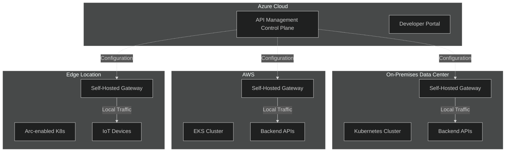
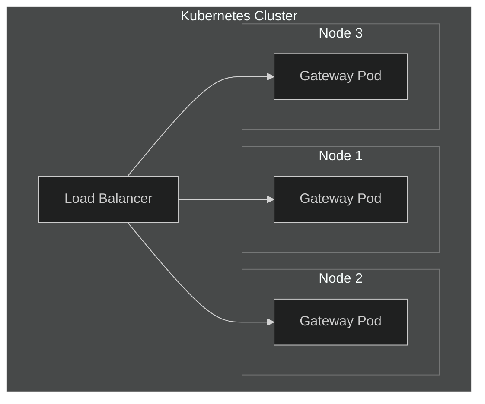

# 08 - Self-Hosted Gateway

> Kubernetes deployment, hybrid scenarios, and multi-cloud patterns

---

## 🎯 When to Use Self-Hosted Gateway

| Scenario | Benefit |
|----------|---------|
| **On-premises APIs** | Reduce latency, data stays local |
| **Multi-cloud** | APIs in AWS/GCP with APIM control |
| **Data sovereignty** | Traffic doesn't cross borders |
| **Edge computing** | IoT and edge scenarios |
| **Low latency** | Co-locate gateway with backends |
| **Disconnected** | Operate during cloud connectivity issues |

---

## 🏗️ Architecture



---

## 📋 Prerequisites

| Requirement | Details |
|-------------|---------|
| **APIM Tier** | Developer or Premium |
| **Container Platform** | Kubernetes, Docker, Azure Arc |
| **Connectivity** | Outbound HTTPS to APIM |
| **Kubernetes Version** | 1.19+ |

---

## 🚀 Deployment Options

### Option 1: Kubernetes YAML

#### Step 1: Provision Gateway in Azure

```bicep
resource selfHostedGateway 'Microsoft.ApiManagement/service/gateways@2023-05-01-preview' = {
  name: 'on-premises-gateway'
  parent: apim
  properties: {
    description: 'Self-hosted gateway for on-premises APIs'
    locationData: {
      name: 'On-Premises Data Center'
      countryOrRegion: 'Netherlands'
    }
  }
}
```

#### Step 2: Create Kubernetes Secret

```bash
# Get gateway token from Azure Portal or CLI
az apim gateway token create \
  --resource-group rg-apim-prod \
  --service-name apim-westeurope-prod-mesh \
  --gateway-name on-premises-gateway \
  --expiry "2025-12-31T23:59:59Z"

# Create Kubernetes secret
kubectl create secret generic apim-gateway-token \
  --from-literal=value="GatewayKey <token>" \
  --type=Opaque
```

#### Step 3: Deploy to Kubernetes

```yaml
# apim-gateway.yaml
apiVersion: v1
kind: ConfigMap
metadata:
  name: apim-gateway-config
data:
  config.service.endpoint: "https://apim-westeurope-prod-mesh.configuration.azure-api.net"
---
apiVersion: apps/v1
kind: Deployment
metadata:
  name: apim-gateway
spec:
  replicas: 2
  selector:
    matchLabels:
      app: apim-gateway
  template:
    metadata:
      labels:
        app: apim-gateway
    spec:
      containers:
      - name: apim-gateway
        image: mcr.microsoft.com/azure-api-management/gateway:v2
        ports:
        - containerPort: 8080
          name: http
        - containerPort: 8081
          name: https
        env:
        - name: config.service.auth
          valueFrom:
            secretKeyRef:
              name: apim-gateway-token
              key: value
        - name: config.service.endpoint
          valueFrom:
            configMapKeyRef:
              name: apim-gateway-config
              key: config.service.endpoint
        - name: net.server.http.forwarded.proto.enabled
          value: "true"
        resources:
          requests:
            cpu: "500m"
            memory: "512Mi"
          limits:
            cpu: "1000m"
            memory: "1Gi"
        readinessProbe:
          httpGet:
            path: /status-0123456789abcdef
            port: 8080
          initialDelaySeconds: 10
          periodSeconds: 5
        livenessProbe:
          httpGet:
            path: /status-0123456789abcdef
            port: 8080
          initialDelaySeconds: 30
          periodSeconds: 10
---
apiVersion: v1
kind: Service
metadata:
  name: apim-gateway
spec:
  type: LoadBalancer
  ports:
  - port: 80
    targetPort: 8080
    name: http
  - port: 443
    targetPort: 8081
    name: https
  selector:
    app: apim-gateway
```

### Option 2: Helm Chart

```bash
# Add Azure APIM Helm repository
helm repo add azure-apim-gateway https://azure.github.io/api-management-self-hosted-gateway/helm-charts/
helm repo update

# Install self-hosted gateway
helm install apim-gateway azure-apim-gateway/azure-api-management-gateway \
  --set gateway.configuration.uri="https://apim-westeurope-prod-mesh.configuration.azure-api.net" \
  --set gateway.auth.key="<gateway-token>" \
  --set service.type=LoadBalancer \
  --set replicaCount=2
```

### Option 3: Azure Arc Extension

```bash
# Install APIM gateway as Arc extension
az k8s-extension create \
  --name apim-gateway \
  --extension-type Microsoft.ApiManagement.Gateway \
  --scope cluster \
  --cluster-name my-arc-cluster \
  --resource-group rg-arc \
  --cluster-type connectedClusters \
  --configuration-settings \
    gateway.configuration.uri="https://apim-prod.configuration.azure-api.net" \
  --configuration-protected-settings \
    gateway.auth.key="<token>"
```

---

## 🔧 Configuration Options

### Environment Variables

| Variable | Description | Default |
|----------|-------------|---------|
| `config.service.endpoint` | APIM configuration endpoint | Required |
| `config.service.auth` | Gateway authentication token | Required |
| `config.service.refreshInterval` | Config refresh interval | 30s |
| `telemetry.logs.std` | Log to stdout | true |
| `telemetry.logs.local` | Log locally | false |
| `telemetry.metrics.local` | Local metrics | false |
| `net.server.http.forwarded.proto.enabled` | Trust X-Forwarded-Proto | false |

### Advanced Helm Values

```yaml
# values.yaml
replicaCount: 3

image:
  repository: mcr.microsoft.com/azure-api-management/gateway
  tag: "2.5.0"  # Use specific version in production
  pullPolicy: IfNotPresent

gateway:
  configuration:
    uri: "https://apim-prod.configuration.azure-api.net"
  auth:
    key: ""  # Use external secret

service:
  type: LoadBalancer
  http:
    port: 80
  https:
    port: 443

resources:
  requests:
    cpu: 500m
    memory: 512Mi
  limits:
    cpu: 1000m
    memory: 1Gi

autoscaling:
  enabled: true
  minReplicas: 2
  maxReplicas: 10
  targetCPUUtilizationPercentage: 70

podDisruptionBudget:
  enabled: true
  minAvailable: 1

affinity:
  podAntiAffinity:
    preferredDuringSchedulingIgnoredDuringExecution:
    - weight: 100
      podAffinityTerm:
        labelSelector:
          matchLabels:
            app: apim-gateway
        topologyKey: kubernetes.io/hostname
```

---

## 🔐 Security Considerations

### Network Policies

```yaml
apiVersion: networking.k8s.io/v1
kind: NetworkPolicy
metadata:
  name: apim-gateway-policy
spec:
  podSelector:
    matchLabels:
      app: apim-gateway
  policyTypes:
  - Ingress
  - Egress
  ingress:
  - from:
    - namespaceSelector:
        matchLabels:
          name: ingress-nginx
    ports:
    - port: 8080
    - port: 8081
  egress:
  # Allow config sync to Azure
  - to:
    - ipBlock:
        cidr: 0.0.0.0/0
    ports:
    - port: 443
  # Allow to backend services
  - to:
    - namespaceSelector:
        matchLabels:
          name: backend-services
```

### TLS Configuration

```yaml
apiVersion: v1
kind: Secret
metadata:
  name: apim-gateway-tls
type: kubernetes.io/tls
data:
  tls.crt: <base64-encoded-cert>
  tls.key: <base64-encoded-key>
---
apiVersion: apps/v1
kind: Deployment
spec:
  template:
    spec:
      containers:
      - name: apim-gateway
        env:
        - name: net.server.tls.certificate.path
          value: /secrets/tls.crt
        - name: net.server.tls.privateKey.path
          value: /secrets/tls.key
        volumeMounts:
        - name: tls
          mountPath: /secrets
          readOnly: true
      volumes:
      - name: tls
        secret:
          secretName: apim-gateway-tls
```

---

## 📊 Monitoring Self-Hosted Gateway

### Prometheus Metrics

```yaml
apiVersion: v1
kind: Service
metadata:
  name: apim-gateway-metrics
  annotations:
    prometheus.io/scrape: "true"
    prometheus.io/port: "4290"
spec:
  ports:
  - port: 4290
    name: metrics
  selector:
    app: apim-gateway
```

### Key Metrics

| Metric | Description |
|--------|-------------|
| `gateway_requests_total` | Total requests processed |
| `gateway_request_duration_seconds` | Request latency histogram |
| `gateway_backend_duration_seconds` | Backend response time |
| `configuration_sync_total` | Configuration sync count |
| `configuration_sync_errors_total` | Sync errors |

### Grafana Dashboard Query

```promql
# Request rate
rate(gateway_requests_total[5m])

# P95 latency
histogram_quantile(0.95, rate(gateway_request_duration_seconds_bucket[5m]))

# Error rate
sum(rate(gateway_requests_total{status_code=~"5.."}[5m])) / sum(rate(gateway_requests_total[5m]))
```

---

## 🔄 High Availability

### Multi-Replica Deployment



### Pod Disruption Budget

```yaml
apiVersion: policy/v1
kind: PodDisruptionBudget
metadata:
  name: apim-gateway-pdb
spec:
  minAvailable: 1
  selector:
    matchLabels:
      app: apim-gateway
```

---

## 🔗 Local Backend Routing

### Route to On-Premises APIs

```xml
<backend id="on-prem-api">
    <service url="http://internal-api.local:8080" />
</backend>

<inbound>
    <base />
    <!-- Route to local backend when using self-hosted gateway -->
    <choose>
        <when condition="@(context.Deployment.Gateway.Id == "on-premises-gateway")">
            <set-backend-service backend-id="on-prem-api" />
        </when>
        <otherwise>
            <set-backend-service backend-id="cloud-api" />
        </otherwise>
    </choose>
</inbound>
```

---

## ✅ Self-Hosted Gateway Checklist

### Deployment
- [ ] Gateway provisioned in APIM (Developer/Premium tier)
- [ ] Kubernetes secret created with token
- [ ] Deployment manifest configured
- [ ] Service exposed (LoadBalancer/Ingress)
- [ ] Minimum 2 replicas for HA

### Security
- [ ] TLS certificates configured
- [ ] Network policies applied
- [ ] Token rotation scheduled
- [ ] Secrets managed externally (Key Vault)

### Operations
- [ ] Prometheus metrics enabled
- [ ] Health probes configured
- [ ] Pod disruption budget set
- [ ] Resource limits defined
- [ ] Autoscaling configured

### Monitoring
- [ ] Metrics scraped by Prometheus
- [ ] Grafana dashboard created
- [ ] Alerts configured
- [ ] Log aggregation enabled

---

## 🔗 Related Documents

| Document | Description |
|----------|-------------|
| [02-Reliability](./02-reliability.md) | HA and DR patterns |
| [03-Security](./03-security.md) | Network and auth |
| [06-Monitoring](./06-monitoring.md) | Metrics and logging |

---

> **Next**: [09-Cost-Optimization](./09-cost-optimization.md) - Tier selection and cost controls
