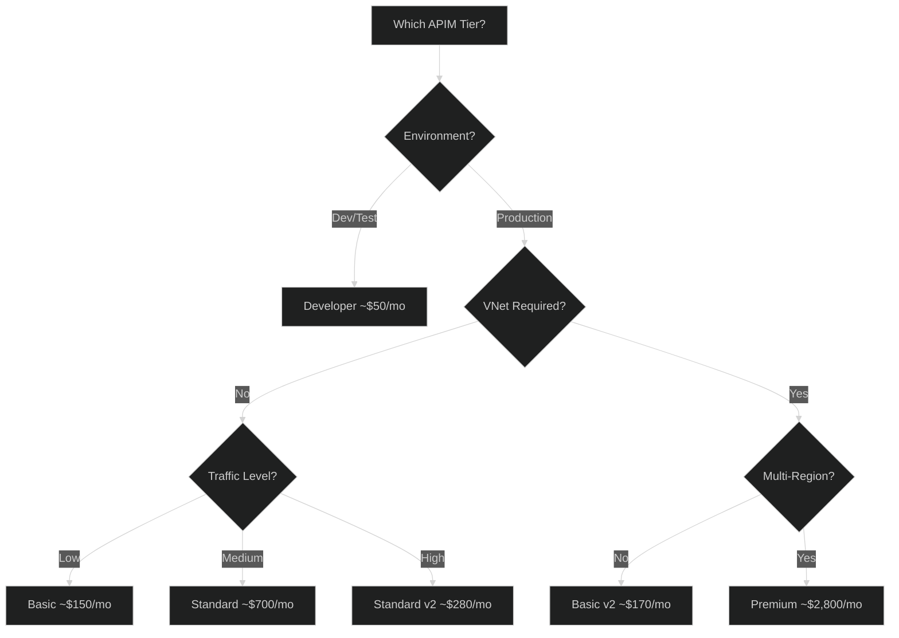

# 09 - Cost Optimization

> Tier selection, scaling strategies, and FinOps practices

---

## 💰 Tier Pricing Comparison

| Tier | Base Cost/Month | Scale Units | Best For |
|------|-----------------|-------------|----------|
| **Developer** | ~$50 | No SLA | Dev/Test |
| **Basic** | ~$150 | Fixed | Low traffic |
| **Standard** | ~$700 | Included | Medium workloads |
| **Premium** | ~$2,800 | Add-on | Enterprise |
| **Basic v2** | ~$170 | Add-on | Moderate + VNet |
| **Standard v2** | ~$280 | Add-on | High + VNet |

> 💡 **Premium costs ~4x Standard** but includes zone redundancy, multi-region, and VNet

---

## 📊 Cost Decision Tree



---

## 🎯 Right-Sizing Guidance

### Traffic-Based Selection

| Requests/Second | Recommended Tier | Estimated Cost |
|-----------------|------------------|----------------|
| < 100 | Basic | ~$150/mo |
| 100-500 | Standard | ~$700/mo |
| 500-1,000 | Standard + Units | ~$1,000/mo |
| 1,000-5,000 | Standard v2 | ~$500/mo |
| > 5,000 | Premium | ~$3,500+/mo |

### Feature-Based Selection

| Requirement | Minimum Tier |
|-------------|--------------|
| Development/Testing | Developer |
| Basic production | Basic |
| Caching, autoscale | Standard |
| VNet integration | Basic v2 / Premium |
| Multi-region | Premium |
| Zone redundancy | Premium |
| Self-hosted gateway | Premium |

---

## 💡 Cost Saving Strategies

### 1. Use Dev/Test Environments Wisely

```bicep
// Use Developer tier for non-production
param environment string = 'dev'

var skuName = environment == 'prod' ? 'Premium' : 'Developer'
var skuCapacity = environment == 'prod' ? 2 : 1

resource apim 'Microsoft.ApiManagement/service@2023-05-01-preview' = {
  name: 'apim-${environment}'
  location: location
  sku: {
    name: skuName
    capacity: skuCapacity
  }
}
```

### 2. Schedule Scale-Down (Non-Production)

```bicep
// Scale down after hours using automation
resource scaleDownSchedule 'Microsoft.Automation/automationAccounts/schedules@2023-11-01' = {
  name: 'apim-scale-down'
  parent: automationAccount
  properties: {
    frequency: 'Day'
    startTime: '2024-01-01T19:00:00+01:00'  // 7 PM
    timeZone: 'W. Europe Standard Time'
  }
}
```

### 3. Reserved Capacity (Premium)

| Commitment | Discount |
|------------|----------|
| 1-year | ~30-40% |
| 3-year | ~50-60% |

> 💡 Contact Microsoft for reserved instance pricing on Premium tier

### 4. Optimize Caching

```xml
<!-- Cache responses to reduce backend calls (and costs) -->
<inbound>
    <cache-lookup vary-by-developer="false" 
                  vary-by-developer-groups="false"
                  downstream-caching-type="public"
                  caching-type="internal" />
</inbound>
<outbound>
    <cache-store duration="3600" />
</outbound>
```

### 5. Rate Limiting to Control Costs

```xml
<!-- Prevent cost overruns from excessive usage -->
<rate-limit-by-key 
    calls="10000" 
    renewal-period="3600"
    counter-key="@(context.Subscription.Id)" />
```

---

## 📉 Cost Monitoring

### Azure Cost Management Query

```kusto
// APIM costs by resource
AzureDiagnostics
| where ResourceProvider == "MICROSOFT.APIMANAGEMENT"
| summarize Cost = sum(CostUSD) by Resource, bin(TimeGenerated, 1d)
| render timechart
```

### Budget Alerts

```bicep
resource budget 'Microsoft.Consumption/budgets@2023-11-01' = {
  name: 'apim-monthly-budget'
  properties: {
    amount: 5000
    category: 'Cost'
    timeGrain: 'Monthly'
    timePeriod: {
      startDate: '2024-01-01'
    }
    filter: {
      dimensions: {
        name: 'ResourceGroupName'
        values: ['rg-apim-prod']
      }
    }
    notifications: {
      Actual_80: {
        enabled: true
        operator: 'GreaterThanOrEqualTo'
        threshold: 80
        contactEmails: ['platform-team@company.com']
      }
      Actual_100: {
        enabled: true
        operator: 'GreaterThanOrEqualTo'
        threshold: 100
        contactEmails: ['platform-team@company.com']
      }
    }
  }
}
```

---

## 🏷️ Cost Allocation Tags

```bicep
resource apim 'Microsoft.ApiManagement/service@2023-05-01-preview' = {
  name: apimName
  location: location
  tags: {
    CostCenter: 'IT-Platform'
    Environment: environment
    Project: 'DataMesh'
    Owner: 'platform-team@company.com'
    ChargebackProduct: 'API-Gateway'
  }
  // ... rest of config
}
```

### Tag-Based Cost Report

| Tag | Purpose |
|-----|---------|
| `CostCenter` | Department chargeback |
| `Environment` | Dev/Test/Prod split |
| `Project` | Project allocation |
| `Owner` | Contact for review |
| `ChargebackProduct` | Product-level cost |

---

## 📊 Cost Comparison: v1 vs v2 Tiers

| Factor | Standard (v1) | Standard v2 |
|--------|---------------|-------------|
| Base price | ~$700/mo | ~$280/mo |
| Scale unit | Included | ~$70/unit/mo |
| VNet support | No | Yes |
| Zone redundancy | No | Optional |
| Min deployment | 1 unit | 1 unit |
| Max scale | Limited | 10 units |

### When v2 is More Cost-Effective

```
Standard v1 = $700/month fixed

Standard v2 at different scales:
- 1 unit  = $280 + $70  = $350/month  ✅ Cheaper
- 3 units = $280 + $210 = $490/month  ✅ Cheaper
- 5 units = $280 + $350 = $630/month  ✅ Cheaper
- 6 units = $280 + $420 = $700/month  ≈ Equal
- 7+ units = More expensive than v1
```

> 💡 **v2 is more cost-effective up to ~6 scale units**

---

## 🔄 Autoscaling for Cost Efficiency

### Scale Based on Demand

```bicep
resource autoscale 'Microsoft.Insights/autoscalesettings@2022-10-01' = {
  name: 'apim-autoscale'
  location: location
  properties: {
    enabled: true
    targetResourceUri: apim.id
    profiles: [
      {
        name: 'Business Hours'
        capacity: {
          default: '2'
          minimum: '2'
          maximum: '5'
        }
        recurrence: {
          frequency: 'Week'
          schedule: {
            days: ['Monday', 'Tuesday', 'Wednesday', 'Thursday', 'Friday']
            hours: [8]
            minutes: [0]
            timeZone: 'W. Europe Standard Time'
          }
        }
        rules: [
          {
            metricTrigger: {
              metricName: 'Capacity'
              metricResourceUri: apim.id
              timeGrain: 'PT1M'
              statistic: 'Average'
              timeWindow: 'PT10M'
              timeAggregation: 'Average'
              operator: 'GreaterThan'
              threshold: 70
            }
            scaleAction: {
              direction: 'Increase'
              type: 'ChangeCount'
              value: '1'
              cooldown: 'PT20M'
            }
          }
        ]
      }
      {
        name: 'Off Hours'
        capacity: {
          default: '1'
          minimum: '1'
          maximum: '2'
        }
        recurrence: {
          frequency: 'Week'
          schedule: {
            days: ['Monday', 'Tuesday', 'Wednesday', 'Thursday', 'Friday']
            hours: [19]
            minutes: [0]
            timeZone: 'W. Europe Standard Time'
          }
        }
        rules: []
      }
    ]
  }
}
```

---

## ✅ Cost Optimization Checklist

### Planning
- [ ] Right tier selected for workload
- [ ] v2 tiers evaluated for VNet needs
- [ ] Reserved capacity evaluated (Premium)
- [ ] Dev/Test uses Developer tier

### Operations
- [ ] Caching implemented
- [ ] Rate limiting configured
- [ ] Autoscaling enabled
- [ ] Off-hours scaling configured

### Monitoring
- [ ] Cost tags applied
- [ ] Budget alerts configured
- [ ] Monthly cost reviews scheduled
- [ ] Cost anomaly detection enabled

### Optimization
- [ ] Unused APIs removed
- [ ] Cache hit rates monitored
- [ ] Scale unit utilization tracked
- [ ] Tier right-sizing reviewed quarterly

---

## 🔗 Related Documents

| Document | Description |
|----------|-------------|
| [01-Architecture](./01-architecture-overview.md) | Tier comparison |
| [04-Policies](./04-policies.md) | Caching and rate limiting |
| [06-Monitoring](./06-monitoring.md) | Metrics for optimization |

---

> **Next**: [10-Performance-Efficiency](./10-performance-efficiency.md) - Caching, autoscaling, and latency optimization
