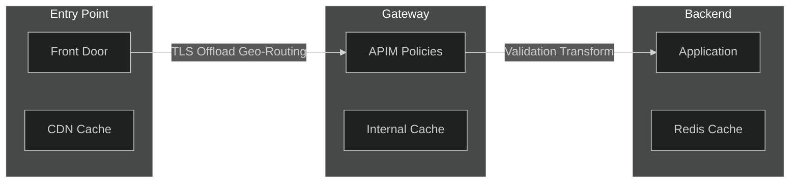
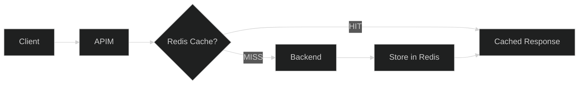
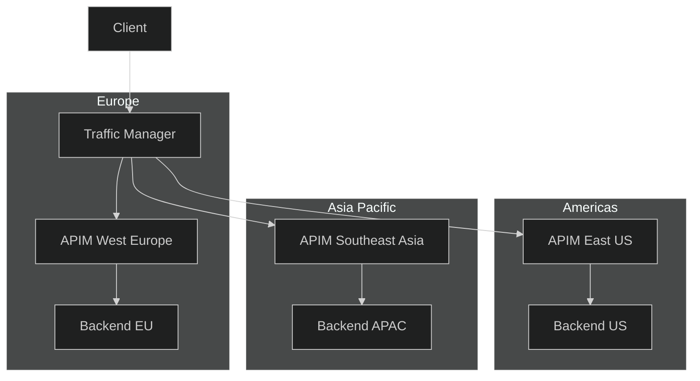

# 10 - Performance Efficiency

> Caching strategies, autoscaling, and latency optimization

[](https://learn.microsoft.com/azure/well-architected/performance-efficiency/checklist)

---

## 📋 WAF Workload Design Checklist

> Based on [Azure Well-Architected Framework - Performance Efficiency](https://learn.microsoft.com/azure/well-architected/performance-efficiency/checklist)

| # | Recommendation | Status |
|---|----------------|--------|
| ✅ | **(Service)** Define performance targets: capacity, CPU, memory, request duration, throughput | ☐ |
| ✅ | **(Service)** Dynamically scale to match demand with autoscale rules | ☐ |
| ✅ | **(Service)** Collect performance data using built-in analytics, Azure Monitor, App Insights | ☐ |
| ✅ | **(Service)** Test performance under production conditions with load testing | ☐ |
| ✅ | **(Service)** Review documented limits and constraints for APIM tier | ☐ |
| ✅ | **(API)** Minimize expensive processing (large payloads, WebSockets) with validate-content | ☐ |
| ✅ | **(API)** Evaluate caching policies or external cache for performance improvement | ☐ |
| ✅ | **(API)** Consider Azure Front Door / App Gateway for TLS offloading | ☐ |
| ✅ | **(Service & API)** Evaluate logic placement impact between gateway, backend, and entry point | ☐ |
| ✅ | **(Service & API)** Collect: request processing time, resource usage, throughput, cache hit ratio | ☐ |

---

## ⚡ Validate-Content for Large Payloads

> WAF Recommendation: Minimize expensive processing with validate-content policy

```xml
<!-- Validate and limit large request bodies -->
<inbound>
    <base />
    <validate-content 
        unspecified-content-type-action="prevent"
        max-size="102400"
        size-exceeded-action="prevent"
        errors-variable-name="validationErrors">
        <content type="application/json" validate-as="json" action="prevent" />
        <content type="application/xml" validate-as="xml" action="prevent" />
    </validate-content>
    
    <!-- Return friendly error for validation failures -->
    <choose>
        <when condition="@(context.Variables.ContainsKey("validationErrors"))">
            <return-response>
                <set-status code="400" reason="Bad Request" />
                <set-body>@{
                    var errors = (List<string>)context.Variables["validationErrors"];
                    return new JObject(
                        new JProperty("error", "Validation failed"),
                        new JProperty("details", new JArray(errors))
                    ).ToString();
                }</set-body>
            </return-response>
        </when>
    </choose>
</inbound>
```

### Payload Size Limits

| Tier | Max Request Size | Recommendation |
|------|------------------|----------------|
| Developer | 256 KB | For testing only |
| Basic | 256 KB | Small payloads |
| Standard | 256 KB | Small payloads |
| Premium | 256 KB | Use validate-content |
| v2 tiers | 2 MB | Larger payloads supported |

---

## 📍 Logic Placement Optimization

> WAF Recommendation: Evaluate performance impact of logic placement



| Logic | Best Location | Rationale |
|-------|---------------|-----------|
| **TLS Termination** | Front Door/App Gateway | Offload from APIM |
| **Geo-Routing** | Front Door | Edge processing |
| **Response Caching** | APIM (built-in) | Reduce backend load |
| **Request Validation** | APIM | Protect backends |
| **Business Logic** | Backend | Avoid gateway bloat |
| **Complex Transforms** | Backend | Better compute resources |

---

## 🎯 Performance Targets

| Metric | Target | Critical |
|--------|--------|----------|
| P50 Latency | < 100ms | < 500ms |
| P95 Latency | < 200ms | < 1000ms |
| P99 Latency | < 500ms | < 2000ms |
| Cache Hit Rate | > 70% | > 50% |
| Availability | 99.95% | 99.9% |

---

## 🚀 Response Caching

### Basic Response Caching

```xml
<policies>
    <inbound>
        <base />
        <!-- Check cache first -->
        <cache-lookup vary-by-developer="false"
                     vary-by-developer-groups="false"
                     caching-type="internal"
                     downstream-caching-type="public"
                     must-revalidate="true" />
    </inbound>
    <backend>
        <base />
    </backend>
    <outbound>
        <base />
        <!-- Store successful responses -->
        <choose>
            <when condition="@(context.Response.StatusCode == 200)">
                <cache-store duration="3600" />
            </when>
        </choose>
        <!-- Add cache headers -->
        <set-header name="X-Cache" exists-action="override">
            <value>@(context.Response.Headers.GetValueOrDefault("X-Cache", "MISS"))</value>
        </set-header>
    </outbound>
</policies>
```

### Vary Cache by Query Parameters

```xml
<cache-lookup vary-by-query-parameter="version,region,lang"
              vary-by-developer="false"
              caching-type="internal" />
```

### Vary Cache by Headers

```xml
<cache-lookup vary-by-header="Accept,Accept-Language"
              vary-by-developer="false"
              caching-type="internal" />
```

---

## 🔴 External Redis Cache

### Architecture with Redis



### Redis Cache Configuration (Bicep)

```bicep
// From your repository: modules/api-management.bicep
resource apim 'Microsoft.ApiManagement/service@2023-05-01-preview' = {
  name: apimName
  location: location
  properties: {
    // ... other config
  }
}

resource redisCache 'Microsoft.ApiManagement/service/caches@2023-05-01-preview' = {
  name: 'redis-external'
  parent: apim
  properties: {
    connectionString: 'redis-host.redis.cache.windows.net:6380,password=xxx,ssl=True,abortConnect=False'
    useFromLocation: 'default'
    description: 'External Redis cache for high-performance caching'
    resourceId: 'https://management.azure.com/subscriptions/${subscription().subscriptionId}/resourceGroups/${resourceGroup().name}/providers/Microsoft.Cache/redis/redis-apim-cache'
  }
}
```

### External Cache Policy

```xml
<policies>
    <inbound>
        <cache-lookup vary-by-developer="false"
                     caching-type="external"
                     downstream-caching-type="public" />
    </inbound>
    <outbound>
        <cache-store duration="600" caching-type="external" />
    </outbound>
</policies>
```

---

## ⚡ Backend Performance

### Connection Pooling

```xml
<backend>
    <!-- Enable HTTP/2 for better performance -->
    <forward-request timeout="30" 
                    buffer-request-body="true"
                    buffer-response="false" />
</backend>
```

### Circuit Breaker Pattern

```xml
<backend>
    <retry condition="@(context.Response.StatusCode >= 500)"
           count="3" 
           interval="1"
           delta="2"
           max-interval="10"
           first-fast-retry="true" />
</backend>
```

### Timeout Configuration

```xml
<backend>
    <forward-request timeout="30" follow-redirects="true" />
</backend>

<!-- Different timeouts per operation -->
<inbound>
    <choose>
        <when condition="@(context.Operation.Id == "heavy-report")">
            <set-backend-service timeout="120" />
        </when>
        <otherwise>
            <set-backend-service timeout="30" />
        </otherwise>
    </choose>
</inbound>
```

---

## 📊 Request/Response Optimization

### Compression

```xml
<outbound>
    <!-- Compress large responses -->
    <choose>
        <when condition="@(context.Response.Body.As<string>(preserveContent: true).Length > 1024)">
            <set-header name="Content-Encoding" exists-action="override">
                <value>gzip</value>
            </set-header>
        </when>
    </choose>
</outbound>
```

### Minimize Payload

```xml
<outbound>
    <!-- Remove unnecessary fields -->
    <set-body>@{
        var body = context.Response.Body.As<JObject>();
        body.Remove("internalId");
        body.Remove("debugInfo");
        body.Remove("metadata");
        return body.ToString();
    }</set-body>
</outbound>
```

### Conditional GET (ETag)

```xml
<outbound>
    <set-header name="ETag" exists-action="override">
        <value>@{
            var body = context.Response.Body.As<string>(preserveContent: true);
            using (var md5 = System.Security.Cryptography.MD5.Create())
            {
                var hash = md5.ComputeHash(System.Text.Encoding.UTF8.GetBytes(body));
                return "\"" + BitConverter.ToString(hash).Replace("-", "").ToLower() + "\"";
            }
        }</value>
    </set-header>
</outbound>

<inbound>
    <!-- Check If-None-Match -->
    <choose>
        <when condition="@(context.Request.Headers.GetValueOrDefault("If-None-Match", "") == context.Variables.GetValueOrDefault<string>("cachedETag"))">
            <return-response>
                <set-status code="304" reason="Not Modified" />
            </return-response>
        </when>
    </choose>
</inbound>
```

---

## 📈 Autoscaling Configuration

### Capacity-Based Scaling

```bicep
resource autoscale 'Microsoft.Insights/autoscalesettings@2022-10-01' = {
  name: 'apim-autoscale-performance'
  location: location
  properties: {
    enabled: true
    targetResourceUri: apim.id
    profiles: [
      {
        name: 'Performance Profile'
        capacity: {
          default: '2'
          minimum: '2'
          maximum: '10'
        }
        rules: [
          // Scale OUT on high capacity
          {
            metricTrigger: {
              metricName: 'Capacity'
              metricResourceUri: apim.id
              timeGrain: 'PT1M'
              statistic: 'Average'
              timeWindow: 'PT5M'
              timeAggregation: 'Average'
              operator: 'GreaterThan'
              threshold: 70
            }
            scaleAction: {
              direction: 'Increase'
              type: 'ChangeCount'
              value: '1'
              cooldown: 'PT10M'
            }
          }
          // Scale IN when low
          {
            metricTrigger: {
              metricName: 'Capacity'
              metricResourceUri: apim.id
              timeGrain: 'PT1M'
              statistic: 'Average'
              timeWindow: 'PT30M'
              timeAggregation: 'Average'
              operator: 'LessThan'
              threshold: 30
            }
            scaleAction: {
              direction: 'Decrease'
              type: 'ChangeCount'
              value: '1'
              cooldown: 'PT30M'
            }
          }
        ]
      }
    ]
  }
}
```

---

## 🌐 Geographic Distribution

### Multi-Region Deployment



### Traffic Manager Configuration

```bicep
resource trafficManager 'Microsoft.Network/trafficmanagerprofiles@2022-04-01' = {
  name: 'tm-apim-global'
  location: 'global'
  properties: {
    profileStatus: 'Enabled'
    trafficRoutingMethod: 'Performance'  // Route to closest
    dnsConfig: {
      relativeName: 'api-global'
      ttl: 60
    }
    monitorConfig: {
      protocol: 'HTTPS'
      port: 443
      path: '/status-0123456789abcdef'
      intervalInSeconds: 30
      timeoutInSeconds: 10
      toleratedNumberOfFailures: 3
    }
    endpoints: [
      {
        name: 'westeurope'
        type: 'Microsoft.Network/trafficManagerProfiles/azureEndpoints'
        properties: {
          targetResourceId: apimWestEurope.id
          endpointStatus: 'Enabled'
          priority: 1
        }
      }
      {
        name: 'eastus'
        type: 'Microsoft.Network/trafficManagerProfiles/azureEndpoints'
        properties: {
          targetResourceId: apimEastUS.id
          endpointStatus: 'Enabled'
          priority: 2
        }
      }
    ]
  }
}
```

---

## 📊 Performance Monitoring

### Key Performance Metrics

| Metric | Alert Threshold | Action |
|--------|-----------------|--------|
| `BackendDuration` | > 2000ms | Scale backend |
| `Duration` | > 3000ms | Investigate |
| `Capacity` | > 70% | Auto-scale |
| `FailedRequests` | > 5% | Alert team |

### KQL Query for Latency Analysis

```kusto
ApiManagementGatewayLogs
| where TimeGenerated > ago(1h)
| summarize 
    P50 = percentile(TotalTime, 50),
    P95 = percentile(TotalTime, 95),
    P99 = percentile(TotalTime, 99),
    Avg = avg(TotalTime),
    Count = count()
    by bin(TimeGenerated, 5m), OperationId
| order by P95 desc
| render timechart
```

### Performance Dashboard Query

```kusto
// Backend vs Gateway latency breakdown
ApiManagementGatewayLogs
| where TimeGenerated > ago(1h)
| extend 
    GatewayLatency = TotalTime - BackendTime,
    CacheHit = ResponseHeaders contains "X-Cache: HIT"
| summarize 
    AvgGateway = avg(GatewayLatency),
    AvgBackend = avg(BackendTime),
    CacheHitRate = countif(CacheHit) * 100.0 / count()
    by bin(TimeGenerated, 5m)
| render timechart
```

---

## ✅ Performance Checklist

### Caching
- [ ] Response caching enabled
- [ ] Cache vary parameters configured
- [ ] External Redis for high volume
- [ ] Cache hit rate monitored

### Backend
- [ ] Connection timeouts set
- [ ] Retry policies configured
- [ ] Circuit breaker implemented
- [ ] HTTP/2 enabled

### Scaling
- [ ] Autoscaling configured
- [ ] Capacity alerts set
- [ ] Multi-region deployed
- [ ] Traffic Manager configured

### Monitoring
- [ ] Latency dashboards created
- [ ] P95/P99 alerts configured
- [ ] Backend latency tracked
- [ ] Cache hit rate monitored

---

## 🔗 Related Documents

| Document | Description |
|----------|-------------|
| [04-Policies](./04-policies.md) | Caching policies |
| [06-Monitoring](./06-monitoring.md) | Metrics setup |
| [09-Cost-Optimization](./09-cost-optimization.md) | Scaling costs |

---

> **Next**: [11-Monetization](./11-monetization.md) - Products, subscriptions, and billing
