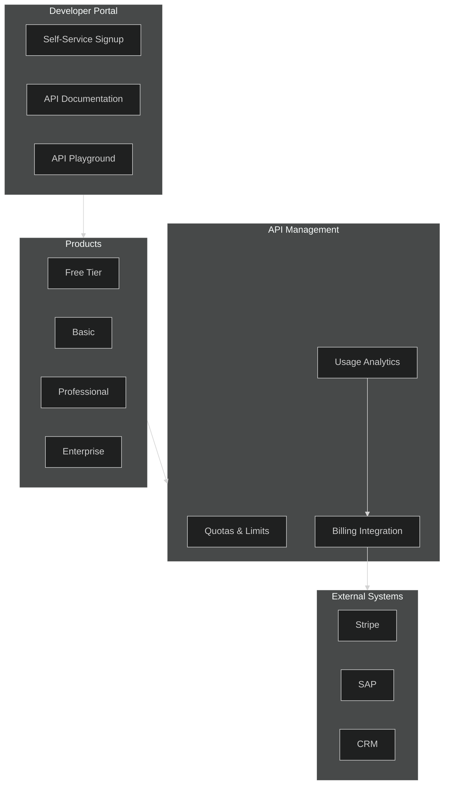
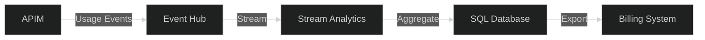

# 11 - Monetization & Developer Portal

> Products, subscriptions, billing integration, and developer experience

---

## 🎯 Monetization Architecture



---

## 📦 Product Configuration

### Product Tiers (Bicep)

```bicep
// Free tier product
resource productFree 'Microsoft.ApiManagement/service/products@2023-05-01-preview' = {
  name: 'free-tier'
  parent: apim
  properties: {
    displayName: 'Free Tier'
    description: 'Limited access for evaluation and testing'
    subscriptionRequired: true
    approvalRequired: false
    state: 'published'
    terms: 'Rate limited to 100 calls/day. No SLA.'
  }
}

// Professional tier product
resource productPro 'Microsoft.ApiManagement/service/products@2023-05-01-preview' = {
  name: 'professional'
  parent: apim
  properties: {
    displayName: 'Professional'
    description: 'Full API access with higher limits'
    subscriptionRequired: true
    approvalRequired: true  // Manual approval
    subscriptionsLimit: 10
    state: 'published'
    terms: '''
      - 10,000 calls per day
      - 100 calls per minute
      - Email support
      - 99.9% SLA
    '''
  }
}

// Enterprise tier product
resource productEnterprise 'Microsoft.ApiManagement/service/products@2023-05-01-preview' = {
  name: 'enterprise'
  parent: apim
  properties: {
    displayName: 'Enterprise'
    description: 'Unlimited access with premium support'
    subscriptionRequired: true
    approvalRequired: true
    state: 'published'
    terms: '''
      - Unlimited API calls
      - Dedicated support
      - Custom SLA
      - Premium features
    '''
  }
}
```

### Product-API Associations

```bicep
// Associate APIs with products
resource freeApiAssociation 'Microsoft.ApiManagement/service/products/apis@2023-05-01-preview' = {
  name: 'basic-data-api'
  parent: productFree
}

resource proApiAssociation 'Microsoft.ApiManagement/service/products/apis@2023-05-01-preview' = [for api in ['basic-data-api', 'advanced-analytics-api', 'reports-api']: {
  name: api
  parent: productPro
}]

resource enterpriseApiAssociation 'Microsoft.ApiManagement/service/products/apis@2023-05-01-preview' = [for api in ['basic-data-api', 'advanced-analytics-api', 'reports-api', 'admin-api', 'bulk-api']: {
  name: api
  parent: productEnterprise
}]
```

---

## 📏 Quota & Rate Limit Policies

### Per-Product Rate Limiting

```xml
<!-- Free Tier Policy -->
<inbound>
    <base />
    <rate-limit calls="10" renewal-period="60" />  <!-- 10 per minute -->
    <quota calls="100" renewal-period="86400" />    <!-- 100 per day -->
</inbound>

<!-- Professional Tier Policy -->
<inbound>
    <base />
    <rate-limit calls="100" renewal-period="60" />  <!-- 100 per minute -->
    <quota calls="10000" renewal-period="86400" />  <!-- 10K per day -->
</inbound>

<!-- Enterprise Tier Policy (no limits) -->
<inbound>
    <base />
    <!-- No rate/quota limits for enterprise -->
</inbound>
```

### Dynamic Limits by Subscription Metadata

```xml
<inbound>
    <base />
    <!-- Get limits from subscription metadata -->
    <set-variable name="rateLimit" 
        value="@(context.Subscription.TryGetPropertyValue("rateLimit", out var rate) ? int.Parse(rate) : 10)" />
    <set-variable name="quotaLimit" 
        value="@(context.Subscription.TryGetPropertyValue("quotaLimit", out var quota) ? int.Parse(quota) : 100)" />
    
    <rate-limit-by-key 
        calls="@((int)context.Variables["rateLimit"])" 
        renewal-period="60"
        counter-key="@(context.Subscription.Id)" />
    
    <quota-by-key 
        calls="@((int)context.Variables["quotaLimit"])" 
        renewal-period="86400"
        counter-key="@(context.Subscription.Id)" />
</inbound>
```

---

## 📊 Usage Tracking & Analytics

### Custom Usage Events

```xml
<outbound>
    <base />
    <!-- Log usage for billing -->
    <log-to-eventhub logger-id="billing-logger">@{
        return new JObject(
            new JProperty("subscriptionId", context.Subscription.Id),
            new JProperty("productId", context.Product.Id),
            new JProperty("apiId", context.Api.Id),
            new JProperty("operationId", context.Operation.Id),
            new JProperty("timestamp", DateTime.UtcNow),
            new JProperty("responseCode", context.Response.StatusCode),
            new JProperty("responseSize", context.Response.Body.As<string>(preserveContent: true).Length),
            new JProperty("processingTime", context.Elapsed.TotalMilliseconds)
        ).ToString();
    }</log-to-eventhub>
</outbound>
```

### Usage Report Query (KQL)

```kusto
ApiManagementGatewayLogs
| where TimeGenerated > ago(30d)
| summarize 
    TotalCalls = count(),
    SuccessfulCalls = countif(ResponseCode < 400),
    DataTransferredMB = sum(ResponseSize) / 1024 / 1024,
    AvgLatencyMs = avg(TotalTime)
    by SubscriptionId, ProductId, bin(TimeGenerated, 1d)
| order by TotalCalls desc
```

---

## 💳 Billing Integration

### Event Hub to Billing System



### Stream Analytics Query

```sql
SELECT
    SubscriptionId,
    ProductId,
    System.Timestamp() AS WindowEnd,
    COUNT(*) AS TotalCalls,
    SUM(ResponseSize) AS TotalBytes,
    AVG(ProcessingTime) AS AvgLatency
INTO
    BillingOutput
FROM
    ApimUsageInput
TIMESTAMP BY EventTime
GROUP BY
    SubscriptionId,
    ProductId,
    TumblingWindow(hour, 1)
```

---

## 📖 Developer Portal Customization

### Custom Delegation (Webhook)

```bicep
resource delegation 'Microsoft.ApiManagement/service/portalsettings/delegation@2023-05-01-preview' = {
  name: 'delegation'
  parent: apim
  properties: {
    url: 'https://my-app.azurewebsites.net/api/delegation'
    validationKey: delegationKey
    subscriptions: {
      enabled: true
    }
    userRegistration: {
      enabled: true
    }
  }
}
```

### Delegation Webhook Handler

```csharp
// Azure Function for delegation
[Function("ApimDelegation")]
public async Task<IActionResult> Run(
    [HttpTrigger(AuthorizationLevel.Function, "get", "post")] HttpRequest req)
{
    var operation = req.Query["operation"];
    var subscriptionId = req.Query["subscriptionId"];
    var productId = req.Query["productId"];
    var userId = req.Query["userId"];

    switch (operation)
    {
        case "Subscribe":
            // Custom logic: check payment, CRM, etc.
            var approved = await _billingService.ValidatePayment(userId);
            if (approved)
            {
                return new RedirectResult($"{portalUrl}/confirm?approved=true");
            }
            break;
            
        case "SignUp":
            // Redirect to custom signup flow
            return new RedirectResult($"{identityUrl}/register?returnUrl={portalUrl}");
    }
    
    return new BadRequestResult();
}
```

---

## 🎨 Developer Portal Branding

### Custom Styling

```json
{
  "colors": {
    "primary": "#0078D4",
    "secondary": "#106EBE",
    "accent": "#50E6FF"
  },
  "fonts": {
    "heading": "Segoe UI",
    "body": "Segoe UI"
  },
  "logo": {
    "url": "https://cdn.company.com/logo.png",
    "width": "200px"
  }
}
```

### Widget Customization (CLI)

```bash
# Export portal content
az apim portal create --resource-group rg-apim --name apim-prod --output ./portal-backup

# Import customized content
az apim portal import --resource-group rg-apim --name apim-prod --source ./portal-customized
```

---

## 📋 Product Feature Matrix

| Feature | Free | Basic | Pro | Enterprise |
|---------|:----:|:-----:|:---:|:----------:|
| API Access | Basic | All | All | All + Admin |
| Rate Limit | 10/min | 50/min | 100/min | Unlimited |
| Daily Quota | 100 | 1,000 | 10,000 | Unlimited |
| Caching | ❌ | ✅ | ✅ | ✅ |
| Analytics | ❌ | Basic | Full | Real-time |
| Support | Community | Email | Priority | Dedicated |
| SLA | None | 99% | 99.9% | 99.99% |
| Price | Free | $99/mo | $499/mo | Custom |

---

## 🔐 Subscription Key Management

### Key Regeneration Policy

```xml
<inbound>
    <base />
    <!-- Check subscription age, warn if old -->
    <choose>
        <when condition="@{
            var created = context.Subscription.CreatedDate;
            return (DateTime.UtcNow - created).TotalDays > 90;
        }">
            <set-header name="X-Key-Warning" exists-action="override">
                <value>Subscription key is over 90 days old. Consider regenerating.</value>
            </set-header>
        </when>
    </choose>
</inbound>
```

### Multiple Keys per Subscription

```bicep
resource subscription 'Microsoft.ApiManagement/service/subscriptions@2023-05-01-preview' = {
  name: 'sub-customer-001'
  parent: apim
  properties: {
    displayName: 'Customer 001 - Production'
    scope: '/products/professional'
    state: 'active'
    allowTracing: false
    // Primary and secondary keys auto-generated
  }
}
```

---

## ✅ Monetization Checklist

### Products
- [ ] Tiered products defined (Free/Basic/Pro/Enterprise)
- [ ] APIs assigned to appropriate products
- [ ] Terms and conditions documented
- [ ] Approval workflows configured

### Quotas & Limits
- [ ] Rate limits per tier configured
- [ ] Daily/monthly quotas set
- [ ] Overage handling defined
- [ ] Limit headers returned to clients

### Billing
- [ ] Usage events logged to Event Hub
- [ ] Analytics pipeline configured
- [ ] Billing system integrated
- [ ] Invoice generation automated

### Developer Experience
- [ ] Portal customized with branding
- [ ] API documentation complete
- [ ] Interactive playground enabled
- [ ] Self-service signup working
- [ ] Delegation webhooks configured

---

## 🔗 Related Documents

| Document | Description |
|----------|-------------|
| [04-Policies](./04-policies.md) | Rate limiting policies |
| [06-Monitoring](./06-monitoring.md) | Usage analytics |
| [09-Cost-Optimization](./09-cost-optimization.md) | Pricing tiers |

---

> **Back to**: [README](./README.md) - Main documentation index
