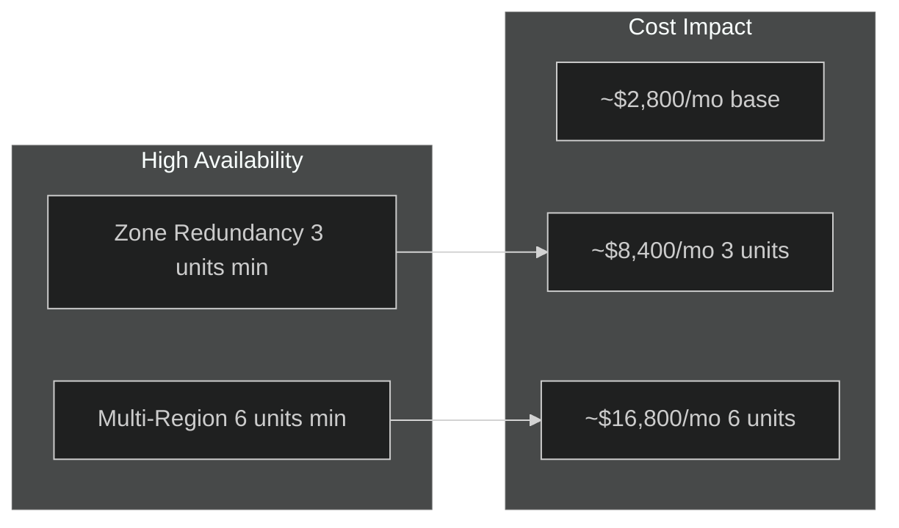
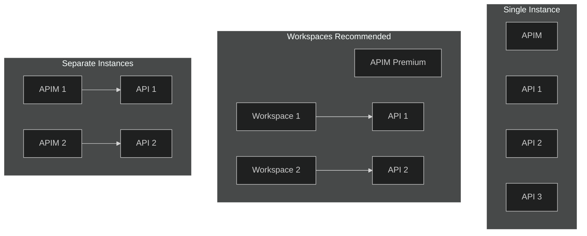
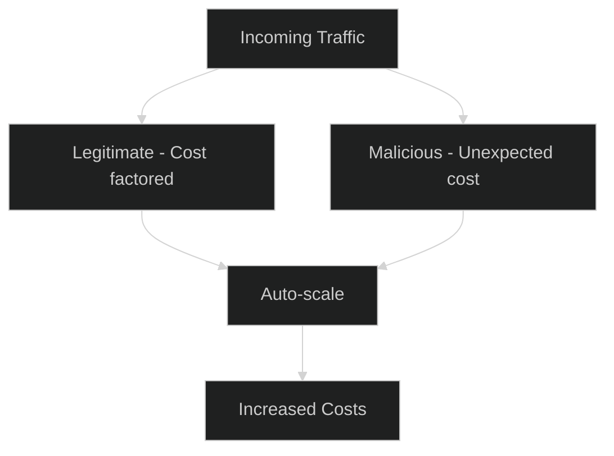
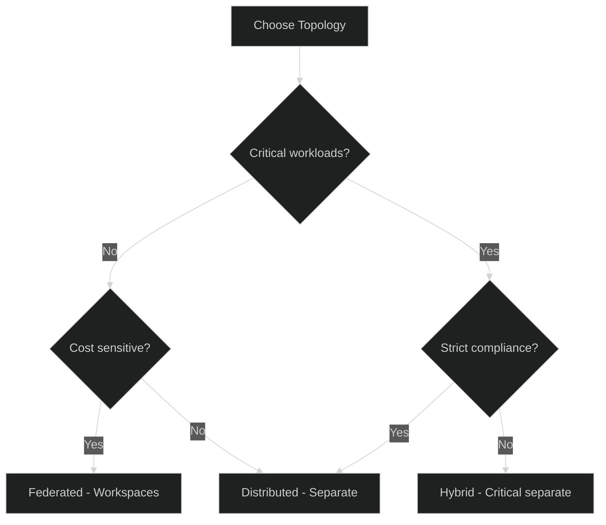

# 12 - Design Tradeoffs

> Well-Architected Framework tradeoffs and decision guidance

[](https://learn.microsoft.com/azure/well-architected/service-guides/azure-api-management#tradeoffs)

---

## ⚖️ Overview

The Azure Well-Architected Framework acknowledges that design decisions involve tradeoffs between the five pillars. This document captures the key tradeoffs specific to Azure API Management.

---

## 🏢 High Availability vs. Cost

> WAF Tradeoff: Adding redundancy affects costs



### Decision Matrix

| Requirement | Configuration | Est. Monthly Cost | SLA |
|-------------|---------------|-------------------|-----|
| Basic Production | Premium 1 unit | ~$2,800 | 99.95% |
| Zone Redundant | Premium 3 units | ~$8,400 | 99.99% |
| Multi-Region (A/P) | Premium 3+1 units | ~$11,200 | 99.99%+ |
| Multi-Region (A/A) | Premium 3+3 units | ~$16,800 | 99.99%+ |

### Considerations

- **Zone redundancy**: Requires minimum 3 units for full zone coverage
- **Multi-region**: Adds operational costs for failover coordination
- **Backend coordination**: DR must align with backend failover strategies

---

## 🏗️ Isolation vs. Operational Complexity

> WAF Tradeoff: Isolating workloads adds operational complexity

### Approaches Comparison

| Approach | Isolation Level | Cost | Complexity |
|----------|-----------------|------|------------|
| **Single Instance** | None | $ | Low |
| **Workspaces** | Logical (RBAC, network) | $$ | Medium |
| **Separate Instances** | Physical | $$$ | High |



### When to Use Each

| Scenario | Recommended Approach |
|----------|---------------------|
| Small team, low risk | Single Instance |
| Multi-team, shared costs | Workspaces |
| Strict compliance/data sovereignty | Separate Instances |
| Maximum blast radius isolation | Separate Instances |
| Cost optimization priority | Workspaces |

---

## 📈 Scale to Match Demand

> WAF Tradeoff: Autoscaling handles malicious traffic too

### The Dilemma



### Mitigation Strategies

| Strategy | Benefit | Cost |
|----------|---------|------|
| **WAF** | Block malicious before APIM | WAF costs |
| **DDoS Protection** | Block volumetric attacks | DDoS tier costs |
| **Rate Limiting** | Cap per-client requests | None |
| **Scale Limits** | Cap maximum units | Reliability risk |

### Recommended Configuration

```bicep
resource autoscale 'Microsoft.Insights/autoscalesettings@2022-10-01' = {
  properties: {
    profiles: [{
      capacity: {
        minimum: '2'   // Baseline
        maximum: '8'   // Cap to control costs
        default: '2'
      }
      rules: [
        // Scale out for legitimate load
        {
          metricTrigger: {
            metricName: 'Capacity'
            threshold: 70
            operator: 'GreaterThan'
          }
          scaleAction: {
            direction: 'Increase'
            value: '1'
            cooldown: 'PT10M'
          }
        }
      ]
    }]
  }
}
```

---

## 🔄 Federated vs. Distributed

> WAF Tradeoff: Colocation vs autonomous topology

### Federated (Workspaces)

| Pros | Cons |
|------|------|
| ✅ Cost sharing across teams | ❌ Shared outage blast radius |
| ✅ Centralized governance | ❌ Misconfiguration impacts all |
| ✅ Economies of scale | ❌ Complex multi-tenant RBAC |
| ✅ Single control plane | ❌ Capacity planning for all |

### Distributed (Separate Instances)

| Pros | Cons |
|------|------|
| ✅ Full isolation | ❌ Duplicative costs |
| ✅ Independent scaling | ❌ Redundant operations |
| ✅ Team autonomy | ❌ No cost sharing |
| ✅ Blast radius mitigation | ❌ Multiple control planes |

### Decision Guidance



---

## 💾 Caching Tradeoffs

> WAF Tradeoff: External cache can introduce failure points

| Caching Option | Performance | Reliability Risk | Cost |
|----------------|-------------|------------------|------|
| **No Cache** | Baseline | None | $ |
| **Built-in Cache** | Improved | Minimal | $ |
| **External Redis** | Best | Additional dependency | $$$ |

### When to Use External Cache

- Built-in cache capacity exceeded
- Cache data > 50 MB (tier dependent)
- Need for advanced Redis features
- Multi-region cache consistency required

### Mitigation for External Cache

```xml
<!-- Graceful degradation if cache fails -->
<inbound>
    <cache-lookup caching-type="external" 
                  timeout-in-seconds="2"
                  must-revalidate="false" />
    <on-error>
        <!-- Proceed without cache on Redis failure -->
        <set-variable name="cache-failed" value="true" />
    </on-error>
</inbound>
```

---

## 📊 Summary: Tradeoff Matrix

| Decision | Option A | Option B | Primary Tradeoff |
|----------|----------|----------|------------------|
| **Tier Selection** | Premium | Standard v2 | Features vs. Cost |
| **Redundancy** | Zone/Multi-Region | Single Unit | Reliability vs. Cost |
| **Isolation** | Workspaces | Separate Instances | Cost vs. Blast Radius |
| **Scaling** | Unlimited | Capped | Reliability vs. Cost |
| **Caching** | Built-in | External Redis | Simplicity vs. Performance |
| **Gateway** | Cloud-hosted | Self-hosted | Simplicity vs. Latency |

---

## ✅ Tradeoff Checklist

- [ ] Documented SLA requirements vs. budget constraints
- [ ] Evaluated blast radius requirements
- [ ] Assessed team autonomy vs. centralized governance needs
- [ ] Defined scaling limits to control costs
- [ ] Evaluated caching strategy reliability implications
- [ ] Considered hybrid approaches for mixed requirements

---

## 🔗 Related Documents

| Document | Description |
|----------|-------------|
| [01-Architecture](./01-architecture-overview.md) | Tier selection |
| [02-Reliability](./02-reliability.md) | HA patterns |
| [09-Cost-Optimization](./09-cost-optimization.md) | Cost strategies |

---

## 📚 References

- [Azure Well-Architected Framework - APIM Tradeoffs](https://learn.microsoft.com/azure/well-architected/service-guides/azure-api-management#tradeoffs)
- [API Management Workspaces](https://learn.microsoft.com/azure/api-management/workspaces-overview)
- [Multi-region deployment](https://learn.microsoft.com/azure/api-management/api-management-howto-deploy-multi-region)

---

> **Back to**: [README](./README.md) - Main documentation index
