# 13 - Customer Q&A: Advanced Architecture Scenarios

> Detailed answers to enterprise architecture questions for APIM, Application Gateway, and Front Door

[](https://learn.microsoft.com/azure/well-architected/)

---

## 📋 Table of Contents

| # | Question | Jump To |
|---|----------|---------|
| 1 | Central logs with use case isolation | [View](#1-central-logs-with-use-case-isolation) |
| 2 | Distinguishing internal vs external calls | [View](#2-distinguishing-internal-vs-external-calls) |
| 3 | Multiple origins behind a domain | [View](#3-multiple-origins-behind-a-domain) |
| 4 | Central base policy enforcement | [View](#4-central-base-policy-enforcement) |
| 5 | Schema validation approach | [View](#5-schema-validation-approach) |
| 6 | Developer Portal & Entra ID benefits | [View](#6-developer-portal--entra-id-integration) |

---

## 1. Central Logs with Use Case Isolation

### ❓ Question
> How can the central logs of the three systems (APIM, Application Gateway, Front Door) be made available to the use cases without the use cases being able to see each other's logs?

### 🎯 Solution: Log Analytics with RBAC-Based Access

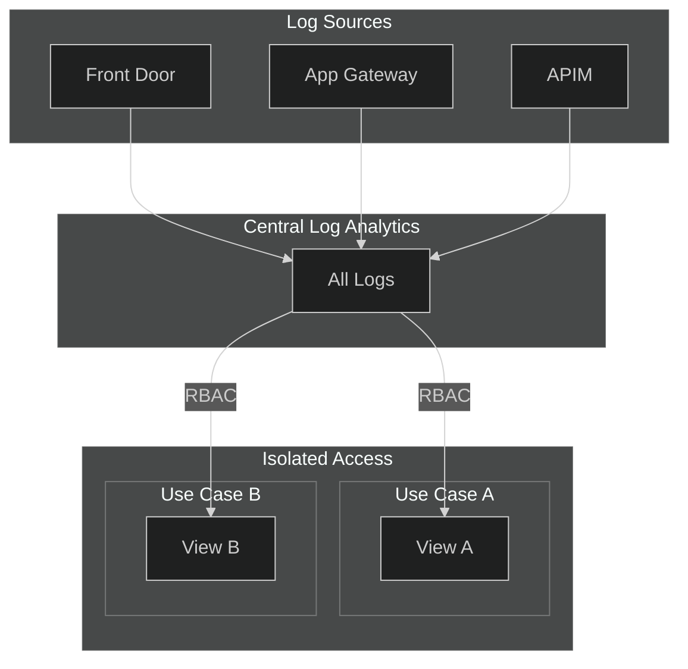

### Architecture Options

| Approach | Isolation Level | Complexity | Cost |
|----------|-----------------|------------|------|
| **Option 1: Resource-Context RBAC** | Row-level | Low | $ |
| **Option 2: Separate Workspaces** | Complete | Medium | $$ |
| **Option 3: Azure Data Explorer** | Enterprise | High | $$$ |

---

### Option 1: Resource-Context RBAC (Recommended)

Use **resource-context access mode** in Log Analytics - users only see logs from resources they have RBAC permissions on.

#### Step 1: Enable Resource-Context Mode

```bicep
resource logAnalyticsWorkspace 'Microsoft.OperationalInsights/workspaces@2022-10-01' = {
  name: 'law-central-logs'
  location: location
  properties: {
    sku: {
      name: 'PerGB2018'
    }
    // Enable resource-context access
    features: {
      enableLogAccessUsingOnlyResourcePermissions: true
    }
    retentionInDays: 90
  }
}
```

#### Step 2: Tag Resources by Use Case

```bicep
// Tag APIM APIs, Products, or use custom dimensions
resource api 'Microsoft.ApiManagement/service/apis@2023-05-01-preview' = {
  name: 'usecase-a-api'
  parent: apim
  properties: {
    displayName: 'Use Case A API'
    // ...
  }
  tags: {
    UseCase: 'TeamA'
    CostCenter: 'CC-001'
  }
}
```

#### Step 3: Add Use Case Identifier in APIM Logs

```xml
<!-- Add custom dimension to all logs for filtering -->
<inbound>
    <base />
    <set-header name="X-UseCase-Id" exists-action="override">
        <value>@(context.Api.Name.StartsWith("uc-a-") ? "TeamA" : 
                 context.Api.Name.StartsWith("uc-b-") ? "TeamB" : "Shared")</value>
    </set-header>
    <trace source="UseCase" severity="information">
        <message>@($"UseCase: {context.Variables.GetValueOrDefault<string>("useCaseId", "Unknown")}")</message>
    </trace>
</inbound>
```

#### Step 4: Create Scoped Workbooks per Use Case

```kusto
// Team A can only query their logs
// Grant "Log Analytics Reader" on specific APIM resources or use custom table RBAC

AzureDiagnostics
| where ResourceProvider == "MICROSOFT.APIMANAGEMENT"
| where ApiId_s startswith "uc-a-"  // Use Case A APIs only
| project TimeGenerated, ApiId_s, OperationId, ResponseCode_d, DurationMs_d
| order by TimeGenerated desc
```

#### Step 5: RBAC Role Assignments

```bicep
// Grant Team A access ONLY to their API resources
resource roleAssignment 'Microsoft.Authorization/roleAssignments@2022-04-01' = {
  name: guid(resourceGroup().id, 'TeamA', 'LogReader')
  scope: apiUseCaseA  // Scope to specific API resource
  properties: {
    roleDefinitionId: subscriptionResourceId('Microsoft.Authorization/roleDefinitions', 
      '73c42c96-874c-492b-b04d-ab87d138a893')  // Log Analytics Reader
    principalId: teamAGroupId
    principalType: 'Group'
  }
}
```

---

### Option 2: Separate Log Analytics Workspaces

For **strict isolation**, use dedicated workspaces per use case with data export.

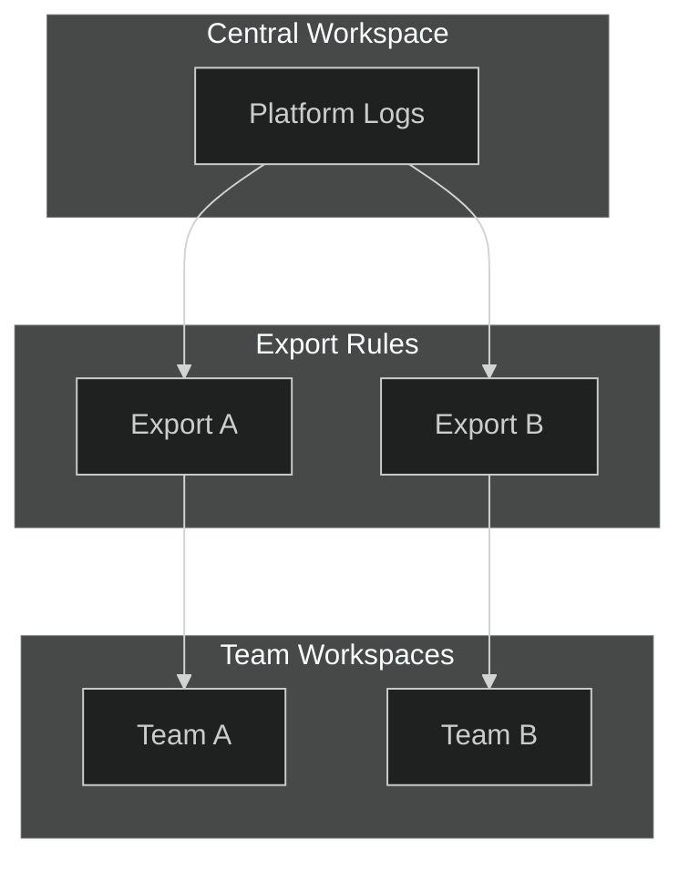

#### Data Export Rule (Bicep)

```bicep
resource dataExportRule 'Microsoft.OperationalInsights/workspaces/dataExports@2020-08-01' = {
  name: 'export-to-team-a'
  parent: centralWorkspace
  properties: {
    destination: {
      resourceId: teamAWorkspace.id
    }
    tableNames: [
      'AzureDiagnostics'
    ]
    enable: true
  }
}
```

---

### Summary: Log Isolation Decision Matrix

| Requirement | Recommended Approach |
|-------------|---------------------|
| Simple team separation | Resource-Context RBAC |
| Regulatory compliance | Separate Workspaces |
| Cross-use-case analytics needed | Central + Scoped Views |
| Cost optimization priority | Single Workspace + RBAC |

---

## 2. Distinguishing Internal vs External Calls

### ❓ Question
> How can calls from internal and external systems be distinguished from each other sensibly? External calls come via the Front Door and internal calls come via the Application Gateway. How can crosstalk be prevented?

### 🎯 Solution: Header-Based Identification + Network Isolation

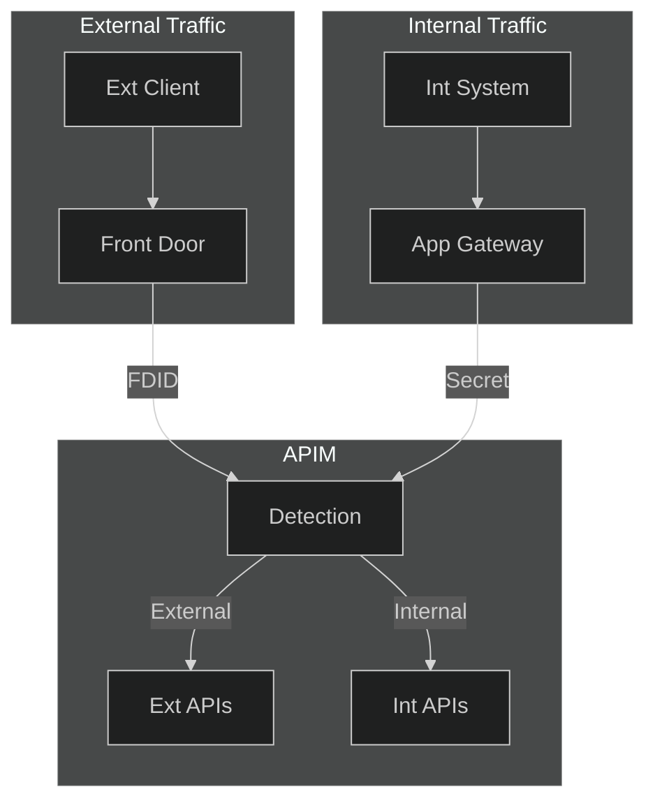

### Implementation Strategy

#### Step 1: Configure Front Door to Add Identity Header

Front Door automatically adds the `X-Azure-FDID` header with your Front Door instance ID.

```bicep
resource frontDoor 'Microsoft.Cdn/profiles@2023-05-01' = {
  name: 'fd-api-gateway'
  location: 'global'
  sku: {
    name: 'Premium_AzureFrontDoor'
  }
  // Front Door ID is automatically included in X-Azure-FDID header
}
```

#### Step 2: Configure Application Gateway to Add Custom Header

```bicep
resource appGateway 'Microsoft.Network/applicationGateways@2023-05-01' = {
  name: 'appgw-internal'
  properties: {
    rewriteRuleSets: [
      {
        name: 'AddInternalHeader'
        properties: {
          rewriteRules: [
            {
              name: 'MarkAsInternal'
              ruleSequence: 100
              actionSet: {
                requestHeaderConfigurations: [
                  {
                    headerName: 'X-Traffic-Source'
                    headerValue: 'internal-appgw'
                  }
                  {
                    headerName: 'X-Internal-Gateway-Secret'
                    headerValue: '{{internal-gateway-secret}}'  // From Key Vault
                  }
                ]
              }
            }
          ]
        }
      }
    ]
  }
}
```

#### Step 3: APIM Policy to Detect and Route Traffic

```xml
<policies>
    <inbound>
        <base />
        
        <!-- Detect traffic source -->
        <set-variable name="trafficSource" value="@{
            // Check for Front Door header (external)
            var fdId = context.Request.Headers.GetValueOrDefault("X-Azure-FDID", "");
            var expectedFdId = "{{front-door-id}}";  // Named value from Key Vault
            
            // Check for Application Gateway header (internal)
            var internalSecret = context.Request.Headers.GetValueOrDefault("X-Internal-Gateway-Secret", "");
            var expectedSecret = "{{internal-gateway-secret}}";  // Named value from Key Vault
            
            if (!string.IsNullOrEmpty(fdId) && fdId == expectedFdId) {
                return "external";
            }
            else if (!string.IsNullOrEmpty(internalSecret) && internalSecret == expectedSecret) {
                return "internal";
            }
            else {
                return "unknown";
            }
        }" />
        
        <!-- Block unknown traffic sources -->
        <choose>
            <when condition="@(context.Variables.GetValueOrDefault<string>("trafficSource") == "unknown")">
                <return-response>
                    <set-status code="403" reason="Forbidden" />
                    <set-body>{"error": "Direct access not allowed. Use authorized gateway."}</set-body>
                </return-response>
            </when>
        </choose>
        
        <!-- Add traffic source header for downstream processing -->
        <set-header name="X-Traffic-Source" exists-action="override">
            <value>@(context.Variables.GetValueOrDefault<string>("trafficSource"))</value>
        </set-header>
        
        <!-- Log traffic source for analytics -->
        <trace source="TrafficRouter" severity="information">
            <message>@($"Traffic Source: {context.Variables["trafficSource"]}, API: {context.Api.Name}")</message>
        </trace>
    </inbound>
</policies>
```

#### Step 4: Prevent Crosstalk - API-Level Restrictions

```xml
<!-- For INTERNAL-ONLY APIs -->
<inbound>
    <base />
    <choose>
        <when condition="@(context.Variables.GetValueOrDefault<string>("trafficSource") != "internal")">
            <return-response>
                <set-status code="403" reason="Forbidden" />
                <set-body>{"error": "This API is only accessible from internal systems"}</set-body>
            </return-response>
        </when>
    </choose>
</inbound>

<!-- For EXTERNAL-ONLY APIs -->
<inbound>
    <base />
    <choose>
        <when condition="@(context.Variables.GetValueOrDefault<string>("trafficSource") != "external")">
            <return-response>
                <set-status code="403" reason="Forbidden" />
                <set-body>{"error": "This API is only accessible from external systems"}</set-body>
            </return-response>
        </when>
    </choose>
</inbound>
```

#### Step 5: Network-Level Prevention (Defense in Depth)

```bicep
// NSG rules to ensure APIM only accepts traffic from known gateways
resource apimNsg 'Microsoft.Network/networkSecurityGroups@2023-05-01' = {
  name: 'nsg-apim-subnet'
  properties: {
    securityRules: [
      {
        name: 'AllowFrontDoor'
        properties: {
          priority: 100
          direction: 'Inbound'
          access: 'Allow'
          protocol: 'Tcp'
          sourceAddressPrefix: 'AzureFrontDoor.Backend'
          destinationPortRange: '443'
          destinationAddressPrefix: 'VirtualNetwork'
        }
      }
      {
        name: 'AllowAppGateway'
        properties: {
          priority: 110
          direction: 'Inbound'
          access: 'Allow'
          protocol: 'Tcp'
          sourceAddressPrefix: appGatewaySubnet.properties.addressPrefix
          destinationPortRange: '443'
          destinationAddressPrefix: 'VirtualNetwork'
        }
      }
      {
        name: 'DenyAllOther'
        properties: {
          priority: 1000
          direction: 'Inbound'
          access: 'Deny'
          protocol: '*'
          sourceAddressPrefix: '*'
          destinationPortRange: '*'
          destinationAddressPrefix: '*'
        }
      }
    ]
  }
}
```

### Traffic Flow Summary

| Source | Entry Point | Header | Access Level |
|--------|-------------|--------|--------------|
| External Client | Front Door | `X-Azure-FDID` | External APIs only |
| Internal System | Application Gateway | `X-Internal-Gateway-Secret` | Internal + Shared APIs |
| Direct Access | None | None | **BLOCKED** |

---

## 3. Multiple Origins Behind a Domain

### ❓ Question
> One origin is stored in the Origin Groups at the Application Gateway. How can multiple origins be integrated or addressed behind a specific domain name?

### 🎯 Solution: Path-Based or Header-Based Routing to Multiple Origins

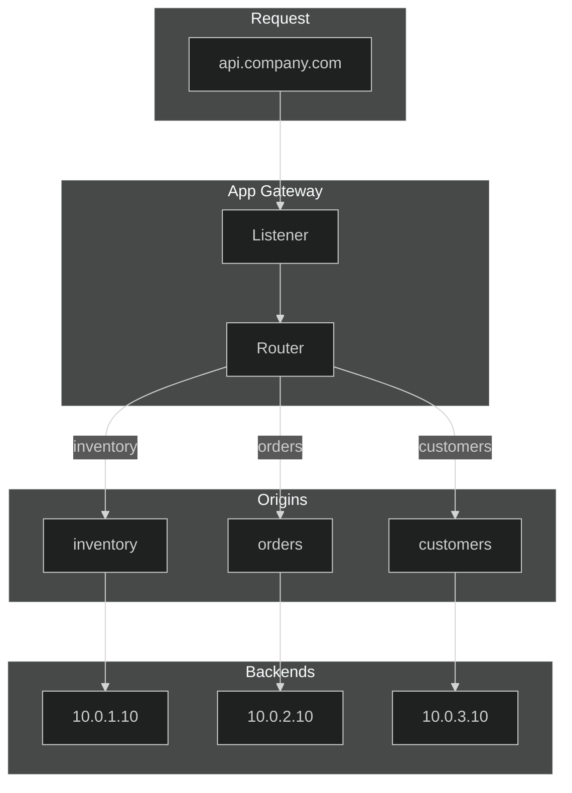

### Option 1: Path-Based Routing (Application Gateway)

```bicep
resource appGateway 'Microsoft.Network/applicationGateways@2023-05-01' = {
  name: 'appgw-multi-origin'
  properties: {
    // Backend Address Pools (Origins)
    backendAddressPools: [
      {
        name: 'pool-inventory'
        properties: {
          backendAddresses: [
            { ipAddress: '10.0.1.10' }
            { ipAddress: '10.0.1.11' }  // Multiple instances
          ]
        }
      }
      {
        name: 'pool-orders'
        properties: {
          backendAddresses: [
            { ipAddress: '10.0.2.10' }
          ]
        }
      }
      {
        name: 'pool-customers'
        properties: {
          backendAddresses: [
            { ipAddress: '10.0.3.10' }
          ]
        }
      }
    ]

    // URL Path Maps for routing
    urlPathMaps: [
      {
        name: 'pathmap-api'
        properties: {
          defaultBackendAddressPool: {
            id: resourceId('Microsoft.Network/applicationGateways/backendAddressPools', 
                           'appgw-multi-origin', 'pool-inventory')
          }
          defaultBackendHttpSettings: {
            id: resourceId('Microsoft.Network/applicationGateways/backendHttpSettingsCollection',
                           'appgw-multi-origin', 'https-settings')
          }
          pathRules: [
            {
              name: 'inventory-path'
              properties: {
                paths: ['/api/inventory/*']
                backendAddressPool: {
                  id: resourceId('Microsoft.Network/applicationGateways/backendAddressPools',
                                 'appgw-multi-origin', 'pool-inventory')
                }
                backendHttpSettings: {
                  id: resourceId('Microsoft.Network/applicationGateways/backendHttpSettingsCollection',
                                 'appgw-multi-origin', 'https-settings')
                }
              }
            }
            {
              name: 'orders-path'
              properties: {
                paths: ['/api/orders/*']
                backendAddressPool: {
                  id: resourceId('Microsoft.Network/applicationGateways/backendAddressPools',
                                 'appgw-multi-origin', 'pool-orders')
                }
                backendHttpSettings: {
                  id: resourceId('Microsoft.Network/applicationGateways/backendHttpSettingsCollection',
                                 'appgw-multi-origin', 'https-settings')
                }
              }
            }
            {
              name: 'customers-path'
              properties: {
                paths: ['/api/customers/*']
                backendAddressPool: {
                  id: resourceId('Microsoft.Network/applicationGateways/backendAddressPools',
                                 'appgw-multi-origin', 'pool-customers')
                }
                backendHttpSettings: {
                  id: resourceId('Microsoft.Network/applicationGateways/backendHttpSettingsCollection',
                                 'appgw-multi-origin', 'https-settings')
                }
              }
            }
          ]
        }
      }
    ]

    // Routing Rule linking listener to path map
    requestRoutingRules: [
      {
        name: 'rule-api-routing'
        properties: {
          ruleType: 'PathBasedRouting'
          priority: 100
          httpListener: {
            id: resourceId('Microsoft.Network/applicationGateways/httpListeners',
                           'appgw-multi-origin', 'listener-https')
          }
          urlPathMap: {
            id: resourceId('Microsoft.Network/applicationGateways/urlPathMaps',
                           'appgw-multi-origin', 'pathmap-api')
          }
        }
      }
    ]
  }
}
```

### Option 2: Header-Based Routing (Rewrite Rules)

```bicep
resource appGateway 'Microsoft.Network/applicationGateways@2023-05-01' = {
  properties: {
    rewriteRuleSets: [
      {
        name: 'header-based-routing'
        properties: {
          rewriteRules: [
            {
              name: 'route-by-api-version'
              ruleSequence: 100
              conditions: [
                {
                  variable: 'http_req_X-API-Version'
                  pattern: 'v2'
                  ignoreCase: true
                }
              ]
              actionSet: {
                urlConfiguration: {
                  modifiedPath: '/v2{var_uri_path}'
                  reroute: true
                }
              }
            }
          ]
        }
      }
    ]
  }
}
```

### Option 3: Front Door with Multiple Origins

```bicep
resource frontDoorOriginGroup 'Microsoft.Cdn/profiles/originGroups@2023-05-01' = {
  name: 'og-api-backends'
  parent: frontDoor
  properties: {
    loadBalancingSettings: {
      sampleSize: 4
      successfulSamplesRequired: 3
      additionalLatencyInMilliseconds: 50
    }
    healthProbeSettings: {
      probePath: '/health'
      probeProtocol: 'Https'
      probeIntervalInSeconds: 30
    }
  }
}

// Multiple origins in the group with priority/weight
resource origin1 'Microsoft.Cdn/profiles/originGroups/origins@2023-05-01' = {
  name: 'origin-primary'
  parent: frontDoorOriginGroup
  properties: {
    hostName: 'api-primary.internal.company.com'
    httpPort: 80
    httpsPort: 443
    priority: 1
    weight: 1000
    enabledState: 'Enabled'
  }
}

resource origin2 'Microsoft.Cdn/profiles/originGroups/origins@2023-05-01' = {
  name: 'origin-secondary'
  parent: frontDoorOriginGroup
  properties: {
    hostName: 'api-secondary.internal.company.com'
    httpPort: 80
    httpsPort: 443
    priority: 2  // Failover
    weight: 1000
    enabledState: 'Enabled'
  }
}
```

### Routing Architecture Summary

| Routing Type | Use Case | Configuration |
|--------------|----------|---------------|
| **Path-based** | Different services per URL path | URL Path Maps |
| **Header-based** | Version routing, A/B testing | Rewrite Rules |
| **Priority-based** | Active/Passive failover | Origin priority |
| **Weight-based** | Load distribution | Origin weights |
| **Health-based** | Automatic failover | Health probes |

---

### Option 4: Multiple Application Gateways Behind a Single Domain (with Private Link)

> **Customer Scenario:** "We have multiple Application Gateways in different regions/contexts. How can they all sit behind a single domain name, and they are with Private Links?"

This is the **recommended enterprise architecture** for multi-region or multi-team scenarios where each team owns their Application Gateway but needs unified domain access.

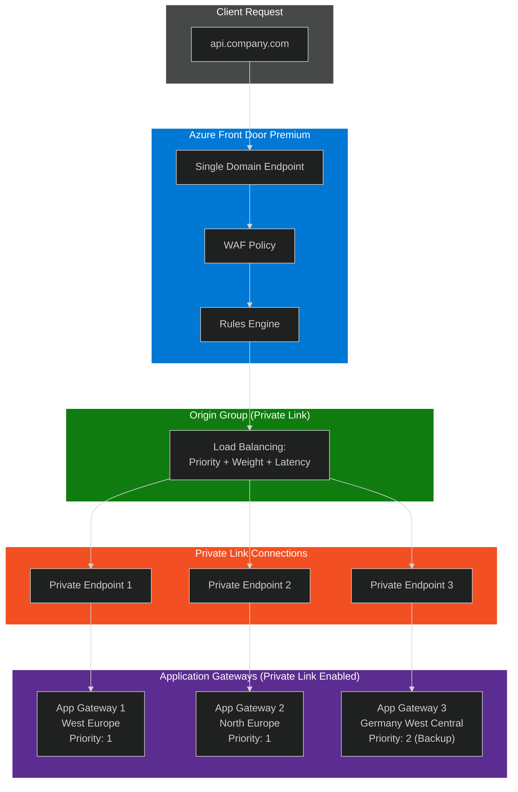

#### Architecture Pattern: Azure Front Door Premium + Multiple Application Gateways with Private Link

**Key Components:**

| Component | Purpose |
|-----------|---------|
| **Azure Front Door Premium** | Single global entry point with custom domain |
| **Origin Group** | Contains all Application Gateways as private origins |
| **Private Link** | Secure connectivity from AFD to each App Gateway |
| **Priority/Weight/Latency** | Load balancing across App Gateways |

#### Step-by-Step Implementation

##### Step 1: Enable Private Link on Each Application Gateway

```bicep
// Each Application Gateway must have Private Link configured
resource appGateway1 'Microsoft.Network/applicationGateways@2023-09-01' = {
  name: 'appgw-westeurope'
  location: 'westeurope'
  properties: {
    // ... gateway configuration
    privateLinkConfigurations: [
      {
        name: 'pl-config-appgw1'
        properties: {
          ipConfigurations: [
            {
              name: 'pl-ip-config'
              properties: {
                primary: true
                privateIPAllocationMethod: 'Dynamic'
                subnet: {
                  id: privateLinkSubnetId
                }
              }
            }
          ]
        }
      }
    ]
  }
}
```

##### Step 2: Create Azure Front Door Premium with Origin Group

```bicep
resource frontDoor 'Microsoft.Cdn/profiles@2023-05-01' = {
  name: 'fd-global-api'
  location: 'global'
  sku: {
    name: 'Premium_AzureFrontDoor'  // Premium required for Private Link
  }
}

resource originGroup 'Microsoft.Cdn/profiles/originGroups@2023-05-01' = {
  name: 'og-appgateways'
  parent: frontDoor
  properties: {
    loadBalancingSettings: {
      sampleSize: 4
      successfulSamplesRequired: 3
      additionalLatencyInMilliseconds: 50  // Latency sensitivity
    }
    healthProbeSettings: {
      probePath: '/health'
      probeProtocol: 'Https'
      probeRequestType: 'HEAD'
      probeIntervalInSeconds: 30
    }
  }
}
```

##### Step 3: Add Application Gateways as Private Origins

```bicep
// Origin 1: West Europe (Primary)
resource origin1 'Microsoft.Cdn/profiles/originGroups/origins@2023-05-01' = {
  name: 'origin-appgw-westeurope'
  parent: originGroup
  properties: {
    hostName: 'appgw-westeurope.company.internal'  // Listener hostname
    originHostHeader: 'api.company.com'             // Same as custom domain
    httpPort: 80
    httpsPort: 443
    priority: 1        // Primary
    weight: 1000       // Equal weight with other primaries
    enabledState: 'Enabled'
    sharedPrivateLinkResource: {
      privateLink: {
        id: '/subscriptions/{sub}/resourceGroups/{rg}/providers/Microsoft.Network/privateLinkServices/_e41f87a2_appgw-westeurope_pl-config-appgw1'
      }
      privateLinkLocation: 'westeurope'
      requestMessage: 'Front Door Private Link Request'
      groupId: ''  // Empty for Private Link Service
    }
  }
}

// Origin 2: North Europe (Primary)
resource origin2 'Microsoft.Cdn/profiles/originGroups/origins@2023-05-01' = {
  name: 'origin-appgw-northeurope'
  parent: originGroup
  properties: {
    hostName: 'appgw-northeurope.company.internal'
    originHostHeader: 'api.company.com'
    httpPort: 80
    httpsPort: 443
    priority: 1        // Primary (same as origin1)
    weight: 1000       // Load balanced with origin1
    enabledState: 'Enabled'
    sharedPrivateLinkResource: {
      privateLink: {
        id: '/subscriptions/{sub}/resourceGroups/{rg}/providers/Microsoft.Network/privateLinkServices/_e41f87a2_appgw-northeurope_pl-config-appgw2'
      }
      privateLinkLocation: 'northeurope'
      requestMessage: 'Front Door Private Link Request'
      groupId: ''
    }
  }
}

// Origin 3: Germany West Central (Backup)
resource origin3 'Microsoft.Cdn/profiles/originGroups/origins@2023-05-01' = {
  name: 'origin-appgw-germanywestcentral'
  parent: originGroup
  properties: {
    hostName: 'appgw-gwc.company.internal'
    originHostHeader: 'api.company.com'
    httpPort: 80
    httpsPort: 443
    priority: 2        // Backup (only used if all priority-1 origins fail)
    weight: 1000
    enabledState: 'Enabled'
    sharedPrivateLinkResource: {
      privateLink: {
        id: '/subscriptions/{sub}/resourceGroups/{rg}/providers/Microsoft.Network/privateLinkServices/_e41f87a2_appgw-gwc_pl-config-appgw3'
      }
      privateLinkLocation: 'germanywestcentral'
      requestMessage: 'Front Door Private Link Request'
      groupId: ''
    }
  }
}
```

##### Step 4: Approve Private Endpoints on Each Application Gateway

After creating the origins, you must approve the Private Endpoint connections:

```bash
# List pending connections
az network application-gateway private-link show \
  --gateway-name appgw-westeurope \
  --resource-group rg-networking \
  --name pl-config-appgw1

# Approve the connection
az network private-endpoint-connection approve \
  --name <connection-name> \
  --resource-group rg-networking \
  --resource-name appgw-westeurope \
  --type Microsoft.Network/applicationGateways
```

#### Traffic Routing Decision Flow

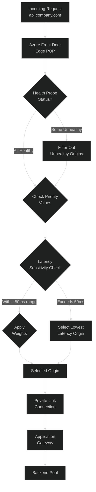

#### Key Considerations

| Consideration | Recommendation |
|---------------|----------------|
| **Same Origin Host Header** | Use the same `originHostHeader` (e.g., `api.company.com`) across all origins |
| **Certificate Validation** | Each App Gateway listener must have a valid certificate for the host header |
| **Private Link Approval** | Each origin creates a separate Private Endpoint that must be approved |
| **Regional Redundancy** | Use different Private Link regions for each origin for cluster redundancy |
| **No Mixed Origins** | Cannot mix public and private origins in the same origin group |

---

### Option 5: Different Backend Hostnames per Application Gateway (Rules Engine)

> **Customer Constraint:** "We cannot use the same backend hostname across all Application Gateways. Each App Gateway has its own listener hostname."

When each Application Gateway has a **different listener hostname** and you cannot standardize them, use **Azure Front Door Rules Engine** to dynamically route and rewrite requests.

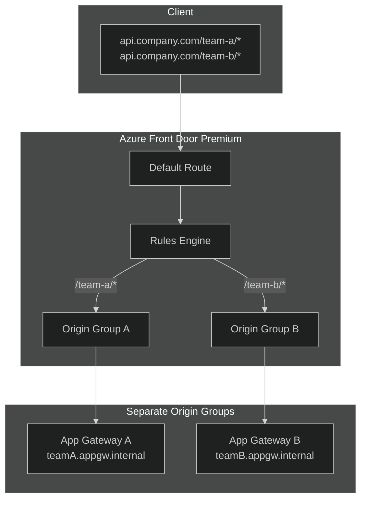

#### Architecture: Multiple Origin Groups + Rules Engine

When backend hostnames differ, create **separate Origin Groups** and use **Rules Engine** to route based on path or headers.

##### Step 1: Create Separate Origin Groups (One per App Gateway)

```bicep
// Origin Group for Team A
resource originGroupA 'Microsoft.Cdn/profiles/originGroups@2023-05-01' = {
  name: 'og-team-a'
  parent: frontDoor
  properties: {
    loadBalancingSettings: {
      sampleSize: 4
      successfulSamplesRequired: 3
      additionalLatencyInMilliseconds: 50
    }
    healthProbeSettings: {
      probePath: '/health'
      probeProtocol: 'Https'
      probeIntervalInSeconds: 30
    }
  }
}

resource originTeamA 'Microsoft.Cdn/profiles/originGroups/origins@2023-05-01' = {
  name: 'origin-appgw-team-a'
  parent: originGroupA
  properties: {
    hostName: 'teamA.appgw.internal'
    originHostHeader: 'teamA.appgw.internal'  // Different per origin
    httpsPort: 443
    priority: 1
    weight: 1000
    enabledState: 'Enabled'
    sharedPrivateLinkResource: {
      privateLink: { id: teamAPrivateLinkId }
      privateLinkLocation: 'westeurope'
      requestMessage: 'AFD connection'
      groupId: ''
    }
  }
}

// Origin Group for Team B
resource originGroupB 'Microsoft.Cdn/profiles/originGroups@2023-05-01' = {
  name: 'og-team-b'
  parent: frontDoor
  properties: {
    loadBalancingSettings: {
      sampleSize: 4
      successfulSamplesRequired: 3
      additionalLatencyInMilliseconds: 50
    }
    healthProbeSettings: {
      probePath: '/health'
      probeProtocol: 'Https'
      probeIntervalInSeconds: 30
    }
  }
}

resource originTeamB 'Microsoft.Cdn/profiles/originGroups/origins@2023-05-01' = {
  name: 'origin-appgw-team-b'
  parent: originGroupB
  properties: {
    hostName: 'teamB.appgw.internal'
    originHostHeader: 'teamB.appgw.internal'  // Different per origin
    httpsPort: 443
    priority: 1
    weight: 1000
    enabledState: 'Enabled'
    sharedPrivateLinkResource: {
      privateLink: { id: teamBPrivateLinkId }
      privateLinkLocation: 'northeurope'
      requestMessage: 'AFD connection'
      groupId: ''
    }
  }
}
```

##### Step 2: Create Rules Engine to Override Origin Group

```bicep
resource ruleSet 'Microsoft.Cdn/profiles/ruleSets@2023-05-01' = {
  name: 'routing-rules'
  parent: frontDoor
}

// Rule 1: Route /team-a/* to Origin Group A
resource ruleTeamA 'Microsoft.Cdn/profiles/ruleSets/rules@2023-05-01' = {
  name: 'route-team-a'
  parent: ruleSet
  properties: {
    order: 1
    conditions: [
      {
        name: 'UrlPath'
        parameters: {
          typeName: 'DeliveryRuleUrlPathMatchConditionParameters'
          operator: 'BeginsWith'
          matchValues: ['/team-a/']
          transforms: ['Lowercase']
        }
      }
    ]
    actions: [
      {
        name: 'RouteConfigurationOverride'
        parameters: {
          typeName: 'DeliveryRuleRouteConfigurationOverrideActionParameters'
          originGroupOverride: {
            originGroup: {
              id: originGroupA.id
            }
            forwardingProtocol: 'HttpsOnly'
          }
        }
      }
    ]
  }
}

// Rule 2: Route /team-b/* to Origin Group B
resource ruleTeamB 'Microsoft.Cdn/profiles/ruleSets/rules@2023-05-01' = {
  name: 'route-team-b'
  parent: ruleSet
  properties: {
    order: 2
    conditions: [
      {
        name: 'UrlPath'
        parameters: {
          typeName: 'DeliveryRuleUrlPathMatchConditionParameters'
          operator: 'BeginsWith'
          matchValues: ['/team-b/']
          transforms: ['Lowercase']
        }
      }
    ]
    actions: [
      {
        name: 'RouteConfigurationOverride'
        parameters: {
          typeName: 'DeliveryRuleRouteConfigurationOverrideActionParameters'
          originGroupOverride: {
            originGroup: {
              id: originGroupB.id
            }
            forwardingProtocol: 'HttpsOnly'
          }
        }
      }
    ]
  }
}
```

##### Step 3: Associate Rules Engine with Route

```bicep
resource route 'Microsoft.Cdn/profiles/afdEndpoints/routes@2023-05-01' = {
  name: 'default-route'
  parent: endpoint
  properties: {
    customDomains: [
      { id: customDomain.id }
    ]
    originGroup: { id: originGroupA.id }  // Default origin group
    patternsToMatch: ['/*']
    forwardingProtocol: 'HttpsOnly'
    httpsRedirect: 'Enabled'
    linkToDefaultDomain: 'Enabled'
    ruleSets: [
      { id: ruleSet.id }  // Apply rules engine
    ]
  }
}
```

#### Alternative: Header-Based Routing

If path-based routing doesn't work, use **custom headers** to determine routing:

```bicep
resource ruleByHeader 'Microsoft.Cdn/profiles/ruleSets/rules@2023-05-01' = {
  name: 'route-by-team-header'
  parent: ruleSet
  properties: {
    order: 1
    conditions: [
      {
        name: 'RequestHeader'
        parameters: {
          typeName: 'DeliveryRuleRequestHeaderConditionParameters'
          headerName: 'X-Target-Team'
          operator: 'Equal'
          matchValues: ['team-a']
          transforms: ['Lowercase']
        }
      }
    ]
    actions: [
      {
        name: 'RouteConfigurationOverride'
        parameters: {
          typeName: 'DeliveryRuleRouteConfigurationOverrideActionParameters'
          originGroupOverride: {
            originGroup: { id: originGroupA.id }
            forwardingProtocol: 'HttpsOnly'
          }
        }
      }
    ]
  }
}
```

---

### Architecture Comparison: Same vs Different Backend Hostnames

| Scenario | Architecture | Complexity | Recommendation |
|----------|--------------|------------|----------------|
| **Same hostname** across all App Gateways | Single Origin Group with multiple origins | Low | ✅ **Preferred** - Simpler, built-in load balancing |
| **Different hostnames** per App Gateway | Multiple Origin Groups + Rules Engine | Medium | Use when standardization is not possible |
| **Path-based routing** needed | Rules Engine with path conditions | Medium | Works with both scenarios |
| **Header-based routing** needed | Rules Engine with header conditions | Medium | Good for API versioning or A/B testing |

---

### Microsoft Documentation References

| Topic | Link |
|-------|------|
| **Private Link with Front Door** | [Secure origin with Private Link](https://learn.microsoft.com/en-us/azure/frontdoor/private-link) |
| **App Gateway as Private Origin** | [Connect AFD to Application Gateway](https://learn.microsoft.com/en-us/azure/frontdoor/how-to-enable-private-link-application-gateway) |
| **Origin Groups & Origins** | [Origins and origin groups](https://learn.microsoft.com/en-us/azure/frontdoor/origin) |
| **Traffic Routing Methods** | [Routing methods (Priority, Weight, Latency)](https://learn.microsoft.com/en-us/azure/frontdoor/routing-methods) |
| **Rules Engine Actions** | [Route configuration override](https://learn.microsoft.com/en-us/azure/frontdoor/front-door-rules-engine-actions) |
| **Route Matching** | [How requests get matched](https://learn.microsoft.com/en-us/azure/frontdoor/front-door-route-matching) |

---

### Key Takeaways

1. **Azure Front Door Premium** is required for Private Link to Application Gateway
2. **Single Origin Group** works when all App Gateways can accept the same `originHostHeader`
3. **Multiple Origin Groups + Rules Engine** is needed when App Gateways have different listener hostnames
4. **Private Link connections** must be approved individually on each Application Gateway
5. **Cannot mix** public and private origins in the same origin group
6. **Regional redundancy** is achieved by using different `privateLinkLocation` values per origin

---

## 4. Central Base Policy Enforcement

### ❓ Question
> Can a central base policy be enforced on use case APIs to prevent them from being bypassed?

### 🎯 Solution: Yes! Use Global, Product, and API Policy Inheritance

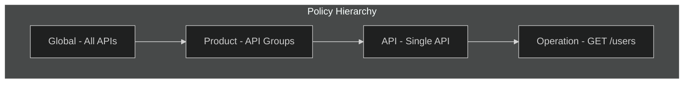

### Policy Execution Order

```
Request Flow:  Global(in) → Product(in) → API(in) → Operation(in) → Backend
Response Flow: Operation(out) → API(out) → Product(out) → Global(out) → Client
```

### Step 1: Define Mandatory Global Policy

```xml
<!-- GLOBAL POLICY: All-APIs scope - Cannot be bypassed! -->
<policies>
    <inbound>
        <!-- ============================================ -->
        <!-- MANDATORY SECURITY CONTROLS - DO NOT REMOVE -->
        <!-- ============================================ -->
        
        <!-- 1. Enforce HTTPS only -->
        <choose>
            <when condition="@(context.Request.OriginalUrl.Scheme != "https")">
                <return-response>
                    <set-status code="403" reason="HTTPS Required" />
                    <set-body>{"error": "HTTPS is mandatory"}</set-body>
                </return-response>
            </when>
        </choose>
        
        <!-- 2. Global rate limiting (prevent abuse) -->
        <rate-limit-by-key calls="1000" 
                          renewal-period="60" 
                          counter-key="@(context.Request.IpAddress)" />
        
        <!-- 3. Mandatory request ID for tracing -->
        <set-header name="X-Request-ID" exists-action="skip">
            <value>@(Guid.NewGuid().ToString())</value>
        </set-header>
        
        <!-- 4. Block deprecated API versions -->
        <choose>
            <when condition="@(context.Request.Headers.GetValueOrDefault("api-version", "") == "v1")">
                <return-response>
                    <set-status code="410" reason="Gone" />
                    <set-body>{"error": "API version v1 is deprecated. Use v2 or later."}</set-body>
                </return-response>
            </when>
        </choose>
        
        <!-- 5. Security headers injection -->
        <set-header name="X-Content-Type-Options" exists-action="override">
            <value>nosniff</value>
        </set-header>
        
        <!-- Allow child policies to execute -->
        <base />
    </inbound>
    
    <backend>
        <base />
    </backend>
    
    <outbound>
        <!-- Execute child policies first -->
        <base />
        
        <!-- ============================================ -->
        <!-- MANDATORY RESPONSE CONTROLS                  -->
        <!-- ============================================ -->
        
        <!-- 1. Remove internal headers -->
        <set-header name="X-Powered-By" exists-action="delete" />
        <set-header name="X-AspNet-Version" exists-action="delete" />
        <set-header name="Server" exists-action="delete" />
        
        <!-- 2. Add security headers -->
        <set-header name="X-Frame-Options" exists-action="override">
            <value>DENY</value>
        </set-header>
        <set-header name="Strict-Transport-Security" exists-action="override">
            <value>max-age=31536000; includeSubDomains</value>
        </set-header>
        
        <!-- 3. CORS enforcement (if applicable) -->
        <cors allow-credentials="false">
            <allowed-origins>
                <origin>https://portal.company.com</origin>
            </allowed-origins>
            <allowed-methods>
                <method>GET</method>
                <method>POST</method>
            </allowed-methods>
        </cors>
    </outbound>
    
    <on-error>
        <base />
        <!-- Global error handling -->
        <set-header name="X-Error-Source" exists-action="override">
            <value>APIM-Gateway</value>
        </set-header>
    </on-error>
</policies>
```

### Step 2: Define Product-Level Policies

```xml
<!-- PRODUCT POLICY: e.g., "Internal APIs" product -->
<policies>
    <inbound>
        <!-- Inherit global policy -->
        <base />
        
        <!-- Product-specific: Require internal traffic source -->
        <choose>
            <when condition="@(context.Variables.GetValueOrDefault<string>("trafficSource") != "internal")">
                <return-response>
                    <set-status code="403" reason="Forbidden" />
                    <set-body>{"error": "This product requires internal access"}</set-body>
                </return-response>
            </when>
        </choose>
        
        <!-- Product-specific rate limit (more restrictive than global) -->
        <rate-limit-by-key calls="100" 
                          renewal-period="60" 
                          counter-key="@(context.Subscription.Id)" />
    </inbound>
    
    <outbound>
        <base />
    </outbound>
</policies>
```

### Step 3: API-Level Policy (Use Case Specific)

```xml
<!-- API POLICY: Use case team can customize, but cannot remove <base /> -->
<policies>
    <inbound>
        <!-- MUST include base to inherit Global + Product policies -->
        <base />
        
        <!-- API-specific: JWT validation for this API -->
        <validate-azure-ad-token tenant-id="{{tenant-id}}">
            <audiences>
                <audience>api://inventory-api</audience>
            </audiences>
        </validate-azure-ad-token>
    </inbound>
    
    <outbound>
        <base />
    </outbound>
</policies>
```

### Enforcement: Azure Policy to Ensure `<base />` is Present

```json
{
  "if": {
    "allOf": [
      {
        "field": "type",
        "equals": "Microsoft.ApiManagement/service/apis/policies"
      },
      {
        "field": "Microsoft.ApiManagement/service/apis/policies/value",
        "notContains": "<base />"
      }
    ]
  },
  "then": {
    "effect": "deny"
  }
}
```

### Policy Inheritance Matrix

| Policy Level | Scope | Can Be Bypassed? | Who Manages |
|--------------|-------|------------------|-------------|
| **Global** | All APIs | ❌ No | Platform Team |
| **Product** | API groups | ⚠️ Only if removed from product | Platform Team |
| **API** | Single API | ✅ Yes (own scope) | Use Case Team |
| **Operation** | Single endpoint | ✅ Yes (own scope) | Use Case Team |

---

## 5. Schema Validation Approach

### ❓ Question
> What would be a sensible approach to schema validation in API management?

### 🎯 Solution: Multi-Layer Validation Strategy

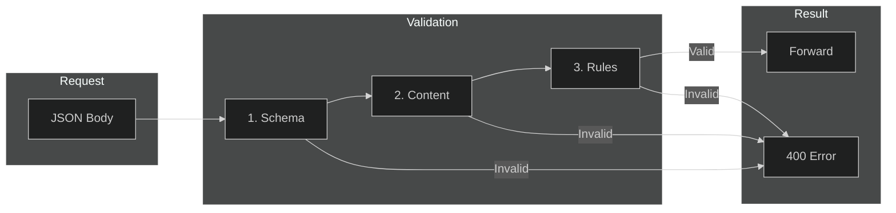

### Approach 1: OpenAPI Schema Validation (Recommended)

#### Step 1: Import API with OpenAPI Specification

```yaml
# openapi.yaml
openapi: 3.0.3
info:
  title: Inventory API
  version: '2.0'
paths:
  /items:
    post:
      requestBody:
        required: true
        content:
          application/json:
            schema:
              $ref: '#/components/schemas/CreateItem'
      responses:
        '201':
          description: Created
components:
  schemas:
    CreateItem:
      type: object
      required:
        - name
        - sku
        - price
      properties:
        name:
          type: string
          minLength: 1
          maxLength: 100
        sku:
          type: string
          pattern: '^[A-Z]{3}-[0-9]{6}$'
        price:
          type: number
          minimum: 0.01
          maximum: 999999.99
        quantity:
          type: integer
          minimum: 0
          default: 0
```

#### Step 2: Enable Content Validation Policy

```xml
<inbound>
    <base />
    
    <!-- Validate request body against OpenAPI schema -->
    <validate-content 
        unspecified-content-type-action="prevent"
        max-size="102400"
        size-exceeded-action="prevent"
        errors-variable-name="requestBodyValidation">
        
        <!-- JSON validation against imported OpenAPI schema -->
        <content type="application/json" validate-as="json" action="prevent" />
    </validate-content>
    
    <!-- Return detailed validation errors -->
    <choose>
        <when condition="@(context.Variables.ContainsKey("requestBodyValidation"))">
            <return-response>
                <set-status code="400" reason="Bad Request" />
                <set-header name="Content-Type" exists-action="override">
                    <value>application/json</value>
                </set-header>
                <set-body>@{
                    var errors = ((List<object>)context.Variables["requestBodyValidation"])
                        .Select(e => e.ToString()).ToArray();
                    return new JObject(
                        new JProperty("error", "Request validation failed"),
                        new JProperty("details", new JArray(errors))
                    ).ToString();
                }</set-body>
            </return-response>
        </when>
    </choose>
</inbound>
```

### Approach 2: Custom JSON Schema Validation

```xml
<inbound>
    <base />
    
    <!-- Store expected schema -->
    <set-variable name="expectedSchema" value="@{
        return new JObject(
            new JProperty("type", "object"),
            new JProperty("required", new JArray("name", "email")),
            new JProperty("properties", new JObject(
                new JProperty("name", new JObject(
                    new JProperty("type", "string"),
                    new JProperty("minLength", 1)
                )),
                new JProperty("email", new JObject(
                    new JProperty("type", "string"),
                    new JProperty("pattern", @"^[^@]+@[^@]+\.[^@]+$")
                ))
            ))
        ).ToString();
    }" />
    
    <!-- Validate against schema using expression -->
    <set-variable name="validationResult" value="@{
        try {
            var body = context.Request.Body.As<JObject>(preserveContent: true);
            
            // Check required fields
            if (body["name"] == null || body["email"] == null) {
                return "Missing required fields: name, email";
            }
            
            // Check email format
            var email = body["email"]?.ToString() ?? "";
            if (!System.Text.RegularExpressions.Regex.IsMatch(email, @"^[^@]+@[^@]+\.[^@]+$")) {
                return "Invalid email format";
            }
            
            return "valid";
        }
        catch (Exception ex) {
            return $"Parse error: {ex.Message}";
        }
    }" />
    
    <choose>
        <when condition="@(context.Variables.GetValueOrDefault<string>("validationResult") != "valid")">
            <return-response>
                <set-status code="400" reason="Bad Request" />
                <set-body>@{
                    return new JObject(
                        new JProperty("error", context.Variables["validationResult"])
                    ).ToString();
                }</set-body>
            </return-response>
        </when>
    </choose>
</inbound>
```

### Approach 3: Header and Parameter Validation

```xml
<inbound>
    <base />
    
    <!-- Validate required headers -->
    <validate-headers specified-header-action="ignore" unspecified-header-action="ignore">
        <header name="Content-Type" action="prevent">
            <value>application/json</value>
        </header>
        <header name="X-Correlation-ID" action="prevent" />
    </validate-headers>
    
    <!-- Validate query parameters -->
    <validate-parameters specified-parameter-action="prevent" 
                         unspecified-parameter-action="prevent">
        <parameter name="api-version" action="prevent">
            <value>2023-01-01</value>
            <value>2024-01-01</value>
        </parameter>
    </validate-parameters>
</inbound>
```

### Validation Strategy Summary

| Validation Type | Policy | Use Case |
|-----------------|--------|----------|
| **OpenAPI Schema** | `validate-content` | Standard REST APIs with spec |
| **Custom JSON** | Expression-based | Complex business rules |
| **Headers** | `validate-headers` | API versioning, correlation |
| **Parameters** | `validate-parameters` | Query string validation |
| **JWT Claims** | `validate-jwt` | Authorization data |
| **Size Limits** | `validate-content max-size` | Prevent payload abuse |

### Best Practices

1. **Fail Fast**: Validate at the gateway before reaching backends
2. **Detailed Errors**: Return actionable error messages (in dev/test)
3. **Generic Errors in Prod**: Don't expose schema details to attackers
4. **Version Your Schemas**: Align with API versioning strategy
5. **Performance**: Cache schema validations where possible

---

## 6. Developer Portal & Entra ID Integration

### ❓ Question
> We have currently deactivated the Developer Portal in API management. What benefits would there be in activating it? How would this work in practice? The same applies to user management via Entra ID.

### 🎯 Benefits of Activating the Developer Portal

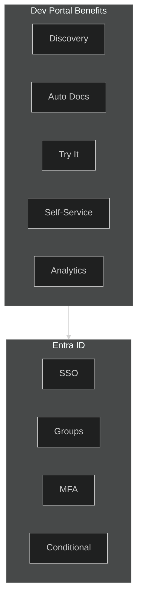

### Developer Portal Benefits

| Benefit | Without Portal | With Portal |
|---------|----------------|-------------|
| **API Discovery** | Manual documentation | Self-service browsing |
| **Documentation** | Separate docs site | Auto-generated from OpenAPI |
| **Testing** | External tools (Postman) | Built-in "Try It" console |
| **Onboarding** | Manual key distribution | Self-service subscription |
| **Key Management** | Admin manages all keys | Developers manage own keys |
| **Usage Visibility** | Only for admins | Developers see own usage |

### When to Activate the Developer Portal

| Scenario | Recommendation |
|----------|----------------|
| Internal APIs only | ✅ Activate (internal users benefit) |
| Partner APIs | ✅ Activate (essential for partners) |
| Public APIs | ✅ Activate (required for adoption) |
| Single consumer | ⚠️ Optional (limited benefit) |
| High security / regulated | ⚠️ Evaluate carefully |

---

### Entra ID Integration Architecture

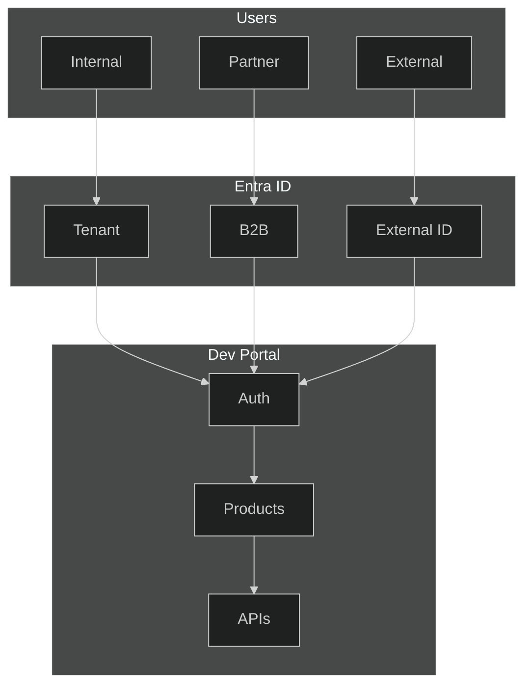

### Step-by-Step: Enable Entra ID for Developer Portal

#### Step 1: Register Application in Entra ID

```bash
# Create app registration for Developer Portal
az ad app create \
  --display-name "APIM Developer Portal" \
  --sign-in-audience "AzureADMyOrg" \
  --web-redirect-uris "https://apim-prod.developer.azure-api.net/signin-oauth/code/callback/aad" \
  --enable-id-token-issuance true
```

#### Step 2: Configure APIM Identity Provider (Bicep)

```bicep
resource entraIdProvider 'Microsoft.ApiManagement/service/identityProviders@2023-05-01-preview' = {
  name: 'aad'
  parent: apim
  properties: {
    type: 'aad'
    clientId: entraAppClientId
    clientSecret: entraAppClientSecret  // Store in Key Vault
    allowedTenants: [
      tenantId
    ]
    authority: 'https://login.microsoftonline.com/${tenantId}'
    signinTenant: tenantId
  }
}
```

#### Step 3: Configure Portal Authentication

```bicep
resource portalConfig 'Microsoft.ApiManagement/service/portalsettings/signin@2023-05-01-preview' = {
  name: 'signin'
  parent: apim
  properties: {
    enabled: true
  }
}

resource portalSignup 'Microsoft.ApiManagement/service/portalsettings/signup@2023-05-01-preview' = {
  name: 'signup'
  parent: apim
  properties: {
    enabled: false  // Disable self-registration (Entra ID only)
    termsOfService: {
      enabled: true
      consentRequired: true
      text: 'Terms of Service text...'
    }
  }
}
```

#### Step 4: Map Entra ID Groups to APIM Groups

```bicep
// Create APIM group linked to Entra ID group
resource developerGroup 'Microsoft.ApiManagement/service/groups@2023-05-01-preview' = {
  name: 'api-developers'
  parent: apim
  properties: {
    displayName: 'API Developers'
    description: 'Internal developers with API access'
    type: 'external'
    externalId: 'aad://${tenantId}/groups/${entraGroupId}'  // Link to Entra group
  }
}

// Associate group with product
resource productGroup 'Microsoft.ApiManagement/service/products/groups@2023-05-01-preview' = {
  name: 'api-developers'
  parent: internalApisProduct
}
```

### Security Best Practices for Developer Portal

| Setting | Recommendation | Reason |
|---------|----------------|--------|
| **Self-registration** | Disable | Use Entra ID only |
| **Anonymous access** | Disable | Require authentication |
| **Basic auth** | Disable | Use Entra ID only |
| **Guest users** | Entra B2B | Controlled partner access |
| **MFA** | Enable via Conditional Access | Security requirement |
| **IP restrictions** | Enable | Limit portal access |

### Practical Workflow with Developer Portal

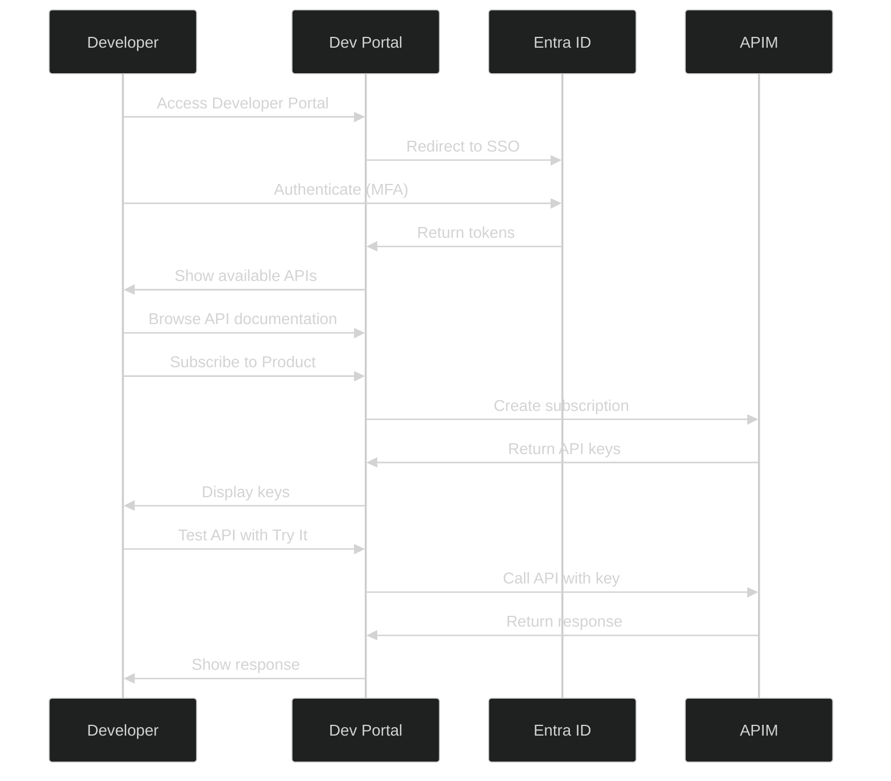

### Complete Configuration Checklist

#### Pre-Activation
- [ ] Entra ID app registration created
- [ ] Redirect URIs configured
- [ ] Client secret stored in Key Vault
- [ ] Entra groups defined for access control

#### Portal Configuration
- [ ] Entra ID identity provider configured
- [ ] Self-registration disabled
- [ ] Anonymous access disabled
- [ ] Basic authentication disabled
- [ ] Terms of service configured

#### Access Control
- [ ] APIM groups linked to Entra groups
- [ ] Products associated with groups
- [ ] API visibility configured
- [ ] Subscription approval workflow defined

#### Security Hardening
- [ ] Conditional Access policies applied
- [ ] MFA required for portal access
- [ ] IP restrictions configured (if needed)
- [ ] CORS configured for custom domains

---

## 📚 Summary

| Question | Key Solution |
|----------|--------------|
| **Log Isolation** | Resource-Context RBAC + scoped queries |
| **Internal vs External** | Header-based detection + NSG enforcement |
| **Multiple Origins** | Path-based routing in App Gateway |
| **Base Policy** | Global policy with mandatory `<base />` |
| **Schema Validation** | `validate-content` with OpenAPI specs |
| **Developer Portal** | Enable + Entra ID SSO + group-based access |

---

## 🔗 Related Documents

| Document | Description |
|----------|-------------|
| [02-Reliability](./02-reliability.md) | HA and isolation patterns |
| [03-Security](./03-security.md) | Security policies |
| [04-Policies](./04-policies.md) | Policy patterns |
| [05-DevOps](./05-devops-apiops.md) | APIOps and governance |
| [11-Monetization](./11-monetization.md) | Products and subscriptions |

---

> **Back to**: [README](./README.md) - Main documentation index
