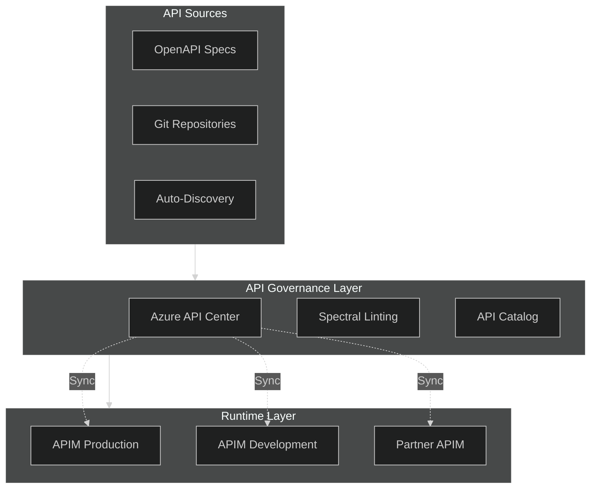

# 14 - API Governance & API Center

> Centralized API inventory, lifecycle governance, linting, and compliance

---

## 🎯 Why API Governance Matters

| Challenge | Without Governance | With Governance |
|-----------|-------------------|-----------------|
| **API Discovery** | Shadow APIs, undocumented endpoints | Centralized catalog |
| **Consistency** | Inconsistent naming, versioning | Enforced standards |
| **Compliance** | Security gaps, audit failures | Policy enforcement |
| **Lifecycle** | Abandoned APIs, breaking changes | Managed deprecation |
| **Ownership** | Unclear responsibility | Defined stewardship |

---

## 🏗️ Governance Architecture



---

## 📋 Azure API Center

Azure API Center provides a **centralized inventory** of all APIs across your organization, regardless of where they're hosted.

### Key Capabilities

| Capability | Description |
|------------|-------------|
| **Inventory** | Catalog all APIs (APIM, Kong, AWS, on-prem) |
| **Metadata** | Custom properties, tags, lifecycle stages |
| **Environments** | Track dev/test/prod deployments |
| **Versions** | Manage API versions and revisions |
| **Analysis** | API quality, compliance scoring |

### Setup API Center (Bicep)

```bicep
resource apiCenter 'Microsoft.ApiCenter/services@2024-03-01' = {
  name: 'apic-enterprise-${environment}'
  location: location
  properties: {}
}

// Define custom metadata schema
resource metadataSchema 'Microsoft.ApiCenter/services/metadataSchemas@2024-03-01' = {
  name: 'api-metadata'
  parent: apiCenter
  properties: {
    schema: '''
    {
      "type": "object",
      "properties": {
        "owner": { "type": "string", "title": "API Owner" },
        "team": { "type": "string", "title": "Owning Team" },
        "dataClassification": { 
          "type": "string", 
          "enum": ["Public", "Internal", "Confidential", "Restricted"],
          "title": "Data Classification"
        },
        "complianceStatus": {
          "type": "string",
          "enum": ["Compliant", "Non-Compliant", "Pending Review"],
          "title": "Compliance Status"
        },
        "slaTarget": { "type": "string", "title": "SLA Target" }
      },
      "required": ["owner", "team", "dataClassification"]
    }
    '''
    assignedTo: [
      { entity: 'api' }
    ]
  }
}

// Define API lifecycle stages
resource lifecycleStages 'Microsoft.ApiCenter/services/workspaces@2024-03-01' = {
  name: 'default'
  parent: apiCenter
  properties: {}
}
```

### Register APIs from APIM

```bash
# Sync APIs from APIM to API Center
az apic api register \
  --service-name apic-enterprise-prod \
  --resource-group rg-governance \
  --api-name "dataset-api" \
  --title "Dataset API" \
  --kind "rest" \
  --definition-path ./api-specs/dataset-api.json \
  --definition-format openapi

# Add custom metadata
az apic api update \
  --service-name apic-enterprise-prod \
  --api-name dataset-api \
  --custom-properties '{
    "owner": "data-mesh-team",
    "team": "Platform",
    "dataClassification": "Internal",
    "slaTarget": "99.9%"
  }'
```

---

## 📏 API Linting with Spectral

### Standard Ruleset

```yaml
# .spectral.yaml - Enterprise API Standards
extends: ["spectral:oas", "spectral:asyncapi"]

rules:
  # Naming conventions
  paths-kebab-case:
    description: Paths must be kebab-case
    given: "$.paths[*]~"
    then:
      function: pattern
      functionOptions:
        match: "^(/[a-z0-9-]+)+$"
    severity: error

  # Versioning
  api-version-required:
    description: API must have version in info
    given: "$.info"
    then:
      field: version
      function: truthy
    severity: error

  # Security
  security-schemes-defined:
    description: API must define security schemes
    given: "$.components"
    then:
      field: securitySchemes
      function: truthy
    severity: error

  operation-security-defined:
    description: All operations must have security
    given: "$.paths[*][get,post,put,patch,delete]"
    then:
      field: security
      function: truthy
    severity: warn

  # Documentation
  operation-description:
    description: Operations must have descriptions
    given: "$.paths[*][get,post,put,patch,delete]"
    then:
      field: description
      function: truthy
    severity: warn

  operation-operationId:
    description: Operations must have operationId
    given: "$.paths[*][get,post,put,patch,delete]"
    then:
      field: operationId
      function: truthy
    severity: error

  # Response standards
  response-success-defined:
    description: Success response must be defined
    given: "$.paths[*][get,post,put,patch,delete].responses"
    then:
      field: "200|201|204"
      function: truthy
    severity: error

  response-error-defined:
    description: Error responses should be defined
    given: "$.paths[*][get,post,put,patch,delete].responses"
    then:
      - field: "400"
        function: truthy
      - field: "500"
        function: truthy
    severity: warn

  # Pagination
  collection-pagination:
    description: Collections should support pagination
    given: "$.paths[*].get.parameters"
    then:
      function: schema
      functionOptions:
        schema:
          type: array
          contains:
            properties:
              name:
                pattern: "^(page|offset|limit|cursor)$"
    severity: info
```

### Pipeline Integration

```yaml
# azure-pipelines.yml - API Linting Stage
stages:
  - stage: Lint
    displayName: 'API Spec Validation'
    jobs:
      - job: SpectralLint
        displayName: 'Spectral Linting'
        pool:
          vmImage: 'ubuntu-latest'
        steps:
          - task: NodeTool@0
            inputs:
              versionSpec: '18.x'
          
          - script: npm install -g @stoplight/spectral-cli
            displayName: 'Install Spectral'
          
          - script: |
              spectral lint api-specs/**/*.json \
                --ruleset .spectral.yaml \
                --format junit \
                --output spectral-results.xml
            displayName: 'Lint API Specs'
            continueOnError: true
          
          - task: PublishTestResults@2
            inputs:
              testResultsFormat: 'JUnit'
              testResultsFiles: 'spectral-results.xml'
              testRunTitle: 'API Linting Results'
```

---

## 📊 API Lifecycle Management

### Lifecycle Stages


| Stage | Description | Actions |
|-------|-------------|---------|
| **Design** | API specification created | Linting, review |
| **Development** | Implementation in progress | Dev APIM deployment |
| **Testing** | QA and integration testing | Test APIM deployment |
| **Production** | Live and serving traffic | Prod APIM deployment |
| **Deprecated** | Scheduled for removal | Sunset headers |
| **Retired** | No longer available | Remove from APIM |

### Deprecation Policy

```xml
<!-- Add deprecation headers -->
<outbound>
    <base />
    <choose>
        <when condition="@(context.Api.Version == "v1")">
            <set-header name="Deprecation" exists-action="override">
                <value>true</value>
            </set-header>
            <set-header name="Sunset" exists-action="override">
                <value>Sat, 01 Mar 2025 00:00:00 GMT</value>
            </set-header>
            <set-header name="Link" exists-action="override">
                <value>&lt;/v2/&gt;; rel="successor-version"</value>
            </set-header>
        </when>
    </choose>
</outbound>
```

---

## 🔒 Compliance & Audit

### Compliance Checklist by Data Classification

| Requirement | Public | Internal | Confidential | Restricted |
|-------------|:------:|:--------:|:------------:|:----------:|
| HTTPS Only | ✅ | ✅ | ✅ | ✅ |
| Authentication | Optional | ✅ | ✅ | ✅ |
| OAuth 2.0/OIDC | Optional | Recommended | ✅ | ✅ |
| Rate Limiting | ✅ | ✅ | ✅ | ✅ |
| Request Logging | Optional | ✅ | ✅ | ✅ |
| PII Masking | N/A | N/A | ✅ | ✅ |
| VNet Integration | Optional | Optional | ✅ | ✅ |
| Private Endpoint | Optional | Optional | Recommended | ✅ |
| WAF Protection | Optional | Recommended | ✅ | ✅ |
| Audit Logging | Optional | ✅ | ✅ | ✅ |

### Automated Compliance Checks

```bicep
// Azure Policy for API Management compliance
resource apimCompliancePolicy 'Microsoft.Authorization/policyDefinitions@2021-06-01' = {
  name: 'apim-compliance-policy'
  properties: {
    displayName: 'APIM Compliance Requirements'
    policyType: 'Custom'
    mode: 'Indexed'
    policyRule: {
      if: {
        allOf: [
          {
            field: 'type'
            equals: 'Microsoft.ApiManagement/service'
          }
          {
            anyOf: [
              // Must have VNet integration
              {
                field: 'Microsoft.ApiManagement/service/virtualNetworkType'
                equals: 'None'
              }
              // Must have minimum TLS 1.2
              {
                field: 'Microsoft.ApiManagement/service/customProperties[Microsoft.WindowsAzure.ApiManagement.Gateway.Security.Protocols.Tls10]'
                notEquals: 'false'
              }
            ]
          }
        ]
      }
      then: {
        effect: 'audit'
      }
    }
  }
}
```

---

## 📋 Governance Checklist

### API Onboarding
- [ ] API registered in API Center
- [ ] OpenAPI specification validated with Spectral
- [ ] Security scheme defined
- [ ] Owner and team assigned
- [ ] Data classification labeled
- [ ] Lifecycle stage set
- [ ] SLA target defined

### Ongoing Governance
- [ ] Regular API inventory review
- [ ] Deprecated API sunset tracking
- [ ] Compliance score monitoring
- [ ] Usage analytics review
- [ ] Breaking change management

---

## 🔗 Related Documents

| Document | Description |
|----------|-------------|
| [05-DevOps-APIOps](./05-devops-apiops.md) | CI/CD integration |
| [03-Security](./03-security.md) | Security compliance |
| [11-Monetization](./11-monetization.md) | Developer portal |

---

> **Next**: [15-Migration-Patterns](./15-migration-patterns.md) - Migrating from other API gateways
