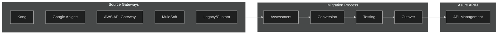
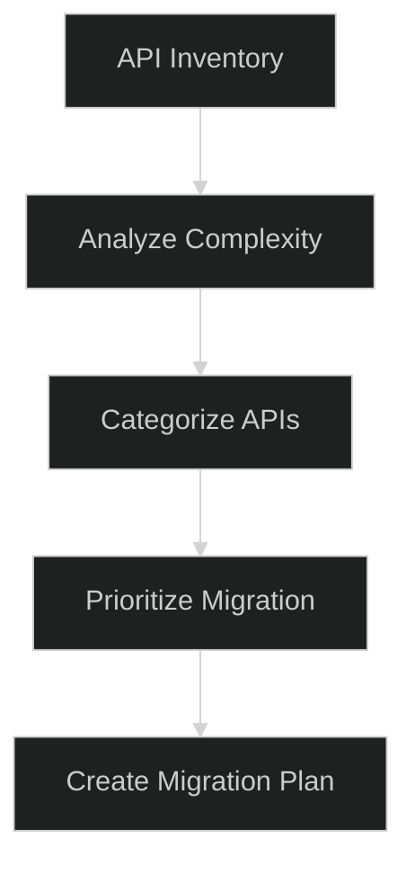
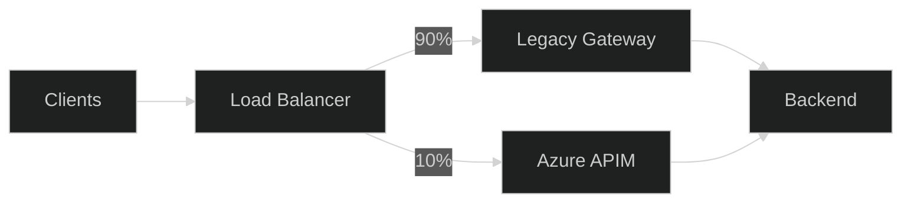

# 15 - Migration Patterns

> Migrating to Azure APIM from Kong, Apigee, AWS API Gateway, and legacy gateways

---

## 🎯 Migration Overview



---

## 📊 Feature Mapping Matrix

| Feature | Kong | Apigee | AWS API GW | APIM Equivalent |
|---------|------|--------|------------|-----------------|
| **Rate Limiting** | rate-limiting plugin | Spike Arrest | Usage Plans | `rate-limit`, `rate-limit-by-key` |
| **JWT Validation** | jwt plugin | VerifyJWT | Cognito/Custom | `validate-jwt`, `validate-azure-ad-token` |
| **API Keys** | key-auth plugin | API Key | API Keys | Subscription keys |
| **Caching** | proxy-cache plugin | ResponseCache | Built-in caching | `cache-lookup`, `cache-store` |
| **Request Transform** | request-transformer | AssignMessage | Mapping templates | `set-header`, `set-body`, `rewrite-uri` |
| **Response Transform** | response-transformer | AssignMessage | Mapping templates | `set-header`, `set-body` |
| **Load Balancing** | upstream targets | Target Servers | VPC Link | Backend pools |
| **Circuit Breaker** | Custom/Kong Gateway | N/A | N/A | `retry`, circuit-breaker in backends |
| **OAuth 2.0** | oauth2 plugin | OAuth | Cognito | OAuth 2.0 authorization servers |
| **IP Filtering** | ip-restriction plugin | AccessControl | Resource policies | `ip-filter` |
| **CORS** | cors plugin | CORS | CORS config | `cors` policy |
| **Logging** | Various plugins | MessageLogging | CloudWatch | Application Insights, Event Hub |
| **Quota** | rate-limiting plugin | Quota | Usage Plans | `quota`, `quota-by-key` |

---

## 🐒 Kong Migration

### Kong to APIM Mapping

| Kong Concept | APIM Equivalent |
|--------------|-----------------|
| Service | Backend |
| Route | API Operation |
| Plugin (global) | Global Policy |
| Plugin (service) | API Policy |
| Plugin (route) | Operation Policy |
| Consumer | User/Subscription |
| Upstream | Backend Pool |

### Kong Plugin to APIM Policy

```yaml
# Kong rate-limiting plugin
plugins:
  - name: rate-limiting
    config:
      minute: 100
      policy: local
```

```xml
<!-- APIM equivalent -->
<inbound>
    <rate-limit calls="100" renewal-period="60" />
</inbound>
```

```yaml
# Kong jwt plugin
plugins:
  - name: jwt
    config:
      key_claim_name: iss
      secret_is_base64: false
```

```xml
<!-- APIM equivalent -->
<inbound>
    <validate-jwt header-name="Authorization" require-signed-tokens="true">
        <openid-config url="https://login.microsoftonline.com/{tenant}/v2.0/.well-known/openid-configuration"/>
        <issuers>
            <issuer>https://login.microsoftonline.com/{tenant}/v2.0</issuer>
        </issuers>
    </validate-jwt>
</inbound>
```

### Kong Export Script

```bash
#!/bin/bash
# Export Kong configuration for migration analysis

# Export services
curl -s http://kong-admin:8001/services | jq '.' > kong-services.json

# Export routes
curl -s http://kong-admin:8001/routes | jq '.' > kong-routes.json

# Export plugins
curl -s http://kong-admin:8001/plugins | jq '.' > kong-plugins.json

# Export consumers
curl -s http://kong-admin:8001/consumers | jq '.' > kong-consumers.json

# Export upstreams
curl -s http://kong-admin:8001/upstreams | jq '.' > kong-upstreams.json

echo "Kong configuration exported. Review files for migration planning."
```

---

## 🌐 Google Apigee Migration

### Apigee to APIM Mapping

| Apigee Concept | APIM Equivalent |
|----------------|-----------------|
| API Proxy | API |
| ProxyEndpoint | Frontend |
| TargetEndpoint | Backend |
| Flow | Policy section |
| Policy | Policy element |
| Product | Product |
| Developer App | Subscription |
| Environment | APIM instance or tags |

### Apigee Policy Conversions

```xml
<!-- Apigee: AssignMessage -->
<AssignMessage name="SetHeaders">
    <Set>
        <Headers>
            <Header name="X-Custom-Header">value</Header>
        </Headers>
    </Set>
</AssignMessage>
```

```xml
<!-- APIM equivalent -->
<set-header name="X-Custom-Header" exists-action="override">
    <value>value</value>
</set-header>
```

```xml
<!-- Apigee: SpikeArrest -->
<SpikeArrest name="SpikeArrest">
    <Rate>100pm</Rate>
</SpikeArrest>
```

```xml
<!-- APIM equivalent -->
<rate-limit calls="100" renewal-period="60" />
```

```xml
<!-- Apigee: Quota -->
<Quota name="CheckQuota">
    <Interval>1</Interval>
    <TimeUnit>day</TimeUnit>
    <Allow count="1000"/>
</Quota>
```

```xml
<!-- APIM equivalent -->
<quota calls="1000" renewal-period="86400" />
```

```xml
<!-- Apigee: VerifyJWT -->
<VerifyJWT name="VerifyJWT">
    <Algorithm>RS256</Algorithm>
    <Source>request.header.Authorization</Source>
    <Issuer>https://issuer.example.com</Issuer>
</VerifyJWT>
```

```xml
<!-- APIM equivalent -->
<validate-jwt header-name="Authorization" require-signed-tokens="true">
    <issuers>
        <issuer>https://issuer.example.com</issuer>
    </issuers>
    <required-claims>
        <claim name="iss" match="all">
            <value>https://issuer.example.com</value>
        </claim>
    </required-claims>
</validate-jwt>
```

---

## ☁️ AWS API Gateway Migration

### AWS to APIM Mapping

| AWS Concept | APIM Equivalent |
|-------------|-----------------|
| REST API | API |
| Resource | API path |
| Method | Operation |
| Stage | Tags, Named values |
| Usage Plan | Product |
| API Key | Subscription key |
| Authorizer | Policy (validate-jwt) |
| Integration | Backend |
| Mapping Template | Policies (set-body) |

### AWS Authorizer to APIM

```json
// AWS Lambda Authorizer (conceptual)
{
  "type": "TOKEN",
  "identitySource": "method.request.header.Authorization",
  "authorizerUri": "arn:aws:lambda:..."
}
```

```xml
<!-- APIM: JWT validation (replaces Lambda authorizer) -->
<validate-jwt header-name="Authorization" 
              failed-validation-httpcode="401">
    <openid-config url="https://cognito-idp.{region}.amazonaws.com/{userPoolId}/.well-known/openid-configuration"/>
    <audiences>
        <audience>{app-client-id}</audience>
    </audiences>
</validate-jwt>
```

### AWS Mapping Template to APIM

```velocity
## AWS Request Mapping Template
{
  "userId": "$input.params('id')",
  "body": $input.json('$')
}
```

```xml
<!-- APIM equivalent -->
<set-body>@{
    var id = context.Request.MatchedParameters["id"];
    var body = context.Request.Body.As<JObject>();
    return new JObject(
        new JProperty("userId", id),
        new JProperty("body", body)
    ).ToString();
}</set-body>
```

### AWS Export Script

```bash
#!/bin/bash
# Export AWS API Gateway configuration

API_ID="your-api-id"
STAGE="prod"

# Export API definition
aws apigateway get-export \
    --rest-api-id $API_ID \
    --stage-name $STAGE \
    --export-type oas30 \
    aws-api-export.json

# Export usage plans
aws apigateway get-usage-plans > aws-usage-plans.json

# Export API keys
aws apigateway get-api-keys --include-values > aws-api-keys.json

echo "AWS API Gateway exported. Import OpenAPI to APIM."
```

---

## 📋 Migration Methodology

### Phase 1: Discovery & Assessment



| Task | Output |
|------|--------|
| **Inventory** | List of all APIs, endpoints, consumers |
| **Dependency Map** | Backend services, auth providers |
| **Traffic Analysis** | Request volumes, patterns |
| **Policy Audit** | Custom plugins, complex logic |
| **Risk Assessment** | Breaking changes, downtime impact |

### Phase 2: Parallel Running



**Canary Migration Pattern:**
1. Deploy API to APIM
2. Route 10% traffic to APIM
3. Compare responses, latency
4. Gradually increase to 100%
5. Decommission legacy

### Phase 3: Cutover Checklist

- [ ] All APIs deployed to APIM
- [ ] Policies tested and validated
- [ ] Developer portal configured
- [ ] Subscriptions migrated
- [ ] DNS updated
- [ ] Monitoring configured
- [ ] Runbooks updated
- [ ] Team trained
- [ ] Rollback plan tested

---

## 🔄 OpenAPI Import Workflow

### Import API from OpenAPI

```bicep
resource api 'Microsoft.ApiManagement/service/apis@2023-05-01-preview' = {
  name: 'migrated-api'
  parent: apim
  properties: {
    format: 'openapi+json'
    value: loadTextContent('./openapi-export.json')
    path: 'v1/migrated'
    protocols: ['https']
    subscriptionRequired: true
    apiType: 'http'
  }
}
```

### Post-Import Enhancements

```xml
<!-- Add APIM-specific policies after import -->
<policies>
    <inbound>
        <base />
        <!-- Add authentication -->
        <validate-azure-ad-token tenant-id="{{tenant-id}}">
            <audiences>
                <audience>api://{{app-id}}</audience>
            </audiences>
        </validate-azure-ad-token>
        <!-- Add rate limiting -->
        <rate-limit calls="100" renewal-period="60" />
    </inbound>
    <backend>
        <base />
        <!-- Configure backend pool -->
        <set-backend-service backend-id="backend-pool" />
    </backend>
    <outbound>
        <base />
        <!-- Add correlation headers -->
        <set-header name="X-Request-Id" exists-action="override">
            <value>@(context.RequestId.ToString())</value>
        </set-header>
    </outbound>
</policies>
```

---

## ⚠️ Common Migration Pitfalls

| Pitfall | Mitigation |
|---------|------------|
| **Custom plugin logic** | May need Azure Functions for complex logic |
| **Different auth models** | Map to Entra ID where possible |
| **Performance differences** | Load test before cutover |
| **Policy syntax errors** | Validate in dev environment first |
| **Consumer migration** | Communicate changes, provide migration period |
| **Missing features** | Use workarounds or accept limitations |

---

## 📊 Migration Effort Estimation

| API Complexity | Characteristics | Effort |
|----------------|-----------------|--------|
| **Simple** | CRUD, no transforms, basic auth | 2-4 hours |
| **Medium** | Custom policies, JWT, caching | 1-2 days |
| **Complex** | Extensive transforms, custom logic | 3-5 days |
| **Very Complex** | Multiple backends, orchestration | 1-2 weeks |

---

## 🔗 Related Documents

| Document | Description |
|----------|-------------|
| [01-Architecture](./01-architecture-overview.md) | Target architecture |
| [04-Policies](./04-policies.md) | Policy reference |
| [05-DevOps-APIOps](./05-devops-apiops.md) | IaC deployment |

---

> **Next**: [16-Production-Checklist](./16-production-checklist.md) - Go-live readiness checklist
