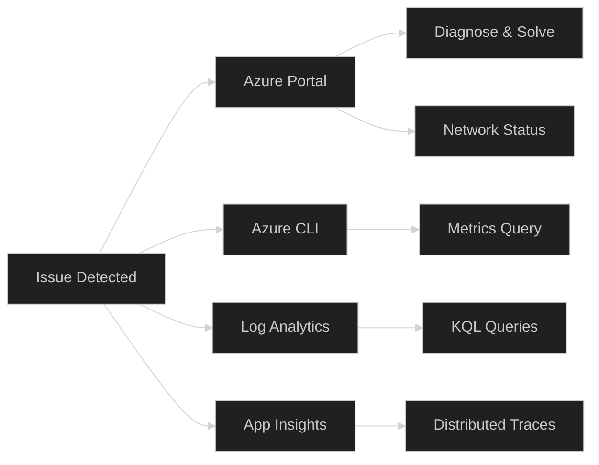
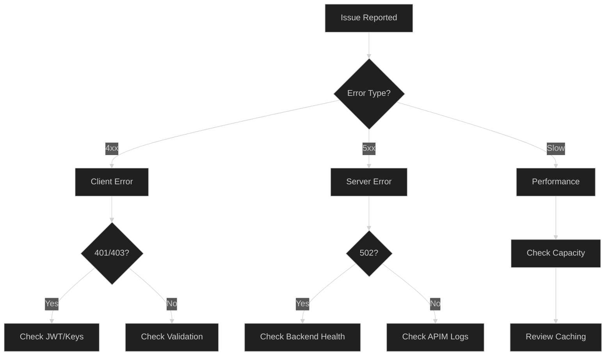

# 17 - Troubleshooting Guide

> Common issues, diagnostics, and resolution patterns for Azure API Management

---

## 🔍 Diagnostic Tools Overview



---

## 🚨 Common Issues & Solutions

### 1. 502 Bad Gateway

**Symptoms:** Clients receive 502 errors intermittently or consistently.

**Causes & Solutions:**

| Cause | Diagnosis | Solution |
|-------|-----------|----------|
| Backend timeout | Check `BackendDuration` metric | Increase timeout or optimize backend |
| Backend unreachable | Network Status blade | Fix NSG, firewall, private endpoint |
| SSL/TLS handshake failure | Check backend TLS version | Align TLS versions |
| Invalid backend certificate | Certificate validation error | Fix certificate chain |

**Diagnostic Query:**

```kusto
ApiManagementGatewayLogs
| where TimeGenerated > ago(1h)
| where ResponseCode == 502
| project TimeGenerated, ApiId, OperationId, BackendUrl, 
          BackendResponseCode, LastErrorMessage, TotalTime
| order by TimeGenerated desc
```

**Policy Fix (Retry):**

```xml
<backend>
    <retry condition="@(context.Response.StatusCode == 502)" 
           count="3" 
           interval="1" 
           delta="2" 
           max-interval="10" 
           first-fast-retry="true">
        <forward-request buffer-request-body="true" timeout="60" />
    </retry>
</backend>
```

---

### 2. 401 Unauthorized

**Symptoms:** JWT validation failing, subscription key rejected.

**Causes & Solutions:**

| Cause | Diagnosis | Solution |
|-------|-----------|----------|
| Invalid JWT | Check token claims | Verify issuer, audience |
| Expired token | Check `exp` claim | Token refresh logic |
| Wrong subscription key | Key mismatch | Use correct key |
| Subscription suspended | Check subscription state | Reactivate |

**Diagnostic Query:**

```kusto
ApiManagementGatewayLogs
| where TimeGenerated > ago(1h)
| where ResponseCode == 401
| project TimeGenerated, ApiId, CallerIpAddress, 
          LastErrorReason, LastErrorMessage
| summarize Count=count() by LastErrorReason
```

**Debug JWT Issues:**

```xml
<inbound>
    <!-- Debug: Log JWT claims (DEV ONLY - remove in prod) -->
    <validate-jwt header-name="Authorization" 
                  output-token-variable-name="jwt"
                  failed-validation-httpcode="401">
        <openid-config url="{{openid-config-url}}"/>
    </validate-jwt>
    
    <trace source="JWT Debug">
        <message>@{
            var jwt = (Jwt)context.Variables["jwt"];
            return $"Subject: {jwt.Subject}, Issuer: {jwt.Issuer}, Audience: {string.Join(",", jwt.Audiences)}";
        }</message>
    </trace>
</inbound>
```

---

### 3. 429 Too Many Requests

**Symptoms:** Rate limit or quota exceeded.

**Causes & Solutions:**

| Cause | Diagnosis | Solution |
|-------|-----------|----------|
| Rate limit hit | Check `Retry-After` header | Implement backoff |
| Quota exhausted | Check quota remaining | Upgrade tier or wait |
| Misconfigured limits | Review policy | Adjust limits |

**Diagnostic Query:**

```kusto
ApiManagementGatewayLogs
| where TimeGenerated > ago(24h)
| where ResponseCode == 429
| summarize RateLimitHits=count() by SubscriptionId, bin(TimeGenerated, 1h)
| render timechart
```

**Response Headers to Check:**

```
Retry-After: 30
X-RateLimit-Remaining: 0
X-RateLimit-Reset: 1702743600
```

---

### 4. High Latency

**Symptoms:** Slow API responses, P95 > SLA target.

**Causes & Solutions:**

| Cause | Diagnosis | Solution |
|-------|-----------|----------|
| Slow backend | `BackendDuration` high | Optimize backend |
| Policy processing | `TotalTime - BackendDuration` | Simplify policies |
| Network latency | Geographic distance | Deploy closer |
| No caching | Cache miss | Implement caching |

**Diagnostic Query:**

```kusto
ApiManagementGatewayLogs
| where TimeGenerated > ago(1h)
| summarize 
    P50=percentile(TotalTime, 50),
    P95=percentile(TotalTime, 95),
    P99=percentile(TotalTime, 99),
    AvgBackend=avg(BackendTime)
    by ApiId, bin(TimeGenerated, 5m)
| order by P95 desc
```

**Latency Breakdown:**

```
TotalTime = GatewayTime + BackendTime
GatewayTime = Policy Processing + Network Overhead
```

---

### 5. Capacity Issues

**Symptoms:** High capacity metric, slow responses, timeouts.

**Causes & Solutions:**

| Cause | Diagnosis | Solution |
|-------|-----------|----------|
| Traffic spike | Request count spike | Autoscale or scale out |
| Insufficient units | Capacity > 80% | Add units |
| Complex policies | CPU usage high | Optimize policies |
| Large payloads | Memory pressure | Limit payload size |

**Diagnostic Query:**

```kusto
AzureMetrics
| where ResourceProvider == "MICROSOFT.APIMANAGEMENT"
| where MetricName == "Capacity"
| summarize AvgCapacity=avg(Average), MaxCapacity=max(Maximum) 
    by bin(TimeGenerated, 5m)
| render timechart
```

**Scale Out Command:**

```bash
az apim update --name $APIM_NAME --resource-group $RG \
  --sku-capacity 3
```

---

### 6. Network Connectivity Issues

**Symptoms:** Cannot reach backend, DNS resolution failures.

**Diagnostic Steps:**

1. **Check Network Status blade** in Azure Portal
2. **Verify NSG rules** allow required ports
3. **Check Private DNS zones** are linked to VNet
4. **Verify Private Endpoints** are approved

**Required NSG Rules:**

| Direction | Port | Source | Purpose |
|-----------|------|--------|---------|
| Inbound | 443 | Your sources | API traffic |
| Inbound | 3443 | ApiManagement | Management |
| Inbound | 6390 | AzureLoadBalancer | Health probe |
| Outbound | 443 | VirtualNetwork | Azure services |
| Outbound | 1433 | VirtualNetwork | Azure SQL |
| Outbound | 5671-5672 | VirtualNetwork | Event Hub |

**DNS Resolution Test:**

```xml
<!-- Policy to test DNS resolution -->
<inbound>
    <send-request mode="new" response-variable-name="dnstest" timeout="10">
        <set-url>https://your-backend.privatelink.azurewebsites.net/health</set-url>
        <set-method>GET</set-method>
    </send-request>
    <return-response response-variable-name="dnstest" />
</inbound>
```

---

### 7. Certificate Issues

**Symptoms:** SSL handshake failures, certificate warnings.

**Common Issues:**

| Issue | Diagnosis | Solution |
|-------|-----------|----------|
| Expired certificate | Check expiry date | Renew certificate |
| Chain incomplete | Missing intermediate CA | Upload full chain |
| CN mismatch | Certificate vs hostname | Use correct certificate |
| Key Vault access denied | APIM managed identity | Grant access |

**Check Certificate:**

```bash
# Check certificate in Key Vault
az keyvault certificate show --vault-name $KV_NAME \
  --name $CERT_NAME \
  --query '{expires:attributes.expires, thumbprint:x509ThumbprintHex}'

# Check APIM custom domain
az apim show --name $APIM_NAME --resource-group $RG \
  --query 'hostnameConfigurations[].{host:hostName, cert:certificateSource}'
```

---

### 8. Developer Portal Issues

**Symptoms:** Portal not loading, authentication failures.

**Common Issues:**

| Issue | Solution |
|-------|----------|
| Blank page | Publish portal after changes |
| CORS errors | Configure CORS in portal settings |
| Auth loop | Check Entra ID app registration |
| API not visible | Check product visibility |

**Publish Portal:**

```bash
az apim portal publish --resource-group $RG --name $APIM_NAME
```

---

## 📊 Essential KQL Queries

### Error Analysis

```kusto
// Top errors by API
ApiManagementGatewayLogs
| where TimeGenerated > ago(24h)
| where ResponseCode >= 400
| summarize Count=count() by ApiId, ResponseCode
| order by Count desc
| take 20
```

### Performance Analysis

```kusto
// Slow operations
ApiManagementGatewayLogs
| where TimeGenerated > ago(1h)
| where TotalTime > 5000  // > 5 seconds
| project TimeGenerated, ApiId, OperationId, TotalTime, BackendTime
| order by TotalTime desc
| take 50
```

### Traffic Patterns

```kusto
// Requests per minute by API
ApiManagementGatewayLogs
| where TimeGenerated > ago(1h)
| summarize Requests=count() by ApiId, bin(TimeGenerated, 1m)
| render timechart
```

### Security Events

```kusto
// Failed authentication attempts
ApiManagementGatewayLogs
| where TimeGenerated > ago(24h)
| where ResponseCode == 401 or ResponseCode == 403
| summarize Attempts=count() by CallerIpAddress, bin(TimeGenerated, 1h)
| where Attempts > 100
| order by Attempts desc
```

---

## 🔧 API Tracing (Development Only)

> ⚠️ **Never enable in production** - exposes sensitive data

### Enable Tracing

```bash
# Enable for subscription (development only)
az apim api operation invoke \
  --resource-group $RG \
  --service-name $APIM_NAME \
  --api-id $API_ID \
  --operation-id $OPERATION_ID \
  --http-method GET \
  --headers "Ocp-Apim-Trace: true" \
  --headers "Ocp-Apim-Subscription-Key: $KEY"
```

### Trace Output Analysis

```json
{
  "traceId": "...",
  "traces": [
    {
      "source": "inbound",
      "timestamp": "...",
      "elapsed": "00:00:00.0234567",
      "data": {
        "message": "Policy executed successfully"
      }
    }
  ]
}
```

---

## 📋 Troubleshooting Checklist

### Quick Diagnosis Flow



---

## 🔗 Related Documents

| Document | Description |
|----------|-------------|
| [06-Monitoring](./06-monitoring.md) | Monitoring setup |
| [02-Reliability](./02-reliability.md) | HA and failover |
| [03-Security](./03-security.md) | Security configuration |

---

> **Next**: [18-Capacity-Planning](./18-capacity-planning.md) - Sizing and capacity guidance
