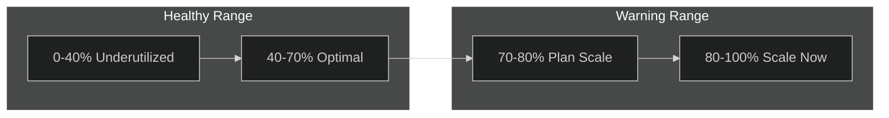
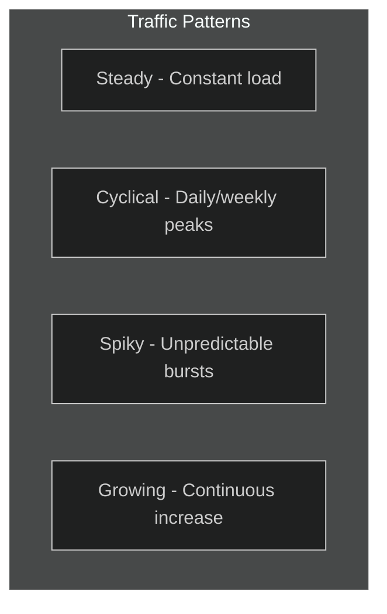

# 18 - Capacity Planning

> Right-sizing APIM units, traffic estimation, and scaling strategies

---

## 🎯 Capacity Fundamentals

### What is a "Unit"?

A **unit** is the base scale factor for APIM. Each unit provides:

| Tier | Requests/sec (approx) | Cache | Notes |
|------|----------------------|-------|-------|
| Developer | ~500 | 10 MB | No SLA, no scale |
| Basic | ~1,000 | 10 MB | Cannot scale |
| Standard | ~2,500 | 50 MB | Can add units |
| Premium | ~4,000 | 5 GB | Zone redundant possible |
| Basic v2 | ~5,000 | N/A | VNet supported |
| Standard v2 | ~10,000 | N/A | Higher throughput |

> ⚠️ **These are approximations.** Actual throughput depends on policies, payload size, and backend latency.

---

## 📊 Capacity Metric

The **Capacity** metric is your primary scaling indicator:



| Capacity Range | Status | Action |
|----------------|--------|--------|
| 0-40% | Underutilized | Consider scaling in (non-prod) |
| 40-70% | Optimal | Monitor normally |
| 70-80% | Warning | Plan to scale out |
| 80-100% | Critical | Scale out immediately |

---

## 📏 Sizing Methodology

### Step 1: Gather Requirements

| Metric | How to Measure | Example |
|--------|----------------|---------|
| **Peak RPS** | Max requests per second | 5,000 RPS |
| **Average RPS** | Normal traffic | 1,000 RPS |
| **Payload Size** | Average request/response | 10 KB |
| **Backend Latency** | P95 backend response | 200 ms |
| **Policy Complexity** | Number of policies | 5-10 policies |
| **Growth Projection** | 12-month growth | 50% |

### Step 2: Calculate Base Units

**Formula:**

```
Base Units = Peak RPS / Tier Throughput per Unit
```

**Example (Premium tier):**

```
Peak RPS: 10,000
Premium throughput: ~4,000 RPS per unit
Base Units = 10,000 / 4,000 = 2.5 → Round up to 3 units
```

### Step 3: Apply Adjustments

| Factor | Multiplier | When to Apply |
|--------|------------|---------------|
| Complex policies | 1.2-1.5x | JWT validation, transforms |
| Large payloads (>50 KB) | 1.3-1.5x | File uploads, large responses |
| High backend latency (>1s) | 1.2x | Slow backends hold connections |
| Zone redundancy | Minimum 3 | Premium tier HA |
| Growth buffer | 1.3-1.5x | 12-month projection |

**Example with adjustments:**

```
Base: 3 units
Complex policies: 3 × 1.3 = 3.9
Zone redundancy: Minimum 3
Growth buffer: 3.9 × 1.3 = 5.07 → Round to 5 units
Final: 5 Premium units
```

---

## 📈 Traffic Pattern Analysis

### Understand Your Patterns



| Pattern | Characteristics | Scaling Strategy |
|---------|-----------------|------------------|
| **Steady** | Consistent load | Fixed units |
| **Cyclical** | Predictable peaks | Schedule-based autoscale |
| **Spiky** | Unpredictable bursts | Metric-based autoscale + buffer |
| **Growing** | Continuous increase | Proactive scaling + monitoring |

### Traffic Analysis Query

```kusto
// Analyze traffic patterns
ApiManagementGatewayLogs
| where TimeGenerated > ago(7d)
| summarize Requests=count() by bin(TimeGenerated, 1h)
| summarize 
    Min=min(Requests),
    Avg=avg(Requests),
    P95=percentile(Requests, 95),
    Max=max(Requests)
```

---

## ⚙️ Autoscaling Configuration

### Metric-Based Autoscaling (Bicep)

```bicep
resource autoscale 'Microsoft.Insights/autoscalesettings@2022-10-01' = {
  name: 'apim-autoscale'
  location: location
  properties: {
    enabled: true
    targetResourceUri: apim.id
    profiles: [
      {
        name: 'Default'
        capacity: {
          minimum: '3'   // Zone redundancy minimum
          maximum: '10'  // Cost cap
          default: '3'
        }
        rules: [
          // Scale OUT when capacity > 70%
          {
            metricTrigger: {
              metricName: 'Capacity'
              metricResourceUri: apim.id
              timeGrain: 'PT1M'
              statistic: 'Average'
              timeWindow: 'PT5M'
              timeAggregation: 'Average'
              operator: 'GreaterThan'
              threshold: 70
            }
            scaleAction: {
              direction: 'Increase'
              type: 'ChangeCount'
              value: '1'
              cooldown: 'PT10M'
            }
          }
          // Scale IN when capacity < 30%
          {
            metricTrigger: {
              metricName: 'Capacity'
              metricResourceUri: apim.id
              timeGrain: 'PT1M'
              statistic: 'Average'
              timeWindow: 'PT30M'  // Longer window for scale-in
              timeAggregation: 'Average'
              operator: 'LessThan'
              threshold: 30
            }
            scaleAction: {
              direction: 'Decrease'
              type: 'ChangeCount'
              value: '1'
              cooldown: 'PT60M'  // Longer cooldown for scale-in
            }
          }
        ]
      }
    ]
  }
}
```

### Schedule-Based Autoscaling

```bicep
// Additional profile for known peak hours
profiles: [
  {
    name: 'BusinessHours'
    capacity: {
      minimum: '5'
      maximum: '10'
      default: '5'
    }
    recurrence: {
      frequency: 'Week'
      schedule: {
        timeZone: 'W. Europe Standard Time'
        days: ['Monday', 'Tuesday', 'Wednesday', 'Thursday', 'Friday']
        hours: [8]
        minutes: [0]
      }
    }
    rules: []  // Same rules as default
  }
  {
    name: 'OffHours'
    capacity: {
      minimum: '3'
      maximum: '5'
      default: '3'
    }
    recurrence: {
      frequency: 'Week'
      schedule: {
        timeZone: 'W. Europe Standard Time'
        days: ['Monday', 'Tuesday', 'Wednesday', 'Thursday', 'Friday']
        hours: [20]
        minutes: [0]
      }
    }
    rules: []
  }
]
```

---

## 💰 Cost-Capacity Tradeoffs

### Premium Tier Pricing (Approx)

| Configuration | Units | Est. Monthly Cost | Use Case |
|---------------|-------|-------------------|----------|
| Minimum HA | 2 | ~$5,600 | Small production |
| Zone Redundant | 3 | ~$8,400 | Standard production |
| High Availability | 4 | ~$11,200 | Important workloads |
| High Throughput | 6 | ~$16,800 | High-traffic APIs |
| Enterprise | 10 | ~$28,000 | Large scale |

### Optimization Strategies

| Strategy | Potential Savings | Implementation |
|----------|-------------------|----------------|
| Right-size for actual traffic | 20-40% | Monitor and adjust |
| Autoscale down off-hours | 15-25% | Schedule-based scaling |
| Caching | 10-30% | Reduce backend calls |
| Reserved instances | 30-50% | Commit to 1-3 years |
| Use v2 tiers | Varies | Evaluate Basic/Standard v2 |

---

## 📊 Load Testing

### Azure Load Testing Integration

```yaml
# load-test.yaml
version: v0.1
testName: APIM Load Test
testPlan: apim-load-test.jmx
description: Validate APIM capacity under load
engineInstances: 5
failureCriteria:
  - avg(response_time_ms) > 500
  - percentage(error) > 5
```

### Key Metrics to Capture

| Metric | Target | Concern Threshold |
|--------|--------|-------------------|
| P50 Response Time | < 100ms | > 200ms |
| P95 Response Time | < 500ms | > 1000ms |
| P99 Response Time | < 1000ms | > 2000ms |
| Error Rate | < 0.1% | > 1% |
| Throughput | Target RPS | < 80% target |
| Capacity | < 70% | > 80% |

### Pre-Production Load Test Checklist

- [ ] Test with production-like payload sizes
- [ ] Test with production-like backend latency
- [ ] Run sustained load (30+ minutes)
- [ ] Test burst scenarios (3x normal)
- [ ] Verify autoscaling triggers
- [ ] Capture baseline metrics
- [ ] Test during scale-out operation

---

## 📋 Capacity Planning Checklist

### Initial Sizing

- [ ] Peak RPS estimated
- [ ] Payload sizes documented
- [ ] Backend latencies measured
- [ ] Policy complexity assessed
- [ ] Growth projection calculated
- [ ] Base units calculated
- [ ] Adjustments applied
- [ ] Zone redundancy considered

### Ongoing Management

- [ ] Capacity alerts configured
- [ ] Autoscaling rules defined
- [ ] Monthly capacity review scheduled
- [ ] Quarterly right-sizing review
- [ ] Load testing before major releases
- [ ] Budget alerts configured

---

## 🔢 Quick Reference Tables

### Units by Traffic

| Daily Requests | Avg RPS | Recommended Units (Premium) |
|----------------|---------|----------------------------|
| 1M | ~12 | 2-3 |
| 5M | ~58 | 3 |
| 10M | ~116 | 3-4 |
| 50M | ~580 | 4-5 |
| 100M | ~1,160 | 5-6 |
| 500M | ~5,800 | 8-10 |

### Scaling Times

| Action | Approximate Time |
|--------|------------------|
| Add 1 unit | 15-30 minutes |
| Remove 1 unit | 15-30 minutes |
| Update from 2→5 units | 30-45 minutes |

---

## 🔗 Related Documents

| Document | Description |
|----------|-------------|
| [09-Cost-Optimization](./09-cost-optimization.md) | Cost strategies |
| [02-Reliability](./02-reliability.md) | HA requirements |
| [12-Tradeoffs](./12-tradeoffs.md) | Capacity vs cost |

---

> **Back to**: [README](./README.md) - Main documentation index
