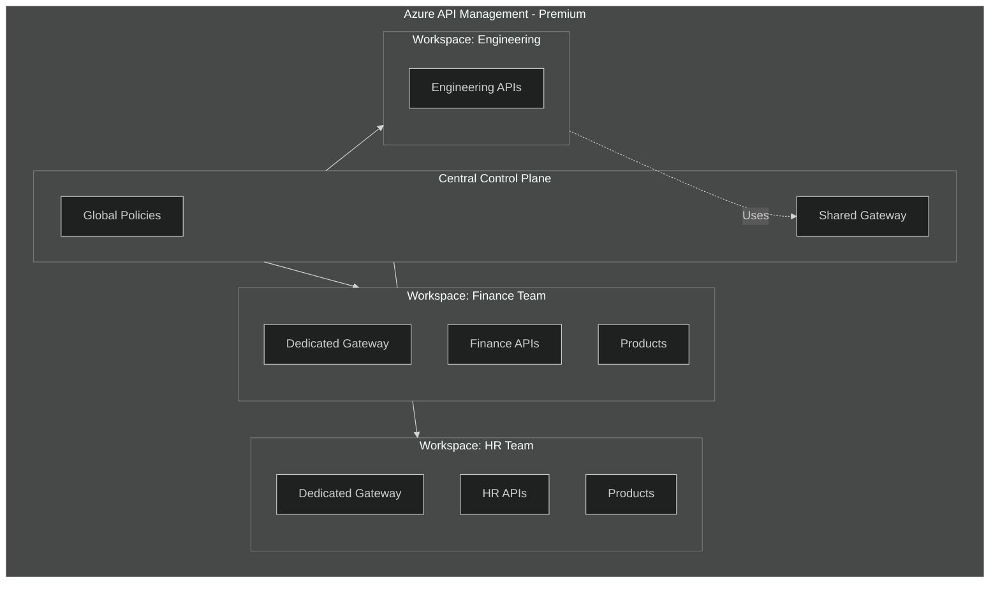
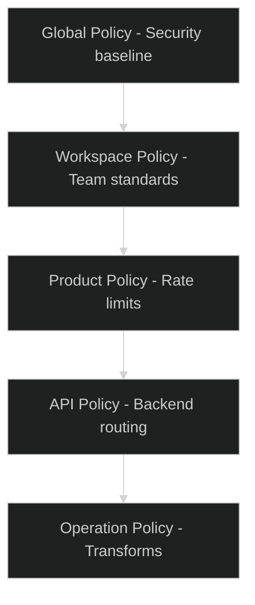

# 19 - Workspaces & Multi-Team Governance

> Federated API management with workspaces, dedicated gateways, and team isolation

---

## 🎯 When to Use Workspaces

| Scenario | Without Workspaces | With Workspaces |
|----------|-------------------|-----------------|
| **Multi-team organization** | Shared access, risk of conflicts | Team isolation, clear boundaries |
| **Cost sharing** | Separate APIM instances ($$$) | Shared instance, federated ($) |
| **Governance** | Central bottleneck | Decentralized with guardrails |
| **Blast radius** | All APIs affected | Workspace-scoped impact |

---

## 🏗️ Workspaces Architecture



---

## 📋 Workspaces vs Traditional APIM

| Feature | Traditional | Workspaces |
|---------|-------------|------------|
| **API ownership** | Centralized | Decentralized by team |
| **RBAC** | Instance-wide | Workspace-scoped |
| **Policies** | Shared | Inherited + workspace-specific |
| **Products** | Shared | Workspace-scoped |
| **Subscriptions** | Shared | Workspace-scoped |
| **Gateway** | Shared | Optional dedicated |
| **Cost allocation** | Complex | Per-workspace tagging |
| **Deployment** | Coordinated | Independent |

---

## 🔧 Workspace Setup

### Create Workspace (Bicep)

```bicep
resource apim 'Microsoft.ApiManagement/service@2023-05-01-preview' = {
  name: 'apim-enterprise-prod'
  location: location
  sku: {
    name: 'Premium'  // Workspaces require Premium
    capacity: 3
  }
  properties: {
    // ... standard config
  }
}

// Finance Team Workspace
resource financeWorkspace 'Microsoft.ApiManagement/service/workspaces@2023-09-01-preview' = {
  name: 'finance-team'
  parent: apim
  properties: {
    displayName: 'Finance Team'
    description: 'APIs owned by the Finance team'
  }
}

// HR Team Workspace
resource hrWorkspace 'Microsoft.ApiManagement/service/workspaces@2023-09-01-preview' = {
  name: 'hr-team'
  parent: apim
  properties: {
    displayName: 'HR Team'
    description: 'APIs owned by the HR team'
  }
}
```

### Create Dedicated Gateway

```bicep
// Dedicated gateway for Finance workspace
resource financeGateway 'Microsoft.ApiManagement/service/workspaces/gateways@2023-09-01-preview' = {
  name: 'finance-gateway'
  parent: financeWorkspace
  properties: {
    description: 'Dedicated gateway for Finance APIs'
    locationData: {
      name: 'West Europe'
    }
  }
}

// Link gateway to workspace APIs
resource gatewayApi 'Microsoft.ApiManagement/service/workspaces/gateways/apis@2023-09-01-preview' = {
  name: 'finance-api-v1'
  parent: financeGateway
  properties: {}
}
```

### Create API in Workspace

```bicep
resource financeApi 'Microsoft.ApiManagement/service/workspaces/apis@2023-09-01-preview' = {
  name: 'finance-api-v1'
  parent: financeWorkspace
  properties: {
    displayName: 'Finance API'
    path: 'finance'
    protocols: ['https']
    subscriptionRequired: true
    apiType: 'http'
  }
}

// Workspace-scoped product
resource financeProduct 'Microsoft.ApiManagement/service/workspaces/products@2023-09-01-preview' = {
  name: 'finance-standard'
  parent: financeWorkspace
  properties: {
    displayName: 'Finance API - Standard'
    subscriptionRequired: true
    approvalRequired: true
    state: 'published'
  }
}

// Link API to product
resource productApi 'Microsoft.ApiManagement/service/workspaces/products/apis@2023-09-01-preview' = {
  name: financeApi.name
  parent: financeProduct
}
```

---

## 🔐 RBAC for Workspaces

### Built-in Roles

| Role | Scope | Permissions |
|------|-------|-------------|
| **API Management Service Contributor** | Service | Full APIM access |
| **API Management Workspace Contributor** | Workspace | Manage workspace resources |
| **API Management Workspace Reader** | Workspace | Read workspace resources |
| **API Management Workspace API Developer** | Workspace | Manage APIs in workspace |
| **API Management Workspace API Product Manager** | Workspace | Manage products |

### Role Assignment (Bicep)

```bicep
// Grant Finance team access to their workspace
resource financeTeamRole 'Microsoft.Authorization/roleAssignments@2022-04-01' = {
  name: guid(financeWorkspace.id, financeTeamGroupId, workspaceContributorRole)
  scope: financeWorkspace
  properties: {
    roleDefinitionId: subscriptionResourceId('Microsoft.Authorization/roleDefinitions', 
      'b24988ac-6180-42a0-ab88-20f7382dd24c')  // Workspace Contributor
    principalId: financeTeamGroupId
    principalType: 'Group'
  }
}

// Platform team retains service-level access
resource platformTeamRole 'Microsoft.Authorization/roleAssignments@2022-04-01' = {
  name: guid(apim.id, platformTeamGroupId, serviceContributorRole)
  scope: apim
  properties: {
    roleDefinitionId: subscriptionResourceId('Microsoft.Authorization/roleDefinitions',
      '312a565d-c81f-4fd8-895a-4e21e48d571c')  // Service Contributor
    principalId: platformTeamGroupId
    principalType: 'Group'
  }
}
```

---

## 📊 Policy Inheritance



### Policy Scope Examples

**Global Policy (Platform team manages):**

```xml
<policies>
    <inbound>
        <!-- Enforced security baseline -->
        <set-header name="X-Correlation-Id" exists-action="skip">
            <value>@(context.RequestId.ToString())</value>
        </set-header>
        <base />
    </inbound>
    <outbound>
        <!-- Remove sensitive headers -->
        <set-header name="X-Powered-By" exists-action="delete" />
        <base />
    </outbound>
</policies>
```

**Workspace Policy (Team manages):**

```xml
<policies>
    <inbound>
        <base />
        <!-- Team-specific authentication -->
        <validate-azure-ad-token tenant-id="{{tenant-id}}">
            <audiences>
                <audience>api://finance-apis</audience>
            </audiences>
        </validate-azure-ad-token>
    </inbound>
</policies>
```

---

## 🚀 Dedicated Gateway Benefits

| Benefit | Description |
|---------|-------------|
| **Isolation** | Compute isolation from other workspaces |
| **Scaling** | Independent scaling based on team traffic |
| **Networking** | Can have separate VNet integration |
| **Availability** | Failure doesn't impact other teams |
| **Cost visibility** | Clear cost attribution |

### Gateway Sizing

| Team Traffic | Recommended Configuration |
|--------------|---------------------------|
| Low (< 1000 RPS) | Use shared gateway |
| Medium (1000-5000 RPS) | Dedicated gateway, 1-2 units |
| High (> 5000 RPS) | Dedicated gateway, 3+ units |
| Critical | Dedicated gateway + zones |

---

## 📋 Multi-Team Governance Model

### Responsibilities Matrix

| Responsibility | Platform Team | Workspace Team |
|----------------|---------------|----------------|
| APIM instance management | ✅ | |
| Network configuration | ✅ | |
| Global policies | ✅ | |
| Workspace creation | ✅ | |
| API development | | ✅ |
| Workspace policies | | ✅ |
| Products & subscriptions | | ✅ |
| Monitoring (workspace) | | ✅ |
| Monitoring (platform) | ✅ | |

### Guardrails for Teams

```bicep
// Azure Policy to enforce workspace standards
resource workspacePolicy 'Microsoft.Authorization/policyDefinitions@2021-06-01' = {
  name: 'apim-workspace-standards'
  properties: {
    displayName: 'APIM Workspace Standards'
    policyType: 'Custom'
    mode: 'All'
    policyRule: {
      if: {
        allOf: [
          {
            field: 'type'
            equals: 'Microsoft.ApiManagement/service/workspaces/apis'
          }
          {
            // Ensure HTTPS only
            field: 'Microsoft.ApiManagement/service/workspaces/apis/protocols[*]'
            contains: 'http'
          }
        ]
      }
      then: {
        effect: 'deny'
      }
    }
  }
}
```

---

## 📊 Cost Allocation

### Tagging Strategy

```bicep
resource financeWorkspace 'Microsoft.ApiManagement/service/workspaces@2023-09-01-preview' = {
  name: 'finance-team'
  parent: apim
  tags: {
    'cost-center': 'CC-12345'
    'team': 'finance'
    'business-unit': 'corporate'
  }
  properties: {
    displayName: 'Finance Team'
  }
}
```

### Usage Metrics per Workspace

```kusto
// Requests per workspace
ApiManagementGatewayLogs
| where TimeGenerated > ago(30d)
| extend Workspace = tostring(split(ApiId, "/")[1])
| summarize Requests=count(), 
            DataTransferred=sum(ResponseSize)
            by Workspace
| order by Requests desc
```

---

## ✅ Workspaces Checklist

### Planning

- [ ] Identified teams requiring workspace isolation
- [ ] Defined ownership model
- [ ] Planned RBAC structure
- [ ] Determined shared vs dedicated gateways
- [ ] Defined global vs workspace policies

### Implementation

- [ ] Created workspaces for each team
- [ ] Assigned RBAC permissions
- [ ] Configured dedicated gateways (if needed)
- [ ] Created global policy baseline
- [ ] Migrated existing APIs to workspaces

### Operations

- [ ] Team training completed
- [ ] Cost allocation configured
- [ ] Monitoring dashboards per workspace
- [ ] Runbooks updated for workspace model
- [ ] Governance process documented

---

## 🔗 Related Documents

| Document | Description |
|----------|-------------|
| [02-Reliability](./02-reliability.md) | HA for workspaces |
| [03-Security](./03-security.md) | Security policies |
| [12-Tradeoffs](./12-tradeoffs.md) | Federated vs distributed |

---

> **Back to**: [README](./README.md) - Main documentation index
