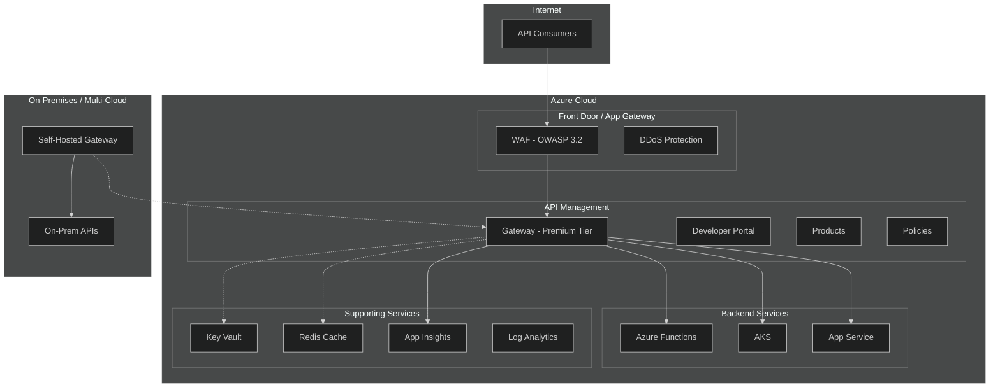

# Azure API Management - Enterprise Best Practices Guide

[](https://learn.microsoft.com/azure/well-architected/)
[](https://learn.microsoft.com/azure/api-management/)
[](https://learn.microsoft.com/azure/well-architected/service-guides/azure-api-management)

> **Production-Ready Architecture Guide** | Based on Microsoft Well-Architected Framework, Cloud Adoption Framework, and real-world implementation from Data Mesh Infrastructure

---

## 📖 Official Microsoft References

| Resource | Link |
|----------|------|
| **WAF Service Guide for APIM** | [learn.microsoft.com](https://learn.microsoft.com/azure/well-architected/service-guides/azure-api-management) |
| **GitHub Source** | [MicrosoftDocs/well-architected](https://github.com/MicrosoftDocs/well-architected/blob/main/well-architected/service-guides/azure-api-management.md) |
| **OWASP API Security Mitigations** | [Mitigate OWASP API threats](https://learn.microsoft.com/azure/api-management/mitigate-owasp-api-threats) |
| **Landing Zone Accelerator** | [API Management LZA](https://learn.microsoft.com/azure/cloud-adoption-framework/scenarios/app-platform/api-management/landing-zone-accelerator) |

---

## 📚 Documentation Structure

This guide is organized into focused modules aligned with the **Azure Well-Architected Framework** pillars and enterprise patterns:

| Module | WAF Pillar | Description | Link |
|--------|-----------|-------------|------|
| **01-Architecture-Overview** | All | High-level architecture, component overview, tier selection | [View](./01-architecture-overview.md) |
| **02-Reliability** | 🔵 Reliability | Zone redundancy, multi-region, DR, scaling | [View](./02-reliability.md) |
| **03-Security** | 🔴 Security | OWASP, TLS, OAuth, WAF, network isolation | [View](./03-security.md) |
| **04-Policies** | All | Rate limiting, caching, validation, transformations | [View](./04-policies.md) |
| **05-DevOps-APIOps** | 🟢 Operational Excellence | CI/CD, IaC, versioning, deployment patterns | [View](./05-devops-apiops.md) |
| **06-Monitoring** | 🟢 Operational Excellence | Metrics, alerts, Application Insights, diagnostics | [View](./06-monitoring.md) |
| **07-AI-Gateway** | 🟣 Performance | OpenAI integration, token limiting, semantic caching | [View](./07-ai-gateway.md) |
| **08-Self-Hosted-Gateway** | 🔵 Reliability | Kubernetes, hybrid, multi-cloud deployment | [View](./08-self-hosted-gateway.md) |
| **09-Cost-Optimization** | 🟡 Cost Optimization | Tier selection, scaling strategies, cost controls | [View](./09-cost-optimization.md) |
| **10-Performance-Efficiency** | 🟣 Performance | Caching, autoscaling, latency optimization | [View](./10-performance-efficiency.md) |
| **11-Monetization** | 🟢 Operational Excellence | Products, subscriptions, developer portal, billing | [View](./11-monetization.md) |
| **12-Tradeoffs** | ⚖️ Tradeoffs | HA vs Cost, Federated vs Distributed decisions | [View](./12-tradeoffs.md) |
| **13-Customer-QA** | ❓ Q&A | Log isolation, origins, policies, schema validation, portal | [View](./13-customer-qa.md) |

### 🆕 Advanced Topics

| Module | Category | Description | Link |
|--------|----------|-------------|------|
| **14-API-Governance** | 🏛️ Governance | Azure API Center, linting (Spectral), lifecycle management | [View](./14-api-governance.md) |
| **15-Migration-Patterns** | 🔄 Migration | Migrate from Kong, Apigee, AWS API Gateway, MuleSoft | [View](./15-migration-patterns.md) |
| **16-Production-Checklist** | ✅ Readiness | 75-point go-live checklist across 10 categories | [View](./16-production-checklist.md) |
| **17-Troubleshooting** | 🔧 Operations | Diagnostic decision tree, common errors, KQL queries | [View](./17-troubleshooting.md) |
| **18-Capacity-Planning** | 📊 Planning | Unit sizing, throughput calculator, traffic estimation | [View](./18-capacity-planning.md) |
| **19-Workspaces** | 👥 Multi-Team | Workspaces, dedicated gateways, federated governance | [View](./19-workspaces.md) |

### 📖 Reference

| Document | Description | Link |
|----------|-------------|------|
| **_mermaid-style-guide** | Standard Mermaid diagram configuration (theme: dark) | [View](./_mermaid-style-guide.md) |

---

## 🏗️ Architecture at a Glance



---

## ⚡ Quick Reference - Key Decisions

### Tier Selection Matrix

| Requirement | Developer | Basic | Standard | Premium |
|-------------|:---------:|:-----:|:--------:|:-------:|
| **Production SLA** | ❌ | ✅ 99.95% | ✅ 99.95% | ✅ 99.99% |
| **Zone Redundancy** | ❌ | ❌ | ❌ | ✅ |
| **Multi-Region** | ❌ | ❌ | ❌ | ✅ |
| **VNet Integration** | ✅ | ❌ | ❌ | ✅ |
| **Self-Hosted Gateway** | ✅ | ❌ | ❌ | ✅ |
| **Workspaces** | ❌ | ❌ | ❌ | ✅ |
| **Custom Domains** | ✅ | ✅ | ✅ | ✅ |
| **External Cache** | ✅ | ✅ | ✅ | ✅ |

### Well-Architected Pillars Summary

| Pillar | Key Focus |
|--------|-----------|
| **🔄 Reliability** | Zone redundancy (2+ units), multi-region DR, autoscaling, circuit breakers |
| **🔐 Security** | TLS 1.2+, OAuth 2.0, VNet isolation, WAF, Defender for APIs |
| **💰 Cost** | Right-size tiers, autoscale, built-in cache, block malicious traffic |
| **⚙️ Operations** | APIOps, IaC (Bicep/Terraform), Azure Policy, Event Grid automation |
| **🚀 Performance** | Caching, autoscale, load testing, Application Insights sampling |

---

## 🔗 Microsoft References

| Resource | Link |
|----------|------|
| Well-Architected Framework - APIM | [learn.microsoft.com](https://learn.microsoft.com/azure/well-architected/service-guides/azure-api-management) |
| Landing Zone Accelerator | [GitHub](https://github.com/Azure/apim-landing-zone-accelerator) |
| OWASP Mitigation Guide | [learn.microsoft.com](https://learn.microsoft.com/azure/api-management/mitigate-owasp-api-threats) |
| APIOps Architecture | [learn.microsoft.com](https://learn.microsoft.com/azure/architecture/example-scenario/devops/automated-api-deployments-apiops) |
| AI Gateway Guide | [learn.microsoft.com](https://learn.microsoft.com/azure/architecture/ai-ml/guide/azure-openai-gateway-guide) |

---

## 📂 Repository Context

This guide incorporates patterns from the **Data Mesh Infrastructure** repository:

```
data-mesh-infrastructure/
├── modules/
│   ├── api-management.bicep      # Core APIM deployment
│   ├── function-app-to-apim.bicep # Function App integration
│   └── keyvault-*.bicep          # Secret management
├── scenarios/
│   └── apim.bicep                # Complete APIM scenario
├── pipelines/
│   └── deploy-apim.yml           # Azure DevOps pipeline
└── APIM-best-practices/          # This documentation
```

---

> **Next Steps**: Start with [01-Architecture Overview](./01-architecture-overview.md) for foundational concepts, or jump to specific pillars based on your needs.
