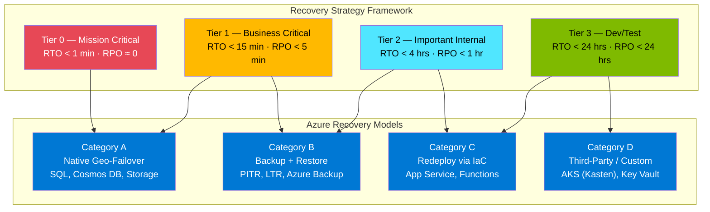
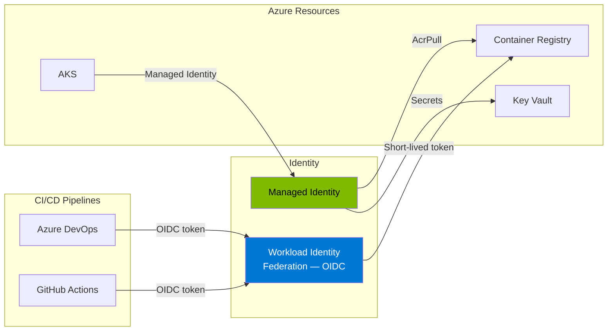

# Business Continuity & Disaster Recovery (BCDR)

> **Workshop Edition** — Enterprise BCDR Strategy for Azure  
> **Purpose**: Comprehensive guidance for Azure PaaS backup, recovery, CI/CD security, AI platform resilience, and infrastructure operations

---

## 📚 Solution Documents

| # | Document | Description | Audience |
|---|----------|-------------|----------|
| 1 | [Azure PaaS Backup & Recovery](./bcdr-queries.md) | PaaS recovery models, RSV matrix, third-party tools, multi-region BCDR architecture, workload tiering | BCDR Lead, Infrastructure, App Teams |
| 2 | [Deployment Security & ACR Automation](./azure-devops-github-queries.md) | Workload Identity Federation (OIDC), managed identity for ACR, Zero Trust CI/CD, governance controls | Platform, Security, DevOps Teams |
| 3 | [Microsoft Foundry & AI Platform](./foundry-queries.md) | Foundry roadmap, private endpoints, EU model capacity, Responses API gaps, multi-region AI resilience | AI Platform, Architecture Teams |
| 4 | [General Platform & Infrastructure](./general-queries.md) | EU region expansion, Azure Update Manager, PostgreSQL/App Service constraints, VM management at scale | Infrastructure, Operations Teams |

---

## 🎯 Key Themes

### Multi-Region Enterprise BCDR

### Zero Trust Identity Model

### EU Region Strategy

| Region | Role | Paired Region | Key Constraints |
|--------|------|---------------|-----------------|
| **West Europe** | Primary (legacy) | North Europe | Capacity constraints; no Responses API |
| **Sweden Central** | Primary (recommended) | Sweden South (restricted) | Broadest AI support; passive DR only to pair |
| **Germany West Central** | Secondary / DR | Germany North (restricted) | Full AI support; data sovereignty |

---

## 🚀 Quick Start

### 1. Assess Your Workloads
Start with the [PaaS Backup & Recovery Matrix](./bcdr-queries.md#3-question-2--recommended-backup-mechanisms-by-azure-resource-type) to understand which recovery model applies to each Azure service.

### 2. Classify Workload Tiers
Use the [Workload Tiering Model](./bcdr-queries.md#7-decision-matrix--recovery-strategy-selection) to assign RTO/RPO targets per application.

### 3. Secure Your CI/CD
Follow the [Zero Trust CI/CD guide](./azure-devops-github-queries.md#2-question-1--enforce-deployments-from-azure-devops--github-using-federated-identities-only) to migrate from secret-based service principals to Workload Identity Federation.

### 4. Plan AI Platform Resilience
Review the [Multi-Region AI Architecture](./foundry-queries.md#6-architecture--multi-region-ai-platform-resilience) for EU-compliant Foundry deployment.

### 5. Expand to New Regions
Use the [EU Region Capabilities Matrix](./general-queries.md#7-comparison-table--eu-region-capabilities) to plan workload placement across Sweden Central and Germany West Central.

---

## 📚 Microsoft Official Documentation References

### BCDR & Reliability

| Topic | Official URL |
|-------|--------------|
| **Azure Reliability Overview** | https://learn.microsoft.com/azure/reliability/overview |
| **BCDR Concepts** | https://learn.microsoft.com/azure/reliability/concept-business-continuity-high-availability-disaster-recovery |
| **Azure Region Pairs** | https://learn.microsoft.com/azure/reliability/regions-paired |
| **Multi-Region Non-Paired** | https://learn.microsoft.com/azure/reliability/regions-multi-region-nonpaired |
| **WAF Reliability Pillar** | https://learn.microsoft.com/azure/well-architected/reliability/ |
| **WAF Disaster Recovery** | https://learn.microsoft.com/azure/well-architected/reliability/disaster-recovery |

### Azure Backup & Recovery

| Topic | Official URL |
|-------|--------------|
| **Azure Backup Overview** | https://learn.microsoft.com/azure/backup/backup-overview |
| **Backup Support Matrix** | https://learn.microsoft.com/azure/backup/backup-support-matrix |
| **Cross-Region Restore** | https://learn.microsoft.com/azure/backup/backup-create-rs-vault#set-cross-region-restore |
| **Azure Site Recovery** | https://learn.microsoft.com/azure/site-recovery/azure-to-azure-enable-global-disaster-recovery |

### Identity & Security

| Topic | Official URL |
|-------|--------------|
| **Workload Identity Federation** | https://devblogs.microsoft.com/devops/workload-identity-federation-for-azure-deployments-is-now-generally-available/ |
| **GitHub OIDC with Azure** | https://learn.microsoft.com/azure/developer/github/connect-from-azure-openid-connect |
| **Conditional Access for Workloads** | https://learn.microsoft.com/entra/identity/conditional-access/workload-identity |
| **AKS + ACR Integration** | https://learn.microsoft.com/azure/aks/cluster-container-registry-integration |

### AI Platform

| Topic | Official URL |
|-------|--------------|
| **Microsoft Foundry Architecture** | https://learn.microsoft.com/azure/foundry/concepts/architecture |
| **Private Link for Foundry** | https://learn.microsoft.com/azure/foundry/how-to/configure-private-link |
| **Model Availability by Region** | https://learn.microsoft.com/azure/ai-foundry/openai/concepts/models |
| **Agent Service Limits & Regions** | https://learn.microsoft.com/azure/foundry/agents/concepts/limits-quotas-regions |
