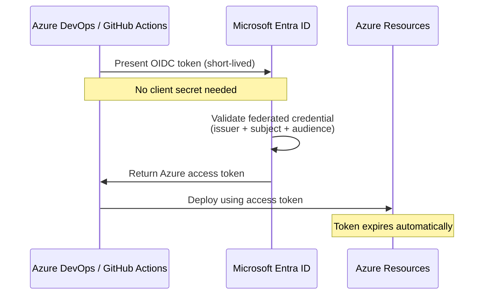
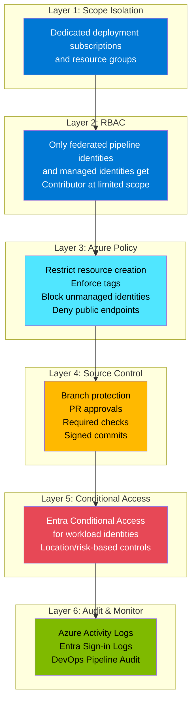
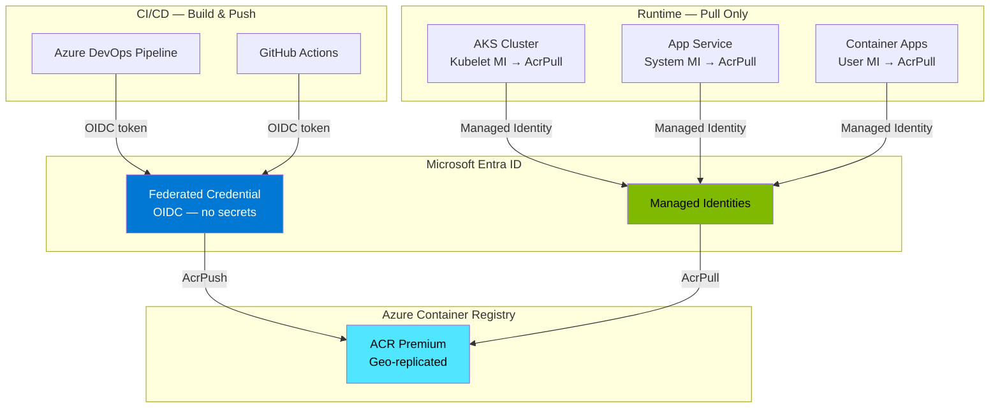
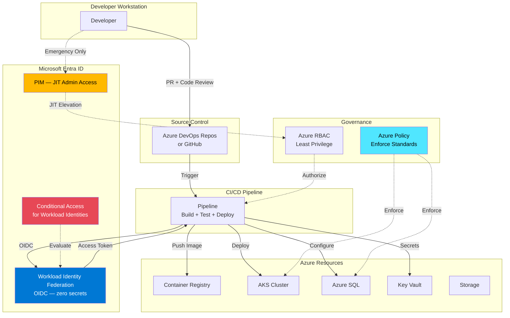
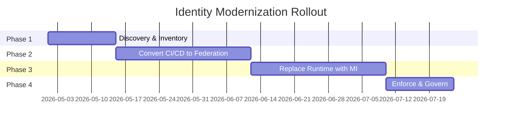

# Deployment Security & ACR Automation — Consolidated Enterprise Guidance

**Prepared by:** Microsoft Cloud Solution Architecture  
**Date:** April 2026  
**Audience:** Enterprise Platform & Security Teams  
**Context:** Zero Trust CI/CD, Workload Identity Federation, Managed Identity Adoption

---

## Table of Contents

1. [Executive Summary](#1-executive-summary)
2. [Question 1 — Enforce Deployments from Azure DevOps / GitHub Using Federated Identities Only](#2-question-1--enforce-deployments-from-azure-devops--github-using-federated-identities-only)
3. [Question 2 — Automate Azure Container Registry Connections Using Managed Identities](#3-question-2--automate-azure-container-registry-connections-using-managed-identities)
4. [Architecture — Secure CI/CD Identity Model](#4-architecture--secure-cicd-identity-model)
5. [Comparison Table — Service Principal vs Federated Identity vs Managed Identity](#5-comparison-table--service-principal-vs-federated-identity-vs-managed-identity)
6. [Decision Matrix — Identity Type Selection by Use Case](#6-decision-matrix--identity-type-selection-by-use-case)
7. [Governance & Enforcement Controls](#7-governance--enforcement-controls)
8. [Migration Rollout Plan](#8-migration-rollout-plan)
9. [Risks of Inaction](#9-risks-of-inaction)
10. [Microsoft Learn Reference Links](#10-microsoft-learn-reference-links)

---

## 1. Executive Summary

The recommended strategic direction is fully aligned with **Microsoft Zero Trust** and **credential reduction** best practices:

| Strategic Direction | Implementation |
|---|---|
| **Eliminate long-lived secrets** | Replace secret-based service principals with Workload Identity Federation (OIDC) |
| **Enforce trusted CI/CD only** | Only allow deployments from authorized Azure DevOps / GitHub pipelines |
| **Use Managed Identities for runtime** | All Azure-hosted workloads authenticate via managed identities |
| **Automate ACR authentication** | Use managed identities or federated identities for container image pull/push |
| **Govern with policy + RBAC** | Azure Policy + Entra Conditional Access + PIM for layered enforcement |

### What is Workload Identity Federation?

Workload Identity Federation (WIF) allows CI/CD pipelines to exchange **OIDC tokens** for Azure access tokens **without storing any secrets**. This is the Microsoft-recommended approach for Azure DevOps and GitHub Actions deployments.



> **Key Benefits:**
> - No password or secret rotation needed
> - Short-lived tokens (minutes, not months/years)
> - Strong trust boundary tied to specific repos/branches/environments
> - Pipeline identity traceability in audit logs
> - Immediate revocation by removing federated credential

> **Reference:** [Workload Identity Federation is now GA for Azure Pipelines](https://devblogs.microsoft.com/devops/workload-identity-federation-for-azure-deployments-is-now-generally-available/)

---

## 2. Question 1 — Enforce Deployments from Azure DevOps / GitHub Using Federated Identities Only

### Customer Question
> *"How can we enforce that deployments come only from authorized Azure DevOps or GitHub pipelines, using federated identities, and exclude traditional service principals?"*

### Recommended Model

Use **Workload Identity Federation** between:

```
Azure DevOps / GitHub  ←──OIDC──→  Microsoft Entra ID  ←──RBAC──→  Azure Resources
```

This allows pipelines to authenticate **without stored client secrets**, using the OIDC protocol.

### Step-by-Step: Azure DevOps with Workload Identity Federation

#### 1. Create or Convert Service Connection

**For new connections (recommended):**

1. In Azure DevOps: **Project Settings** → **Service connections** → **New service connection**
2. Select **Azure Resource Manager**
3. Choose **Workload identity federation (automatic)** — this is now the default
4. Azure DevOps automatically:
   - Creates an app registration in Entra ID
   - Configures the federated credential
   - Assigns the RBAC role at the selected scope

**For existing connections — convert to federation:**

1. Go to **Project Settings** → **Service connections**
2. Select the existing service connection
3. Click **Convert** to switch from secret-based to workload identity federation
4. The conversion is reversible within 7 days

> **Reference:** [Connect to Azure with ARM service connection](https://learn.microsoft.com/azure/devops/pipelines/library/connect-to-azure)

#### 2. Federation Trust Model

The federated credential establishes trust based on:

| Field | Purpose | Example |
|---|---|---|
| **Issuer** | The OIDC token provider | `https://vstoken.dev.azure.com/<org-id>` (Azure DevOps) or `https://token.actions.githubusercontent.com` (GitHub) |
| **Subject** | Identifies the specific pipeline/repo/branch | `sc://<org>/<project>/<service-connection>` (Azure DevOps) or `repo:<org>/<repo>:ref:refs/heads/main` (GitHub) |
| **Audience** | Expected token audience | `api://AzureADTokenExchange` |

This means:
- Only the **specific pipeline** in the **specific project/repo** can request tokens
- Tokens are **short-lived** and cannot be extracted or reused
- If a federated credential is removed, the pipeline **immediately loses access**

### Step-by-Step: GitHub Actions with Workload Identity Federation

#### 1. Create Federated Credential

**Option A — App Registration:**

```bash
# Create app registration
az ad app create --display-name "github-deploy-prod"

# Create service principal
az ad sp create --id <app-id>

# Assign RBAC role (scoped to resource group)
az role assignment create \
  --role "Contributor" \
  --assignee-object-id <sp-object-id> \
  --scope /subscriptions/<sub-id>/resourceGroups/<rg-name> \
  --assignee-principal-type ServicePrincipal

# Create federated credential
az ad app federated-credential create \
  --id <app-object-id> \
  --parameters '{
    "name": "github-main-branch",
    "issuer": "https://token.actions.githubusercontent.com",
    "subject": "repo:<org>/<repo>:ref:refs/heads/main",
    "audiences": ["api://AzureADTokenExchange"]
  }'
```

**Option B — User-Assigned Managed Identity (if app registration is restricted):**

```bash
# Create managed identity
az identity create --name "github-deploy-identity" --resource-group <rg>

# Configure federated credential on the managed identity
az identity federated-credential create \
  --name "github-main" \
  --identity-name "github-deploy-identity" \
  --resource-group <rg> \
  --issuer "https://token.actions.githubusercontent.com" \
  --subject "repo:<org>/<repo>:ref:refs/heads/main" \
  --audiences "api://AzureADTokenExchange"
```

#### 2. GitHub Actions Workflow

```yaml
name: Deploy to Azure
on:
  push:
    branches: [main]

permissions:
  id-token: write   # Required for OIDC
  contents: read

jobs:
  deploy:
    runs-on: ubuntu-latest
    steps:
      - uses: actions/checkout@v4

      - name: Azure Login (OIDC)
        uses: azure/login@v2
        with:
          client-id: ${{ secrets.AZURE_CLIENT_ID }}
          tenant-id: ${{ secrets.AZURE_TENANT_ID }}
          subscription-id: ${{ secrets.AZURE_SUBSCRIPTION_ID }}

      - name: Deploy infrastructure
        uses: azure/arm-deploy@v2
        with:
          resourceGroupName: my-rg
          template: ./infra/main.bicep
```

> **Reference:** [GitHub OIDC with Azure](https://learn.microsoft.com/azure/developer/github/connect-from-azure-openid-connect)  
> **Reference:** [Entra workload identities overview](https://learn.microsoft.com/entra/workload-id/workload-identities-overview)

### Can Traditional Service Principals Be Excluded?

**Yes.** The recommended governance pattern:

| Identity Type | Status | Use Case |
|---|---|---|
| **Federated identities (OIDC)** | Allowed | All CI/CD pipeline deployments |
| **Managed identities** | Allowed | All Azure-hosted runtime workloads |
| **Secret-based service principals** | Restricted — phase out | Legacy only, with exception process |
| **Shared credentials / manual accounts** | Blocked | Not permitted for deployments |

### How to Restrict Deployments to Authorized Pipelines Only

Implement a **layered enforcement model**:



#### Layer 1 — Scope Isolation

- Separate production deployment scope into dedicated subscriptions / resource groups
- Apply management group policies at the appropriate level

#### Layer 2 — RBAC

- Grant deployment rights **only** to:
  - Federated pipeline identities
  - Approved managed identities
- **Remove Contributor** from legacy service principals
- Use **least-privilege custom roles** where possible

```bash
# Example: Grant Contributor to federated identity only at RG scope
az role assignment create \
  --role "Contributor" \
  --assignee <federated-sp-object-id> \
  --scope /subscriptions/<sub>/resourceGroups/<rg> \
  --assignee-principal-type ServicePrincipal
```

#### Layer 3 — Azure Policy

| Policy | Effect | Purpose |
|---|---|---|
| Allowed locations | Deny | Restrict resource creation to approved regions |
| Required tags | Deny | Enforce ownership, cost center, environment tags |
| Allowed SKUs | Deny | Prevent over-provisioning |
| Block public IPs | Deny | Network security baseline |
| Audit unmanaged identities | Audit | Identify workloads not using managed identity |

#### Layer 4 — Branch Protection (Source Control)

| Control | Azure DevOps | GitHub |
|---|---|---|
| PR approvals required | Yes (branch policies) | Yes (branch protection rules) |
| Minimum reviewers | Configurable | Configurable |
| Required status checks | Build validation | Required checks |
| No direct push to main | Enforced via policies | Enforced via protection rules |
| Signed commits | Supported | Supported |

#### Layer 5 — Entra Conditional Access for Workload Identities

Microsoft Entra now supports **Conditional Access policies targeting workload identities (service principals)**:

- **Block access** from unexpected locations
- **Block access** when risk is detected (leaked credentials, anomalous behavior)
- Applies to single-tenant service principals registered in your tenant

> **Reference:** [Conditional Access for workload identities](https://learn.microsoft.com/entra/identity/conditional-access/workload-identity)

#### Layer 6 — PIM (Privileged Identity Management)

Use **Microsoft Entra PIM** for:

- **Just-in-time (JIT)** elevation for emergency admin access
- **Time-bound** role assignments with approval workflows
- **Audit trail** for all privilege escalations

> **Reference:** [What is Privileged Identity Management?](https://learn.microsoft.com/entra/id-governance/privileged-identity-management/pim-configure)

---

## 3. Question 2 — Automate Azure Container Registry Connections Using Managed Identities

### Customer Question
> *"How can we automate Azure Container Registry connections using managed identities instead of service principals?"*

### Recommended Direction: Yes — Use Managed Identities

For all Azure-hosted workloads pulling or pushing container images, **replace service principal credentials with managed identities**.

### ACR Authentication Methods — Comparison

| Method | Security | Rotation | Recommended |
|---|---|---|---|
| **Admin account** | Weak — shared password | Manual | **No** — disable for production |
| **Service principal + secret** | Medium — secret can leak | Manual (1-2 year expiry) | **No** — phase out |
| **Service principal + certificate** | Better — cert-based | Manual rotation | **Transitional only** |
| **Managed identity** | Strong — no credentials to manage | Automatic (Azure-managed) | **Yes** — for runtime workloads |
| **Federated identity (OIDC)** | Strong — short-lived tokens | Automatic | **Yes** — for CI/CD pipelines |

### ACR RBAC Roles

| Role | Permission | Typical Use |
|---|---|---|
| `AcrPull` | Pull images only | Runtime workloads (AKS, App Service, Container Apps) |
| `AcrPush` | Push + Pull images | Build agents, CI/CD pipelines |
| `AcrDelete` | Delete images | Cleanup automation only |
| `Contributor` | Full registry management | Registry admins only |

> **Principle:** Runtime apps should have **`AcrPull` only**. Only build/CI pipelines need `AcrPush`.

### Scenario-by-Scenario Implementation

#### Scenario 1: AKS Pulling Images from ACR

**Recommended:** Use the AKS–ACR integration with managed identity.

```bash
# Option A: Attach ACR during cluster creation
az aks create \
  --name myAKSCluster \
  --resource-group myRG \
  --attach-acr myACR

# Option B: Attach ACR to existing cluster
az aks update \
  --name myAKSCluster \
  --resource-group myRG \
  --attach-acr myACR
```

This automatically:
- Creates or uses the kubelet managed identity
- Assigns `AcrPull` role to the kubelet identity on the ACR
- No secrets stored anywhere

**For advanced scenarios (cross-subscription ACR):**

```bash
# Get kubelet identity
KUBELET_ID=$(az aks show -n myAKS -g myRG --query identityProfile.kubeletidentity.objectId -o tsv)

# Assign AcrPull on cross-subscription ACR
az role assignment create \
  --role AcrPull \
  --assignee-object-id $KUBELET_ID \
  --scope /subscriptions/<acr-sub>/resourceGroups/<acr-rg>/providers/Microsoft.ContainerRegistry/registries/<acr-name> \
  --assignee-principal-type ServicePrincipal
```

> **Reference:** [AKS + ACR integration](https://learn.microsoft.com/azure/aks/cluster-container-registry-integration)

#### Scenario 2: App Service Pulling Images from ACR

**Recommended:** Use system-assigned or user-assigned managed identity.

```bash
# Enable system-assigned managed identity
az webapp identity assign --name myApp --resource-group myRG

# Get identity principal ID
PRINCIPAL_ID=$(az webapp identity show --name myApp --resource-group myRG --query principalId -o tsv)

# Assign AcrPull
az role assignment create \
  --role AcrPull \
  --assignee-object-id $PRINCIPAL_ID \
  --scope <acr-resource-id> \
  --assignee-principal-type ServicePrincipal

# Configure App Service to use managed identity for ACR
az webapp config set \
  --name myApp \
  --resource-group myRG \
  --generic-configurations '{"acrUseManagedIdentityCreds": true}'
```

> **Reference:** [App Service custom container with managed identity](https://learn.microsoft.com/azure/app-service/configure-custom-container#use-managed-identity-to-pull-an-image-from-azure-container-registry)

#### Scenario 3: Container Apps Pulling Images from ACR

**Recommended:** Use user-assigned managed identity (preferred) or system-assigned.

```bash
# Create user-assigned managed identity
az identity create --name acr-pull-identity --resource-group myRG

# Get identity details
IDENTITY_ID=$(az identity show --name acr-pull-identity --resource-group myRG --query id -o tsv)
PRINCIPAL_ID=$(az identity show --name acr-pull-identity --resource-group myRG --query principalId -o tsv)

# Assign AcrPull
az role assignment create \
  --role AcrPull \
  --assignee-object-id $PRINCIPAL_ID \
  --scope <acr-resource-id> \
  --assignee-principal-type ServicePrincipal

# Create container app with managed identity image pull
az containerapp create \
  --name myApp \
  --resource-group myRG \
  --environment myEnv \
  --image myacr.azurecr.io/myapp:latest \
  --registry-server myacr.azurecr.io \
  --registry-identity $IDENTITY_ID \
  --user-assigned $IDENTITY_ID
```

> **Reference:** [Container Apps managed identity image pull](https://learn.microsoft.com/azure/container-apps/managed-identity-image-pull)

#### Scenario 4: Azure DevOps Pipelines Pushing Images to ACR

**Recommended:** Use federated identity (OIDC) from Azure DevOps, then assign `AcrPush`.

```bash
# Assign AcrPush to the federated pipeline identity
az role assignment create \
  --role AcrPush \
  --assignee <federated-sp-object-id> \
  --scope <acr-resource-id> \
  --assignee-principal-type ServicePrincipal
```

No static SP credentials in service connections. The pipeline uses OIDC to get short-lived tokens.

#### Scenario 5: GitHub Actions Pushing Images to ACR

```yaml
name: Build and Push to ACR
on:
  push:
    branches: [main]

permissions:
  id-token: write
  contents: read

jobs:
  build-push:
    runs-on: ubuntu-latest
    steps:
      - uses: actions/checkout@v4

      - name: Azure Login (OIDC)
        uses: azure/login@v2
        with:
          client-id: ${{ secrets.AZURE_CLIENT_ID }}
          tenant-id: ${{ secrets.AZURE_TENANT_ID }}
          subscription-id: ${{ secrets.AZURE_SUBSCRIPTION_ID }}

      - name: Login to ACR
        run: az acr login --name myacr

      - name: Build and Push
        run: |
          docker build -t myacr.azurecr.io/myapp:${{ github.sha }} .
          docker push myacr.azurecr.io/myapp:${{ github.sha }}
```

### Architecture — ACR Identity Model



---

## 4. Architecture — Secure CI/CD Identity Model

### End-to-End Zero Trust Deployment Architecture



---

## 5. Comparison Table — Service Principal vs Federated Identity vs Managed Identity

| Feature | Secret-Based Service Principal | Federated Identity (OIDC) | Managed Identity |
|---|---|---|---|
| **Credential type** | Client secret or certificate | OIDC token (short-lived) | Azure-managed (no user access) |
| **Secret storage** | Must store in DevOps/GitHub/KV | None — tokenized at runtime | None — Azure manages automatically |
| **Rotation required** | Yes — every 1-2 years | No | No |
| **Leak risk** | High — secret can be extracted | Very low — tokens are ephemeral | Very low — no credentials exposed |
| **Scope control** | RBAC | RBAC + federated credential subject | RBAC |
| **Auditability** | Medium | High — tied to specific pipeline | High — tied to Azure resource |
| **Use case** | Legacy CI/CD, external systems | CI/CD pipelines (ADO, GitHub) | Azure-hosted runtime workloads |
| **Entra Conditional Access** | Yes (workload identity policies) | Yes | Limited (system-assigned) |
| **Microsoft recommendation** | Phase out | **Recommended for CI/CD** | **Recommended for runtime** |

---

## 6. Decision Matrix — Identity Type Selection by Use Case

| Use Case | Recommended Identity | RBAC Role | Notes |
|---|---|---|---|
| **Azure DevOps → Deploy to Azure** | Federated identity (OIDC) | Contributor (scoped) | Use automatic service connection |
| **GitHub Actions → Deploy to Azure** | Federated identity (OIDC) | Contributor (scoped) | Configure federated credential |
| **Azure DevOps → Push image to ACR** | Federated identity (OIDC) | AcrPush | No static credentials |
| **GitHub Actions → Push image to ACR** | Federated identity (OIDC) | AcrPush | No static credentials |
| **AKS → Pull image from ACR** | Kubelet managed identity | AcrPull | Use `az aks update --attach-acr` |
| **App Service → Pull image from ACR** | System-assigned managed identity | AcrPull | Enable MI on App Service |
| **Container Apps → Pull image from ACR** | User-assigned managed identity | AcrPull | Preferred over system-assigned |
| **Azure Functions → Access Storage** | System-assigned managed identity | Storage Blob Data Contributor | Built-in support |
| **Any workload → Access Key Vault** | Managed identity | Key Vault Secrets User | No secrets needed |
| **Human admin → Emergency access** | PIM JIT elevation | Scoped role + time-bound | Requires MFA + approval |
| **External system → Access Azure** | Service principal (last resort) | Minimal RBAC scope | Only with exception + monitoring |

---

## 7. Governance & Enforcement Controls

### Enterprise Identity Policy — Target State

| Category | Allowed | Restricted | Blocked |
|---|---|---|---|
| **CI/CD deployments** | Federated identities (OIDC) | — | Secret-based SPs, manual accounts |
| **Runtime workloads** | Managed identities | — | Service principals with secrets |
| **Admin access** | PIM JIT with MFA | — | Permanent Contributor/Owner |
| **ACR image pull** | Managed identity | — | Admin account, shared SPs |
| **ACR image push** | Federated identity (CI/CD) | Managed identity (build agent) | Admin account |

### Azure Policy Recommendations

| Policy | Effect | Purpose |
|---|---|---|
| **Audit service connections without WIF** | Audit | Identify legacy secret-based connections |
| **Key Vaults should have soft delete enabled** | Deny | Protect against accidental deletion |
| **Storage accounts should restrict network access** | Deny | Network security |
| **Kubernetes clusters should use managed identities** | Audit | Identify non-MI AKS clusters |
| **App Service should use managed identity** | Audit | Identify non-MI App Services |
| **ACR should not allow admin user** | Deny | Block admin account usage |

### Entra Conditional Access for Workload Identities

Create policies that target service principals:

1. **Block access from unexpected locations** — if service principal activity is seen from non-Azure IPs
2. **Block access when risk detected** — if Entra ID Protection flags leaked credentials or anomalous patterns
3. **Enforce continuous access evaluation (CAE)** — revoke tokens in near real-time when conditions change

> **Reference:** [Conditional Access for workload identities](https://learn.microsoft.com/entra/identity/conditional-access/workload-identity)  
> **Reference:** [Securing workload identities](https://learn.microsoft.com/entra/id-protection/concept-workload-identity-risk)

---

## 8. Migration Rollout Plan

### Phase 1 — Discovery & Inventory (Weeks 1-2)

| Action | Details |
|---|---|
| Inventory all service principals | List all SPNs, note secret expiry dates, privilege levels, usage frequency |
| Identify high-risk SPNs | Secrets expiring soon, overprivileged, shared across teams |
| Map CI/CD service connections | Catalog all Azure DevOps / GitHub service connections and their auth method |
| Catalog ACR authentication methods | Identify which workloads use admin account, SP, or managed identity |

### Phase 2 — Replace CI/CD Credentials (Weeks 3-6)

| Action | Details |
|---|---|
| Convert Azure DevOps service connections | Use the built-in **Convert** button — one-click migration to WIF |
| Create GitHub federated credentials | Configure OIDC for each repo/environment that deploys to Azure |
| Test pipeline deployments | Verify all pipelines work with federated authentication |
| Remove old secrets | After validation, delete legacy client secrets from app registrations |

### Phase 3 — Replace Runtime Credentials (Weeks 7-10)

| Action | Details |
|---|---|
| Enable managed identities on AKS | `az aks update --attach-acr` for each cluster |
| Enable managed identities on App Services | Assign system MI + configure ACR to use MI |
| Enable managed identities on Container Apps | Create user-assigned MI + configure image pull |
| Replace Key Vault access with MI | Switch from SP-based access policies to RBAC + managed identity |
| Replace Storage access with MI | Switch connection strings to DefaultAzureCredential |

### Phase 4 — Enforce & Govern (Weeks 11-12)

| Action | Details |
|---|---|
| Deploy Azure Policies | Audit/deny non-compliant identity usage |
| Enable Conditional Access for workload identities | Block risky or anomalous service principal behavior |
| Establish exception process | Formal process for any remaining secret-based SP with business justification |
| Enforce: no new secret-based SPNs | Policy + governance review |

### Rollout Timeline



---

## 9. Risks of Inaction

| Risk | Impact | Likelihood |
|---|---|---|
| **Secret leakage** | Unauthorized access to production Azure resources | High — secrets in repos, pipelines, logs |
| **Forgotten credentials** | Expired secrets cause deployment failures | High — common operational issue |
| **Overprivileged SPNs** | Lateral movement if compromised | Medium — often Contributor at subscription level |
| **No accountability** | Cannot trace who/what triggered a deployment | Medium — shared SPNs obscure audit trail |
| **Manual rotation burden** | Operational overhead, risk of outage during rotation | High — especially at scale |
| **Compliance gaps** | Failure to meet Zero Trust or regulatory requirements | Medium — depends on industry |

---

## 10. Microsoft Learn Reference Links

### Workload Identity Federation

| Topic | URL |
|---|---|
| Azure DevOps — Connect to Azure (WIF) | https://learn.microsoft.com/azure/devops/pipelines/library/connect-to-azure |
| Azure DevOps — WIF GA announcement | https://devblogs.microsoft.com/devops/workload-identity-federation-for-azure-deployments-is-now-generally-available/ |
| Azure DevOps — Entra workload identity service connection | https://learn.microsoft.com/azure/devops/pipelines/library/add-devops-entra-service-connection |
| GitHub — Connect to Azure with OIDC | https://learn.microsoft.com/azure/developer/github/connect-from-azure-openid-connect |
| GitHub — Deploy to App Service with GitHub Actions | https://learn.microsoft.com/azure/app-service/deploy-github-actions |
| GitHub — Deploy Bicep with GitHub Actions | https://learn.microsoft.com/azure/azure-resource-manager/bicep/deploy-github-actions |
| Entra — Workload identities overview | https://learn.microsoft.com/entra/workload-id/workload-identities-overview |
| Entra — Create trust for federated credential | https://learn.microsoft.com/entra/workload-id/workload-identity-federation-create-trust |
| Entra — WIF with Entra-issued tokens (roadmap) | https://learn.microsoft.com/azure/devops/release-notes/roadmap/2025/workload-identity-federation |

### Azure Container Registry + Managed Identity

| Topic | URL |
|---|---|
| AKS — ACR integration (managed identity) | https://learn.microsoft.com/azure/aks/cluster-container-registry-integration |
| App Service — ACR with managed identity | https://learn.microsoft.com/azure/app-service/configure-custom-container |
| Container Apps — ACR managed identity image pull | https://learn.microsoft.com/azure/container-apps/managed-identity-image-pull |
| ACR — Authentication options overview | https://learn.microsoft.com/azure/container-registry/container-registry-authentication |
| ACR — Service principal authentication | https://learn.microsoft.com/azure/container-registry/container-registry-auth-service-principal |
| ACR — Managed identity in ACR Tasks | https://learn.microsoft.com/azure/container-registry/container-registry-tasks-authentication-managed-identity |

### Identity Governance & Security

| Topic | URL |
|---|---|
| Conditional Access for workload identities | https://learn.microsoft.com/entra/identity/conditional-access/workload-identity |
| Conditional Access — Planning guide | https://learn.microsoft.com/entra/identity/conditional-access/plan-conditional-access |
| Securing workload identities (ID Protection) | https://learn.microsoft.com/entra/id-protection/concept-workload-identity-risk |
| Privileged Identity Management (PIM) | https://learn.microsoft.com/entra/id-governance/privileged-identity-management/pim-configure |
| PIM deployment plan | https://learn.microsoft.com/entra/id-governance/privileged-identity-management/pim-deployment-plan |
| Managed identities overview | https://learn.microsoft.com/entra/identity/managed-identities-azure-resources/overview |
| Azure RBAC best practices | https://learn.microsoft.com/azure/role-based-access-control/best-practices |
| WAF — Identity and access management | https://learn.microsoft.com/azure/well-architected/security/identity-access |

---

## Closing Recommendation

> The customer's proposal is fully aligned with Microsoft best practices:
>
> - **Federated identities** for CI/CD pipelines (Azure DevOps + GitHub)
> - **Managed identities** for all Azure-hosted runtime workloads
> - **Least-privilege RBAC** scoped to specific resource groups
> - **Azure Policy + Conditional Access** guardrails
> - **PIM** for emergency admin access
> - **Phased removal** of legacy secret-based service principals
>
> This approach eliminates credential leakage risk, reduces operational overhead, and establishes a strong Zero Trust posture for deployment operations.

---

*Document prepared based on Microsoft Learn documentation as of April 2026. Service capabilities evolve — always verify against the latest [Microsoft Entra](https://learn.microsoft.com/entra/) and [Azure DevOps](https://learn.microsoft.com/azure/devops/) documentation.*
