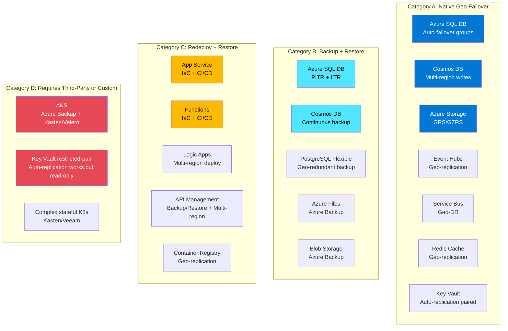
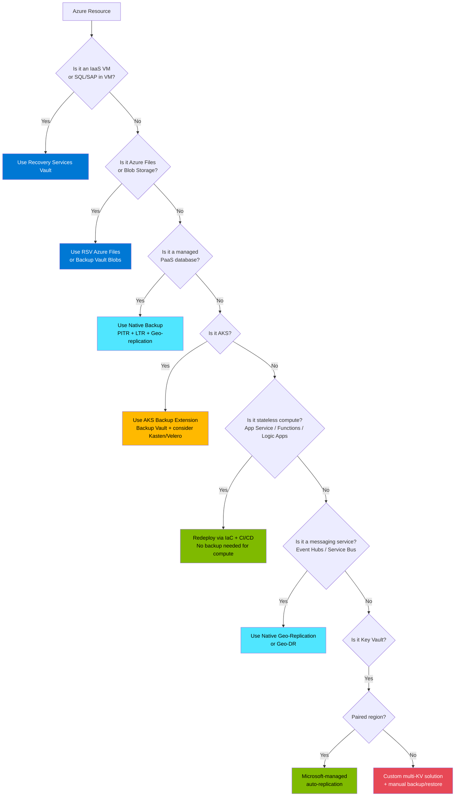
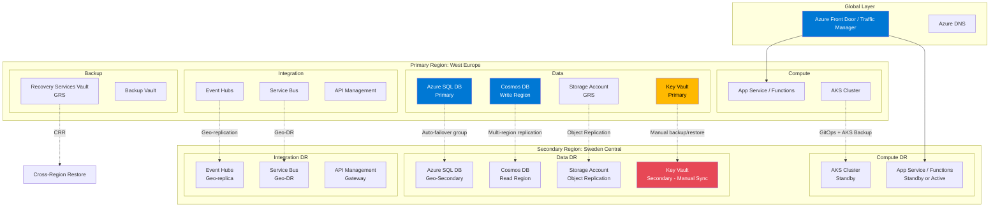
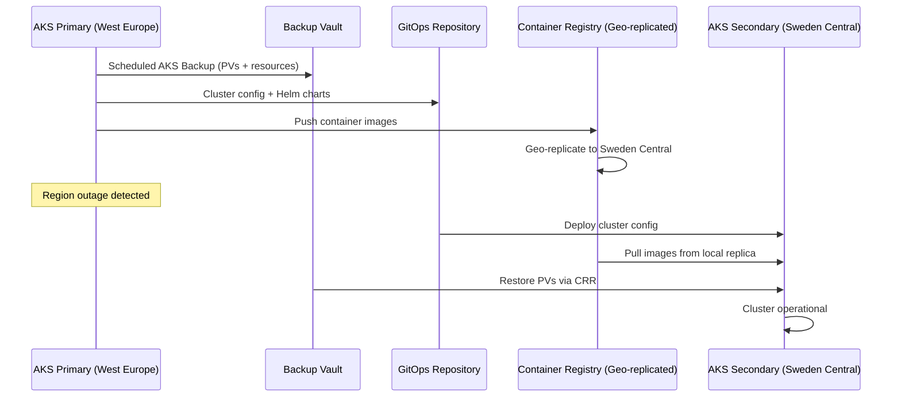

# Azure PaaS Backup & Recovery — Consolidated Enterprise Guidance

**Prepared by:** Microsoft Cloud Solution Architecture  
**Date:** April 2026  
**Audience:** Enterprise Infrastructure & BCDR Teams  
**Context:** Enterprise Scale Landing Zone, Multi-Region BCDR Strategy  
**Regions of Interest:** West Europe, Sweden Central, Germany West Central

---

## Table of Contents

1. [Executive Summary](#1-executive-summary)
2. [Question 1 — Consolidated Guidance for Recovering Azure PaaS Services Across Multiple Regions](#2-question-1--consolidated-guidance-for-recovering-azure-paas-services-across-multiple-regions)
3. [Question 2 — Recommended Backup Mechanisms by Azure Resource Type](#3-question-2--recommended-backup-mechanisms-by-azure-resource-type)
4. [Question 3 — Comprehensive List of Azure Resources with RSV Applicability](#4-question-3--comprehensive-list-of-azure-resources-with-rsv-applicability)
5. [Question 4 — Where Third-Party Solutions Are Needed](#5-question-4--where-third-party-solutions-are-needed)
6. [Architecture — Multi-Region BCDR Reference Design](#6-architecture--multi-region-bcdr-reference-design)
7. [Decision Matrix — Recovery Strategy Selection](#7-decision-matrix--recovery-strategy-selection)
8. [Comparison Table — Paired vs Restricted-Pair Region BCDR](#8-comparison-table--paired-vs-restricted-pair-region-bcdr)
9. [Scenario Analysis](#9-scenario-analysis)
10. [Recommended Next Steps](#10-recommended-next-steps)
11. [Microsoft Learn Reference Links](#11-microsoft-learn-reference-links)

---

## 1. Executive Summary

Azure provides strong business continuity and disaster recovery (BCDR) capabilities, but **recovery mechanisms vary significantly by service**. Unlike traditional infrastructure backup models where a single agent or vault protects everything, Azure PaaS services use a combination of:

| Recovery Model | Description | Examples |
|---|---|---|
| **Native geo-replication / cross-region failover** | Built-in data replication to secondary regions | Azure SQL (failover groups), Cosmos DB (multi-region writes), Storage (GRS/GZRS) |
| **Service-managed backups** | Automatic backups managed by the service | Azure SQL (PITR), Cosmos DB (continuous backup), PostgreSQL Flexible Server |
| **Azure Backup / Recovery Services Vault** | Centralized backup for selected workloads | Azure VMs, SQL in VM, SAP HANA in VM, Azure Files, Azure Blobs, AKS |
| **Infrastructure-as-Code redeployment** | Recreate + restore pattern | App Service, Functions, Logic Apps, API Management |
| **Third-party backup/orchestration** | Enterprise backup tools for gaps | Cross-cloud, air-gapped, advanced Kubernetes, compliance-driven |

> **Key Insight:** There is no single universal backup model for all PaaS services. A **consolidated workload-based recovery framework** is the correct enterprise approach.

### Enterprise Context — European Multi-Region Deployment

For organizations operating primarily in **West Europe** with plans to expand to **Sweden Central** and **Germany West Central**, the following considerations are critical:

- **Sweden Central** is paired with **Sweden South** (restricted-access region) — passive replication (GRS, Key Vault, Backup CRR) works to Sweden South, but you **cannot deploy active workloads** in Sweden South
- **Germany West Central** is paired with **Germany North** (restricted-access region) — same dynamic: passive replication works, active deployments are restricted
- **West Europe** is paired with **North Europe** (full bi-directional pairing)
- For **active DR** (deploying workloads in a secondary region), you must choose an unrestricted region such as West Europe, Sweden Central, or Germany West Central
- Many Azure services now support geo-replication to **any region**, not just paired regions

> **Key Nuance:** Having a restricted-access paired region means services like Storage GRS, Key Vault auto-replication, and Azure Backup CRR still function for **passive data protection**. However, for **active failover** (deploying applications, creating resources), you need a different unrestricted region.

> **Reference:** [Azure region pairs and nonpaired regions](https://learn.microsoft.com/azure/reliability/regions-paired)  
> **Reference:** [Azure regions list](https://learn.microsoft.com/azure/reliability/regions-list)  
> **Reference:** [Multi-region solutions in nonpaired regions](https://learn.microsoft.com/azure/reliability/regions-multi-region-nonpaired)

---

## 2. Question 1 — Consolidated Guidance for Recovering Azure PaaS Services Across Multiple Regions

### Customer Question
> *"Provide consolidated guidelines for recovering PaaS services across multiple regions, including recommended backup mechanisms and third-party solutions where Microsoft support is limited."*

### Microsoft's Recommended Approach

Microsoft recommends **workload-based resilience design** anchored on:

| Concept | Description |
|---|---|
| **Recovery Time Objective (RTO)** | Maximum acceptable downtime |
| **Recovery Point Objective (RPO)** | Maximum acceptable data loss |
| **Regional redundancy** | Multi-region or multi-zone deployment |
| **Paired/non-paired region strategy** | Choose approach based on region capabilities |
| **Regular failover testing** | Validate DR plans through drills |
| **Automated redeployment (IaC)** | Use Bicep/ARM/Terraform for rapid recovery |

### Recovery Models by Service Category

#### Category A — Native Geo-Failover Services (Automatic or Near-Automatic)

These services have **built-in cross-region replication** and failover capabilities:

| Service | Recovery Mechanism | RPO | RTO | Non-Paired Region Support |
|---|---|---|---|---|
| **Azure SQL Database** | Active geo-replication, Auto-failover groups | < 5 sec | < 30 sec (planned) | Yes — any region |
| **Azure Cosmos DB** | Multi-region writes, Automatic failover | ~0 (multi-write) | Seconds | Yes — any region |
| **Azure Storage (Blob/Files)** | GRS/GZRS/RA-GRS | ~15 min | Hours (failover) | GRS uses paired; Object Replication for non-paired |
| **Azure Event Hubs** | Geo-replication (Premium/Dedicated) | Near real-time | Minutes | Yes — configurable |
| **Azure Service Bus** | Geo-DR (metadata + optional data) | Metadata only or near real-time | Minutes | Yes — flexible |
| **Azure Cache for Redis** | Passive geo-replication (Premium), Active geo-replication (Enterprise) | Seconds–Minutes | Minutes | Enterprise: any region |
| **Azure Key Vault** | Microsoft-managed cross-region replication (paired regions) | Near real-time | Minutes | Paired regions (incl. restricted-access pairs like Sweden South): auto-replication works; truly non-paired regions: manual backup/restore |

#### Category B — Backup + Restore Services

These services provide **automated backups** with restore capabilities:

| Service | Backup Type | Retention | Cross-Region | RPO |
|---|---|---|---|---|
| **Azure SQL Database** | Automated PITR + LTR | 7-35 days (PITR), up to 10 years (LTR) | Geo-restore from GRS backup | Minutes–Hours |
| **Azure Cosmos DB** | Continuous (PITR) or Periodic | 7-30 days (continuous) | Backup stored per-region | 100 seconds |
| **Azure PostgreSQL Flexible** | Automated backups, geo-redundant backup | Up to 35 days | Yes (geo-redundant backup option) | Minutes |
| **Azure MySQL Flexible** | Automated backups | Up to 35 days | Geo-redundant backup option | Minutes |
| **Azure Files** | Azure Backup (snapshots) | Configurable | Cross-region restore with GRS vault | Daily/Hourly |
| **Azure Blob Storage** | Azure Backup (operational/vaulted) | Configurable | Vault tier supports CRR | Configurable |

#### Category C — Recreate + Restore Data (IaC-Driven Recovery)

These services require **redeployment** in the secondary region with data restore:

| Service | Recovery Strategy | Data Protection | Key Consideration |
|---|---|---|---|
| **Azure App Service** | Redeploy via IaC + CI/CD | Built-in backup to Storage Account | Multi-region with Front Door recommended |
| **Azure Functions** | Redeploy via IaC + CI/CD | Storage dependency protection | Source-controlled deployment |
| **Azure Logic Apps** | Active-passive or active-active multi-region | Integration account DR | Trigger-type-dependent strategy |
| **Azure API Management** | Backup/restore to storage + multi-region deployment | PowerShell backup (30-day expiry) | Premium tier supports multi-region natively |
| **Azure Container Registry** | Geo-replication (Premium tier) | Images replicated cross-region | No backup needed — replication is sufficient |

### Architecture Diagram — PaaS Recovery Categories

---

## 3. Question 2 — Recommended Backup Mechanisms by Azure Resource Type

### Customer Question
> *"Provide a comprehensive list of Azure resources with their supported backup mechanisms."*

### Complete Azure Resource Backup & Recovery Matrix

#### Databases

| Resource | Native Backup | Azure Backup / RSV | Geo-Replication | Non-Paired Region Support | Key Docs |
|---|---|---|---|---|---|
| **Azure SQL Database** | PITR (7-35 days), LTR (up to 10 years) | No (not needed) | Active geo-replication, Auto-failover groups, Geo-restore | Yes — failover groups to any region; Geo-restore **not** available in regions without pairs | [Automated backups](https://learn.microsoft.com/azure/azure-sql/database/automated-backups-overview) |
| **Azure SQL Managed Instance** | PITR (7-35 days), LTR | No | Failover groups | Yes — any region | [Business continuity](https://learn.microsoft.com/azure/azure-sql/managed-instance/business-continuity-high-availability-disaster-recover-hadr-overview) |
| **Azure Cosmos DB** | Continuous (PITR 7-30 days), Periodic (configurable) | No | Multi-region writes, automatic failover | Yes — any region | [Disaster recovery](https://learn.microsoft.com/azure/cosmos-db/disaster-recovery-guidance) |
| **Azure PostgreSQL Flexible Server** | Automated (up to 35 days) | No | Geo-redundant backup, Read replicas | Yes — geo-redundant to paired; Read replicas to any | [Backup & restore](https://learn.microsoft.com/azure/postgresql/flexible-server/concepts-backup-restore) |
| **Azure MySQL Flexible Server** | Automated (up to 35 days) | No | Geo-redundant backup, Read replicas | Limited — geo backup uses paired region | [Backup & restore](https://learn.microsoft.com/azure/mysql/flexible-server/concepts-backup-restore) |
| **Azure Database for MariaDB** | Automated (up to 35 days) | No | Geo-restore | Limited | [Backup concepts](https://learn.microsoft.com/azure/mariadb/concepts-backup) |

#### Storage

| Resource | Native Backup | Azure Backup / RSV | Geo-Replication | Non-Paired Region Support | Key Docs |
|---|---|---|---|---|---|
| **Azure Storage Accounts** | Soft delete, Versioning | Yes (Blob backup via Backup Vault) | LRS/ZRS/GRS/GZRS/RA-GRS/RA-GZRS | GRS uses paired region; Object Replication for non-paired | [Storage redundancy](https://learn.microsoft.com/azure/storage/common/storage-redundancy) |
| **Azure Files** | Share snapshots | Yes (RSV) | GRS/GZRS via storage account | Cross-region restore if GRS vault | [File share backup](https://learn.microsoft.com/azure/backup/azure-file-share-backup-overview) |
| **Azure Managed Disks** | Incremental snapshots | Yes (Backup Vault) | Cross-region copy via snapshot | Yes — snapshot to any region | [Disk backup](https://learn.microsoft.com/azure/backup/disk-backup-overview) |
| **Azure Data Lake Storage Gen2** | Soft delete, Versioning | Yes (via Blob backup) | GRS/GZRS | Same as Blob Storage | [ADLS reliability](https://learn.microsoft.com/azure/reliability/reliability-storage-blob) |

#### Application Platform

| Resource | Native Backup | Azure Backup / RSV | Geo-Replication | Non-Paired Region Support | Key Docs |
|---|---|---|---|---|---|
| **Azure App Service** | Built-in backup to Storage | No | No native geo-replication | Multi-region deploy via IaC + Front Door | [App Service backup](https://learn.microsoft.com/azure/app-service/manage-backup) |
| **Azure Functions** | Source-controlled | No | No | Redeploy via CI/CD | [Functions best practices](https://learn.microsoft.com/azure/azure-functions/functions-best-practices) |
| **Azure Logic Apps** | No built-in backup | No | No native geo-replication | Active-passive multi-region deploy | [Logic Apps DR](https://learn.microsoft.com/azure/logic-apps/multi-region-disaster-recovery) |
| **Azure API Management** | Backup/restore via PowerShell (30-day expiry) | No | Multi-region deployment (Premium tier) | Yes — deploy gateways to any region | [APIM DR](https://learn.microsoft.com/azure/api-management/api-management-howto-disaster-recovery-backup-restore) |

#### Containers & Kubernetes

| Resource | Native Backup | Azure Backup / RSV | Geo-Replication | Non-Paired Region Support | Key Docs |
|---|---|---|---|---|---|
| **Azure Kubernetes Service (AKS)** | No built-in | Yes (AKS Backup extension — Backup Vault) | No native replication | CRR to paired region (Vault tier); Multi-cluster via Fleet Manager | [AKS Backup](https://learn.microsoft.com/azure/backup/azure-kubernetes-service-cluster-backup-overview) |
| **Azure Container Registry** | No backup needed | No | Geo-replication (Premium tier) | Yes — any region | [ACR geo-replication](https://learn.microsoft.com/azure/container-registry/container-registry-geo-replication) |
| **Azure Container Apps** | No built-in | No | No native replication | Redeploy via IaC | [Container Apps DR](https://learn.microsoft.com/azure/container-apps/disaster-recovery) |

#### Messaging & Integration

| Resource | Native Backup | Azure Backup / RSV | Geo-Replication | Non-Paired Region Support | Key Docs |
|---|---|---|---|---|---|
| **Azure Event Hubs** | No backup | No | Geo-replication (Premium/Dedicated — data + metadata), Geo-DR (metadata only) | Yes — configurable regions | [Event Hubs geo-replication](https://learn.microsoft.com/azure/event-hubs/geo-replication) |
| **Azure Service Bus** | No backup | No | Geo-DR (metadata), Application-level replication | Yes — flexible regions | [Service Bus Geo-DR](https://learn.microsoft.com/azure/service-bus-messaging/service-bus-geo-dr) |
| **Azure Event Grid** | No backup | No | No native geo-replication | Multi-region deploy | [Event Grid reliability](https://learn.microsoft.com/azure/reliability/reliability-event-grid) |

#### Security & Identity

| Resource | Native Backup | Azure Backup / RSV | Geo-Replication | Non-Paired Region Support | Key Docs |
|---|---|---|---|---|---|
| **Azure Key Vault** | Individual secret/key/certificate backup (encrypted blob) | No | Microsoft-managed cross-region replication (to paired region, including restricted-access pairs) | For truly non-paired regions only: custom multi-vault solution required. Sweden Central and Germany West Central ARE paired (restricted) — auto-replication works. | [Key Vault reliability](https://learn.microsoft.com/azure/reliability/reliability-key-vault) |
| **Azure Managed HSM** | Backup/restore | No | Multi-master replication via Cosmos DB backend | Limited — contact Microsoft | [Managed HSM BCDR](https://learn.microsoft.com/azure/key-vault/managed-hsm/disaster-recovery-guide) |

#### Monitoring & Analytics

| Resource | Native Backup | Azure Backup / RSV | Geo-Replication | Non-Paired Region Support | Key Docs |
|---|---|---|---|---|---|
| **Azure Monitor / Log Analytics** | Data export | No | Workspace replication (preview) | Yes — configurable secondary regions within geography | [Workspace replication](https://learn.microsoft.com/azure/azure-monitor/logs/workspace-replication) |
| **Application Insights** | Data export | No | No native replication | Deploy separate instances per region | [App Insights data retention](https://learn.microsoft.com/azure/azure-monitor/app/data-retention-privacy) |

#### Networking

| Resource | Native Backup | Azure Backup / RSV | Geo-Replication | Non-Paired Region Support | Key Docs |
|---|---|---|---|---|---|
| **Azure Front Door** | N/A (global service) | N/A | Global — inherently multi-region | Yes | [Front Door overview](https://learn.microsoft.com/azure/frontdoor/front-door-overview) |
| **Azure Traffic Manager** | N/A (global DNS) | N/A | Global — inherently multi-region | Yes | [Traffic Manager overview](https://learn.microsoft.com/azure/traffic-manager/traffic-manager-overview) |
| **Azure DNS** | N/A (global service) | N/A | Global | Yes | [Azure DNS reliability](https://learn.microsoft.com/azure/reliability/reliability-dns) |
| **VNet / NSG / UDR** | No backup | No | No | Redeploy via IaC | Use ARM/Bicep/Terraform |

---

## 4. Question 3 — Comprehensive List of Azure Resources with RSV Applicability

### Customer Question
> *"Provide a list specifying which resources are supported by Recovery Services Vault and where third-party solutions are required."*

### Recovery Services Vault (RSV) — Supported Workloads

| Workload | Vault Type | Backup Frequency | Cross-Region Restore | Notes |
|---|---|---|---|---|
| **Azure Virtual Machines** | Recovery Services Vault | 1x/day | Yes (CRR with GRS) | Full VM snapshots, app-consistent |
| **SQL Server in Azure VM** | Recovery Services Vault | Every 15 min (log), daily (full) | Yes (CRR with GRS) | Full + differential + log backups |
| **SAP HANA in Azure VM** | Recovery Services Vault | Configurable | Yes (CRR with GRS) | Enterprise SAP support |
| **Azure Files** | Recovery Services Vault | Multiple/day | Yes (if GRS vault) | Share-level snapshots |
| **On-premises (MARS Agent)** | Recovery Services Vault | 3x/day | No | Files, folders, system state |
| **DPM / MABS Workloads** | Recovery Services Vault | 2x/day | No | App-aware, broad workload support |

### Backup Vault — Supported Workloads

| Workload | Vault Type | Key Feature | Cross-Region Restore |
|---|---|---|---|
| **Azure Blobs** | Backup Vault | Operational (continuous) + Vaulted (scheduled) | Yes (Vault tier) |
| **Azure Managed Disks** | Backup Vault | Incremental snapshots | Limited |
| **Azure Kubernetes Service (AKS)** | Backup Vault | Cluster resources + PVs | Yes (Vault tier — CRR to paired region) |
| **Azure PostgreSQL Server** | Backup Vault | Long-term retention | Yes (Vault tier) |
| **Azure Data Lake Storage** | Backup Vault | Via Blob backup | Yes (Vault tier) |
| **Azure Elastic SAN** | Backup Vault | Volume snapshots | Limited |

### Services Where RSV Does NOT Apply

These services use **native backup models** and RSV is NOT the protection mechanism:

| Service | Why RSV Doesn't Apply | What to Use Instead |
|---|---|---|
| Azure SQL Database | Has native PITR + LTR + geo-replication | Built-in automated backups + failover groups |
| Azure Cosmos DB | Has native continuous/periodic backup | Built-in PITR + multi-region replication |
| Azure App Service | Compute is stateless; data is in storage/DB | IaC redeployment + built-in backup to Storage |
| Azure Functions | Compute is stateless | IaC + CI/CD redeployment |
| Azure Logic Apps | Compute + orchestration | Multi-region deployment |
| Azure API Management | Configuration-based service | Backup/restore PowerShell + multi-region deploy |
| Azure Key Vault | Has native replication (paired) | Microsoft-managed replication or manual backup/restore |
| Azure Event Hubs | Streaming platform | Geo-replication or application-level replication |
| Azure Service Bus | Messaging platform | Geo-DR or application-level replication |
| Azure Container Registry | Image registry | Geo-replication (Premium) |

### Visual Decision Tree — RSV vs Native vs Third-Party

---

## 5. Question 4 — Where Third-Party Solutions Are Needed

### Customer Question
> *"Specify where third-party solutions are required, to better inform application teams operating in a decentralized model."*

### When Third-Party Tools Are Commonly Used

| Scenario | Why Third-Party | Recommended Tools |
|---|---|---|
| **Single backup console across Azure + AWS + On-prem** | Azure Backup is Azure-only | Veeam, Commvault, Rubrik |
| **Long retention compliance (> 10 years)** | Some Azure services have limited retention | Commvault, Rubrik, Cohesity |
| **Air-gapped / immutable backups** | Regulatory requirement for offline copies | Veeam (hardened repository), Commvault |
| **Granular Kubernetes workload restore** | AKS Backup has limitations for complex stateful apps | Kasten by Veeam, Velero |
| **Advanced reporting & governance** | Centralized backup compliance dashboard | Veeam, Rubrik, Commvault |
| **Cross-platform orchestration** | DR orchestration across heterogeneous environments | Zerto, Commvault |
| **Key Vault in non-paired regions** | No Microsoft-managed replication (only applies to truly non-paired regions like Italy North, Poland Central) | Custom solution + scripts |
| **Complex database-level restore orchestration** | Multi-step recovery with pre/post scripts | Commvault, Rubrik |

### Third-Party Integration Points by Service

| Azure Service | Microsoft-Native Protection | Third-Party Gap / Addition |
|---|---|---|
| **Azure VMs** | Azure Backup (RSV) — Excellent | Third-party adds: cross-cloud, long retention, air-gap |
| **Azure SQL Database** | Native PITR + LTR + Failover Groups — Excellent | Rarely needed; only for cross-cloud compliance |
| **Azure Cosmos DB** | Continuous + Periodic backup — Excellent | Rarely needed |
| **Azure Files** | Azure Backup — Good | Third-party for advanced file-level restore, cross-platform |
| **AKS** | AKS Backup — Good (improving) | Kasten/Velero for complex stateful workloads, Helm-aware restore |
| **Key Vault (truly non-paired regions)** | Manual backup/restore — Limited | Custom scripts; no mainstream third-party tool for KV backup. Note: Sweden Central and Germany West Central ARE paired and have auto-replication. |
| **App Service / Functions** | Built-in backup — Basic | Usually not needed; IaC covers compute |
| **Event Hubs / Service Bus** | Geo-replication — Good | Application-level capture (Event Hubs Capture to Storage) |

### Practical Recommendation for Enterprise Customers

Given a decentralized operating model:

1. **For IaaS workloads (VMs, SQL in VM, SAP HANA):** Azure Backup (RSV) is fully sufficient
2. **For PaaS databases:** Native backup mechanisms are best-in-class — no third-party needed
3. **For AKS:** Start with AKS Backup extension; evaluate Kasten/Velero if complex stateful workloads exist
4. **For Key Vault in Sweden Central / Germany West Central:** Implement custom multi-vault solution with automated backup/restore scripts
5. **For compliance-driven long retention:** Evaluate Commvault or Rubrik if Azure LTR doesn't meet regulatory requirements
6. **For cross-cloud scenarios:** Only if the organization has multi-cloud workloads requiring unified backup

---

## 6. Architecture — Multi-Region BCDR Reference Design

### Enterprise Multi-Region Architecture (West Europe + Sweden Central)

### Key Architecture Notes for Regions with Restricted-Access Pairs

| Concern | West Europe (Paired: North Europe) | Sweden Central (Paired: Sweden South — restricted) | Germany West Central (Paired: Germany North — restricted) |
|---|---|---|---|
| **Storage GRS** | GRS replicates to North Europe | GRS replicates to **Sweden South** (passive replication works) | GRS replicates to Germany North |
| **Key Vault** | Auto-replication to North Europe | Auto-replication to **Sweden South** (read-only failover works) | Auto-replication to Germany North |
| **Azure SQL geo-restore** | Available to paired region | Available to **Sweden South** (but cannot create resources there — use failover groups to another region instead) | Available to Germany North |
| **Azure Backup CRR** | Restores to North Europe | CRR to **Sweden South** should work for GRS vaults | Restores to Germany North |
| **Active DR (deploy workloads)** | Deploy in North Europe or any region | **Cannot deploy in Sweden South** — use West Europe or Germany West Central for active DR | Can deploy in Germany North (restricted — request access) or use another region |
| **Cosmos DB** | Any region | Any region | Any region |

> **Important:** Sweden South is restricted-access, meaning you **cannot create new resources** there without special access. For passive data protection (GRS, Key Vault replication, Backup CRR), the pairing works. For **active disaster recovery** (deploying applications, AKS clusters, App Services), you need to use a different unrestricted region as your secondary.

---

## 7. Decision Matrix — Recovery Strategy Selection

### Workload Tiering Model

| Tier | Classification | RTO Target | RPO Target | Recommended Strategy | Cost Impact |
|---|---|---|---|---|---|
| **Tier 0** | Mission Critical | < 1 min | Near-zero | Active-active multi-region, multi-write databases, global load balancing | $$$$$ |
| **Tier 1** | Business Critical | < 15 min | < 5 min | Active-passive warm standby, auto-failover groups, geo-replication | $$$$ |
| **Tier 2** | Important Internal | < 4 hours | < 1 hour | Active-passive cold standby, scheduled backups, IaC redeployment | $$ |
| **Tier 3** | Dev/Test / Low Priority | < 24 hours | < 24 hours | Backup + restore only, redeploy from IaC | $ |

### Strategy Selection per Service

| Service | Tier 0 Strategy | Tier 1 Strategy | Tier 2 Strategy | Tier 3 Strategy |
|---|---|---|---|---|
| **Azure SQL DB** | Auto-failover groups (active-active read) | Auto-failover groups | Active geo-replication | Geo-restore from backup |
| **Cosmos DB** | Multi-region multi-write | Multi-region single-write + auto-failover | Single-region + continuous backup PITR | Periodic backup |
| **Storage** | RA-GZRS + application-level routing | GRS/GZRS | GRS | LRS + scheduled backup |
| **App Service** | Active-active + Front Door | Active-passive + Front Door | Passive-cold + IaC | Redeploy manually |
| **AKS** | Multi-cluster Fleet Manager | Active-passive AKS + GitOps | AKS Backup + redeploy | AKS Backup only |
| **Key Vault** | Multi-vault active-active with app routing | Primary + manual sync secondary | Primary + backup scripts | Single vault |
| **Event Hubs** | Geo-replication active | Geo-replication | Geo-DR (metadata) | Single region |

---

## 8. Comparison Table — Paired vs Restricted-Pair Region BCDR

| Capability | Full Pair (e.g., West Europe ↔ North Europe) | Restricted-Access Pair (e.g., Sweden Central ↔ Sweden South) |
|---|---|---|
| **Storage GRS/GZRS** | Automatic replication to pair ✅ | Automatic replication to restricted pair ✅ (passive protection works) |
| **Key Vault auto-failover** | Microsoft-managed replication + failover ✅ | Microsoft-managed replication to restricted pair ✅ (read-only failover) |
| **Azure Backup CRR** | Cross-Region Restore to paired region ✅ | CRR to restricted paired region ✅ (passive restore) |
| **Azure SQL geo-restore** | Geo-redundant backup storage available ✅ | Geo-restore to restricted pair ✅ (but cannot create active resources there) |
| **Active DR — deploy workloads in pair** | ✅ Can deploy in paired region | ❌ Cannot deploy in restricted pair — use another unrestricted region |
| **Azure Site Recovery** | Full support between paired regions ✅ | Full support — ASR works between **any** regions (global DR) ✅ |
| **Cosmos DB** | Works with any region | Works with any region — no pairing dependency |
| **Event Hubs Geo-replication** | Configurable to any region | Configurable to any region |
| **Service Bus Geo-DR** | Configurable | Configurable |
| **Sequential updates** | Paired regions get staggered updates | Both regions in same geography — staggering applies |
| **Data residency** | Both regions in same geography | Both regions in same geography ✅ |

### Implications for European Enterprise Deployments

When using **Sweden Central** as a secondary region:

1. **Azure SQL Database:** Use auto-failover groups (works with any region) — ✅ Fully supported
2. **Cosmos DB:** Multi-region replication to any region — ✅ Fully supported
3. **Storage GRS:** Replicates to Sweden South (restricted) for passive protection — ✅ Works; for active cross-region access use Object Replication to an unrestricted secondary
4. **Key Vault:** Auto-replication to Sweden South works for passive failover — ✅ Supported; for active multi-region access, maintain a secondary Key Vault in an unrestricted region
5. **Azure Backup CRR:** CRR to Sweden South should work for GRS vaults — ✅ Verify per workload type
6. **App Service / Functions:** Multi-region deploy via IaC — ✅ Region-agnostic
7. **Active DR workloads:** Cannot deploy in Sweden South (restricted) — ⚠️ Use West Europe or Germany West Central as active secondary

---

## 9. Scenario Analysis

### Scenario 1: Complete West Europe Region Outage

**Impact:** All primary services unavailable  
**Recovery actions by service:**

| Service | Action | Time to Recover | Data Loss Risk |
|---|---|---|---|
| Azure SQL DB | Automatic failover to Sweden Central via failover group | < 30 seconds (planned), minutes (forced) | < 5 seconds RPO |
| Cosmos DB | Automatic failover to secondary region | Seconds | Near-zero (multi-write) |
| Storage | Initiate failover (GRS to North Europe) or use Object Replication copy in Sweden Central | Hours (GRS failover) or immediate (Object Replication) | ~15 min RPO (GRS) |
| Key Vault | Switch to Sweden Central Key Vault (manual failover in app config) | Minutes (depends on automation) | Depends on sync frequency |
| App Service | Front Door routes to Sweden Central deployment | Seconds (if pre-deployed) | Zero (stateless) |
| AKS | Activate standby cluster + restore from AKS Backup | 30 min – 2 hours | Last backup point |
| Event Hubs | Geo-replication auto-routes to secondary | Minutes | Near real-time |

### Scenario 2: Key Vault Resilience for Sweden Central

**Clarification:** Sweden Central IS paired with Sweden South (restricted-access). This means:
- **Microsoft-managed Key Vault replication to Sweden South DOES work** — your secrets, keys, and certificates are replicated automatically
- In a prolonged region failure, Microsoft may initiate failover — the Key Vault becomes **read-only** in Sweden South
- Sweden South is restricted — you **cannot create new Key Vaults there**, but the failover replica is Microsoft-managed

**For active multi-region scenarios** (where you need writable Key Vaults in multiple regions):

1. Maintain a **secondary Key Vault in Germany West Central or West Europe**
2. Implement **automated sync** using Azure Functions or Logic Apps that:
   - Periodically export secrets/keys/certificates via backup API
   - Restore to secondary Key Vault
   - Note: Backups can only restore within the **same Azure geography and subscription**
3. Application-level configuration to **fall back** to secondary Key Vault
4. Use **Managed HSM** if HSM-level protection is needed — it uses multi-master replication

> **Key Vault Backup Limitations:**
> - Backups are encrypted blobs that can only be restored within the same Azure subscription and geography
> - Maximum 500 past versions per key/secret/certificate
> - Backups are point-in-time snapshots (not continuous)
> - [Key Vault backup documentation](https://learn.microsoft.com/azure/key-vault/general/backup)

### Scenario 3: AKS Workload Recovery to Secondary Region

**Challenge:** Stateful Kubernetes workloads with persistent volumes  
**Recovery approach:**

1. **Cluster configuration:** Stored in Git (GitOps) — redeploy to any region
2. **Container images:** ACR geo-replication — immediately available in secondary
3. **Persistent volumes:** AKS Backup extension — snapshot + vault tier for CRR
4. **Stateful databases:** Use external PaaS databases (SQL/Cosmos) with their own DR
5. **Custom hooks:** Implement pre/post-snapshot hooks for database consistency

### Scenario 4: Decentralized Team Onboarding — Providing Self-Service BCDR Guidance

**Challenge:** Application teams in a decentralized model need clear self-service guidance  
**Recommendation:**

Create a **BCDR Self-Service Guide** for application teams containing:

1. **Service classification form** — teams categorize their workload tier (0-3)
2. **Pre-built Bicep/Terraform modules** — for each service's DR setup
3. **Runbook templates** — failover and failback procedures per service
4. **Monitoring dashboards** — Azure Monitor workbooks for backup health
5. **Policy enforcement** — Azure Policy to enforce backup configuration

| Policy | Effect | Scope |
|---|---|---|
| VMs must have Azure Backup enabled | Audit / DeployIfNotExists | All subscriptions |
| Storage accounts must use GRS or GZRS | Audit | Production subscriptions |
| SQL databases must have LTR configured | Audit | Production subscriptions |
| Key Vaults must have soft delete and purge protection | Deny | All subscriptions |

---

## 10. Recommended Next Steps

### Immediate Actions (Next 2 Weeks)

| # | Action | Owner | Priority |
|---|---|---|---|
| 1 | Create inventory of all Azure PaaS resources across subscriptions | BCDR Lead + App Teams | P0 |
| 2 | Classify each workload into Tiers 0-3 based on business criticality | BCDR Lead + Business | P0 |
| 3 | Map each service to its recovery mechanism using the matrix above | BCDR Lead | P0 |
| 4 | Identify Key Vault instances in regions with restricted-access pairs and verify replication; design active multi-region strategy where needed | BCDR Lead + Microsoft CSA | P1 |

### Short-Term (Next 4-8 Weeks)

| # | Action | Owner | Priority |
|---|---|---|---|
| 5 | Implement Azure Policy for backup enforcement | BCDR Lead / Platform Team | P1 |
| 6 | Deploy IaC templates for DR infrastructure in Sweden Central | Platform Team | P1 |
| 7 | Set up AKS Backup for all production clusters | App Teams | P1 |
| 8 | Configure auto-failover groups for all Tier 0/1 Azure SQL databases | DBA Team | P1 |

### Medium-Term (Next Quarter)

| # | Action | Owner | Priority |
|---|---|---|---|
| 9 | Conduct first DR drill / failover test | BCDR Lead + All Teams | P1 |
| 10 | Evaluate third-party tools (Kasten/Veeam) for complex AKS workloads | Platform Team | P2 |
| 11 | Create BCDR self-service guide for decentralized app teams | Microsoft CSA + BCDR Lead | P2 |
| 12 | Implement centralized backup monitoring dashboard (Azure Monitor Workbooks) | Platform Team | P2 |

---

## 11. Microsoft Learn Reference Links

### Core BCDR Documentation

| Topic | URL |
|---|---|
| Azure Reliability Overview | https://learn.microsoft.com/azure/reliability/overview |
| Reliability Guides by Service | https://learn.microsoft.com/azure/reliability/overview-reliability-guidance |
| Business Continuity & Disaster Recovery Concepts | https://learn.microsoft.com/azure/reliability/concept-business-continuity-high-availability-disaster-recovery |
| Azure Region Pairs and Non-Paired Regions | https://learn.microsoft.com/azure/reliability/regions-paired |
| Multi-Region Solutions in Non-Paired Regions | https://learn.microsoft.com/azure/reliability/regions-multi-region-nonpaired |
| Well-Architected Framework — Reliability Pillar | https://learn.microsoft.com/azure/well-architected/reliability/ |
| WAF — Disaster Recovery Strategies | https://learn.microsoft.com/azure/well-architected/reliability/disaster-recovery |
| WAF — Develop a DR Plan | https://learn.microsoft.com/azure/well-architected/design-guides/disaster-recovery |
| CAF — Landing Zone BCDR Design Area | https://learn.microsoft.com/azure/cloud-adoption-framework/ready/landing-zone/design-area/management-business-continuity-disaster-recovery |

### Azure Backup & Recovery Services

| Topic | URL |
|---|---|
| Azure Backup Overview | https://learn.microsoft.com/azure/backup/backup-overview |
| Azure Backup Support Matrix | https://learn.microsoft.com/azure/backup/backup-support-matrix |
| Recovery Services Vault | https://learn.microsoft.com/azure/backup/backup-create-recovery-services-vault |
| Cross-Region Restore | https://learn.microsoft.com/azure/backup/backup-create-rs-vault#set-cross-region-restore |
| Reliability in Azure Backup | https://learn.microsoft.com/azure/reliability/reliability-backup |
| Backup Center Support Matrix | https://learn.microsoft.com/azure/backup/backup-center-support-matrix |

### Database Services

| Topic | URL |
|---|---|
| Azure SQL — Automated Backups | https://learn.microsoft.com/azure/azure-sql/database/automated-backups-overview |
| Azure SQL — Active Geo-Replication | https://learn.microsoft.com/azure/azure-sql/database/active-geo-replication-overview |
| Azure SQL — Failover Groups | https://learn.microsoft.com/azure/azure-sql/database/failover-group-sql-db |
| Azure SQL — HA/DR Checklist | https://learn.microsoft.com/azure/azure-sql/database/high-availability-disaster-recovery-checklist |
| Azure SQL — Disaster Recovery Guidance | https://learn.microsoft.com/azure/azure-sql/database/disaster-recovery-guidance |
| Azure SQL — Long-Term Retention | https://learn.microsoft.com/azure/azure-sql/database/long-term-retention-overview |
| Cosmos DB — Disaster Recovery | https://learn.microsoft.com/azure/cosmos-db/disaster-recovery-guidance |
| Cosmos DB — Continuous Backup & PITR | https://learn.microsoft.com/azure/cosmos-db/continuous-backup-restore-introduction |
| Cosmos DB — High Availability | https://learn.microsoft.com/azure/cosmos-db/high-availability |
| PostgreSQL Flexible — Backup & Restore | https://learn.microsoft.com/azure/postgresql/flexible-server/concepts-backup-restore |

### Storage

| Topic | URL |
|---|---|
| Azure Storage Redundancy | https://learn.microsoft.com/azure/storage/common/storage-redundancy |
| Azure Files Backup | https://learn.microsoft.com/azure/backup/azure-file-share-backup-overview |
| Blob Storage Object Replication | https://learn.microsoft.com/azure/storage/blobs/object-replication-overview |
| Storage Disaster Recovery Guidance | https://learn.microsoft.com/azure/storage/common/storage-disaster-recovery-guidance |

### Application Platform

| Topic | URL |
|---|---|
| App Service Backup | https://learn.microsoft.com/azure/app-service/manage-backup |
| App Service Multi-Region DR | https://learn.microsoft.com/azure/architecture/web-apps/guides/multi-region-app-service/multi-region-app-service |
| Functions Best Practices | https://learn.microsoft.com/azure/azure-functions/functions-best-practices |
| Logic Apps Multi-Region DR | https://learn.microsoft.com/azure/logic-apps/multi-region-disaster-recovery |
| API Management DR (Backup/Restore) | https://learn.microsoft.com/azure/api-management/api-management-howto-disaster-recovery-backup-restore |

### Containers & Kubernetes

| Topic | URL |
|---|---|
| AKS Backup Overview | https://learn.microsoft.com/azure/backup/azure-kubernetes-service-backup-overview |
| AKS Backup & Recovery Architecture | https://learn.microsoft.com/azure/architecture/operator-guides/aks/aks-backup-and-recovery |
| AKS Multi-Region Deployment | https://learn.microsoft.com/azure/aks/reliability-multi-region-deployment-models |
| AKS Reliability Guide | https://learn.microsoft.com/azure/reliability/reliability-aks |
| ACR Geo-Replication | https://learn.microsoft.com/azure/container-registry/container-registry-geo-replication |
| Container Apps DR | https://learn.microsoft.com/azure/container-apps/disaster-recovery |

### Security & Key Management

| Topic | URL |
|---|---|
| Key Vault Reliability | https://learn.microsoft.com/azure/reliability/reliability-key-vault |
| Key Vault Backup | https://learn.microsoft.com/azure/key-vault/general/backup |
| Key Vault Availability & Redundancy | https://learn.microsoft.com/azure/key-vault/general/disaster-recovery-guidance |

### Messaging & Integration

| Topic | URL |
|---|---|
| Event Hubs Geo-Replication | https://learn.microsoft.com/azure/event-hubs/geo-replication |
| Event Hubs Geo-DR (Metadata) | https://learn.microsoft.com/azure/event-hubs/event-hubs-geo-dr |
| Service Bus Geo-DR | https://learn.microsoft.com/azure/service-bus-messaging/service-bus-geo-dr |

### Monitoring

| Topic | URL |
|---|---|
| Log Analytics Workspace Replication | https://learn.microsoft.com/azure/azure-monitor/logs/workspace-replication |

---

## Closing Note

> As correctly identified by the customer's infrastructure team: **current recovery mechanisms vary by resource**, and a **consolidated workload-based recovery framework** is the right enterprise approach rather than assuming one universal backup model for all PaaS services.
>
> The matrices and decision trees in this document provide a service-by-service mapping that enterprise application teams can use as a self-service reference in their decentralized operating model.
>
> For regions with restricted-access pairs like Sweden Central (paired with Sweden South), **passive data protection** (GRS, Key Vault replication, Backup CRR) works automatically. However, for **active disaster recovery** (deploying workloads in a secondary region), an unrestricted secondary region must be used. This distinction should be clearly communicated to application teams.

---

*Document prepared based on Microsoft Learn documentation as of April 2026. Service capabilities evolve — always verify against the latest [Azure reliability guides](https://learn.microsoft.com/azure/reliability/overview-reliability-guidance).*
