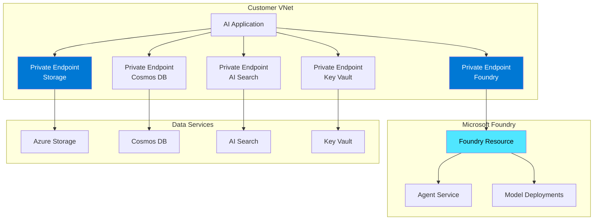
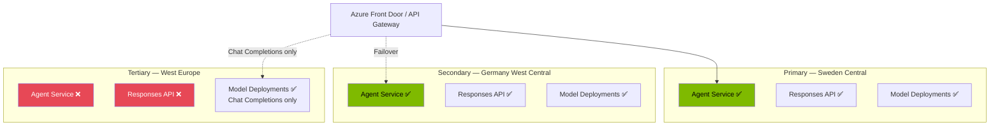
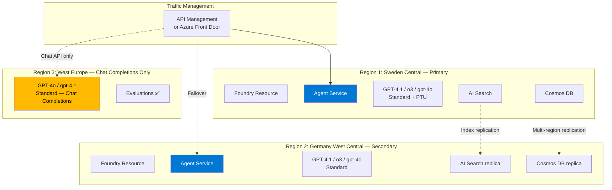

# Microsoft Foundry & AI Platform — Consolidated Enterprise Guidance

**Prepared by:** Microsoft Cloud Solution Architecture  
**Date:** April 2026  
**Audience:** Enterprise AI Platform & Engineering Teams  
**Context:** Microsoft Foundry Adoption, Multi-Region AI Resilience, EU Capacity Planning

---

## Table of Contents

1. [Executive Summary](#1-executive-summary)
2. [Question 1 — Microsoft Foundry Roadmap & Key Features](#2-question-1--microsoft-foundry-roadmap--key-features)
3. [Question 2 — Private Endpoint Support for Foundry](#3-question-2--private-endpoint-support-for-foundry)
4. [Question 3 — Cloud Model Capacity in EU Regions](#4-question-3--cloud-model-capacity-in-eu-regions)
5. [Question 4 — Responses API Regional Availability](#5-question-4--responses-api-regional-availability)
6. [Architecture — Multi-Region AI Platform Resilience](#6-architecture--multi-region-ai-platform-resilience)
7. [Gaps & Limitations — Transparent Assessment](#7-gaps--limitations--transparent-assessment)
8. [Recommended Actions](#8-recommended-actions)
9. [Microsoft Learn Reference Links](#9-microsoft-learn-reference-links)

---

## 1. Executive Summary

Microsoft Foundry (formerly Azure AI Studio / Azure AI Foundry) is Microsoft's unified platform for building, evaluating, and deploying AI applications and agents. It brings together Azure OpenAI models, the Foundry model catalog, agent services, evaluation tools, and enterprise networking under a single platform.

### Key Facts for Enterprise AI Platform Teams

| Area | Current Status | Impact |
|---|---|---|
| **Foundry platform** | GA — with features continuing to roll out by region | Production-ready for core scenarios |
| **Private endpoints** | GA for Foundry Tools; **Managed VNet is in preview** | Enterprise networking supported, but managed VNet has limitations |
| **Agent Service** | GA — depends on Responses API region availability | Available in 25+ regions including EU |
| **Responses API** | GA in 25 regions | **Not available in West Europe** — see Section 5 |
| **Model capacity (EU)** | Varies by model and deployment type | Capacity can sell out; use Data Zone or Global deployments for flexibility |
| **Evaluations** | GA in 27 regions including West Europe | Broadly available |

> **Key Limitation:** The Responses API — which powers the Foundry Agent Service — is **not available in West Europe** as of April 2026. This has direct implications for multi-region AI resilience strategies that include West Europe as a failover region.

---

## 2. Question 1 — Microsoft Foundry Roadmap & Key Features

### Customer Question
> *"What are the upcoming features and roadmap for Microsoft Foundry, including key capabilities available now and coming soon?"*

### Current GA Features

| Feature | Status | Description |
|---|---|---|
| **Azure OpenAI Model Deployments** | GA | Deploy GPT-4o, GPT-4.1, o3, o4-mini, and newer models |
| **Foundry Model Catalog** | GA | Access 1,800+ models from Microsoft, Meta, Mistral, Cohere, and others |
| **Foundry Agent Service** | GA | Build AI agents with tools (code interpreter, file search, function calling, Bing grounding, MCP) |
| **Evaluations** | GA | Batch evaluation, agent response evaluation, safety evaluations |
| **Prompt Flow** | GA | Build and orchestrate LLM workflows |
| **Fine-Tuning** | GA | Fine-tune GPT-4o, GPT-4o-mini, and other supported models |
| **Content Safety** | GA | Configurable content filters, guardrails, jailbreak detection |
| **Private Link** | GA | Private endpoint support for Foundry resources |
| **Custom VNet (BYO)** | GA | Deploy Foundry agents into customer-managed virtual networks |
| **Managed VNet** | **Preview** | Microsoft-managed network isolation for agents |

### Key Capabilities by Category

#### Models & Deployment Types

| Deployment Type | Description | Data Residency |
|---|---|---|
| **Standard** | Pay-per-token, shared capacity | Regional |
| **Global Standard** | Optimized routing across regions | Data may cross regions |
| **Data Zone Standard** | Regional data processing within a geography | Within geography (EU/US) |
| **Provisioned Throughput (PTU)** | Reserved capacity with guaranteed TPM | Regional |
| **Data Zone Provisioned** | Reserved capacity within geography | Within geography |
| **Global Provisioned** | Reserved capacity with global routing | Data may cross regions |

> **Recommendation for EU enterprises:** Use **Data Zone Standard** or **Data Zone Provisioned** to keep data within EU geography while accessing broader capacity pools.

#### Agent Service Tools

| Tool | Description | Region Restrictions |
|---|---|---|
| Code Interpreter | Execute Python code in sandbox | Available in most regions |
| File Search | RAG over uploaded files | **Not available in Italy North, Brazil South** |
| Function Calling | Call external APIs | Broadly available |
| Bing Grounding | Ground responses in web search | Broadly available |
| Azure AI Search | RAG over enterprise data | Broadly available |
| MCP (Model Context Protocol) | Connect to external tool servers | Broadly available |
| Computer Use | Automated UI interaction | **Limited — only East US 2** |
| Image Generation | DALL-E powered image creation | Broadly available |

> **Reference:** [Tool support by region and model](https://learn.microsoft.com/azure/foundry/agents/concepts/tool-best-practice#tool-support-by-region-and-model)

---

## 3. Question 2 — Private Endpoint Support for Foundry

### Customer Question
> *"Does Microsoft Foundry support private endpoints, and how can we ensure network isolation for AI workloads?"*

### Answer: Yes — Two Options Available

#### Option 1: Custom VNet (BYO) — GA

Deploy Foundry agents into a **customer-managed virtual network** with full control:

- You provide a VNet with a dedicated subnet delegated to `Microsoft.App/environments`
- Full control over firewall, UDR, network peering
- Private endpoints to all dependent services (Storage, Cosmos DB, AI Search, Key Vault)
- Supports production workloads

> **Reference:** [Configure custom virtual networks for Agents](https://learn.microsoft.com/azure/foundry/agents/how-to/virtual-networks)

#### Option 2: Managed VNet — Preview

Microsoft-managed network isolation:

| Feature | Managed VNet | Custom VNet (BYO) |
|---|---|---|
| **Setup complexity** | Simple — Microsoft manages | More complex — customer manages |
| **Network control** | Limited — Microsoft-managed firewall | Full control — BYO firewall, UDR, peering |
| **Private endpoints** | Managed PEs to Azure services | Standard PEs in your VNet |
| **Isolation modes** | Allow Internet Outbound / Allow Only Approved Outbound | Full customer control |
| **On-premises access** | Via Application Gateway | Via ExpressRoute / VPN Gateway |
| **Logging** | No outbound traffic logging | Full NSG flow logs |
| **Status** | **Preview** | **GA** |

**Managed VNet supports private endpoints to:**
- Azure Storage, Cosmos DB, AI Search, Key Vault, ACR
- Azure SQL, PostgreSQL, MySQL
- Event Hubs, Redis, Application Insights
- Azure Data Factory, Databricks
- Other Foundry resources

**Managed VNet supported regions (as of April 2026):**
East US, East US 2, West Europe, Sweden Central, Germany West Central, France Central, UK South, Japan East, Australia East, Brazil South, UAE North, Spain Central, Italy North, South Central US, West Central US, Canada East, South Africa North, West US, West US 3, South India

> **Gap:** Managed VNet is **preview only** — not recommended for production if your enterprise policy prohibits preview features. Use the GA Custom VNet option instead.

> **Reference:** [Configure managed virtual network for Foundry](https://learn.microsoft.com/azure/foundry/how-to/managed-virtual-network)  
> **Reference:** [Configure Private Link for Foundry](https://learn.microsoft.com/azure/foundry/how-to/configure-private-link)

### Private Link Architecture



---

## 4. Question 3 — Cloud Model Capacity in EU Regions

### Customer Question
> *"We experience persistent capacity issues with cloud models in EU regions. What options exist and when will capacity improve?"*

### Current EU Model Availability (April 2026)

#### Latest Models — Standard Deployment

| Region | o3 | o4-mini | gpt-4.1 | gpt-4.1-mini | gpt-4.1-nano | gpt-4o | gpt-4o-mini |
|---|---|---|---|---|---|---|---|
| **Sweden Central** | ✅ | ✅ | ✅ | ✅ | ✅ | ✅ | ✅ |
| **Germany West Central** | ✅ | ✅ | ✅ | ✅ | ✅ | ✅ | ✅ |
| **France Central** | ✅ | ✅ | ✅ | ✅ | ✅ | ✅ | ✅ |
| **West Europe** | ✅ | ✅ | ✅ | ✅ | ✅ | ✅ | ✅ |
| **Norway East** | ✅ | ✅ | ✅ | ✅ | ✅ | ✅ | ✅ |
| **Poland Central** | ✅ | ✅ | ✅ | ✅ | ✅ | ✅ | ✅ |
| **Switzerland North** | ✅ | ✅ | ✅ | ✅ | ✅ | ✅ | ✅ |
| **UK South** | ✅ | ✅ | ✅ | ✅ | ✅ | ✅ | ✅ |

#### Provisioned Throughput — EU Availability

| Region | PTU Available | Data Zone PTU |
|---|---|---|
| **Sweden Central** | ✅ | ✅ |
| **Germany West Central** | ✅ | ✅ |
| **France Central** | ✅ | ✅ |
| **West Europe** | ✅ | ✅ |
| **Norway East** | ✅ | ✅ |
| **Poland Central** | ✅ | ✅ |

### Understanding Capacity Constraints

| Concept | Explanation |
|---|---|
| **Quota** | Maximum PTU/TPM your subscription can use in a region — does **not** guarantee capacity |
| **Capacity** | Actual GPU availability at deployment time — can sell out |
| **Quota ≠ Capacity** | You can have quota but no capacity if the region is full |

### Strategies to Mitigate Capacity Issues

| Strategy | Description | Trade-off |
|---|---|---|
| **Data Zone deployments** | Pool capacity across EU regions | Data stays in EU; broader GPU access |
| **Global Standard** | Route to any available region | Data may leave EU — check compliance |
| **Multi-region deployment** | Deploy same model in 2-3 EU regions | Higher cost; application routing needed |
| **Provisioned Throughput (PTU)** | Reserve dedicated capacity | Must commit to minimum PTUs; higher cost |
| **Quota increase request** | Request more TPM/PTU via support form | Subject to availability |
| **Monitor capacity API** | Check real-time availability before deploying | Programmatic approach |

### How to Check Capacity

```bash
# Query capacity API for a specific model
az rest --method GET \
  --url "https://management.azure.com/subscriptions/{sub-id}/providers/Microsoft.CognitiveServices/modelCapacities?api-version=2024-10-01&modelName=gpt-4o&modelVersion=2024-08-06"
```

Or use the **Azure AI Foundry portal** → **Quota** page to view real-time capacity by region.

> **Reference:** [Quota and capacity management](https://learn.microsoft.com/azure/ai-foundry/openai/quotas-limits)  
> **Reference:** [Provisioned throughput concepts](https://learn.microsoft.com/azure/ai-foundry/openai/concepts/provisioned-throughput)

> **Gap — Transparent Communication:** Microsoft does not currently provide proactive notifications when EU capacity is constrained. Customers must check the capacity API or portal manually. This is a known friction point. Consider engaging your Microsoft account team for priority capacity updates.

---

## 5. Question 4 — Responses API Regional Availability

### Customer Question
> *"The Responses API is not supported in West Europe, which affects our multi-region failover. When will it be available?"*

### Current Responses API Region Availability

The Responses API is available in **25 regions** (as of April 2026):

| EU Regions | Available |
|---|---|
| **Sweden Central** | ✅ |
| **Germany West Central** | ✅ |
| **France Central** | ✅ |
| **Norway East** | ✅ |
| **Poland Central** | ✅ |
| **Switzerland North** | ✅ |
| **UK South** | ✅ |
| **Italy North** | ✅ |
| **Spain Central** | ✅ |
| **West Europe** | ❌ **Not available** |

### Impact on Agent Service

The Foundry Agent Service **requires the Responses API** to function. This means:

- **Agent Service is NOT available in West Europe**
- Any multi-region AI resilience strategy using West Europe as a failover target for Agent Service **will not work**
- Standard model deployments (Chat Completions API) **do** work in West Europe — only the Responses API is missing

### Gap Assessment

| Capability | West Europe | Sweden Central | Germany West Central |
|---|---|---|---|
| Standard model deployments | ✅ | ✅ | ✅ |
| Provisioned throughput | ✅ | ✅ | ✅ |
| Evaluations | ✅ | ✅ | ✅ |
| Responses API | ❌ | ✅ | ✅ |
| Agent Service | ❌ | ✅ | ✅ |
| Managed VNet (preview) | ✅ | ✅ | ✅ |

### Workaround for Multi-Region Resilience



**Recommended resilience pattern:**
1. **Primary:** Sweden Central (full Agent Service + Responses API)
2. **Secondary:** Germany West Central (full Agent Service + Responses API)
3. **West Europe:** Use for standard Chat Completions API workloads only — NOT for Agent Service

> **Gap — No ETA:** Microsoft has not published a timeline for Responses API availability in West Europe. Engage your Microsoft account team to register demand and receive updates.

---

## 6. Architecture — Multi-Region AI Platform Resilience

### Recommended Pattern for EU Enterprise AI Platform



### Key Design Decisions

| Decision | Recommendation | Reasoning |
|---|---|---|
| Primary region | Sweden Central | Broadest EU feature support + Responses API |
| Secondary region | Germany West Central | Full Agent Service support + data sovereignty |
| Data Zone deployments | Use for flexibility | EU data residency with pooled capacity |
| West Europe role | Chat Completions + Evaluations only | No Responses API / Agent Service |
| Cosmos DB | Multi-region writes | Low-latency data access for agents |
| AI Search | Index replicas in both primary/secondary | Required for RAG-based agents |

---

## 7. Gaps & Limitations — Transparent Assessment

| Gap | Impact | Mitigation | Status |
|---|---|---|---|
| **Responses API not in West Europe** | Agent Service unusable in West Europe; breaks failover assumptions | Use Sweden Central + Germany West Central for agent workloads | No ETA for resolution |
| **Managed VNet is preview** | Cannot use in production if preview features are prohibited | Use Custom VNet (GA) for production agent deployments | Preview — GA timeline unclear |
| **Capacity constraints** | Models may not be deployable in desired region even with quota | Use Data Zone / multi-region deployment strategy | Ongoing — Microsoft adding GPU capacity |
| **No proactive capacity alerts** | Customers discover constraints only at deployment time | Integrate capacity API checks into deployment pipelines | Feature gap |
| **Agent tool region gaps** | File Search not in Italy North / Brazil South; Computer Use only in East US 2 | Deploy in regions with full tool support | Region expansion ongoing |
| **Model availability lag** | Latest models may not be available in all EU regions immediately | Use Global Standard for early access (if data residency allows) | Normal — models roll out gradually |
| **Foundry roadmap not public** | Customers cannot plan ahead with confidence | Engage Microsoft account team for roadmap briefings | Known friction |

---

## 8. Recommended Actions

| # | Action | Owner | Priority |
|---|---|---|---|
| 1 | Deploy Foundry resources in **Sweden Central** (primary) and **Germany West Central** (secondary) | AI Platform Team | P0 |
| 2 | Configure Private Link using **Custom VNet (GA)** for production agent workloads | Platform / Network Team | P0 |
| 3 | Evaluate **Data Zone deployments** to maximize EU capacity access | AI Platform Team | P1 |
| 4 | Integrate **capacity API** into deployment automation to pre-check availability | DevOps Team | P1 |
| 5 | Request **Provisioned Throughput (PTU)** for mission-critical AI workloads | AI Platform Team + Microsoft | P1 |
| 6 | Engage Microsoft account team for **Responses API West Europe** timeline | Microsoft CSA | P1 |
| 7 | Request regular **capacity and roadmap updates** from Microsoft | Microsoft CSA | P2 |
| 8 | Test **Managed VNet preview** in non-production to prepare for GA | AI Platform Team | P2 |

---

## 9. Microsoft Learn Reference Links

### Microsoft Foundry — Core

| Topic | URL |
|---|---|
| Microsoft Foundry Architecture | https://learn.microsoft.com/azure/foundry/concepts/architecture |
| Foundry Region Support | https://learn.microsoft.com/azure/foundry/reference/region-support |
| Foundry Security Baseline | https://learn.microsoft.com/security/benchmark/azure/baselines/azure-ai-foundry-security-baseline |

### Networking & Private Endpoints

| Topic | URL |
|---|---|
| Configure Private Link for Foundry | https://learn.microsoft.com/azure/foundry/how-to/configure-private-link |
| Managed VNet for Foundry (preview) | https://learn.microsoft.com/azure/foundry/how-to/managed-virtual-network |
| Custom VNet for Agents | https://learn.microsoft.com/azure/foundry/agents/how-to/virtual-networks |
| AI Services Private Endpoints | https://learn.microsoft.com/azure/ai-services/cognitive-services-virtual-networks |

### Models & Capacity

| Topic | URL |
|---|---|
| Model Availability by Region | https://learn.microsoft.com/azure/ai-foundry/openai/concepts/models |
| Provisioned Throughput Concepts | https://learn.microsoft.com/azure/ai-foundry/openai/concepts/provisioned-throughput |
| Quotas and Limits | https://learn.microsoft.com/azure/ai-foundry/openai/quotas-limits |
| Quota Increase Request Form | https://aka.ms/oai/stuquotarequest |

### Agent Service

| Topic | URL |
|---|---|
| Agent Service Limits, Quotas, Regions | https://learn.microsoft.com/azure/foundry/agents/concepts/limits-quotas-regions |
| Tool Best Practices & Region Matrix | https://learn.microsoft.com/azure/foundry/agents/concepts/tool-best-practice |

### Responses API & Evaluations

| Topic | URL |
|---|---|
| Responses API (Region Availability) | https://learn.microsoft.com/azure/foundry/openai/how-to/responses |
| Evaluation Region Support | https://learn.microsoft.com/azure/foundry/concepts/evaluation-regions-limits-virtual-network |

---

*Document prepared based on Microsoft Learn documentation as of April 2026. AI service capabilities and regional availability evolve rapidly — always verify against the latest [Foundry documentation](https://learn.microsoft.com/azure/foundry/) and the [model availability page](https://learn.microsoft.com/azure/ai-foundry/openai/concepts/models).*
