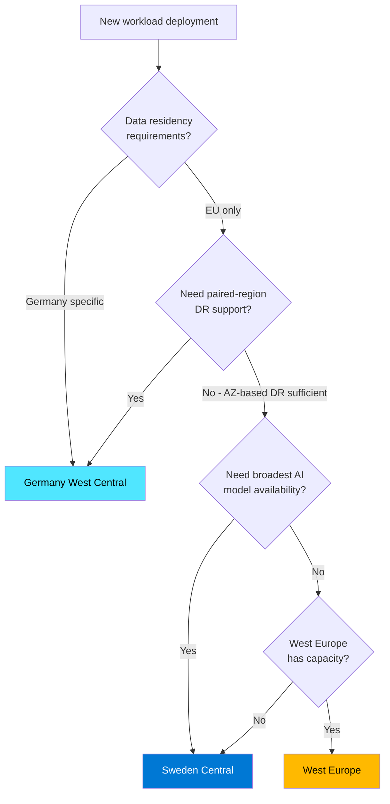
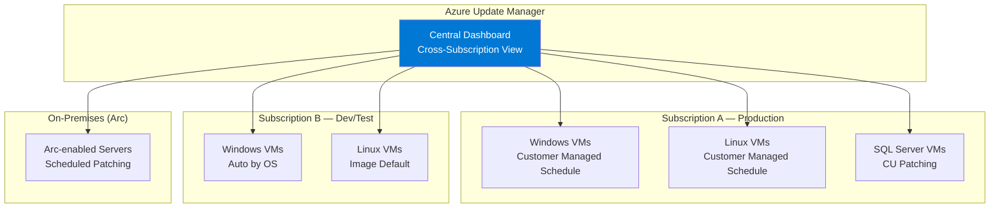
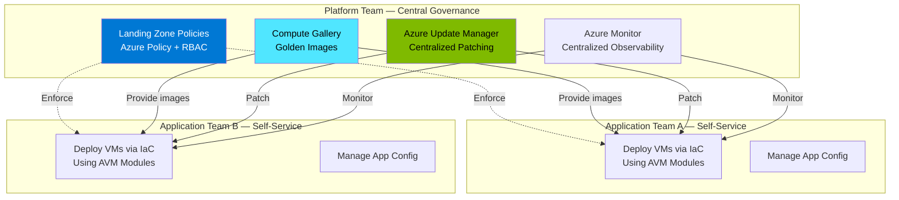

# General Platform & Infrastructure — Consolidated Enterprise Guidance

**Prepared by:** Microsoft Cloud Solution Architecture  
**Date:** April 2026  
**Audience:** Enterprise Infrastructure, Cloud Platform & Operations Teams  
**Context:** Enterprise Scale Landing Zone, Regional Expansion, VM Management

---

## Table of Contents

1. [Executive Summary](#1-executive-summary)
2. [Question 1 — West Europe Capacity Constraints & Enabling Sweden / Germany Regions](#2-question-1--west-europe-capacity-constraints--enabling-sweden--germany-regions)
3. [Question 2 — Azure Update Manager for Bulk VM Management](#3-question-2--azure-update-manager-for-bulk-vm-management)
4. [Question 3 — PostgreSQL & App Service Deployment Issues in Constrained Regions](#4-question-3--postgresql--app-service-deployment-issues-in-constrained-regions)
5. [Question 4 — Region-of-Choice Recovery Services Vault](#5-question-4--region-of-choice-recovery-services-vault)
6. [Question 5 — Modern IaaS & Automated VM Deployment in Enterprise Scale](#6-question-5--modern-iaas--automated-vm-deployment-in-enterprise-scale)
7. [Comparison Table — EU Region Capabilities](#7-comparison-table--eu-region-capabilities)
8. [Gaps & Limitations](#8-gaps--limitations)
9. [Recommended Actions](#9-recommended-actions)
10. [Microsoft Learn Reference Links](#10-microsoft-learn-reference-links)

---

## 1. Executive Summary

This document addresses remaining infrastructure and platform questions from enterprise engagements, covering regional capacity planning, VM bulk management, PaaS deployment constraints, and backup vault enhancements.

| Topic | Status | Key Message |
|---|---|---|
| **West Europe capacity** | Constrained for some services/SKUs | Quota increases possible; consider expanding to Sweden Central / Germany West Central |
| **Azure Update Manager** | GA | Replaces the deprecated Azure Automation Update Management; covers bulk VM patching |
| **PostgreSQL / App Service issues in constrained regions** | Service-specific | SKU and resource type availability varies by region; mitigation strategies available |
| **Region-of-choice RSV** | In development | Cross-region restore to non-paired regions is being worked on; no firm public GA date |

---

## 2. Question 1 — West Europe Capacity Constraints & Enabling Sweden / Germany Regions

### Customer Question
> *"We are facing capacity constraints in West Europe for various Azure services. What are the options for expanding to Sweden Central and Germany West Central?"*

### Understanding Azure Regional Capacity

Azure capacity is managed at multiple levels:

| Level | Description | Customer Control |
|---|---|---|
| **Subscription quotas** | vCPU, resource count limits per subscription per region | Request increase via Azure Portal |
| **Regional capacity** | Physical hardware (GPU, CPU) availability in a region | Microsoft-managed; can sell out |
| **Service-specific limits** | SKU availability per service per region | Check service documentation |

### West Europe — Known Constraints

West Europe is one of Azure's most popular regions and can experience:

- **vCPU quota limits** — particularly for high-demand VM families (Dv5, Ev5, GPU SKUs)
- **Specific service SKU unavailability** — some newer SKUs may not be available or may have wait times
- **PaaS service deployment delays** — PostgreSQL Flexible Server, App Service plans in constrained clusters

### How to Request Quota Increases

1. **Azure Portal:** Go to **Subscriptions** → select subscription → **Usage + quotas** → **Request increase**
2. **Support request:** If portal quota increase is denied, submit a support ticket with business justification
3. **Programmatic:** Use the Quotas REST API or Azure CLI

> **Reference:** [Increase regional vCPU quotas](https://learn.microsoft.com/azure/quotas/regional-quota-requests)

### Enabling Sweden Central & Germany West Central

Both regions are well-suited for EU enterprise expansion:

| Feature | Sweden Central | Germany West Central |
|---|---|---|
| **Availability Zones** | ✅ (3 zones) | ✅ (3 zones) |
| **Paired region** | Sweden South (restricted-access) | Germany North (restricted-access) |
| **Azure SQL** | Full support, zone redundancy | Full support, zone redundancy |
| **PostgreSQL Flexible** | ✅ | ✅ |
| **AKS** | ✅ | ✅ |
| **App Service** | ✅ | ✅ |
| **Azure OpenAI** | ✅ (broadest EU model support) | ✅ |
| **Azure Backup CRR** | ✅ (to Sweden South — passive) | ✅ (to Germany North) |
| **Key Vault auto-replication** | ✅ (to Sweden South — passive/read-only failover) | ✅ (to Germany North) |
| **Storage GRS** | ✅ (to Sweden South) | ✅ (to Germany North) |
| **Active DR (deploy workloads in pair)** | ❌ Sweden South is restricted — use another region | ⚠️ Germany North is restricted — request access or use another region |
| **ExpressRoute** | Supported | Supported |
| **Azure Firewall** | ✅ | ✅ |
| **Azure Front Door** | Global (region-agnostic) | Global (region-agnostic) |

> **Key Nuance:** Both Sweden Central and Germany West Central ARE paired — but their paired regions (Sweden South, Germany North) are restricted-access. This means **passive replication** (GRS, Key Vault, Backup CRR) works automatically, but you **cannot create new resources** in the paired region without special access. For active DR, use an unrestricted region.

### Networking Considerations for Regional Expansion

When enabling new regions, the networking team must address:

| Task | Description | Priority |
|---|---|---|
| **VNet provisioning** | Deploy hub-spoke or Virtual WAN topology in new region | P0 |
| **ExpressRoute / VPN** | Extend connectivity from on-premises to new region | P0 |
| **DNS** | Configure private DNS zones and conditional forwarding | P0 |
| **NSG / Firewall rules** | Replicate security policies from West Europe | P0 |
| **Private endpoints** | Create PEs for PaaS services in new region | P1 |
| **Traffic routing** | Configure Azure Front Door / Traffic Manager for multi-region | P1 |
| **IP address planning** | Ensure non-overlapping CIDR ranges | P0 |

### Decision Framework — When to Use Which Region



---

## 3. Question 2 — Azure Update Manager for Bulk VM Management

### Customer Question
> *"What is the current status of Microsoft's VM Manager feature for bulk VM management, including patching and configuration?"*

### Answer: Azure Update Manager (GA)

Azure Update Manager is the **GA** replacement for the deprecated Azure Automation Update Management. It is the primary tool for bulk VM patching and management.

### Key Capabilities

| Feature | Description |
|---|---|
| **Unified dashboard** | Monitor update compliance across Windows and Linux VMs from a single pane |
| **Scheduled patching** | Define maintenance windows with customer-managed schedules |
| **On-demand updates** | Trigger patches immediately on one or many VMs |
| **Periodic assessments** | Automatic 24-hour compliance checks |
| **Cross-subscription** | Manage VMs across multiple subscriptions from a central location |
| **Azure Arc support** | Patch on-premises and multi-cloud VMs connected via Azure Arc |
| **SQL Server patching** | Automated Cumulative Update installation for SQL Server on Azure VMs |
| **Hotpatching** | Install critical security updates **without reboot** (Windows Server Azure Edition) |
| **Dynamic scoping** | Group machines by tags, resource groups, or subscriptions for targeted patching |
| **RBAC** | Granular per-resource access control |
| **Reporting & alerts** | Custom dashboards, update status alerts |

### Azure Update Manager vs Legacy Solutions

| Feature | Azure Update Manager (GA) | Azure Automation Update Mgmt (Deprecated) | SCCM / ConfigMgr |
|---|---|---|---|
| **Azure-native** | ✅ | ✅ | Requires on-prem infrastructure |
| **No Log Analytics dependency** | ✅ | ❌ (required LA workspace) | N/A |
| **Arc support** | ✅ | ✅ | Limited |
| **Hotpatching** | ✅ | ❌ | ❌ |
| **Cross-subscription** | ✅ | Limited | Complex |
| **SQL Server CU patching** | ✅ | ❌ | Manual |
| **Maintenance schedules** | ✅ (maintenance configurations) | ✅ | ✅ |
| **Cost** | Free (no additional charge) | Free (LA charges apply) | License required |

### How to Get Started

```bash
# Check update compliance for a VM
az vm assess-patches --resource-group myRG --name myVM

# Install updates on a VM
az vm install-patches \
  --resource-group myRG \
  --name myVM \
  --maximum-duration PT2H \
  --reboot-setting IfRequired \
  --classifications-to-include Critical Security

# Create a maintenance configuration for scheduled patching
az maintenance configuration create \
  --resource-group myRG \
  --name weekly-patches \
  --maintenance-scope InGuestPatch \
  --location westeurope \
  --recur-every "Week Saturday" \
  --start-date-time "2026-05-01 02:00" \
  --duration "03:00" \
  --time-zone "W. Europe Standard Time"
```

### Enterprise Deployment Model



> **Reference:** [What is Azure Update Manager?](https://learn.microsoft.com/azure/update-manager/overview)  
> **Reference:** [Manage multiple machines](https://learn.microsoft.com/azure/update-manager/manage-multiple-machines)  
> **Reference:** [Cross-subscription patching](https://learn.microsoft.com/azure/update-manager/cross-subscription-patching)  
> **Reference:** [Azure Update Manager for SQL Server VMs](https://learn.microsoft.com/azure/azure-sql/virtual-machines/azure-update-manager-sql-vm)

> **Note on "VM Manager":** The term "VM Manager" was referenced in the meeting as an upcoming feature for bulk VM lifecycle management beyond patching (configuration, deployment automation). Azure Update Manager handles patching; for broader VM lifecycle management, consider:
> - **Azure Automanage** — automated best-practice VM configuration
> - **Azure Compute Fleet** — deploy VMs across SKUs and regions at scale
> - **Azure Policy Guest Configuration** — enforce VM configuration compliance
>
> A unified "VM Manager" feature beyond these capabilities may be in early planning. Confirm with your Microsoft account team for roadmap details.

---

## 4. Question 3 — PostgreSQL & App Service Deployment Issues in Constrained Regions

### Customer Question
> *"Teams are experiencing deployment issues with PostgreSQL Flexible Server and App Service in West Europe."*

### Root Cause: Regional Capacity Constraints

West Europe is a high-demand region. Specific services may experience:

| Issue | Cause | Mitigation |
|---|---|---|
| **PostgreSQL Flexible Server creation fails** | Insufficient hardware in availability zone | Try a different AZ, or deploy in Sweden Central / Germany West Central |
| **App Service Plan creation fails** | Specific SKU not available in requested cluster | Use a different SKU tier (e.g., Pv3 instead of Pv2) or different region |
| **Scale-out failures** | Not enough instances available for the plan's SKU | Pre-scale during off-peak; use zone-redundant configuration |
| **Specific VM SKU unavailable** | Hardware sold out in region | Request quota increase; consider alternative SKU family |

### Practical Mitigations

#### PostgreSQL Flexible Server

1. **Try different availability zone:** If zone 1 fails, try zone 2 or 3
2. **Use Burstable tier temporarily:** If General Purpose SKU is constrained
3. **Deploy in Sweden Central:** Full PostgreSQL Flexible Server support with zone redundancy
4. **Enable geo-redundant backup:** For cross-region recovery without deploying a secondary server

```bash
# Create PostgreSQL Flexible Server in Sweden Central
az postgres flexible-server create \
  --resource-group myRG \
  --name myserver \
  --location swedencentral \
  --sku-name Standard_D4ds_v5 \
  --tier GeneralPurpose \
  --high-availability ZoneRedundant \
  --geo-redundant-backup Enabled
```

#### App Service

1. **Use newer App Service Plan SKUs:** Pv3 (Premium v3) has better availability than Pv2
2. **Deploy zone-redundant plans:** Distributes across AZs for resilience
3. **Consider App Service Environment v3:** Dedicated capacity in your VNet
4. **Multi-region deployment:** Deploy in 2 regions with Azure Front Door

> **Reference:** [App Service Plan pricing tiers](https://learn.microsoft.com/azure/app-service/overview-hosting-plans)  
> **Reference:** [PostgreSQL Flexible Server HA](https://learn.microsoft.com/azure/postgresql/flexible-server/concepts-high-availability)

---

## 5. Question 4 — Region-of-Choice Recovery Services Vault

### Customer Question
> *"Microsoft is developing a region-of-choice recovery service vault option. What is the status and how can we participate?"*

### Current Status

Azure Backup currently supports **Cross-Region Restore (CRR)** only to the **paired region** for vaults configured with GRS. For Sweden Central, this means CRR targets Sweden South (restricted-access), which works for passive restore but does not allow deploying active workloads.

### What's Changing

Microsoft is working on enhancements to allow:

| Enhancement | Description | Status |
|---|---|---|
| **Cross-Region Restore to non-paired regions** | Restore backups to a region of your choice, not just the paired region | In development — no public GA date |
| **Backup Vault improvements** | Expanded workload support (AKS, Blobs, Disks) with more flexible region targeting | Ongoing |
| **Private preview** | Some customers may be able to join private preview programs | Check with Microsoft account team |

### Current Workarounds

| Scenario | Workaround |
|---|---|
| **VMs in Sweden Central** | GRS vault with CRR to Sweden South for passive restore; use Azure Site Recovery for active failover to West Europe or Germany West Central |
| **SQL in VM** | Configure Azure Backup CRR to Sweden South; use SQL native log shipping for active DR to another region |
| **AKS** | AKS Backup Vault tier supports CRR to paired region (Sweden South); use GitOps + AKS Backup for cross-region recovery to unrestricted regions |
| **Azure Files** | Use Azure Backup with GRS vault; CRR to Sweden South |

> **Clarification:** Sweden Central IS paired with Sweden South (restricted-access). Passive backup/restore and CRR to Sweden South should work. The gap is specifically about restoring to an **arbitrary region of choice** (not just the paired region) and about deploying **active workloads** in the paired region (since Sweden South is restricted).

---

## 6. Question 5 — Modern IaaS & Automated VM Deployment in Enterprise Scale

### Customer Question
> *"We are building a Modern IaaS program to automate VM deployment into our enterprise scale landing zone and decentralize VM management. What Azure capabilities support this, and are there reference implementations?"*

### Azure Capabilities for Automated VM Deployment at Scale

| Capability | Description | Maturity |
|---|---|---|
| **Azure Landing Zone Accelerator** | Pre-built IaC (Bicep/Terraform) to deploy enterprise-scale landing zones with governance, networking, and identity | GA — well-established |
| **Azure Verified Modules (AVM)** | Standardized, tested Bicep/Terraform modules for VM deployment with best practices baked in | GA |
| **Azure Compute Gallery** | Centralized image management — golden images, versioning, replication across regions | GA |
| **Azure Image Builder** | Automate custom VM image creation and patching | GA |
| **Azure Update Manager** | Centralized patch management across subscriptions, regions, and Arc-connected servers | GA |
| **Azure Automanage** | Automated VM best-practice configuration (backup, monitoring, security, updates) | GA |
| **Azure Policy (Guest Configuration)** | Enforce and audit VM configuration compliance (machine configuration) | GA |
| **Azure Deployment Environments** | Self-service infrastructure provisioning with governance guardrails | GA |
| **Subscription vending** | Automated subscription creation with landing zone policies pre-applied | Pattern — via IaC |

### Decentralized VM Management Model

For enterprise scale, Microsoft recommends a **platform team + application team** model:



### Reference Implementations

| Resource | Description | URL |
|---|---|---|
| **Azure Landing Zone Accelerator (Bicep)** | Enterprise-scale reference implementation | https://learn.microsoft.com/azure/cloud-adoption-framework/ready/landing-zone/ |
| **Azure Verified Modules** | Standardized IaC modules including VM modules | https://aka.ms/avm |
| **CAF — Platform Landing Zones** | Architecture guidance for platform teams | https://learn.microsoft.com/azure/cloud-adoption-framework/ready/landing-zone/design-area/platform-landing-zone |
| **Subscription Vending** | Automate subscription provisioning | https://learn.microsoft.com/azure/cloud-adoption-framework/ready/landing-zone/design-area/subscription-vending |
| **Azure Compute Gallery** | Shared image gallery for VM golden images | https://learn.microsoft.com/azure/virtual-machines/shared-image-galleries |
| **Azure Image Builder** | Automate VM image creation | https://learn.microsoft.com/azure/virtual-machines/image-builder-overview |
| **Azure Automanage** | Automated VM best practices | https://learn.microsoft.com/azure/automanage/overview-about |

> **Note:** Multiple enterprise customers have implemented similar Modern IaaS programs using Azure Landing Zone Accelerator + Azure Verified Modules + Compute Gallery. The Cloud Adoption Framework (CAF) provides detailed guidance for this pattern. Engage your Microsoft CSA for reference architecture reviews and lessons learned from similar deployments.

---

## 7. Comparison Table — EU Region Capabilities

| Capability | West Europe | Sweden Central | Germany West Central |
|---|---|---|---|
| **Availability Zones** | ✅ (3) | ✅ (3) | ✅ (3) |
| **Paired Region** | North Europe | Sweden South (restricted) | Germany North (restricted) |
| **Azure SQL (zone-redundant)** | ✅ | ✅ | ✅ |
| **PostgreSQL Flexible** | ✅ | ✅ | ✅ |
| **AKS** | ✅ | ✅ | ✅ |
| **App Service** | ✅ | ✅ | ✅ |
| **Azure OpenAI (latest models)** | ✅ | ✅ | ✅ |
| **Responses API / Agent Service** | ❌ | ✅ | ✅ |
| **Azure Backup CRR** | ✅ (to North Europe) | ✅ (to Sweden South — passive) | ✅ (to Germany North) |
| **Key Vault auto-replication** | ✅ (to North Europe) | ✅ (to Sweden South — read-only failover) | ✅ (to Germany North) |
| **Storage GRS** | ✅ (to North Europe) | ✅ (to Sweden South) | ✅ (to Germany North) |
| **Azure Site Recovery** | ✅ (any region) | ✅ (any region) | ✅ (any region) |
| **ExpressRoute** | ✅ | ✅ | ✅ |
| **Managed VNet (Foundry)** | ✅ (preview) | ✅ (preview) | ✅ (preview) |
| **Azure Update Manager** | ✅ | ✅ | ✅ |
| **Evaluations (AI)** | ✅ | ✅ | ✅ |
| **Capacity risk** | ⚠️ High demand | Lower demand | Moderate demand |

---

## 8. Gaps & Limitations

| Gap | Impact | Mitigation | Status |
|---|---|---|---|
| **West Europe capacity constraints** | Deployment failures for some PaaS services | Expand to Sweden Central / Germany West Central | Ongoing — Microsoft adding capacity |
| **Sweden Central / Germany West Central — restricted-access paired regions** | Cannot deploy active workloads in paired region (Sweden South / Germany North) | Passive replication (GRS, Key Vault, CRR) works automatically; for active DR use unrestricted region | By design — documented in Azure regions list |
| **Region-of-choice RSV** | Cannot restore backups to arbitrary (non-paired) regions | CRR to paired region works; for other regions use ASR or native replication | In development — no public ETA |
| **"VM Manager" feature** | No single tool for full VM lifecycle management | Use Azure Update Manager + Automanage + Policy | AUM covers patching; broader tooling evolving |
| **No proactive capacity notifications** | Customers discover constraints at deployment time | Check quotas before deployment; request increases proactively | Feature gap |

---

## 9. Recommended Actions

### Immediate

| # | Action | Owner | Priority |
|---|---|---|---|
| 1 | Request **quota increases** for West Europe (vCPU, PaaS) via Azure Portal | Platform Team | P0 |
| 2 | Begin **network provisioning** in Sweden Central and Germany West Central | Networking Team | P0 |
| 3 | Deploy **Azure Update Manager** for all Azure VMs and Arc-enabled servers | Operations Team | P1 |
| 4 | Create **maintenance configurations** for scheduled patching with maintenance windows | Operations Team | P1 |

### Short-Term

| # | Action | Owner | Priority |
|---|---|---|---|
| 5 | Migrate constrained **PostgreSQL / App Service** workloads to Sweden Central | App Teams | P1 |
| 6 | Deploy **Azure Site Recovery** for VM DR between West Europe and Sweden Central | BCDR Lead | P1 |
| 7 | Engage Microsoft for **region-of-choice RSV** private preview | Microsoft CSA | P2 |

### Medium-Term

| # | Action | Owner | Priority |
|---|---|---|---|
| 8 | Establish **multi-region deployment standard** (West Europe + Sweden Central minimum) | Platform Team | P2 |
| 9 | Evaluate **Azure Automanage** for automated VM best-practice configuration | Operations Team | P2 |
| 10 | Define **workload placement policy** based on region capabilities matrix | Architecture Team | P2 |

---

## 10. Microsoft Learn Reference Links

### Regional Capacity & Quotas

| Topic | URL |
|---|---|
| Increase regional vCPU quotas | https://learn.microsoft.com/azure/quotas/regional-quota-requests |
| Azure region pairs and non-paired regions | https://learn.microsoft.com/azure/reliability/regions-paired |
| Azure global infrastructure — products by region | https://azure.microsoft.com/explore/global-infrastructure/products-by-region/ |

### Azure Update Manager

| Topic | URL |
|---|---|
| What is Azure Update Manager? | https://learn.microsoft.com/azure/update-manager/overview |
| Manage multiple machines | https://learn.microsoft.com/azure/update-manager/manage-multiple-machines |
| Cross-subscription patching | https://learn.microsoft.com/azure/update-manager/cross-subscription-patching |
| Update Manager for SQL Server VMs | https://learn.microsoft.com/azure/azure-sql/virtual-machines/azure-update-manager-sql-vm |
| Scheduled patching | https://learn.microsoft.com/azure/update-manager/scheduled-patching |
| Migrate from Automation Update Mgmt | https://learn.microsoft.com/azure/update-manager/guidance-migration-azure |

### PostgreSQL & App Service

| Topic | URL |
|---|---|
| PostgreSQL Flexible Server — HA concepts | https://learn.microsoft.com/azure/postgresql/flexible-server/concepts-high-availability |
| PostgreSQL Flexible Server — Backup & restore | https://learn.microsoft.com/azure/postgresql/flexible-server/concepts-backup-restore |
| App Service — Hosting plans overview | https://learn.microsoft.com/azure/app-service/overview-hosting-plans |
| App Service — Multi-region DR | https://learn.microsoft.com/azure/architecture/web-apps/guides/multi-region-app-service/multi-region-app-service |

### Azure Backup & DR

| Topic | URL |
|---|---|
| Azure Backup — Cross-Region Restore | https://learn.microsoft.com/azure/backup/backup-create-rs-vault#set-cross-region-restore |
| Azure Site Recovery — Global DR | https://learn.microsoft.com/azure/site-recovery/azure-to-azure-enable-global-disaster-recovery |
| Reliability in Azure Backup | https://learn.microsoft.com/azure/reliability/reliability-backup |

### VM Management & Governance

| Topic | URL |
|---|---|
| Azure Automanage | https://learn.microsoft.com/azure/automanage/overview-about |
| Azure Policy Guest Configuration | https://learn.microsoft.com/azure/governance/machine-configuration/overview |
| Azure Compute Fleet | https://learn.microsoft.com/azure/azure-compute-fleet/overview |

---

*Document prepared based on Microsoft Learn documentation as of April 2026. Service availability and regional capacity evolve continuously — always verify against the latest [Azure products by region](https://azure.microsoft.com/explore/global-infrastructure/products-by-region/) page.*
