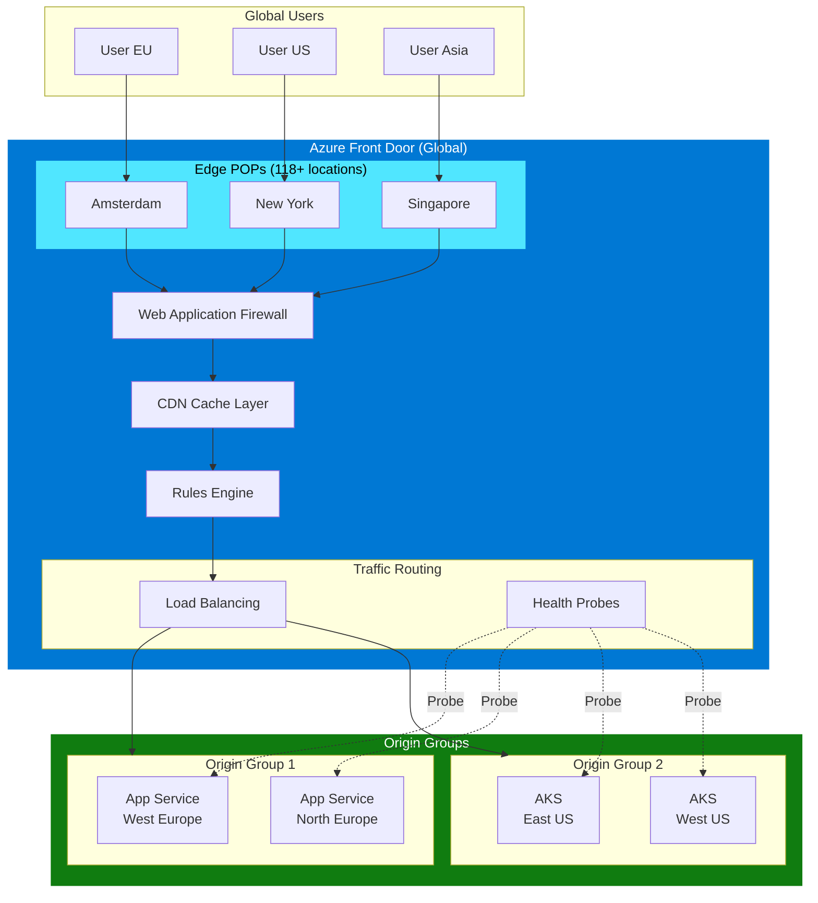
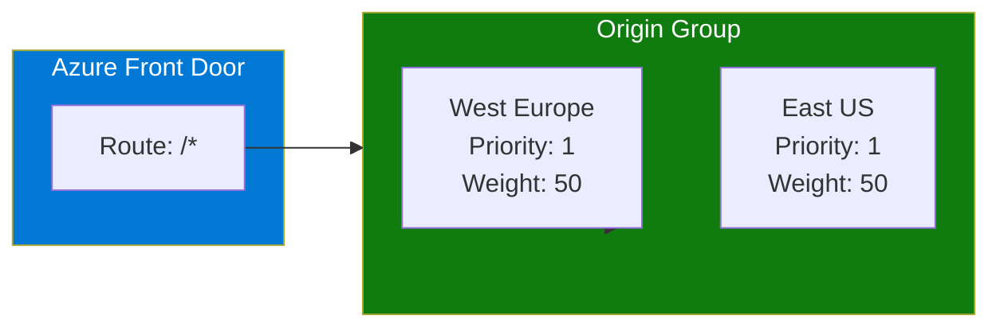
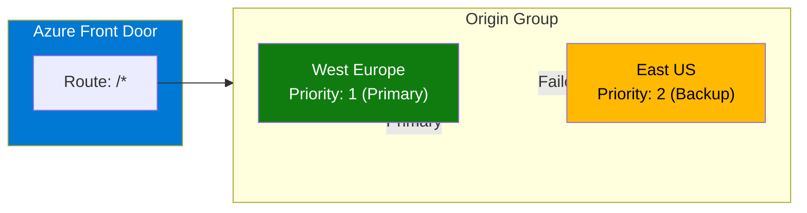
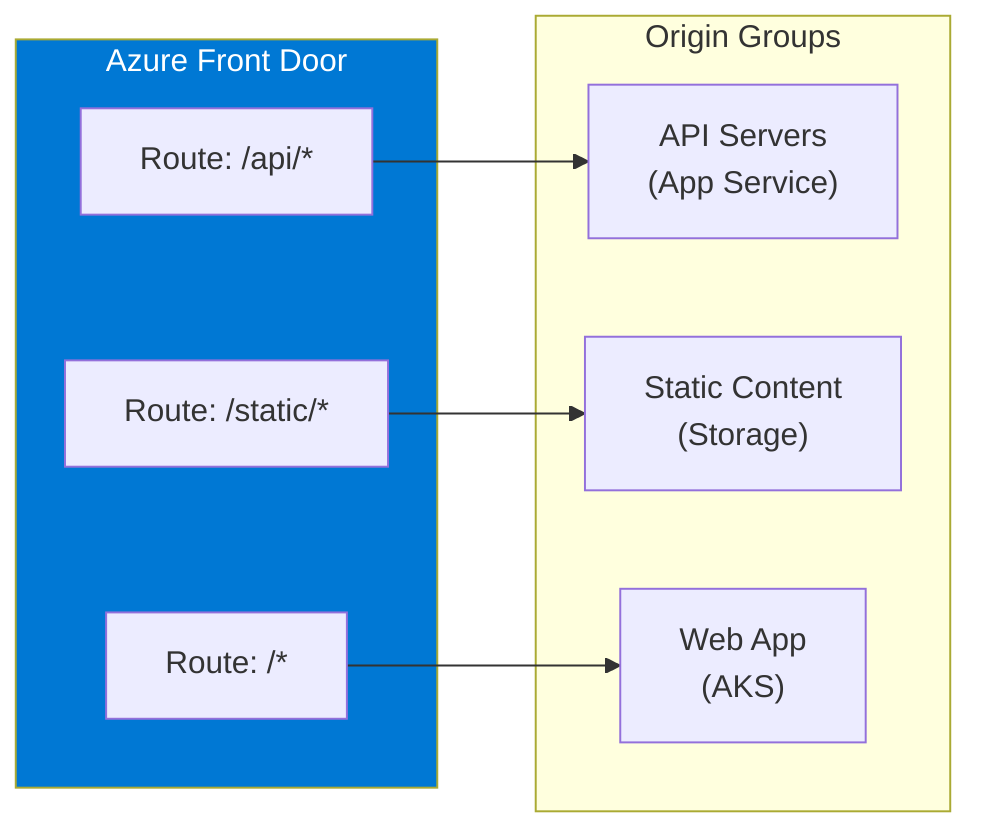
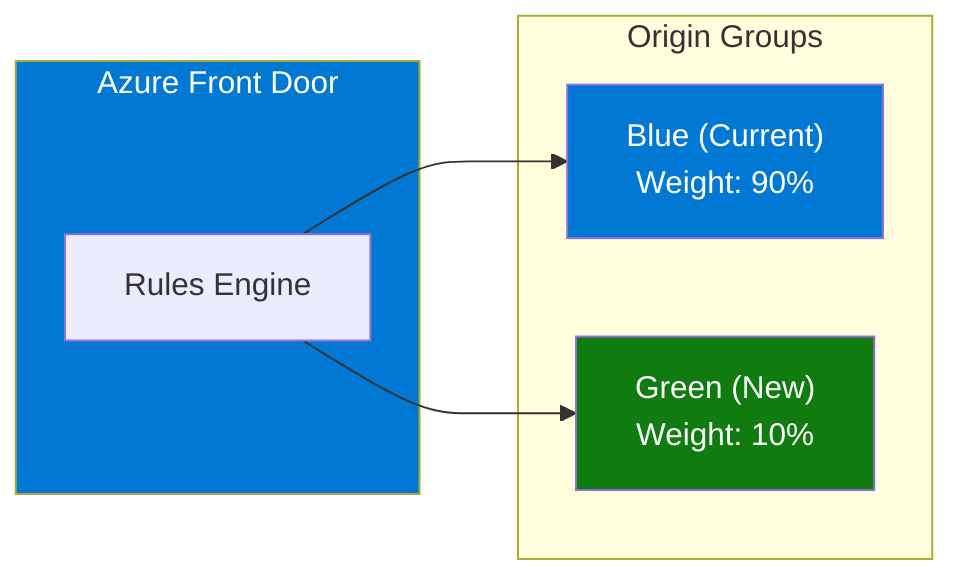

# 01 - Architecture Overview

> Core concepts, deployment patterns, and architectural decisions for Azure Front Door

---

## 📊 Azure Front Door Architecture

---

## 🏗️ Core Concepts

### Endpoints
A Front Door **endpoint** is the entry point for your application traffic. Each endpoint has a unique hostname (e.g., `myapp.azurefd.net`).

### Custom Domains
Map your own domain names (e.g., `www.contoso.com`) to Front Door endpoints with automatic or custom TLS certificates.

### Origin Groups
A logical grouping of origins that receive traffic. Configure:
- **Health probes** for monitoring
- **Load balancing** settings (latency, priority, weight)

### Origins
Backend servers that serve your content:
- App Service, Functions
- AKS, Container Apps
- Storage Accounts
- Application Gateway
- Custom hosts (on-premises, other clouds)

### Routes
Define how traffic flows from endpoints to origin groups:
- Path patterns (`/api/*`, `/static/*`)
- Protocols (HTTP, HTTPS)
- Caching rules

### Rules Engine
Apply transformations and routing logic:
- URL rewrite
- Header manipulation
- Origin group override

---

## 📐 Deployment Patterns

### Pattern 1: Active-Active Multi-Region

**Configuration:**
- Both origins with **Priority: 1** (same priority)
- **Weight: 50** each (equal distribution)
- **Latency sensitivity: 50ms** (route to fastest within range)

**Use Case:** Maximum availability, load distribution across regions.

---

### Pattern 2: Active-Passive (Failover)

**Configuration:**
- Primary origin with **Priority: 1**
- Backup origin with **Priority: 2**
- Health probes detect primary failure → automatic failover

**Use Case:** Cost optimization, DR scenarios.

---

### Pattern 3: Path-Based Routing

**Use Case:** Microservices, separating static/dynamic content.

---

### Pattern 4: Blue-Green Deployment

**Configuration:**
- Use **weighted routing** for gradual traffic shift
- Start with 90/10, gradually move to 0/100
- Rollback by adjusting weights

**Use Case:** Zero-downtime deployments, canary releases.

---

## 🔧 Key Configuration Decisions

| Decision | Options | Recommendation |
|----------|---------|----------------|
| **Tier** | Standard / Premium | Premium for Private Link & managed WAF |
| **Routing Method** | Priority / Weight / Latency | Combine based on use case |
| **Session Affinity** | Enabled / Disabled | Disable for reliability |
| **Caching** | Enabled / Disabled per route | Enable for static content |
| **WAF Mode** | Detection / Prevention | Start Detection, move to Prevention |
| **TLS Version** | 1.0, 1.1, 1.2, 1.3 | Minimum TLS 1.2 |

---

## 📋 Tier Comparison

| Capability | Standard | Premium |
|------------|----------|---------|
| **Monthly Base Fee** | $35 | $330 |
| **Global Load Balancing** | ✅ | ✅ |
| **SSL Offloading** | ✅ | ✅ |
| **Custom Domains** | ✅ | ✅ |
| **Compression** | ✅ | ✅ |
| **Caching** | ✅ | ✅ |
| **Rules Engine** | ✅ | ✅ |
| **Custom WAF Rules** | ✅ | ✅ |
| **Managed WAF Rules (OWASP)** | ❌ | ✅ |
| **Bot Protection** | ❌ | ✅ |
| **Private Link to Origins** | ❌ | ✅ |
| **Enhanced Reports** | ❌ | ✅ |

---

## 🔗 References

| Resource | Link |
|----------|------|
| **WAF Service Guide** | [Architecture best practices](https://learn.microsoft.com/azure/well-architected/service-guides/azure-front-door) |
| **Routing Methods** | [Traffic routing methods](https://learn.microsoft.com/azure/frontdoor/routing-methods) |
| **Origins & Groups** | [Origins and origin groups](https://learn.microsoft.com/azure/frontdoor/origin) |

---

*Next: [02 - Reliability](02-reliability.md)*
