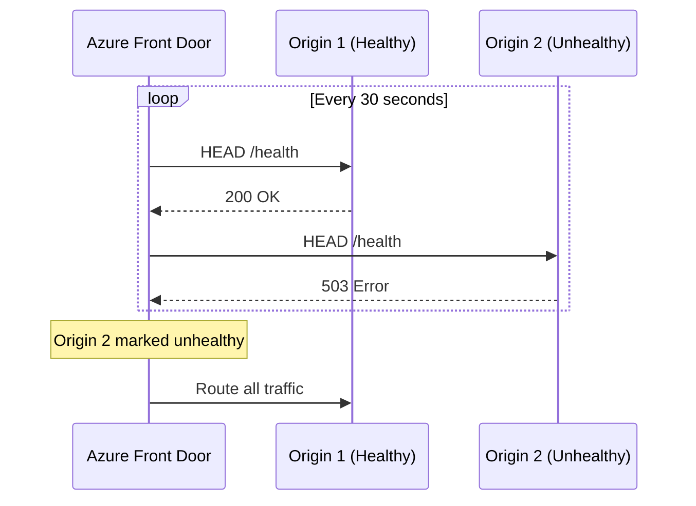
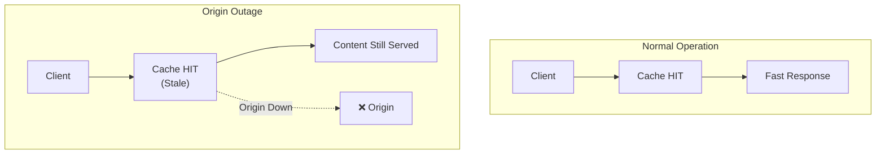
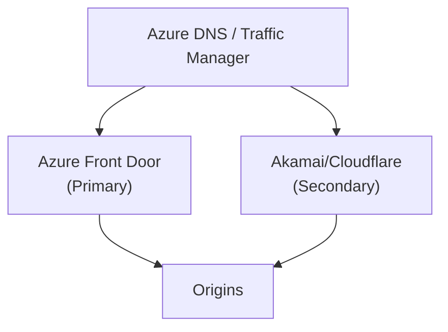

# 02 - Reliability

> High availability, failover strategies, and health monitoring for Azure Front Door

[](https://learn.microsoft.com/azure/well-architected/reliability/)

---

## 🎯 Reliability Design Principles

| Principle | Front Door Implementation |
|-----------|---------------------------|
| **Design for failure** | Multi-origin groups, health probes, automatic failover |
| **Reduce single points of failure** | Global anycast, multiple POPs, redundant origins |
| **Test recovery procedures** | Simulate origin failures, validate failover |
| **Monitor health continuously** | Health probes, alerts, diagnostic logs |

---

## ✅ Design Checklist

| # | Recommendation | Priority |
|---|----------------|----------|
| 1 | Deploy origins in multiple regions | 🔴 Critical |
| 2 | Configure health probes for all origins | 🔴 Critical |
| 3 | Use appropriate routing method (Active-Active or Active-Passive) | 🔴 Critical |
| 4 | Set request timeouts appropriately | 🟡 High |
| 5 | Use same hostname on Front Door and origins | 🟡 High |
| 6 | Disable session affinity for high reliability | 🟡 High |
| 7 | Enable caching to serve during origin outages | 🟢 Medium |
| 8 | Consider redundant traffic management for mission-critical | 🟢 Medium |

---

## 📊 Health Probes

### How Health Probes Work



### Health Probe Configuration

```bicep
resource originGroup 'Microsoft.Cdn/profiles/originGroups@2023-05-01' = {
  name: 'og-api'
  parent: frontDoor
  properties: {
    healthProbeSettings: {
      probePath: '/health'           // Custom health endpoint
      probeProtocol: 'Https'         // Match your origin protocol
      probeRequestType: 'HEAD'       // HEAD is lighter than GET
      probeIntervalInSeconds: 30     // Balance between detection speed and load
    }
    loadBalancingSettings: {
      sampleSize: 4                  // Number of samples to evaluate
      successfulSamplesRequired: 3   // Healthy if 3 of 4 succeed
      additionalLatencyInMilliseconds: 50  // Latency sensitivity
    }
  }
}
```

### Health Probe Best Practices

| Setting | Recommendation | Reason |
|---------|----------------|--------|
| **Probe Path** | `/health` or `/api/health` | Dedicated endpoint that checks dependencies |
| **Request Type** | `HEAD` | Less overhead than `GET` |
| **Interval** | 30 seconds (default) | Lower = faster detection but more load |
| **Sample Size** | 4 | Avoid false positives from transient failures |
| **Success Required** | 3 of 4 | 75% success rate = healthy |

---

## 🔄 Routing for Reliability

### Active-Active Configuration

```bicep
// Origin 1: West Europe
resource origin1 'Microsoft.Cdn/profiles/originGroups/origins@2023-05-01' = {
  name: 'origin-westeurope'
  parent: originGroup
  properties: {
    hostName: 'app-westeurope.azurewebsites.net'
    priority: 1      // Same priority = active-active
    weight: 1000     // Equal weight = equal distribution
    enabledState: 'Enabled'
  }
}

// Origin 2: East US
resource origin2 'Microsoft.Cdn/profiles/originGroups/origins@2023-05-01' = {
  name: 'origin-eastus'
  parent: originGroup
  properties: {
    hostName: 'app-eastus.azurewebsites.net'
    priority: 1      // Same priority
    weight: 1000     // Equal weight
    enabledState: 'Enabled'
  }
}
```

### Active-Passive Configuration

```bicep
// Primary Origin
resource originPrimary 'Microsoft.Cdn/profiles/originGroups/origins@2023-05-01' = {
  name: 'origin-primary'
  parent: originGroup
  properties: {
    hostName: 'app-primary.azurewebsites.net'
    priority: 1      // Primary
    weight: 1000
    enabledState: 'Enabled'
  }
}

// Backup Origin
resource originBackup 'Microsoft.Cdn/profiles/originGroups/origins@2023-05-01' = {
  name: 'origin-backup'
  parent: originGroup
  properties: {
    hostName: 'app-backup.azurewebsites.net'
    priority: 2      // Only used when priority 1 fails
    weight: 1000
    enabledState: 'Enabled'
  }
}
```

---

## ⏱️ Timeouts

### Request Timeout Configuration

```bicep
resource route 'Microsoft.Cdn/profiles/afdEndpoints/routes@2023-05-01' = {
  name: 'default-route'
  parent: endpoint
  properties: {
    originGroup: { id: originGroup.id }
    forwardingProtocol: 'HttpsOnly'
    // Default origin response timeout: 60 seconds
    // Adjust based on your origin's response time
  }
}
```

### Timeout Recommendations

| Scenario | Timeout | Notes |
|----------|---------|-------|
| **API endpoints** | 30-60 seconds | Default is usually fine |
| **File downloads** | 120+ seconds | Increase for large files |
| **Long-running operations** | Avoid | Use async patterns instead |

> ⚠️ **Warning:** Long timeouts consume resources. Prefer async patterns for long-running operations.

---

## 🏷️ Host Name Preservation

### Problem: Host Name Mismatch


**Issues:**
- Cookies set for wrong domain
- Redirects point to internal hostname
- OAuth callbacks fail

### Solution: Preserve Host Header

```bicep
resource origin 'Microsoft.Cdn/profiles/originGroups/origins@2023-05-01' = {
  name: 'origin-app'
  parent: originGroup
  properties: {
    hostName: 'app.azurewebsites.net'
    originHostHeader: 'api.contoso.com'  // Send original host header
    // ...
  }
}
```

---

## 🚫 Session Affinity

### Reliability Impact

| With Session Affinity | Without Session Affinity |
|----------------------|--------------------------|
| User "stuck" to one origin | Requests distributed across origins |
| Origin failure = user disruption | Seamless failover |
| Uneven load distribution | Even load distribution |
| ❌ **Not recommended** | ✅ **Recommended** |

### Recommendation

```bicep
resource originGroup 'Microsoft.Cdn/profiles/originGroups@2023-05-01' = {
  name: 'og-api'
  parent: frontDoor
  properties: {
    sessionAffinityState: 'Disabled'  // Recommended for reliability
    // ...
  }
}
```

> 💡 **If you need session affinity:** Design your application to handle graceful session recovery when the origin changes.

---

## 🛡️ Caching for Reliability

Caching provides **reliability benefits** beyond performance:



**Benefits:**
- Serve cached content during origin outages
- Reduce load on origins (fewer requests to fail)
- Absorb traffic spikes

---

## 🔁 Redundant Traffic Management (Mission-Critical)

For **mission-critical workloads**, consider redundant global load balancers:



> ⚠️ **Consider carefully:** This adds significant complexity and cost. Only for workloads with near-zero tolerance for downtime.

| Scenario | Recommendation |
|----------|----------------|
| Standard web app | Single Front Door instance |
| Mission-critical (99.99%+) | Consider redundant CDN |
| Content delivery only | [Global content delivery pattern](https://learn.microsoft.com/azure/architecture/guide/networking/global-web-applications/mission-critical-content-delivery) |

---

## 📊 Configuration Recommendations Summary

| Recommendation | Benefit |
|----------------|---------|
| Multiple origins in origin groups | Redundancy and automatic failover |
| Configure health probes | Detect unhealthy origins |
| Use HEAD requests for probes | Less overhead on origins |
| Set appropriate timeouts | Prevent resource exhaustion |
| Preserve host names | Avoid cookie/redirect issues |
| Disable session affinity | Improve failover reliability |
| Enable caching | Serve content during outages |

---

## 🔗 References

| Resource | Link |
|----------|------|
| **WAF Reliability Checklist** | [Design review checklist](https://learn.microsoft.com/azure/well-architected/reliability/checklist) |
| **Health Probes** | [Front Door health probes](https://learn.microsoft.com/azure/frontdoor/front-door-health-probes) |
| **Routing Methods** | [Traffic routing methods](https://learn.microsoft.com/azure/frontdoor/routing-methods) |
| **Host Name Preservation** | [Best practices](https://learn.microsoft.com/azure/architecture/best-practices/host-name-preservation) |

---

*Previous: [01 - Architecture Overview](01-architecture-overview.md) | Next: [03 - Security](03-security.md)*
