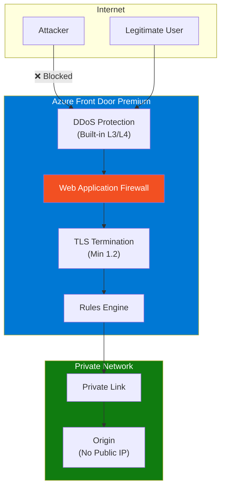
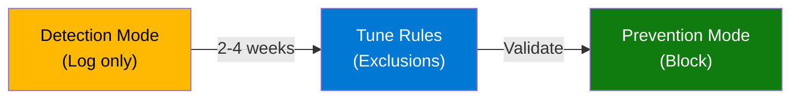
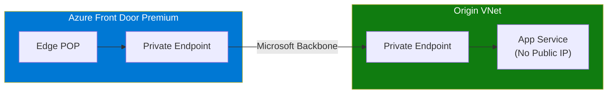

# 03 - Security

> WAF configuration, Private Link, DDoS protection, and TLS best practices for Azure Front Door

[](https://learn.microsoft.com/azure/well-architected/security/)

---

## 🎯 Security Design Principles

| Principle | Front Door Implementation |
|-----------|---------------------------|
| **Defense in depth** | WAF + Private Link + Origin validation |
| **Least privilege** | RBAC for management, origin IP restrictions |
| **Encrypt everywhere** | End-to-end TLS, minimum TLS 1.2 |
| **Monitor continuously** | WAF logs, access logs, security alerts |

---

## ✅ Security Checklist

| # | Recommendation | Priority | Tier |
|---|----------------|----------|------|
| 1 | Enable WAF in Prevention mode | 🔴 Critical | Standard+ |
| 2 | Use Private Link to origins | 🔴 Critical | Premium |
| 3 | Enforce TLS 1.2+ minimum | 🔴 Critical | All |
| 4 | Block direct origin access | 🔴 Critical | All |
| 5 | Enable managed WAF rule sets | 🟡 High | Premium |
| 6 | Configure rate limiting | 🟡 High | Standard+ |
| 7 | Enable bot protection | 🟡 High | Premium |
| 8 | Use managed TLS certificates | 🟢 Medium | All |
| 9 | Enable geo-filtering if needed | 🟢 Medium | Standard+ |
| 10 | Send WAF logs to SIEM | 🟢 Medium | All |

---

## 🛡️ Security Architecture



---

## 🔥 Web Application Firewall (WAF)

### WAF Rule Sets (Premium Tier)

| Rule Set | Description | Recommendation |
|----------|-------------|----------------|
| **Default Rule Set (DRS)** | OWASP Top 10 protection | ✅ Enable |
| **Bot Manager** | Good/Bad/Unknown bot classification | ✅ Enable |
| **Rate Limiting** | Request throttling per IP | ✅ Configure |
| **Geo-Filtering** | Block/Allow by country | ⚠️ If needed |
| **IP Restriction** | Block specific IPs/ranges | ⚠️ If needed |

### WAF Configuration (Bicep)

```bicep
resource wafPolicy 'Microsoft.Network/FrontDoorWebApplicationFirewallPolicies@2022-05-01' = {
  name: 'waf-frontdoor'
  location: 'global'
  sku: {
    name: 'Premium_AzureFrontDoor'
  }
  properties: {
    policySettings: {
      mode: 'Prevention'              // Start with Detection, then Prevention
      enabledState: 'Enabled'
      requestBodyCheck: 'Enabled'
    }
    
    managedRules: {
      managedRuleSets: [
        {
          ruleSetType: 'Microsoft_DefaultRuleSet'
          ruleSetVersion: '2.1'
          ruleSetAction: 'Block'
        }
        {
          ruleSetType: 'Microsoft_BotManagerRuleSet'
          ruleSetVersion: '1.0'
          ruleSetAction: 'Block'
        }
      ]
    }
    
    customRules: {
      rules: [
        {
          name: 'RateLimitRule'
          priority: 100
          ruleType: 'RateLimitRule'
          rateLimitDurationInMinutes: 1
          rateLimitThreshold: 1000
          matchConditions: [
            {
              matchVariable: 'RemoteAddr'
              operator: 'IPMatch'
              matchValue: ['0.0.0.0/0']  // All IPs
            }
          ]
          action: 'Block'
        }
      ]
    }
  }
}
```

### WAF Mode Progression



**Best Practice:** Start in Detection mode, tune exclusions for false positives, then switch to Prevention.

---

## 🔒 Private Link (Premium Tier)

### Architecture: Private Origin Connectivity



### Private Link Configuration (Bicep)

```bicep
resource origin 'Microsoft.Cdn/profiles/originGroups/origins@2023-05-01' = {
  name: 'origin-app'
  parent: originGroup
  properties: {
    hostName: 'app.azurewebsites.net'
    originHostHeader: 'api.contoso.com'
    httpPort: 80
    httpsPort: 443
    priority: 1
    weight: 1000
    enabledState: 'Enabled'
    sharedPrivateLinkResource: {
      privateLink: {
        id: '/subscriptions/{sub}/resourceGroups/{rg}/providers/Microsoft.Web/sites/app'
      }
      privateLinkLocation: 'westeurope'
      requestMessage: 'Front Door Private Link'
      groupId: 'sites'
    }
  }
}
```

### Supported Private Link Origins

| Origin Type | Group ID | Notes |
|-------------|----------|-------|
| **App Service / Functions** | `sites` | Most common |
| **Storage (Blob)** | `blob` | Static content |
| **Internal Load Balancer** | Via Private Link Service | Custom apps |
| **Application Gateway** | Via Private Link Service | Regional WAF |
| **API Management** | `gateway` | API tier |
| **Container Apps** | Via Private Link Service | Containers |

---

## 🌐 Origin Security (Without Private Link)

If Private Link is not available (Standard tier), secure origins with:

### 1. Service Tags + Header Validation

```bicep
// App Service Access Restrictions
resource appService 'Microsoft.Web/sites@2022-03-01' = {
  name: 'app-backend'
  properties: {
    siteConfig: {
      ipSecurityRestrictions: [
        {
          ipAddress: 'AzureFrontDoor.Backend'
          action: 'Allow'
          tag: 'ServiceTag'
          priority: 100
          name: 'Allow-FrontDoor'
          headers: {
            'X-Azure-FDID': [ frontDoorId ]  // Your Front Door ID
          }
        }
        {
          ipAddress: 'Any'
          action: 'Deny'
          priority: 2147483647
          name: 'Deny-All'
        }
      ]
    }
  }
}
```

### 2. Validate X-Azure-FDID Header (Application Code)

```csharp
// ASP.NET Core Middleware
public class FrontDoorValidationMiddleware
{
    private readonly string _expectedFrontDoorId;
    
    public async Task InvokeAsync(HttpContext context, RequestDelegate next)
    {
        var frontDoorId = context.Request.Headers["X-Azure-FDID"].FirstOrDefault();
        
        if (frontDoorId != _expectedFrontDoorId)
        {
            context.Response.StatusCode = 403;
            await context.Response.WriteAsync("Direct access not allowed");
            return;
        }
        
        await next(context);
    }
}
```

---

## 🔐 TLS Best Practices

### Minimum TLS Version

```bicep
resource frontDoor 'Microsoft.Cdn/profiles@2023-05-01' = {
  name: 'fd-api'
  location: 'global'
  sku: { name: 'Premium_AzureFrontDoor' }
  properties: {
    // TLS 1.2 is enforced by default
  }
}

resource customDomain 'Microsoft.Cdn/profiles/customDomains@2023-05-01' = {
  name: 'api-contoso-com'
  parent: frontDoor
  properties: {
    hostName: 'api.contoso.com'
    tlsSettings: {
      certificateType: 'ManagedCertificate'  // Azure manages renewal
      minimumTlsVersion: 'TLS12'              // Minimum TLS 1.2
    }
  }
}
```

### TLS Recommendations

| Setting | Recommendation | Reason |
|---------|----------------|--------|
| **Minimum Version** | TLS 1.2 | TLS 1.0/1.1 have vulnerabilities |
| **Certificate Type** | Managed | Automatic renewal, less operational burden |
| **End-to-End TLS** | Enable | Encrypt traffic to origins |
| **HTTPS Redirect** | Enable | Force secure connections |

---

## 🤖 Rate Limiting

### Rate Limit Rule Example

```bicep
{
  name: 'GlobalRateLimit'
  priority: 1
  ruleType: 'RateLimitRule'
  rateLimitDurationInMinutes: 1
  rateLimitThreshold: 1000           // 1000 requests per minute per IP
  matchConditions: [
    {
      matchVariable: 'RequestUri'
      operator: 'Contains'
      matchValue: ['/api/']
    }
  ]
  action: 'Block'
}
```

### Rate Limit Recommendations

| Endpoint Type | Threshold | Duration |
|---------------|-----------|----------|
| **Public APIs** | 100-1000/min | 1 minute |
| **Login/Auth** | 10-20/min | 1 minute |
| **Static Content** | 5000+/min | 1 minute |
| **Admin APIs** | 10-50/min | 1 minute |

---

## 📊 Security Logging

### Enable Diagnostic Settings

```bicep
resource diagnostics 'Microsoft.Insights/diagnosticSettings@2021-05-01-preview' = {
  name: 'fd-diagnostics'
  scope: frontDoor
  properties: {
    workspaceId: logAnalyticsWorkspace.id
    logs: [
      { category: 'FrontDoorAccessLog', enabled: true }
      { category: 'FrontDoorHealthProbeLog', enabled: true }
      { category: 'FrontDoorWebApplicationFirewallLog', enabled: true }
    ]
    metrics: [
      { category: 'AllMetrics', enabled: true }
    ]
  }
}
```

### Key Queries for Security Monitoring

```kusto
// WAF blocked requests
AzureDiagnostics
| where Category == "FrontDoorWebApplicationFirewallLog"
| where action_s == "Block"
| summarize count() by ruleName_s, clientIP_s
| order by count_ desc

// Top attacking IPs
AzureDiagnostics
| where Category == "FrontDoorWebApplicationFirewallLog"
| where action_s == "Block"
| summarize count() by clientIP_s
| order by count_ desc
| take 10
```

---

## 📋 Security Configuration Summary

| Category | Recommendation |
|----------|----------------|
| **WAF** | Enable managed rules, start Detection mode |
| **Private Link** | Use for all origins (Premium tier) |
| **Origin Security** | Service tags + X-Azure-FDID validation |
| **TLS** | Minimum 1.2, managed certificates |
| **Rate Limiting** | Configure per endpoint type |
| **Logging** | WAF logs to SIEM, set up alerts |

---

## 🔗 References

| Resource | Link |
|----------|------|
| **Security Baseline** | [Azure Front Door security baseline](https://learn.microsoft.com/security/benchmark/azure/baselines/azure-front-door-security-baseline) |
| **WAF on Front Door** | [Web Application Firewall](https://learn.microsoft.com/azure/web-application-firewall/afds/afds-overview) |
| **Private Link** | [Secure origin with Private Link](https://learn.microsoft.com/azure/frontdoor/private-link) |
| **TLS Best Practices** | [TLS best practices](https://learn.microsoft.com/azure/frontdoor/best-practices#tls-best-practices) |
| **Secure Deployment** | [Secure your Azure Front Door](https://learn.microsoft.com/azure/frontdoor/secure-front-door) |

---

*Previous: [02 - Reliability](02-reliability.md) | Next: [04 - Cost Optimization](04-cost-optimization.md)*
