# 04 - Cost Optimization

> Pricing strategies, caching savings, and bandwidth optimization for Azure Front Door

[](https://learn.microsoft.com/azure/well-architected/cost-optimization/)

---

## 🎯 Cost Optimization Principles

| Principle | Front Door Implementation |
|-----------|---------------------------|
| **Right-size resources** | Choose appropriate tier (Standard vs Premium) |
| **Reduce consumption** | Maximize caching, enable compression |
| **Monitor spending** | Cost alerts, usage analytics |
| **Optimize data transfer** | Reduce origin egress with caching |

---

## ✅ Cost Optimization Checklist

| # | Recommendation | Savings Impact |
|---|----------------|----------------|
| 1 | Choose the right tier for your needs | 🔴 High |
| 2 | Maximize cache hit ratio | 🔴 High |
| 3 | Enable compression | 🟡 Medium |
| 4 | Optimize routing to reduce latency charges | 🟡 Medium |
| 5 | Use caching rules strategically | 🟡 Medium |
| 6 | Monitor and set cost alerts | 🟢 Low |
| 7 | Review unused custom domains | 🟢 Low |

---

## 💰 Pricing Model Overview

### Azure Front Door Pricing Components


### Tier Comparison

| Component | Standard | Premium |
|-----------|----------|---------|
| **Base Fee** | $35/month | $330/month |
| **Requests (first 100M)** | $0.01/10K | $0.012/10K |
| **Data Transfer (Zone 1)** | $0.08/GB | $0.08/GB |
| **Custom Domains** | $0.01/month each | Included |
| **WAF Requests** | $0.60/1M | $0.60/1M |

> 💡 **Premium Break-Even:** If you need Private Link or managed WAF rules, Premium is worth the $295/month premium. Calculate based on your security requirements.

---

## 📊 Tier Selection Guide


### When to Choose Standard ($35/month)

- ✅ Public-facing websites with basic WAF needs
- ✅ CDN/caching for static content
- ✅ Global load balancing without Private Link
- ✅ Custom WAF rules are sufficient
- ✅ Budget-conscious deployments

### When to Choose Premium ($330/month)

- ✅ **Private Link** to origins (no public exposure)
- ✅ **Managed WAF rules** (OWASP, Microsoft Default Rule Set)
- ✅ **Bot protection** required
- ✅ Enhanced security reports needed
- ✅ Enterprise compliance requirements

---

## 🎯 Caching for Cost Savings

Caching is the **#1 cost optimization lever** for Front Door.

### Cost Impact of Caching

```mermaid
flowchart LR
    subgraph Without["Without Caching"]
        R1["1M Requests"] --> O1["1M Origin Hits"]
        O1 --> C1["💰 High Origin Egress"]
    end

    subgraph With["With 80% Cache Hit"]
        R2["1M Requests"] --> Cache["800K Cache Hits<br/>(Free from edge)"]
        R2 --> O2["200K Origin Hits"]
        O2 --> C2["💰 80% Less Egress"]
    end
```



### Caching Cost Savings Example

| Scenario | Monthly Requests | Cache Hit % | Origin Egress (GB) | Estimated Savings |
|----------|------------------|-------------|-------------------|-------------------|
| No caching | 10M | 0% | 1,000 GB | $0 |
| Basic caching | 10M | 50% | 500 GB | ~$40/month |
| Optimized caching | 10M | 80% | 200 GB | ~$64/month |
| Aggressive caching | 10M | 95% | 50 GB | ~$76/month |

### Caching Configuration (Bicep)

```bicep
resource route 'Microsoft.Cdn/profiles/afdEndpoints/routes@2023-05-01' = {
  name: 'static-content-route'
  parent: endpoint
  properties: {
    originGroup: { id: originGroup.id }
    patternsToMatch: ['/static/*', '/images/*', '/css/*', '/js/*']
    cacheConfiguration: {
      queryStringCachingBehavior: 'IgnoreQueryString'
      cacheBehavior: 'OverrideAlways'
      cacheDuration: '7.00:00:00'  // 7 days for static content
      compressionSettings: {
        isCompressionEnabled: true
        contentTypesToCompress: [
          'text/html'
          'text/css'
          'application/javascript'
          'application/json'
          'image/svg+xml'
        ]
      }
    }
  }
}
```

### Cache Duration Recommendations

| Content Type | Recommended TTL | Reason |
|--------------|-----------------|--------|
| Static assets (CSS, JS) | 7-30 days | Rarely change, use versioning |
| Images | 7-30 days | Stable content |
| API responses | 1-60 seconds | Balance freshness vs. savings |
| HTML pages | 1-5 minutes | Depends on update frequency |
| User-specific content | Don't cache | Privacy concerns |

---

## 🗜️ Compression Savings

Enable compression to reduce bandwidth costs by 60-80%.

### Compression Impact

| Content Type | Original Size | Compressed (gzip) | Savings |
|--------------|---------------|-------------------|---------|
| HTML | 100 KB | 20 KB | 80% |
| CSS | 50 KB | 10 KB | 80% |
| JavaScript | 200 KB | 40 KB | 80% |
| JSON | 100 KB | 15 KB | 85% |
| Images (PNG/JPG) | N/A | N/A | Already compressed |

### Enable Compression

```bicep
cacheConfiguration: {
  compressionSettings: {
    isCompressionEnabled: true
    contentTypesToCompress: [
      'text/plain'
      'text/html'
      'text/css'
      'text/javascript'
      'application/javascript'
      'application/json'
      'application/xml'
      'image/svg+xml'
    ]
  }
}
```

---

## 📉 Reduce Unnecessary Traffic

### 1. Block Bad Bots (Premium)

Bad bots consume bandwidth without providing value.

```bicep
// Bot Manager rule set blocks malicious bots
managedRules: {
  managedRuleSets: [
    {
      ruleSetType: 'Microsoft_BotManagerRuleSet'
      ruleSetVersion: '1.0'
    }
  ]
}
```

### 2. Rate Limiting

Prevent abuse that inflates costs.

```bicep
customRules: {
  rules: [
    {
      name: 'RateLimitAbuse'
      priority: 1
      ruleType: 'RateLimitRule'
      rateLimitDurationInMinutes: 1
      rateLimitThreshold: 1000
      matchConditions: [
        {
          matchVariable: 'RemoteAddr'
          operator: 'IPMatch'
          matchValue: ['0.0.0.0/0']
        }
      ]
      action: 'Block'
    }
  ]
}
```

### 3. Geo-Filtering

Block traffic from regions you don't serve.

```bicep
{
  name: 'BlockUnservedRegions'
  priority: 10
  ruleType: 'MatchRule'
  matchConditions: [
    {
      matchVariable: 'RemoteAddr'
      operator: 'GeoMatch'
      matchValue: ['CN', 'RU', 'KP']  // Example: countries not served
    }
  ]
  action: 'Block'
}
```

---

## 📊 Cost Monitoring

### Set Up Cost Alerts

```bicep
resource costAlert 'Microsoft.CostManagement/budgets@2023-03-01' = {
  name: 'frontdoor-monthly-budget'
  properties: {
    category: 'Cost'
    amount: 500  // Monthly budget in USD
    timeGrain: 'Monthly'
    timePeriod: {
      startDate: '2024-01-01'
    }
    filter: {
      dimensions: {
        name: 'ServiceName'
        values: ['Azure Front Door Service']
      }
    }
    notifications: {
      Actual_GreaterThan_80_Percent: {
        enabled: true
        operator: 'GreaterThan'
        threshold: 80
        contactEmails: ['team@company.com']
      }
    }
  }
}
```

### Key Metrics to Monitor

| Metric | Why Monitor | Action if High |
|--------|-------------|----------------|
| **Request Count** | Understand traffic patterns | Check for bot abuse |
| **Origin Request Count** | Cache misses = origin costs | Improve cache hit ratio |
| **Bytes Sent** | Bandwidth costs | Enable compression, optimize caching |
| **WAF Request Count** | WAF processing costs | Tune rules, block abusers |

### Cost Analysis Query (KQL)

```kusto
// Front Door costs by route
AzureDiagnostics
| where Category == "FrontDoorAccessLog"
| summarize 
    Requests = count(),
    BytesSent = sum(toint(sc_bytes_s)),
    CacheHits = countif(cacheStatus_s == "HIT")
| extend 
    CacheHitRatio = (CacheHits * 100.0) / Requests,
    EstimatedEgressGB = BytesSent / (1024 * 1024 * 1024)
```

---

## 💡 Cost Optimization Patterns

### Pattern 1: Tiered Caching Strategy


### Pattern 2: Development vs Production

| Environment | Tier | Caching | WAF Mode |
|-------------|------|---------|----------|
| **Development** | Standard | Disabled | Detection |
| **Staging** | Standard | Enabled | Detection |
| **Production** | Premium | Aggressive | Prevention |

### Pattern 3: Cost-Effective Multi-Region

Instead of multiple Front Door instances:


---

## 📋 Cost Optimization Summary

| Strategy | Implementation | Savings |
|----------|----------------|---------|
| **Right tier selection** | Standard for basic, Premium for Private Link | Up to $295/month |
| **Maximize caching** | 7+ day TTL for static content | 60-90% bandwidth |
| **Enable compression** | Gzip/Brotli for text content | 60-80% bandwidth |
| **Block bad traffic** | Bot protection, rate limiting | Variable |
| **Monitor costs** | Budgets and alerts | Prevents surprises |

---

## 🔗 References

| Resource | Link |
|----------|------|
| **Pricing** | [Azure Front Door Pricing](https://azure.microsoft.com/pricing/details/frontdoor/) |
| **Pricing Calculator** | [Azure Pricing Calculator](https://azure.microsoft.com/pricing/calculator/) |
| **Cost Optimization** | [WAF Cost Optimization](https://learn.microsoft.com/azure/well-architected/cost-optimization/) |
| **Caching** | [Front Door Caching](https://learn.microsoft.com/azure/frontdoor/front-door-caching) |

---

*Previous: [03 - Security](03-security.md) | Next: [05 - Operational Excellence](05-operational-excellence.md)*
