# 06 - Performance Efficiency

> Caching strategies, compression, routing optimization, and latency reduction for Azure Front Door

[](https://learn.microsoft.com/azure/well-architected/performance-efficiency/)

---

## 🎯 Performance Efficiency Principles

| Principle | Front Door Implementation |
|-----------|---------------------------|
| **Optimize for latency** | Edge caching, anycast routing, compression |
| **Scale automatically** | Global edge network, no capacity planning |
| **Cache strategically** | Right TTL, query string handling, cache key |
| **Reduce payload size** | Compression, minification, image optimization |

---

## ✅ Performance Checklist

| # | Recommendation | Impact |
|---|----------------|--------|
| 1 | Enable caching for static content | 🔴 High |
| 2 | Configure appropriate cache TTLs | 🔴 High |
| 3 | Enable compression (gzip/brotli) | 🔴 High |
| 4 | Use latency-based routing | 🟡 Medium |
| 5 | Optimize query string caching | 🟡 Medium |
| 6 | Set appropriate origin timeouts | 🟡 Medium |
| 7 | Minimize redirects | 🟢 Low |
| 8 | Use HTTP/2 | 🟢 Low |

---

## ⚡ Latency Optimization

### How Front Door Reduces Latency


### Latency Components

| Component | Typical Latency | Optimization |
|-----------|-----------------|--------------|
| **Client → Edge POP** | 10-50ms | Anycast routing (automatic) |
| **TLS Handshake** | 20-50ms | TLS 1.3, session resumption |
| **WAF Processing** | 1-5ms | Tune rules, exclusions |
| **Cache Lookup** | <1ms | High cache hit ratio |
| **Edge → Origin** | 50-200ms | Cache more, Private Link |
| **Origin Processing** | Variable | Optimize application |

### Latency-Based Routing

```bicep
resource originGroup 'Microsoft.Cdn/profiles/originGroups@2023-05-01' = {
  name: 'og-latency-optimized'
  parent: frontDoor
  properties: {
    loadBalancingSettings: {
      sampleSize: 4
      successfulSamplesRequired: 3
      additionalLatencyInMilliseconds: 50  // Route to origin within 50ms of fastest
    }
    healthProbeSettings: {
      probePath: '/health'
      probeProtocol: 'Https'
      probeRequestType: 'HEAD'
      probeIntervalInSeconds: 30
    }
  }
}
```

**Latency Sensitivity Settings:**

| Value | Behavior | Use Case |
|-------|----------|----------|
| **0ms** | Always route to fastest origin | Latency-critical apps |
| **50ms** | Route to any origin within 50ms of fastest | Balanced (recommended) |
| **200ms+** | Distribute more evenly | Load distribution priority |

---

## 💾 Caching Strategies

### Cache Hit Ratio Impact

```mermaid
flowchart TB
    subgraph Metrics["Performance Impact"]
        HR50["50% Cache Hit<br/>⬇️ 50% latency reduction"]
        HR80["80% Cache Hit<br/>⬇️ 80% latency reduction"]
        HR95["95% Cache Hit<br/>⬇️ 95% latency reduction"]
    end

    subgraph Cost["Cost Impact"]
        C50["50% → Moderate origin load"]
        C80["80% → Low origin load"]
        C95["95% → Minimal origin load"]
    end

    HR50 --> C50
    HR80 --> C80
    HR95 --> C95
```



### Caching Configuration

```bicep
resource staticRoute 'Microsoft.Cdn/profiles/afdEndpoints/routes@2023-05-01' = {
  name: 'route-static'
  parent: endpoint
  properties: {
    originGroup: { id: originGroup.id }
    patternsToMatch: ['/static/*', '/assets/*', '/images/*']
    cacheConfiguration: {
      // Cache behavior
      cacheBehavior: 'OverrideAlways'        // Override origin cache headers
      cacheDuration: '7.00:00:00'            // 7 days
      
      // Query string handling
      queryStringCachingBehavior: 'IgnoreQueryString'  // Ignore for static
      
      // Compression
      compressionSettings: {
        isCompressionEnabled: true
        contentTypesToCompress: [
          'text/html'
          'text/css'
          'text/javascript'
          'application/javascript'
          'application/json'
          'image/svg+xml'
          'application/xml'
        ]
      }
    }
  }
}

resource apiRoute 'Microsoft.Cdn/profiles/afdEndpoints/routes@2023-05-01' = {
  name: 'route-api'
  parent: endpoint
  properties: {
    originGroup: { id: originGroup.id }
    patternsToMatch: ['/api/*']
    cacheConfiguration: {
      cacheBehavior: 'HonorOrigin'           // Respect origin Cache-Control
      queryStringCachingBehavior: 'UseQueryString'  // Include query in cache key
    }
  }
}
```

### Query String Caching Behaviors

| Behavior | Cache Key | Use Case |
|----------|-----------|----------|
| **IgnoreQueryString** | `/page.html` | Static assets (same content regardless of query) |
| **UseQueryString** | `/page.html?v=1.2.3` | Versioned assets, API responses |
| **IgnoreSpecifiedQueryStrings** | Exclude specified params | Ignore tracking params like `utm_source` |
| **IncludeSpecifiedQueryStrings** | Only include specified params | Cache only on relevant params |

### Cache TTL Recommendations

| Content Type | TTL | Cache-Control Header |
|--------------|-----|---------------------|
| **Static assets (CSS, JS)** | 7-30 days | `max-age=2592000, immutable` |
| **Images** | 7-30 days | `max-age=2592000` |
| **Fonts** | 30-365 days | `max-age=31536000, immutable` |
| **HTML pages** | 1-5 minutes | `max-age=300, s-maxage=60` |
| **API responses (cacheable)** | 10-60 seconds | `max-age=60, s-maxage=10` |
| **User-specific content** | **Don't cache** | `private, no-store` |

---

## 🗜️ Compression

### Compression Impact


### Enable Compression

```bicep
compressionSettings: {
  isCompressionEnabled: true
  contentTypesToCompress: [
    // Text-based formats (high compression ratio)
    'text/plain'
    'text/html'
    'text/css'
    'text/javascript'
    'text/xml'
    
    // Application formats
    'application/javascript'
    'application/json'
    'application/xml'
    'application/xhtml+xml'
    'application/rss+xml'
    'application/atom+xml'
    
    // Other compressible formats
    'image/svg+xml'
    'image/x-icon'
    'font/ttf'
    'font/otf'
    'application/vnd.ms-fontobject'
  ]
}
```

### Compression Best Practices

| Do | Don't |
|----|-------|
| ✅ Compress text-based content | ❌ Compress already-compressed formats (JPEG, PNG, MP4) |
| ✅ Use brotli for modern browsers | ❌ Compress small files (< 1KB overhead) |
| ✅ Set `Vary: Accept-Encoding` | ❌ Compress encrypted content |

---

## 🔄 Routing Optimization

### Path-Based Routing for Performance

```mermaid
flowchart LR
    AFD["Front Door"] --> R1["Route: /static/*<br/>→ Storage Account<br/>Cache: 30 days"]
    AFD --> R2["Route: /api/*<br/>→ App Service<br/>Cache: Origin"]
    AFD --> R3["Route: /ws/*<br/>→ WebSocket Server<br/>No Cache"]
    AFD --> R4["Route: /*<br/>→ Web App<br/>Cache: 5 min"]
```



```bicep
// Optimized multi-route configuration
var routes = [
  {
    name: 'static-assets'
    patterns: ['/static/*', '/assets/*', '/_next/static/*']
    originGroup: staticOriginGroup
    cacheDuration: '30.00:00:00'
    queryString: 'IgnoreQueryString'
  }
  {
    name: 'api'
    patterns: ['/api/*']
    originGroup: apiOriginGroup
    cacheDuration: null  // Honor origin
    queryString: 'UseQueryString'
  }
  {
    name: 'default'
    patterns: ['/*']
    originGroup: webOriginGroup
    cacheDuration: '00:05:00'
    queryString: 'UseQueryString'
  }
]
```

### Origin Selection Strategy

| Strategy | Configuration | Best For |
|----------|---------------|----------|
| **Lowest Latency** | `additionalLatencyInMilliseconds: 0` | Real-time apps |
| **Balanced** | `additionalLatencyInMilliseconds: 50` | General web apps |
| **Weighted** | `weight: 1000/500` | Gradual rollout |
| **Priority Failover** | `priority: 1/2` | DR scenarios |

---

## 📊 Performance Monitoring

### Key Performance Metrics

| Metric | Target | Query |
|--------|--------|-------|
| **Cache Hit Ratio** | > 80% | See below |
| **Origin Latency** | < 200ms | See below |
| **Total Latency** | < 100ms (cached) | See below |
| **5XX Error Rate** | < 0.1% | See below |

### Performance Queries (KQL)

#### Cache Hit Ratio

```kusto
AzureDiagnostics
| where Category == "FrontDoorAccessLog"
| where TimeGenerated > ago(24h)
| summarize 
    Total = count(),
    Hits = countif(cacheStatus_s == "HIT"),
    Misses = countif(cacheStatus_s == "MISS"),
    Other = countif(cacheStatus_s !in ("HIT", "MISS"))
| extend HitRatio = round((Hits * 100.0) / Total, 2)
| project HitRatio, Total, Hits, Misses, Other
```

#### Latency Percentiles

```kusto
AzureDiagnostics
| where Category == "FrontDoorAccessLog"
| where TimeGenerated > ago(1h)
| extend LatencyMs = toint(timeTaken_s) * 1000
| summarize 
    P50 = percentile(LatencyMs, 50),
    P75 = percentile(LatencyMs, 75),
    P95 = percentile(LatencyMs, 95),
    P99 = percentile(LatencyMs, 99)
    by bin(TimeGenerated, 5m)
| render timechart
```

#### Slow Requests Analysis

```kusto
AzureDiagnostics
| where Category == "FrontDoorAccessLog"
| where TimeGenerated > ago(1h)
| extend LatencyMs = toint(timeTaken_s) * 1000
| where LatencyMs > 1000  // Requests > 1 second
| project 
    TimeGenerated,
    requestUri_s,
    LatencyMs,
    cacheStatus_s,
    originName_s,
    httpStatusCode_s
| order by LatencyMs desc
| take 100
```

#### Cache Miss Analysis

```kusto
// Identify high-volume cache misses (optimization opportunities)
AzureDiagnostics
| where Category == "FrontDoorAccessLog"
| where cacheStatus_s == "MISS"
| summarize MissCount = count() by requestUri_s
| order by MissCount desc
| take 50
```

---

## ⚙️ Rules Engine for Performance

### URL Rewrite (Reduce Origin Load)

```bicep
resource ruleSet 'Microsoft.Cdn/profiles/ruleSets@2023-05-01' = {
  name: 'performance-rules'
  parent: frontDoor
}

// Redirect to CDN for known static patterns
resource staticRedirectRule 'Microsoft.Cdn/profiles/ruleSets/rules@2023-05-01' = {
  name: 'redirect-static-to-cdn'
  parent: ruleSet
  properties: {
    order: 1
    conditions: [
      {
        name: 'UrlPath'
        parameters: {
          typeName: 'DeliveryRuleUrlPathMatchConditionParameters'
          operator: 'BeginsWith'
          matchValues: ['/legacy-static/']
        }
      }
    ]
    actions: [
      {
        name: 'UrlRewrite'
        parameters: {
          typeName: 'DeliveryRuleUrlRewriteActionParameters'
          sourcePattern: '/legacy-static/'
          destination: '/static/'
          preserveUnmatchedPath: true
        }
      }
    ]
  }
}
```

### Cache Override Rules

```bicep
// Force cache for specific paths regardless of origin headers
resource forceCacheRule 'Microsoft.Cdn/profiles/ruleSets/rules@2023-05-01' = {
  name: 'force-cache-assets'
  parent: ruleSet
  properties: {
    order: 2
    conditions: [
      {
        name: 'UrlFileExtension'
        parameters: {
          typeName: 'DeliveryRuleUrlFileExtensionMatchConditionParameters'
          operator: 'Equal'
          matchValues: ['js', 'css', 'woff2', 'woff', 'ttf']
        }
      }
    ]
    actions: [
      {
        name: 'CacheExpiration'
        parameters: {
          typeName: 'DeliveryRuleCacheExpirationActionParameters'
          cacheBehavior: 'Override'
          cacheType: 'All'
          cacheDuration: '30.00:00:00'
        }
      }
    ]
  }
}
```

---

## 🚀 Performance Optimization Patterns

### Pattern 1: Static Asset Optimization


**Implementation:**
- Use versioned file names or query strings
- Set `Cache-Control: max-age=2592000, immutable`
- Configure Front Door to `IgnoreQueryString` or `UseQueryString`

### Pattern 2: API Response Caching

```bicep
// Short-lived cache for API responses
cacheConfiguration: {
  cacheBehavior: 'OverrideIfOriginMissing'
  cacheDuration: '00:01:00'  // 1 minute
  queryStringCachingBehavior: 'UseQueryString'
}
```

**Best Practices:**
- Cache GET requests only
- Include query params in cache key
- Use `Vary` header for different response formats
- Set short TTL (30-60 seconds)

### Pattern 3: Stale-While-Revalidate

Configure origin to return:
```http
Cache-Control: max-age=60, stale-while-revalidate=300
```

This allows Front Door to:
1. Serve cached content immediately
2. Fetch fresh content in background
3. Update cache for next request

---

## 📋 Performance Summary

| Optimization | Implementation | Expected Impact |
|--------------|----------------|-----------------|
| **Enable caching** | Route-level cache config | 50-90% latency reduction |
| **Compression** | Gzip/brotli for text content | 60-80% bandwidth reduction |
| **Latency routing** | `additionalLatencyInMilliseconds: 50` | 10-30% latency reduction |
| **Query string optimization** | `IgnoreQueryString` for static | Higher cache hit ratio |
| **Path-based routing** | Separate routes by content type | Better cache efficiency |
| **Rules Engine** | Force cache headers | Consistent caching |

---

## 🔗 References

| Resource | Link |
|----------|------|
| **Performance Efficiency** | [WAF Performance Efficiency](https://learn.microsoft.com/azure/well-architected/performance-efficiency/) |
| **Caching** | [Front Door Caching](https://learn.microsoft.com/azure/frontdoor/front-door-caching) |
| **Compression** | [Enable Compression](https://learn.microsoft.com/azure/frontdoor/standard-premium/how-to-compression) |
| **Rules Engine** | [Front Door Rules Engine](https://learn.microsoft.com/azure/frontdoor/front-door-rules-engine) |

---

*Previous: [05 - Operational Excellence](05-operational-excellence.md)*
