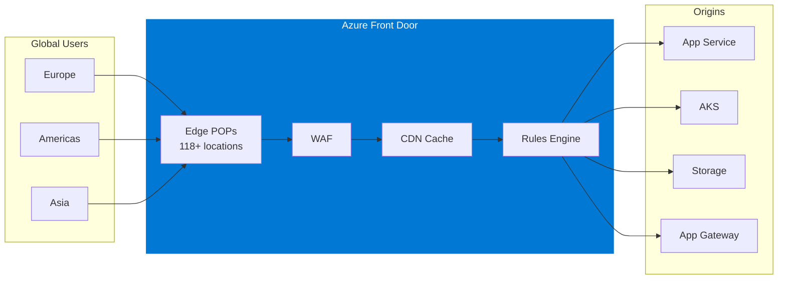

# Azure Front Door Best Practices

> Enterprise-grade guidance for Azure Front Door based on the Azure Well-Architected Framework

---

## 📋 Table of Contents

| # | Document | Description |
|---|----------|-------------|
| 1 | [Architecture Overview](01-architecture-overview.md) | Core concepts, tiers, and deployment patterns |
| 2 | [Reliability](02-reliability.md) | High availability, failover, health probes |
| 3 | [Security](03-security.md) | WAF, Private Link, DDoS, TLS |
| 4 | [Cost Optimization](04-cost-optimization.md) | Pricing tiers, caching, bandwidth optimization |
| 5 | [Operational Excellence](05-operational-excellence.md) | IaC, monitoring, certificate management |
| 6 | [Performance Efficiency](06-performance-efficiency.md) | Caching, compression, routing optimization |

---

## 🎯 What is Azure Front Door?

Azure Front Door is a **global, scalable entry-point** that uses the Microsoft global edge network to create fast, secure, and widely scalable web applications.

---

## 📊 Azure Front Door Tiers

| Feature | Standard | Premium |
|---------|----------|---------|
| **Base Fee** | $35/month | $330/month |
| **Custom Domains** | ✅ | ✅ |
| **SSL/TLS Termination** | ✅ | ✅ |
| **Custom WAF Rules** | ✅ | ✅ |
| **Managed WAF Rules** | ❌ | ✅ |
| **Bot Protection** | ❌ | ✅ |
| **Private Link to Origin** | ❌ | ✅ |
| **Enhanced Metrics** | ❌ | ✅ |

> 💡 **Recommendation:** Use **Premium** tier for enterprise workloads requiring Private Link and managed WAF rules.

---

## 🏗️ Key Capabilities

### 1. Global Load Balancing
- **Anycast routing** to nearest edge POP
- **Active-Active** or **Active-Passive** deployment support
- **Priority**, **Weighted**, and **Latency-based** routing

### 2. Content Delivery (CDN)
- **118+ edge locations** worldwide
- **Caching** for static content
- **Compression** support (gzip, brotli)

### 3. Application Security
- **Web Application Firewall (WAF)** with OWASP rules
- **DDoS Protection** (Layer 3/4 built-in)
- **Rate Limiting** and **Geo-filtering**
- **Bot Protection** (Premium)

### 4. Secure Connectivity
- **Private Link** to origins (Premium)
- **End-to-end TLS** encryption
- **Managed TLS certificates**

---

## 🔗 Official Documentation

| Resource | Link |
|----------|------|
| **Well-Architected Framework Guide** | [Architecture best practices for Azure Front Door](https://learn.microsoft.com/azure/well-architected/service-guides/azure-front-door) |
| **Product Documentation** | [Azure Front Door Documentation](https://learn.microsoft.com/azure/frontdoor/) |
| **Best Practices** | [Best practices for Azure Front Door](https://learn.microsoft.com/azure/frontdoor/best-practices) |
| **Security Baseline** | [Security baseline for Azure Front Door](https://learn.microsoft.com/security/benchmark/azure/baselines/azure-front-door-security-baseline) |
| **Pricing** | [Azure Front Door Pricing](https://azure.microsoft.com/pricing/details/frontdoor/) |
| **Pricing Calculator** | [Azure Pricing Calculator](https://azure.microsoft.com/pricing/calculator/) |

---

## ⚖️ When to Use Azure Front Door

| Use Case | Recommended? | Notes |
|----------|--------------|-------|
| Global web applications | ✅ | Primary use case |
| Multi-region deployments | ✅ | Active-Active/Passive support |
| CDN for static content | ✅ | Built-in caching |
| WAF at the edge | ✅ | OWASP + custom rules |
| API gateway | ⚠️ | Consider APIM for advanced API management |
| Internal-only traffic | ❌ | Use Application Gateway instead |
| Non-HTTP(S) traffic | ❌ | Use Azure Load Balancer or Traffic Manager |

---

## 🎯 Quick Decision: Front Door vs Application Gateway

| Criteria | Azure Front Door | Application Gateway |
|----------|------------------|---------------------|
| **Scope** | Global (anycast) | Regional |
| **Layer** | Layer 7 (HTTP/S) | Layer 7 (HTTP/S) |
| **CDN** | ✅ Built-in | ❌ |
| **WAF** | ✅ Global edge | ✅ Regional |
| **Private Link (Origin)** | ✅ Premium | ❌ |
| **VNet Integration** | ❌ (uses Private Link) | ✅ Direct |
| **WebSocket** | ✅ | ✅ |
| **Use Case** | Internet-facing, global | VNet-internal, regional |

---

*Last Updated: February 2026*
