# Unified Monitoring Solution - Architecture Overview

> **Document Type**: Solution Architecture  
> **Version**: 1.0  
> **Last Updated**: January 2026
>
> **Feature Availability Legend**:  
> ✅ GA (Generally Available) | ⚠️ Preview (may change) | 📍 Planned/Roadmap

| 📚 **Quick Navigation** | [README](./README.md) | **Architecture** | [Operations Runbook](./02-operations-runbook.md) | [Advanced Topics](./03-advanced-topics.md) |
|---|---|---|---|---|

---

## 📖 How to Use This Document

This **Architecture** document provides the **"What & Why"** (theory, design decisions, patterns).  
The **Operations Runbook** provides the **"How"** (practical implementation, KQL queries, troubleshooting).

### Theory ↔ Practice Cross-Reference

| Architecture Topic | Operations Counterpart | Description |
|-------------------|------------------------|-------------|
| [3. Federated Model](#3-federated-monitoring-model) | [1. Operations Overview](./02-operations-runbook.md#1-operations-overview) | Governance model → Day-2 responsibilities |
| [4. Core Components (DCR/LAW)](#4-core-components-deep-dive) | [5. Troubleshooting Guide](./02-operations-runbook.md#5-troubleshooting-guide) | Component design → Troubleshooting steps |
| [5. Landing Zone Alerting](#5-landing-zone-scoped-alerting) | [2. Alert Response](./02-operations-runbook.md#2-alert-response-procedures) | Alert design → Alert response actions |
| [6. AMBA](#6-azure-monitor-baseline-alerts-amba) | [4. Maintenance Windows](./02-operations-runbook.md#4-maintenance-window-management) | Baseline alerts → Suppression & maintenance |
| [8. Security & Access Control](#8-security--access-control) | [6. RBAC Operations](./02-operations-runbook.md#6-rbac-operations) | RBAC design → Access management tasks |
| — | [3. KQL Query Library](./02-operations-runbook.md#3-kql-query-library) | Ready-to-use queries |
| — | [7. Cost Monitoring](./02-operations-runbook.md#7-cost-monitoring--optimization) | Cost operations (deep-dive in Advanced Topics) |

---

## 1. Executive Summary

The **Unified Monitoring Solution (UMS)** provides a federated, enterprise-scale observability framework for Azure Landing Zones. It delivers a **centralized governance layer** with **decentralized execution**, enabling platform teams to enforce baseline monitoring standards while empowering application teams with the flexibility to customize their observability stack.

### 1.1 Key Design Principles

| Principle | Description |
|-----------|-------------|
| **Federated Model** | Central baseline + decentralized customization |
| **Policy-Driven** | Azure Policy enforces monitoring standards |
| **Actionable Alerts** | Every notification has clear remediation steps |
| **Landing Zone Aware** | Alerts scoped to specific landing zones, not global broadcast |
| **IaC-First** | All monitoring configuration deployed via Bicep/Terraform |
| **Cost-Optimized** | Tiered retention, data filtering, smart ingestion |

---

## 2. High-Level Architecture

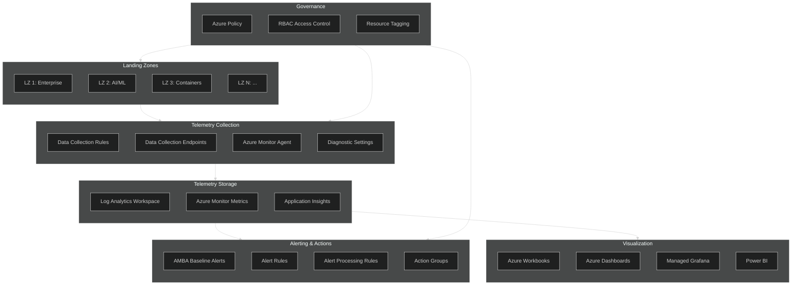

---

## 3. Federated Monitoring Model

The federated approach addresses a common enterprise challenge: **"All Microsoft service health alerts forwarded to ALL landing zone owners"** causing excessive, irrelevant notifications.

### 3.1 Model Overview

```mermaid
%%{init: {"theme": "dark"}}%%
flowchart LR
    subgraph CENTRAL["Central Platform Team"]
        direction TB
        BASELINE["Baseline Monitoring"]
        POLICIES["Azure Policies"]
        AMBA_C["AMBA Deployment"]
        LAW_CENTRAL["Central LAW"]
    end

    subgraph LZTEAM["Landing Zone Teams"]
        direction TB
        CUSTOM_DCR["Custom DCRs"]
        CUSTOM_ALERTS["Custom Alerts"]
        CUSTOM_WB["Custom Workbooks"]
        CUSTOM_METRICS["Custom Metrics"]
        CUSTOM_LOGS["Custom Logs"]
        CUSTOM_DS["Custom Diag Settings"]
        LAW_LZ["LZ-Specific LAW"]
    end

    CENTRAL -->|"Deploys Baseline"| LZTEAM
```

### 3.2 Responsibilities Matrix

| Responsibility | Central Platform Team | Landing Zone Team |
|---------------|----------------------|-------------------|
| **Baseline DCRs** | ✅ Define & Deploy | ❌ Read-only |
| **AMBA Alerts** | ✅ Deploy via Policy | 🔄 Can customize thresholds |
| **Custom DCRs** | ❌ | ✅ Create & Manage |
| **Custom Alerts** | ❌ | ✅ Create & Manage |
| **Custom Metrics** | ❌ | ✅ Create & Manage |
| **Custom Logs** | ❌ | ✅ Create & Manage |
| **Custom Diagnostic Settings** | ❌ | ✅ Create & Manage |
| **Central LAW Access** | ✅ Full Access | 🔄 Resource-context access |
| **LZ-Specific LAW** | ❌ | ✅ Full Access |
| **Action Groups** | ✅ Define defaults | ✅ Create LZ-specific |
| **Azure Policy** | ✅ Define & Assign | ❌ Read-only |
| **Workbooks** | ✅ Publish templates | ✅ Create custom |

### 3.3 Baseline vs. Custom Components

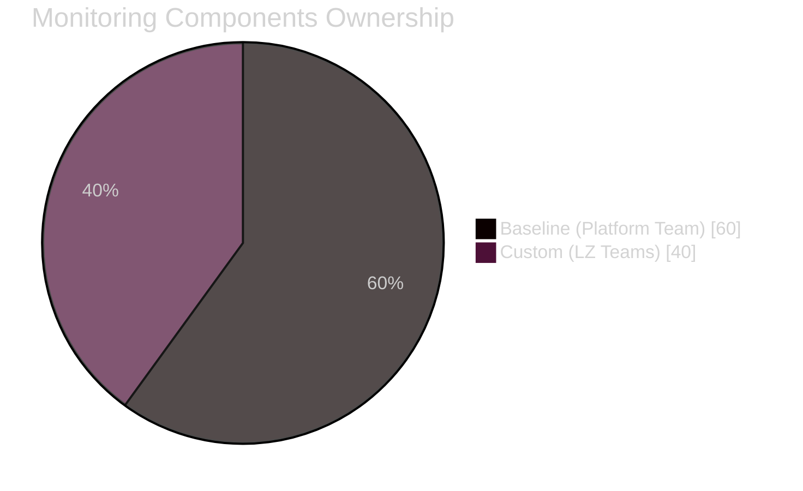

| Component Type | Baseline (Mandatory) | Custom (Optional) |
|---------------|---------------------|-------------------|
| **Data Collection** | OS performance counters, Security events, Activity logs | Application logs, Custom metrics, Business events |
| **Alerts** | Service Health, Resource Health, AMBA metrics | Application-specific, Business SLA alerts |
| **Retention** | 90 days operational, 2 years compliance | As needed per application |
| **Notifications** | Platform team email, ServiceNow | Team-specific channels (Slack, Teams, PagerDuty) |

### 3.4 Federated Visibility Architecture

The 60/40 split represents two distinct data flow patterns that work together to provide platform-wide visibility while respecting landing zone autonomy.

#### Scenario A: Centralized LAW (60% Baseline + Critical Workloads)

Platform services and critical landing zone workloads send telemetry to the **Central Platform LAW** for unified visibility.

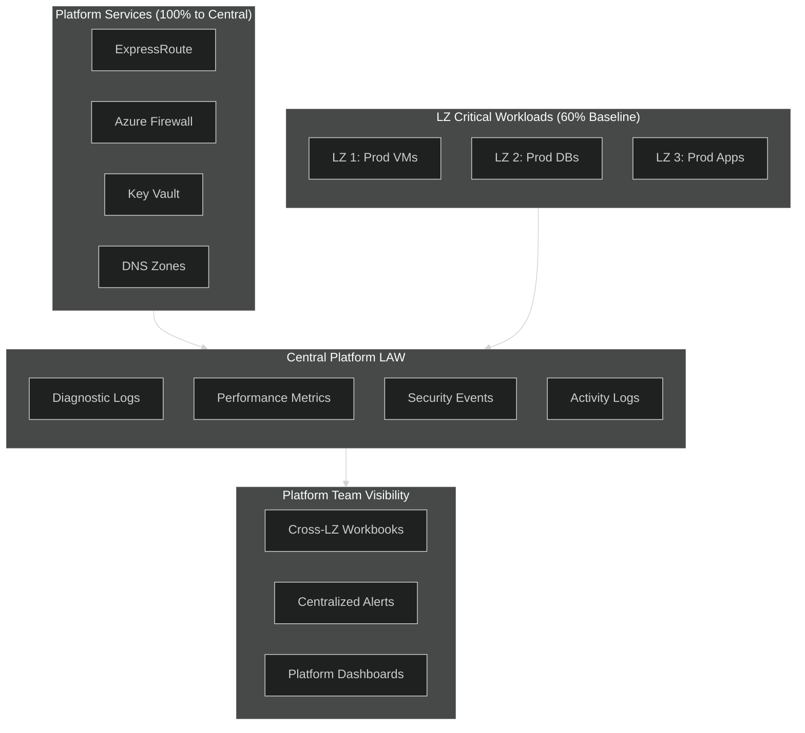

**What Flows to Central LAW:**
| Source | Data Type | Purpose |
|--------|-----------|---------|
| Platform Services | All diagnostic logs | Full platform health visibility |
| LZ Baseline | Activity Logs | Audit trail across all LZs |
| LZ Baseline | Security Events | Compliance & threat detection |
| LZ Baseline | VM Performance | Capacity planning & health |
| LZ Critical | Application errors | Critical workload monitoring |

#### Scenario B: LZ-Dedicated LAW with Shared Dashboards (40% Custom)

Non-critical workloads stay in **LZ-Dedicated LAWs**, but the platform team gets visibility through **shared Workbooks and Dashboards**.

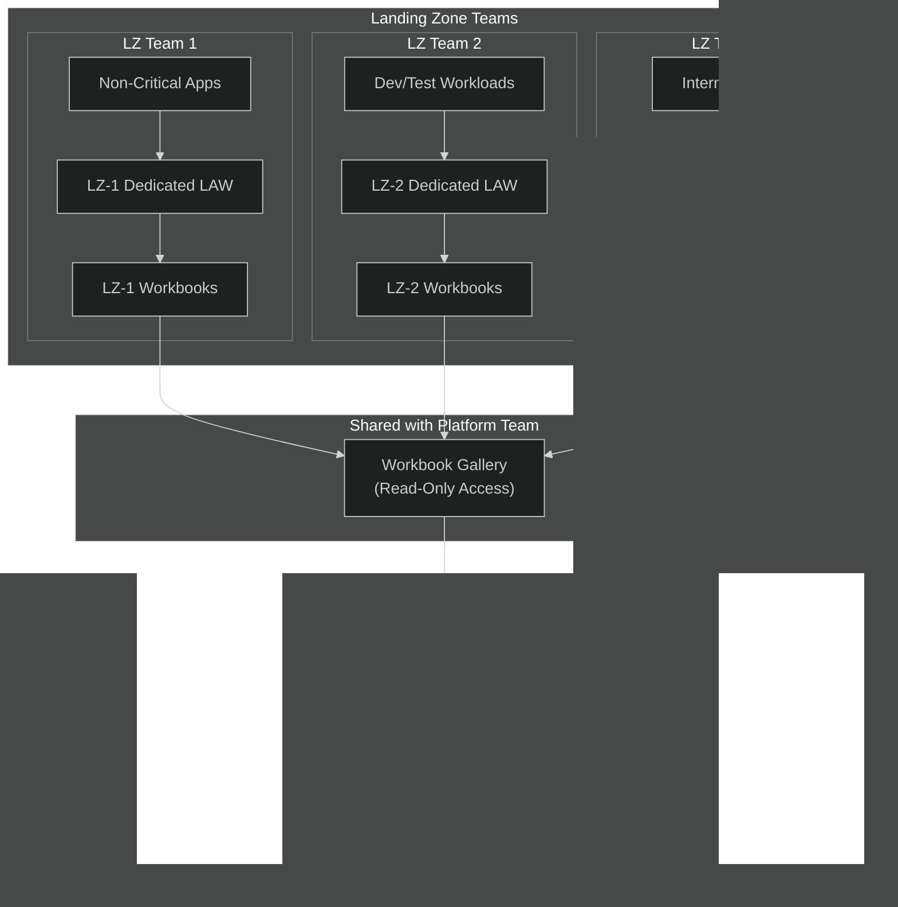

**How Sharing Works:**
| Method | Configuration | Platform Team Access |
|--------|--------------|---------------------|
| **Workbook Sharing** | LZ team publishes to shared gallery | Read-only view |
| **Dashboard Sharing** | Pin to shared dashboard | Read-only view |
| **RBAC** | `Monitoring Reader` role on LZ LAW | Query access |
| **Cross-Workspace Queries** | KQL `workspace()` function | Federated queries |

#### Combined Architecture: 60/40 Split in Practice

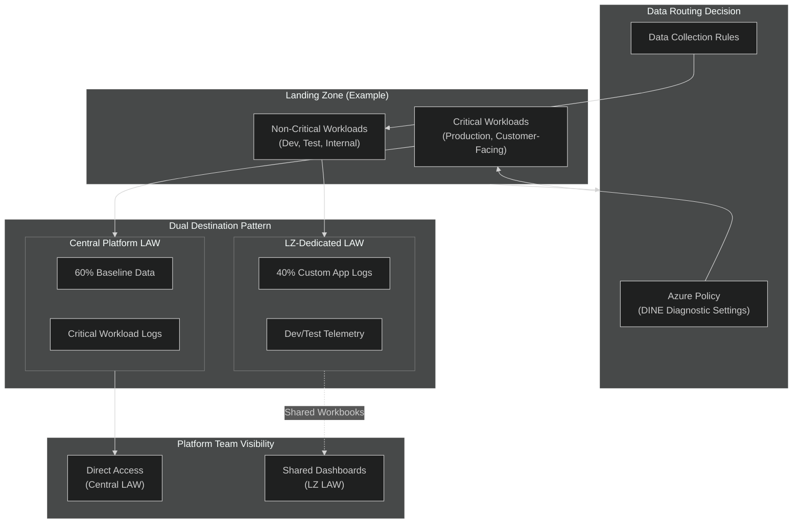

#### Implementation Decision Matrix

| Workload Type | Data Destination | Rationale | Platform Visibility |
|--------------|------------------|-----------|---------------------|
| **Platform Services** | Central LAW | Core infrastructure | Direct access |
| **Production Critical** | Central LAW | SLA-driven, compliance | Direct access |
| **Production Standard** | Both (dual-write) | Flexibility | Direct + Shared |
| **Development** | LZ-Dedicated LAW | Cost optimization | Shared dashboards |
| **Test/Sandbox** | LZ-Dedicated LAW | Isolation | Optional sharing |

### 3.5 Baseline Telemetry Contract Template

> **Blueprint Requirement**: "End-to-end process of defining, negotiating, and formalizing Baseline Telemetry Contracts between the Monitoring Team and platform/service owners."

Each Landing Zone / Platform must complete a **Telemetry Contract** before onboarding. This ensures alignment on what data is collected, how it's processed, and who receives alerts.

#### Contract Template

| Contract Element | Description | Example Value | Owner |
|-----------------|-------------|---------------|-------|
| **Platform/Service Name** | Unique identifier for the platform | `AI/ML Platform` | LZ Team |
| **Contract Version** | Version control for changes | `v1.2` | Both |
| **Effective Date** | When contract becomes active | `2026-02-01` | Both |

##### 1. Telemetry Scope

| Data Type | Included | Specific Items | Justification |
|-----------|----------|----------------|---------------|
| **OS Performance Metrics** | ✅ Yes | CPU, Memory, Disk, Network | Baseline requirement |
| **Security Events** | ✅ Yes | EventID 4624, 4625, 4648, 4672 | Compliance |
| **Application Logs** | ✅ Yes | /var/log/app/*.log | Troubleshooting |
| **Custom Metrics** | ❌ No | - | Not required |
| **Traces** | ❌ No | - | App Insights OOS |

##### 2. Integration Method

| Component | Configuration | Details |
|-----------|--------------|---------|
| **Agent Type** | Azure Monitor Agent (AMA) | Mandatory |
| **DCR Name** | `dcr-aiml-platform-prod` | Platform-specific |
| **DCE Endpoint** | `dce-central-westeu-001` | Regional endpoint |
| **Diagnostic Settings** | Enabled for all resources | Via Azure Policy |

##### 3. Retention Requirements

| Data Category | Hot Retention | Archive Retention | Compliance Driver |
|--------------|---------------|-------------------|-------------------|
| Performance Metrics | 30 days | 90 days | Operational |
| Security Events | 90 days | 2 years | SOX/GDPR |
| Application Logs | 14 days | 30 days | Cost optimization |
| Activity Logs | 90 days | 7 years | Audit |

##### 4. Alerting Rules

| Alert Category | Alert Name | Threshold | Severity | Action |
|---------------|------------|-----------|----------|--------|
| **AMBA Baseline** | VM Availability | < 99% | Sev 1 | ServiceNow P1 |
| **AMBA Baseline** | CPU Critical | > 95% for 5min | Sev 2 | Email + Ticket |
| **Custom** | Model Training Failed | Error count > 0 | Sev 2 | Teams + Email |
| **Custom** | GPU Utilization Low | < 10% for 1hr | Sev 4 | Dashboard only |

##### 5. Visualization Requirements

| Dashboard Type | Purpose | Access Level | Refresh Rate |
|---------------|---------|--------------|--------------|
| Platform Health | Overview for leadership | Read-only | 5 min |
| Operations | Detailed troubleshooting | Team access | 1 min |
| Cost Analysis | Resource consumption | Finance team | Daily |

##### 6. Notification Preferences

| Severity | Channel | Recipients | Escalation |
|----------|---------|------------|------------|
| Sev 0 (Critical) | Phone + ServiceNow P1 | On-call + Team Lead | 15 min to Service Owner |
| Sev 1 (High) | ServiceNow P2 + Teams | On-call team | 30 min to Product Owner |
| Sev 2 (Medium) | Email + Teams | Team distribution list | Next business day |
| Sev 3-4 (Low) | Dashboard only | Self-service | None |

##### 7. Governance & Review

| Aspect | Frequency | Owner | Deliverable |
|--------|-----------|-------|-------------|
| Contract Review | Quarterly | Both teams | Updated contract |
| Alert Tuning | Monthly | LZ Team | Noise reduction report |
| Cost Review | Monthly | Platform Team | Cost optimization recommendations |
| Compliance Audit | Annual | Security Team | Compliance attestation |

#### Contract Approval

| Role | Name | Signature | Date |
|------|------|-----------|------|
| Platform Owner | _____________ | _____________ | _____________ |
| Monitoring Lead | _____________ | _____________ | _____________ |
| Security Approver | _____________ | _____________ | _____________ |

---

## 4. Core Components Deep Dive

### 4.1 Data Collection Rules (DCR)

DCRs are the **heart of the federated model** for VM and container workloads, enabling granular control over what data is collected and where it's sent.

> ⚠️ **Important Distinction**: DCRs apply primarily to **VMs, VMSS, and AKS** via Azure Monitor Agent. For **PaaS services**, you still use **Diagnostic Settings** to collect resource logs. DCR-based metrics export for PaaS is in preview with limited service support.

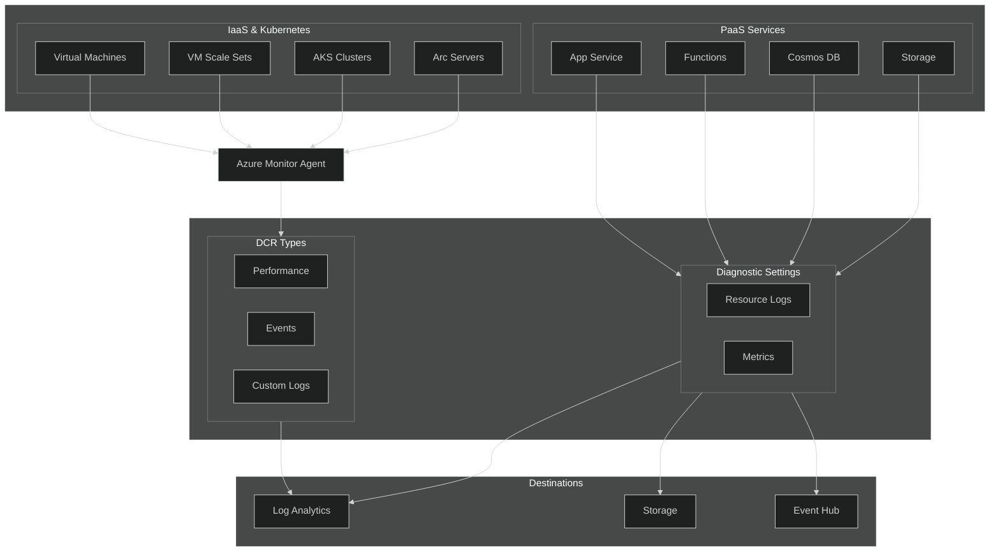

#### DCR vs Diagnostic Settings Comparison

| Aspect | Data Collection Rules (DCR) | Diagnostic Settings |
|--------|----------------------------|---------------------|
| **Primary Use** | VMs, VMSS, AKS, Arc servers | PaaS resource logs |
| **Agent Required** | Yes - Azure Monitor Agent | No - native to resource |
| **Transformations** | ✅ KQL transformations supported | ❌ No transformations |
| **Multi-destination** | ✅ Multiple LAWs from single DCR | ⚠️ One setting per destination |
| **PaaS Logs** | ❌ Not supported | ✅ Primary method |
| **PaaS Metrics** | ⚠️ Preview - limited services | ✅ Supported |
| **Custom Logs** | ✅ Via Logs Ingestion API | ❌ Not supported |

#### DCR-Supported Resources (as of January 2026)

| Resource Type | DCR Support | Notes |
|--------------|-------------|-------|
| Virtual Machines | ✅ GA | Via Azure Monitor Agent |
| VM Scale Sets | ✅ GA | Via Azure Monitor Agent |
| AKS Clusters | ✅ GA | Container Insights |
| Arc-enabled Servers | ✅ GA | Via Azure Monitor Agent |
| **Metrics Export** | | ⚠️ **Preview** |
| Storage Accounts | ⚠️ Preview | Limited regions |
| Key Vault | ⚠️ Preview | Limited regions |
| Redis Cache | ⚠️ Preview | Limited regions |
| SQL Server/DB | ⚠️ Preview | Limited regions |
| IoT Hub | ⚠️ Preview | Limited regions |
| **Logs Ingestion API** | ✅ GA | Custom apps via REST |

> **Note**: For **App Service, Azure Functions, Cosmos DB, Event Grid, Service Bus, API Management**, and most other PaaS services, continue using **Diagnostic Settings** to send logs to Log Analytics.

#### DCR Best Practices (from Microsoft Documentation)

| Best Practice | Explanation |
|--------------|-------------|
| **Separate DCRs by data source type** | Don't mix performance counters and events in one DCR |
| **Separate DCRs by destination** | Compliance requirements may need specific destinations |
| **Define observability scopes** | Group by application, environment, or platform |
| **Keep DCRs lean** | Only collect what's needed for each scope |
| **Limit DCR associations** | Each resource can associate with multiple DCRs; avoid excessive associations |
| **Use Diagnostic Settings for PaaS** | DCRs don't support PaaS resource logs - use Diagnostic Settings |
| **Consider Workspace Transformation DCR** | Apply transformations to Diagnostic Settings data at workspace level |

### 4.2 Log Analytics Workspace Design

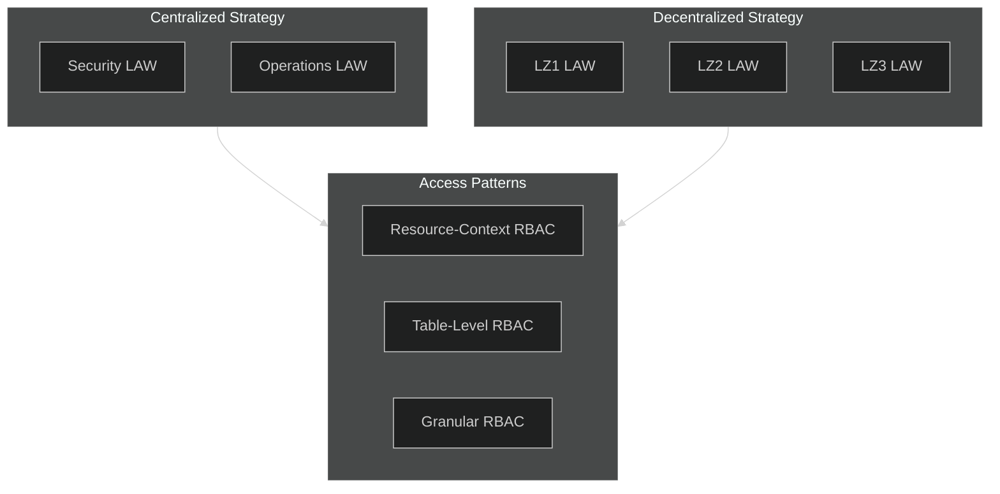

#### Workspace Design Decision Matrix

| Scenario | Recommended Strategy | Rationale |
|----------|---------------------|-----------|
| **< 100 GB/day ingestion** | Single workspace + Resource-context RBAC | Simpler management, cost-effective |
| **≥ 100 GB/day ingestion** | Dedicated cluster + Single workspace | Commitment tier savings |
| **Multi-tenant/compliance** | Separate workspaces per tenant | Data sovereignty, isolation |
| **Security + Operations** | Separate Security (Sentinel) + Operations LAW | Different retention, access patterns |

### 4.3 Azure Monitor Agent (AMA)

The Azure Monitor Agent replaces legacy agents (MMA, OMS) and provides:

| Feature | Benefit |
|---------|---------|
| **Centralized configuration** | DCRs instead of workspace configuration |
| **Multi-homing** | Send data to multiple workspaces |
| **Granular collection** | Only collect what's defined in associated DCRs |
| **Transformations** | Filter and transform data before ingestion |
| **Reduced cost** | No agent cost, pay only for data ingestion |

---

## 5. Landing Zone Scoped Alerting

### 5.1 Problem Statement (Current State)

> *"A single logic app is responsible for forwarding all alerts via webhooks. If this app is deleted, the entire alerting system fails."*

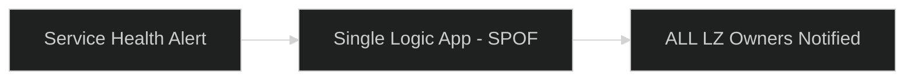

### 5.2 Target State Architecture

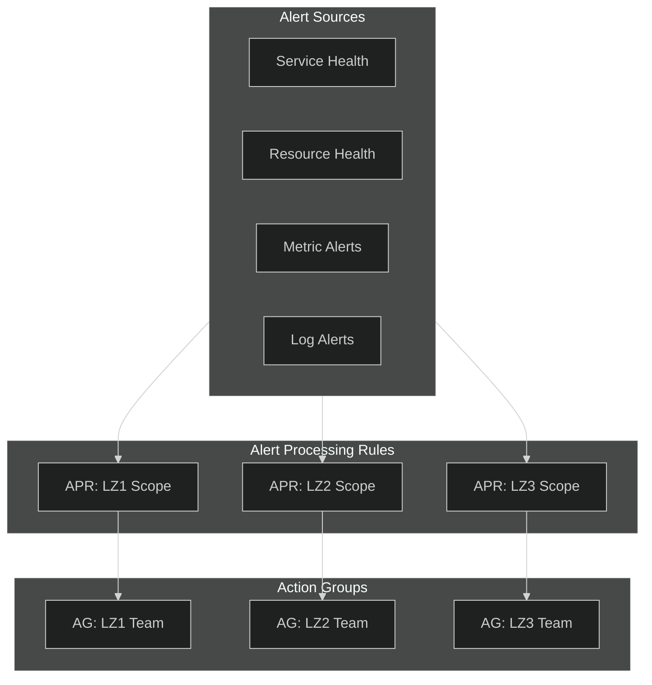

### 5.3 Alert Processing Rules Design

| Rule Type | Scope | Filter Criteria | Action |
|-----------|-------|-----------------|--------|
| **LZ Routing** | Subscription | `resourceGroup contains 'lz-name'` | Route to LZ-specific action group |
| **Severity Filtering** | Resource Group | `severity = 'Sev0' OR severity = 'Sev1'` | Route to on-call team |
| **Maintenance Window** | Subscription | Schedule: Sundays 02:00-06:00 | Suppress notifications |
| **Business Hours** | Subscription | Schedule: Mon-Fri 09:00-17:00 | Route to primary team |

### 5.4 Application-Level Alert Containment

> **Meeting Requirement**: *"When one alert gets fired, containing it per application area - not firing alerts everywhere"*

This pattern ensures alerts are **contained within application boundaries** and don't cascade across the entire Landing Zone or organization.

#### Containment Architecture

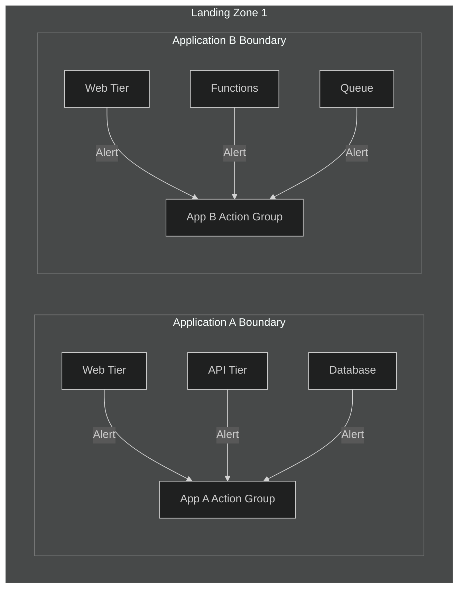

#### Tag-Based Application Scoping

Use Azure resource tags to define application boundaries:

| Tag | Purpose | Example Values |
|-----|---------|----------------|
| `Application` | Application identifier | `OrderProcessing`, `CustomerPortal` |
| `ApplicationOwner` | Team/email for notifications | `orders-team@contoso.com` |
| `ApplicationTier` | Component tier | `Web`, `API`, `Data`, `Integration` |
| `DependsOn` | Parent application dependency | `CoreAPI`, `SharedDB` |

#### Alert Processing Rule for Application Containment

```bicep
// Route alerts only to the application-specific team
resource appContainmentRule 'Microsoft.AlertsManagement/actionRules@2023-05-01-preview' = {
  name: 'apr-app-${applicationName}-containment'
  location: 'global'
  properties: {
    scopes: [subscription().id]
    conditions: [
      {
        field: 'TargetResourceTags'
        operator: 'Contains'
        values: ['Application:${applicationName}']
      }
    ]
    actions: [
      {
        actionType: 'AddActionGroups'
        actionGroupIds: [applicationActionGroup.id]
      }
    ]
    description: 'Route all ${applicationName} alerts to the application team only'
  }
}
```

#### Dependency Alert Correlation (Balanced Approach)

> **Design Choice**: Instead of fully suppressing dependent alerts (`RemoveAllActionGroups`), we use a **correlation pattern** that:
> 1. Still records the alert (visible in portal/logs)
> 2. Routes to a **reduced notification channel** (e.g., dashboard-only or low-priority queue)
> 3. Includes parent alert context for correlation

```bicep
// Option 1: Route dependent alerts to low-priority channel (RECOMMENDED)
// Alerts are NOT suppressed - just routed differently when parent is down
resource dependencyCorrelationRule 'Microsoft.AlertsManagement/actionRules@2023-05-01-preview' = {
  name: 'apr-correlate-dependent-${applicationName}'
  location: 'global'
  properties: {
    scopes: [subscription().id]
    conditions: [
      {
        field: 'TargetResourceTags'
        operator: 'Contains'
        values: ['DependsOn:${parentApplicationName}']
      }
    ]
    actions: [
      {
        actionType: 'AddActionGroups'
        actionGroupIds: [lowPriorityActionGroup.id]  // Dashboard/logging only, no phone/SMS
      }
    ]
    description: 'Route dependent app alerts to low-priority channel during parent outage'
    enabled: false  // Enabled dynamically when parent alert fires
  }
}

// Option 2: Full suppression (USE WITH CAUTION - only for known cascading failures)
resource dependencySuppressionRule 'Microsoft.AlertsManagement/actionRules@2023-05-01-preview' = {
  name: 'apr-suppress-dependent-${applicationName}'
  location: 'global'
  properties: {
    scopes: [subscription().id]
    conditions: [
      {
        field: 'TargetResourceTags'
        operator: 'Contains'
        values: ['DependsOn:${parentApplicationName}']
      }
      {
        field: 'Severity'
        operator: 'Equals'
        values: ['Sev3', 'Sev4']  // Only suppress low-severity, keep Sev0-2 visible
      }
    ]
    actions: [
      {
        actionType: 'RemoveAllActionGroups'
      }
    ]
    description: 'Suppress LOW severity dependent alerts only during parent outage'
    enabled: false
  }
}
```

| Approach | Pros | Cons | Best For |
|----------|------|------|----------|
| **Correlation (Option 1)** | Alerts visible, just quieter | Requires low-priority Action Group | Most scenarios |
| **Suppression (Option 2)** | Reduces noise significantly | Alerts hidden completely | Known cascade patterns only |
| **Severity Filter** | Critical alerts still reach team | More complex rule | Production environments |

#### Parent-Child Dependency Suppression

When a parent application component fails, suppress alerts from dependent child components to avoid alert storms:

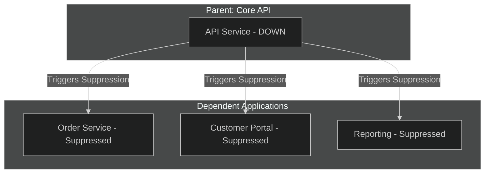

**Logic App for Dynamic Suppression:**

> **How it works**: This Logic App is triggered when a parent application alert fires. It automatically enables the suppression rule for dependent apps, waits for recovery, then re-enables their alerts.

```
┌─────────────────────────────────────────────────────────────────────────────┐
│  LOGIC APP WORKFLOW: Dynamic Dependency Suppression                         │
├─────────────────────────────────────────────────────────────────────────────┤
│                                                                             │
│  1️⃣ TRIGGER: Parent Alert Fires                                            │
│     └─> Action Group calls this Logic App when Core API goes DOWN           │
│                                                                             │
│  2️⃣ STEP 1: Enable Suppression Rule                                        │
│     └─> PATCH API call sets "enabled: true" on the suppression rule         │
│     └─> Dependent apps (Order, Portal, Reporting) stop sending alerts       │
│                                                                             │
│  3️⃣ STEP 2: Wait for Recovery                                              │
│     └─> Pause for 15 minutes (configurable)                                 │
│     └─> Gives time for parent to recover before re-enabling alerts          │
│                                                                             │
│  4️⃣ STEP 3: Re-Enable Child Alerts                                         │
│     └─> PATCH API call sets "enabled: false" on the suppression rule        │
│     └─> Dependent apps resume normal alerting                               │
│                                                                             │
└─────────────────────────────────────────────────────────────────────────────┘
```

```json
{
  "actions": {
    "When_Parent_Alert_Fires": {
      // STEP 1: Enable the suppression rule for dependent apps
      // This stops notifications from Order, Portal, Reporting services
      "type": "ApiConnection",
      "inputs": {
        "method": "PATCH",
        "uri": "https://management.azure.com/subscriptions/{subscriptionId}/resourceGroups/{rg}/providers/Microsoft.AlertsManagement/actionRules/apr-suppress-dependent-{parentApp}?api-version=2023-05-01-preview",
        "body": {
          "properties": {
            "enabled": true
          }
        }
      }
    },
    "Wait_For_Parent_Recovery": {
      // STEP 2: Wait before re-enabling alerts
      // Adjust the interval based on typical recovery time
      "type": "Wait",
      "inputs": {
        "interval": {
          "count": 15,
          "unit": "Minute"
        }
      }
    },
    "Re_Enable_Child_Alerts": {
      // STEP 3: Disable the suppression rule (re-enable alerts)
      // Dependent apps resume normal alerting behavior
      "type": "ApiConnection",
      "inputs": {
        "method": "PATCH",
        "uri": "https://management.azure.com/subscriptions/{subscriptionId}/resourceGroups/{rg}/providers/Microsoft.AlertsManagement/actionRules/apr-suppress-dependent-{parentApp}?api-version=2023-05-01-preview",
        "body": {
          "properties": {
            "enabled": false
          }
        }
      }
    }
  }
}
```

> **💡 Tip**: For production, add a "Check_Parent_Health" step before re-enabling alerts to verify the parent is actually recovered, not just timed out.
```

#### Application Boundary KQL Query

Identify all resources within an application boundary:

```kql
// List all resources for a specific application
Resources
| where tags.Application == "OrderProcessing"
| project 
    ResourceName = name,
    ResourceType = type,
    Tier = tostring(tags.ApplicationTier),
    DependsOn = tostring(tags.DependsOn),
    Owner = tostring(tags.ApplicationOwner)
| order by Tier asc

// Find all applications that depend on a specific parent
Resources
| where tags.DependsOn == "CoreAPI"
| summarize 
    DependentApps = make_set(tags.Application),
    ResourceCount = count()
```

#### Alert Containment Patterns

| Pattern | Description | Use Case |
|---------|-------------|----------|
| **Application Isolation** | Each app has its own action group | Default for all applications |
| **Tier-Based Grouping** | Web/API/Data tiers grouped separately | Large applications with specialized teams |
| **Dependency Suppression** | Parent failure suppresses child alerts | Microservices, API-dependent apps |
| **Blast Radius Limiting** | Cap max alerts per app per hour | Prevent alert storms during major outages |

#### Blast Radius Limiting

Prevent excessive alerts during major outages:

```bicep
// Alert with rate limiting
resource rateLimitedAlert 'Microsoft.Insights/scheduledQueryRules@2023-03-15-preview' = {
  name: 'alert-${appName}-ratelimited'
  location: location
  properties: {
    displayName: '${appName} - Rate Limited Alert'
    severity: 2
    enabled: true
    evaluationFrequency: 'PT5M'
    windowSize: 'PT15M'
    scopes: [lawId]
    criteria: {
      allOf: [
        {
          query: '''
            // Only alert if we haven't alerted in the last hour
            let recentAlerts = AlertsManagementResources
              | where properties.essentials.targetResource contains "${appName}"
              | where properties.essentials.startDateTime > ago(1h)
              | count;
            Perf
            | where ObjectName == "Processor"
            | where CounterValue > 95
            | where Computer has "${appName}"
            | where recentAlerts < 5  // Max 5 alerts per app per hour
          '''
          timeAggregation: 'Count'
          operator: 'GreaterThan'
          threshold: 0
        }
      ]
    }
    muteActionsDuration: 'PT1H'  // Mute for 1 hour after firing
    actions: {
      actionGroups: [appActionGroupId]
    }
  }
}
```

### 5.5 Risk-Based Alerting

Risk-based alerting prioritizes alerts based on **business impact and criticality** rather than purely technical thresholds. This approach integrates with rule-based alerting to ensure critical business systems receive appropriate attention.

#### Business Criticality Classification

| Criticality Level | Definition | Example Systems | Response Target |
|-------------------|------------|-----------------|-----------------|
| **Tier 0 - Critical** | Core business systems, revenue-impacting | Payment processing, core APIs | < 5 min response |
| **Tier 1 - High** | Customer-facing services | Web portals, mobile backends | < 15 min response |
| **Tier 2 - Medium** | Internal business operations | Reporting, analytics | < 1 hour response |
| **Tier 3 - Low** | Development, testing environments | Dev/QA systems | Next business day |

#### Risk-Based Alert Severity Mapping

> **Logic**: Criticality Tier + Threshold Breach = Resulting Severity

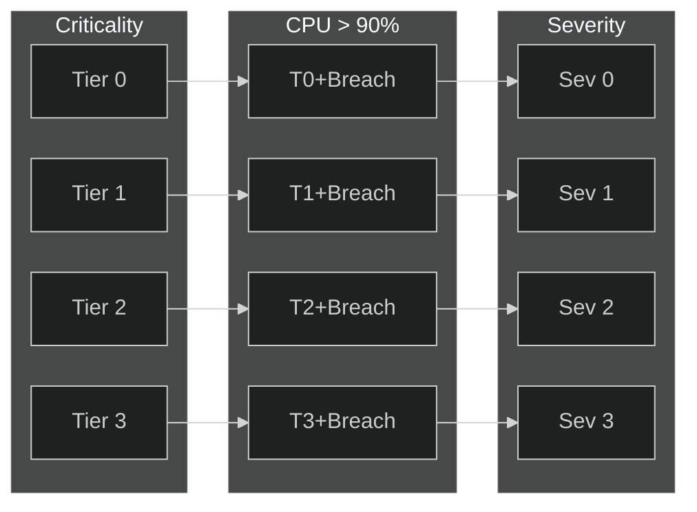

| Tier | Criticality | + Threshold Breach | = Severity | Action |
|------|-------------|-------------------|------------|--------|
| **Tier 0** | Critical | CPU > 90% | **Sev 0** | Phone + P1 |
| **Tier 1** | High | CPU > 90% | **Sev 1** | Page + P2 |
| **Tier 2** | Medium | CPU > 90% | **Sev 2** | Email |
| **Tier 3** | Low | CPU > 90% | **Sev 3** | Dashboard |

**Example**: Same CPU > 90% threshold, different outcomes based on resource criticality.

#### Criticality-Based Threshold Adjustment

| Metric | Tier 0 Threshold | Tier 1 Threshold | Tier 2 Threshold | Tier 3 Threshold |
|--------|------------------|------------------|------------------|------------------|
| **CPU Utilization** | > 80% for 2 min | > 85% for 5 min | > 90% for 10 min | > 95% for 15 min |
| **Memory Usage** | > 75% for 2 min | > 80% for 5 min | > 85% for 10 min | > 90% for 15 min |
| **Error Rate** | > 0.1% | > 0.5% | > 1% | > 5% |
| **Response Time (P95)** | > 500 ms | > 1 sec | > 3 sec | > 10 sec |
| **Availability** | < 99.99% | < 99.9% | < 99.5% | < 99% |

#### Risk Score Calculation

Combine technical severity with business criticality for a composite risk score:

```
Risk Score = Technical Severity × Criticality Weight × Impact Factor

Where:
- Technical Severity: 1 (Low) to 4 (Critical) based on threshold breach
- Criticality Weight: Tier 0=4, Tier 1=3, Tier 2=2, Tier 3=1
- Impact Factor: 1.0 (isolated) to 2.0 (widespread/cascading)
```

| Risk Score | Classification | Action |
|------------|----------------|--------|
| **24-32** | Critical | Immediate escalation, war room |
| **16-23** | High | Page on-call, 15 min response |
| **8-15** | Medium | Email notification, ticket creation |
| **1-7** | Low | Dashboard update, batch reporting |

#### Implementing Risk-Based Alerting with Tags

Use Azure resource tags to drive risk-based alerting:

```bicep
// Tag-based alert processing rule for critical systems
resource criticalAlertRule 'Microsoft.AlertsManagement/actionRules@2021-08-08' = {
  name: 'apr-critical-systems'
  location: 'global'
  properties: {
    scopes: [subscription().id]
    conditions: [
      {
        field: 'TargetResourceTags'
        operator: 'Contains'
        values: ['BusinessCriticality:Tier0']
      }
    ]
    actions: [
      {
        actionType: 'AddActionGroups'
        actionGroupIds: [criticalActionGroup.id]
      }
    ]
  }
}
```

#### Integration: Rule-Based + Risk-Based

| Alert Type | Rule-Based Component | Risk-Based Modifier |
|------------|---------------------|---------------------|
| **VM CPU Alert** | Threshold: > 90% for 5 min | Tier 0 → Sev 0, Tier 3 → Sev 3 |
| **API Latency** | P95 > 1 second | Payment API → Sev 0, Dev API → Sev 4 |
| **Error Rate** | > 1% error rate | Customer-facing → escalate immediately |
| **Disk Space** | < 10% free space | Database servers → Sev 1, test VMs → Sev 4 |

---

## 6. Azure Monitor Baseline Alerts (AMBA)

AMBA provides a **policy-driven approach** to deploying baseline alerts across Azure Landing Zones.

### 6.1 AMBA Deployment Architecture

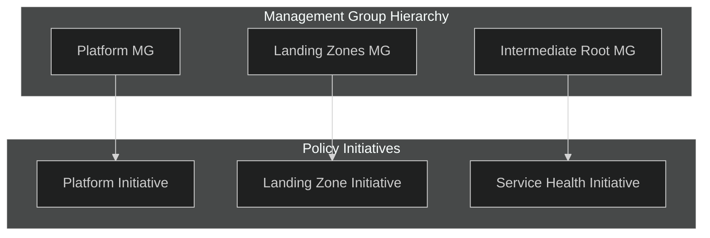

### 6.2 AMBA Coverage

| Resource Type | Alert Categories |
|--------------|------------------|
| **ExpressRoute** | Circuit, Gateway, Connection metrics |
| **Azure Firewall** | Throughput, Health, SNAT port utilization |
| **Virtual Network** | Gateway, NSG flow, DDoS protection |
| **Virtual WAN** | Hub, VPN Gateway, ExpressRoute Gateway |
| **Log Analytics Workspace** | Ingestion rate, Query throttling |
| **Key Vault** | Availability, Latency, Saturation |
| **Virtual Machine** | CPU, Memory, Disk, Network |
| **Storage Account** | Availability, Latency, Capacity |

### 6.3 AMBA Deployment Options

| Option | Description | Pros | Cons |
|--------|-------------|------|------|
| **Azure Portal** | Guided deployment via ALZ Accelerator | Easy, visual | Less repeatable |
| **Bicep** | IaC deployment with parameter files | Repeatable, version-controlled | Requires IaC knowledge |
| **Terraform** | IaC deployment with Terraform modules | Repeatable, state management | Terraform expertise needed |
| **Azure DevOps/GitHub Actions** | CI/CD pipeline deployment | Automated, consistent | Pipeline setup required |

### 6.4 AMBA Implementation Strategies

> **Common Question**: *"How is this done in other organizations - Centralized Rollout vs Golden Templates?"*

#### Strategy Comparison

| Strategy | Description | Pros | Cons |
|----------|-------------|------|------|
| **A: Centralized Rollout** | Platform team deploys baseline alerts for all LZs where resource type exists | Consistent coverage, central control, faster time-to-value | May create initial noise, less flexibility per team |
| **B: Golden Templates** | Recommend LZ teams auto-deploy baseline alerts when deploying resources via Golden Templates | Team ownership, contextual deployment, self-service | Adoption risk, potentially inconsistent coverage |
| **C: Hybrid (Recommended)** | Central mandatory baseline + optional enhanced via templates | Balance of governance and flexibility, progressive adoption | More complex to manage initially |

#### Industry Patterns

| Company Profile | Recommended Strategy | Rationale |
|----------------|---------------------|------------|
| **Highly Regulated** (Finance, Healthcare) | Centralized Rollout | Compliance requires consistent coverage, audit requirements |
| **Tech-Savvy DevOps** | Golden Templates | Teams capable of self-service, prefer autonomy |
| **Mixed Maturity** | Hybrid | Some teams need guidance, others want flexibility |
| **Startup/Fast-Moving** | Golden Templates | Speed over consistency, iterate quickly |

#### Decision Framework

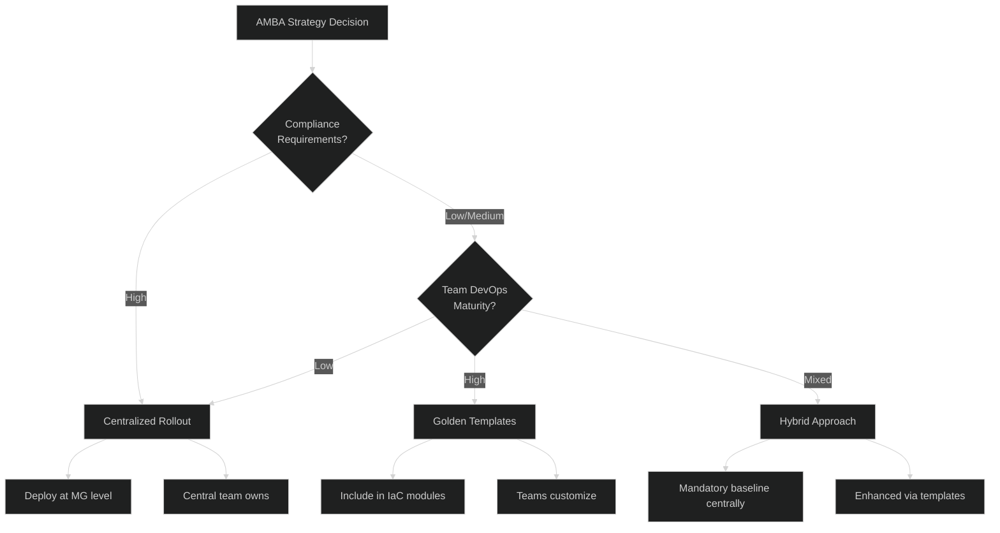

#### Hybrid Implementation Pattern

**Phase 1: Mandatory Baseline (Centralized)**
- Deploy AMBA at Management Group level
- Cover: Service Health, Resource Health, Platform resources
- Central team manages and tunes

**Phase 2: Enhanced Alerts (Golden Templates)**
- Application-specific alerts in deployment templates
- Teams can opt-in to enhanced monitoring
- Self-service customization within guardrails

```bicep
// Golden Template pattern - include monitoring in resource deployment
module vmWithMonitoring './vm-monitored.bicep' = {
  name: 'vm-${vmName}'
  params: {
    vmName: vmName
    // Standard VM parameters...
    
    // Monitoring integration
    enableBaselineAlerts: true  // Opt-in to enhanced alerts
    alertActionGroupId: actionGroupId
    customAlertThresholds: {
      cpuThreshold: 85  // Team-specific override
      memoryThreshold: 80
    }
  }
}
```

---

## 7. Observability Control Panel

### 7.1 Dashboard Architecture

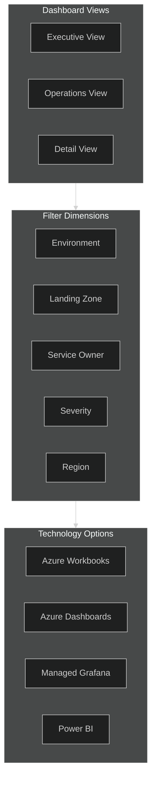

**Visualization Tool Selection Guide:**

| Tool | Best For | Audience | Access Requirement |
|------|----------|----------|-------------------|
| **Azure Workbooks** | Deep investigation, KQL-based analysis | Platform Team, SREs | Azure Portal access |
| **Azure Dashboards** | Quick operational overview, pinned tiles | Operations Team | Azure Portal access |
| **Managed Grafana** | Prometheus integration, multi-cloud views | DevOps, SREs | Grafana workspace access |
| **Power BI** | Executive dashboards, cross-org reporting | Leadership, Security, WinObs, Identity | Microsoft 365 license (no Azure Portal needed) |

> 💡 **Power BI Use Case:** For stakeholders who don't have Azure Portal access (WinObs team, Security, Identity, leadership), Power BI provides rich visualization through the Azure Monitor Logs connector. Data can flow via:
> - **Direct Query**: Live connection to Log Analytics Workspace
> - **Data Export**: Scheduled export to Storage Account → Power BI import
> - **Azure Data Explorer**: LAW → ADX cluster → Power BI for high-volume analytics

### 7.2 Workbook Templates

| Workbook | Purpose | Key Metrics |
|----------|---------|-------------|
| **Platform Health** | Overall ALZ health | Service Health, Resource Health, Alert counts |
| **VM Performance** | Virtual machine metrics | CPU, Memory, Disk, Network |
| **Storage Analytics** | Storage account health | Availability, Latency, Capacity |
| **Network Insights** | Network monitoring | ExpressRoute, Firewall, VPN |
| **Cost Overview** | Log ingestion costs | GB/day by workspace, resource type |

---

## 8. Security & Access Control

### 8.1 RBAC Model

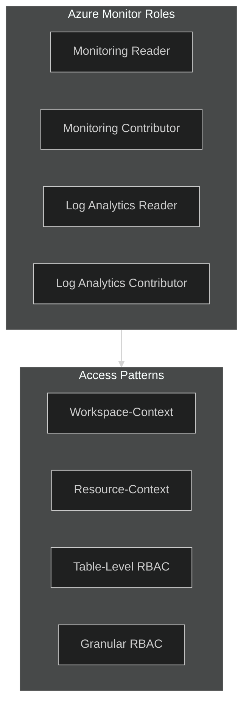

### 8.2 Access Control Matrix

| Team | Workspace Access | Table Access | Resource Access |
|------|-----------------|--------------|-----------------|
| **Platform Team** | Full | All tables | All resources |
| **Security Team** | Full | SecurityEvent, AuditLogs | All resources |
| **LZ Team A** | Resource-context | Own resources | LZ-A resources only |
| **LZ Team B** | Resource-context | Own resources | LZ-B resources only |
| **Auditors** | Read-only | AuditLogs, ActivityLog | Read-only all |

---

## 9. Next Steps

| Document | Purpose |
|----------|---------|
| [02-operations-runbook.md](./02-operations-runbook.md) | Operations, KQL queries, DCR patterns, troubleshooting |
| [03-advanced-topics.md](./03-advanced-topics.md) | DR, audit logs, cost optimization, AI integration |

---

## 10. References

- [Azure Monitor Baseline Alerts (AMBA)](https://azure.github.io/azure-monitor-baseline-alerts/)
- [Azure Monitor Data Collection Rules](https://learn.microsoft.com/en-us/azure/azure-monitor/essentials/data-collection-rule-overview)
- [Azure Monitor Agent Overview](https://learn.microsoft.com/en-us/azure/azure-monitor/agents/azure-monitor-agent-overview)
- [Log Analytics Workspace Design](https://learn.microsoft.com/en-us/azure/azure-monitor/logs/workspace-design)
- [Alert Processing Rules](https://learn.microsoft.com/en-us/azure/azure-monitor/alerts/alerts-processing-rules)
- [Azure Landing Zone Monitoring](https://learn.microsoft.com/en-us/azure/cloud-adoption-framework/ready/landing-zone/design-area/management-monitor)

---

*Document generated as part of the Unified Monitoring Solution workshop preparation.*
