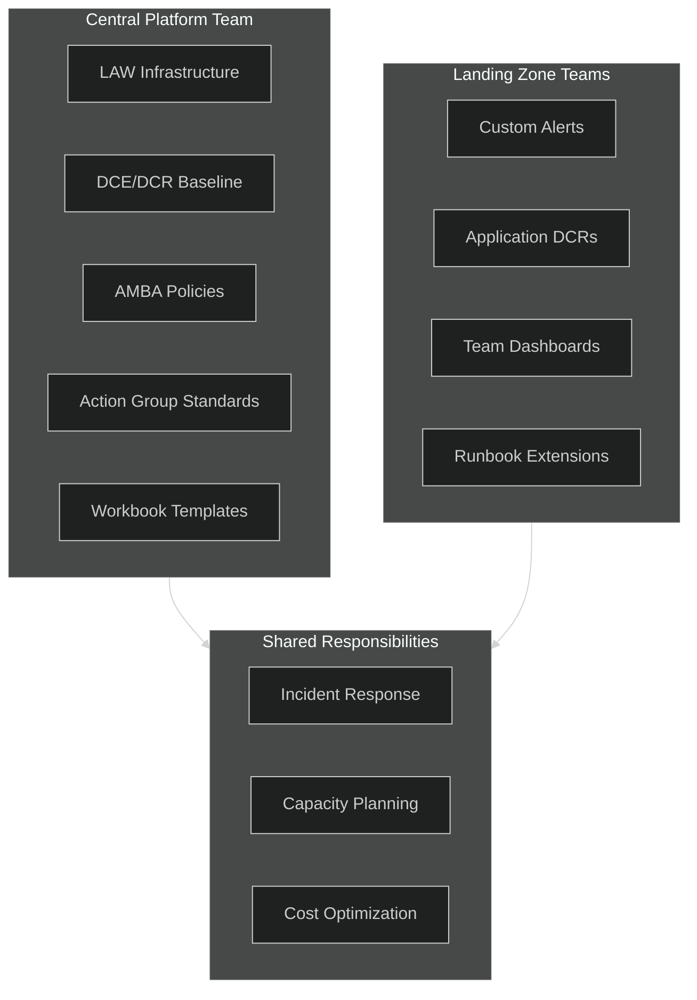
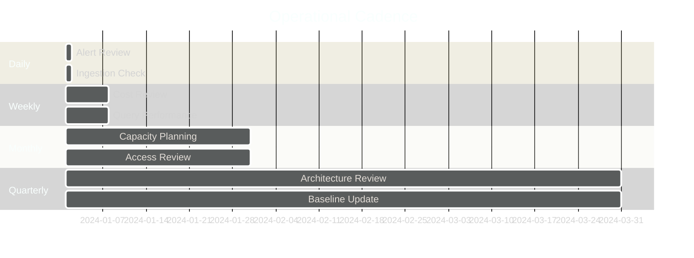
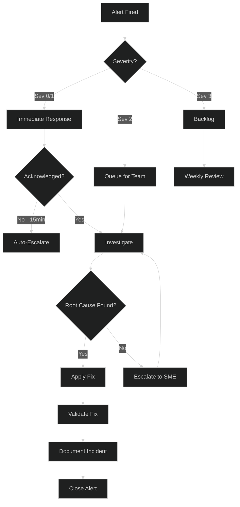
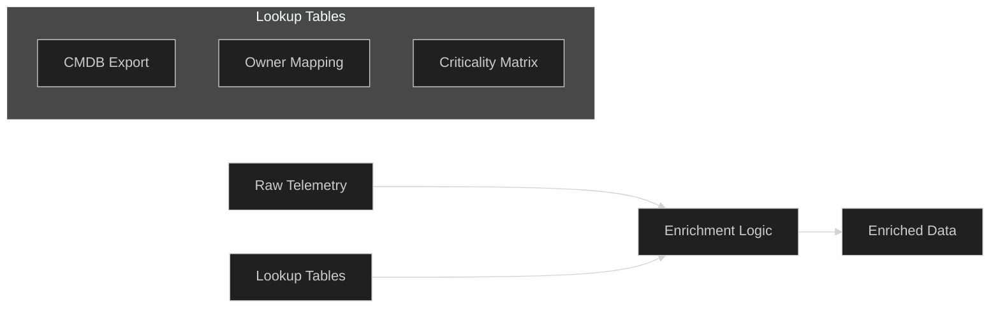
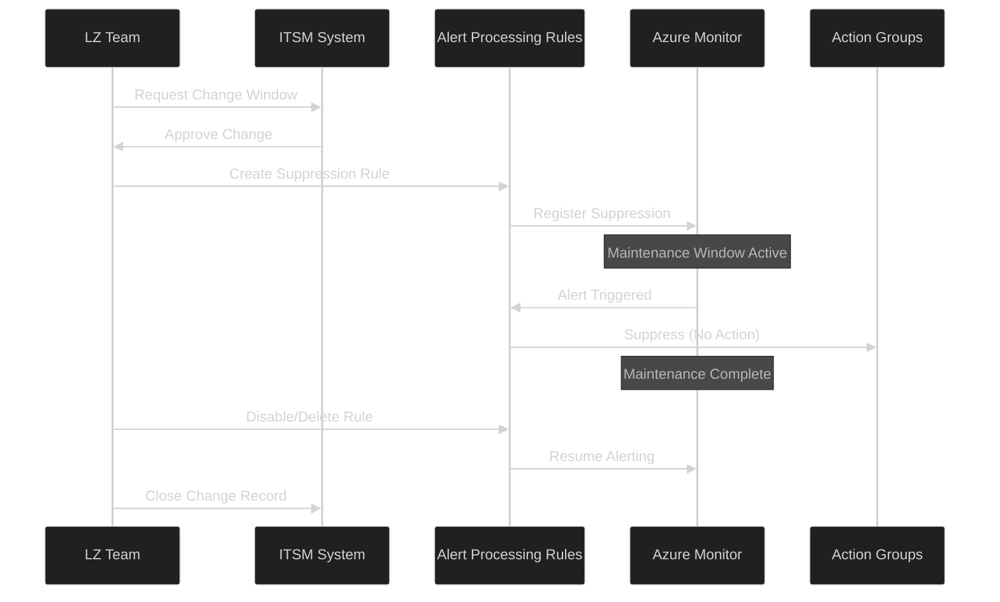
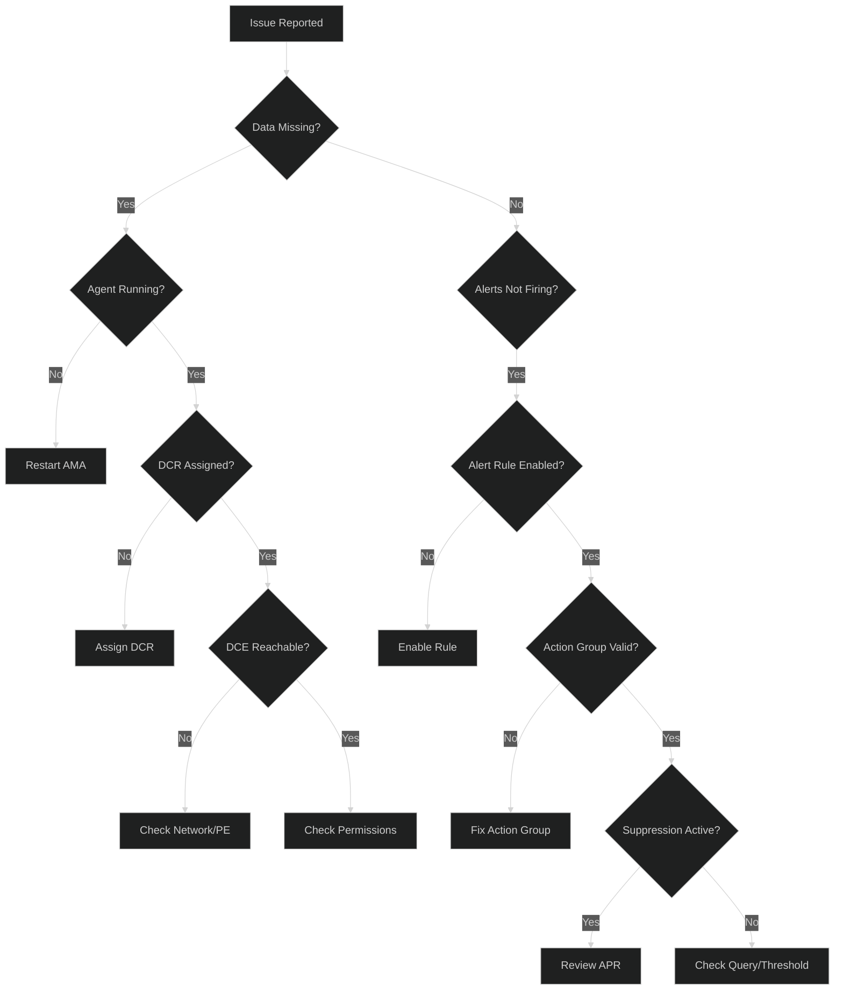
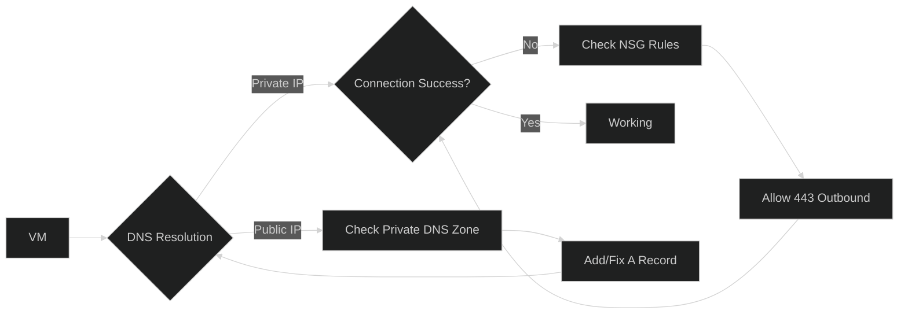
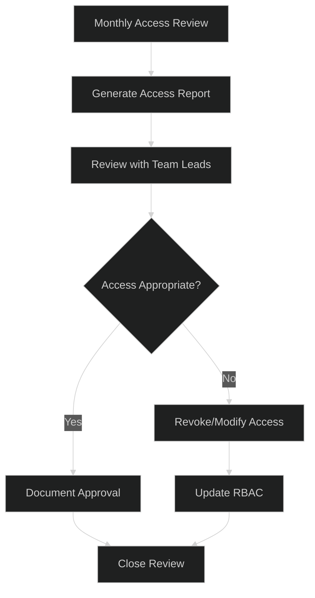

# Unified Monitoring Solution - Operations Runbook

> **Version**: 1.0  
> **Last Updated**: January 2026 (Workshop Edition)  
> **Purpose**: Day-2 operations, alerting procedures, KQL queries, and troubleshooting guides
>
> **Feature Availability Legend**: ✅ GA | ⚠️ Preview | 📍 Planned

| 📚 **Quick Navigation** | [README](./README.md) | [Architecture](./01-architecture-overview.md) | **Operations Runbook** | [Advanced Topics](./03-advanced-topics.md) |
|---|---|---|---|---|

---

## 📖 How to Use This Document

This **Operations Runbook** provides the **"How"** (practical implementation, KQL queries, troubleshooting).  
The **Architecture** document provides the **"What & Why"** (theory, design decisions, patterns).

### Practice ↔ Theory Cross-Reference

| Operations Topic | Architecture Counterpart | Description |
|-----------------|-------------------------|-------------|
| [1. Operations Overview](#1-operations-overview) | [3. Federated Model](./01-architecture-overview.md#3-federated-monitoring-model) | Day-2 responsibilities ← Governance model |
| [2. Alert Response](#2-alert-response-procedures) | [5. Landing Zone Alerting](./01-architecture-overview.md#5-landing-zone-scoped-alerting) | Alert response ← Alert design |
| [3. KQL Query Library](#3-kql-query-library) | — | Ready-to-use queries (no architecture counterpart) |
| [4. Federated Visibility](#4-federated-visibility-operations) | [3.4 Federated Visibility](./01-architecture-overview.md#34-federated-visibility-architecture) | Cross-subscription visibility ← Federated architecture |
| [5. Maintenance Windows](#5-maintenance-window-management) | [6. AMBA](./01-architecture-overview.md#6-azure-monitor-baseline-alerts-amba) | Suppression ← Baseline alerts |
| [6. Troubleshooting Guide](#6-troubleshooting-guide) | [4. Core Components](./01-architecture-overview.md#4-core-components-deep-dive) | Troubleshooting ← Component design |
| [7. RBAC Operations](#7-rbac-operations) | [8. Security & Access](./01-architecture-overview.md#8-security--access-control) | Access management ← RBAC design |
| [8. Cost Monitoring](#8-cost-monitoring--optimization) | [Advanced Topics: Cost](./03-advanced-topics.md#4-cost-optimization-deep-dive) | Quick reference → Deep-dive in Advanced |

---

## Table of Contents

1. [Operations Overview](#1-operations-overview)
2. [Alert Response Procedures](#2-alert-response-procedures)
3. [KQL Query Library](#3-kql-query-library)
4. [Federated Visibility Operations](#4-federated-visibility-operations)
5. [Maintenance Window Management](#5-maintenance-window-management)
6. [Troubleshooting Guide](#6-troubleshooting-guide)
7. [RBAC Operations](#7-rbac-operations)
8. [Cost Monitoring & Optimization](#8-cost-monitoring--optimization)
9. [Runbook Templates](#9-runbook-templates)

---

## 1. Operations Overview

### 1.1 Operations Model

The Unified Monitoring Solution follows a **shared responsibility model** aligned with the federated architecture:



### 1.2 Responsibility Matrix (RACI)

| Activity | Central Team | Landing Zone | Security | FinOps |
|----------|--------------|--------------|----------|--------|
| LAW Infrastructure | R/A | I | C | I |
| DCR Baseline | R/A | C | C | I |
| Custom DCRs | C | R/A | C | I |
| AMBA Policies | R/A | I | C | I |
| Custom Alerts | C | R/A | I | I |
| Incident Response | C | R/A | C | I |
| Cost Optimization | C | C | I | R/A |
| Access Reviews | C | R | A | I |

**Legend**: R = Responsible, A = Accountable, C = Consulted, I = Informed

### 1.3 Operational Cadence



---

## 2. Alert Response Procedures

### 2.1 Alert Severity Classification

| Severity | Response Time | Escalation Path | Examples |
|----------|---------------|-----------------|----------|
| **Sev 0 - Critical** | 15 min | On-call → Manager → Director | Service outage, Data loss |
| **Sev 1 - High** | 1 hour | On-call → Team Lead | Performance degradation, Availability < 99% |
| **Sev 2 - Medium** | 4 hours | Team queue | Threshold warnings, Capacity alerts |
| **Sev 3 - Low** | 24 hours | Backlog | Informational, Optimization opportunities |

### 2.2 Alert Response Workflow



### 2.3 Common Alert Response Actions

#### VM Availability Alert
```powershell
# Check VM status
az vm get-instance-view --name <vm-name> --resource-group <rg-name> --query "instanceView.statuses[1].displayStatus"

# Check recent boot diagnostics
az vm boot-diagnostics get-boot-log --name <vm-name> --resource-group <rg-name>

# Restart VM if needed
az vm restart --name <vm-name> --resource-group <rg-name>
```

#### High CPU Alert
```powershell
# Get process details from guest metrics
az monitor metrics list --resource <vm-resource-id> \
    --metric "Percentage CPU" \
    --start-time (Get-Date).AddHours(-1).ToString("yyyy-MM-ddTHH:mm:ssZ") \
    --end-time (Get-Date).ToString("yyyy-MM-ddTHH:mm:ssZ") \
    --interval PT5M
```

#### Log Analytics Ingestion Alert
```powershell
# Check ingestion latency
az monitor log-analytics workspace show --workspace-name <law-name> --resource-group <rg-name>

# Query ingestion health
# Use KQL from Section 3.4
```

### 2.4 Actionable Alerts - Including Remediation Steps

> **Best Practice**: *"Make every notification actionable - alert contains sufficient information to act"*

#### Embedding Remediation Guidance in Alerts

Use alert rule descriptions and custom properties to include remediation steps directly in notifications:

```bicep
resource actionableAlert 'Microsoft.Insights/scheduledQueryRules@2023-03-15-preview' = {
  name: 'alert-vm-cpu-critical'
  location: location
  properties: {
    displayName: 'VM CPU Critical - Actionable'
    description: '''
    ## Alert: VM CPU Critical
    **Impact**: Application performance degradation
    
    ### Immediate Actions:
    1. Check process consuming CPU: `Get-Process | Sort-Object CPU -Descending | Select -First 10`
    2. Review recent deployments in the last 24 hours
    3. Check for runaway processes or memory leaks
    
    ### Escalation:
    - If not resolved in 15 min → Escalate to App Team Lead
    - If widespread → Engage Platform Team
    
    ### Runbook: [VM CPU Troubleshooting](https://wiki.contoso.com/runbooks/vm-cpu)
    '''
    severity: 1
    enabled: true
    evaluationFrequency: 'PT5M'
    scopes: [lawId]
    windowSize: 'PT15M'
    criteria: {
      allOf: [
        {
          query: '''
            Perf
            | where ObjectName == "Processor" and CounterName == "% Processor Time"
            | where CounterValue > 95
            | summarize AvgCPU = avg(CounterValue) by Computer, bin(TimeGenerated, 5m)
            | where AvgCPU > 95
          '''
          timeAggregation: 'Count'
          operator: 'GreaterThan'
          threshold: 0
        }
      ]
    }
    actions: {
      actionGroups: [actionGroupId]
      customProperties: {
        RunbookURL: 'https://wiki.contoso.com/runbooks/vm-cpu'
        EscalationPath: 'AppTeam → PlatformTeam → OnCall'
        ExpectedRTO: '15 minutes'
        Severity: 'P1'
      }
    }
  }
}
```

#### Alert Template with Remediation Context

| Alert Field | Purpose | Example |
|-------------|---------|--------|
| **displayName** | Clear, actionable title | "VM CPU Critical - Scale Up Required" |
| **description** | Step-by-step remediation | Markdown with numbered steps |
| **customProperties.RunbookURL** | Link to detailed runbook | Wiki/Confluence link |
| **customProperties.EscalationPath** | Who to contact if unresolved | "L1 → L2 → Manager" |
| **customProperties.ExpectedRTO** | Resolution timeframe | "15 minutes" |

#### Action Group with Rich Notifications

```bicep
resource richActionGroup 'Microsoft.Insights/actionGroups@2023-01-01' = {
  name: 'ag-rich-notifications'
  location: 'global'
  properties: {
    groupShortName: 'RichNotify'
    enabled: true
    emailReceivers: [
      {
        name: 'ops-team'
        emailAddress: 'ops@contoso.com'
        useCommonAlertSchema: true  // Enables rich formatting
      }
    ]
    webhookReceivers: [
      {
        name: 'teams-webhook'
        serviceUri: teamsWebhookUrl
        useCommonAlertSchema: true
        useAadAuth: false
      }
    ]
    logicAppReceivers: [
      {
        name: 'enrichment-logic-app'
        resourceId: enrichmentLogicAppId
        callbackUrl: enrichmentLogicAppCallbackUrl
        useCommonAlertSchema: true
      }
    ]
  }
}
```

### 2.5 Alert Suppression During Maintenance

Use Alert Processing Rules to suppress alerts during planned maintenance:

```bicep
// Reference: See Section 7.4 DCR Transformation Patterns for Cost Optimization
resource maintenanceSuppressionRule 'Microsoft.AlertsManagement/actionRules@2023-05-01-preview' = {
  name: 'suppress-${maintenanceWindow.name}'
  location: 'Global'
  properties: {
    scopes: [
      resourceGroup().id
    ]
    conditions: [
      {
        field: 'TargetResourceGroup'
        operator: 'Equals'
        values: [maintenanceWindow.targetResourceGroup]
      }
    ]
    schedule: {
      effectiveFrom: maintenanceWindow.startTime
      effectiveUntil: maintenanceWindow.endTime
      timeZone: 'UTC'
    }
    actions: [
      {
        actionType: 'RemoveAllActionGroups'
      }
    ]
    enabled: true
  }
}
```

### 2.6 Alert Suppression & Correlation

> **Common Challenge**: *"Avoiding alert storms, correlating related alerts"*

#### Alert Storm Prevention

| Technique | Description | Implementation |
|-----------|-------------|----------------|
| **Aggregation** | Group similar alerts into single notification | Use `muteActionsDuration` in alert rules |
| **Throttling** | Limit notification frequency | Set `autoMitigate: false` + longer evaluation window |
| **Dependency-Based** | Suppress child alerts when parent is down | Use Alert Processing Rules with conditions |
| **Smart Grouping** | Group by resource, severity, or alert type | Configure in Action Group settings |

#### Alert Aggregation Example

```bicep
resource aggregatedAlert 'Microsoft.Insights/scheduledQueryRules@2023-03-15-preview' = {
  name: 'alert-multiple-vm-cpu'
  location: location
  properties: {
    displayName: 'Multiple VMs High CPU'
    severity: 2
    enabled: true
    evaluationFrequency: 'PT5M'
    windowSize: 'PT15M'
    scopes: [lawId]
    criteria: {
      allOf: [
        {
          query: '''
            Perf
            | where ObjectName == "Processor" and CounterName == "% Processor Time"
            | where CounterValue > 90
            | summarize AvgCPU = avg(CounterValue), AffectedVMs = dcount(Computer) by bin(TimeGenerated, 5m)
            | where AffectedVMs >= 3  // Only alert if 3+ VMs affected
          '''
          timeAggregation: 'Count'
          operator: 'GreaterThan'
          threshold: 0
        }
      ]
    }
    muteActionsDuration: 'PT30M'  // Mute for 30 min after firing
    actions: {
      actionGroups: [actionGroupId]
    }
  }
}
```

#### Dependency-Based Suppression

Suppress child resource alerts when parent is unhealthy:

```bicep
// Suppress VM alerts when host is down
resource dependencySuppression 'Microsoft.AlertsManagement/actionRules@2023-05-01-preview' = {
  name: 'suppress-vm-when-host-down'
  location: 'global'
  properties: {
    scopes: [subscription().id]
    conditions: [
      {
        field: 'AlertRuleName'
        operator: 'Contains'
        values: ['vm-']  // All VM alerts
      }
    ]
    actions: [
      {
        actionType: 'RemoveAllActionGroups'
      }
    ]
    // Only active when host alert is firing (managed via automation)
    enabled: false  // Toggled by Logic App when host alert fires
  }
}
```

#### Alert Correlation Query

Identify related alerts for root cause analysis:

```kql
// Find correlated alerts within time window
let timeWindow = 15m;
let primaryAlert = "alert-network-latency";
Alerts
| where TimeGenerated > ago(1h)
| where AlertName == primaryAlert
| project PrimaryTime = TimeGenerated, PrimaryResource = ResourceId
| join kind=inner (
    Alerts
    | where TimeGenerated > ago(1h)
    | project AlertName, AlertTime = TimeGenerated, Resource = ResourceId, Severity
) on $left.PrimaryResource == $right.Resource
| where AlertTime between (PrimaryTime - timeWindow .. PrimaryTime + timeWindow)
| where AlertName != primaryAlert
| summarize CorrelatedAlerts = make_set(AlertName), Count = count() by PrimaryResource
| order by Count desc
```

#### Smart Grouping Configuration

| Grouping Strategy | Use Case | Configuration |
|-------------------|----------|---------------|
| **By Resource** | One notification per affected resource | `groupByFields: ['resourceId']` |
| **By Alert Type** | One notification per alert rule | `groupByFields: ['alertRule']` |
| **By Severity** | Critical alerts separate from warnings | `groupByFields: ['severity']` |
| **Combined** | Sophisticated grouping | `groupByFields: ['resourceGroup', 'severity']` |

---

## 3. KQL Query Library

### 3.1 Application Insights Alert Patterns

> **Reference**: Production patterns from enterprise implementations (Fortune 500 deployments)

These alert patterns are battle-tested in production for Function Apps and web applications.

#### HTTP 500 Internal Server Error Alert

```bicep
// Pattern: Alert on any HTTP 500 errors
resource http500Alert 'Microsoft.Insights/metricAlerts@2018-03-01' = {
  name: 'alert-http-500-${serviceName}'
  location: 'global'
  properties: {
    description: '${serviceName} Internal server error, http code 500'
    severity: 2
    enabled: true
    scopes: [appInsightsId]
    evaluationFrequency: 'PT1M'
    windowSize: 'PT5M'
    autoMitigate: true
    criteria: {
      'odata.type': 'Microsoft.Azure.Monitor.SingleResourceMultipleMetricCriteria'
      allOf: [
        {
          criterionType: 'StaticThresholdCriterion'
          name: 'http500'
          metricNamespace: 'microsoft.insights/components'
          metricName: 'requests/count'
          operator: 'GreaterThan'
          threshold: 0
          timeAggregation: 'Count'
          dimensions: [
            {
              name: 'request/resultCode'
              operator: 'Include'
              values: ['500']
            }
          ]
        }
      ]
    }
    actions: [
      {
        actionGroupId: actionGroupId
      }
    ]
  }
}
```

#### Dependency Throttling (HTTP 429) Alert

```bicep
// Pattern: Alert on dependency throttling
resource throttlingAlert 'Microsoft.Insights/metricAlerts@2018-03-01' = {
  name: 'alert-dependency-throttling-${serviceName}'
  location: 'global'
  properties: {
    description: '${serviceName} dependency call returned http code 429 (throttled)'
    severity: 2
    enabled: true
    scopes: [appInsightsId]
    evaluationFrequency: 'PT1M'
    windowSize: 'PT5M'
    autoMitigate: true
    criteria: {
      'odata.type': 'Microsoft.Azure.Monitor.SingleResourceMultipleMetricCriteria'
      allOf: [
        {
          criterionType: 'StaticThresholdCriterion'
          name: 'throttling'
          metricNamespace: 'microsoft.insights/components'
          metricName: 'dependencies/failed'
          operator: 'GreaterThan'
          threshold: 0
          timeAggregation: 'Count'
          dimensions: [
            {
              name: 'dependency/type'
              operator: 'Exclude'
              values: ['INPROC']  // Exclude in-process calls
            }
            {
              name: 'dependency/resultCode'
              operator: 'Include'
              values: ['429']
            }
          ]
        }
      ]
    }
    actions: [
      {
        actionGroupId: actionGroupId
      }
    ]
  }
}
```

#### Server Response Time Exceeded Alert

```bicep
// Pattern: Alert when response time exceeds threshold
resource responseTimeAlert 'Microsoft.Insights/metricAlerts@2018-03-01' = {
  name: 'alert-response-time-${serviceName}'
  location: 'global'
  properties: {
    description: '${serviceName} server response time exceeded 20 seconds'
    severity: 2
    enabled: true
    scopes: [appInsightsId]
    evaluationFrequency: 'PT1M'
    windowSize: 'PT5M'
    autoMitigate: true
    criteria: {
      'odata.type': 'Microsoft.Azure.Monitor.SingleResourceMultipleMetricCriteria'
      allOf: [
        {
          criterionType: 'StaticThresholdCriterion'
          name: 'responseTime'
          metricNamespace: 'microsoft.insights/components'
          metricName: 'requests/duration'
          operator: 'GreaterThan'
          threshold: 20000  // 20 seconds in milliseconds
          timeAggregation: 'Maximum'
        }
      ]
    }
    actions: [
      {
        actionGroupId: actionGroupId
      }
    ]
  }
}
```

#### Server Exceptions Alert

```bicep
// Pattern: Alert on unhandled exceptions
resource exceptionsAlert 'Microsoft.Insights/metricAlerts@2018-03-01' = {
  name: 'alert-exceptions-${serviceName}'
  location: 'global'
  properties: {
    description: '${serviceName} server exceptions detected'
    severity: 2
    enabled: true
    scopes: [appInsightsId]
    evaluationFrequency: 'PT1M'
    windowSize: 'PT5M'
    autoMitigate: true
    criteria: {
      'odata.type': 'Microsoft.Azure.Monitor.SingleResourceMultipleMetricCriteria'
      allOf: [
        {
          criterionType: 'StaticThresholdCriterion'
          name: 'exceptions'
          metricNamespace: 'microsoft.insights/components'
          metricName: 'exceptions/server'
          operator: 'GreaterThan'
          threshold: 0
          timeAggregation: 'Count'
        }
      ]
    }
    actions: [
      {
        actionGroupId: actionGroupId
      }
    ]
  }
}
```

#### Dead Lettering Alert (EventGrid)

```bicep
// Pattern: Alert on EventGrid dead-lettered messages
resource deadLetterAlert 'Microsoft.Insights/metricAlerts@2018-03-01' = {
  name: 'alert-deadletter-${systemTopicName}'
  location: 'global'
  properties: {
    description: 'Dead Lettering Events detected on ${systemTopicName}'
    severity: 2
    enabled: true
    scopes: [eventGridSystemTopicId]
    evaluationFrequency: 'PT1M'
    windowSize: 'PT5M'
    autoMitigate: false  // Don't auto-mitigate - needs investigation
    criteria: {
      'odata.type': 'Microsoft.Azure.Monitor.SingleResourceMultipleMetricCriteria'
      allOf: [
        {
          criterionType: 'StaticThresholdCriterion'
          name: 'deadLetter'
          metricNamespace: 'Microsoft.EventGrid/systemTopics'
          metricName: 'DeadLetteredCount'
          operator: 'GreaterThan'
          threshold: 0
          timeAggregation: 'Total'
        }
      ]
    }
    actions: [
      {
        actionGroupId: actionGroupId
      }
    ]
  }
}
```

#### Alert Patterns Summary Table

| Alert Pattern | Metric | Threshold | AutoMitigate | Severity |
|--------------|--------|-----------|--------------|----------|
| HTTP 500 Errors | requests/count (resultCode=500) | > 0 | Yes | 2 |
| Dependency Throttling (429) | dependencies/failed | > 0 | Yes | 2 |
| Response Time | requests/duration | > 20000ms | Yes | 2 |
| Server Exceptions | exceptions/server | > 0 | Yes | 2 |
| Dead Lettering | DeadLetteredCount | > 0 | No | 2 |
| Storage Timeout | Transactions (ServerTimeoutError) | > 5 | No | 2 |

### 3.2 Resource Health Queries

#### All Resource Health Events (Last 24h)
```kql
AzureActivity
| where TimeGenerated > ago(24h)
| where CategoryValue == "ResourceHealth"
| project TimeGenerated, ResourceGroup, Resource, Level, 
          Status = Properties_d.statusCode, 
          Message = Properties_d.statusMessage
| order by TimeGenerated desc
```

#### VM Availability Summary
```kql
Heartbeat
| where TimeGenerated > ago(1h)
| summarize LastHeartbeat = max(TimeGenerated) by Computer, ResourceGroup
| extend Status = iff(LastHeartbeat < ago(5m), "Offline", "Online")
| summarize 
    TotalVMs = count(),
    OnlineVMs = countif(Status == "Online"),
    OfflineVMs = countif(Status == "Offline")
```

#### Resource Availability by Type
```kql
AzureMetrics
| where TimeGenerated > ago(24h)
| where MetricName == "Availability"
| summarize 
    AvgAvailability = avg(Average),
    MinAvailability = min(Minimum)
    by ResourceProvider, Resource, bin(TimeGenerated, 1h)
| where AvgAvailability < 100
| order by AvgAvailability asc
```

### 3.2 Performance Queries

#### Top 10 CPU Consumers
```kql
Perf
| where TimeGenerated > ago(1h)
| where ObjectName == "Processor" and CounterName == "% Processor Time"
| where InstanceName == "_Total"
| summarize AvgCPU = avg(CounterValue), MaxCPU = max(CounterValue) by Computer
| top 10 by AvgCPU desc
```

#### Memory Pressure Analysis
```kql
Perf
| where TimeGenerated > ago(1h)
| where ObjectName == "Memory" 
| where CounterName in ("% Committed Bytes In Use", "Available MBytes")
| summarize Value = avg(CounterValue) by Computer, CounterName, bin(TimeGenerated, 5m)
| evaluate pivot(CounterName, take_any(Value))
| project TimeGenerated, Computer, 
          MemoryUsedPct = ['% Committed Bytes In Use'],
          AvailableMB = ['Available MBytes']
| where MemoryUsedPct > 80
```

#### Disk I/O Performance
```kql
Perf
| where TimeGenerated > ago(1h)
| where ObjectName == "LogicalDisk"
| where CounterName in ("Disk Reads/sec", "Disk Writes/sec", "Avg. Disk sec/Read", "Avg. Disk sec/Write")
| where InstanceName != "_Total"
| summarize Value = avg(CounterValue) by Computer, InstanceName, CounterName, bin(TimeGenerated, 5m)
| evaluate pivot(CounterName, take_any(Value))
```

### 3.3 Security Queries

#### Failed Sign-in Attempts
```kql
SigninLogs
| where TimeGenerated > ago(24h)
| where ResultType != "0"  // Non-successful
| summarize 
    FailedAttempts = count(),
    DistinctIPs = dcount(IPAddress),
    LastAttempt = max(TimeGenerated)
    by UserPrincipalName, ResultDescription
| where FailedAttempts > 5
| order by FailedAttempts desc
```

#### Security Alert Summary
```kql
SecurityAlert
| where TimeGenerated > ago(7d)
| summarize 
    AlertCount = count(),
    Providers = make_set(ProviderName)
    by AlertSeverity, AlertName
| order by case(
    AlertSeverity == "High", 1,
    AlertSeverity == "Medium", 2,
    AlertSeverity == "Low", 3,
    4
)
```

#### Privileged Operations
```kql
AzureActivity
| where TimeGenerated > ago(24h)
| where Authorization_d.action has_any ("Microsoft.Authorization/roleAssignments", "Microsoft.Authorization/roleDefinitions")
| project TimeGenerated, Caller, OperationName, 
          Action = Authorization_d.action,
          ResourceGroup, Resource
| order by TimeGenerated desc
```

### 3.4 Ingestion Health Queries

#### Data Ingestion Volume by Table
```kql
Usage
| where TimeGenerated > ago(1d)
| summarize 
    IngestionGB = sum(Quantity) / 1024,
    BillableGB = sumif(Quantity, IsBillable) / 1024
    by DataType
| order by IngestionGB desc
| take 20
```

#### Ingestion Latency Analysis
```kql
// Check time between event generation and ingestion
AzureActivity
| where TimeGenerated > ago(1h)
| extend IngestionDelay = TimeGenerated - todatetime(Properties_d.eventTimestamp)
| summarize 
    AvgLatency = avg(IngestionDelay),
    P95Latency = percentile(IngestionDelay, 95),
    MaxLatency = max(IngestionDelay)
    by bin(TimeGenerated, 5m)
```

#### Missing Data Detection
```kql
// Detect gaps in heartbeat data
Heartbeat
| where TimeGenerated > ago(24h)
| summarize HeartbeatCount = count() by Computer, bin(TimeGenerated, 15m)
| where HeartbeatCount < 3  // Expected ~3 per 15min
| order by TimeGenerated desc
```

### 3.5 Cost Analysis Queries

#### Daily Ingestion Cost Estimate
```kql
// Note: Pricing varies by region. Check https://azure.microsoft.com/pricing/details/monitor/
let pricePerGB = 2.30;  // Example: West Europe Pay-As-You-Go (verify current pricing)
Usage
| where TimeGenerated > startofday(ago(30d))
| where IsBillable == true
| summarize DailyGB = sum(Quantity) / 1024 by bin(TimeGenerated, 1d)
| extend EstimatedCost = DailyGB * pricePerGB
| order by TimeGenerated desc
```

#### Top Data Contributors
```kql
Usage
| where TimeGenerated > ago(7d)
| where IsBillable == true
| summarize TotalGB = sum(Quantity) / 1024 by DataType
| order by TotalGB desc
| take 10
| extend CostEstimate = TotalGB * 2.76
```

#### Retention vs Ingestion Analysis
```kql
Usage
| where TimeGenerated > ago(30d)
| where IsBillable == true
| summarize TotalGB = sum(Quantity) / 1024 by DataType
| join kind=inner (
    workspace('LAW-Name').Usage
    | where TimeGenerated > ago(30d)
    | where IsBillable == false
    | summarize RetainedGB = sum(Quantity) / 1024 by DataType
) on DataType
| project DataType, TotalGB, RetainedGB, 
          RetentionRatio = RetainedGB / TotalGB
```

### 3.6 Alert Queries (For Custom Alerts)

#### Service Health Impact Assessment
```kql
ServiceHealth
| where TimeGenerated > ago(7d)
| where Status == "Active"
| project TimeGenerated, Service, Region, 
          ImpactType, Title, Summary,
          AffectedResources = Properties_d.affectedResources
| order by TimeGenerated desc
```

#### Resource Creation/Deletion Tracking
```kql
AzureActivity
| where TimeGenerated > ago(24h)
| where OperationNameValue has_any ("Microsoft.Resources/deployments", "delete")
| where ActivityStatusValue == "Success"
| project TimeGenerated, Caller, OperationName, 
          ResourceGroup, Resource, SubscriptionId
| order by TimeGenerated desc
```

### 3.7 Data Enrichment Logic

> **Blueprint Requirement**: "Define enrichment fields including business context, ownership, criticality. Implement enrichment logic via lookup tables, functions. Automate tagging with tag inheritance and policy-based tagging."

#### 3.7.1 Business Context Enrichment Overview

Data enrichment adds business context to raw telemetry data, enabling better filtering, routing, and analysis.



#### 3.7.2 Resource Ownership Lookup Table

Create a lookup table for resource-to-owner mapping:

```kql
// Create externaldata lookup for resource ownership
let ResourceOwners = externaldata(
    ResourceId: string,
    SubscriptionName: string,
    LandingZone: string,
    CostCenter: string,
    BusinessUnit: string,
    ApplicationName: string,
    Owner: string,
    OwnerEmail: string,
    Criticality: string,
    Environment: string
) [
    h@"https://yourstorageaccount.blob.core.windows.net/lookups/resource-owners.csv"
] with (format="csv", ignoreFirstRecord=true);

// Use in queries
AzureMetrics
| extend ResourceIdLower = tolower(_ResourceId)
| join kind=leftouter (
    ResourceOwners | extend ResourceIdLower = tolower(ResourceId)
) on ResourceIdLower
| project TimeGenerated, Resource, MetricName, Average,
          LandingZone, BusinessUnit, Owner, Criticality
```

#### 3.7.3 Criticality Classification Matrix

| Criticality Level | Definition | Alert Routing | Response SLA |
|------------------|------------|---------------|--------------|
| **P1 - Critical** | Revenue-impacting, customer-facing, no redundancy | ServiceNow P1 + Phone | 15 min |
| **P2 - High** | Business-critical internal, limited redundancy | ServiceNow P2 + Teams | 30 min |
| **P3 - Medium** | Important but redundant, degraded performance OK | Email + Teams | 4 hours |
| **P4 - Low** | Development, test, non-critical | Dashboard only | Next business day |

```kql
// Criticality lookup function
let GetCriticality = (resourceId: string) {
    let criticalityMapping = datatable(Pattern: string, Criticality: string) [
        "prd", "P1-Critical",
        "prod", "P1-Critical",
        "stg", "P2-High",
        "staging", "P2-High",
        "uat", "P3-Medium",
        "dev", "P4-Low",
        "test", "P4-Low",
        "sandbox", "P4-Low"
    ];
    let resourceLower = tolower(resourceId);
    toscalar(
        criticalityMapping
        | where resourceLower contains Pattern
        | take 1
        | project Criticality
    )
};
```

#### 3.7.4 Tag Inheritance via Azure Policy

Ensure resources inherit tags from their resource group for consistent enrichment:

```bicep
// Azure Policy: Inherit tags from resource group
resource tagInheritancePolicy 'Microsoft.Authorization/policyDefinitions@2021-06-01' = {
  name: 'inherit-tags-from-rg'
  properties: {
    policyType: 'Custom'
    mode: 'Indexed'
    displayName: 'Inherit tags from resource group'
    parameters: {
      tagName: {
        type: 'String'
        metadata: {
          displayName: 'Tag Name'
          description: 'Name of the tag to inherit'
        }
      }
    }
    policyRule: {
      if: {
        allOf: [
          {
            field: '[concat(\'tags[\', parameters(\'tagName\'), \']\')]'
            exists: 'false'
          }
          {
            value: '[resourceGroup().tags[parameters(\'tagName\')]]'
            notEquals: ''
          }
        ]
      }
      then: {
        effect: 'modify'
        details: {
          roleDefinitionIds: [
            '/providers/microsoft.authorization/roleDefinitions/b24988ac-6180-42a0-ab88-20f7382dd24c'
          ]
          operations: [
            {
              operation: 'add'
              field: '[concat(\'tags[\', parameters(\'tagName\'), \']\')]'
              value: '[resourceGroup().tags[parameters(\'tagName\')]]'
            }
          ]
        }
      }
    }
  }
}
```

#### 3.7.5 Required Tags for Enrichment

| Tag Name | Purpose | Example Value | Mandatory |
|----------|---------|---------------|-----------|
| `Environment` | Env classification | `Production`, `Staging`, `Dev` | ✅ Yes |
| `CostCenter` | Finance allocation | `CC-12345` | ✅ Yes |
| `Owner` | Responsible team/person | `platform-team@company.com` | ✅ Yes |
| `ApplicationName` | Application identifier | `data-mesh-api` | ✅ Yes |
| `Criticality` | Business criticality | `P1-Critical`, `P2-High` | ✅ Yes |
| `LandingZone` | ALZ identifier | `lz-aiml-prod` | ✅ Yes |
| `DataClassification` | Data sensitivity | `Confidential`, `Internal` | ⚠️ If applicable |

#### 3.7.6 DCR Transformation for Enrichment at Ingestion

```bicep
// Add enrichment fields at ingestion time using DCR transformation
dataFlows: [
  {
    streams: ['Microsoft-Perf']
    destinations: ['centralWorkspace']
    transformKql: '''
      source
      | extend 
          // Extract environment from computer name convention
          Environment = case(
            Computer startswith "prd-" or Computer contains "-prod-", "Production",
            Computer startswith "stg-" or Computer contains "-staging-", "Staging",
            Computer startswith "uat-" or Computer contains "-uat-", "UAT",
            Computer startswith "dev-" or Computer contains "-dev-", "Development",
            "Unknown"
          ),
          // Derive criticality from environment
          Criticality = case(
            Computer startswith "prd-" or Computer contains "-prod-", "P1-Critical",
            Computer startswith "stg-" or Computer contains "-staging-", "P2-High",
            Computer startswith "uat-", "P3-Medium",
            "P4-Low"
          ),
          // Extract landing zone from resource group naming
          LandingZone = extract(@"rg-([a-z]+)-", 1, _ResourceId)
    '''
    outputStream: 'Microsoft-Perf'
  }
]
```

---

## 4. Federated Visibility Operations

This section covers operational procedures for the **60/40 federated visibility model** where the platform team has visibility into both centralized and landing zone-dedicated workspaces.

> 📖 **Architecture Reference**: See [01-architecture-overview.md, Section 3.4](./01-architecture-overview.md#34-federated-visibility-architecture) for detailed architecture diagrams.

### 4.1 Accessing Landing Zone Dashboards

The platform team can access LZ-dedicated workbooks and dashboards through shared access.

#### Method 1: Shared Workbook Gallery

```powershell
# List workbooks shared with the platform team
az monitor app-insights workbook list \
  --resource-group "rg-monitoring-platform" \
  --category "workbook" \
  --source-id "/subscriptions/<sub>/resourceGroups/<rg>/providers/Microsoft.OperationalInsights/workspaces/<law>"
```

#### Method 2: Cross-Workspace KQL Queries

Query data from LZ-dedicated workspaces without copying data:

```kusto
// Query alerts across all Landing Zone workspaces
let lz1_alerts = workspace("law-lz-team1-prod").Alert;
let lz2_alerts = workspace("law-lz-team2-prod").Alert;
let lz3_alerts = workspace("law-lz-team3-prod").Alert;

union lz1_alerts, lz2_alerts, lz3_alerts
| where TimeGenerated > ago(24h)
| summarize AlertCount = count() by AlertName, bin(TimeGenerated, 1h)
| order by AlertCount desc
```

#### Method 3: Azure Resource Graph for Metadata

```kusto
// List all Landing Zone LAWs and their properties
resources
| where type == "microsoft.operationalinsights/workspaces"
| where resourceGroup contains "lz-"
| project 
    name, 
    resourceGroup, 
    subscriptionId,
    sku = properties.sku.name,
    retentionInDays = properties.retentionInDays,
    dailyQuotaGb = properties.workspaceCapping.dailyQuotaGb
```

### 4.2 Setting Up Dashboard Sharing

#### For Landing Zone Teams (Share Dashboards)

```bicep
// Dashboard with shared access for Platform Team
resource sharedDashboard 'Microsoft.Portal/dashboards@2020-09-01-preview' = {
  name: 'dash-lz-team1-shared'
  location: location
  properties: {
    lenses: [
      // Dashboard tiles
    ]
  }
}

// Role assignment for Platform Team
resource dashboardAccess 'Microsoft.Authorization/roleAssignments@2022-04-01' = {
  name: guid(sharedDashboard.id, platformTeamGroupId, 'Reader')
  scope: sharedDashboard
  properties: {
    principalId: platformTeamGroupId
    roleDefinitionId: subscriptionResourceId('Microsoft.Authorization/roleDefinitions', 'acdd72a7-3385-48ef-bd42-f606fba81ae7') // Reader
    principalType: 'Group'
  }
}
```

#### For Platform Team (Access Shared Dashboards)

| Access Method | RBAC Role | Scope |
|--------------|-----------|-------|
| View LZ Dashboard | `Reader` | Dashboard resource |
| Query LZ LAW | `Log Analytics Reader` | LAW resource |
| View LZ Workbooks | `Workbook Reader` | Workbook resource |

### 4.3 Monitoring Landing Zone Health (Without Ownership)

The platform team monitors LZ health through aggregated views, not individual alert management.

#### Health Overview Workbook Query

```kusto
// LZ Health Score by Team
let resourceHealth = 
    AzureActivity
    | where CategoryValue == "ResourceHealth"
    | extend LandingZone = extract(@"/subscriptions/[^/]+/resourceGroups/rg-([^-]+)-", 1, _ResourceId)
    | summarize 
        HealthyCount = countif(ActivityStatusValue == "Succeeded"),
        UnhealthyCount = countif(ActivityStatusValue != "Succeeded")
        by LandingZone;

let alertCount =
    AlertsManagementResources
    | where type == "microsoft.alertsmanagement/alerts"
    | extend LandingZone = extract(@"/subscriptions/[^/]+/resourceGroups/rg-([^-]+)-", 1, tolower(tostring(properties.targetResource)))
    | where properties.essentials.monitorCondition == "Fired"
    | summarize ActiveAlerts = count() by LandingZone;

resourceHealth
| join kind=leftouter alertCount on LandingZone
| extend HealthScore = round(100.0 * HealthyCount / (HealthyCount + UnhealthyCount), 1)
| project LandingZone, HealthScore, HealthyCount, UnhealthyCount, ActiveAlerts
| order by HealthScore asc
```

### 4.4 Escalation from LZ Dashboards

When the platform team identifies issues through shared dashboards:

| Observation | Action | Owner |
|-------------|--------|-------|
| High alert count on LZ dashboard | Contact LZ team owner | Platform Team |
| Resource health degraded | Check service health, notify LZ | Platform Team |
| Cost anomaly detected | Review with LZ team | Platform Team |
| Security event | Escalate to Security team | Platform Team |

---

## 5. Maintenance Window Management

### 4.1 Planned Maintenance Process



### 4.2 Maintenance Window Bicep Template

```bicep
@description('Maintenance window configuration')
param maintenanceConfig object = {
  name: 'scheduled-maintenance'
  startTime: '2024-01-15T22:00:00Z'
  endTime: '2024-01-16T02:00:00Z'
  targetScopes: [
    '/subscriptions/<sub-id>/resourceGroups/<rg-name>'
  ]
  suppressSeverities: ['Sev2', 'Sev3', 'Sev4']
}

resource maintenanceRule 'Microsoft.AlertsManagement/actionRules@2023-05-01-preview' = {
  name: 'maint-${maintenanceConfig.name}'
  location: 'Global'
  properties: {
    scopes: maintenanceConfig.targetScopes
    conditions: [
      {
        field: 'Severity'
        operator: 'Equals'
        values: maintenanceConfig.suppressSeverities
      }
    ]
    schedule: {
      effectiveFrom: maintenanceConfig.startTime
      effectiveUntil: maintenanceConfig.endTime
      timeZone: 'UTC'
    }
    actions: [
      {
        actionType: 'RemoveAllActionGroups'
      }
    ]
    enabled: true
    description: 'Maintenance window: ${maintenanceConfig.name}'
  }
}
```

### 4.3 Emergency Maintenance (Ad-hoc)

For emergency maintenance windows:

```powershell
# Create emergency suppression rule
$suppressionRule = @{
    Name = "emergency-maint-$(Get-Date -Format 'yyyyMMddHHmm')"
    ResourceGroupName = "<rg-name>"
    Location = "Global"
    Scope = @("/subscriptions/<sub-id>/resourceGroups/<target-rg>")
    Status = "Enabled"
    ScheduleStartTime = (Get-Date).ToUniversalTime().ToString("yyyy-MM-ddTHH:mm:ssZ")
    ScheduleEndTime = (Get-Date).AddHours(4).ToUniversalTime().ToString("yyyy-MM-ddTHH:mm:ssZ")
    ActionType = "RemoveAllActionGroups"
}

# Note: Use Azure CLI or ARM template for full implementation
az rest --method PUT --uri "/subscriptions/<sub-id>/resourceGroups/<rg-name>/providers/Microsoft.AlertsManagement/actionRules/$($suppressionRule.Name)?api-version=2023-05-01-preview" --body "@emergency-rule.json"
```

---

## 6. Troubleshooting Guide

### 5.1 Common Issues Decision Tree



### 5.2 Data Collection Troubleshooting

#### Check Azure Monitor Agent Status
```powershell
# Windows VM - Check AMA service
Get-Service -Name 'AzureMonitorAgent' | Select-Object Name, Status, StartType

# Check AMA logs
Get-WinEvent -LogName 'Microsoft-AzureMonitor-Agent/Operational' -MaxEvents 50

# Linux VM - Check AMA service
systemctl status azuremonitoragent
journalctl -u azuremonitoragent --since "1 hour ago"
```

#### Verify DCR Assignment
```powershell
# List DCR associations for a VM
az monitor data-collection rule association list --resource "/subscriptions/<sub-id>/resourceGroups/<rg>/providers/Microsoft.Compute/virtualMachines/<vm-name>"
```

#### Test DCE Connectivity
```powershell
# From the VM, test DCE endpoint
$dceEndpoint = "<dce-name>.<region>.ingest.monitor.azure.com"
Test-NetConnection -ComputerName $dceEndpoint -Port 443

# Check if private endpoint is resolving correctly
Resolve-DnsName $dceEndpoint
```

### 5.3 Alert Troubleshooting

#### Check Alert Rule Status
```powershell
# Get alert rule details
az monitor scheduled-query show --name "<alert-name>" --resource-group "<rg-name>"

# Check alert evaluation history
az monitor activity-log list --resource-id "/subscriptions/<sub-id>/resourceGroups/<rg>/providers/Microsoft.Insights/scheduledqueryrules/<alert-name>" --offset 24h
```

#### Test Alert Query Manually
```kql
// Run the alert query directly in Log Analytics
// If it returns results, alert should fire
// Check if the threshold is correct

// Example: Copy your alert query and run it
Heartbeat
| where TimeGenerated > ago(5m)
| summarize LastHeartbeat = max(TimeGenerated) by Computer
| where LastHeartbeat < ago(5m)
// If this returns rows, alert should fire
```

#### Check Action Group Notifications
```powershell
# Get action group details
az monitor action-group show --name "<ag-name>" --resource-group "<rg-name>"

# Test action group
az monitor action-group test-notifications create --action-group "<ag-name>" --resource-group "<rg-name>" --alert-type "metric" --receivers @test-receivers.json
```

### 5.4 Log Analytics Workspace Issues

#### Check Workspace Health
```kql
// Check for ingestion issues
_LogOperation
| where TimeGenerated > ago(1h)
| where Level != "Info"
| project TimeGenerated, Operation, Detail, _ResourceId
| order by TimeGenerated desc
```

#### Verify Table Schema
```kql
// Get schema for a specific table
<TableName>
| getschema
```

#### Check Query Performance
```kql
// Identify slow queries
LAQueryLogs
| where TimeGenerated > ago(24h)
| where ResponseDurationMs > 30000  // > 30 seconds
| project TimeGenerated, RequestClientApp, QueryText, ResponseRowCount, ResponseDurationMs
| order by ResponseDurationMs desc
```

### 5.5 Private Link Troubleshooting



#### Private Link Connectivity Check
```powershell
# Check DNS resolution returns private IP
Resolve-DnsName "<law-name>.ods.opinsights.azure.com"
# Should return 10.x.x.x (private IP)

# Check Private DNS Zone
az network private-dns record-set a list --zone-name "privatelink.ods.opinsights.azure.com" --resource-group "<dns-rg>"

# Verify Private Endpoint
az network private-endpoint show --name "<pe-name>" --resource-group "<rg-name>" --query "customDnsConfigs"
```

---

## 7. RBAC Operations

### 6.1 Access Review Process



### 6.2 Generate Access Report

```powershell
# Export all role assignments for LAW
$lawId = "/subscriptions/<sub-id>/resourceGroups/<rg>/providers/Microsoft.OperationalInsights/workspaces/<law-name>"

az role assignment list --scope $lawId --all --output table > law-access-report.txt

# Get users with Reader role
az role assignment list --scope $lawId --role "Log Analytics Reader" --output json | ConvertFrom-Json | Select-Object principalName, principalType
```

### 6.3 Common RBAC Scenarios

#### Grant Landing Zone Team Access
```bicep
// Reference: See knowledge-base/data-mesh-monitoring-reference.md for existing patterns

resource lawRbac 'Microsoft.Authorization/roleAssignments@2022-04-01' = {
  name: guid(logAnalyticsWorkspace.id, landingZoneGroupId, 'Log Analytics Reader')
  scope: logAnalyticsWorkspace
  properties: {
    principalId: landingZoneGroupId
    roleDefinitionId: subscriptionResourceId('Microsoft.Authorization/roleDefinitions', '73c42c96-874c-492b-b04d-ab87d138a893') // Log Analytics Reader
    principalType: 'Group'
  }
}
```

#### Table-Level RBAC
```powershell
# Grant access to specific table
az monitor log-analytics workspace table update \
    --workspace-name "<law-name>" \
    --resource-group "<rg>" \
    --table-name "SecurityEvent" \
    --total-retention-in-days 90

# Note: Table-level RBAC requires custom role definitions
# See 01-architecture-overview.md Section 3.3 for custom role examples
```

---

## 8. Cost Monitoring & Optimization

### 7.1 Cost Dashboard Query

```kql
// Monthly cost trend with forecast
Usage
| where TimeGenerated > ago(90d)
| where IsBillable == true
| summarize DailyGB = sum(Quantity) / 1024 by bin(TimeGenerated, 1d)
| extend CostUSD = DailyGB * 2.76  // Adjust for your region pricing
| order by TimeGenerated asc
| extend RunningTotal = row_cumsum(CostUSD)
```

### 7.2 Optimization Opportunities

```kql
// Find tables with low query activity but high ingestion
let queriedTables = LAQueryLogs
| where TimeGenerated > ago(30d)
| extend TableName = extract(@"([\w]+)\s*\|", 1, QueryText)
| summarize QueryCount = count() by TableName;

Usage
| where TimeGenerated > ago(30d)
| where IsBillable == true
| summarize IngestedGB = sum(Quantity) / 1024 by DataType
| join kind=leftouter queriedTables on $left.DataType == $right.TableName
| where isnull(QueryCount) or QueryCount < 10
| where IngestedGB > 1  // More than 1GB
| project DataType, IngestedGB, QueryCount = coalesce(QueryCount, 0)
| order by IngestedGB desc
```

### 7.3 Cost Reduction Actions

| Scenario | Action | Estimated Savings |
|----------|--------|-------------------|
| Unused tables | Disable collection | 100% of table cost |
| Verbose logging | Apply sampling in DCR | 50-90% |
| Long retention | Reduce to 30 days | Variable |
| Infrequent queries | Archive tier | 60-80% |
| Duplicate data | Consolidate DCRs | Variable |

### 7.4 DCR Transformation Quick Reference

> **Microsoft Best Practice**: Use transformations to filter or modify incoming data before it's sent to Log Analytics to reduce ingestion costs.
>
> 📖 **Full Deep-Dive**: See [03-advanced-topics.md - Section 4. Cost Optimization](./03-advanced-topics.md#4-cost-optimization-deep-dive) for complete Bicep examples and implementation patterns.

| Technique | Typical Savings | Quick Example |
|-----------|----------------|---------------|
| **Filter Rows** | 50-90% | `source \| where SeverityLevel in ("err", "crit")` |
| **Filter Columns** | 20-40% | `source \| project-away ParameterXml, UserData` |
| **Aggregate Data** | 60-80% | `source \| summarize avg(CounterValue) by bin(TimeGenerated, 5m)` |
| **Route to Basic Logs** | 80% | Route verbose logs to Basic Logs table |
| **Mask PII** | 0% (compliance) | `replace_regex(Email, @"[a-z]+@", "***@")` |

Reference: [Microsoft Transformation Samples](https://learn.microsoft.com/en-us/azure/azure-monitor/data-collection/data-collection-transformations-samples)

---

## 9. Runbook Templates

### 8.1 New Landing Zone Onboarding

```markdown
## Runbook: Onboard New Landing Zone to UMS

### Prerequisites
- [ ] Landing Zone deployed
- [ ] Service Principal created
- [ ] Network connectivity established

### Steps

1. **Register Landing Zone in Central LAW**
   ```powershell
   # Parameters
   $landingZoneName = "<lz-name>"
   $landingZoneSubId = "<sub-id>"
   $centralLawId = "<central-law-resource-id>"
   
   # Apply baseline DCR
   az deployment group create --template-file dcr-baseline.bicep --parameters landingZone=$landingZoneName
   ```

2. **Assign RBAC**
   - Log Analytics Reader: LZ-Team-Group
   - Log Analytics Contributor: LZ-Admin-Group

3. **Deploy AMBA Policies**
   - Assign policy initiative to subscription
   - Set exemptions if needed

4. **Configure Action Group**
   - Add LZ email/webhook to action group
   - Test notification

5. **Validate**
   - Run test query
   - Trigger test alert
   - Confirm notification received

### Rollback
1. Remove DCR association
2. Revoke RBAC
3. Remove policy assignment
```

### 8.2 Monthly Operations Checklist

```markdown
## Runbook: Monthly Operations Review

### Week 1: Access Review
- [ ] Generate RBAC report
- [ ] Review with team leads
- [ ] Revoke stale access
- [ ] Document approvals

### Week 2: Cost Analysis
- [ ] Run cost queries
- [ ] Identify optimization opportunities
- [ ] Create tickets for savings initiatives
- [ ] Update forecast

### Week 3: Capacity Planning
- [ ] Review ingestion trends
- [ ] Check commitment tier utilization
- [ ] Plan for new workloads
- [ ] Update capacity model

### Week 4: Alert Review
- [ ] Review false positive rate
- [ ] Tune noisy alerts
- [ ] Add missing coverage
- [ ] Update runbooks
```

### 8.3 Incident Response Template

```markdown
## Incident Response: [INCIDENT-ID]

### Incident Details
- **Severity**: Sev [0/1/2/3]
- **Start Time**: YYYY-MM-DD HH:MM UTC
- **Impact**: [Description]
- **Affected Resources**: [List]

### Timeline
| Time | Action | By |
|------|--------|----|
| HH:MM | Alert received | System |
| HH:MM | Acknowledged | [Name] |
| HH:MM | Investigation started | [Name] |
| HH:MM | Root cause identified | [Name] |
| HH:MM | Fix applied | [Name] |
| HH:MM | Validated | [Name] |
| HH:MM | Closed | [Name] |

### Root Cause
[Description of root cause]

### Resolution
[Steps taken to resolve]

### Lessons Learned
- [ ] Update monitoring
- [ ] Update runbook
- [ ] Training needed
- [ ] Process improvement

### Action Items
| Action | Owner | Due Date |
|--------|-------|----------|
| [Action] | [Name] | YYYY-MM-DD |
```

---

## Repository References

| Existing Module | Purpose | Path |
|-----------------|---------|------|
| Action Groups | Alert notification setup | [modules/action-groups.bicep](../../modules/action-groups.bicep) |
| Log Alerts | Alert rule definitions | [modules/log-alerts.bicep](../../modules/log-alerts.bicep) |
| LAW | Workspace configuration | [modules/log-analytic-workspace.bicep](../../modules/log-analytic-workspace.bicep) |
| Metric Alerts | Metric-based alerts | [modules/metric-alerts.bicep](../../modules/metric-alerts.bicep) |
| Storage Alerts | Storage account alerts | [modules/storage-alerts.bicep](../../modules/storage-alerts.bicep) |
| Diagnostic Settings | Storage logging | [modules/storage-account-diagnostic-settings.bicep](../../modules/storage-account-diagnostic-settings.bicep) |
| Scheduled Query Rules | KQL-based alerts | [modules/scheduled-query-rules.bicep](../../modules/scheduled-query-rules.bicep) |

---

## Quick Reference Commands

```powershell
# Azure Monitor Agent
az vm extension show --vm-name <vm> --resource-group <rg> --name AzureMonitorWindowsAgent

# DCR
az monitor data-collection rule show --name <dcr-name> --resource-group <rg>

# Alert Rules
az monitor scheduled-query list --resource-group <rg>

# Action Groups
az monitor action-group list --resource-group <rg>

# LAW
az monitor log-analytics workspace show --workspace-name <law> --resource-group <rg>
```

---

## Next Steps

- **File 3**: [03-advanced-topics.md](./03-advanced-topics.md) - Future roadmap: DR, audit logs, cost optimization deep-dive

---

> **Document Control**  
> Maintained by: Central Platform Team  
> Review Cycle: Monthly  
> Classification: Internal
