# Unified Monitoring Solution - Advanced Topics & Roadmap

> **Version**: 1.0  
> **Last Updated**: January 2026 (Workshop Edition)  
> **Purpose**: Future enhancements, advanced scenarios, and roadmap items
>
> **Feature Availability Legend**: ✅ GA | ⚠️ Preview | 📍 Planned

| 📚 **Quick Navigation** | [README](./README.md) | [Architecture](./01-architecture-overview.md) | [Operations Runbook](./02-operations-runbook.md) | **Advanced Topics** |
|---|---|---|---|---|

---

## Table of Contents

1. [Advanced Scenarios Overview](#1-advanced-scenarios-overview)
2. [Audit Logs Framework](#2-audit-logs-framework)
3. [Disaster Recovery for Monitoring](#3-disaster-recovery-for-monitoring)
4. [Cost Optimization Deep-Dive](#4-cost-optimization-deep-dive)
5. [Multi-Cloud Monitoring](#5-multi-cloud-monitoring)
6. [AIOps & Intelligent Alerting](#6-aiops--intelligent-alerting)
7. [Compliance & Governance Automation](#7-compliance--governance-automation)
8. [Workshop Quick Reference Card](#8-workshop-quick-reference-card)

---

## 1. Advanced Scenarios Overview

### 1.1 Maturity Model

The Unified Monitoring Solution follows a maturity progression:

```mermaid
---
config:
  theme: dark
  flowchart:
    wrappingWidth: 180
    nodeSpacing: 50
    rankSpacing: 50
---
flowchart LR
    subgraph L1["Level 1: Foundation"]
        A1[Basic Metrics]
        A2[Activity Logs]
        A3[Simple Alerts]
    end
    
    subgraph L2["Level 2: Standardized"]
        B1[AMBA Baseline]
        B2[DCR/AMA]
        B3[Federated LAW]
    end
    
    subgraph L3["Level 3: Optimized"]
        C1[Advanced KQL]
        C2[Workbooks]
        C3[Cost Optimization]
    end
    
    subgraph L4["Level 4: Intelligent"]
        D1[AIOps]
        D2[Predictive Alerts]
        D3[Auto-Remediation]
    end
    
    L1 --> L2 --> L3 --> L4
```

### 1.2 Roadmap Timeline

| Phase | Timeline | Focus Areas |
|-------|----------|-------------|
| **Phase 1** | Now | Federated baseline, AMBA, DCR |
| **Phase 2** | Q2 | Audit logs framework, Advanced RBAC |
| **Phase 3** | Q3 | DR strategy, Multi-region |
| **Phase 4** | Q4 | AIOps, Predictive analytics |

---

## 2. Audit Logs Framework

> **Teaser from Knowledge Base**: *"Need comprehensive audit logging framework similar to Data Mesh patterns"*

### 2.1 Audit Log Categories

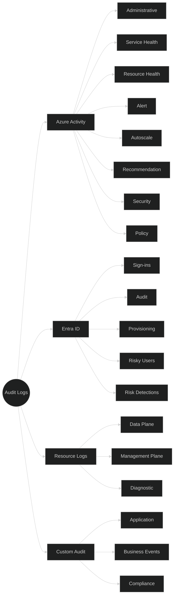

### 2.2 Six Key Principles for Audit Logs

> **Reference**: Microsoft Best Practices from Knowledge Base

| # | Principle | Description |
|---|-----------|-------------|
| **1** | **Centralized Logging Architecture** | Consolidate all platform, resource, and identity logs (Activity, Resource, Entra ID, Security) into central Log Analytics workspaces |
| **2** | **Common Logging Standards** | Define org-wide standardized schema, required log categories per resource type, minimum retention, classification (audit vs operational) |
| **3** | **Decoupling from Application Lifecycle** | Logs must persist when applications are migrated, decommissioned, or refactored. Use central workspaces to ensure traceability |
| **4** | **Retention & Cost Governance** | Implement tiered retention: Hot (30-90d), Warm (1-2y), Cold/Archive (7+ years), Immutable (as required) |
| **5** | **Governance via Azure Policy** | Enforce mandatory logging: required diagnostic settings, mandatory log categories, destination workspace requirements |
| **6** | **Enhanced Security & Analytics** | Enable advanced KQL analytics, Defender for Cloud, Microsoft Sentinel SIEM, cross-environment correlation |

### 2.3 How Other Organizations Do Audit Logging

> **Industry Insight**: *"How is this done in other organizations?"*

| Industry | Pattern | Key Characteristics |
|----------|---------|---------------------|
| **Financial Services** | Immutable logs for 7+ years | Strict schema enforcement, SOX/PCI-DSS compliance, dedicated compliance LAW |
| **Healthcare** | HIPAA-compliant retention | Access audit trails, PHI protection, 6+ year retention |
| **Manufacturing** | OT/IT log correlation | Process mining for efficiency, hybrid on-prem/cloud |
| **Retail** | PCI-DSS compliance | Transaction audit trails, cardholder data protection |

### 2.4 Audit Log Architecture

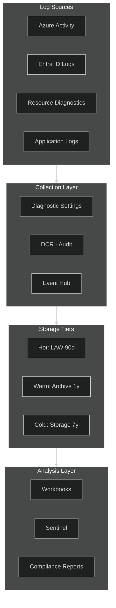

### 2.5 Audit Log Retention Strategy

```bicep
// Audit-specific DCR with extended retention
resource auditDcr 'Microsoft.Insights/dataCollectionRules@2022-06-01' = {
  name: 'dcr-audit-logs'
  location: location
  properties: {
    dataSources: {
      windowsEventLogs: [
        {
          name: 'securityEvents'
          streams: ['Microsoft-SecurityEvent']
          xPathQueries: [
            'Security!*[System[(EventID=4624 or EventID=4625 or EventID=4648)]]'  // Logon events
            'Security!*[System[(EventID=4720 or EventID=4722 or EventID=4723)]]'  // Account management
            'Security!*[System[(EventID=4732 or EventID=4733 or EventID=4756)]]'  // Group membership
          ]
        }
      ]
    }
    destinations: {
      logAnalytics: [
        {
          name: 'auditLaw'
          workspaceResourceId: auditLawId
        }
      ]
      // Future: Add archive storage
      // storageAccounts: [...]
    }
    dataFlows: [
      {
        streams: ['Microsoft-SecurityEvent']
        destinations: ['auditLaw']
        transformKql: 'source | where EventID in (4624, 4625, 4648, 4720, 4722, 4723, 4732, 4733, 4756)'
      }
    ]
  }
}

// Extended retention for audit table
resource auditTableRetention 'Microsoft.OperationalInsights/workspaces/tables@2022-10-01' = {
  name: '${lawName}/SecurityEvent'
  properties: {
    totalRetentionInDays: 365  // 1 year for compliance
    archiveRetentionInDays: 335  // 365 - 30 = 335 archive days
  }
}
```

### 2.6 Compliance Reporting Query

```kql
// SOC 2 Type II - Access Review Report
let startDate = ago(90d);
let endDate = now();

// Sign-in activity
SigninLogs
| where TimeGenerated between (startDate .. endDate)
| summarize 
    TotalSignIns = count(),
    SuccessfulSignIns = countif(ResultType == 0),
    FailedSignIns = countif(ResultType != 0),
    UniqueUsers = dcount(UserPrincipalName),
    UniqueIPs = dcount(IPAddress)
| extend 
    FailureRate = round(FailedSignIns * 100.0 / TotalSignIns, 2),
    ReportPeriod = strcat(format_datetime(startDate, 'yyyy-MM-dd'), ' to ', format_datetime(endDate, 'yyyy-MM-dd'))

// Join with privileged operations
union (
    AuditLogs
    | where TimeGenerated between (startDate .. endDate)
    | where OperationName has_any ("Add member to role", "Remove member from role", "Add user", "Delete user")
    | summarize PrivilegedOperations = count() by OperationName
)
```

---

## 3. Disaster Recovery for Monitoring

> **Common Question**: *"If we move central log to another region, is Zone-Redundant enough? Or should we consider Geo-replication?"*

### 3.1 LAW Resilience Options ✅

> **Microsoft Official Answer**: Azure does **NOT** provide native automatic geo-replication for Log Analytics Workspaces. You must configure one of the options below.

| Feature | Service Resilience | Data Backup | High Availability | Scope | Setup | Cost |
|---------|-------------------|-------------|-------------------|-------|-------|------|
| **Workspace Replication** ✅ | ✅ | ✅ | ✅ | Cross-region protection | Enable replication + manual switchover | Paid (per replicated GB) |
| **Availability Zones** ✅ | ✅ (some regions) | ✅ | ✅ | In-region datacenter protection | Automatic in supported regions | **Free** |
| **Continuous Data Export** | ❌ | ✅ | ❌ | Regional backup to GRS storage | Enable per table | Data export + Storage |

**Key Insight**: 
- **Availability Zones**: Automatic, free, protects against datacenter failures within a region
- **Workspace Replication**: Paid feature, replicates workspace and logs to another region, requires manual switchover
- **Neither provides automatic geo-failover** - you must monitor primary workspace health and decide when to switch

### 3.2 Industry Patterns for DR

> **Industry Insight**: *"How do other organizations handle this?"*

| Pattern | Architecture | Best For |
|---------|--------------|----------|
| **Pattern 1 (Recommended)** | Enable Workspace Replication to secondary region | Organizations wanting Microsoft-supported cross-region DR |
| **Pattern 2** | Single LAW with zone-redundancy + continuous export to GRS storage | Cost-conscious organizations with acceptable RPO |
| **Pattern 3** | Dual DCR ingestion to two LAWs simultaneously | Maximum redundancy, full control, double cost |
| **Pattern 4** | Azure Data Explorer with follower databases | Advanced analytics + DR combined |

**Enterprise Recommendations:**
- **Zone-redundancy is baseline** for all production workloads (free, automatic)
- **Workspace Replication** for compliance-driven scenarios needing cross-region protection
- **Cost optimization** through tiered approach: critical data uses replication, non-critical uses export

### 3.3 DR Strategies Diagram

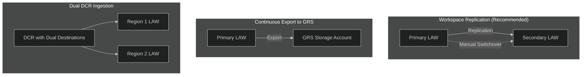

### 3.4 Workspace Replication Pattern

```bicep
// Primary workspace with data export to secondary
resource primaryLaw 'Microsoft.OperationalInsights/workspaces@2022-10-01' = {
  name: 'law-ums-primary'
  location: 'westeurope'
  properties: {
    sku: {
      name: 'PerGB2018'
    }
    retentionInDays: 90
  }
}

// Data export rule for critical tables
resource dataExportRule 'Microsoft.OperationalInsights/workspaces/dataExports@2020-08-01' = {
  parent: primaryLaw
  name: 'export-critical-to-secondary'
  properties: {
    destination: {
      resourceId: eventHubNamespaceId  // Event Hub for replication
    }
    tableNames: [
      'Heartbeat'
      'SecurityEvent'
      'AzureActivity'
      'Perf'
    ]
    enable: true
  }
}

// Secondary workspace ingests from Event Hub
resource secondaryLaw 'Microsoft.OperationalInsights/workspaces@2022-10-01' = {
  name: 'law-ums-secondary'
  location: 'northeurope'
  properties: {
    sku: {
      name: 'PerGB2018'
    }
  }
}
```

### 3.5 DR Alert Configuration

```bicep
// Duplicate critical alerts in secondary region
resource drAlert 'Microsoft.Insights/scheduledQueryRules@2023-03-15-preview' = {
  name: 'alert-heartbeat-dr'
  location: 'northeurope'
  properties: {
    displayName: 'VM Heartbeat Missing (DR)'
    severity: 1
    enabled: true
    evaluationFrequency: 'PT5M'
    scopes: [
      secondaryLawId
    ]
    windowSize: 'PT15M'
    criteria: {
      allOf: [
        {
          query: '''
            Heartbeat
            | summarize LastHeartbeat = max(TimeGenerated) by Computer
            | where LastHeartbeat < ago(10m)
          '''
          timeAggregation: 'Count'
          operator: 'GreaterThan'
          threshold: 0
        }
      ]
    }
    actions: {
      actionGroups: [
        drActionGroupId
      ]
    }
  }
}
```

### 3.6 RTO/RPO Considerations

| Scenario | RPO | RTO | Solution |
|----------|-----|-----|----------|
| LAW outage | 0 | 15 min | Cross-workspace query |
| Region outage | 5 min | 1 hour | Data export + secondary LAW |
| Total loss | 1 hour | 4 hours | Storage account backup |

### 3.7 DR + Monitoring Integration Scenario

> **Enterprise Scenario**: *"Link DR and monitoring together → Stage disaster scenario → Observe failover → Track via dashboard → Receive notifications → Verify restoration"*

#### End-to-End DR Monitoring Walkthrough

```mermaid
---
config:
  theme: dark
  flowchart:
    wrappingWidth: 200
    nodeSpacing: 60
    rankSpacing: 60
---
flowchart LR
    subgraph STAGE1["1. DR Plan Setup"]
        DR1["Define RTO/RPO"]
        DR2["Configure Replication"]
        DR3["Setup Monitoring"]
    end
    
    subgraph STAGE2["2. Dashboard Ready"]
        DASH1["Primary Health"]
        DASH2["Secondary Health"]
        DASH3["Replication Lag"]
    end
    
    subgraph STAGE3["3. Disaster Simulation"]
        SIM1["Trigger Failover"]
        SIM2["Monitor via Dashboard"]
        SIM3["Receive Alerts"]
    end
    
    subgraph STAGE4["4. Verification"]
        VER1["Confirm Failover"]
        VER2["Check Data Integrity"]
        VER3["Verify Restoration"]
    end
    
    STAGE1 --> STAGE2 --> STAGE3 --> STAGE4
```

#### Step 1: DR Monitoring Dashboard Setup

```kql
// DR Health Dashboard - Primary vs Secondary LAW
let primaryLaw = "law-ums-primary";
let secondaryLaw = "law-ums-secondary";

// Check ingestion health in both workspaces
Usage
| where TimeGenerated > ago(1h)
| summarize 
    LastIngestion = max(TimeGenerated),
    DataVolumeGB = sum(Quantity) / 1024
    by DataType
| extend 
    IngestionLag = now() - LastIngestion,
    Status = iff(IngestionLag < 5m, "Healthy", iff(IngestionLag < 15m, "Degraded", "Critical"))
| project DataType, LastIngestion, IngestionLag, DataVolumeGB, Status
```

#### Step 2: Replication Lag Monitoring

```kql
// Monitor data export / replication lag
let checkInterval = 5m;

// Compare latest records between primary and secondary
Heartbeat
| where TimeGenerated > ago(checkInterval)
| summarize 
    PrimaryLatest = max(TimeGenerated)
    by Computer
| join kind=leftouter (
    // Query secondary workspace
    workspace("law-ums-secondary").Heartbeat
    | where TimeGenerated > ago(checkInterval)
    | summarize SecondaryLatest = max(TimeGenerated) by Computer
) on Computer
| extend 
    ReplicationLag = PrimaryLatest - SecondaryLatest,
    LagStatus = case(
        isnull(SecondaryLatest), "Not Replicated",
        ReplicationLag < 1m, "Synced",
        ReplicationLag < 5m, "Acceptable Lag",
        "Critical Lag"
    )
```

#### Step 3: Failover Alert Configuration

```bicep
// Alert when failover is detected or required
resource failoverAlert 'Microsoft.Insights/scheduledQueryRules@2023-03-15-preview' = {
  name: 'alert-dr-failover-detected'
  location: location
  properties: {
    displayName: 'DR Failover Required - Primary LAW Unhealthy'
    description: '''
    ## DR ALERT: Primary LAW Health Degraded
    
    ### Immediate Actions:
    1. Verify primary LAW status in Azure Portal
    2. Check Azure Service Health for outages
    3. If outage confirmed, initiate failover to secondary
    
    ### Failover Steps:
    1. Update DCR destinations to secondary LAW
    2. Update dashboard connections
    3. Notify stakeholders via Teams channel
    
    ### Runbook: [DR Failover Procedure](https://wiki.contoso.com/dr-failover)
    '''
    severity: 0
    enabled: true
    evaluationFrequency: 'PT1M'
    scopes: [lawId]
    windowSize: 'PT5M'
    criteria: {
      allOf: [
        {
          query: '''
            Heartbeat
            | summarize LastHeartbeat = max(TimeGenerated)
            | where LastHeartbeat < ago(5m)
          '''
          timeAggregation: 'Count'
          operator: 'GreaterThan'
          threshold: 0
        }
      ]
    }
    actions: {
      actionGroups: [drActionGroupId]
      customProperties: {
        FailoverRunbook: 'https://wiki.contoso.com/dr-failover'
        SecondaryLAW: 'law-ums-secondary'
        EscalationPath: 'Platform Team → On-Call → DR Commander'
      }
    }
  }
}
```

#### Step 4: Post-Failover Verification Dashboard

```kql
// Verify successful failover and data integrity
let failoverTime = datetime(2026-01-07T12:00:00Z);  // Set to actual failover time

Heartbeat
| where TimeGenerated > failoverTime
| summarize 
    VmsReporting = dcount(Computer),
    FirstHeartbeat = min(TimeGenerated),
    LatestHeartbeat = max(TimeGenerated)
| extend 
    RecoveryTime = FirstHeartbeat - failoverTime,
    Status = iff(VmsReporting > 0, "Failover Successful", "Failover In Progress")
| project Status, VmsReporting, RecoveryTime, FirstHeartbeat, LatestHeartbeat
```

#### DR Monitoring Checklist

| Phase | Monitoring Task | Dashboard/Alert |
|-------|-----------------|----------------|
| **Pre-Failover** | Monitor replication lag | Replication Lag Widget |
| **Pre-Failover** | Track primary health | Primary LAW Health Alert |
| **During Failover** | Detect failover trigger | Failover Required Alert |
| **During Failover** | Track failover progress | Failover Status Dashboard |
| **Post-Failover** | Verify data continuity | Data Integrity Query |
| **Post-Failover** | Confirm all VMs reporting | VM Heartbeat Count |
| **Post-Failover** | Validate alert routing | Test Alert Notification |

---

## 4. Cost Optimization Deep-Dive

### 4.1 Cost Optimization Framework

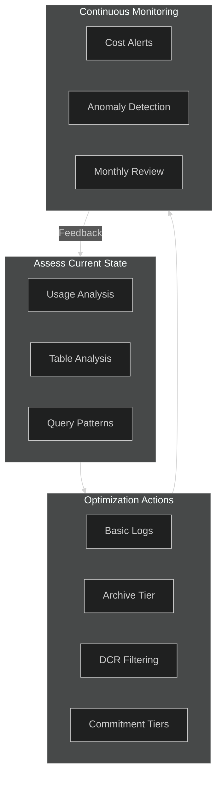

### 4.2 Basic Logs Implementation

Basic Logs tables reduce cost by 80% for low-query-frequency data:

```bicep
// Convert high-volume, low-query tables to Basic Logs
resource basicLogTable 'Microsoft.OperationalInsights/workspaces/tables@2022-10-01' = {
  parent: logAnalyticsWorkspace
  name: 'ContainerLog'  // High volume container logs
  properties: {
    plan: 'Basic'  // ~67% cost reduction vs Analytics
    retentionInDays: 30  // Basic logs: 30 days interactive (updated June 2024)
    totalRetentionInDays: 365  // Can archive for up to 12 years
  }
}
```

**Basic Logs Candidates:**
- ContainerLog / ContainerLogV2
- AppTraces (verbose application logs)
- Custom high-volume tables

### 4.3 Transformation for Cost Reduction

```bicep
// DCR with transformation to reduce ingestion
resource costOptimizedDcr 'Microsoft.Insights/dataCollectionRules@2022-06-01' = {
  name: 'dcr-cost-optimized'
  location: location
  properties: {
    dataSources: {
      performanceCounters: [
        {
          name: 'perfCounters'
          streams: ['Microsoft-Perf']
          samplingFrequencyInSeconds: 300  // 5 min instead of 1 min = 80% reduction
          counterSpecifiers: [
            '\\Processor(_Total)\\% Processor Time'
            '\\Memory\\Available MBytes'
          ]
        }
      ]
    }
    dataFlows: [
      {
        streams: ['Microsoft-Perf']
        destinations: ['lawDestination']
        transformKql: '''
          source
          | where CounterValue > 0  // Filter zero values
          | summarize Value = avg(CounterValue) by Computer, ObjectName, CounterName, bin(TimeGenerated, 5m)
        '''  // Aggregate to reduce rows
      }
    ]
  }
}
```

### 4.4 Commitment Tier Calculator

```kql
// Calculate optimal commitment tier
let dailyIngestionGB = toscalar(
    Usage
    | where TimeGenerated > ago(30d)
    | where IsBillable == true
    | summarize TotalMB = sum(Quantity)
    | extend TotalGB = TotalMB / 1024 / 30  // Daily average
);

let tiers = datatable(TierName:string, MinGB:real, PricePerGB:real) [
    "Pay-As-You-Go", 0, 2.76,
    "100 GB/day", 100, 2.30,
    "200 GB/day", 200, 2.12,
    "300 GB/day", 300, 2.07,
    "400 GB/day", 400, 2.03,
    "500 GB/day", 500, 2.00
];

tiers
| where MinGB <= dailyIngestionGB
| extend 
    DailyCost = dailyIngestionGB * PricePerGB,
    MonthlyCost = dailyIngestionGB * PricePerGB * 30
| order by MinGB desc
| take 3
```

### 4.5 Cost Alerting

```bicep
// Alert when daily ingestion exceeds threshold
resource costAlert 'Microsoft.Insights/scheduledQueryRules@2023-03-15-preview' = {
  name: 'alert-ingestion-cost-threshold'
  location: location
  properties: {
    displayName: 'Daily Ingestion Exceeds Budget'
    severity: 2
    enabled: true
    evaluationFrequency: 'PT1H'
    windowSize: 'P1D'
    scopes: [lawId]
    criteria: {
      allOf: [
        {
          query: '''
            Usage
            | where TimeGenerated > ago(1d)
            | where IsBillable == true
            | summarize TotalGB = sum(Quantity) / 1024
            | where TotalGB > 100  // Daily budget threshold
          '''
          timeAggregation: 'Count'
          operator: 'GreaterThan'
          threshold: 0
        }
      ]
    }
  }
}
```

### 4.6 Summary Rules for High-Volume Data ⚠️ Preview

> **Microsoft Best Practice**: Summary Rules enable automated data summarization that significantly reduces storage costs for high-volume log data while maintaining analytical insights.
>
> ⚠️ **Status**: Summary Rules are currently in **Public Preview** (as of January 2026). Features may change before GA.

Summary Rules let you aggregate high-ingestion-rate streams, providing robust analysis while optimizing long-term retention expenses:

```kql
// Example: Create summary rule for performance data
// Summarize hourly instead of every minute = 60x reduction
.create table PerfSummary (
    Computer: string,
    CounterName: string,
    AvgValue: real,
    MaxValue: real,
    MinValue: real,
    SampleCount: int,
    TimeGenerated: datetime
)

// Summary rule query
Perf
| summarize 
    AvgValue = avg(CounterValue),
    MaxValue = max(CounterValue),
    MinValue = min(CounterValue),
    SampleCount = count()
  by Computer, CounterName, bin(TimeGenerated, 1h)
```

### 4.7 Azure Advisor Cost Alerts

> **Microsoft Best Practice**: Set up Azure Advisor alerts to proactively notify you of cost optimization opportunities.

Configure alerts for these Advisor recommendations:
- **Basic Logs eligible tables** - Tables with >1GB/month that could use lower-cost plan
- **Pricing tier changes** - Usage volume suggests commitment tier discount
- **Unused restored tables** - Restored data incurring unnecessary charges
- **Data ingestion anomalies** - Sudden ingestion spikes vs. baseline

```bicep
// Create Azure Advisor alert for cost recommendations
resource advisorAlert 'Microsoft.Insights/activityLogAlerts@2020-10-01' = {
  name: 'alert-advisor-cost-recommendations'
  location: 'global'
  properties: {
    description: 'Alert when Azure Advisor has cost recommendations for LAW'
    enabled: true
    scopes: [subscription().id]
    condition: {
      allOf: [
        {
          field: 'category'
          equals: 'Recommendation'
        }
        {
          field: 'operationName'
          equals: 'Microsoft.Advisor/recommendations/available/action'
        }
      ]
    }
    actions: {
      actionGroups: [
        {
          actionGroupId: actionGroupId
        }
      ]
    }
  }
}
```

### 4.8 Free Alert Types (Cost Optimization) ✅

> **Microsoft Best Practice** (Confirmed): Activity log alerts, Service Health alerts, and Resource Health alerts are **free of charge**. Use these whenever possible.

| Alert Type | Cost | Use Case |
|------------|------|----------|
| **Activity Log Alerts** | FREE | Administrative operations, policy changes |
| **Service Health Alerts** | FREE | Azure service outages, maintenance |
| **Resource Health Alerts** | FREE | Individual resource availability |
| **Metric Alerts** | Paid | Performance thresholds |
| **Log Search Alerts** | Paid | Complex KQL queries |

**Priority**: Always check if Activity/Service/Resource Health alerts can meet your requirement before using paid alert types.

### 4.9 DCR Organization by Observability Scope

> **Microsoft Best Practice**: Create DCRs specific to data source type inside defined observability scopes for better management and cost control.

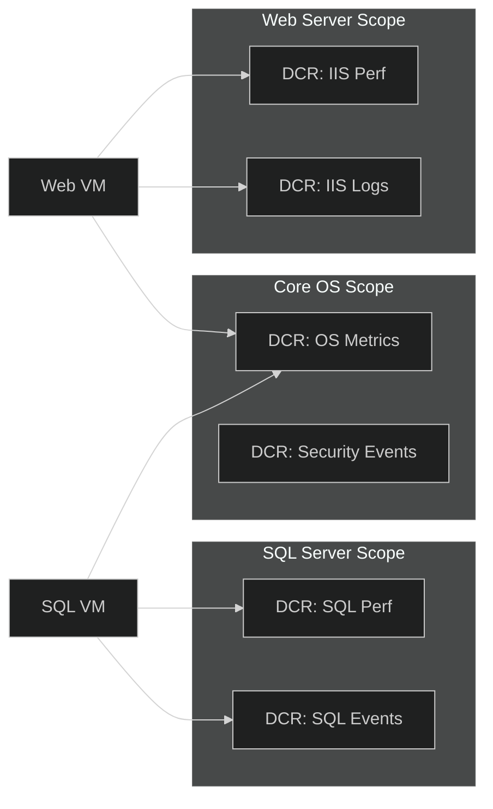

**DCR Organization Principles:**
1. **One DCR per data source type** - Separate performance from events
2. **Scope by application/workload** - SQL, Web, Database, etc.
3. **Environment separation** - Dev/Test/Prod can have different collection levels
4. **Destination-based** - Separate DCRs for different compliance regions

### 4.10 Search Jobs for Historical Analysis

> **Microsoft Best Practice**: Use Search Jobs for complex analytical queries on large datasets and long-term retention data without impacting real-time monitoring.

Search Jobs are asynchronous queries that:
- Run on any data including archived/long-term retention data
- Create new Analytics tables for further querying
- Separate analytical workloads from operational monitoring

```powershell
# Create a search job for historical security analysis
az monitor log-analytics workspace search-job create `
  --workspace-name "law-central-prod" `
  --resource-group "rg-monitoring" `
  --name "SecurityAudit2025" `
  --start-time "2025-01-01T00:00:00Z" `
  --end-time "2025-12-31T23:59:59Z" `
  --table-name "SecurityEvent" `
  --query "SecurityEvent | where EventID in (4624, 4625, 4648)"
```

---

## 5. Multi-Cloud Monitoring

### 5.1 Multi-Cloud Architecture

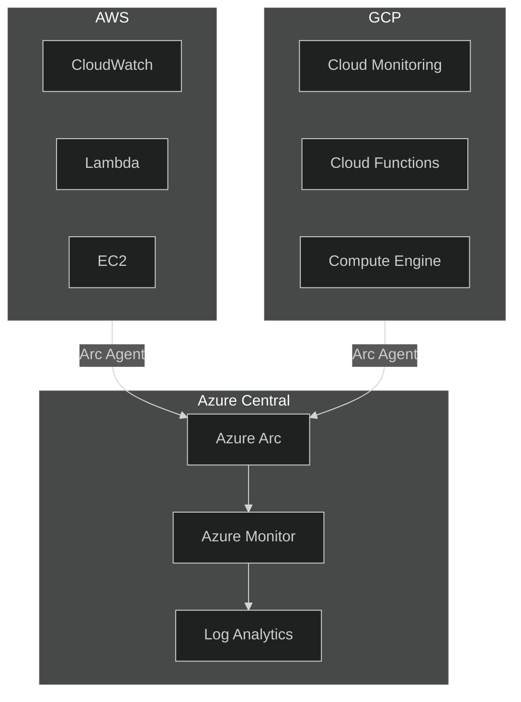

### 5.2 Azure Arc for Multi-Cloud

```bicep
// Azure Arc-enabled server monitoring
resource arcServer 'Microsoft.HybridCompute/machines@2023-10-03-preview' existing = {
  name: 'aws-server-01'
}

// AMA extension for Arc-enabled servers
resource amaExtension 'Microsoft.HybridCompute/machines/extensions@2023-10-03-preview' = {
  parent: arcServer
  name: 'AzureMonitorLinuxAgent'
  location: location
  properties: {
    publisher: 'Microsoft.Azure.Monitor'
    type: 'AzureMonitorLinuxAgent'
    typeHandlerVersion: '1.0'
    autoUpgradeMinorVersion: true
  }
}

// DCR association for Arc server
resource dcrAssociation 'Microsoft.Insights/dataCollectionRuleAssociations@2022-06-01' = {
  name: 'arc-dcr-association'
  scope: arcServer
  properties: {
    dataCollectionRuleId: dcrId
  }
}
```

### 5.3 Container Insights Integration

> **Reference**: Production pattern from enterprise AKS implementations (Fortune 500 deployments)

Container Insights provides monitoring for AKS clusters with optimized configuration for cost and performance.

#### Container Insights Architecture

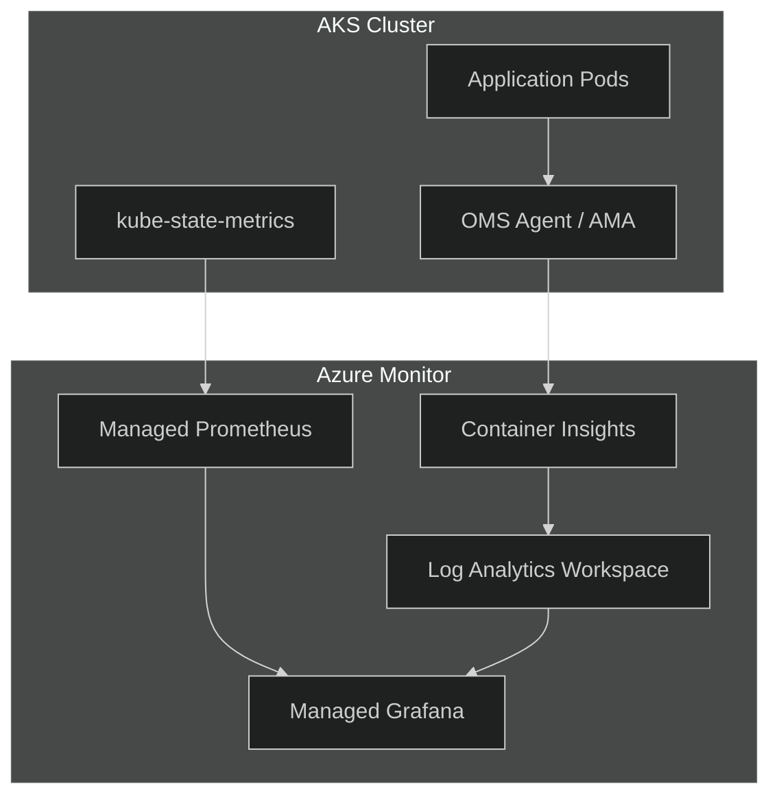

#### AKS with Container Insights (Bicep)

```bicep
// AKS cluster with Container Insights enabled
resource aksCluster 'Microsoft.ContainerService/managedClusters@2023-10-01' = {
  name: aksClusterName
  location: location
  properties: {
    kubernetesVersion: '1.28'
    dnsPrefix: aksClusterName
    agentPoolProfiles: [
      {
        name: 'system'
        count: 3
        vmSize: 'Standard_D4s_v5'
        mode: 'System'
      }
    ]
    addonProfiles: {
      omsagent: {
        enabled: true
        config: {
          logAnalyticsWorkspaceResourceID: lawId
          useAADAuth: 'true'
        }
      }
      azurePolicy: {
        enabled: true
      }
    }
  }
}

// DCR for Container Insights (AMA-based)
resource containerInsightsDcr 'Microsoft.Insights/dataCollectionRules@2022-06-01' = {
  name: 'dcr-container-insights-${aksClusterName}'
  location: location
  properties: {
    dataSources: {
      extensions: [
        {
          name: 'ContainerInsightsExtension'
          streams: [
            'Microsoft-ContainerLog'
            'Microsoft-ContainerLogV2'
            'Microsoft-KubeEvents'
            'Microsoft-KubePodInventory'
            'Microsoft-KubeNodeInventory'
            'Microsoft-KubeServices'
            'Microsoft-KubeMonAgentEvents'
            'Microsoft-InsightsMetrics'
            'Microsoft-ContainerInventory'
            'Microsoft-ContainerNodeInventory'
            'Microsoft-Perf'
          ]
          extensionName: 'ContainerInsights'
          extensionSettings: {
            dataCollectionSettings: {
              interval: '1m'
              namespaceFilteringMode: 'Include'
              namespaces: ['kube-system', 'default', 'app-namespace']
              enableContainerLogV2: true
            }
          }
        }
      ]
    }
    destinations: {
      logAnalytics: [
        {
          workspaceResourceId: lawId
          name: 'ciLaw'
        }
      ]
    }
    dataFlows: [
      {
        streams: [
          'Microsoft-ContainerLog'
          'Microsoft-ContainerLogV2'
          'Microsoft-KubeEvents'
          'Microsoft-KubePodInventory'
        ]
        destinations: ['ciLaw']
      }
    ]
  }
}
```

#### Container Insights ConfigMap (Cost Optimization)

```yaml
# ConfigMap for Container Insights agent settings
# Reference: Enterprise cloud-native pattern - optimized for cost
kind: ConfigMap
apiVersion: v1
metadata:
  name: container-azm-ms-agentconfig
  namespace: kube-system
data:
  schema-version: v1
  config-version: v1
  
  # Log collection settings - optimized for FluentBit/Loki alternative
  log_collection_settings: |-
    [log_collection_settings]
      [log_collection_settings.stdout]
        enabled = false  # Disabled when using FluentBit → Loki
        exclude_namespaces = ["kube-system"]
      [log_collection_settings.stderr]
        enabled = false  # Disabled when using FluentBit → Loki
      [log_collection_settings.env_var]
        enabled = true
      [log_collection_settings.enrich_container_logs]
        enabled = true
        
  # Alertable metrics thresholds
  alertable_metrics_configuration_settings: |-
    [alertable_metrics_configuration_settings.container_resource_utilization_thresholds]
      container_cpu_threshold_percentage = 95.0
      container_memory_rss_threshold_percentage = 95.0
      container_memory_working_set_threshold_percentage = 95.0
    [alertable_metrics_configuration_settings.pv_utilization_thresholds]
      pv_usage_threshold_percentage = 60.0
    [alertable_metrics_configuration_settings.job_completion_threshold]
      job_completion_threshold_time_minutes = 360
```

#### Container Insights KQL Queries

```kql
// Pod restart analysis
KubePodInventory
| where TimeGenerated > ago(24h)
| where RestartCount > 0
| summarize TotalRestarts = sum(RestartCount) by Name, Namespace, ClusterName
| order by TotalRestarts desc
| take 20

// Container CPU/Memory pressure
Perf
| where TimeGenerated > ago(1h)
| where ObjectName == "K8SContainer"
| where CounterName in ("cpuUsageNanoCores", "memoryWorkingSetBytes")
| summarize AvgValue = avg(CounterValue) by CounterName, InstanceName
| extend Container = tostring(split(InstanceName, "/")[1])
| project Container, CounterName, AvgValue

// OOMKilled containers
KubeEvents
| where TimeGenerated > ago(24h)
| where Reason == "OOMKilled"
| project TimeGenerated, Name, Namespace, Message
| order by TimeGenerated desc
```

### 5.4 Hybrid Cloud-Native Observability Stack

> **Reference**: Production pattern from enterprise AKS implementations (Fortune 500 deployments)

This section covers integrating cloud-native CNCF observability tools (Prometheus, Grafana, Loki, Tempo) with Azure-native monitoring for a hybrid approach.

#### Hybrid Architecture Overview

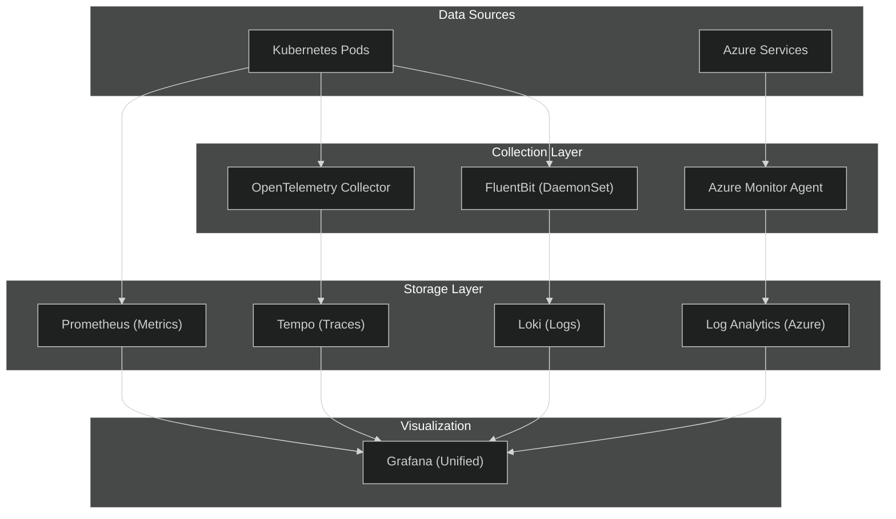

#### When to Use Hybrid Stack

| Scenario | Use Azure-Native | Use Cloud-Native (CNCF) | Use Hybrid |
|----------|------------------|------------------------|------------|
| **AKS-heavy workloads** | ❌ | ✅ Prometheus/Loki native | ✅ |
| **Mixed IaaS/PaaS** | ✅ Azure Monitor | ❌ | ✅ Best of both |
| **Cost-sensitive log storage** | ❌ LAW expensive | ✅ Loki + Blob cheaper | ✅ |
| **Tracing requirements** | ⚠️ App Insights | ✅ Tempo/Jaeger | ✅ |
| **Multi-cluster Kubernetes** | ❌ | ✅ Prometheus federation | ✅ |
| **Azure PaaS monitoring** | ✅ Metrics/Diagnostic | ❌ | ✅ |

#### Grafana with Azure Monitor Datasource

```yaml
# Grafana datasource configuration (enterprise pattern)
# Multi-environment Azure Monitor integration
datasources:
  - name: Azure Monitor - PRD
    type: grafana-azure-monitor-datasource
    jsonData:
      cloudName: azuremonitor
      subscriptionId: ${SUBSCRIPTION_ID_PRD}
      tenantId: ${TENANT_ID}
      clientId: ${GRAFANA_CLIENT_ID}
      logAnalyticsDefaultWorkspace: ${LAW_ID_PRD}
      azureLogAnalyticsSameAs: true
    secureJsonData:
      clientSecret: ${GRAFANA_CLIENT_SECRET}
      
  - name: Azure Monitor - DEV
    type: grafana-azure-monitor-datasource
    jsonData:
      cloudName: azuremonitor
      subscriptionId: ${SUBSCRIPTION_ID_DEV}
      tenantId: ${TENANT_ID}
      clientId: ${GRAFANA_CLIENT_ID}
      logAnalyticsDefaultWorkspace: ${LAW_ID_DEV}
      
  - name: Prometheus - PRD
    type: prometheus
    url: http://prometheus-server.monitoring:80
    
  - name: Loki - PRD
    type: loki
    url: http://loki-gateway.monitoring:80
    jsonData:
      derivedFields:
        - name: TraceID
          matcherRegex: "traceID=(\\w+)"
          url: "$${__value.raw}"
          datasourceUid: tempo-prd
          
  - name: Tempo - PRD
    type: tempo
    url: http://tempo-gateway.monitoring:80
    uid: tempo-prd
```

#### FluentBit for Loki (Cost-Optimized Logging)

```yaml
# FluentBit configuration for Loki integration
# Alternative to Container Insights stdout/stderr collection
config:
  inputs: |
    [INPUT]
        Name tail
        Path /var/log/containers/*.log
        Tag kube.*
        DB /var/log/flb_kube.db
        multiline.parser docker, cri
        Mem_Buf_Limit 256MB
        storage.type filesystem
        
  filters: |
    [FILTER]
        Name kubernetes
        Match kube.*
        Kube_URL https://kubernetes.default.svc:443
        Merge_Log On
        Merge_Log_Key log_processed
        K8S-Logging.Parser On
        
  outputs: |
    [OUTPUT]
        Name loki
        Match *
        Host loki-gateway.monitoring
        Port 80
        Labels env=${ENVIRONMENT}, namespace=$kubernetes['namespace_name'], pod=$kubernetes['pod_name']
        auto_kubernetes_labels on
        tenant_id ${SUBSCRIPTION_ID}
```

#### OpenTelemetry Collector for Traces

```yaml
# OpenTelemetry Collector configuration for Tempo
# Deployment mode (not DaemonSet)
config:
  receivers:
    otlp:
      protocols:
        grpc:
          endpoint: 0.0.0.0:4317
        http:
          endpoint: 0.0.0.0:4318
          
  processors:
    memory_limiter:
      limit_mib: 512
      spike_limit_mib: 128
    batch:
      timeout: 10s
      send_batch_size: 1024
      
  exporters:
    otlp:
      endpoint: tempo-gateway.monitoring:4317
      tls:
        insecure: true
      headers:
        X-Scope-OrgID: ${SUBSCRIPTION_ID}
        
  service:
    pipelines:
      traces:
        receivers: [otlp]
        processors: [memory_limiter, batch]
        exporters: [otlp]
```

#### Hybrid Stack Decision Matrix

| Component | Azure-Native Option | Cloud-Native Option | Recommendation |
|-----------|--------------------|--------------------|----------------|
| **Metrics** | Azure Monitor Metrics | Prometheus | Prometheus for K8s, Azure for PaaS |
| **Logs** | Log Analytics | Loki | Loki for K8s (cost), LAW for compliance |
| **Traces** | Application Insights | Tempo/Jaeger | Tempo for K8s, App Insights for .NET |
| **Visualization** | Azure Dashboards | Grafana | Grafana as single pane |
| **Alerting** | Azure Monitor Alerts | Prometheus Alertmanager | Azure Monitor (integration) |

---

## 6. AIOps & Intelligent Alerting

### 6.1 AIOps Capabilities Roadmap

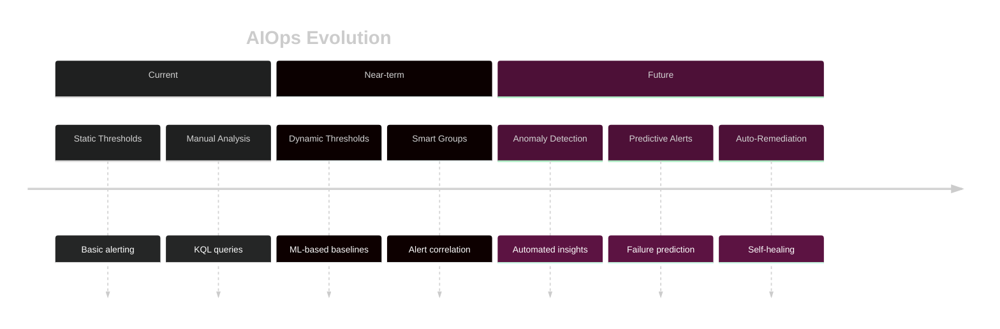

### 6.2 Dynamic Threshold Alerts

```bicep
// Metric alert with dynamic threshold
resource dynamicAlert 'Microsoft.Insights/metricAlerts@2018-03-01' = {
  name: 'alert-cpu-dynamic'
  location: 'global'
  properties: {
    severity: 2
    enabled: true
    scopes: [vmId]
    evaluationFrequency: 'PT5M'
    windowSize: 'PT5M'
    criteria: {
      'odata.type': 'Microsoft.Azure.Monitor.MultipleResourceMultipleMetricCriteria'
      allOf: [
        {
          criterionType: 'DynamicThresholdCriterion'
          name: 'cpuDynamic'
          metricName: 'Percentage CPU'
          metricNamespace: 'Microsoft.Compute/virtualMachines'
          operator: 'GreaterThan'
          alertSensitivity: 'Medium'
          failingPeriods: {
            numberOfEvaluationPeriods: 4
            minFailingPeriodsToAlert: 3
          }
          timeAggregation: 'Average'
        }
      ]
    }
    actions: [
      {
        actionGroupId: actionGroupId
      }
    ]
  }
}
```

### 6.3 Smart Alert Grouping

```kql
// Correlate related alerts
AlertsManagementResources
| where type == "microsoft.alertsmanagement/alerts"
| where properties.essentials.startDateTime > ago(24h)
| extend 
    AlertName = properties.essentials.alertRule,
    Severity = properties.essentials.severity,
    TargetResource = properties.essentials.targetResource,
    StartTime = properties.essentials.startDateTime
| summarize 
    AlertCount = count(),
    Alerts = make_set(AlertName),
    Severities = make_set(Severity)
    by TargetResource, bin(todatetime(StartTime), 5m)
| where AlertCount > 3  // Multiple alerts on same resource = potential cascade
| order by AlertCount desc
```

### 6.4 Anomaly Detection Query

```kql
// Detect anomalies in metric data using series_decompose_anomalies
let timeRange = 7d;
let anomalyThreshold = 3.0;

Perf
| where TimeGenerated > ago(timeRange)
| where ObjectName == "Processor" and CounterName == "% Processor Time"
| summarize AvgCPU = avg(CounterValue) by Computer, bin(TimeGenerated, 1h)
| order by Computer, TimeGenerated asc
| summarize TimeGenerated = make_list(TimeGenerated), CPU = make_list(AvgCPU) by Computer
| extend (anomalies, score, baseline) = series_decompose_anomalies(CPU, anomalyThreshold)
| mv-expand TimeGenerated, CPU, anomalies, score, baseline
| where toint(anomalies) != 0
| project TimeGenerated = todatetime(TimeGenerated), Computer, 
          ActualCPU = toreal(CPU), 
          Baseline = toreal(baseline),
          AnomalyScore = toreal(score),
          AnomalyType = iff(toint(anomalies) > 0, "Spike", "Dip")
```

### 6.5 Auto-Remediation Integration

> **Common Requirement**: *"Logic Apps for automated remediation, Azure Automation runbooks, ServiceNow ticket creation with context"*

#### Auto-Remediation Architecture

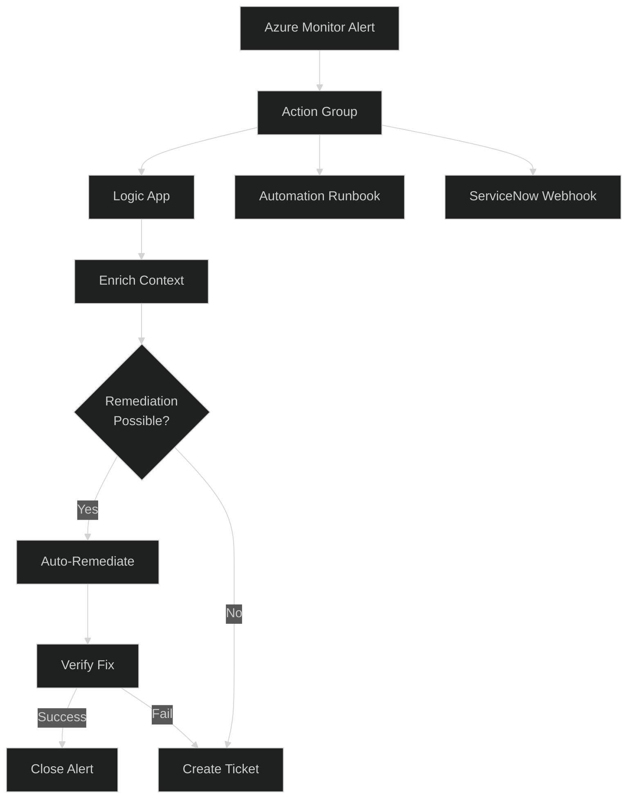

#### Logic App for Automated Remediation

```json
// Logic App Definition - VM Restart on Unresponsive
{
  "definition": {
    "$schema": "https://schema.management.azure.com/providers/Microsoft.Logic/schemas/2016-06-01/workflowdefinition.json#",
    "triggers": {
      "When_alert_fires": {
        "type": "Request",
        "kind": "Http",
        "inputs": {
          "schema": {
            "type": "object",
            "properties": {
              "schemaId": { "type": "string" },
              "data": {
                "type": "object",
                "properties": {
                  "essentials": { "type": "object" },
                  "alertContext": { "type": "object" }
                }
              }
            }
          }
        }
      }
    },
    "actions": {
      "Parse_Alert": {
        "type": "ParseJson",
        "inputs": {
          "content": "@triggerBody()",
          "schema": { }
        }
      },
      "Get_VM_Details": {
        "type": "Http",
        "inputs": {
          "method": "GET",
          "uri": "https://management.azure.com@{body('Parse_Alert')?['data']?['essentials']?['targetResourceId']}?api-version=2023-03-01",
          "authentication": { "type": "ManagedServiceIdentity" }
        }
      },
      "Check_If_Auto_Remediate": {
        "type": "If",
        "expression": {
          "and": [
            { "equals": ["@body('Get_VM_Details')?['tags']?['AutoRemediate']", "true"] },
            { "lessOrEquals": ["@body('Parse_Alert')?['data']?['essentials']?['severity']", "Sev2"] }
          ]
        },
        "actions": {
          "Restart_VM": {
            "type": "Http",
            "inputs": {
              "method": "POST",
              "uri": "https://management.azure.com@{body('Parse_Alert')?['data']?['essentials']?['targetResourceId']}/restart?api-version=2023-03-01",
              "authentication": { "type": "ManagedServiceIdentity" }
            }
          },
          "Log_Remediation": {
            "type": "Http",
            "inputs": {
              "method": "POST",
              "uri": "@parameters('LogAnalyticsDataCollectorUrl')",
              "body": {
                "AlertName": "@body('Parse_Alert')?['data']?['essentials']?['alertRule']",
                "ResourceId": "@body('Parse_Alert')?['data']?['essentials']?['targetResourceId']",
                "RemediationAction": "VM Restart",
                "Status": "Initiated",
                "Timestamp": "@utcNow()"
              }
            }
          }
        },
        "else": {
          "actions": {
            "Create_ServiceNow_Ticket": {
              "type": "ServiceNow",
              "inputs": { }
            }
          }
        }
      }
    }
  }
}
```

#### Azure Automation Runbook

```powershell
# Runbook: Remediate-HighCPU.ps1
param (
    [Parameter(Mandatory=$true)]
    [string]$ResourceId,
    
    [Parameter(Mandatory=$true)]
    [string]$AlertName,
    
    [Parameter(Mandatory=$false)]
    [int]$CPUThreshold = 90
)

# Connect using managed identity
Connect-AzAccount -Identity

# Parse resource details
$resourceParts = $ResourceId -split '/'
$subscriptionId = $resourceParts[2]
$resourceGroup = $resourceParts[4]
$vmName = $resourceParts[-1]

Set-AzContext -SubscriptionId $subscriptionId

# Get VM details
$vm = Get-AzVM -ResourceGroupName $resourceGroup -Name $vmName

# Check if auto-remediation is allowed
if ($vm.Tags['AutoRemediate'] -ne 'true') {
    Write-Output "Auto-remediation not enabled for VM: $vmName"
    return
}

# Attempt remediation based on issue type
switch ($AlertName) {
    'alert-vm-cpu-critical' {
        # For high CPU, try to identify and stop runaway process
        $result = Invoke-AzVMRunCommand -ResourceGroupName $resourceGroup -VMName $vmName `
            -CommandId 'RunPowerShellScript' `
            -ScriptString 'Get-Process | Sort-Object CPU -Descending | Select-Object -First 5 | Format-Table Name, CPU, Id'
        
        Write-Output "Top CPU processes: $($result.Value[0].Message)"
    }
    
    'alert-vm-disk-full' {
        # Clear temp files
        $result = Invoke-AzVMRunCommand -ResourceGroupName $resourceGroup -VMName $vmName `
            -CommandId 'RunPowerShellScript' `
            -ScriptString 'Remove-Item -Path "$env:TEMP\*" -Recurse -Force -ErrorAction SilentlyContinue; Get-PSDrive C | Select-Object Free'
        
        Write-Output "Disk cleanup result: $($result.Value[0].Message)"
    }
    
    'alert-vm-unresponsive' {
        # Restart VM
        Restart-AzVM -ResourceGroupName $resourceGroup -Name $vmName -Force
        Write-Output "VM $vmName restarted successfully"
    }
}

# Log remediation action
$logEntry = @{
    TimeGenerated = (Get-Date).ToUniversalTime().ToString("o")
    ResourceId = $ResourceId
    AlertName = $AlertName
    RemediationAction = $AlertName
    Status = "Completed"
    VMName = $vmName
}

Write-Output "Remediation completed: $($logEntry | ConvertTo-Json)"
```

#### ServiceNow Integration with Context

```bicep
// Action Group with ServiceNow webhook
resource serviceNowActionGroup 'Microsoft.Insights/actionGroups@2023-01-01' = {
  name: 'ag-servicenow-integration'
  location: 'global'
  properties: {
    groupShortName: 'SNOWInt'
    enabled: true
    webhookReceivers: [
      {
        name: 'servicenow-incident'
        serviceUri: 'https://${serviceNowInstance}.service-now.com/api/now/table/incident'
        useCommonAlertSchema: true
        useAadAuth: true
        objectId: serviceNowAppObjectId
        identifierUri: 'api://${serviceNowAppId}'
        tenantId: subscription().tenantId
      }
    ]
  }
}
```

**ServiceNow Payload Transformation (via Logic App):**

```json
{
  "short_description": "Azure Alert: @{body('Parse_Alert')?['data']?['essentials']?['alertRule']}",
  "description": "## Alert Details\n\n**Severity**: @{body('Parse_Alert')?['data']?['essentials']?['severity']}\n**Resource**: @{body('Parse_Alert')?['data']?['essentials']?['targetResource']}\n**Time**: @{body('Parse_Alert')?['data']?['essentials']?['firedDateTime']}\n\n## Remediation Steps\n\n@{body('Parse_Alert')?['data']?['alertContext']?['SearchResults']}",
  "urgency": "@{if(equals(body('Parse_Alert')?['data']?['essentials']?['severity'], 'Sev0'), '1', if(equals(body('Parse_Alert')?['data']?['essentials']?['severity'], 'Sev1'), '2', '3'))}",
  "impact": "@{if(equals(body('Parse_Alert')?['data']?['essentials']?['severity'], 'Sev0'), '1', if(equals(body('Parse_Alert')?['data']?['essentials']?['severity'], 'Sev1'), '2', '3'))}",
  "category": "Azure",
  "subcategory": "Monitoring",
  "assignment_group": "@{body('Get_Resource_Tags')?['SupportTeam']}",
  "cmdb_ci": "@{body('Parse_Alert')?['data']?['essentials']?['targetResourceName']}",
  "u_azure_resource_id": "@{body('Parse_Alert')?['data']?['essentials']?['targetResourceId']}",
  "u_runbook_url": "@{body('Parse_Alert')?['data']?['alertContext']?['customProperties']?['RunbookURL']}"
}
```

#### Auto-Remediation Decision Matrix

| Alert Type | Auto-Remediate? | Action | Conditions |
|------------|-----------------|--------|------------|
| VM Unresponsive | Yes | Restart VM | Tag: AutoRemediate=true, Severity ≤ Sev2 |
| High CPU | Partial | Identify process, log | Always log, escalate if persists |
| Disk Full | Yes | Clear temp files | Tag: AutoRemediate=true |
| Memory Pressure | No | Create ticket | Always manual review |
| Network Issue | No | Create ticket | Requires network team |
| Security Alert | Never | Escalate immediately | Always human review |

### 6.6 Circuit Breaker Pattern

> **Reference**: Production pattern from enterprise implementations (Fortune 500 deployments)

The circuit breaker pattern uses **Azure Function receivers** in Action Groups to enable automated remediation with severity-based routing.

#### Circuit Breaker Architecture

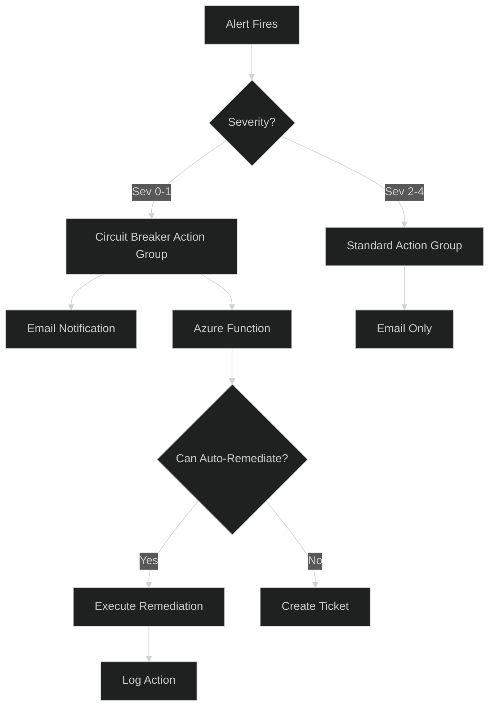

#### Action Group with Azure Function Receiver

```bicep
// Action Group with Circuit Breaker Function (from Data Mesh pattern)
resource circuitBreakerActionGroup 'Microsoft.Insights/actionGroups@2023-01-01' = {
  name: 'ag-circuit-breaker'
  location: 'global'
  properties: {
    groupShortName: 'CircuitBrk'
    enabled: true
    emailReceivers: [
      {
        name: 'ops-team'
        emailAddress: 'ops@contoso.com'
        useCommonAlertSchema: true
      }
    ]
    azureFunctionReceivers: [
      {
        name: 'circuit-breaker-function'
        functionAppResourceId: circuitBreakerFunctionApp.id
        functionName: 'ProcessAlert'
        httpTriggerUrl: 'https://${circuitBreakerFunctionApp.name}.azurewebsites.net/api/ProcessAlert?code=${functionKey}'
        useCommonAlertSchema: true
      }
    ]
  }
}

// Standard Action Group (email only)
resource standardActionGroup 'Microsoft.Insights/actionGroups@2023-01-01' = {
  name: 'ag-standard'
  location: 'global'
  properties: {
    groupShortName: 'Standard'
    enabled: true
    emailReceivers: [
      {
        name: 'ops-team'
        emailAddress: 'ops@contoso.com'
        useCommonAlertSchema: true
      }
    ]
  }
}
```

#### Severity-Based Routing

```bicep
// Route Severity 0-1 to Circuit Breaker, others to Standard
var targetActionGroupId = alert.severity <= 1 
  ? circuitBreakerActionGroup.id 
  : standardActionGroup.id

resource metricAlert 'Microsoft.Insights/metricAlerts@2018-03-01' = {
  name: alert.name
  location: 'global'
  properties: {
    severity: alert.severity
    enabled: true
    scopes: [resourceId]
    evaluationFrequency: 'PT5M'
    windowSize: 'PT5M'
    criteria: alert.criteria
    actions: [
      {
        actionGroupId: targetActionGroupId
      }
    ]
  }
}
```

#### Circuit Breaker Azure Function

```csharp
// Azure Function: ProcessAlert.cs
using Microsoft.Azure.WebJobs;
using Microsoft.Extensions.Logging;
using Newtonsoft.Json;

public static class ProcessAlert
{
    [FunctionName("ProcessAlert")]
    public static async Task Run(
        [HttpTrigger(AuthorizationLevel.Function, "post")] HttpRequest req,
        ILogger log)
    {
        var requestBody = await new StreamReader(req.Body).ReadToEndAsync();
        var alert = JsonConvert.DeserializeObject<CommonAlertSchema>(requestBody);
        
        log.LogInformation($"Processing alert: {alert.Data.Essentials.AlertRule}");
        
        // Check if auto-remediation is appropriate
        if (CanAutoRemediate(alert))
        {
            await ExecuteRemediation(alert, log);
        }
        else
        {
            await CreateServiceNowTicket(alert, log);
        }
    }
    
    private static bool CanAutoRemediate(CommonAlertSchema alert)
    {
        // Only auto-remediate for specific alert types and severity
        var allowedAlerts = new[] { "vm-unresponsive", "disk-full", "service-restart" };
        return alert.Data.Essentials.Severity <= 2 && 
               allowedAlerts.Any(a => alert.Data.Essentials.AlertRule.Contains(a));
    }
}
```

---

## 7. Compliance & Governance Automation

### 7.1 Azure Policy for Monitoring Compliance

```bicep
// Policy definition: Require diagnostic settings
resource policyDefinition 'Microsoft.Authorization/policyDefinitions@2021-06-01' = {
  name: 'require-diagnostic-settings'
  properties: {
    displayName: 'Require diagnostic settings for all resources'
    policyType: 'Custom'
    mode: 'All'
    metadata: {
      category: 'Monitoring'
      version: '1.0.0'
    }
    policyRule: {
      if: {
        allOf: [
          {
            field: 'type'
            in: [
              'Microsoft.Compute/virtualMachines'
              'Microsoft.Web/sites'
              'Microsoft.Storage/storageAccounts'
              'Microsoft.Sql/servers/databases'
              'Microsoft.KeyVault/vaults'
            ]
          }
        ]
      }
      then: {
        effect: 'DeployIfNotExists'
        details: {
          type: 'Microsoft.Insights/diagnosticSettings'
          existenceCondition: {
            allOf: [
              {
                field: 'Microsoft.Insights/diagnosticSettings/workspaceId'
                exists: 'true'
              }
            ]
          }
          roleDefinitionIds: [
            '/providers/Microsoft.Authorization/roleDefinitions/749f88d5-cbae-40b8-bcfc-e573ddc772fa'  // Monitoring Contributor
          ]
          deployment: {
            properties: {
              mode: 'Incremental'
              template: {
                // Diagnostic settings template
              }
            }
          }
        }
      }
    }
  }
}
```

### 7.2 Governance Dashboard Query

```kql
// Compliance dashboard: Resources without monitoring
let monitoredResources = 
    resources
    | where type in~ (
        'microsoft.compute/virtualmachines',
        'microsoft.web/sites',
        'microsoft.storage/storageaccounts'
    )
    | project ResourceId = tolower(id), Name = name, Type = type, ResourceGroup = resourceGroup;

let resourcesWithDiagnostics = 
    resources
    | where type == "microsoft.insights/diagnosticsettings"
    | extend ParentResource = tolower(tostring(split(id, '/providers/microsoft.insights')[0]))
    | distinct ParentResource;

monitoredResources
| join kind=leftanti resourcesWithDiagnostics on $left.ResourceId == $right.ParentResource
| summarize NonCompliantCount = count() by Type
| order by NonCompliantCount desc
```

---

## 8. Workshop Quick Reference Card

### 8.1 Key Azure Monitor URLs

| Resource | URL |
|----------|-----|
| Azure Monitor Overview | portal.azure.com/#view/Microsoft_Azure_Monitoring |
| Log Analytics Workspaces | portal.azure.com/#blade/HubsExtension/BrowseResource/resourceType/Microsoft.OperationalInsights%2Fworkspaces |
| Alert Rules | portal.azure.com/#view/Microsoft_Azure_Monitoring/AzureMonitoringBrowseBlade/~/alertsV2 |
| Workbooks Gallery | portal.azure.com/#blade/Microsoft_Azure_Monitoring/AzureMonitoringBrowseBlade/workbooks |

### 8.2 Essential CLI Commands

```powershell
# === Log Analytics Workspace ===
az monitor log-analytics workspace create --name <name> --resource-group <rg> --location <loc>
az monitor log-analytics workspace show --name <name> --resource-group <rg>
az monitor log-analytics workspace table list --workspace-name <name> --resource-group <rg>

# === Data Collection Rules ===
az monitor data-collection rule create --name <name> --resource-group <rg> --location <loc> --data-flows "[...]"
az monitor data-collection rule association create --name <name> --resource <vm-id> --rule-id <dcr-id>

# === Alerts ===
az monitor scheduled-query create --name <name> --resource-group <rg> --scopes <law-id> --condition "..."
az monitor action-group create --name <name> --resource-group <rg> --short-name <short> --action email admin admin@example.com

# === Diagnostic Settings ===
az monitor diagnostic-settings create --name <name> --resource <resource-id> --workspace <law-id> --logs "[...]"
```

### 8.3 Common KQL Patterns

```kql
// Pattern 1: Time-based aggregation
<Table>
| where TimeGenerated > ago(1h)
| summarize Count = count() by bin(TimeGenerated, 5m)

// Pattern 2: Top N analysis
<Table>
| summarize Count = count() by <GroupColumn>
| top 10 by Count desc

// Pattern 3: Join across tables
Table1
| join kind=inner Table2 on $left.Key == $right.Key

// Pattern 4: Anomaly detection
| make-series Value = avg(<Metric>) on TimeGenerated step 1h
| extend (anomalies, score) = series_decompose_anomalies(Value)

// Pattern 5: Resource graph correlation
| join kind=inner (arg("").resources | where type == "...") on $left.ResourceId == $right.id
```

### 8.4 Architecture Decision Matrix

| Requirement | Single LAW | Multiple LAW | Dedicated Cluster |
|-------------|------------|--------------|-------------------|
| < 100 GB/day | ✅ | ❌ | ❌ |
| 100-500 GB/day | ⚠️ | ✅ | ⚠️ |
| > 500 GB/day | ❌ | ⚠️ | ✅ |
| Multi-tenant isolation | ❌ | ✅ | ✅ |
| CMK encryption | ❌ | ❌ | ✅ |
| Cross-subscription | ⚠️ | ✅ | ✅ |

**Legend**: ✅ Recommended, ⚠️ Consider, ❌ Not Recommended

### 8.5 Naming Conventions

```
# Log Analytics Workspace
law-{workload}-{environment}-{region}-{instance}
Example: law-ums-prod-weu-001

# Data Collection Rule
dcr-{purpose}-{scope}-{environment}
Example: dcr-vm-perf-lz-prod

# Data Collection Endpoint
dce-{region}-{environment}
Example: dce-westeurope-prod

# Action Group
ag-{purpose}-{severity}
Example: ag-platform-sev1

# Alert Rule
alert-{resource}-{metric}-{severity}
Example: alert-vm-cpu-sev2
```

### 8.6 Cost Quick Reference

> ⚠️ **Pricing Note**: Prices vary by region and change over time. Always verify at [Azure Monitor Pricing](https://azure.microsoft.com/pricing/details/monitor/).

| SKU | Approx. Price | Use Case |
|-----|---------------|----------|
| Pay-As-You-Go | ~$2.30/GB | < 100 GB/day |
| 100 GB Commitment | ~$1.80/GB | 100-200 GB/day (up to 30% savings) |
| 500 GB Commitment | ~$1.50/GB | 500+ GB/day |
| Basic Logs | ~$0.50/GB | High-volume, low-query (30 days retention) |
| Auxiliary Logs | ~$0.15/GB | Compliance/security logs ⚠️ Preview |
| Archive | ~$0.02/GB | Long-term retention (up to 12 years) |

---

## Related Documentation

| Document | Purpose | Link |
|----------|---------|------|
| Architecture Overview | Solution design | [01-architecture-overview.md](./01-architecture-overview.md) |
| Operations Runbook | Day-2 operations | [02-operations-runbook.md](./02-operations-runbook.md) |
| Platform Observability Scenarios | Common monitoring scenarios | [04-platform-observability-scenarios.md](./04-platform-observability-scenarios.md) |

---

## Workshop Next Steps

After completing this workshop:

1. **Immediate (Week 1)**
   - Deploy baseline DCR and LAW
   - Configure AMBA policy initiative
   - Set up action groups

2. **Short-term (Month 1)**
   - Onboard pilot landing zones
   - Customize workbooks
   - Train landing zone teams

3. **Medium-term (Quarter 1)**
   - Roll out to all landing zones
   - Implement cost optimization
   - Establish operational cadence

4. **Long-term (Year 1)**
   - Implement audit logs framework
   - Configure DR strategy
   - Evaluate AIOps capabilities

---

> **Document Control**  
> Maintained by: Central Platform Team  
> Review Cycle: Quarterly  
> Classification: Internal  
> Version: 1.0 - Workshop Edition
