# Module 1: GenAI Foundations — How LLMs Actually Work

> **Duration:** 60--90 minutes | **Level:** Foundation
> **Audience:** Cloud Architects, Platform Engineers, Infrastructure Engineers
> **Last Updated:** March 2026

---

## Table of Contents

- [1.1 The AI Revolution in 30 Seconds](#11-the-ai-revolution-in-30-seconds)
- [1.2 What is a Large Language Model (LLM)?](#12-what-is-a-large-language-model-llm)
- [1.3 Tokens — The Currency of AI](#13-tokens--the-currency-of-ai)
- [1.4 The Transformer Architecture (Simplified)](#14-the-transformer-architecture-simplified)
- [1.5 Key Generation Parameters — The Control Panel](#15-key-generation-parameters--the-control-panel)
- [1.6 Context Windows — The Memory of AI](#16-context-windows--the-memory-of-ai)
- [1.7 Inference — Where Infrastructure Meets AI](#17-inference--where-infrastructure-meets-ai)
- [1.8 Training vs Fine-Tuning vs Inference](#18-training-vs-fine-tuning-vs-inference)
- [1.9 Model Quantization](#19-model-quantization)
- [1.10 Embeddings — The Meaning of Text](#110-embeddings--the-meaning-of-text)
- [1.11 The Infra Architect's Mental Model](#111-the-infra-architects-mental-model)
- [Key Takeaways](#key-takeaways)

---

## 1.1 The AI Revolution in 30 Seconds

The field of artificial intelligence did not arrive overnight. It evolved through distinct waves, each one building on the last, each one demanding more from the infrastructure underneath it.

### Timeline: From Machine Learning to the GenAI Explosion

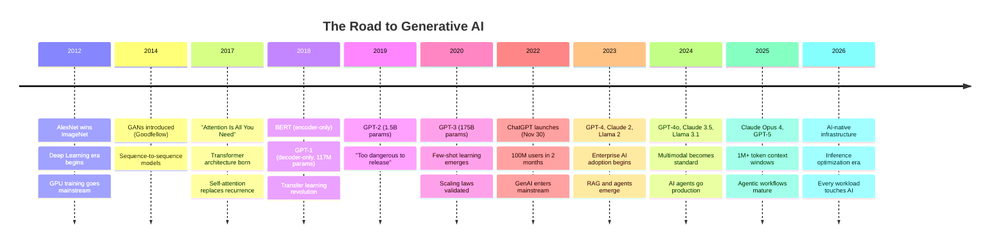

### Why Infrastructure Architects Need to Care — Now

This is not a trend you can observe from the sidelines. Consider what is already happening on the infrastructure you manage:

| What Changed | Infrastructure Impact |
|---|---|
| Every SaaS product is adding AI features | Your APIs now route to GPU-backed endpoints |
| RAG pipelines need vector databases | New data tier alongside SQL and NoSQL |
| AI agents make autonomous API calls | Unpredictable traffic patterns, new security surface |
| Copilot integrations are enterprise-mandated | M365, GitHub, Azure — all require AI connectivity |
| Model serving requires GPUs | Capacity planning now includes VRAM, not just vCPUs |
| Token-based pricing | Cost models shift from compute-hours to token volumes |

**The bottom line:** If you build infrastructure, you are already building AI infrastructure — whether you realize it or not. This module gives you the foundational knowledge to do it deliberately and well.

---

## 1.2 What is a Large Language Model (LLM)?

Strip away the hype and an LLM is a **statistical model that predicts the next token** in a sequence. That is it. Every response from ChatGPT, every code suggestion from GitHub Copilot, every summary from Copilot for Microsoft 365 — all of it is next-token prediction at massive scale.

### The Core Idea

Given the input: `"The capital of France is"`

The model assigns probabilities to every token in its vocabulary:

| Token | Probability |
|-------|-------------|
| `Paris` | 0.92 |
| `Lyon` | 0.03 |
| `the` | 0.02 |
| `a` | 0.01 |
| `Berlin` | 0.005 |
| *(50,000+ other tokens)* | *(remaining probability)* |

The model picks one token (influenced by generation parameters, covered in Section 1.5), appends it to the sequence, and repeats. This loop — predict, append, repeat — is called **autoregressive generation**.

### Training vs Inference — Why Infra Cares About Both

These are two fundamentally different workloads, and they stress your infrastructure in completely different ways.

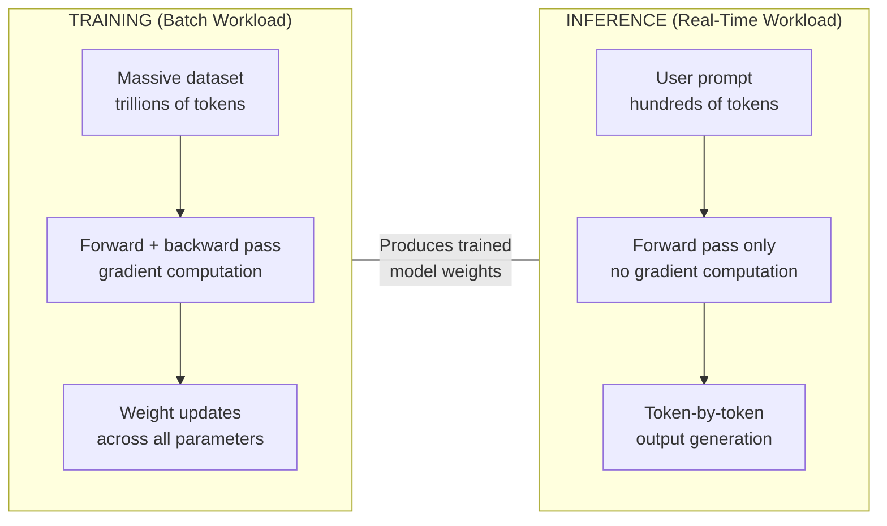

| Dimension | Training | Inference |
|-----------|----------|-----------|
| **Purpose** | Learn patterns from data | Generate responses from prompts |
| **Computation** | Forward + backward pass | Forward pass only |
| **Duration** | Weeks to months | Milliseconds to seconds |
| **GPU utilization** | Sustained 90--100% | Bursty, 20--80% |
| **Data movement** | TB/PB of training data | KB/MB per request |
| **Parallelism** | Data parallel + model parallel across 100s--1000s of GPUs | Typically 1--8 GPUs per model instance |
| **Who does it** | Model providers (OpenAI, Meta, Google) | You (via API or self-hosted) |
| **Your concern as architect** | Rarely — unless fine-tuning | Always — this runs on your infra |

### Parameters — What "7B" and "70B" Actually Mean

When someone says "Llama 3.1 70B," that **70B** refers to 70 billion **parameters**. Parameters are the numerical weights inside the neural network that were learned during training. They encode everything the model "knows."

Think of parameters like this: if the model is a building, parameters are every single brick, beam, wire, and pipe. More parameters = more capacity to store knowledge and handle nuance, but also = more VRAM, more compute, more cost.

| Model | Parameters | VRAM Required (FP16) | VRAM Required (INT4) | Relative Quality |
|-------|-----------|---------------------|---------------------|-----------------|
| Phi-3 Mini | 3.8B | ~8 GB | ~3 GB | Good for focused tasks |
| Llama 3.1 8B | 8B | ~16 GB | ~5 GB | Strong for its size |
| Llama 3.1 70B | 70B | ~140 GB | ~40 GB | Very capable |
| Llama 3.1 405B | 405B | ~810 GB | ~230 GB | Frontier-class |
| GPT-4 (estimated) | ~1.8T (MoE) | Not self-hostable | Not self-hostable | Leading benchmark scores |

**The infrastructure relationship is direct:**

```
VRAM required (GB) ≈ Parameters (B) × Bytes per parameter
```

- **FP32** (full precision): 4 bytes per parameter → 70B model = ~280 GB VRAM
- **FP16** (half precision): 2 bytes per parameter → 70B model = ~140 GB VRAM
- **INT8** (8-bit quantized): 1 byte per parameter → 70B model = ~70 GB VRAM
- **INT4** (4-bit quantized): 0.5 bytes per parameter → 70B model = ~35 GB VRAM

This is why quantization (Section 1.9) matters so much for infrastructure planning.

---

## 1.3 Tokens — The Currency of AI

Tokens are the fundamental unit of everything in the LLM world. They determine cost, latency, memory usage, and context limits. As an infrastructure architect, understanding tokens is as essential as understanding packets in networking.

### What is a Token?

A token is a **subword unit** — not a whole word, not a single character, but something in between. Models use algorithms like **Byte-Pair Encoding (BPE)** to break text into tokens. Common words become single tokens. Rare words get split into multiple tokens.

**Examples of tokenization** (using GPT-4's tokenizer):

| Text | Tokens | Token Count |
|------|--------|-------------|
| `Hello` | `Hello` | 1 |
| `infrastructure` | `infra` `structure` | 2 |
| `Kubernetes` | `Kub` `ernetes` | 2 |
| `Azure Application Gateway` | `Azure` ` Application` ` Gateway` | 3 |
| `antidisestablishmentarianism` | `ant` `idis` `establish` `ment` `arian` `ism` | 6 |
| `こんにちは` (Japanese "hello") | `こんにちは` | 1--3 (varies by model) |
| `192.168.1.1` | `192` `.` `168` `.` `1` `.` `1` | 7 |
| A blank space before a word | Included in the token | (spaces are part of tokens) |

**Key insight:** A rough rule of thumb for English text is **1 token ≈ 0.75 words**, or equivalently, **1 word ≈ 1.33 tokens**. Code is typically more token-dense than natural language.

### Token Limits and Context Windows

Every model has a **context window** — the maximum number of tokens it can process in a single request (input + output combined).

```
Context Window = Input Tokens + Output Tokens
```

If a model has a 128K context window and your input is 100K tokens, you have only 28K tokens left for the output.

### Input Tokens vs Output Tokens vs Total Tokens

This distinction matters for both cost and infrastructure planning:

| Token Type | What It Includes | Cost (Typical) | Latency Impact |
|-----------|-----------------|----------------|----------------|
| **Input tokens** | System prompt + user prompt + any context/documents | Lower cost per token | Processed in parallel (fast) |
| **Output tokens** | The model's generated response | Higher cost per token (2--4x input) | Generated sequentially (slower) |
| **Total tokens** | Input + Output | Sum of both | Determines memory usage |

### Why Tokens Matter — The Three Dimensions

**1. Cost:** Every API call costs money per token.

| Model | Input Cost (per 1M tokens) | Output Cost (per 1M tokens) |
|-------|---------------------------|----------------------------|
| GPT-4o | $2.50 | $10.00 |
| GPT-4o mini | $0.15 | $0.60 |
| Claude 3.5 Sonnet | $3.00 | $15.00 |
| Claude Opus 4 | $15.00 | $75.00 |
| Llama 3.1 70B (Azure) | $0.268 | $0.354 |

*Prices are illustrative and change frequently. Always check current pricing.*

**2. Latency:** More output tokens = longer response time. Each output token is generated sequentially. A 500-token response takes roughly 5x longer than a 100-token response.

**3. Infrastructure Sizing:** The context window directly determines how much GPU memory (VRAM) is needed per concurrent request, because the entire context must be held in the **KV cache** during generation.

### Token Count Reference

To help you estimate token usage for your workloads:

| Content Type | Approximate Token Count |
|-------------|------------------------|
| A short sentence (10 words) | ~13 tokens |
| A paragraph (100 words) | ~133 tokens |
| A full page of text (~500 words) | ~667 tokens |
| A 10-page document | ~6,700 tokens |
| A 100-page technical manual | ~67,000 tokens |
| A full novel (80,000 words) | ~107,000 tokens |
| A Kubernetes YAML file (200 lines) | ~800 tokens |
| A Python script (500 lines) | ~2,500 tokens |
| A Terraform module (1,000 lines) | ~5,500 tokens |

---

## 1.4 The Transformer Architecture (Simplified)

The Transformer architecture, introduced in the 2017 paper "Attention Is All You Need," is the foundation of every major LLM. You do not need to understand every mathematical detail, but you need to understand the key innovation and why it changed everything from an infrastructure perspective.

### Why Transformers Replaced RNNs

Before Transformers, sequence models (RNNs, LSTMs) processed text **one token at a time, sequentially**. This was like a single-lane road — no matter how fast the car, throughput was limited.

Transformers introduced **self-attention**, which allows the model to process **all tokens in parallel** and learn relationships between any two tokens regardless of distance. This is like opening a multi-lane highway.

| Property | RNN/LSTM | Transformer |
|----------|----------|-------------|
| Processing | Sequential (token by token) | Parallel (all tokens at once) |
| Long-range dependencies | Degrades with distance | Constant (attention across all positions) |
| Training speed | Slow (cannot parallelize) | Fast (GPU-friendly parallelism) |
| Scaling | Difficult beyond ~1B params | Scales to trillions of parameters |
| GPU utilization | Poor (sequential bottleneck) | Excellent (matrix multiplications) |

### Self-Attention Explained Simply

Self-attention answers the question: **"When processing this token, how much should I pay attention to every other token in the sequence?"**

Consider the sentence: `"The server crashed because it ran out of memory."`

When processing the word `"it"`, self-attention computes how relevant every other word is:

| Word | Attention Weight | Why |
|------|-----------------|-----|
| `server` | **0.62** | "it" refers to "server" |
| `crashed` | 0.15 | Related context |
| `memory` | 0.12 | Related concept |
| `The` | 0.02 | Low relevance |
| `because` | 0.04 | Structural word |
| `ran` | 0.03 | Some relevance |
| `out` | 0.01 | Low relevance |
| `of` | 0.01 | Low relevance |

This is computed using three learned projections of each token called **Query (Q)**, **Key (K)**, and **Value (V)** — think of it like a database lookup where the Query asks "what am I looking for?", the Keys say "here is what I contain," and the dot product between them determines relevance. The Values carry the actual information that gets passed forward.

### Encoder vs Decoder vs Encoder-Decoder

Transformers come in three flavors, each optimized for different tasks:

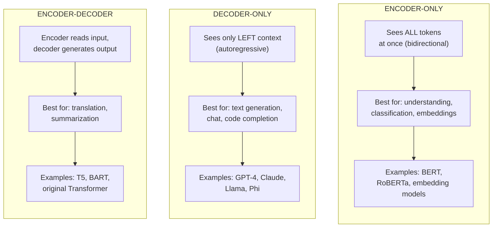

**For infrastructure architects, the key takeaway:** Almost every LLM you will serve in production is **decoder-only**. GPT-4, Claude, Llama, Phi, Mistral — all decoder-only. This matters because decoder-only models generate output **one token at a time**, which creates the sequential bottleneck that drives inference latency.

### Simplified Transformer Flow

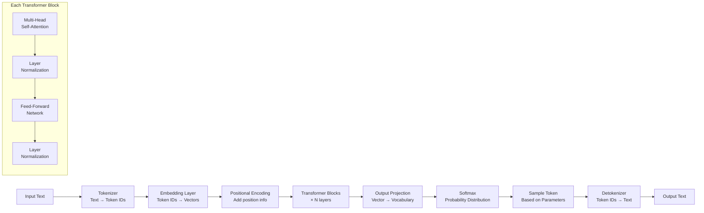

**Infrastructure insight:** The number of Transformer blocks (layers) is one of the key scaling dimensions. GPT-3 has 96 layers. More layers = more parameters = more VRAM = more compute per token. Each layer performs matrix multiplications, which is why GPUs (optimized for matrix math) are essential.

---

## 1.5 Key Generation Parameters — The Control Panel

When you send a prompt to an LLM, you do not just send text — you send **generation parameters** that control how the model selects tokens from its probability distribution. These parameters are the dials and knobs that determine whether the model's output is creative or deterministic, concise or verbose, focused or exploratory.

Understanding these parameters is critical because they directly affect **output quality, latency, cost, and user experience** of every AI feature your infrastructure serves.

### Temperature

**What it does:** Controls the randomness of token selection by scaling the probability distribution before sampling.

**Technical detail:** Temperature divides the logits (raw model outputs) before the softmax function. Lower temperature = sharper distribution (high-probability tokens dominate). Higher temperature = flatter distribution (lower-probability tokens get a chance).

| Temperature | Behavior | Output Example for "The best cloud provider is..." |
|-------------|----------|-----------------------------------------------------|
| **0.0** | Deterministic — always picks the highest-probability token | "The best cloud provider is Azure for enterprise workloads due to its comprehensive..." (same every time) |
| **0.3** | Low randomness — very focused, slight variation | "The best cloud provider depends on your specific requirements, but Azure offers..." |
| **0.7** | Balanced — default for most use cases | "The best cloud provider really depends on what you need. For hybrid scenarios, Azure shines..." |
| **1.0** | Standard sampling — follows the learned distribution | "Honestly, the best cloud provider is a loaded question! Each has sweet spots..." |
| **1.5** | High randomness — creative, sometimes incoherent | "The best cloud provider is like asking which star in Orion's belt dances most..." |
| **2.0** | Maximum randomness — often nonsensical | Unpredictable, potentially garbled output |

**When to use which value:**

| Use Case | Recommended Temperature |
|----------|------------------------|
| Code generation | 0.0 -- 0.2 |
| Data extraction / structured output | 0.0 |
| Factual Q&A / technical documentation | 0.1 -- 0.3 |
| General conversation / chatbots | 0.5 -- 0.7 |
| Creative writing / brainstorming | 0.7 -- 1.0 |
| Experimental / artistic content | 1.0 -- 1.5 |

### Top-P (Nucleus Sampling)

**What it does:** Instead of considering all tokens, Top-P considers only the smallest set of tokens whose cumulative probability exceeds the threshold P.

**Example:** If `top_p = 0.9`, the model sorts tokens by probability and includes tokens until the cumulative probability reaches 90%. All other tokens are excluded before sampling.

```
Token probabilities (sorted):
  "Paris"  = 0.70
  "Lyon"   = 0.10  → cumulative = 0.80
  "the"    = 0.06  → cumulative = 0.86
  "a"      = 0.04  → cumulative = 0.90  ← cutoff at top_p=0.9
  "Berlin" = 0.03  → excluded
  ...all others    → excluded
```

| Top-P Value | Behavior |
|-------------|----------|
| **0.1** | Only the very top tokens considered — very focused |
| **0.5** | Moderate filtering — reasonable diversity |
| **0.9** | Mild filtering — most probable tokens included (common default) |
| **1.0** | No filtering — all tokens considered |

:::warning
**Do not adjust both Temperature and Top-P simultaneously.** They both control randomness but in different ways. Changing both can produce unpredictable results. Pick one to tune and leave the other at its default.
:::

### Top-K

**What it does:** Limits the candidate tokens to the K most probable tokens before sampling. Simpler than Top-P but less adaptive.

| Top-K Value | Behavior |
|-------------|----------|
| **1** | Greedy decoding — always pick the top token (like temperature=0) |
| **10** | Very focused — only top 10 tokens considered |
| **40** | Moderate diversity (common default) |
| **100** | Broad candidate set |

**Top-K vs Top-P:** Top-K always considers exactly K tokens regardless of their probabilities. Top-P adapts — if the model is very confident, it might only consider 2 tokens; if uncertain, it might consider 200. In practice, Top-P is preferred for most applications.

### Frequency Penalty

**What it does:** Reduces the probability of tokens proportionally to how many times they have already appeared in the output. The more a token appears, the more it is penalized.

| Value | Behavior |
|-------|----------|
| **-2.0** | Strongly encourage repetition |
| **0.0** | No penalty (default) |
| **0.5** | Mild reduction in repetition |
| **1.0** | Moderate reduction — noticeable reduction in repeated phrases |
| **2.0** | Strong penalty — aggressively avoids repeating any token |

**Use case:** Set to 0.3--0.8 when the model tends to repeat phrases or get stuck in loops. Common in longer outputs.

### Presence Penalty

**What it does:** Applies a flat penalty to any token that has appeared in the output *at all*, regardless of how many times. Unlike frequency penalty, which scales with count, presence penalty is binary — the token either has appeared or it has not.

| Value | Behavior |
|-------|----------|
| **-2.0** | Strongly encourage reuse of existing topics |
| **0.0** | No penalty (default) |
| **0.5** | Mildly encourages new topics |
| **1.0** | Moderately encourages the model to explore new territory |
| **2.0** | Strongly pushes the model to cover new topics, avoid revisiting |

**Use case:** Set to 0.3--1.0 when you want the model to cover diverse topics and not circle back to points it already made. Useful for brainstorming and summarization.

### Max Tokens (Max Completion Tokens)

**What it does:** Sets the maximum number of tokens the model will generate in its response. The model will stop generating when it reaches this limit (even mid-sentence) or when it produces a natural stop token, whichever comes first.

| Consideration | Detail |
|--------------|--------|
| **Relationship to context window** | `input_tokens + max_tokens` must not exceed the model's context window |
| **Cost control** | Setting max_tokens prevents runaway generation that consumes budget |
| **Quality** | Setting it too low truncates responses mid-thought; too high wastes potential budget |
| **Default** | Varies by model — often 4096 or model maximum |

**Infrastructure tip:** For cost-sensitive production workloads, always set `max_tokens` explicitly. A chatbot response rarely needs more than 1,000 tokens. A code generation task might need 4,000. A document summary might need 500. Setting appropriate limits directly controls your token spend.

### Stop Sequences

**What it does:** A list of strings that, when generated by the model, cause it to stop generating immediately. The stop sequence itself is not included in the response.

**Examples:**

| Stop Sequence | Use Case |
|--------------|----------|
| `"\n\n"` | Stop after a single paragraph |
| `"```"` | Stop after a code block |
| `"END"` | Stop at a specific marker |
| `"Human:"` | Stop before generating the next turn in a conversation |

### The Complete Parameter Reference Table

| Parameter | Range | Default (typical) | What It Controls | When to Adjust |
|-----------|-------|-------------------|-----------------|----------------|
| **Temperature** | 0.0 -- 2.0 | 0.7 -- 1.0 | Randomness of token selection | Lower for factual tasks, higher for creative tasks |
| **Top-P** | 0.0 -- 1.0 | 0.9 -- 1.0 | Cumulative probability threshold | Lower for focused output; do not change with temperature |
| **Top-K** | 1 -- vocab size | 40 -- 50 | Hard cap on candidate tokens | Lower for deterministic output |
| **Frequency Penalty** | -2.0 -- 2.0 | 0.0 | Penalty scaling with token frequency | Increase (0.3--0.8) to reduce repetitive phrases |
| **Presence Penalty** | -2.0 -- 2.0 | 0.0 | Flat penalty for any used token | Increase (0.3--1.0) to encourage topic diversity |
| **Max Tokens** | 1 -- context limit | Model-dependent | Maximum output length | Always set explicitly in production |
| **Stop Sequences** | List of strings | None | Points where generation halts | Use to control output format and boundaries |

### Practical Parameter Recipes

| Scenario | Temperature | Top-P | Freq. Penalty | Presence Penalty | Max Tokens |
|----------|------------|-------|---------------|-----------------|------------|
| **Structured data extraction** | 0.0 | 1.0 | 0.0 | 0.0 | 500 |
| **Code generation** | 0.0 -- 0.2 | 0.95 | 0.0 | 0.0 | 4096 |
| **Customer support chatbot** | 0.5 | 0.9 | 0.3 | 0.2 | 800 |
| **Technical documentation** | 0.2 -- 0.3 | 0.9 | 0.0 | 0.0 | 2000 |
| **Creative brainstorming** | 0.9 | 0.95 | 0.5 | 0.8 | 2000 |
| **Summarization** | 0.3 | 0.9 | 0.5 | 0.5 | 500 |

---

## 1.6 Context Windows — The Memory of AI

The context window is the total number of tokens a model can "see" at once — its working memory for a single request. Everything the model reads (system prompt, conversation history, documents, user question) and everything it writes (the response) must fit within this window.

### The Evolution of Context Windows

| Year | Model | Context Window | Equivalent Text |
|------|-------|---------------|-----------------|
| 2022 | GPT-3.5 | 4,096 tokens | ~3,000 words (~6 pages) |
| 2023 | GPT-3.5-turbo-16k | 16,384 tokens | ~12,000 words (~24 pages) |
| 2023 | GPT-4 | 8,192 tokens | ~6,000 words (~12 pages) |
| 2023 | GPT-4-32k | 32,768 tokens | ~25,000 words (~50 pages) |
| 2023 | Claude 2.1 | 200,000 tokens | ~150,000 words (~300 pages) |
| 2024 | GPT-4o | 128,000 tokens | ~96,000 words (~192 pages) |
| 2024 | Claude 3.5 Sonnet | 200,000 tokens | ~150,000 words (~300 pages) |
| 2025 | Gemini 1.5 Pro | 1,000,000 tokens | ~750,000 words (~1,500 pages) |
| 2025 | Claude Opus 4 | 1,000,000 tokens | ~750,000 words (~1,500 pages) |

### Why Bigger Context Is Not Always Better

Intuitively, a larger context window seems strictly superior. But there are important tradeoffs that infrastructure architects must understand:

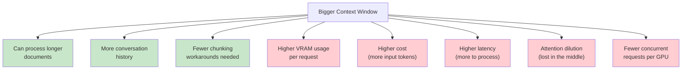

### The "Lost in the Middle" Problem

Research has shown that LLMs pay the most attention to information at the **beginning** and **end** of the context window, and tend to overlook information in the **middle**. This is called the "Lost in the Middle" effect.

**What this means for architects:**

- Do not assume that stuffing a 200K-token window full of documents will produce accurate answers
- Place the most important information at the beginning or end of the prompt
- RAG (Retrieval-Augmented Generation) with targeted retrieval often outperforms brute-force context stuffing
- Evaluate whether your use case genuinely needs a large context window or if a smaller window with smarter retrieval is more cost-effective

### Context Window and Infrastructure Sizing

The context window has a direct relationship to infrastructure requirements because of the **KV cache** (Key-Value cache) — a memory structure that stores attention computations for all tokens in the context.

| Context Length | KV Cache per Request (approx., 70B model, FP16) | Max Concurrent Requests on A100 80GB |
|---------------|------------------------------------------------|--------------------------------------|
| 4K tokens | ~0.5 GB | ~80 |
| 32K tokens | ~4 GB | ~15 |
| 128K tokens | ~16 GB | ~3 |
| 1M tokens | ~128 GB | <1 (needs multiple GPUs) |

*Values are approximate and depend on model architecture, batch size, and optimization techniques.*

**Infrastructure takeaway:** Context window size should be a key input to your capacity planning. Do not default to the largest available context — right-size it for your workload.

---

## 1.7 Inference — Where Infrastructure Meets AI

Inference is the process of running a trained model to generate predictions (responses). This is where your infrastructure directly impacts user experience. Every millisecond of latency, every out-of-memory error, every throttled request — these are inference problems.

### What Happens During an Inference Request

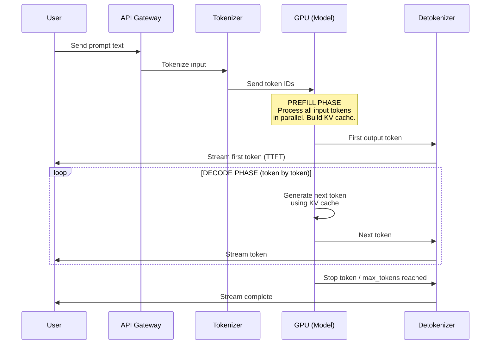

### The Two Phases of Inference

Understanding these two phases is critical for infrastructure optimization:

**Phase 1: Prefill (also called "prompt processing")**

| Aspect | Detail |
|--------|--------|
| What happens | All input tokens are processed in parallel through the model |
| Compute pattern | **Compute-bound** — heavy matrix multiplications |
| GPU utilization | High — all cores active |
| Output | KV cache is populated for all input positions |
| Duration | Proportional to input length; processed in parallel, so reasonably fast |

**Phase 2: Decode (also called "generation" or "autoregressive decoding")**

| Aspect | Detail |
|--------|--------|
| What happens | Tokens are generated one at a time, each attending to all previous tokens via the KV cache |
| Compute pattern | **Memory-bound** — reading KV cache dominates; GPU compute is underutilized |
| GPU utilization | Low per-token — most time spent on memory transfers |
| Output | One token per forward pass |
| Duration | Proportional to number of output tokens, sequential |

### Key Performance Metrics

| Metric | Definition | What Affects It | Typical Values |
|--------|-----------|-----------------|----------------|
| **TTFT** (Time to First Token) | Time from request to first token of response | Input length, model size, GPU speed, queue depth | 200ms -- 5s |
| **TPS** (Tokens Per Second) | Rate of output token generation | Model size, GPU memory bandwidth, batch size | 30 -- 100 TPS per request |
| **Total Latency** | TTFT + (output tokens / TPS) | All of the above | 1s -- 60s+ |
| **Throughput** | Total tokens/second across all concurrent requests | Batch size, GPU count, optimization | 1,000 -- 50,000 TPS per GPU |

**Example calculation:**
- TTFT = 500ms
- TPS = 50 tokens/second
- Output length = 200 tokens
- **Total latency** = 0.5s + (200 / 50) = 0.5s + 4.0s = **4.5 seconds**

### Streaming vs Non-Streaming Responses

| Mode | Behavior | Perceived Latency | Use Case |
|------|----------|-------------------|----------|
| **Non-streaming** | Wait for entire response, then return all at once | High (user sees nothing until done) | Background processing, APIs returning structured data |
| **Streaming (SSE)** | Return each token as it is generated | Low (user sees text appearing immediately) | Chatbots, interactive UIs, any user-facing application |

**Infrastructure note:** Streaming uses Server-Sent Events (SSE) over HTTP. Your load balancers, API gateways, and reverse proxies must support long-lived connections and chunked transfer encoding. Standard HTTP request timeouts (30s) may be too short for longer generations. Azure API Management, Application Gateway, and Front Door all have specific configurations for SSE support.

### The KV Cache — Why It Matters for Infrastructure

The KV (Key-Value) cache stores the attention keys and values for all processed tokens. Without it, every new output token would require reprocessing the entire sequence from scratch. With it, each new token only needs to attend to the cached values.

**The tradeoff:** The KV cache lives in GPU VRAM and grows linearly with context length. This is often the bottleneck that limits how many concurrent requests a GPU can serve.

```
KV Cache Size ≈ 2 × num_layers × num_heads × head_dim × context_length × bytes_per_element
```

For a 70B parameter model with 80 layers, 64 attention heads, head dimension of 128, and FP16 precision:

```
KV Cache per token ≈ 2 × 80 × 64 × 128 × 2 bytes = 2.62 MB per token
For 4K context: ~10.5 GB
For 32K context: ~84 GB
```

This is why serving models with long context windows requires significantly more VRAM per concurrent request, directly impacting your infrastructure density and cost.

---

## 1.8 Training vs Fine-Tuning vs Inference

These three stages form the lifecycle of an LLM. As an infrastructure architect, you will primarily deal with inference, occasionally with fine-tuning, and rarely with pre-training — but understanding all three helps you plan resources and have informed conversations with AI teams.

### Pre-Training

Pre-training is where a model learns language from scratch by processing trillions of tokens from the internet, books, code repositories, and other text sources.

| Dimension | Scale |
|-----------|-------|
| **Data** | 1--15 trillion tokens |
| **Compute** | 10,000 -- 50,000+ GPUs for weeks to months |
| **Cost** | $10M -- $500M+ |
| **Duration** | 1 -- 6 months |
| **Who does it** | OpenAI, Anthropic, Meta, Google, Mistral |
| **Output** | Base model weights (not yet instruction-following) |
| **Your role** | None — you consume the result |

### Alignment: RLHF and DPO

After pre-training, the base model can predict tokens but does not know how to follow instructions or be helpful. Alignment techniques make the model useful and safe.

| Technique | Full Name | How It Works | Compute Cost |
|-----------|-----------|-------------|-------------|
| **SFT** | Supervised Fine-Tuning | Train on curated instruction-response pairs | Moderate |
| **RLHF** | Reinforcement Learning from Human Feedback | Humans rank outputs; model learns to produce preferred responses | High (requires reward model) |
| **DPO** | Direct Preference Optimization | Learn from preference pairs without an explicit reward model | Lower than RLHF |
| **Constitutional AI** | - | Model self-critiques based on principles | Moderate |

### Fine-Tuning

Fine-tuning takes a pre-trained (and usually aligned) model and further trains it on your specific data to improve performance on your particular domain or task.

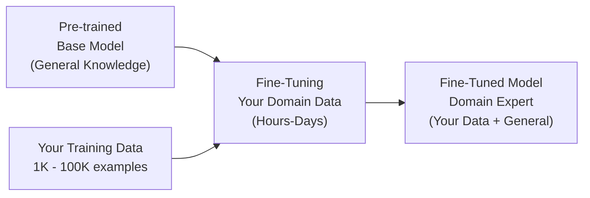

#### Parameter-Efficient Fine-Tuning (PEFT)

Full fine-tuning updates all model parameters — expensive and requires as much VRAM as training. PEFT methods update only a small fraction of parameters, dramatically reducing resource needs.

| Method | What It Does | Parameters Updated | VRAM Savings | Quality |
|--------|-------------|-------------------|-------------|---------|
| **Full Fine-Tuning** | Updates all weights | 100% | None | Highest |
| **LoRA** (Low-Rank Adaptation) | Injects small trainable matrices alongside frozen weights | 0.1 -- 1% | 60--80% | Near full fine-tuning |
| **QLoRA** | LoRA on a quantized (4-bit) base model | 0.1 -- 1% | 80--95% | Slightly below full |
| **Adapters** | Small neural network modules inserted between layers | 1 -- 5% | 50--70% | Good |
| **Prefix Tuning** | Prepends trainable virtual tokens to the input | <1% | 70--85% | Good for specific tasks |

**LoRA example:** Instead of fine-tuning a 70B model (requires ~280 GB VRAM and multi-GPU setup), QLoRA lets you fine-tune it on a single A100 80GB GPU by quantizing the base model to 4-bit and training only ~0.5% of parameters.

### Comparison Table: Training vs Fine-Tuning vs Inference

| Dimension | Pre-Training | Fine-Tuning (QLoRA) | Inference |
|-----------|-------------|--------------------|-----------|
| **Purpose** | Learn language from scratch | Specialize for a domain/task | Generate responses |
| **Data** | Trillions of tokens | Thousands of examples | Single prompt |
| **Duration** | Months | Hours to days | Milliseconds to seconds |
| **GPU Count** | 1,000 -- 50,000+ | 1 -- 8 | 1 -- 8 (per model instance) |
| **GPU VRAM** | Maximum (HBM3) | 24 -- 80 GB per GPU | 16 -- 80 GB per GPU |
| **Cost** | $10M -- $500M | $50 -- $10,000 | $0.001 -- $0.10 per request |
| **Frequency** | Once per model version | Periodically (weekly/monthly) | Continuously (every request) |
| **Infrastructure pattern** | Batch job (scheduled) | Batch job (scheduled) | Real-time service (always-on) |
| **Your responsibility** | None | Sometimes | Always |

---

## 1.9 Model Quantization

Quantization is the process of reducing the numerical precision of a model's parameters. It is one of the most practical techniques an infrastructure architect should understand because it directly determines how large a model you can serve on a given GPU.

### What Is Quantization?

Neural network parameters are stored as floating-point numbers. The "full precision" format is FP32 (32-bit floating point), but inference works well at lower precision because the model's behavior is robust to small rounding errors.

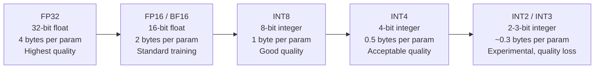

### Impact on Model Size and VRAM

Using Llama 3.1 70B as an example:

| Precision | Bytes per Parameter | Model Size | GPU VRAM Required | Quality Impact |
|-----------|-------------------|-----------|-------------------|----------------|
| **FP32** | 4 bytes | ~280 GB | ~280 GB (4x A100 80GB) | Baseline (maximum accuracy) |
| **FP16 / BF16** | 2 bytes | ~140 GB | ~140 GB (2x A100 80GB) | Negligible loss — standard for inference |
| **INT8** | 1 byte | ~70 GB | ~70 GB (1x A100 80GB) | Minimal loss — widely used in production |
| **INT4** | 0.5 bytes | ~35 GB | ~40 GB (with overhead) | Slight degradation — popular for cost savings |
| **INT3** | 0.375 bytes | ~26 GB | ~30 GB (with overhead) | Noticeable degradation on complex tasks |

*Note: Actual VRAM requirement exceeds raw model size due to KV cache, activation memory, and framework overhead. Add 10--30% buffer.*

### Quantization Formats

Different quantization methods use different algorithms to minimize quality loss:

| Format | Full Name | Description | Best For |
|--------|-----------|-------------|----------|
| **GPTQ** | GPT Quantized | Post-training quantization using calibration data; GPU-optimized | GPU inference (vLLM, TGI) |
| **GGUF** | GPT-Generated Unified Format | Optimized for CPU and CPU+GPU hybrid inference | Local deployment, llama.cpp |
| **AWQ** | Activation-aware Weight Quantization | Preserves important weights based on activation patterns | High-quality INT4 on GPU |
| **EETQ** | Easy and Efficient Transformer Quantization | INT8 with minimal setup | Quick INT8 deployment |
| **BitsAndBytes** | - | Integrated into Hugging Face; supports INT8 and INT4 (NF4) | Fine-tuning with QLoRA |

### Quantization Decision Guide

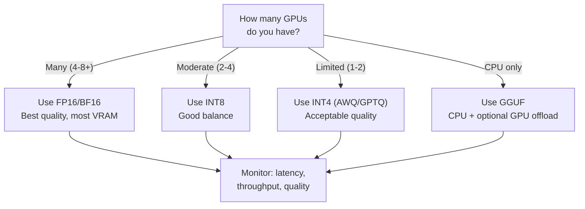

**Infrastructure architect's rule of thumb:** Start with INT8 for production GPU workloads. Move to INT4 if you need to fit a larger model on fewer GPUs. Use FP16 if quality is paramount and you have the GPU budget. Benchmark quality on your specific use case — quantization impact varies by task.

---

## 1.10 Embeddings — The Meaning of Text

Embeddings are numerical representations of text (or images, audio, etc.) in a high-dimensional vector space. While LLMs generate text, embedding models convert text into vectors that capture semantic meaning — and these vectors are the backbone of search, retrieval, and RAG architectures.

### What Are Vector Embeddings?

An embedding model converts text into a fixed-length array of floating-point numbers (a vector). Texts with similar meanings produce vectors that are close together in this high-dimensional space.

```
"Deploy a Kubernetes cluster" → [0.023, -0.041, 0.089, ..., 0.012]  (1536 dimensions)
"Set up a K8s cluster"       → [0.021, -0.039, 0.091, ..., 0.014]  (very similar vector!)
"Bake a chocolate cake"      → [-0.087, 0.063, -0.012, ..., 0.098] (very different vector)
```

### How Similarity Is Measured

The most common similarity metric is **cosine similarity** — the cosine of the angle between two vectors. It ranges from -1 (opposite) to 1 (identical).

| Text Pair | Cosine Similarity | Interpretation |
|-----------|------------------|----------------|
| "Deploy a Kubernetes cluster" vs "Set up a K8s cluster" | 0.95 | Very similar meaning |
| "Deploy a Kubernetes cluster" vs "Container orchestration platform" | 0.82 | Related concepts |
| "Deploy a Kubernetes cluster" vs "Azure Virtual Network setup" | 0.58 | Loosely related (both infra) |
| "Deploy a Kubernetes cluster" vs "Bake a chocolate cake" | 0.12 | Unrelated |

### Embedding Dimensions

| Model | Provider | Dimensions | Max Input Tokens | Use Case |
|-------|----------|-----------|-----------------|----------|
| text-embedding-3-small | OpenAI | 1536 | 8,191 | Cost-effective general purpose |
| text-embedding-3-large | OpenAI | 3072 | 8,191 | Higher quality, more dimensions |
| text-embedding-ada-002 | OpenAI | 1536 | 8,191 | Legacy, widely deployed |
| Cohere embed-v3 | Cohere | 1024 | 512 | Multilingual, search-optimized |
| BGE-large-en | BAAI (open) | 1024 | 512 | Strong open-source option |
| E5-large-v2 | Microsoft (open) | 1024 | 512 | Microsoft's open embedding model |

**More dimensions = more nuance captured, but also = more storage, more compute for similarity search, and higher memory usage in your vector database.**

### Embedding Models vs Generation Models

| Aspect | Embedding Model | Generation Model (LLM) |
|--------|----------------|----------------------|
| **Input** | Text (or image, audio) | Text prompt |
| **Output** | Fixed-length vector (e.g., 1536 floats) | Variable-length text (token by token) |
| **Architecture** | Usually encoder-only (BERT-family) | Usually decoder-only (GPT-family) |
| **Size** | Small (100M -- 1B parameters) | Large (7B -- 1T+ parameters) |
| **VRAM** | 1 -- 4 GB | 16 -- 800+ GB |
| **Speed** | Very fast (single forward pass) | Slower (sequential token generation) |
| **Cost** | Very cheap ($0.02 -- $0.13 per 1M tokens) | Expensive ($0.15 -- $75 per 1M tokens) |
| **Use case** | Search, retrieval, clustering, classification | Conversation, generation, reasoning |

### Why Embeddings Are the Backbone of RAG

In a RAG (Retrieval-Augmented Generation) pipeline — covered in depth in Module 5 — embeddings are used to:

1. **Index:** Convert your knowledge base documents into vectors and store them in a vector database
2. **Query:** Convert the user's question into a vector using the same embedding model
3. **Retrieve:** Find the most similar document vectors to the query vector
4. **Generate:** Pass the retrieved documents to an LLM as context for generating an answer

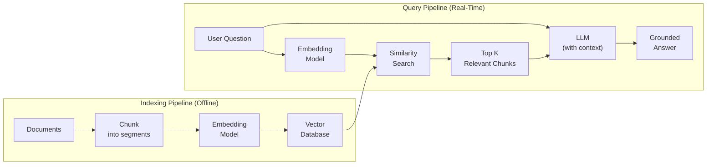

**Infrastructure implications of embeddings:**

| Concern | Detail |
|---------|--------|
| **Storage** | 1M documents with 1536-dim embeddings ≈ 6 GB of vector data |
| **Database** | Requires a vector database (Azure AI Search, Qdrant, Pinecone, Weaviate, pgvector) |
| **Latency** | Embedding generation is fast (~5ms per text); similarity search adds ~10--50ms |
| **Batch processing** | Initial indexing of large document sets requires batch embedding (millions of API calls) |
| **Model consistency** | You must use the same embedding model for indexing and querying |

---

## 1.11 The Infra Architect's Mental Model

Let us bring everything together into a single, unified view of how LLM inference works from an infrastructure perspective.

### The Complete Request Flow

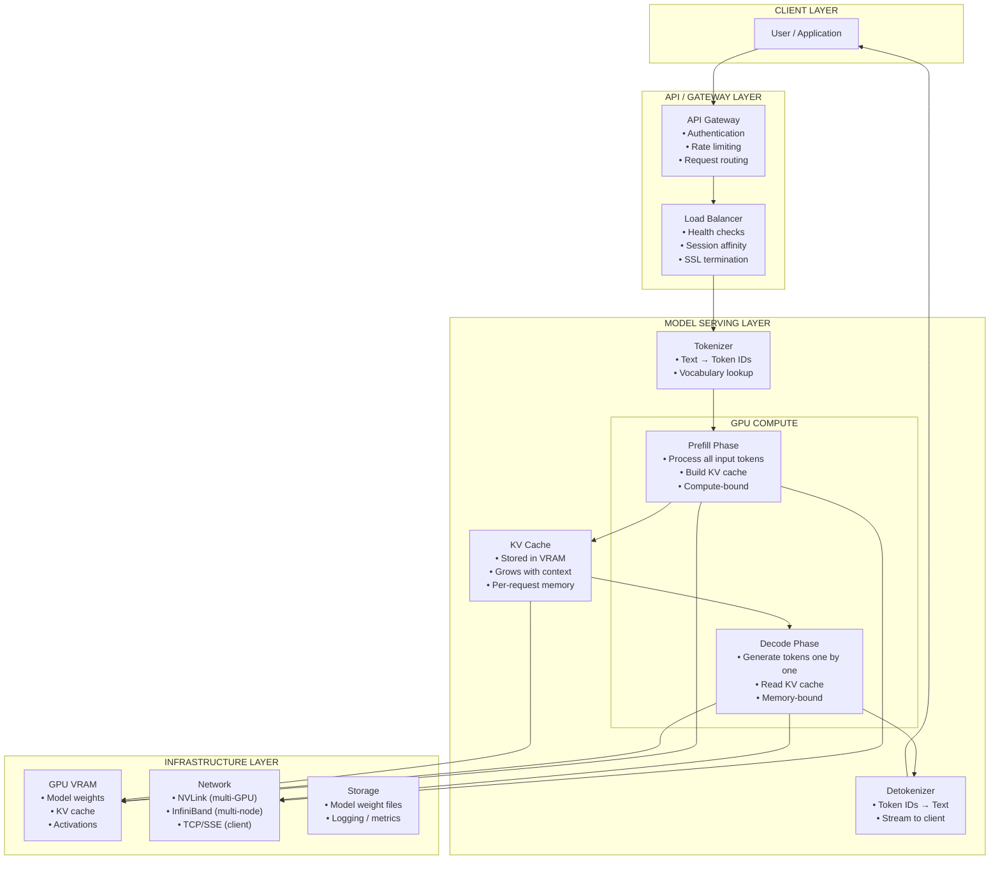

### Key Metrics an Infrastructure Architect Should Track

| Category | Metric | Why It Matters | Target Range |
|----------|--------|---------------|-------------|
| **Latency** | Time to First Token (TTFT) | User perceived responsiveness | < 1s for interactive |
| **Latency** | Tokens per Second (TPS) | Speed of response generation | 30 -- 80 TPS per request |
| **Latency** | End-to-end latency (P50, P95, P99) | SLA compliance | P95 < 5s for chatbots |
| **Throughput** | Requests per second | Capacity planning | Depends on model and GPU |
| **Throughput** | Total TPS (all requests) | GPU utilization efficiency | Higher = better GPU ROI |
| **Resource** | GPU VRAM utilization | Capacity and OOM prevention | 70 -- 90% (leave headroom) |
| **Resource** | GPU compute utilization | Efficiency of serving | Prefill: 80%+; Decode: 30--60% |
| **Resource** | KV cache memory usage | Concurrent request capacity | Monitor per-request growth |
| **Cost** | Cost per 1M tokens | Budget tracking | Varies by model and deployment |
| **Cost** | Cost per request (average) | Unit economics | Track input + output separately |
| **Reliability** | Error rate (429s, 500s, timeouts) | Service health | < 0.1% |
| **Reliability** | Queue depth | Whether capacity is sufficient | Growing queue = scale up |

### Resource Requirements Checklist

Use this checklist when planning infrastructure for an LLM workload:

| Decision | Questions to Ask | Impact |
|----------|-----------------|--------|
| **Model selection** | Which model? How many parameters? Open or proprietary? | Determines compute tier |
| **Precision** | FP16, INT8, or INT4? | Determines VRAM per instance |
| **Context window** | What context length do you need? (4K? 32K? 128K?) | Determines KV cache VRAM per request |
| **Concurrency** | How many simultaneous requests? | Determines number of GPU instances |
| **Latency SLA** | What TTFT and TPS are acceptable? | Determines GPU tier (A10G vs A100 vs H100) |
| **Throughput** | How many requests per minute/hour? | Determines horizontal scaling |
| **Availability** | What uptime is required? | Determines redundancy (multi-region, failover) |
| **Data residency** | Where must data be processed? | Determines Azure region and compliance |
| **Cost model** | Pay-per-token (PTU) vs pay-per-request vs self-hosted? | Determines deployment type |
| **Streaming** | Do you need streaming responses? | Impacts gateway, proxy, and load balancer config |
| **Fine-tuning** | Will you fine-tune? How often? | Determines training infrastructure (periodic) |
| **Embedding** | Do you need embeddings (for RAG)? | Separate model deployment, vector DB infrastructure |

### Quick GPU Reference for Common Models

| Model | Parameters | Quantization | Min GPU | Recommended GPU | Approx. TPS |
|-------|-----------|-------------|---------|-----------------|-------------|
| Phi-3 Mini | 3.8B | FP16 | 1x A10G (24GB) | 1x A10G | 60 -- 100 |
| Llama 3.1 8B | 8B | FP16 | 1x A10G (24GB) | 1x A100 (40GB) | 50 -- 80 |
| Llama 3.1 8B | 8B | INT4 | 1x T4 (16GB) | 1x A10G (24GB) | 40 -- 60 |
| Mistral 7B | 7B | FP16 | 1x A10G (24GB) | 1x A100 (40GB) | 50 -- 80 |
| Llama 3.1 70B | 70B | FP16 | 2x A100 (80GB) | 4x A100 (80GB) | 20 -- 40 |
| Llama 3.1 70B | 70B | INT4 | 1x A100 (80GB) | 2x A100 (80GB) | 25 -- 45 |
| Llama 3.1 405B | 405B | FP16 | 8x A100 (80GB) | 8x H100 (80GB) | 10 -- 20 |
| Llama 3.1 405B | 405B | INT4 | 4x A100 (80GB) | 4x H100 (80GB) | 15 -- 25 |

*TPS values are per-request on a single model instance. Actual performance depends on batch size, context length, serving framework (vLLM, TGI, TensorRT-LLM), and optimization settings.*

### The Serving Stack — What Sits Between the Model and Your Users

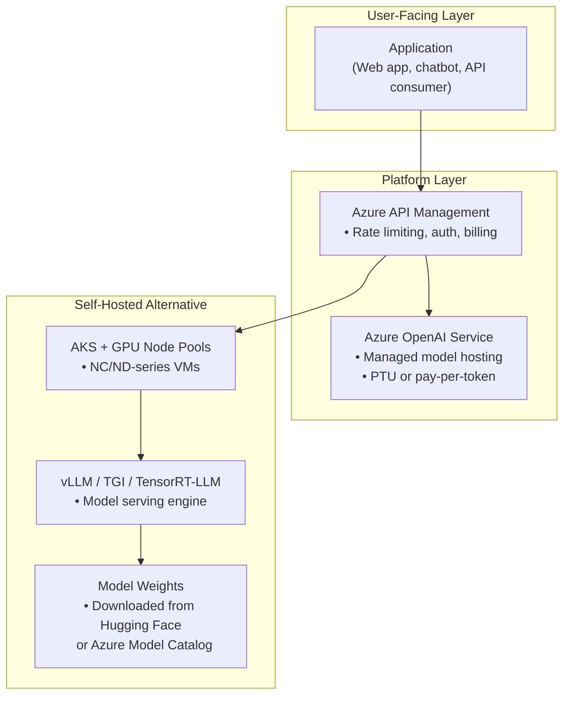

**Managed (Azure OpenAI) vs Self-Hosted decision:**

| Factor | Azure OpenAI (Managed) | Self-Hosted (AKS + vLLM) |
|--------|----------------------|--------------------------|
| **Setup complexity** | Low (deploy in minutes) | High (GPU provisioning, model loading, optimization) |
| **Model choice** | Limited to catalog (GPT-4o, GPT-4, etc.) | Any open model (Llama, Mistral, Phi, etc.) |
| **Scaling** | Automatic (with PTU or token limits) | Manual (HPA, node autoscaler) |
| **Cost model** | Per-token or PTU reservation | GPU VM cost (always-on or spot) |
| **Data control** | Data stays in Azure, no training on your data | Full control — your cluster, your data |
| **Customization** | Limited (system prompts, fine-tuning for some models) | Full (any quantization, any serving config) |
| **SLA** | 99.9% (Azure SLA) | Depends on your implementation |
| **Best for** | Production apps using supported models | Open models, cost optimization, maximum control |

---

## Key Takeaways

1. **LLMs are next-token predictors** — every response is generated one token at a time through probability distributions shaped by generation parameters.

2. **Tokens are the currency** — they determine cost (pricing per million tokens), latency (output tokens are sequential), and infrastructure sizing (context length drives VRAM requirements via KV cache).

3. **Transformers changed everything** because self-attention enables parallelism. This is why GPUs (built for parallel matrix operations) are essential for AI workloads.

4. **Generation parameters are your control panel** — temperature, top-p, frequency penalty, presence penalty, and max tokens give you precise control over output behavior. Always set max_tokens in production.

5. **Context windows are not free** — larger context means more VRAM per request, fewer concurrent users per GPU, and potential attention dilution. Right-size your context for the workload.

6. **Inference has two phases** — the compute-bound prefill phase and the memory-bound decode phase. TTFT is driven by prefill; TPS is driven by decode. Optimize them differently.

7. **Quantization is your best friend** for infrastructure efficiency — INT8 and INT4 can reduce VRAM requirements by 2--4x with acceptable quality loss, enabling larger models on fewer GPUs.

8. **Embeddings are different from generation** — they are small, fast, cheap encoder models that convert text to vectors. They power the retrieval half of RAG pipelines.

9. **You are already running AI infrastructure** — whether through Azure OpenAI, Copilot integrations, or self-hosted models. Understanding these foundations lets you architect it deliberately.

10. **Capacity planning now includes VRAM** — alongside CPU, RAM, disk, and network, GPU memory is a first-class resource that determines what models you can serve, at what concurrency, with what latency.

---

> **Next:** [Module 2: LLM Landscape](./02-LLM-Landscape.md) — Understand the major model families (GPT, Claude, Llama, Gemini, Phi), how to compare them with benchmarks, and how to choose the right model for your workload.
