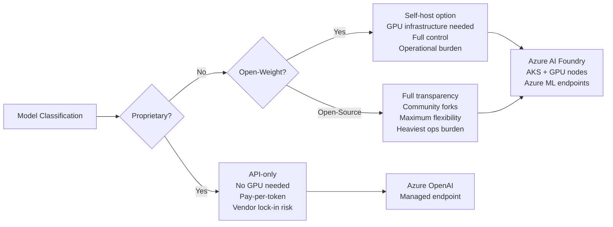
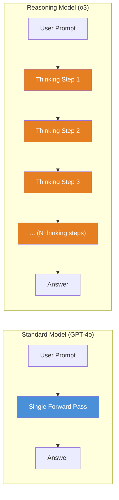
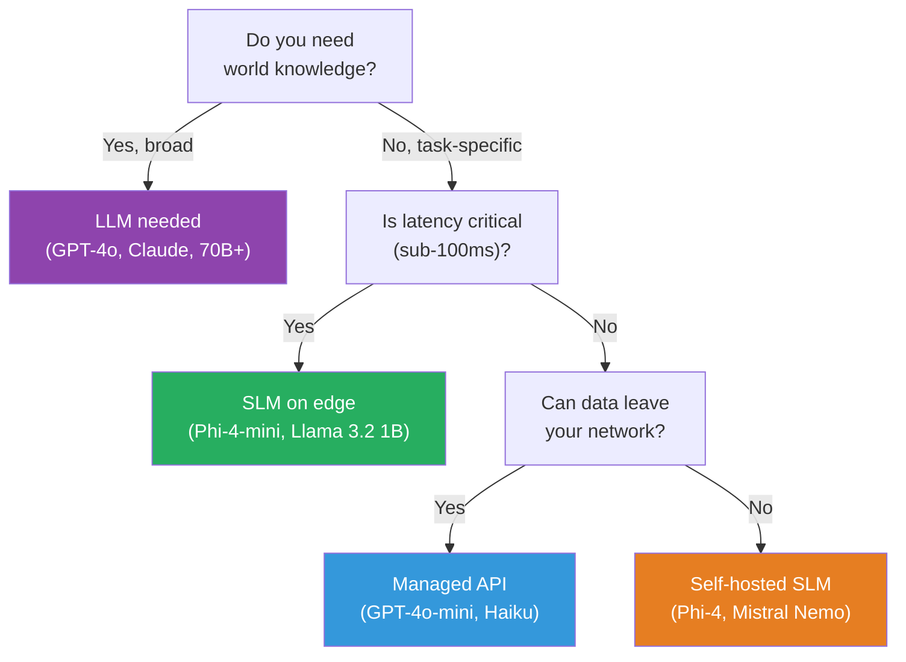
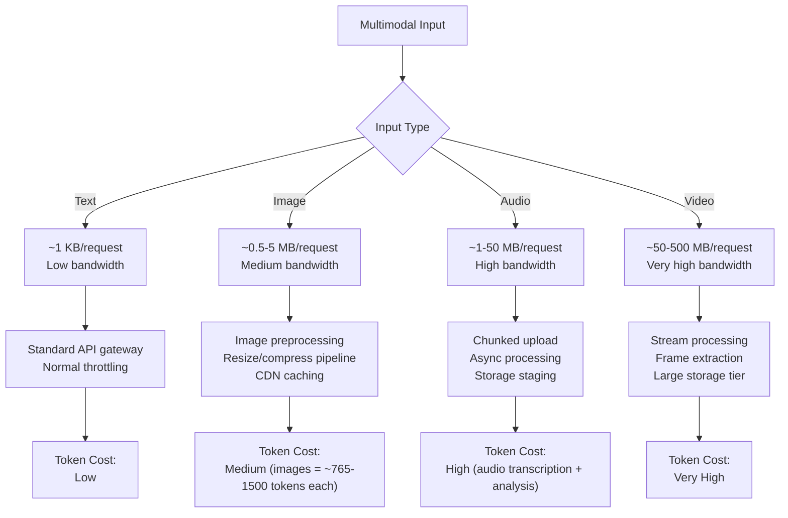
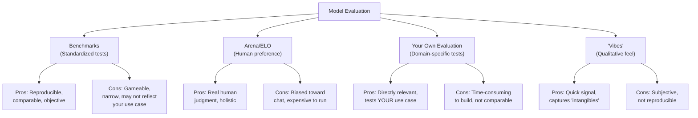
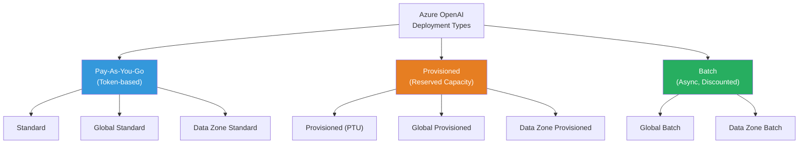
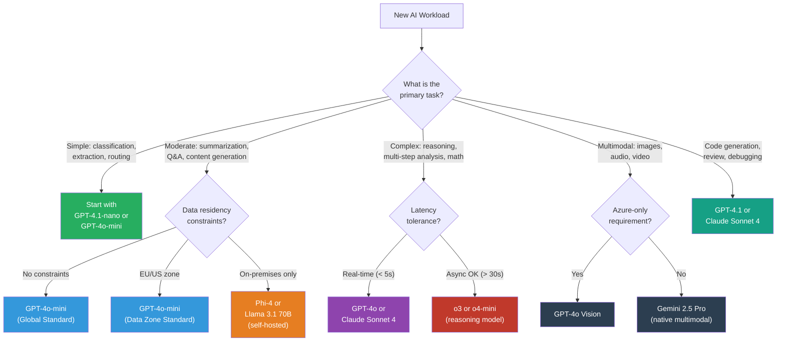
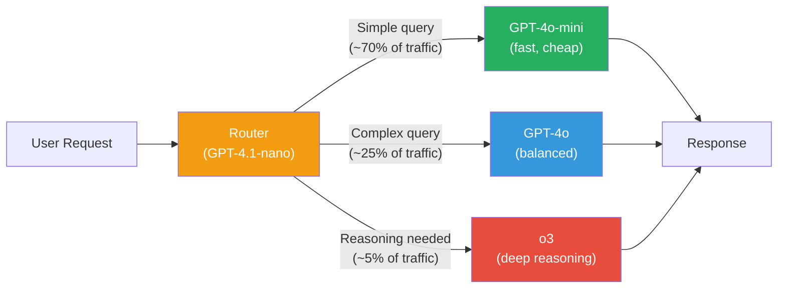

# Module 2: The LLM Landscape — Models, Families & Selection Guide

> **Duration:** 45-60 minutes | **Level:** Foundation
> **Audience:** Cloud Architects, Platform Engineers, CSAs
> **Last Updated:** March 2026

---

You do not need to train models. You do not need to understand backpropagation. But you **absolutely** need to know which models exist, what they are good at, how they are licensed, and how to deploy them on Azure. This module gives you the full map.

By the end of this module you will be able to:

- Distinguish proprietary, open-weight, and open-source models and explain why it matters for infrastructure
- Name every major model family and its flagship models
- Understand reasoning models, small language models, and multimodal models as distinct categories
- Read benchmarks critically and know their limitations
- Select the right Azure OpenAI deployment type for a given workload
- Apply a decision framework to choose the right model for any production scenario

---

## 2.1 The Model Universe

Not all models are created equal and not all models are licensed the same way. Before diving into specific families, you need a clear taxonomy.

### Three Categories of Model Openness

| Category | Definition | Examples | Can Self-Host? | Can Fine-Tune? | Can See Weights? |
|---|---|---|---|---|---|
| **Proprietary** | Model weights are never released. Access only via API. Provider controls everything. | GPT-4o, Claude Opus 4, Gemini 2.5 Pro | No | Limited (provider-hosted) | No |
| **Open-Weight** | Model weights are publicly downloadable. License may restrict commercial use or modification. Training data/code often not shared. | Llama 4, Mistral Large, Phi-4 | Yes | Yes | Weights only |
| **Open-Source** | Weights, training code, training data, and methodology are all public. Permissive license. | OLMo, BLOOM, Pythia | Yes | Yes | Everything |

:::caution Common Misconception
"Open-weight" and "open-source" are **not** the same thing. Meta's Llama models are open-weight (you can download and run them), but they are **not** open-source by the OSI definition because Meta's license includes restrictions on commercial use above 700M monthly active users and does not release training data. This distinction matters for legal and procurement teams.
:::

### Why This Classification Matters for Infrastructure



| Decision Factor | Proprietary (API) | Open-Weight (Self-Hosted) |
|---|---|---|
| **Infrastructure** | None (managed) | GPU VMs, networking, storage |
| **Data residency** | Provider's regions | Your regions, your control |
| **Cost model** | Pay-per-token (variable) | Fixed compute (GPU hours) |
| **Latency control** | Limited | Full control |
| **Scaling** | Automatic (with limits) | Manual (AKS, VMSS) |
| **Compliance** | Depends on provider DPA | Full control |
| **Vendor lock-in** | High | Low |
| **Operational burden** | Minimal | Significant |

### Licensing Implications

For architects who need to advise procurement and legal:

| License | Models | Commercial Use | Fine-Tuning | Redistribution | Key Restriction |
|---|---|---|---|---|---|
| Proprietary ToS | GPT-4o, Claude, Gemini | Via API only | Provider-managed only | No | Bound to provider platform |
| Llama Community License | Llama 3.1, 3.2, 4 | Yes (with conditions) | Yes | Yes | 700M MAU threshold requires Meta license |
| Apache 2.0 | Phi-4, Mistral (some), Gemma | Yes | Yes | Yes | No significant restrictions |
| Mistral Research License | Mistral Large (some versions) | Check version | Yes | Limited | May restrict commercial use |

---

## 2.2 Major Model Families

### OpenAI / Azure OpenAI

The largest and most widely deployed model family in enterprise. Azure OpenAI Service provides the same models as OpenAI's API, but running on Microsoft's Azure infrastructure with enterprise security, compliance, and network integration.

#### GPT-4 Class Models

| Model | Context Window | Key Capabilities | Best For | Azure Deployment |
|---|---|---|---|---|
| **GPT-4o** | 128K tokens | Text, image, audio input. Fast. Flagship multimodal. | General-purpose production workloads, vision tasks | All deployment types |
| **GPT-4o-mini** | 128K tokens | Smaller, faster, cheaper. 80% of GPT-4o quality. | High-volume, cost-sensitive workloads | All deployment types |
| **GPT-4.1** | 1M tokens | Evolution of GPT-4o. Better coding, instruction following. | Complex coding, long-document analysis | Standard, Global Standard |
| **GPT-4.1-mini** | 1M tokens | Smaller GPT-4.1. Excellent cost/performance. | Production at scale where 4.1 quality is needed cheaply | Standard, Global Standard |
| **GPT-4.1-nano** | 1M tokens | Smallest GPT-4.1. Ultra-low cost. | Classification, extraction, routing, simple tasks | Standard, Global Standard |

#### Reasoning Models (o-series)

| Model | Context Window | Thinking Tokens | Key Capabilities | Best For |
|---|---|---|---|---|
| **o1** | 200K tokens | Yes (hidden, billed) | Deep reasoning, math, science, logic | Complex multi-step analysis |
| **o3** | 200K tokens | Yes (hidden, billed) | Stronger reasoning, better at STEM | Research, scientific reasoning |
| **o4-mini** | 200K tokens | Yes (hidden, billed) | Efficient reasoning at lower cost | Reasoning tasks on a budget |

#### Specialized Models

| Model | Type | Capability | Best For |
|---|---|---|---|
| **DALL-E 3** | Image generation | Text-to-image, high quality | Marketing content, design prototyping |
| **Whisper** | Speech-to-text | Multilingual transcription | Meeting transcription, voice interfaces |
| **Text Embedding (3-small, 3-large)** | Embedding | Convert text to vectors | RAG pipelines, semantic search |

:::tip For Architects
**GPT-4o-mini and GPT-4.1-nano are your workhorses.** At least 80% of production workloads (classification, extraction, summarization, simple Q&A) do NOT need a full GPT-4o or GPT-4.1. Start with the smallest model that meets quality requirements. Scale up only when you have evidence that the smaller model fails.
:::

#### Azure OpenAI Specifics

Azure OpenAI is not just "OpenAI on Azure" -- it adds enterprise-grade features:

- **Azure AD / Entra ID authentication** (no API keys in production)
- **Virtual Network integration** via Private Endpoints
- **Content filtering** enabled by default (configurable)
- **Managed Identity** support for zero-secret deployments
- **Data processing guarantees** (your prompts and completions are NOT used for model training)
- **Regional deployment** for data residency compliance (EU, US, etc.)
- **Provisioned throughput (PTU)** for guaranteed capacity

---

### Anthropic Claude

Claude is Anthropic's model family, built with a focus on safety, helpfulness, and long-context understanding. Available via Anthropic's API and also accessible through Azure AI Foundry's model catalog (as a third-party model).

| Model | Context Window | Key Capabilities | Best For |
|---|---|---|---|
| **Claude Opus 4** | 200K tokens | Most capable Claude. Deep analysis, complex reasoning, extended thinking, tool use. | Complex research, long-document analysis, agentic workflows |
| **Claude Sonnet 4** | 200K tokens | Balanced performance and speed. Strong coding. Extended thinking available. | Production workloads needing quality + speed balance |
| **Claude Haiku 3.5** | 200K tokens | Fastest, cheapest Claude. Surprisingly capable. | High-volume, cost-sensitive, real-time applications |

#### Key Differentiators vs GPT

| Dimension | Claude | GPT-4o / GPT-4.1 |
|---|---|---|
| **Context window** | 200K tokens standard | 128K (GPT-4o), 1M (GPT-4.1) |
| **Extended thinking** | Explicit thinking mode where model reasons step-by-step (visible/hidden thinking tokens) | o-series models have built-in reasoning |
| **System prompt adherence** | Exceptionally strong -- tends to follow long, complex system prompts very closely | Strong, but can drift on very complex instructions |
| **Safety approach** | Constitutional AI (trained against a constitution of rules) | RLHF + content filtering layer |
| **Coding** | Excellent, especially for refactoring and explaining | Excellent, especially for generation |
| **Azure availability** | Via Azure AI Foundry model catalog (serverless API) | Native Azure OpenAI Service |
| **Data residency** | Anthropic's US/EU regions | Azure regions worldwide |

---

### Meta Llama

Meta's Llama family is the most significant open-weight model family. It democratized access to large-scale LLMs and created an entire ecosystem of fine-tuned derivatives.

| Model | Parameters | Context Window | Key Capabilities | Best For |
|---|---|---|---|---|
| **Llama 3.1 8B** | 8 billion | 128K tokens | Lightweight, fast, fine-tunable | Edge deployment, task-specific fine-tuning |
| **Llama 3.1 70B** | 70 billion | 128K tokens | Strong general performance | Self-hosted production workloads |
| **Llama 3.1 405B** | 405 billion | 128K tokens | Largest open-weight model. Near-GPT-4 quality. | Maximum quality in self-hosted scenarios |
| **Llama 3.2 1B** | 1 billion | 128K tokens | Ultra-small, on-device capable | Mobile, IoT, edge inference |
| **Llama 3.2 3B** | 3 billion | 128K tokens | Small but capable | Edge with limited GPU |
| **Llama 3.2 11B Vision** | 11 billion | 128K tokens | Multimodal (text + image) | Visual understanding on-prem |
| **Llama 3.2 90B Vision** | 90 billion | 128K tokens | Large multimodal | High-quality vision tasks, self-hosted |
| **Llama 4 Scout** | 17B active (109B total) | 10M tokens | Mixture-of-Experts (MoE). 16 experts. Extreme context. | Long-context tasks with efficient compute |
| **Llama 4 Maverick** | 17B active (400B total) | 1M tokens | MoE with 128 experts. Strongest open Llama. | Best open-weight quality, multi-turn, multilingual |

#### What "Open-Weight" Means for Self-Hosting

When you download Llama, you get the trained model weights (the numbers that define the model's knowledge). You can:

1. **Run inference locally** on your own GPU infrastructure
2. **Fine-tune** the model on your domain-specific data
3. **Quantize** the model (reduce precision) to run on smaller hardware
4. **Deploy** via frameworks like vLLM, TGI, or Ollama

**Infrastructure implications:**

| Model Size | Minimum VRAM (FP16) | Recommended GPU | Monthly Azure VM Cost (est.) |
|---|---|---|---|
| 1B-3B | 4-8 GB | Single T4 or A10 | ~$300-600 |
| 8B | 16 GB | Single A10 or A100 | ~$600-2,000 |
| 70B | 140 GB | 2x A100 80GB | ~$6,000-10,000 |
| 405B | 810 GB | 8-16x A100 80GB | ~$30,000-60,000 |

:::tip Availability on Azure
All Llama models are available on **Azure AI Foundry** via the Model Catalog. You can deploy them as **Serverless API** (pay-per-token, similar to Azure OpenAI) or as **Managed Compute** (dedicated VM with the model). No need to download weights manually.
:::

---

### Google Gemini

Google's Gemini models are natively multimodal -- trained from the ground up on text, images, audio, and video, rather than having vision bolted on after text training.

| Model | Context Window | Key Capabilities | Best For |
|---|---|---|---|
| **Gemini 2.0 Flash** | 1M tokens | Fast, multimodal, tool use, agentic | Low-latency multimodal tasks |
| **Gemini 2.5 Pro** | 1M tokens | Most capable Gemini. Thinking mode built-in. | Complex reasoning, long-context, multimodal analysis |
| **Gemini 2.5 Flash** | 1M tokens | Fast + thinking. Balanced cost/quality. | Production multimodal at scale |

#### Azure Availability

Gemini models are **not natively available on Azure AI Foundry** as of March 2026. They are accessed via Google's Vertex AI or Google AI Studio. However, Azure AI Foundry's Model Catalog does include some Google models:

- **Gemma** (Google's open-weight small models) -- available on Azure AI Foundry
- **Gemma 2 (2B, 9B, 27B)** -- Apache 2.0 licensed, deployable on Azure

For multi-cloud architectures, teams sometimes use Gemini via Google's API alongside Azure OpenAI, but this adds complexity around data residency, networking, and billing management.

---

### Microsoft Phi (Small Language Models)

Microsoft's Phi family proves that **smaller models, trained on high-quality data, can rival models 10-100x their size** on specific tasks. These are Small Language Models (SLMs) -- purpose-built to be efficient.

| Model | Parameters | Context Window | Key Capabilities | Best For |
|---|---|---|---|---|
| **Phi-3-mini** | 3.8B | 128K tokens | Strong reasoning for its size | Edge, mobile, on-device |
| **Phi-3-small** | 7B | 128K tokens | Multilingual, strong on benchmarks | Cost-efficient general tasks |
| **Phi-3-medium** | 14B | 128K tokens | Best Phi-3 quality | Production tasks needing local deployment |
| **Phi-3.5-mini** | 3.8B | 128K tokens | Improved over Phi-3-mini, multilingual | Edge with multilingual needs |
| **Phi-3.5-MoE** | 6.6B active (42B total) | 128K tokens | Mixture-of-Experts architecture | High quality at efficient compute |
| **Phi-3.5-vision** | 4.2B | 128K tokens | Multimodal (text + image) | Visual tasks on constrained hardware |
| **Phi-4** | 14B | 16K tokens | Strongest Phi. STEM reasoning leader. | Math, science, structured reasoning |
| **Phi-4-mini** | 3.8B | 128K tokens | Compact, strong reasoning | Lightweight deployment with good quality |
| **Phi-4-multimodal** | 5.6B | 128K tokens | Text + image + audio | Multimodal on-device scenarios |

#### Why SLMs Matter for Architects

1. **Run on CPUs** -- Models under 4B parameters can run (slowly) on CPUs. No GPU required.
2. **Edge deployment** -- Azure IoT Edge, Windows devices, even mobile phones.
3. **Cost** -- Orders of magnitude cheaper than large model API calls at high volume.
4. **Latency** -- Smaller models respond faster. Critical for real-time scenarios.
5. **Data sovereignty** -- Run entirely on-premises, air-gapped, zero data leaving your network.

:::tip Available on Azure
All Phi models are available on **Azure AI Foundry** via the Model Catalog with Serverless API and Managed Compute deployment options. Phi-4 and Phi-3.5 models are also optimized for **ONNX Runtime** and can run on **Windows devices** via Windows Copilot Runtime.
:::

---

### Mistral

Mistral AI is a French AI company that has quickly become a major force, particularly strong in European markets and multilingual workloads.

| Model | Parameters | Context Window | Key Capabilities | Best For |
|---|---|---|---|---|
| **Mistral Large** | ~123B | 128K tokens | Flagship. Strong reasoning, multilingual. | Complex enterprise tasks, European compliance |
| **Mistral Small** | ~22B | 128K tokens | Efficient, fast | Cost-sensitive production |
| **Mistral Nemo** | 12B | 128K tokens | Apache 2.0 license. Very capable for size. | Self-hosted, fine-tuning friendly |
| **Codestral** | 22B | 32K tokens | Code-specialized | Code generation, completion, review |
| **Pixtral** | 12B | 128K tokens | Multimodal (text + image) | Visual understanding at low cost |

#### Key Strengths

- **Multilingual excellence** -- particularly strong in European languages (French, German, Spanish, Italian)
- **European data sovereignty** -- Mistral offers EU-hosted endpoints compliant with EU AI Act
- **Apache 2.0 licensing** on several models -- true permissive open-source
- **Available on Azure AI Foundry** -- both Serverless API and Managed Compute options

---

### Comprehensive Model Comparison Table

| Model | Provider | Parameters | Context Window | Strengths | Azure Available | Best For |
|---|---|---|---|---|---|---|
| GPT-4o | OpenAI | Undisclosed | 128K | Multimodal, fast, versatile | Azure OpenAI (native) | General-purpose production |
| GPT-4o-mini | OpenAI | Undisclosed | 128K | Cost-efficient, 80% of 4o quality | Azure OpenAI (native) | High-volume workloads |
| GPT-4.1 | OpenAI | Undisclosed | 1M | Long context, strong coding | Azure OpenAI (native) | Code, long documents |
| GPT-4.1-mini | OpenAI | Undisclosed | 1M | Great cost/quality ratio | Azure OpenAI (native) | Scaled production |
| GPT-4.1-nano | OpenAI | Undisclosed | 1M | Ultra-cheap, fast | Azure OpenAI (native) | Classification, routing |
| o3 | OpenAI | Undisclosed | 200K | Deep reasoning, STEM | Azure OpenAI (native) | Complex analysis, math |
| o4-mini | OpenAI | Undisclosed | 200K | Efficient reasoning | Azure OpenAI (native) | Reasoning on a budget |
| Claude Opus 4 | Anthropic | Undisclosed | 200K | Strongest Claude, extended thinking | AI Foundry (serverless) | Complex research, agents |
| Claude Sonnet 4 | Anthropic | Undisclosed | 200K | Balanced quality/speed | AI Foundry (serverless) | Production coding, analysis |
| Claude Haiku 3.5 | Anthropic | Undisclosed | 200K | Fastest Claude, very cheap | AI Foundry (serverless) | High-volume, real-time |
| Llama 4 Maverick | Meta | 17B active / 400B | 1M | MoE, strong open-weight | AI Foundry (serverless/managed) | Best open-weight quality |
| Llama 4 Scout | Meta | 17B active / 109B | 10M | Extreme context length | AI Foundry (serverless/managed) | Very long context tasks |
| Llama 3.1 405B | Meta | 405B | 128K | Largest dense open model | AI Foundry (managed) | Maximum open self-hosted quality |
| Llama 3.1 70B | Meta | 70B | 128K | Solid open-weight workhorse | AI Foundry (both) | Self-hosted production |
| Gemini 2.5 Pro | Google | Undisclosed | 1M | Native multimodal, thinking | Not on Azure (Vertex AI) | Multimodal analysis |
| Gemma 2 27B | Google | 27B | 8K | Apache 2.0, open | AI Foundry (managed) | Permissive self-hosting |
| Phi-4 | Microsoft | 14B | 16K | STEM reasoning, small | AI Foundry (both) | Edge, cost-efficient reasoning |
| Phi-4-multimodal | Microsoft | 5.6B | 128K | Text + image + audio, tiny | AI Foundry (both) | On-device multimodal |
| Mistral Large | Mistral | ~123B | 128K | Multilingual, European | AI Foundry (serverless) | EU compliance workloads |
| Mistral Nemo | Mistral | 12B | 128K | Apache 2.0, fine-tunable | AI Foundry (both) | Custom fine-tuning |

---

## 2.3 Reasoning Models — A New Category

In early 2024, a fundamentally new type of model emerged: **reasoning models**. These are not just larger or better-trained versions of existing models. They represent a different approach to how LLMs solve problems.

### Standard Models vs Reasoning Models



### How Reasoning Models Work

1. **Thinking tokens** -- Before producing a visible answer, the model generates internal reasoning tokens (a "chain-of-thought") that the user may or may not see. These tokens are processed and **billed** but represent the model "working through the problem."

2. **Variable compute** -- A standard model spends roughly the same compute on "What is 2+2?" and "Prove Fermat's Last Theorem." A reasoning model automatically allocates more thinking tokens to harder problems.

3. **Self-correction** -- During the thinking phase, the model can identify mistakes in its own reasoning, backtrack, and try a different approach. Standard models cannot do this.

### Reasoning Model Landscape

| Model | Provider | Approach | Thinking Visibility | Cost vs Base Model |
|---|---|---|---|---|
| **o1** | OpenAI | Built-in CoT reasoning | Hidden (summary only) | ~3-6x GPT-4o |
| **o3** | OpenAI | Advanced reasoning, tool use | Hidden (summary only) | ~4-8x GPT-4o |
| **o4-mini** | OpenAI | Efficient reasoning | Hidden (summary only) | ~2-3x GPT-4o-mini |
| **Claude with Extended Thinking** | Anthropic | Explicit thinking mode | Visible thinking block | Varies by thinking budget |
| **Gemini 2.5 Pro (thinking)** | Google | Built-in thinking mode | Configurable | Included in standard pricing |

### When to Use Reasoning vs Standard Models

| Use Case | Standard Model | Reasoning Model |
|---|---|---|
| Simple Q&A, summarization | Preferred (faster, cheaper) | Overkill |
| Classification, extraction | Preferred | Overkill |
| Multi-step math problems | May struggle | Excels |
| Complex code generation | Good | Better, but slower |
| Scientific analysis | Adequate | Significantly better |
| Planning and strategy | Adequate | Significantly better |
| Ambiguous/nuanced problems | May miss nuance | Handles nuance well |
| Real-time chat | Required (low latency) | Too slow |
| Batch analysis of complex data | Possible | Ideal |

### Cost Implications of Thinking Tokens

This is critical for architects planning capacity:

```
Standard model:  Input tokens + Output tokens = Total billed tokens
Reasoning model: Input tokens + Thinking tokens + Output tokens = Total billed tokens
```

A reasoning model answering a hard question might generate **10,000-50,000 thinking tokens** before producing a 500-token answer. You are billed for all of them. For simple questions, the model may generate very few thinking tokens -- variable compute means variable cost.

:::caution Budget Planning
Reasoning models can be **unpredictably expensive** because thinking token count varies dramatically by question difficulty. For budgeting purposes, assume 5-10x the cost of an equivalent standard model when using reasoning models. Monitor thinking token usage closely during initial deployment.
:::

---

## 2.4 Small Language Models (SLMs)

### Why Bigger Is Not Always Better

The industry narrative of "bigger = better" is misleading for production systems. A 14B-parameter Phi-4 can outperform GPT-3.5-Turbo (175B parameters) on math and reasoning benchmarks. The key insight: **data quality and training methodology matter more than raw parameter count**.



### The SLM Landscape

| Model | Parameters | License | Runs on CPU? | Key Strength |
|---|---|---|---|---|
| Phi-4 | 14B | MIT | Slowly | STEM reasoning champion |
| Phi-4-mini | 3.8B | MIT | Yes | Compact with strong reasoning |
| Phi-3.5-mini | 3.8B | MIT | Yes | Multilingual, long context |
| Llama 3.2 1B | 1B | Llama License | Yes | Ultra-small, on-device |
| Llama 3.2 3B | 3B | Llama License | Yes | Slightly larger, better quality |
| Gemma 2 2B | 2B | Apache 2.0 | Yes | Permissive license, fine-tunable |
| Gemma 2 9B | 9B | Apache 2.0 | Slowly | Strong for size, permissive |
| Mistral Nemo | 12B | Apache 2.0 | Slowly | Excellent multilingual |
| Qwen 2.5 3B | 3B | Apache 2.0 | Yes | Strong on benchmarks for size |

### Edge / Device Deployment Scenarios

| Scenario | Model | Hardware | Latency | Use Case |
|---|---|---|---|---|
| **Factory floor** | Phi-4-mini (quantized INT4) | Intel NUC / Jetson | ~200ms | Equipment log analysis, anomaly classification |
| **Retail POS** | Llama 3.2 1B | Windows tablet CPU | ~500ms | Product description generation, receipt parsing |
| **Vehicle telematics** | Phi-4-mini ONNX | ARM Cortex | ~1s | Driving pattern classification |
| **Healthcare kiosk** | Phi-3.5-mini | GPU-equipped kiosk | ~150ms | Symptom triage (air-gapped, HIPAA) |
| **Developer laptop** | Phi-4 / Mistral Nemo | Apple M-series GPU | ~100ms | Local code completion, offline IDE assistant |

### When SLMs Beat LLMs

| Scenario | SLM Advantage |
|---|---|
| **Air-gapped environments** | No network required. LLMs need API connectivity. |
| **Sub-100ms latency** | SLMs on local GPU respond in milliseconds. API calls add network round-trip. |
| **High-volume classification** | At 1M+ requests/day, API costs for GPT-4o dwarf the cost of a single GPU running Phi-4. |
| **Regulatory constraints** | Data never leaves the device/network. No third-party processing. |
| **Predictable costs** | Fixed GPU cost vs variable per-token API cost. |
| **Fine-tuned specialists** | A fine-tuned 3B model on your domain data can beat a general 100B+ model on your specific task. |

---

## 2.5 Multimodal Models

### Beyond Text — The Multimodal Revolution

Modern LLMs are no longer text-only. **Multimodal models** can process and generate across multiple modalities: text, images, audio, and increasingly video.

| Modality | Input | Output | Example Models |
|---|---|---|---|
| **Text** | Prompts, conversations | Text responses | All LLMs |
| **Image (Vision)** | Photos, diagrams, screenshots | Text descriptions, analysis | GPT-4o, Claude Opus 4, Gemini 2.5 Pro, Llama 3.2 Vision |
| **Image Generation** | Text prompts | Generated images | DALL-E 3, Stable Diffusion |
| **Audio (Speech)** | Voice recordings, audio files | Transcriptions, text analysis | Whisper, Gemini 2.5 |
| **Audio Generation** | Text prompts | Spoken audio | OpenAI TTS, ElevenLabs |
| **Video** | Video files, streams | Text analysis of video content | Gemini 2.5 Pro (native), GPT-4o (frame extraction) |

### Vision Capabilities Comparison

| Capability | GPT-4o | Claude Opus 4 / Sonnet 4 | Gemini 2.5 Pro | Llama 3.2 Vision |
|---|---|---|---|---|
| **Document analysis** | Excellent | Excellent | Excellent | Good |
| **Chart/graph reading** | Excellent | Excellent | Excellent | Good |
| **UI screenshot analysis** | Excellent | Excellent | Excellent | Moderate |
| **Medical imaging** | Good (general) | Good (general) | Good (general) | Limited |
| **Multi-image comparison** | Yes | Yes | Yes (native) | Limited |
| **PDF processing** | Via text extraction | Via text extraction | Native PDF input | No |
| **Video understanding** | Frame-by-frame | Frame-by-frame | Native video input | No |
| **Azure availability** | Azure OpenAI | AI Foundry | Not on Azure | AI Foundry |

### Architecture Implications of Multimodal

Multimodal inputs change your infrastructure requirements significantly:



| Infrastructure Factor | Text-Only | Text + Vision | Full Multimodal |
|---|---|---|---|
| **Request payload size** | KBs | MBs | Tens of MBs |
| **Blob storage needed** | Minimal | Yes (image store) | Significant (media store) |
| **Network bandwidth** | Standard | Elevated | High |
| **Processing latency** | 0.5-5s | 2-15s | 5-60s |
| **Token cost per request** | Low | 3-5x higher (image tokens) | 5-20x higher |
| **Preprocessing pipeline** | None | Image resize, format conversion | Transcoding, chunking, frame extraction |

---

## 2.6 Model Benchmarks — What They Mean

### Major Benchmarks Explained

When model providers announce new releases, they cite benchmark scores. Understanding what each benchmark measures (and does not measure) is essential for making informed decisions.

| Benchmark | Full Name | What It Measures | Score Format | Limitations |
|---|---|---|---|---|
| **MMLU** | Massive Multitask Language Understanding | Broad knowledge across 57 subjects (STEM, humanities, social sciences) | % accuracy | Multiple choice only; does not test generation quality |
| **MMLU-Pro** | MMLU Professional | Harder version of MMLU with 10 choices and reasoning-heavy questions | % accuracy | Still multiple choice |
| **HumanEval** | -- | Python code generation correctness (164 problems) | pass@1 (%) | Python-only; simple function-level problems |
| **MBPP** | Mostly Basic Python Problems | Broader Python coding (974 problems) | % accuracy | Still basic; does not reflect production code complexity |
| **GSM8K** | Grade School Math 8K | Grade-school word math problems (8.5K problems) | % accuracy | Simple for frontier models (many score 95%+) |
| **MATH** | -- | Competition-level mathematics | % accuracy | Very hard; meaningful differentiation between models |
| **ARC-Challenge** | AI2 Reasoning Challenge | Grade-school science reasoning | % accuracy | Multiple choice; may be too easy for frontier models |
| **HellaSwag** | -- | Commonsense reasoning (sentence completion) | % accuracy | Saturated -- most frontier models score 95%+ |
| **GPQA** | Graduate-Level Google-Proof Q&A | PhD-level science questions (experts struggle too) | % accuracy | Small dataset; high variance |
| **Arena ELO** | Chatbot Arena | Human preference ranking from blind comparisons | ELO rating | Biased toward chat-style tasks; may not reflect enterprise use |
| **SWE-Bench** | Software Engineering Bench | Real GitHub issue resolution (full repo context) | % resolved | Very hard; reflects real-world coding ability |
| **LiveBench** | -- | Continuously updated benchmark to prevent contamination | Composite score | Newer, less established |

### Why Benchmarks Do Not Tell the Whole Story



**Key problems with relying on benchmarks alone:**

1. **Benchmark contamination** -- Models may have been trained on benchmark data, inflating scores.
2. **Multiple choice bias** -- Many benchmarks are multiple choice, which does not test generation quality.
3. **Task mismatch** -- Your production tasks (summarizing customer tickets, extracting invoice data) are nothing like MMLU questions.
4. **Cherry-picking** -- Providers highlight benchmarks where they perform best and ignore the rest.
5. **Saturation** -- Many benchmarks (HellaSwag, ARC) are effectively "solved" by frontier models, providing zero differentiation.

:::tip The Architect's Approach to Model Evaluation
**Do not rely solely on benchmarks.** Instead:
1. Define 50-100 representative examples from YOUR actual production data.
2. Run them through 2-3 candidate models.
3. Have domain experts blind-evaluate the outputs (which response is better, without knowing which model produced it).
4. Measure latency, cost, and throughput on YOUR workload pattern.
5. Only then make a deployment decision.

This process is called **"eval-driven development"** and it is the gold standard for model selection.
:::

### Arena / ELO Ratings

The **Chatbot Arena** (run by LMSys at UC Berkeley) is a live platform where users submit prompts and blindly compare two model responses. Over millions of comparisons, an ELO rating (like chess) is computed. As of early 2026, typical rankings place Gemini 2.5 Pro, Claude Opus 4, GPT-4.1, and o3 in the top tier, often within a few ELO points of each other. The key insight: **frontier models are converging in general capability**, making factors like cost, latency, data residency, and ecosystem integration more important differentiators than raw quality.

---

## 2.7 Azure OpenAI Deployment Types

This is one of the most critical sections for Azure architects. How you deploy an Azure OpenAI model determines your cost, latency, throughput, and data residency guarantees.

### Deployment Types at a Glance



### Detailed Comparison

| Deployment Type | Billing Model | Data Processing | Routing | Latency | Throughput Guarantee | Best For |
|---|---|---|---|---|---|---|
| **Standard** | Pay-per-token | Single region you choose | Your region only | Low, but shared capacity | No (best-effort) | Region-specific compliance, predictable geo |
| **Global Standard** | Pay-per-token (cheapest PAYG) | Microsoft chooses region dynamically | Global (Microsoft routes) | Low (optimized routing) | No (best-effort, but higher ceiling) | Cost optimization, no strict data residency |
| **Data Zone Standard** | Pay-per-token | Within a data zone (e.g., US, EU) | Within data zone | Low | No (best-effort) | EU/US data residency compliance |
| **Provisioned (PTU)** | $/PTU/month (reserved) | Single region you choose | Your region only | Consistent, low | Yes (guaranteed throughput) | Production workloads needing guaranteed SLA |
| **Global Provisioned** | $/PTU/month (reserved) | Microsoft chooses region | Global | Consistent | Yes | High-throughput global apps |
| **Data Zone Provisioned** | $/PTU/month (reserved) | Within a data zone | Within data zone | Consistent | Yes | Data-residency + guaranteed throughput |
| **Global Batch** | Pay-per-token (50% discount) | Microsoft chooses region | Global | High (24h turnaround) | No | Large-scale async processing |
| **Data Zone Batch** | Pay-per-token (50% discount) | Within a data zone | Within data zone | High (24h turnaround) | No | Batch + data residency |

### Understanding Provisioned Throughput Units (PTU)

PTU is Azure OpenAI's reserved capacity model. Instead of paying per token, you reserve a fixed amount of compute capacity.

**Key concepts:**

- **1 PTU** = a unit of model throughput capacity (not a fixed number of tokens -- it depends on the model)
- **Minimum commitment** = typically 50-100 PTUs depending on model
- **Monthly commitment** = PTUs are billed monthly whether you use them or not
- **Guaranteed throughput** = no throttling, no 429 errors, consistent latency
- **Right-sizing** = Azure provides a capacity calculator to estimate PTUs needed

| Factor | Pay-As-You-Go (PAYG) | Provisioned (PTU) |
|---|---|---|
| **Cost at low volume** | Cheaper | Expensive (paying for unused capacity) |
| **Cost at high volume** | Can become very expensive | More predictable, often cheaper |
| **Break-even point** | -- | Typically ~60-70% utilization of reserved capacity |
| **Latency consistency** | Variable (shared infra) | Consistent (dedicated capacity) |
| **Throttling risk** | Yes (429 errors under load) | No (capacity is reserved) |
| **Commitment** | None | Monthly or yearly |
| **Scaling** | Automatic (with limits) | Manual (add more PTUs) |

:::tip PTU Decision Rule
**Use PAYG for development, testing, and low-volume production. Use PTU when you have predictable, steady-state production workloads exceeding ~$5,000/month in token costs, or when you cannot tolerate 429 throttling errors.**
:::

### Data Residency Decision Guide

| Requirement | Deployment Type | Data Stays In |
|---|---|---|
| No data residency requirement | Global Standard | Anywhere Microsoft operates |
| Data must stay in US | Data Zone Standard (US) | US Azure regions |
| Data must stay in EU | Data Zone Standard (EU) | EU Azure regions |
| Data must stay in specific region | Standard | The one region you specify |
| Strictest compliance (e.g., government) | Standard + Private Endpoint + CMK | Single region, encrypted, network-isolated |

---

## 2.8 Model Selection Framework

### The Decision Tree

Choosing the right model is one of the most impactful decisions an architect makes. This framework guides you through the key decision points.



### Selection Factors Matrix

| Factor | Favors Small/Cheap Models | Favors Large/Premium Models |
|---|---|---|
| **Task complexity** | Simple, well-defined tasks | Ambiguous, multi-step reasoning |
| **Volume** | High (millions of requests) | Low (thousands of requests) |
| **Latency requirement** | Strict (< 1s) | Relaxed (> 5s acceptable) |
| **Budget** | Tight | Flexible |
| **Quality bar** | "Good enough" is acceptable | Errors have high cost |
| **Data sensitivity** | Not sensitive (Global OK) | Highly sensitive (on-prem needed) |
| **Context length needed** | Short (< 4K tokens) | Long (> 32K tokens) |

### The 80/20 Principle for Model Selection

This is the single most important guideline:

> **80% of production workloads can use a mini/small model.** GPT-4o-mini, GPT-4.1-nano, Claude Haiku, or Phi-4-mini will handle classification, extraction, summarization, reformatting, simple Q&A, and routing. Reserve large models (GPT-4o, Claude Opus 4, o3) for the 20% of tasks that genuinely need them.

### Practical Model Pairing Patterns

Enterprise architectures rarely use a single model. Smart architectures use **model routing** to send each request to the most cost-effective model.

| Pattern | How It Works | Cost Savings |
|---|---|---|
| **Classifier + Worker** | A tiny model (nano) classifies the request type, then routes to the appropriate model | 40-60% |
| **Small-then-Large** | Try the small model first. If confidence is low, escalate to the large model. | 50-70% |
| **Reasoning on Demand** | Use standard model by default. Switch to reasoning model (o3) only for flagged complex queries. | 60-80% |
| **Edge + Cloud** | SLM handles simple queries locally. Complex queries go to cloud API. | 30-50% on API costs |



---

## 2.9 The Infrastructure Impact

### Model Size vs Hardware Requirements

Understanding the relationship between model parameters and infrastructure is fundamental for capacity planning.

| Model Size | Parameters | FP16 VRAM | INT8 VRAM | INT4 VRAM | Recommended Azure VM | GPUs |
|---|---|---|---|---|---|---|
| Tiny | 1-3B | 2-6 GB | 1-3 GB | 0.5-1.5 GB | Standard_NC4as_T4_v3 | 1x T4 |
| Small | 7-14B | 14-28 GB | 7-14 GB | 3.5-7 GB | Standard_NC24ads_A100_v4 | 1x A100 |
| Medium | 30-70B | 60-140 GB | 30-70 GB | 15-35 GB | Standard_NC48ads_A100_v4 | 2x A100 80GB |
| Large | 70-120B | 140-240 GB | 70-120 GB | 35-60 GB | Standard_NC96ads_A100_v4 | 4x A100 80GB |
| XL | 400B+ | 800+ GB | 400+ GB | 200+ GB | Standard_ND96isr_H100_v5 | 8x H100 |

:::info Quantization Explained
**FP16** = Full 16-bit floating point precision. Best quality but most VRAM.
**INT8** = 8-bit integer quantization. ~95-99% quality, half the VRAM.
**INT4** = 4-bit integer quantization. ~90-95% quality, quarter the VRAM.
Quantization is how you fit a 70B model on 2 GPUs instead of 4. The quality trade-off is often negligible for production inference.
:::

### Self-Hosting vs Managed API: Cost Comparison

| Factor | Self-Hosted (Azure VM + GPU) | Managed API (Azure OpenAI) |
|---|---|---|
| **Low volume (1K req/day)** | Expensive ($3,000-10,000/mo for GPU VM running 24/7) | Cheap ($50-500/mo in tokens) |
| **Medium volume (50K req/day)** | Moderate ($5,000-15,000/mo) | Moderate ($2,000-10,000/mo) |
| **High volume (1M req/day)** | Cost-effective ($10,000-30,000/mo, amortized) | Expensive ($20,000-100,000+/mo) |
| **Operational burden** | High (patching, scaling, monitoring, model updates) | Low (Microsoft manages everything) |
| **Latency control** | Full (tune batch size, concurrency, quantization) | Limited (shared infrastructure) |
| **Model flexibility** | Any open-weight model, any version | Only models offered by Azure OpenAI |
| **Compliance** | Maximum control | Depends on Azure OpenAI DPA |
| **Scale-to-zero** | Not easily (GPU VMs take minutes to start) | Yes (serverless endpoints) |

**Break-even rule of thumb:** Self-hosting becomes cost-effective when you are consistently spending more than **$10,000-15,000/month** on managed API tokens for a single model, AND you have the engineering team to manage GPU infrastructure.

### Scaling Characteristics

| Scaling Dimension | Small Models (< 14B) | Large Models (70B+) | Managed API |
|---|---|---|---|
| **Scale-up** | Add more powerful GPU | Add more GPUs (tensor parallelism) | Increase rate limits / add PTUs |
| **Scale-out** | More replicas (easy) | More replicas (expensive) | Automatic (PAYG) or manual (PTU) |
| **Cold start** | Seconds | Minutes (model loading) | None (always warm) |
| **Minimum footprint** | 1 GPU | 2-8 GPUs | 0 (pay-per-token) |
| **Auto-scaling** | HPA on GPU utilization | Complex (GPU memory/utilization) | Built-in (with rate limits) |
| **Cost of idle** | 1 GPU VM running | 2-8 GPU VMs running | $0 |

### Network Bandwidth for Model Serving

An often-overlooked factor: models generate tokens sequentially, so the bottleneck is usually GPU compute, not network. However, multimodal inputs and model downloading can strain bandwidth.

| Operation | Bandwidth Requirement | Notes |
|---|---|---|
| **Text inference** | < 1 Mbps per concurrent user | Token-by-token streaming; minimal bandwidth |
| **Image input** | 5-50 Mbps burst | Uploading images for vision analysis |
| **Model download** | 10+ Gbps preferred | Downloading a 70B model is ~140 GB; takes 2 min at 10 Gbps, ~20 min at 1 Gbps |
| **Multi-GPU communication** | NVLink / InfiniBand | For tensor-parallel inference across GPUs; standard Ethernet adds latency |
| **Streaming responses** | < 1 Mbps per user | Server-Sent Events (SSE) for token streaming |

---

## Key Takeaways

1. **Know the taxonomy.** Proprietary, open-weight, and open-source models have fundamentally different infrastructure, cost, and compliance implications. Choose based on your constraints, not hype.

2. **Model families are converging in quality.** GPT-4o, Claude Opus 4, Gemini 2.5 Pro, and Llama 4 Maverick are all excellent. Differentiation increasingly comes from **cost, latency, data residency, and ecosystem integration** rather than raw capability.

3. **Reasoning models are a separate category.** The o-series and extended thinking modes spend variable compute on thinking tokens. They are powerful but expensive and slow. Use them deliberately for tasks that require deep reasoning.

4. **Start small.** GPT-4o-mini, GPT-4.1-nano, Phi-4, and Claude Haiku can handle 80% of production workloads. Only scale up with evidence.

5. **Azure OpenAI deployment types matter.** The difference between Standard, Global Standard, Data Zone, Provisioned, and Batch can mean 2-5x cost differences and completely different compliance postures. Choose intentionally.

6. **Benchmarks are directional, not definitive.** Build your own evaluation set from real production data. No benchmark can tell you how well a model will perform on YOUR specific task.

7. **Self-hosting makes sense at scale.** Below ~$10K/month in API spend, managed APIs are almost always the right choice. Above that threshold, and especially with strict data residency requirements, self-hosting open-weight models becomes compelling.

---

## What's Next

You now have the map of the model landscape. In **[Module 3: Azure AI Foundry](./03-Azure-AI-Foundry.md)**, you will learn how to actually deploy, manage, and operationalize these models on Azure -- the Model Catalog, endpoint types, prompt flow, evaluation, and fine-tuning workflows.

---

:::tip Quick Navigation
**Previous:** [Module 1: GenAI Foundations](./01-GenAI-Foundations.md) | **Next:** [Module 3: Azure AI Foundry](./03-Azure-AI-Foundry.md) | **Home:** [AI Nexus Index](./README.md)
:::
