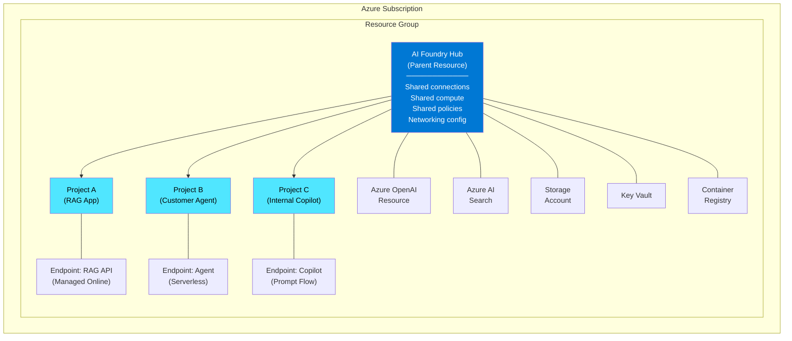
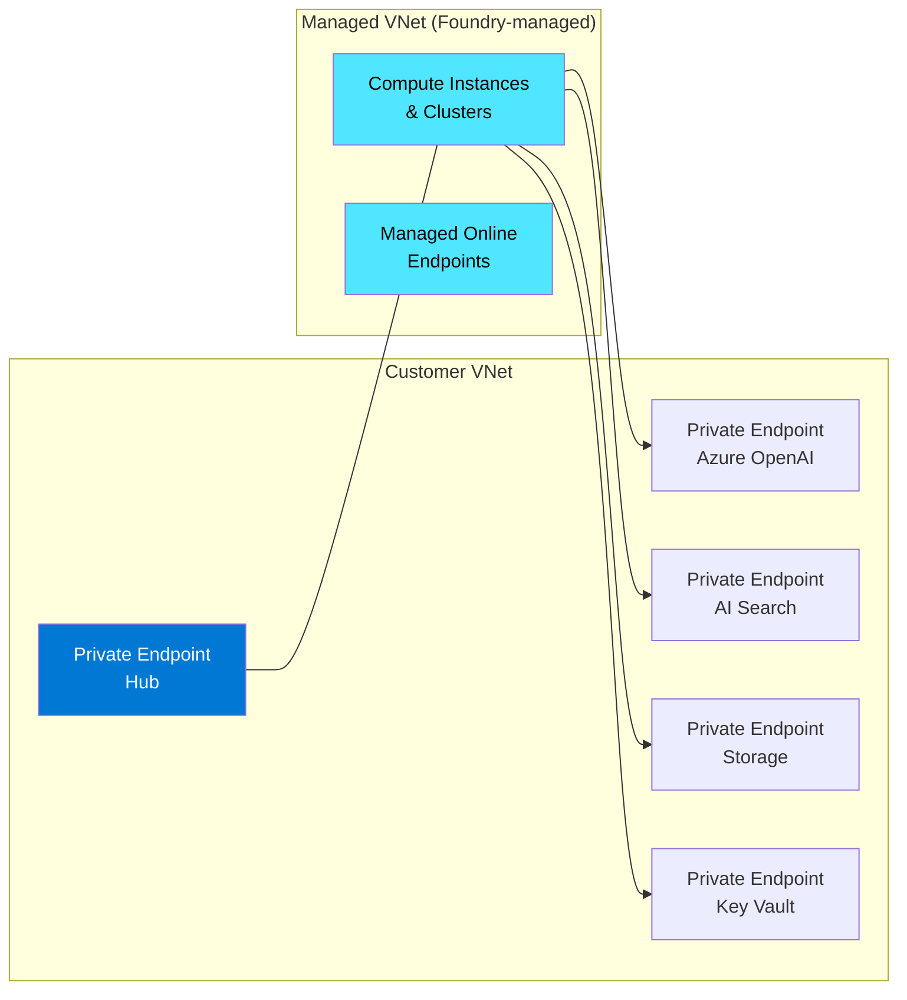
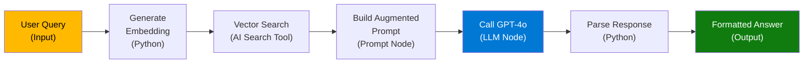
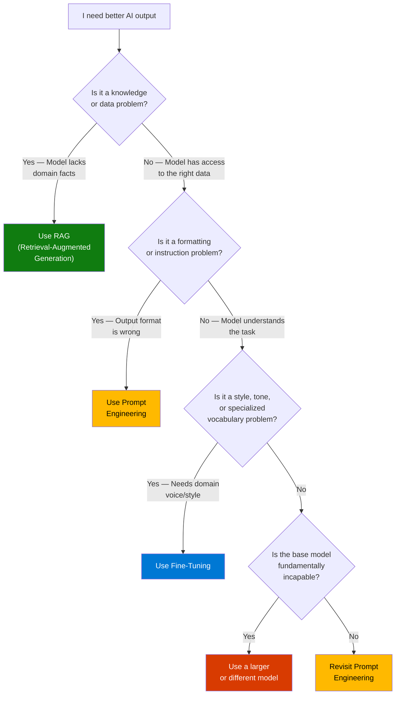
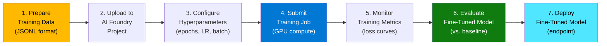
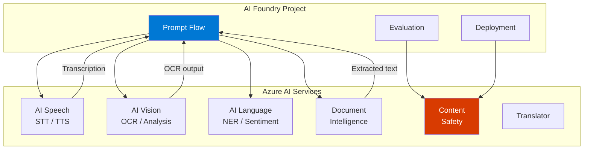
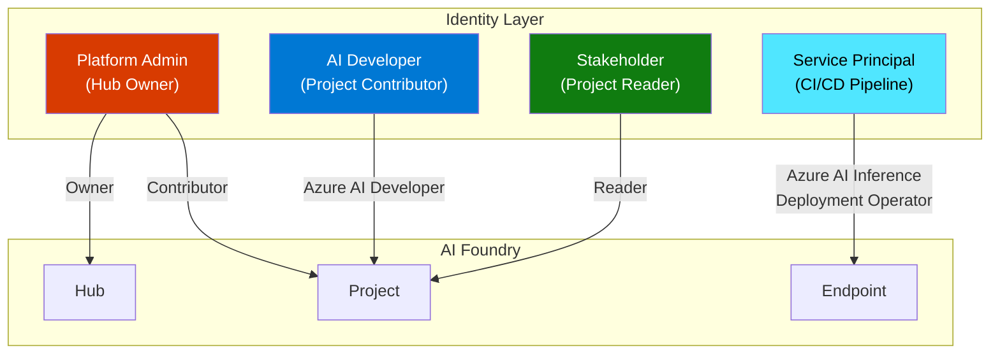

# Module 3: Azure AI Foundry — Microsoft's AI Platform Deep Dive

> **Duration:** 60-90 minutes | **Level:** Platform
> **Audience:** Cloud Architects, Platform Engineers, CSAs
> **Last Updated:** March 2026

---

## 3.1 What is Azure AI Foundry?

Azure AI Foundry is Microsoft's **unified platform for building, evaluating, and deploying generative AI applications** at enterprise scale. If you are an infrastructure or platform architect, think of it as the control plane for everything AI inside Azure -- model catalog, deployments, evaluation pipelines, prompt orchestration, fine-tuning, and integrated AI services all accessible through a single portal, SDK, and CLI.

### The Evolution

The branding journey matters because customers encounter all three names in documentation, blog posts, and portal URLs.

| Era | Name | What It Was | Key Limitation |
|-----|------|-------------|----------------|
| 2016-2022 | **Azure Machine Learning Studio** | Drag-and-drop ML training and deployment | Focused on classical ML; poor LLM support |
| 2023-2024 | **Azure AI Studio** | Preview portal for generative AI projects | Separate from Azure ML; fragmented experience |
| Late 2024+ | **Azure AI Foundry** | Unified platform merging Azure ML + AI Studio | Current GA platform -- this module's focus |

Azure AI Foundry is not a separate resource type that replaces Azure ML. Under the hood, the Azure ML workspace resource (`Microsoft.MachineLearningServices/workspaces`) is still the ARM building block. Foundry is a **unified experience layer** that consolidates model catalog, prompt flow, evaluation, deployments, and AI services into a single portal and SDK.

### Three Interfaces, One Platform

| Interface | Best For | Example Use Case |
|-----------|----------|-----------------|
| **Azure AI Foundry portal** (`ai.azure.com`) | Exploration, visual prompt flow building, model comparison | A CSA demonstrating RAG to a customer |
| **Azure AI Foundry SDK** (Python) | Programmatic model deployment, evaluation pipelines, CI/CD | A platform team automating model rollouts |
| **Azure CLI (`az ml`)** | Infrastructure provisioning, DevOps integration | An IaC pipeline deploying Hubs and Projects |

:::tip Architect's Mental Model
Think of Azure AI Foundry as **"Azure Resource Manager for AI workloads."** Just as ARM gives you a control plane for VMs, networking, and storage, Foundry gives you a control plane for models, endpoints, evaluations, and AI services -- with the same RBAC, networking, and compliance story you already know.
:::

---

## 3.2 Architecture & Resource Model

This is the section that matters most to platform architects. Azure AI Foundry introduces a **two-tier workspace hierarchy**: Hubs and Projects.

### Hub and Project Model



### Hub (Parent Resource)

The **AI Foundry Hub** is the shared administrative boundary. It owns:

- **Connections** -- credentials and endpoints for Azure OpenAI, Azure AI Search, Storage, Key Vault, and external services (e.g., a Snowflake database, a custom API)
- **Compute resources** -- shared compute instances and clusters that Projects can use
- **Networking configuration** -- public access, private endpoints, managed VNet
- **Security policies** -- RBAC role assignments, managed identity, customer-managed keys
- **Container Registry** -- shared ACR for custom model images

A Hub maps to the ARM resource type `Microsoft.MachineLearningServices/workspaces` with `kind: hub`.

### Project (Child Resource)

A **Project** is an isolated workspace scoped to a single AI application or workload. It inherits connections and compute from the parent Hub but maintains its own:

- Model deployments and endpoints
- Prompt flow definitions
- Evaluation runs and datasets
- Fine-tuning jobs
- Artifacts and logs

A Project maps to the ARM resource type `Microsoft.MachineLearningServices/workspaces` with `kind: project` and a `hubResourceId` pointing to its parent Hub.

### Resource Relationship Summary

| Resource | Scope | Cardinality | Key Responsibility |
|----------|-------|-------------|-------------------|
| **Hub** | Organization/Team level | 1 per team or business unit | Shared config, connections, networking, policies |
| **Project** | Application level | Many per Hub | Isolated workspace for a specific AI app |
| **Azure OpenAI** | Connected resource | 1 or more per Hub | LLM API access (GPT-4o, GPT-4.1, o-series) |
| **Azure AI Search** | Connected resource | 0 or more per Hub | Vector search for RAG workloads |
| **Storage Account** | Connected resource | 1 per Hub | Data, artifacts, prompt flow files, logs |
| **Key Vault** | Connected resource | 1 per Hub | Secrets, connection strings, API keys |
| **Container Registry** | Connected resource | 0 or 1 per Hub | Custom model images, prompt flow images |

### RBAC Model

Azure AI Foundry uses Azure RBAC with purpose-built roles.

| Role | Scope | Permissions |
|------|-------|-------------|
| **Azure AI Developer** | Project | Deploy models, run evaluations, create prompt flows, manage endpoints |
| **Azure AI Inference Deployment Operator** | Project | Deploy and manage inference endpoints only |
| **Azure ML Data Scientist** | Project | Full access to experiments, compute, data assets |
| **Contributor** | Hub or Project | Full resource management (create/delete projects, manage connections) |
| **Reader** | Hub or Project | View resources and configurations, no modifications |
| **Owner** | Hub | Full control including RBAC assignment |

:::tip RBAC Best Practice
Assign roles at the **Project level**, not the Hub level. This follows the principle of least privilege -- a developer working on the RAG application should not have access to the internal Copilot project's data and deployments. Use the Hub-level Contributor role only for platform administrators who manage shared infrastructure.
:::

### Networking Options

| Mode | Description | Use Case |
|------|-------------|----------|
| **Public** | Hub and Projects are accessible over public internet with AAD authentication | Development, PoCs, non-sensitive workloads |
| **Private Endpoints** | Hub, connected resources (AOAI, Search, Storage, KV) exposed only via private endpoints in your VNet | Production enterprise workloads |
| **Managed VNet** | Foundry manages a VNet on your behalf; you control outbound rules. Compute runs inside this managed VNet | Simplified private networking without BYO VNet complexity |
| **Managed VNet + Data Exfiltration Protection** | Managed VNet with outbound restricted to approved destinations only | Highly regulated industries (financial services, healthcare) |



---

## 3.3 Model Catalog

The Model Catalog is the front door of Azure AI Foundry. It is a curated marketplace of **1,800+ models** from Microsoft and the open-source ecosystem, ready to deploy with a few clicks or a single SDK call.

### Model Providers

| Provider | Example Models | License Type |
|----------|---------------|-------------|
| **Azure OpenAI (Microsoft)** | GPT-4o, GPT-4.1, GPT-4.1-mini, GPT-4.1-nano, o3, o4-mini | Proprietary (Microsoft-hosted) |
| **Microsoft Research** | Phi-4, Phi-4-mini, Phi-4-multimodal, MAI-1 | Open-weight (MIT license) |
| **Meta** | Llama 4 Scout, Llama 4 Maverick, Llama 3.3 70B | Open-weight (Llama license) |
| **Mistral** | Mistral Large 2, Mistral Small, Codestral, Pixtral | Open-weight / Commercial |
| **Cohere** | Command R+, Command R, Embed v3 | Commercial |
| **AI21 Labs** | Jamba 1.5 Large, Jamba 1.5 Mini | Commercial |
| **Hugging Face** | Hundreds of community models (BERT, T5, Whisper variants) | Various open-source |
| **NVIDIA** | Nemotron, NV-Embed | Open-weight |

### Two Deployment Paradigms

The catalog offers two fundamentally different ways to run a model. Understanding this distinction is critical for cost planning and architecture.

| Dimension | Models as a Service (MaaS) | Managed Compute |
|-----------|---------------------------|-----------------|
| **What it is** | Serverless API -- Microsoft hosts the model | You deploy the model onto dedicated VMs |
| **Billing** | Pay-per-token (input + output tokens) | Pay-per-hour for the VM SKU |
| **Compute management** | None -- fully managed | You choose VM size, instance count, scaling rules |
| **Cold start** | None (always warm) | Possible if scaled to zero |
| **Customization** | System prompts and parameters only | Full control -- custom containers, fine-tuned weights |
| **Available models** | Azure OpenAI models, select partner models (Llama, Mistral, Cohere) | Any model from the catalog or a custom model |
| **Networking** | Public endpoint with AAD auth; private endpoint available | Private endpoint, VNet integration, managed VNet |
| **Best for** | Quick prototyping, variable workloads, multi-model testing | Production workloads with predictable traffic, custom models, strict isolation |

### Serverless API Endpoints (MaaS)

Serverless API endpoints are the simplest path from model selection to production. You select a model from the catalog, accept the terms, and receive an API endpoint and key. No compute provisioning, no VM sizing, no scaling configuration.

**Key characteristics:**

- **Pay-per-token pricing** -- you pay only for the tokens you consume (input + output)
- **No infrastructure to manage** -- Microsoft handles scaling, availability, and hardware
- **Azure OpenAI-compatible API** -- same SDK and API contract as Azure OpenAI deployments
- **Immediate availability** -- endpoint is live within seconds of deployment
- **Regional availability matters** -- not all models are available in all regions

### Managed Online Endpoints

Managed Online Endpoints give you **dedicated compute** for model serving. You deploy a model (from the catalog or your own custom model) to a specific VM SKU and control scaling.

**Key characteristics:**

- **Dedicated VMs** -- choose from CPU or GPU SKUs (e.g., `Standard_NC24ads_A100_v4`)
- **Autoscaling** -- scale based on request count, CPU, or custom metrics
- **Blue-green deployments** -- traffic splitting across multiple deployments for safe rollouts
- **Custom containers** -- bring your own inference server (e.g., vLLM, TGI, Triton)
- **VNet integration** -- deploy endpoints inside a managed VNet with private endpoint access

### Comparing Models in the Catalog

The portal provides built-in tools for model comparison:

1. **Benchmark scores** -- view standardized benchmarks (MMLU, HumanEval, MT-Bench) side by side
2. **Model cards** -- detailed descriptions of capabilities, limitations, and intended use cases
3. **Try it out** -- interactive playground to test models with your own prompts before deploying
4. **Pricing calculator** -- estimate costs based on expected token volume
5. **Region availability** -- check which regions support which models

---

## 3.4 Model Deployments

Deployment is where architecture decisions meet operational reality. Azure AI Foundry supports three deployment types, each with different performance, cost, and management characteristics.

### Deployment Type 1: Azure OpenAI Deployments

These are deployments of Microsoft's proprietary models (GPT-4o, GPT-4.1, o3, etc.) through the Azure OpenAI Service resource connected to your Hub.

| Variant | Description | Billing | SLA | Best For |
|---------|-------------|---------|-----|----------|
| **Standard** | Shared capacity in a single region | Pay-per-token | 99.9% | Development, moderate production workloads |
| **Global Standard** | Shared capacity across global regions (auto-routed) | Pay-per-token (same price) | 99.9% | Production workloads that benefit from global capacity and lower latency |
| **Provisioned (PTU)** | Reserved throughput units in a specific region | Pay-per-PTU-hour (reserved) | 99.9% | Predictable high-volume workloads, latency-sensitive apps |
| **Global Provisioned (PTU)** | Reserved throughput units across global regions | Pay-per-PTU-hour (reserved) | 99.9% | High-volume global workloads needing guaranteed throughput |
| **Data Zone Standard** | Shared capacity within a data boundary (e.g., EU) | Pay-per-token | 99.9% | Data residency requirements |
| **Data Zone Provisioned** | Reserved throughput within a data boundary | Pay-per-PTU-hour | 99.9% | High-volume workloads with data residency requirements |

:::tip Understanding PTUs
A **Provisioned Throughput Unit (PTU)** is a unit of reserved model processing capacity. One PTU does not equal one request -- the relationship depends on the model, prompt size, and generation length. Use the Azure OpenAI **capacity calculator** to estimate how many PTUs your workload needs. PTUs are committed in monthly or yearly reservations, with significant discounts for longer commitments.
:::

### Deployment Type 2: Serverless API Deployments

These are pay-per-token deployments for partner models (Llama, Mistral, Cohere) and some Microsoft models that use the Models as a Service (MaaS) infrastructure.

- No compute to manage
- You accept the model provider's terms of use
- Charged per million input/output tokens
- Endpoint is Azure OpenAI-compatible (same SDK, same API shape)

### Deployment Type 3: Managed Online Endpoints

These are dedicated-compute deployments for any model -- from the catalog or custom.

- You select the VM SKU and instance count
- Support for autoscaling (min/max replicas, scaling metric)
- Blue-green deployment with traffic splitting
- Custom inference containers supported
- Full VNet integration and private endpoint access

### Deployment Types Comparison

| Dimension | Azure OpenAI (Standard) | Azure OpenAI (PTU) | Serverless API (MaaS) | Managed Online Endpoint |
|-----------|------------------------|--------------------|-----------------------|------------------------|
| **Models** | GPT-4o, GPT-4.1, o3, etc. | GPT-4o, GPT-4.1, o3, etc. | Llama, Mistral, Cohere, etc. | Any (catalog or custom) |
| **Billing** | Per token | Per PTU-hour (reserved) | Per token | Per VM-hour |
| **Throughput** | Shared, rate-limited | Guaranteed (reserved) | Shared, rate-limited | Dedicated (VM-bound) |
| **Latency** | Variable (shared pool) | Predictable (reserved) | Variable (shared pool) | Predictable (dedicated) |
| **Scaling** | Automatic (within quota) | Fixed PTU allocation | Automatic (within quota) | Manual or autoscale |
| **Networking** | Public + Private Endpoint | Public + Private Endpoint | Public + Private Endpoint | Managed VNet + Private Endpoint |
| **GPU management** | None | None | None | You choose VM SKU |
| **Customization** | System prompt, parameters | System prompt, parameters | System prompt, parameters | Full (custom container, weights) |

### Quotas and Rate Limits

Every deployment type has quotas. Platform architects must plan for quota as a first-class infrastructure concern.

| Quota Type | Applies To | Unit | How to Increase |
|------------|-----------|------|-----------------|
| **Tokens per Minute (TPM)** | Azure OpenAI Standard | Tokens/min per deployment | Azure portal quota page or support ticket |
| **Requests per Minute (RPM)** | Azure OpenAI Standard | Requests/min per deployment | Derived from TPM (approximately TPM / 6) |
| **PTU allocation** | Azure OpenAI Provisioned | PTU count per subscription/region | Capacity reservation via portal or support |
| **Endpoint count** | Managed Online Endpoints | Endpoints per subscription/region | Support ticket |
| **VM cores** | Managed Online Endpoints | vCPU cores per subscription/region | Standard Azure quota increase |

---

## 3.5 Prompt Flow

Prompt Flow is Azure AI Foundry's **visual orchestration tool for building LLM applications**. If you are familiar with Azure Logic Apps or Power Automate, the mental model is similar -- but purpose-built for AI workflows.

### What is Prompt Flow?

Prompt Flow lets you build **DAG-based flows** (Directed Acyclic Graphs) where each node performs a specific operation: call an LLM, execute Python code, process a prompt template, or invoke a tool. The output of one node feeds into the next, creating a composable pipeline.



### Node Types

| Node Type | Purpose | Example |
|-----------|---------|---------|
| **LLM** | Call a language model (Azure OpenAI, Serverless API) | Generate a response given context and query |
| **Prompt** | Define a prompt template with variable substitution | Build a system message with `{{context}}` and `{{query}}` placeholders |
| **Python** | Execute arbitrary Python code | Parse JSON, call an external API, transform data |
| **Tool** | Invoke a pre-built or custom tool | Azure AI Search retrieval, Bing Search, custom REST calls |
| **LLM + Function Calling** | Call an LLM with tool definitions for autonomous tool selection | Agent-style node that decides which tools to call |
| **Conditional** | Branch the flow based on a condition | Route to different LLMs based on query complexity |

### Use Case: Building a RAG Pipeline in Prompt Flow

Here is how you would build a Retrieval-Augmented Generation pipeline visually in Prompt Flow:

**Step 1: Input Node** -- Accept the user's query as a string input.

**Step 2: Embedding Node (Python)** -- Call the Azure OpenAI embedding model to convert the query into a vector.

**Step 3: Search Node (Tool)** -- Query Azure AI Search with the vector to retrieve the top-k most relevant document chunks.

**Step 4: Prompt Node** -- Construct an augmented prompt that injects the retrieved chunks as context, along with the user query.

**Step 5: LLM Node** -- Send the augmented prompt to GPT-4o for answer generation.

**Step 6: Output Node** -- Return the generated answer along with source citations.

The entire flow is defined as a YAML file (`flow.dag.yaml`) that can be version-controlled in Git, making it CI/CD-friendly.

### Evaluation Flows

Prompt Flow supports a special type of flow called an **evaluation flow**. Instead of processing user queries, evaluation flows **score the quality of outputs** produced by your main flow.

An evaluation flow typically:

1. Takes the main flow's output (answer), the ground-truth answer, and the original question as inputs
2. Calls an LLM (or runs custom Python logic) to score the output on metrics like groundedness, relevance, and coherence
3. Outputs numerical scores that can be aggregated across a test dataset

This enables automated quality gates in your CI/CD pipeline -- if the evaluation scores drop below a threshold, the deployment is blocked.

### Deploying a Flow as an Endpoint

Once you have built and tested a Prompt Flow:

1. **Build** the flow into a Docker container (Foundry handles this automatically)
2. **Deploy** the container to a Managed Online Endpoint
3. **Configure** autoscaling, traffic splitting, and authentication
4. **Monitor** with built-in metrics (latency, throughput, error rate, token consumption)

The deployed flow exposes a REST API endpoint that your application calls -- just like any other microservice.

---

## 3.6 Model Evaluation

Evaluation is the most underinvested area in most AI projects and the most important area for production readiness. Azure AI Foundry provides built-in evaluation capabilities that let you systematically measure model quality before deployment.

### Why Evaluation Matters

| Without Evaluation | With Evaluation |
|--------------------|-----------------|
| "It seems to work okay in my testing" | Quantified quality scores across hundreds of test cases |
| Ship and hope | Ship with confidence backed by metrics |
| Catch problems from user complaints | Catch problems before users see them |
| No regression detection | Automated regression testing in CI/CD |
| Anecdotal quality assessment | Data-driven model selection and prompt optimization |

### Built-in Evaluation Metrics

Azure AI Foundry provides LLM-as-a-judge evaluation metrics that use a grader model (typically GPT-4o) to score your application's outputs.

| Metric | What It Measures | Scale | When It Matters |
|--------|-----------------|-------|-----------------|
| **Groundedness** | Is the answer supported by the provided context? (Not hallucinated) | 1-5 | RAG applications -- critical for factual accuracy |
| **Relevance** | Does the answer address the user's actual question? | 1-5 | All applications -- ensures on-topic responses |
| **Coherence** | Is the answer logically structured and readable? | 1-5 | Long-form generation -- reports, summaries, explanations |
| **Fluency** | Is the language natural, grammatically correct? | 1-5 | Customer-facing applications |
| **Similarity** | How close is the answer to a known ground-truth answer? | 1-5 | Applications with deterministic expected outputs |
| **F1 Score** | Token-level overlap with ground-truth | 0-1 | Extractive QA tasks |
| **ROUGE** | N-gram overlap with reference text | 0-1 | Summarization tasks |
| **BLEU** | Precision of n-gram overlap | 0-1 | Translation tasks |

### Custom Evaluation Metrics

When built-in metrics are not sufficient, you can define custom evaluation metrics using:

- **Python functions** -- Write a Python function that takes the model output and returns a score
- **LLM-as-a-judge prompts** -- Write a custom prompt that instructs GPT-4o to score the output on your domain-specific criteria (e.g., "Does this medical summary include all required ICD-10 codes?")
- **Composite metrics** -- Combine multiple metrics into a single quality score with weighted averages

### Red-Teaming Evaluations

Red-teaming tests whether your AI application can be manipulated into producing harmful, biased, or policy-violating outputs.

Azure AI Foundry supports red-teaming through:

1. **Automated adversarial testing** -- Built-in adversarial datasets that probe for jailbreaks, prompt injections, and content policy violations
2. **Custom red-team datasets** -- Define your own adversarial prompts tailored to your application's domain
3. **Azure AI Content Safety integration** -- Automatically score outputs for hate speech, violence, self-harm, and sexual content severity levels
4. **Human-in-the-loop review** -- Export flagged outputs for manual review by your safety team

### Evaluation Datasets and Test Suites

A robust evaluation requires a well-curated test dataset. Best practices:

| Component | Description | Recommended Size |
|-----------|-------------|-----------------|
| **Golden dataset** | Curated question-answer pairs with verified ground-truth | 100-500 examples |
| **Edge case dataset** | Unusual, ambiguous, or boundary-condition queries | 50-100 examples |
| **Adversarial dataset** | Prompt injection attempts, jailbreak probes, out-of-scope queries | 50-200 examples |
| **Regression dataset** | Previously failed cases that were fixed -- prevents regressions | Grows over time |

:::tip Evaluation as a CI/CD Gate
The highest-maturity AI teams treat evaluation as a **deployment gate**. Every PR that changes a prompt, updates a RAG pipeline, or swaps a model triggers an automated evaluation run. If scores drop below the baseline, the deployment is blocked. This is no different from blocking a deployment on failing unit tests -- the principle is identical.
:::

---

## 3.7 Fine-Tuning

Fine-tuning is the process of further training a pre-trained model on your domain-specific data to improve its performance on your specific use case. Azure AI Foundry supports fine-tuning for select models directly within the platform.

### When to Fine-Tune (And When NOT To)



### Fine-Tuning Decision Matrix

| Technique | Cost | Time to Implement | Data Required | Best For | Risk |
|-----------|------|-------------------|---------------|----------|------|
| **Prompt Engineering** | Free | Minutes to hours | 0 - a few examples | Formatting, behavior control, output structure | Low |
| **RAG** | Medium ($) | Hours to days | Document corpus | Factual grounding, dynamic/changing knowledge | Low-Medium |
| **Fine-Tuning** | High ($$) | Days to weeks | 50-10,000+ examples | Domain style, specialized vocabulary, consistent tone | Medium (catastrophic forgetting) |
| **Pre-Training from scratch** | Very High ($$$$$) | Weeks to months | Billions of tokens | Entirely new language or domain | Very High |

### Supported Models for Fine-Tuning

| Model | Minimum Examples | Recommended Examples | Max Training Tokens | Fine-Tuning Method |
|-------|-----------------|---------------------|--------------------|--------------------|
| **GPT-4o** | 10 | 50-500 | Varies by tier | Supervised fine-tuning |
| **GPT-4o-mini** | 10 | 50-500 | Varies by tier | Supervised fine-tuning |
| **GPT-4.1-mini** | 10 | 50-500 | Varies by tier | Supervised fine-tuning |
| **Phi-4** | 10 | 100-1,000 | Varies | LoRA / Full fine-tuning |
| **Phi-4-mini** | 10 | 100-1,000 | Varies | LoRA / Full fine-tuning |
| **Llama 3.3 70B** | 10 | 100-1,000 | Varies | LoRA |
| **Mistral models** | 10 | 100-1,000 | Varies | LoRA |

### Fine-Tuning Workflow



**Data preparation format (JSONL):**

```json
{"messages": [{"role": "system", "content": "You are a medical coding specialist."}, {"role": "user", "content": "Patient presents with acute bronchitis and mild dehydration."}, {"role": "assistant", "content": "ICD-10 Codes:\n- J20.9 (Acute bronchitis, unspecified)\n- E86.0 (Dehydration)"}]}
{"messages": [{"role": "system", "content": "You are a medical coding specialist."}, {"role": "user", "content": "Follow-up for type 2 diabetes, well controlled."}, {"role": "assistant", "content": "ICD-10 Code:\n- E11.65 (Type 2 diabetes mellitus with hyperglycemia)"}]}
```

### LoRA and Parameter-Efficient Fine-Tuning

**LoRA (Low-Rank Adaptation)** is a technique that fine-tunes only a small number of additional parameters (adapters) rather than updating all model weights. This has major implications for architects:

| Dimension | Full Fine-Tuning | LoRA Fine-Tuning |
|-----------|-----------------|------------------|
| **Parameters updated** | All (billions) | Small adapter matrices (millions) |
| **GPU memory required** | Very high (40-80 GB+) | Much lower (often fits on a single GPU) |
| **Training time** | Hours to days | Minutes to hours |
| **Storage per model** | Full model copy (tens of GB) | Small adapter file (tens of MB) |
| **Risk of catastrophic forgetting** | Higher | Lower (base model unchanged) |
| **Multiple specialties** | Need a full copy per specialty | Swap adapters at inference time |
| **Quality** | Marginally better for large domain shifts | Excellent for most use cases |

### Cost and Compute Requirements

Fine-tuning costs are driven by three factors:

1. **Training compute** -- GPU hours consumed during training (typically `Standard_NC24ads_A100_v4` or similar)
2. **Hosting cost** -- Fine-tuned Azure OpenAI models incur higher per-token costs than base models; custom models on Managed Online Endpoints cost per VM-hour
3. **Data preparation** -- Human time to curate, clean, and validate training data (often the most expensive part)

---

## 3.8 Azure AI Services (Integrated)

Azure AI Foundry integrates with the broader **Azure AI Services** family -- pre-built, task-specific AI capabilities that were previously known as Azure Cognitive Services. These services complement generative AI models by handling specialized tasks like speech recognition, document parsing, and content moderation.

### Service Overview

| Service | Capabilities | Common Use Cases | Integration with Foundry |
|---------|-------------|-----------------|--------------------------|
| **Azure AI Speech** | Speech-to-text (STT), text-to-speech (TTS), speech translation, speaker recognition | Voice-enabled copilots, call center analytics, accessibility | Prompt Flow speech nodes, real-time conversation APIs |
| **Azure AI Vision** | Image analysis, OCR, spatial analysis, face detection, custom image classification | Document digitization, visual search, accessibility | Multi-modal RAG (image + text), document processing pipelines |
| **Azure AI Language** | Named Entity Recognition (NER), sentiment analysis, key phrase extraction, summarization, PII detection | Customer feedback analysis, compliance scanning, content tagging | Pre-processing nodes in Prompt Flow, PII redaction before LLM calls |
| **Azure AI Document Intelligence** | Form extraction, invoice processing, receipt parsing, layout analysis, custom document models | Accounts payable automation, contract analysis, claims processing | Document ingestion for RAG pipelines, structured data extraction |
| **Azure AI Content Safety** | Text and image content moderation, prompt shield, groundedness detection, protected material detection | Guardrails for AI applications, user-generated content moderation | Built-in content filtering for Azure OpenAI deployments, evaluation metrics |
| **Azure AI Translator** | Text translation (100+ languages), document translation, custom terminology | Multi-language copilots, document localization | Pre/post-processing in Prompt Flow |

### How These Integrate with Foundry Projects



**Key integration patterns:**

1. **Document Intelligence as RAG Ingestion** -- Use Document Intelligence to extract text, tables, and structure from PDFs and images, then chunk and embed the output for vector search
2. **Content Safety as a Guardrail** -- Content Safety filters run automatically on Azure OpenAI deployments; you can also invoke them explicitly in Prompt Flow for custom models
3. **Speech as an I/O Layer** -- Add voice input/output to any Prompt Flow by using Speech STT (input) and TTS (output) nodes
4. **Language for Pre-Processing** -- Use PII detection to redact sensitive data before sending to an LLM; use NER to extract entities for structured queries

---

## 3.9 Infrastructure Considerations

This section addresses the infrastructure decisions that platform architects must make when deploying Azure AI Foundry in production.

### Compute Options

| Compute Type | Used For | Management | GPU | Typical SKUs |
|-------------|----------|------------|-----|-------------|
| **Serverless (MaaS)** | Azure OpenAI and partner model inference | Fully managed by Microsoft | N/A (abstracted) | N/A |
| **Managed Compute Instance** | Development, Prompt Flow authoring, notebooks | Managed VM (start/stop) | Optional | Standard_DS3_v2, Standard_NC6s_v3 |
| **Managed Compute Cluster** | Training, fine-tuning, batch inference | Managed cluster (auto-scaling) | Yes | Standard_NC24ads_A100_v4, Standard_ND96amsr_A100_v4 |
| **Managed Online Endpoint** | Production model serving | Managed deployment (auto-scaling) | Yes, for LLM serving | Standard_NC24ads_A100_v4, Standard_NC48ads_H100_v5 |
| **Kubernetes (AKS)** | Self-managed model serving via attached AKS | Customer-managed | Yes (GPU node pools) | Any AKS-supported GPU VM |

### Networking Deep Dive

Production deployments of Azure AI Foundry require careful networking design. The following table summarizes the network endpoints you need to plan for:

| Resource | Private Endpoint Required? | DNS Zone | Notes |
|----------|---------------------------|----------|-------|
| AI Foundry Hub | Yes | `privatelink.api.azureml.ms` | Controls access to the workspace API |
| Azure OpenAI | Yes | `privatelink.openai.azure.com` | Must be in the same or peered VNet |
| Azure AI Search | Yes | `privatelink.search.windows.net` | Required for private RAG pipelines |
| Storage Account (blob) | Yes | `privatelink.blob.core.windows.net` | Data, artifacts, logs |
| Storage Account (file) | Yes | `privatelink.file.core.windows.net` | File shares for compute instances |
| Key Vault | Yes | `privatelink.vaultcore.azure.net` | Secrets and connection strings |
| Container Registry | Yes | `privatelink.azurecr.io` | Custom model images |
| Managed Online Endpoint | Automatic | Managed by Foundry | When using Managed VNet |

:::tip DNS Resolution
Private endpoints require proper DNS resolution. Use **Azure Private DNS Zones** linked to your VNet, or configure conditional forwarders in your on-premises DNS infrastructure. Missing or incorrect DNS resolution is the #1 cause of connectivity failures in private AI Foundry deployments.
:::

### Data Residency and Compliance

| Concern | How Azure AI Foundry Addresses It |
|---------|----------------------------------|
| **Data residency** | Choose Hub region carefully. Data (prompts, completions, training data) stays in the Hub's region. Azure OpenAI processing region depends on deployment type (Standard = single region; Global Standard = Microsoft-routed). |
| **Data processing** | Prompts and completions are NOT used to train Microsoft models. Opt-out is the default for Azure OpenAI Service. |
| **Compliance certifications** | Azure OpenAI and AI Foundry inherit Azure's compliance portfolio (SOC 2, ISO 27001, HIPAA BAA, FedRAMP, etc.). Verify per-model availability in compliance-scoped regions. |
| **Customer-Managed Keys (CMK)** | Supported at the Hub level for encrypting data at rest with your own Key Vault key. |
| **Managed Identity** | Hub and Projects use system-assigned or user-assigned managed identities for authentication to connected resources -- no API keys in code. |

### RBAC and Security Model (Expanded)



**Security best practices:**

1. **Use Managed Identity** for all service-to-service communication. Avoid storing API keys in Key Vault when managed identity is supported.
2. **Enable Managed VNet** with data exfiltration protection for regulated workloads.
3. **Apply RBAC at the Project level** -- not the Hub level -- to enforce least privilege.
4. **Use Conditional Access policies** in Entra ID to enforce MFA and compliant device requirements for Foundry portal access.
5. **Enable diagnostic logging** to send Hub and Project audit logs to a Log Analytics workspace or SIEM.

### Cost Management

| Cost Driver | How to Optimize |
|-------------|----------------|
| **Azure OpenAI Standard (pay-per-token)** | Monitor token usage per deployment; set TPM quotas to prevent runaway costs; use smaller models (GPT-4.1-mini, GPT-4.1-nano) for simpler tasks |
| **Azure OpenAI Provisioned (PTU)** | Right-size PTU allocation using the capacity calculator; commit to 1-year reservations for ~40% discount; consolidate workloads on shared PTUs |
| **Managed Online Endpoints** | Enable autoscaling with scale-to-zero for dev/test; use spot VMs for non-production fine-tuning; right-size GPU SKUs |
| **Storage** | Lifecycle management policies for training data and logs; delete unused evaluation datasets |
| **Azure AI Search** | Right-size the Search SKU; use semantic ranker only when needed; partition indexes by workload |
| **Compute Instances** | Auto-shutdown schedules for dev instances; use small SKUs for Prompt Flow authoring |

---

## 3.10 Azure AI Foundry vs AWS Bedrock vs Google Vertex AI

Platform architects in multi-cloud environments need to understand how Azure AI Foundry compares to its counterparts on AWS and Google Cloud.

### Feature Comparison

| Capability | Azure AI Foundry | AWS Bedrock | Google Vertex AI |
|-----------|-----------------|-------------|-----------------|
| **Unified AI platform** | Yes (portal, SDK, CLI) | Partial (Bedrock + SageMaker) | Yes (Vertex AI console, SDK, CLI) |
| **Model catalog size** | 1,800+ models | ~30 models (fewer providers) | 200+ models (Model Garden) |
| **Proprietary frontier models** | GPT-4.1, o3, o4-mini (Azure OpenAI exclusive) | Claude (Anthropic), Nova (Amazon) | Gemini 2.5 (Google-exclusive) |
| **Open-weight models** | Llama, Mistral, Phi, Cohere, AI21 | Llama, Mistral, Cohere | Llama, Mistral, Gemma |
| **Serverless API (MaaS)** | Yes (Azure OpenAI + partner models) | Yes (all Bedrock models) | Yes (Vertex AI endpoint) |
| **Dedicated compute deployment** | Managed Online Endpoints | SageMaker Endpoints | Vertex AI Endpoints |
| **Fine-tuning** | GPT-4o, Phi, Llama, Mistral (in-platform) | Claude, Llama, Titan (limited) | Gemini, Llama (in-platform) |
| **Prompt orchestration** | Prompt Flow (visual + YAML) | Bedrock Agents + Step Functions | Vertex AI Reasoning Engine |
| **RAG built-in** | Yes (AI Search integration) | Yes (Knowledge Bases) | Yes (Vertex AI Search) |
| **Evaluation framework** | Built-in (groundedness, relevance, etc.) | Limited (Bedrock Evaluation - preview) | Built-in (AutoSxS, Gen AI Evaluation) |
| **Content safety** | Azure AI Content Safety (integrated) | Bedrock Guardrails | Vertex AI Safety Filters |
| **Enterprise networking** | Private Endpoints, Managed VNet, data exfiltration protection | VPC endpoints, PrivateLink | VPC-SC, Private Service Connect |
| **RBAC granularity** | Hub + Project level RBAC | IAM policies (resource-level) | IAM + Vertex AI roles |
| **Compliance portfolio** | 100+ certifications | 90+ certifications | 100+ certifications |
| **Agent framework** | Azure AI Agent Service, Semantic Kernel, AutoGen | Bedrock Agents | Vertex AI Agent Builder |
| **Workspace hierarchy** | Hub/Project (two-tier) | Flat (per-account) | Flat (per-project) |

### Where Azure AI Foundry Shines

1. **Azure OpenAI exclusivity** -- GPT-4.1, o3, and o4-mini are available on Azure with enterprise SLAs, private networking, and content filtering. No other cloud offers these models as managed services.
2. **Enterprise security posture** -- The Hub/Project model, Managed VNet with data exfiltration protection, customer-managed keys, and deep Entra ID integration provide a security story that is hard to match.
3. **Microsoft ecosystem integration** -- Seamless connection to Microsoft 365 Copilot, Copilot Studio, Dynamics 365, Power Platform, and GitHub Copilot. If the customer is a Microsoft shop, the integration advantage is substantial.
4. **Model catalog breadth** -- 1,800+ models (catalog + Hugging Face) give architects maximum flexibility without leaving the platform.
5. **Prompt Flow** -- A mature, visual orchestration tool with YAML-based CI/CD support that neither Bedrock nor Vertex AI match in capability.

### Where Competitors Have Edges

| Area | Competitor Edge | Detail |
|------|----------------|--------|
| **Anthropic Claude models** | AWS Bedrock | Claude is available on Bedrock as a first-party integration with fine-tuning support. On Azure, Claude is available via the model catalog but with fewer features. |
| **Google Gemini models** | Google Vertex AI | Gemini 2.5 Pro/Flash are Vertex AI exclusives with massive context windows (up to 1M tokens) and native multi-modal capabilities. |
| **SageMaker maturity** | AWS SageMaker | For classical ML training and MLOps, SageMaker has a longer track record and deeper feature set than Azure ML components within Foundry. |
| **Grounding with search** | Google Vertex AI | Google Search grounding in Vertex AI provides real-time web search context natively in API calls -- a unique capability. |
| **Simplicity** | AWS Bedrock | Bedrock's flat model (no Hub/Project hierarchy) is simpler for teams that do not need multi-project isolation. |

### Multi-Cloud Considerations

For organizations running multi-cloud AI strategies:

- **Standardize on OpenAI-compatible API format** -- Azure OpenAI, many Serverless API models, and several third-party providers all support the OpenAI chat completions API shape. Building your application against this API makes cloud portability easier.
- **Abstract the orchestration layer** -- Use Semantic Kernel or LangChain as your orchestration framework rather than cloud-specific tools (Prompt Flow, Bedrock Agents). These frameworks support multiple model providers.
- **Separate model selection from infrastructure** -- Design your architecture so that swapping a model provider (Azure OpenAI to Bedrock Claude) requires a configuration change, not a code rewrite.
- **Evaluate per workload** -- Some workloads may be best served by Azure (GPT-4.1 for enterprise chat), others by AWS (Claude for long-context analysis), and others by Google (Gemini for multi-modal). Let the use case drive the platform decision.

---

## Key Takeaways

| # | Takeaway |
|---|---------|
| 1 | Azure AI Foundry is the **unified platform** for building, evaluating, and deploying AI applications on Azure -- it consolidates what was previously Azure ML Studio and Azure AI Studio. |
| 2 | The **Hub/Project model** is your workspace hierarchy: Hub = shared infrastructure and connections, Project = isolated workspace per application. Design your Hub/Project topology like you design your subscription topology. |
| 3 | The Model Catalog offers **1,800+ models** via two paths: **Serverless API (pay-per-token, zero compute management)** and **Managed Online Endpoints (dedicated compute, full control)**. |
| 4 | Azure OpenAI deployments come in **Standard (pay-per-token)** and **Provisioned (PTU, reserved throughput)** variants. PTU planning is a first-class infrastructure concern for high-volume workloads. |
| 5 | **Prompt Flow** is a visual DAG-based orchestration tool for building LLM pipelines (RAG, agents, chatbots) that can be deployed as managed endpoints and version-controlled in Git. |
| 6 | **Evaluation is not optional** -- use built-in metrics (groundedness, relevance, coherence) and red-teaming evaluations as CI/CD gates before every production deployment. |
| 7 | **Fine-tune only when prompt engineering and RAG are insufficient** -- fine-tuning is for style, tone, and specialized vocabulary, not for injecting knowledge (use RAG for that). |
| 8 | Azure AI Services (Speech, Vision, Language, Document Intelligence, Content Safety) integrate natively with Foundry projects as pre/post-processing capabilities. |
| 9 | **Networking, RBAC, and cost management** are the same disciplines you apply to any Azure workload -- private endpoints, managed identity, least-privilege RBAC, right-sized compute, and autoscaling. |
| 10 | In a multi-cloud comparison, Azure AI Foundry's advantages are **OpenAI model exclusivity, enterprise security depth, and Microsoft ecosystem integration**. Competitors have edges in specific models (Claude on Bedrock, Gemini on Vertex AI) and simplicity. |

---

## What is Next?

You now understand the platform where AI applications are built and deployed. In the next module, we explore the **consumer-facing side of Microsoft's AI strategy** -- the Copilot ecosystem that sits on top of this platform.

**Next:** [Module 4: Microsoft Copilot Ecosystem](./04-Copilot-Ecosystem.md) -- M365 Copilot, Copilot Studio, Copilot Actions, GitHub Copilot, Copilot for Azure, and the extensibility model that connects them all.

**Previous:** [Module 2: LLM Landscape](./02-LLM-Landscape.md)
