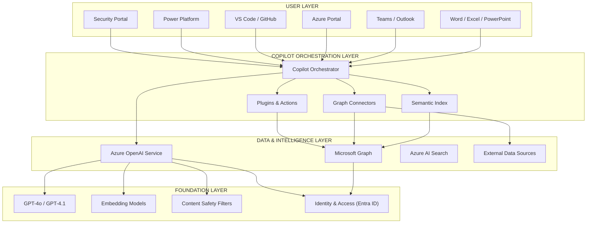
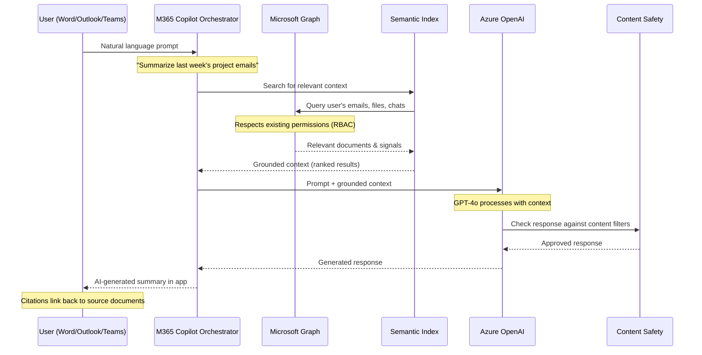
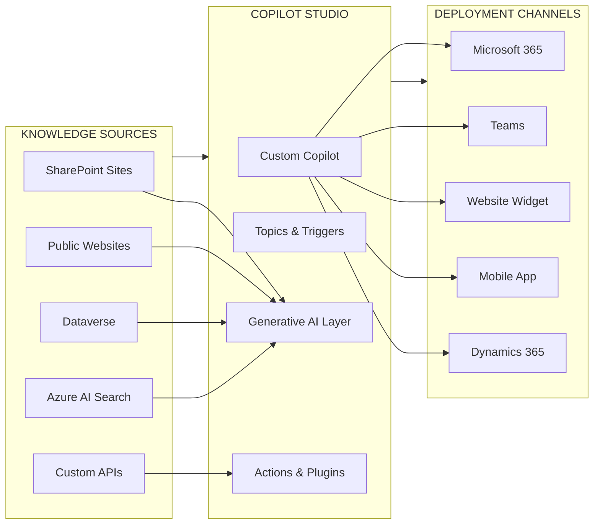
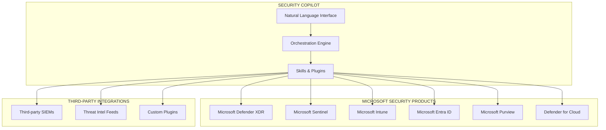
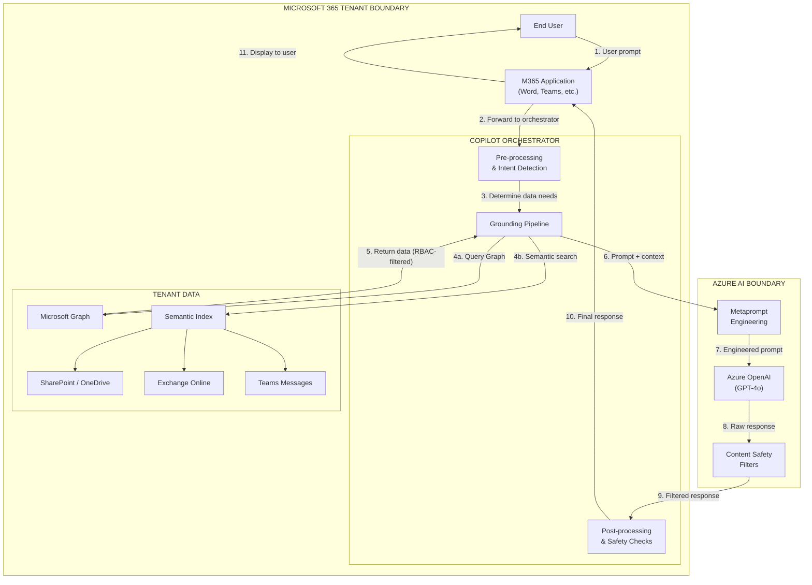
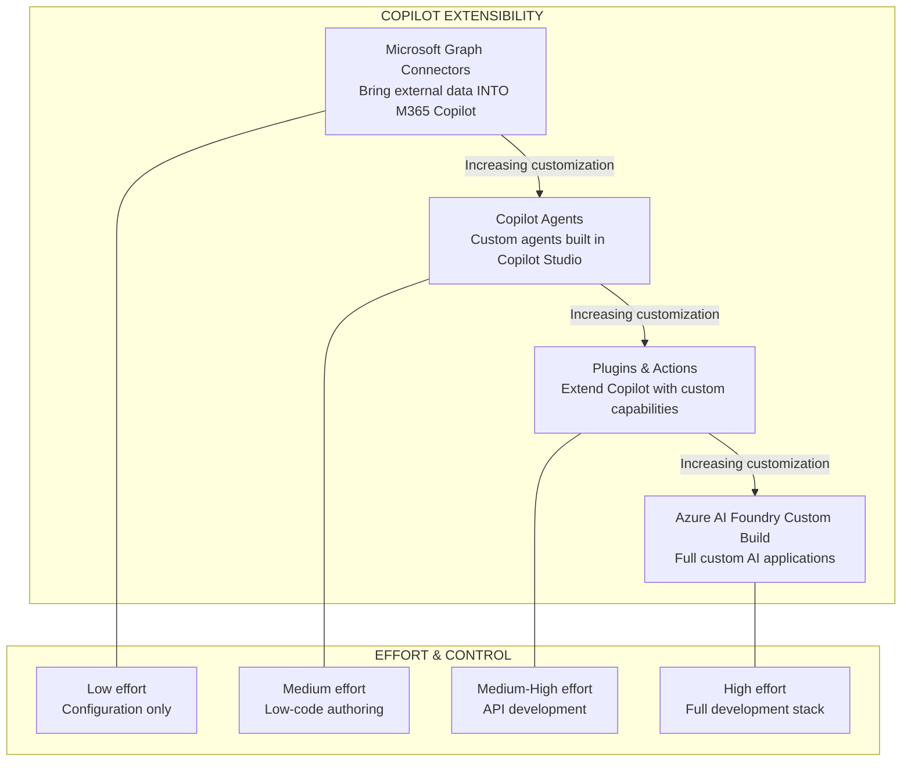
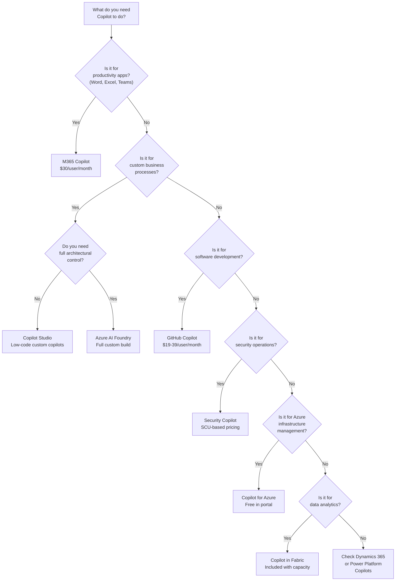

# Module 4: The Microsoft Copilot Ecosystem — Complete Guide

> **Duration:** 45-60 minutes | **Level:** Platform
> **Audience:** Cloud Architects, Platform Engineers, CSAs
> **Last Updated:** March 2026

---

## 4.1 What is Copilot?

When Microsoft says "Copilot," they are not referring to a single product. **Copilot is a brand** — a family of AI assistants embedded across the entire Microsoft surface area. Each Copilot is purpose-built for its product domain, but they all share a common architectural DNA.

### The Core Idea

Every Copilot follows the same principle: take a large language model, ground it with **contextual data** specific to the product, and deliver an AI assistant that understands the user's work environment.

| Component | Role | Example |
|---|---|---|
| **LLM (Foundation Model)** | Reasoning engine that generates responses | GPT-4o, GPT-4.1 via Azure OpenAI |
| **Grounding Data** | Domain-specific context that makes the response relevant | Your emails, documents, code repos, Azure resources |
| **Microsoft Graph** | The connective tissue across Microsoft 365 data | Calendar, contacts, files, org structure, activity signals |
| **Product Integration** | Native UX embedded in the tool you are already using | Word ribbon, Azure portal sidebar, VS Code panel |

### The Copilot Stack



### Why This Matters for Architects

You do not need to build AI assistants from scratch for every Microsoft workload. The Copilot ecosystem provides **pre-integrated AI** across productivity, development, security, and operations. Your role is to understand:

- **What each Copilot does** so you can advise on adoption and licensing
- **How data flows** so you can ensure compliance and governance
- **Where to extend** when off-the-shelf Copilot is not enough
- **What infrastructure is required** for each Copilot to function properly

---

## 4.2 Microsoft 365 Copilot

Microsoft 365 Copilot is the flagship Copilot experience. It brings generative AI directly into the tools that knowledge workers use every day: Word, Excel, PowerPoint, Outlook, Teams, OneNote, and Loop.

### How It Works

The architecture of M365 Copilot is a carefully orchestrated pipeline that never exposes raw organizational data to the base model's training process.



### The Semantic Index

The **Semantic Index for Copilot** is the grounding layer that makes M365 Copilot genuinely useful rather than generically intelligent. It creates a searchable, semantic representation of your organization's data.

| Aspect | Detail |
|---|---|
| **What it indexes** | Emails, documents, chats, meetings, calendar events, contacts |
| **How it indexes** | Vector embeddings of content, enabling semantic (meaning-based) search |
| **Permission model** | Inherits existing Microsoft 365 permissions exactly — users only see data they already have access to |
| **Storage** | Stays within your Microsoft 365 tenant boundary |
| **Refresh cadence** | Near real-time for new and modified content |

:::warning Architect Alert: Permission Hygiene
M365 Copilot respects existing access controls. If your organization has overshared SharePoint sites or broadly permissioned folders, Copilot will surface that data to any user who has access. **Before deploying M365 Copilot, audit your data access permissions.** This is the single most important governance step.
:::

### Copilot in Each M365 App

| Application | What Copilot Does | Example Prompt |
|---|---|---|
| **Word** | Draft, rewrite, summarize, adjust tone | "Rewrite this section for an executive audience" |
| **Excel** | Analyze data, create formulas, generate charts, Python in Excel | "What trends do you see in Q4 sales by region?" |
| **PowerPoint** | Generate presentations from documents, redesign slides | "Create a presentation from this Word document" |
| **Outlook** | Summarize email threads, draft replies, prioritize inbox | "Summarize the key decisions from this thread" |
| **Teams** | Meeting summaries, action items, real-time Q&A during meetings | "What action items were assigned to me?" |
| **OneNote** | Summarize notes, generate to-do lists, rewrite sections | "Summarize my notes from this week's meetings" |
| **Loop** | Co-create content, brainstorm, organize ideas | "Create a project plan template for a 6-week sprint" |

### Licensing

| License | Price | Includes |
|---|---|---|
| **Microsoft 365 Copilot** | $30/user/month | Copilot in all M365 apps, Microsoft Graph grounding, Semantic Index |
| **Prerequisite** | M365 E3/E5 or Business Standard/Premium | Base M365 license required |
| **Copilot Studio (included)** | Included (limited) | Basic custom copilot creation within M365 Copilot license |

### Infrastructure Considerations for Architects

| Consideration | Detail |
|---|---|
| **Data residency** | M365 Copilot processes data within your Microsoft 365 tenant geography. EU Data Boundary is supported. |
| **Network endpoints** | Requires connectivity to `*.copilot.microsoft.com`, `*.bing.net`, `substrate.office.com`, and Azure OpenAI endpoints |
| **Bandwidth** | Minimal incremental bandwidth — Copilot calls are API-weight, not streaming video |
| **Compliance** | Data is NOT used for foundation model training. Covered by Microsoft's Data Protection Addendum (DPA) |
| **Conditional Access** | Copilot respects Entra ID Conditional Access policies |
| **Sensitivity labels** | Copilot honors Microsoft Purview sensitivity labels on documents and emails |
| **Audit logging** | Copilot interactions are logged in Microsoft Purview audit logs |

### Admin Controls and Governance

Administrators manage M365 Copilot through the **Microsoft 365 admin center**:

- **User assignment** — Enable/disable Copilot per user or group
- **Data access controls** — Restrict which data sources Copilot can access via SharePoint Advanced Management
- **Plugin management** — Control which third-party and first-party plugins are available
- **Usage analytics** — Copilot Dashboard shows adoption metrics, active users, and most-used features
- **Feedback controls** — Enable or disable user feedback submission to Microsoft

---

## 4.3 Copilot Studio

**Copilot Studio** (formerly Power Virtual Agents) is the **low-code/no-code platform** for building custom AI assistants. If M365 Copilot is the pre-built assistant, Copilot Studio is the factory where you build your own.

### What You Can Build

| Capability | Description |
|---|---|
| **Custom copilots** | AI assistants tailored to specific business processes (HR bot, IT helpdesk, sales assistant) |
| **Topics** | Defined conversation flows for specific scenarios (password reset, leave request) |
| **Generative answers** | Connect to knowledge sources and let the AI generate answers from your data |
| **Actions** | Trigger backend workflows — call APIs, run Power Automate flows, query databases |
| **Plugins** | Extend copilots with custom or pre-built plugin capabilities |
| **Autonomous agents** | AI agents that perform tasks independently based on triggers and schedules |

### Architecture



### Generative Answers — The Key Feature

Generative answers transform Copilot Studio from a rigid decision-tree chatbot into a flexible AI assistant. Instead of hand-authoring every possible response, you point the copilot at knowledge sources and it generates contextual answers.

| Knowledge Source | How It Works |
|---|---|
| **SharePoint** | Index specific SharePoint sites or libraries as knowledge base |
| **Public websites** | Crawl and index public URLs for FAQ-style responses |
| **Azure AI Search** | Connect to an existing Azure AI Search index for enterprise-grade retrieval |
| **Dataverse** | Query Dataverse tables for structured data answers |
| **Custom data** | Upload files (PDF, Word, etc.) directly to the copilot |

### Copilot Studio Agents

Agents in Copilot Studio go beyond question-and-answer. They perform **autonomous tasks** based on triggers:

- **Scheduled agents** — Run daily/weekly to summarize reports, send digests, update records
- **Event-driven agents** — Triggered by new emails, form submissions, or system events
- **User-invoked agents** — Called on demand through natural language commands

### Integration with Power Platform

Copilot Studio is deeply integrated with the broader Power Platform:

| Integration | What It Enables |
|---|---|
| **Power Automate** | Copilot triggers complex multi-step workflows (approval chains, data ETL, notifications) |
| **Power Apps** | Embed copilots inside custom business applications |
| **Power BI** | Copilot queries data models and generates visualizations |
| **Dataverse** | Read from and write to structured business data |

### Licensing

| Plan | Price | Key Features |
|---|---|---|
| **Copilot Studio (included with M365 Copilot)** | Included | Basic copilot creation, limited message capacity |
| **Copilot Studio standalone** | $200/tenant/month | 25,000 messages/month, full authoring capabilities |
| **Message pack add-on** | Varies | Additional message capacity beyond base allocation |

---

## 4.4 Copilot Actions

Copilot Actions represent the **workflow automation layer** within the Copilot ecosystem. Rather than just answering questions, Copilot Actions **do things** on your behalf.

### What Copilot Actions Can Do

| Action Type | Description | Example |
|---|---|---|
| **Summarize** | Condense information from emails, meetings, or documents | "Every Friday, email me a summary of all project-related emails from the week" |
| **Catch up** | Aggregate updates from Teams channels or email threads | "Summarize unread messages in the Engineering channel every morning" |
| **Create** | Generate documents, presentations, or reports | "Create a weekly status report from my completed tasks" |
| **Ask** | Query organizational data and return structured answers | "What were the key decisions from all meetings I attended this week?" |

### How Actions Differ from Power Automate

| Dimension | Copilot Actions | Power Automate |
|---|---|---|
| **Interface** | Natural language prompts | Visual flow designer (low-code) |
| **Complexity** | Simple, predefined action templates | Complex multi-step workflows with conditions, loops, error handling |
| **Data scope** | Microsoft 365 data via Microsoft Graph | 1000+ connectors (Azure, third-party, on-premises) |
| **Target user** | End users (no technical skill required) | Citizen developers, power users, pro developers |
| **Governance** | Managed via M365 Copilot admin controls | Managed via Power Platform admin center, DLP policies |

:::tip Architect Guidance
Think of Copilot Actions as the **"easy button"** for personal productivity automation. Power Automate is the **enterprise workflow engine** for cross-system orchestration. They are complementary, not competing. For complex integration scenarios, Power Automate remains the right choice.
:::

---

## 4.5 GitHub Copilot

GitHub Copilot is the **AI coding assistant** that has fundamentally changed how software is written. For platform architects, it is relevant both as a tool your development teams will adopt and as a licensing and governance consideration.

### Capabilities

| Feature | Description |
|---|---|
| **Code completion** | Real-time, inline code suggestions as you type (multi-line, whole functions) |
| **Copilot Chat** | IDE-integrated conversational AI for explaining code, debugging, refactoring |
| **Copilot in CLI** | Natural language to shell commands in the terminal |
| **Copilot Code Review** | AI-powered pull request review — identifies bugs, style issues, security concerns |
| **Copilot Workspace** | AI-native development environment — from issue to implementation plan to pull request |
| **Copilot Extensions** | Third-party tool integrations (Docker, Azure, Sentry, LaunchDarkly) |

### Licensing Tiers

| Tier | Price | Key Differences |
|---|---|---|
| **Copilot Free** | $0 | 2,000 completions/month, 50 chat messages/month, limited model access |
| **Copilot Pro** | $10/user/month | Unlimited completions, full chat, multiple model choices, Copilot in CLI |
| **Copilot Business** | $19/user/month | Organization-level management, policy controls, IP indemnity, audit logs |
| **Copilot Enterprise** | $39/user/month | Everything in Business + codebase-aware chat (indexes your repos), fine-tuned models, knowledge bases |

### MCP (Model Context Protocol) Integration

GitHub Copilot supports the **Model Context Protocol (MCP)**, an open standard for connecting AI assistants to external tools and data sources. This enables Copilot to:

- Query live databases during coding sessions
- Access internal documentation and wikis
- Interact with CI/CD pipelines, monitoring tools, and infrastructure-as-code systems
- Pull context from any MCP-compatible server

### Impact Metrics

| Metric | Finding |
|---|---|
| **Coding speed** | 55% faster task completion (GitHub research, peer-reviewed) |
| **Code acceptance rate** | ~30-40% of suggested code accepted by developers |
| **Developer satisfaction** | 75% report feeling less frustrated and more focused |
| **Onboarding** | New team members ramp up significantly faster on unfamiliar codebases |

### Architect Considerations

| Consideration | Detail |
|---|---|
| **Code privacy** | Business/Enterprise: code snippets sent for completion are NOT retained or used for training |
| **Self-hosted option** | GitHub Enterprise Server supports Copilot (requires connectivity to GitHub's AI service) |
| **Network requirements** | Requires HTTPS to `*.githubcopilot.com` and `*.github.com` |
| **Proxy support** | Works through corporate HTTP proxies (configurable in IDE settings) |
| **IP indemnity** | Business and Enterprise tiers include intellectual property indemnification |
| **Policy controls** | Admins can enable/disable at org and repository level, block public code matches |

---

## 4.6 Copilot for Azure

**Copilot for Azure** (previously Azure Copilot) is the AI assistant embedded directly in the **Azure portal**. It understands your Azure environment and can answer questions, troubleshoot issues, and generate queries — all grounded in your actual resources.

### What It Can Do

| Capability | Description | Example Prompt |
|---|---|---|
| **Resource queries** | Find and filter resources using natural language | "Show me all VMs without tags" |
| **Troubleshooting** | Diagnose issues with live service health data | "Why is this App Service unhealthy?" |
| **KQL generation** | Generate Kusto Query Language queries from plain English | "Write a KQL query showing failed sign-ins in the last 24 hours" |
| **ARM/Bicep help** | Generate or explain infrastructure-as-code templates | "Create a Bicep template for a VNET with three subnets" |
| **Cost analysis** | Understand and optimize Azure spending | "What are my top 5 most expensive resources this month?" |
| **Policy assistance** | Understand and create Azure Policy definitions | "Create a policy that denies VMs without managed disks" |
| **Recommendations** | Get best-practice guidance for your specific configuration | "How can I improve the security posture of this AKS cluster?" |

### Example Prompts for Architects

```
"List all storage accounts with public blob access enabled"
"Show me NSGs with inbound rules allowing 0.0.0.0/0 on port 22"
"What is causing high CPU on my App Service Plan?"
"Generate a KQL query to find resources without the 'CostCenter' tag"
"Explain this ARM template error"
"Compare the SLAs of Standard vs Premium App Service Plans"
"Which VMs in my subscription are not using managed disks?"
"Show me the network topology for resource group 'prod-networking'"
```

### Availability and Access

| Detail | Value |
|---|---|
| **Access** | Available in the Azure portal (portal.azure.com) — look for the Copilot icon in the top toolbar |
| **Pricing** | Included at no additional cost with Azure subscription |
| **Permissions** | Copilot respects Azure RBAC — it can only see and act on resources the user has access to |
| **Scope** | Works across subscriptions and management groups the user has access to |

---

## 4.7 Copilot for Security

**Microsoft Security Copilot** is an AI assistant purpose-built for security operations. It helps security analysts investigate incidents faster, hunt for threats, and generate reports — tasks that traditionally require deep expertise and significant manual effort.

### Core Capabilities

| Capability | Description |
|---|---|
| **Incident investigation** | Summarize complex security incidents, identify root cause, suggest remediation |
| **Threat hunting** | Natural language queries across security data — translate intent to KQL |
| **Report generation** | Auto-generate incident reports, executive summaries, compliance documentation |
| **Script analysis** | Reverse-engineer suspicious scripts, decode obfuscated payloads |
| **Vulnerability assessment** | Assess CVE impact on your environment, prioritize remediation |
| **Threat intelligence** | Query Microsoft's threat intelligence database using natural language |

### Integration Points

Security Copilot is not a standalone island — it integrates deeply with the Microsoft security stack:



### Standalone vs Embedded Experiences

| Experience | Description |
|---|---|
| **Standalone** | Full Security Copilot portal (`securitycopilot.microsoft.com`) — open-ended investigation workspace |
| **Embedded in Defender** | Copilot panel within Microsoft Defender XDR — contextual to the incident you are viewing |
| **Embedded in Sentinel** | Copilot in Microsoft Sentinel — assists with hunting queries and workbook analysis |
| **Embedded in Intune** | Copilot in Intune — helps analyze device compliance and policy conflicts |
| **Embedded in Entra** | Copilot in Entra — assists with identity risk investigation and sign-in analysis |

### Pricing: Security Compute Units (SCUs)

Security Copilot uses a **capacity-based pricing model** called Security Compute Units:

| Aspect | Detail |
|---|---|
| **Unit** | Security Compute Unit (SCU) |
| **Minimum** | 1 SCU provisioned |
| **Price** | $4/SCU/hour (billed hourly based on provisioned capacity) |
| **Monthly cost example** | 1 SCU x 24 hrs x 30 days = ~$2,880/month |
| **Scaling** | Adjust provisioned SCUs up or down based on usage (can be automated) |
| **Metering** | Each prompt/response consumes a variable number of SCUs depending on complexity |

:::warning Cost Planning
Security Copilot's SCU model means costs scale with usage intensity. For architects: plan for burst capacity during incident response (when analysts use Copilot heavily) and steady-state for routine operations. Consider auto-scaling SCU provisioning to optimize costs.
:::

---

## 4.8 Other Copilots in the Microsoft Ecosystem

Beyond the major Copilots covered above, Microsoft has embedded AI assistants across its entire product portfolio.

### Copilot in Power Platform

| Product | Copilot Capability |
|---|---|
| **Power Apps** | Describe an app in natural language and Copilot generates it — tables, screens, formulas, and logic |
| **Power Automate** | Describe a workflow in plain English and Copilot builds the flow with triggers, actions, and conditions |
| **Power BI** | Ask questions about your data in natural language, generate DAX formulas, create visualizations |
| **Power Pages** | Generate website layouts, forms, and content from descriptions |

### Copilot in Dynamics 365

| Product | Copilot Capability |
|---|---|
| **Dynamics 365 Sales** | Summarize opportunities, draft emails to prospects, generate meeting preparation briefs |
| **Dynamics 365 Customer Service** | Draft responses to customer inquiries, summarize case history, suggest knowledge articles |
| **Dynamics 365 Finance** | Cash flow forecasting, invoice matching assistance, financial report generation |
| **Dynamics 365 Supply Chain** | Demand forecasting, supply risk identification, order anomaly detection |

### Copilot in Windows

| Feature | Description |
|---|---|
| **System integration** | AI assistant accessible via taskbar on Windows 11 |
| **Actions** | Change system settings, launch apps, summarize content from screenshots |
| **Local models** | Select features run on-device using smaller models (Phi-series) for privacy |
| **Recall** | AI-powered search through your activity history (with privacy controls) |

### Copilot in Microsoft Fabric

| Capability | Description |
|---|---|
| **Data engineering** | Generate Spark code, explain transformations, build pipelines from descriptions |
| **Data analysis** | Natural language queries against lakehouses and warehouses |
| **Report building** | Create Power BI reports and visualizations from natural language |
| **Data science** | Generate ML experiments, explain model results, suggest feature engineering |

---

## 4.9 Copilot Architecture for Architects

This section consolidates the architectural patterns, data flows, and infrastructure requirements that platform architects must understand when supporting Copilot deployments.

### End-to-End Data Flow



### Data Residency and Compliance

| Requirement | How Copilot Addresses It |
|---|---|
| **Data at rest** | Organizational data remains within the Microsoft 365 tenant geography |
| **Data in transit** | Encrypted via TLS 1.2+ between all components |
| **EU Data Boundary** | M365 Copilot supports the EU Data Boundary — processing stays within EU for EU tenants |
| **Model training** | Your organizational data is NEVER used to train foundation models |
| **Prompt/response retention** | Prompts and responses are not stored by Azure OpenAI after processing (no logging by default) |
| **Compliance certifications** | Inherits M365 compliance: SOC 1/2, ISO 27001, HIPAA, FedRAMP, and more |
| **Data loss prevention** | Microsoft Purview DLP policies apply to Copilot interactions |
| **eDiscovery** | Copilot interactions in Teams and Outlook are discoverable via Microsoft Purview eDiscovery |

### Network Requirements

Architects responsible for network infrastructure must ensure the following endpoints are accessible:

| Endpoint Category | URLs | Protocol |
|---|---|---|
| **Copilot service** | `*.copilot.microsoft.com` | HTTPS (443) |
| **Microsoft Graph** | `graph.microsoft.com` | HTTPS (443) |
| **Azure OpenAI** | `*.openai.azure.com` | HTTPS (443) |
| **Substrate services** | `substrate.office.com` | HTTPS (443) |
| **Bing grounding** | `*.bing.com`, `*.bing.net` | HTTPS (443) |
| **Authentication** | `login.microsoftonline.com` | HTTPS (443) |
| **Telemetry** | `*.events.data.microsoft.com` | HTTPS (443) |

:::tip Network Planning
Copilot traffic is lightweight (API call/response patterns, not media streaming). You do not need dedicated bandwidth planning for Copilot. However, ensure your proxy/firewall rules allow the endpoints above and do not perform TLS inspection that breaks certificate pinning.
:::

### Security Architecture Principles

| Principle | Implementation |
|---|---|
| **Zero Trust alignment** | Every Copilot request is authenticated via Entra ID, authorized via RBAC/permissions |
| **Least privilege** | Copilot never accesses data the user does not already have permissions to |
| **Data isolation** | Tenant data boundaries are enforced — no cross-tenant data leakage |
| **Audit trail** | All Copilot interactions are logged in Microsoft Purview unified audit log |
| **Content safety** | Every LLM response passes through Azure AI Content Safety filters before reaching the user |
| **Responsible AI** | Built-in metaprompt engineering prevents harmful, biased, or inappropriate outputs |

---

## 4.10 Building on the Copilot Platform

For architects and engineering teams who need to go beyond out-of-the-box Copilot, Microsoft provides a comprehensive extensibility model.

### The Extensibility Stack



### Microsoft Graph Connectors

Graph connectors bring **external data into the Microsoft 365 ecosystem**, making it searchable and usable by M365 Copilot.

| Aspect | Detail |
|---|---|
| **Purpose** | Index external content so M365 Copilot can reason over it |
| **Pre-built connectors** | 30+ connectors (ServiceNow, Salesforce, Jira, Confluence, SAP, and more) |
| **Custom connectors** | Build your own using the Microsoft Graph connectors API |
| **Data flow** | External system -> Graph connector -> Microsoft 365 index -> Copilot grounding |
| **Permissions** | Map external ACLs to Entra ID identities for proper access control |
| **Use case** | "Hey Copilot, what is the status of JIRA ticket PROJ-1234?" (data pulled from Jira via Graph connector) |

### Copilot Studio vs Azure AI Foundry — When to Use Which

This is one of the most common questions architects face. The answer depends on the degree of customization, control, and integration required.

| Dimension | Copilot Studio | Azure AI Foundry |
|---|---|---|
| **Best for** | Business-process copilots within the Microsoft ecosystem | Custom AI applications with full architectural control |
| **Builder persona** | Citizen developers, business analysts, power users | Professional developers, ML engineers, platform teams |
| **Development model** | Low-code/no-code visual authoring | Code-first (Python, C#, REST APIs) |
| **LLM access** | Managed (abstracted — you do not choose the model) | Full model catalog (GPT-4o, Llama, Mistral, Phi, and more) |
| **Data sources** | SharePoint, Dataverse, Azure AI Search, websites | Any data source (SQL, Cosmos DB, custom APIs, blob storage, and more) |
| **Orchestration** | Built-in (topics, triggers, generative answers) | Custom (Semantic Kernel, LangChain, Prompt Flow, or your own) |
| **Hosting** | Fully managed by Microsoft (SaaS) | You manage the infrastructure (PaaS/IaaS) |
| **Channels** | Teams, M365, websites, Dynamics 365 | Any channel (web, mobile, API, IoT, and more) |
| **Compliance** | Inherits M365 compliance posture | You configure compliance per your requirements |
| **Pricing** | Per-message or per-tenant licensing | Pay-per-use (tokens, compute, storage) |
| **Time to value** | Hours to days | Days to weeks |
| **Ceiling** | Bounded by platform capabilities | Unbounded — full custom control |

:::tip Decision Framework
**Start with Copilot Studio** when: the use case is within the Microsoft ecosystem, the target users are non-technical, and time-to-value is critical.

**Go to Azure AI Foundry** when: you need custom models, complex orchestration, multi-modal inputs, non-Microsoft channels, or full infrastructure control.

**Combine both** when: you use Copilot Studio for the conversational UX and call Azure AI Foundry endpoints as custom actions for heavy processing.
:::

### Plugins and Actions

Copilot extensibility supports a plugin architecture that allows third-party and custom capabilities to be surfaced within the Copilot experience:

| Plugin Type | Description | Example |
|---|---|---|
| **API plugins** | Wrap any REST API as a Copilot-callable action | "Book a conference room" calls your room booking API |
| **OpenAI plugins** | Compatible with the OpenAI plugin spec | Existing ChatGPT plugins can be adapted |
| **Microsoft Graph connectors** | Surface external data as searchable content | ServiceNow tickets appear in Copilot search results |
| **Power Platform connectors** | Leverage 1000+ Power Platform connectors as actions | "Create an incident in ServiceNow" via Power Automate connector |

---

## Comprehensive Copilot Comparison

The following table provides a consolidated view of every Copilot in the Microsoft ecosystem for quick reference and comparison.

| Copilot | Target Audience | Core Function | Pricing Model | Key Data Source | Deployment |
|---|---|---|---|---|---|
| **M365 Copilot** | Knowledge workers | AI in Word, Excel, PPT, Outlook, Teams | $30/user/month | Microsoft Graph + Semantic Index | SaaS (M365 tenant) |
| **Copilot Studio** | Business process owners | Build custom AI assistants | $200/tenant/month (standalone) | SharePoint, Dataverse, AI Search | SaaS (Power Platform) |
| **Copilot Actions** | End users | Automated personal workflows | Included with M365 Copilot | Microsoft Graph | SaaS (M365 tenant) |
| **GitHub Copilot** | Developers | AI code completion and chat | $0-$39/user/month (tiered) | Code repos, documentation | IDE extension + cloud |
| **Copilot for Azure** | Cloud engineers | Azure portal AI assistant | Free (with Azure subscription) | Azure Resource Graph, metrics | Azure portal |
| **Copilot for Security** | Security analysts | Incident investigation, threat hunting | $4/SCU/hour | Defender, Sentinel, Entra | Security portal + embedded |
| **Copilot in Power Platform** | Citizen developers | AI-assisted app/flow/report creation | Included with Power Platform licenses | Dataverse, connected sources | Power Platform |
| **Copilot in Dynamics 365** | Business users | CRM/ERP AI assistance | Included with Dynamics 365 licenses | Dynamics 365 data | Dynamics 365 |
| **Copilot in Windows** | Desktop users | System-level AI assistant | Free (with Windows 11) | Local files, system settings | Windows OS |
| **Copilot in Fabric** | Data professionals | AI-assisted data engineering and analytics | Included with Fabric capacity | Lakehouse, warehouse data | Microsoft Fabric |

### Copilot Selection Decision Tree



---

## Key Takeaways

1. **Copilot is an ecosystem, not a product.** Microsoft has embedded AI assistants across its entire portfolio. Each Copilot is optimized for its domain but shares a common architecture built on Azure OpenAI.

2. **Data never trains the model.** This is the single most important message for customers concerned about data privacy. Organizational data grounds the response but is never used to train or improve foundation models.

3. **Permissions are the foundation.** M365 Copilot inherits existing access controls. Before deploying, audit SharePoint permissions, sensitivity labels, and sharing policies. Overshared data becomes overshared AI responses.

4. **Start with Copilot Studio for custom scenarios.** For most business-process copilot needs, Copilot Studio delivers faster time-to-value than a full Azure AI Foundry build. Reserve Foundry for cases that require custom models, complex orchestration, or non-Microsoft channels.

5. **Extensibility is the long game.** Graph connectors, plugins, and actions allow organizations to bring external data and custom capabilities into the Copilot experience. Plan your extensibility strategy early.

6. **Security Copilot uses capacity-based pricing.** Unlike per-user licensing, SCUs are provisioned and billed hourly. Model your expected usage patterns to avoid cost surprises.

7. **Network requirements are lightweight.** Copilot traffic is API-weight, not media-streaming. Ensure proxy and firewall rules allow the required endpoints without breaking TLS certificate validation.

8. **GitHub Copilot is a force multiplier for developers.** The productivity gains (55% faster coding) are well-documented. Enterprise tier adds codebase-aware chat, making it valuable for large engineering organizations.

---

:::info Next Module
Continue to **[Module 5: RAG Architecture Deep Dive](./05-RAG-Architecture.md)** — learn how Retrieval-Augmented Generation works, from chunking strategies and embedding models to Azure AI Search integration and reranking pipelines. RAG is the pattern that makes Copilots (and custom AI applications) factually grounded.
:::
