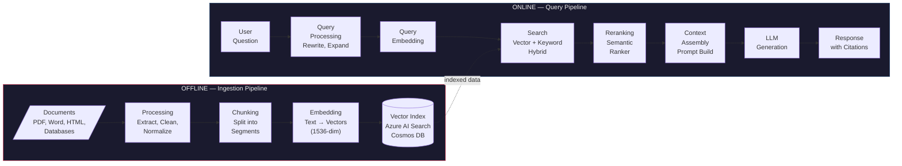
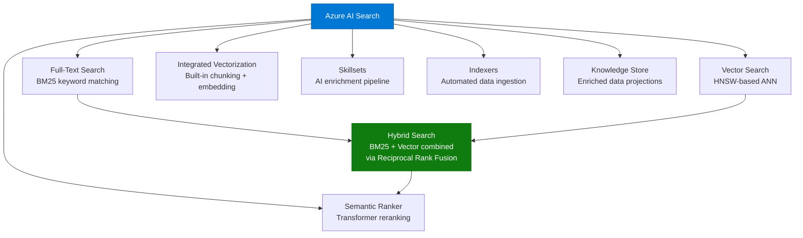
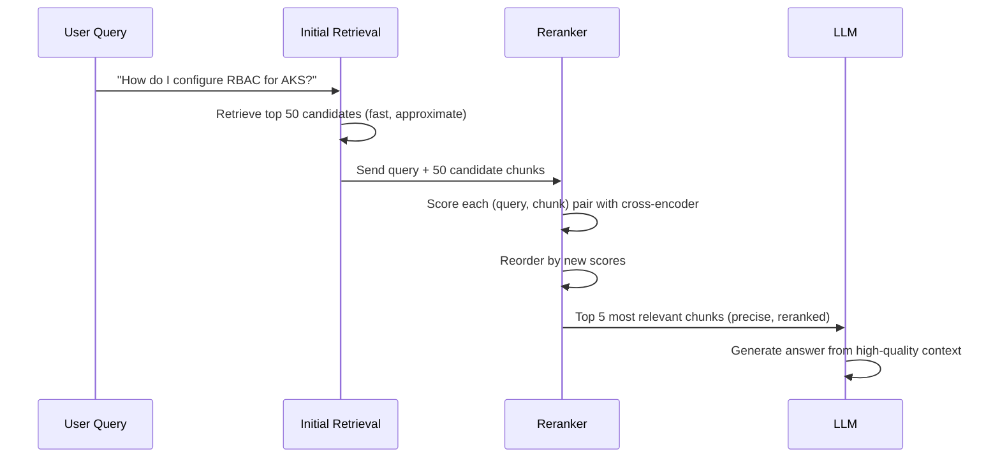
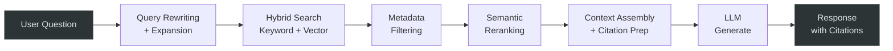
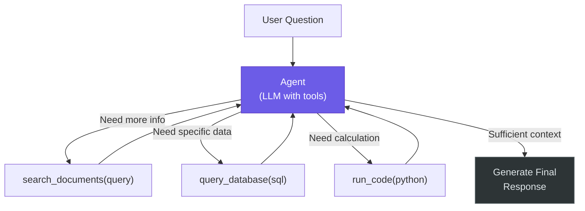
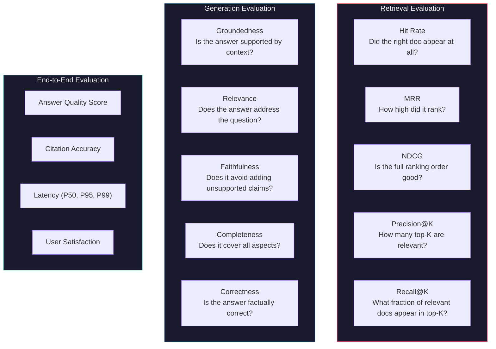
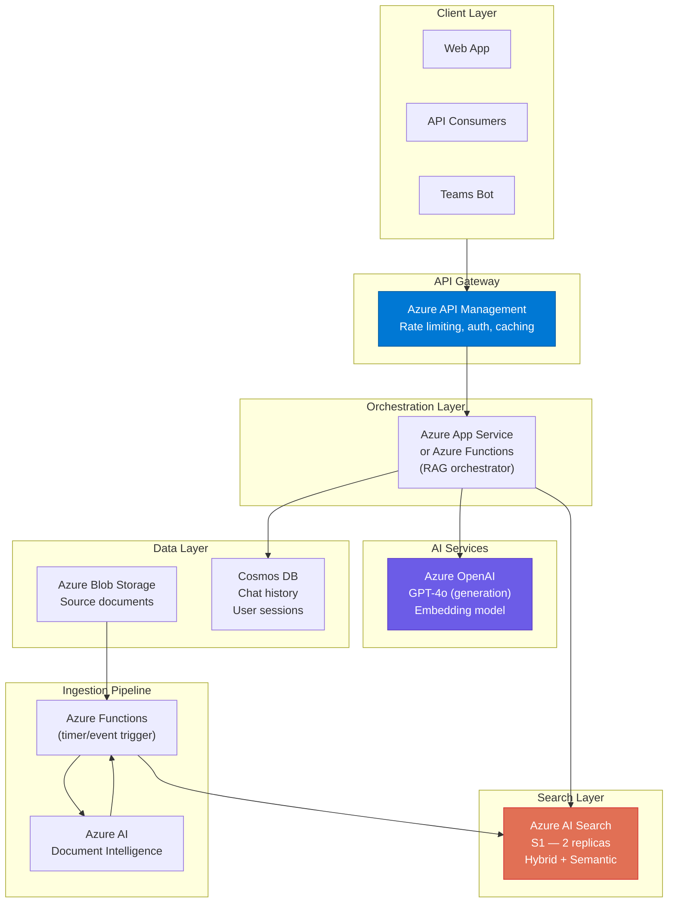

# Module 5: RAG Architecture — Retrieval-Augmented Generation Deep Dive

> **Duration:** 90-120 minutes | **Level:** Deep-Dive
> **Audience:** Cloud Architects, Platform Engineers, AI Engineers
> **Last Updated:** March 2026

---

## 5.1 Why RAG Exists

Large Language Models are powerful, but they have three fundamental limitations that make them unreliable for enterprise use without additional architecture.

### Limitation 1: Knowledge Cutoff

Every LLM is frozen in time. GPT-4o's training data has a cutoff. Claude's training data has a cutoff. If your organization published a new security policy last Tuesday, no LLM on Earth knows about it. The model will either refuse to answer or, worse, confidently fabricate something plausible.

### Limitation 2: Hallucination

When an LLM does not know the answer, it does not say "I don't know." It generates a plausible-sounding response that may be entirely fabricated. This is not a bug — it is a fundamental property of how autoregressive language models work. They predict the next most likely token, and "likely" does not mean "true."

### Limitation 3: No Access to Your Data

Even if an LLM had perfect knowledge of the entire public internet, it still would not know your internal HR policies, your proprietary product catalog, your customer contracts, your Confluence wiki, or your internal runbooks. Enterprise data is private by definition.

### The RAG Solution

**Retrieval-Augmented Generation (RAG)** solves all three problems with one architectural pattern: instead of relying on what the model already knows, you **retrieve relevant information from your own data sources** and inject it into the prompt at query time. The model then generates a response grounded in your actual data.

```
Without RAG:  User Question → LLM (uses training data only) → Response (may hallucinate)
With RAG:     User Question → Retrieve from YOUR data → LLM (uses retrieved context) → Grounded Response
```

RAG does not change the model. It does not retrain it. It simply gives the model a reference library to consult before answering.

### RAG vs Fine-Tuning vs Prompt Engineering — Decision Matrix

Before building a RAG pipeline, understand where it fits alongside other techniques.

| Dimension | Prompt Engineering | RAG | Fine-Tuning | Pre-Training |
|---|---|---|---|---|
| **What it does** | Better instructions to the model | Gives the model your data at query time | Adjusts model weights on your data | Trains a model from scratch |
| **Cost** | Free | $$ (search infra + embeddings) | $$$ (GPU compute + data prep) | $$$$$$ (massive compute) |
| **Time to implement** | Minutes | Hours to days | Days to weeks | Months |
| **Data freshness** | N/A | Real-time (index updates) | Stale (requires retraining) | Stale |
| **Data volume needed** | 0 examples | A document corpus | 100s-1000s of examples | Billions of tokens |
| **Handles private data** | No | Yes | Partially (baked into weights) | Partially |
| **Provides citations** | No | Yes (source documents) | No | No |
| **Risk of hallucination** | High | Low (when well-built) | Medium | Medium |
| **Best analogy** | Writing better exam questions | Giving the student a textbook during the exam | Sending the student to a specialized course | Building a student from scratch |

:::tip When to Use Each Technique
- **Prompt Engineering first** — always. It is free and high-leverage.
- **RAG** when you need factual grounding in private, dynamic, or recent data.
- **Fine-Tuning** when you need the model to adopt a specific tone, format, or domain vocabulary.
- **Combine them** — production systems typically use all three together.
:::

---

## 5.2 The RAG Pipeline End-to-End

Every RAG system has two distinct pipelines that operate independently.

### The Two Pipelines



### Ingestion Pipeline (Offline)

The ingestion pipeline runs periodically or on-demand to process your source documents and make them searchable. It does not involve any LLM calls.

| Step | What Happens | Azure Service | Latency |
|---|---|---|---|
| **1. Document Loading** | Read files from storage | Azure Blob Storage, SharePoint, SQL | Seconds |
| **2. Content Extraction** | Extract text, tables, images from documents | Azure AI Document Intelligence | Seconds/doc |
| **3. Cleaning** | Remove headers, footers, boilerplate, artifacts | Custom code or AI Document Intelligence | Milliseconds |
| **4. Chunking** | Split text into retrieval-sized segments | Custom code or Azure AI Search integrated vectorization | Milliseconds |
| **5. Enrichment** | Add metadata: title, date, category, source | Azure AI Search skillsets | Seconds |
| **6. Embedding** | Convert each chunk to a vector | Azure OpenAI text-embedding-3-large | ~100ms/chunk |
| **7. Indexing** | Store vectors + metadata in search index | Azure AI Search, Cosmos DB | Milliseconds |

### Query Pipeline (Online)

The query pipeline runs in real time for every user question. Latency matters here.

| Step | What Happens | Typical Latency |
|---|---|---|
| **1. Query Processing** | Rewrite, expand, decompose the user's question | 200-500ms (if using LLM) |
| **2. Query Embedding** | Convert question to a vector | 50-100ms |
| **3. Retrieval** | Search the index (vector + keyword + filters) | 50-200ms |
| **4. Reranking** | Reorder results by semantic relevance | 100-300ms |
| **5. Context Assembly** | Build the prompt with retrieved chunks | <10ms |
| **6. LLM Generation** | Generate the answer using the model | 500-3000ms |
| **Total** | End-to-end latency | **1-4 seconds** |

---

## 5.3 Document Ingestion and Processing

The quality of your RAG system is capped by the quality of your ingestion pipeline. If the extracted text is garbled, no amount of sophisticated retrieval will save it.

### Supported Document Types

| Format | Extraction Method | Complexity | Notes |
|---|---|---|---|
| **Markdown** | Direct parsing | Low | Best format for RAG — structure is explicit |
| **Plain Text** | Direct reading | Low | No structure to leverage |
| **HTML** | HTML parser + cleanup | Medium | Remove nav, scripts, ads |
| **PDF (digital)** | Text extraction | Medium | Preserves some structure |
| **PDF (scanned)** | OCR required | High | Quality depends on scan quality |
| **Word (.docx)** | XML parsing | Medium | Preserves headings, tables |
| **Excel (.xlsx)** | Cell-level extraction | Medium | Convert rows to text or keep tabular |
| **PowerPoint (.pptx)** | Slide-by-slide extraction | Medium | Speaker notes often contain key info |
| **CSV / TSV** | Row-level parsing | Low | Each row can be a chunk |
| **Database tables** | SQL queries | Medium | Denormalize joins into text |
| **Images** | Vision models / OCR | High | Diagrams, whiteboard photos |

### Azure AI Document Intelligence

Azure AI Document Intelligence (formerly Form Recognizer) is the recommended service for structured extraction from complex documents. It handles:

- **Layout analysis** — detects headings, paragraphs, tables, figures
- **Table extraction** — returns structured table data preserving rows and columns
- **Key-value pair extraction** — for forms and invoices
- **OCR** — for scanned documents and handwriting
- **Custom models** — train on your specific document layouts

```python
from azure.ai.documentintelligence import DocumentIntelligenceClient
from azure.core.credentials import AzureKeyCredential

client = DocumentIntelligenceClient(
    endpoint="https://my-doc-intel.cognitiveservices.azure.com/",
    credential=AzureKeyCredential(os.getenv("DOC_INTEL_KEY"))
)

# Analyze a PDF with layout model
with open("annual_report.pdf", "rb") as f:
    poller = client.begin_analyze_document(
        model_id="prebuilt-layout",
        body=f,
        content_type="application/pdf"
    )

result = poller.result()

# Extract text by page with structure
for page in result.pages:
    print(f"--- Page {page.page_number} ---")
    for line in page.lines:
        print(line.content)

# Extract tables separately (critical for RAG quality)
for table in result.tables:
    print(f"Table with {table.row_count} rows, {table.column_count} columns")
    for cell in table.cells:
        print(f"  Row {cell.row_index}, Col {cell.column_index}: {cell.content}")
```

### Metadata Extraction and Enrichment

Raw text is not enough. Metadata enables **filtered search**, which dramatically improves retrieval relevance. Always extract and store:

| Metadata Field | Source | Purpose |
|---|---|---|
| `title` | Document title or filename | Display in citations |
| `source_url` | Original location (SharePoint, Blob) | Link back to source |
| `created_date` | File metadata | Freshness filtering |
| `modified_date` | File metadata | Freshness filtering |
| `author` | File metadata | Attribution |
| `department` | Folder structure or tag | Scope filtering |
| `document_type` | File extension or classification | Type filtering |
| `language` | Language detection | Multi-language support |
| `chunk_index` | Assigned during chunking | Ordering adjacent chunks |
| `parent_document_id` | Assigned during ingestion | Linking chunks to source |

---

## 5.4 Chunking Strategies — Critical for Relevance

Chunking is the single most impactful design decision in your RAG pipeline. Bad chunking means bad retrieval, which means bad answers. There is no model smart enough to overcome poorly chunked data.

The fundamental tension: chunks must be **small enough** to be relevant to specific queries, but **large enough** to contain sufficient context to be useful.

### Strategy 1: Fixed-Size Chunking

Split text into chunks of a fixed number of characters or tokens, with optional overlap.

```python
def fixed_size_chunk(text: str, chunk_size: int = 512, overlap: int = 50):
    """Split text into fixed-size chunks with overlap."""
    tokens = tokenizer.encode(text)
    chunks = []
    start = 0
    while start < len(tokens):
        end = start + chunk_size
        chunk_tokens = tokens[start:end]
        chunks.append(tokenizer.decode(chunk_tokens))
        start += chunk_size - overlap  # overlap tokens carried forward
    return chunks
```

| Aspect | Detail |
|---|---|
| **How it works** | Split every N tokens regardless of content |
| **Overlap** | Typically 10-20% (e.g., 50-100 tokens for 512-token chunks) |
| **Pros** | Simple, predictable chunk sizes, easy to estimate storage |
| **Cons** | Breaks sentences, paragraphs, and semantic units mid-thought |
| **Best for** | Homogeneous text without strong structure (e.g., chat logs) |

### Strategy 2: Sentence-Based Chunking

Split text at sentence boundaries, grouping sentences until the chunk reaches a target size.

```python
import nltk

def sentence_chunk(text: str, max_tokens: int = 512):
    """Group sentences into chunks up to max_tokens."""
    sentences = nltk.sent_tokenize(text)
    chunks, current_chunk = [], []
    current_size = 0

    for sentence in sentences:
        sentence_tokens = len(tokenizer.encode(sentence))
        if current_size + sentence_tokens > max_tokens and current_chunk:
            chunks.append(" ".join(current_chunk))
            current_chunk, current_size = [], 0
        current_chunk.append(sentence)
        current_size += sentence_tokens

    if current_chunk:
        chunks.append(" ".join(current_chunk))
    return chunks
```

| Aspect | Detail |
|---|---|
| **How it works** | Accumulate sentences until target size is reached |
| **Pros** | Never breaks a sentence in half, preserves basic meaning |
| **Cons** | Variable chunk sizes, may still split related paragraphs |
| **Best for** | Narrative text, articles, documentation |

### Strategy 3: Paragraph-Based Chunking

Split at paragraph boundaries (double newlines). Each paragraph becomes a chunk, or paragraphs are grouped to reach a target size.

| Aspect | Detail |
|---|---|
| **How it works** | Use paragraph breaks as natural split points |
| **Pros** | Preserves author's intended logical groupings |
| **Cons** | Paragraphs vary wildly in size (some are 1 sentence, some are 500 words) |
| **Best for** | Well-structured documents with consistent paragraph sizes |

### Strategy 4: Semantic Chunking

Use embedding similarity to detect where the topic shifts, then split at topic boundaries.

```python
from sklearn.metrics.pairwise import cosine_similarity
import numpy as np

def semantic_chunk(sentences: list, embeddings: np.ndarray, threshold: float = 0.75):
    """Split at points where semantic similarity drops below threshold."""
    chunks, current_chunk = [], [sentences[0]]

    for i in range(1, len(sentences)):
        similarity = cosine_similarity(
            embeddings[i-1].reshape(1, -1),
            embeddings[i].reshape(1, -1)
        )[0][0]

        if similarity < threshold:
            # Topic shift detected — start a new chunk
            chunks.append(" ".join(current_chunk))
            current_chunk = [sentences[i]]
        else:
            current_chunk.append(sentences[i])

    if current_chunk:
        chunks.append(" ".join(current_chunk))
    return chunks
```

| Aspect | Detail |
|---|---|
| **How it works** | Embed each sentence, detect topic boundaries via similarity drops |
| **Pros** | Produces the most semantically coherent chunks |
| **Cons** | Expensive (every sentence must be embedded), variable sizes, harder to debug |
| **Best for** | High-value corpora where retrieval quality justifies the cost |

### Strategy 5: Recursive / Hierarchical Chunking

Split using a hierarchy of separators: first by headers, then by paragraphs, then by sentences, then by characters. Only descend to the next level if the chunk exceeds the target size.

```python
# LangChain's RecursiveCharacterTextSplitter uses this approach
from langchain.text_splitter import RecursiveCharacterTextSplitter

splitter = RecursiveCharacterTextSplitter(
    chunk_size=1000,
    chunk_overlap=200,
    separators=[
        "\n## ",      # H2 headings first
        "\n### ",     # H3 headings
        "\n\n",       # Paragraphs
        "\n",         # Lines
        ". ",         # Sentences
        " ",          # Words (last resort)
    ]
)

chunks = splitter.split_text(document_text)
```

| Aspect | Detail |
|---|---|
| **How it works** | Try the most structural separator first, fall back to smaller units |
| **Pros** | Respects document hierarchy, good balance of structure and size control |
| **Cons** | Requires well-formatted source documents |
| **Best for** | Markdown, HTML, structured documentation (this is the default recommendation) |

### Strategy 6: Document-Aware Chunking

Specialized chunking that understands the document format.

| Sub-Strategy | How It Works | Best For |
|---|---|---|
| **Markdown-aware** | Split at `#`, `##`, `###` headers keeping each section intact | Technical docs, wikis |
| **HTML-aware** | Split at `<section>`, `<article>`, `<h1>`-`<h6>` tags | Web content |
| **Table-aware** | Keep entire tables as single chunks (never split a table row) | Financial reports, data sheets |
| **Code-aware** | Keep entire functions/classes as single chunks | Code repositories |
| **Slide-aware** | Keep each slide as a chunk with speaker notes | Presentations |

### Chunking Strategy Comparison

| Strategy | Chunk Size Control | Semantic Quality | Implementation Cost | Compute Cost | Best For |
|---|---|---|---|---|---|
| **Fixed-Size** | Exact | Low | Very Low | Very Low | Uniform text, quick prototypes |
| **Sentence-Based** | Approximate | Medium | Low | Low | Articles, narratives |
| **Paragraph-Based** | Variable | Medium-High | Low | Low | Well-structured docs |
| **Semantic** | Variable | Highest | High | High (embedding calls) | High-value corpora |
| **Recursive** | Approximate | High | Medium | Low | Markdown, HTML, general docs |
| **Document-Aware** | Variable | High | Medium-High | Low | Format-specific content |

:::warning The Most Common Chunking Mistake
Using fixed-size chunking with no overlap on structured documents. A 512-token boundary that falls in the middle of a table or code block produces two useless chunks. **Always use document-aware or recursive chunking for structured content.**
:::

---

## 5.5 Chunk Size — The Goldilocks Problem

Chunk size is the second most impactful parameter after chunking strategy. The optimal size depends on your content type, embedding model, and retrieval patterns.

### The Tradeoff

```
Too Small (< 128 tokens)          Just Right (256-1024 tokens)         Too Large (> 2048 tokens)
├── Loses context                  ├── Contains enough context           ├── Dilutes relevance
├── Many chunks needed             ├── Manageable number of chunks       ├── Wastes LLM tokens
├── Retrieval returns fragments    ├── Each chunk is self-contained      ├── Hard to rank accurately
├── High embedding costs           ├── Balanced costs                    ├── Vector similarity degrades
└── Precise but incomplete         └── The sweet spot                    └── Complete but noisy
```

### Recommended Chunk Sizes by Content Type

| Content Type | Recommended Size (tokens) | Overlap | Rationale |
|---|---|---|---|
| **Technical documentation** | 512-1024 | 10-15% | Sections are self-contained, need full context |
| **FAQ / Q&A pairs** | 128-256 | 0% | Each Q&A is a natural chunk |
| **Legal contracts** | 512-768 | 20% | Clauses reference each other, need higher overlap |
| **Knowledge base articles** | 512-1024 | 10% | Articles have clear topic boundaries |
| **Chat transcripts** | 256-512 | 15% | Conversations shift topics frequently |
| **Source code** | Function-level | 0% | Each function is a natural unit |
| **Research papers** | 768-1024 | 15% | Dense content needs larger context windows |
| **Product catalogs** | 256-512 | 0% | Each product is independent |
| **Email threads** | Per-email | 0% | Each email is a natural unit |
| **Financial reports** | 512-768 (tables intact) | 10% | Keep tables as single chunks |

### How to Choose: Empirical Testing

There is no universally correct chunk size. The right approach is to test multiple sizes against your actual queries and measure retrieval quality.

```python
# Test multiple chunk sizes and measure Hit Rate @ K
chunk_sizes = [256, 512, 768, 1024]
test_queries = load_evaluation_queries()  # queries with known relevant docs

for size in chunk_sizes:
    chunks = recursive_chunk(corpus, chunk_size=size, overlap=int(size * 0.1))
    index = build_index(chunks)

    hit_rate = 0
    for query, expected_doc_id in test_queries:
        results = index.search(query, top_k=5)
        if expected_doc_id in [r.doc_id for r in results]:
            hit_rate += 1

    print(f"Chunk Size: {size} | Hit Rate@5: {hit_rate / len(test_queries):.2%}")
```

---

## 5.6 Embeddings — Turning Text into Vectors

Embeddings are the mathematical bridge between human language and machine-searchable vectors. Every chunk of text in your index and every user query is converted into a dense vector of floating-point numbers before retrieval can happen.

### What Are Embeddings?

An embedding is a list of numbers (a vector) that represents the semantic meaning of a piece of text. Texts with similar meanings produce vectors that are close together in high-dimensional space.

```
"How do I reset my password?"  →  [0.023, -0.041, 0.118, ..., 0.067]  (1536 dimensions)
"I forgot my login credentials" → [0.025, -0.039, 0.121, ..., 0.064]  (very similar vector)
"Azure VM pricing in East US"  →  [0.891, 0.234, -0.567, ..., 0.445]  (very different vector)
```

### Azure OpenAI Embedding Models

| Model | Dimensions | Max Input Tokens | Performance | Cost (per 1M tokens) | Recommendation |
|---|---|---|---|---|---|
| `text-embedding-3-large` | 3072 (or 256-3072) | 8,191 | Highest quality | ~$0.13 | Production workloads requiring best accuracy |
| `text-embedding-3-small` | 1536 (or 256-1536) | 8,191 | Very good | ~$0.02 | Cost-effective production use |
| `text-embedding-ada-002` | 1536 (fixed) | 8,191 | Good (legacy) | ~$0.10 | Legacy — migrate to v3 models |

### Dimension Selection

The `text-embedding-3-*` models support **Matryoshka embeddings** — you can truncate the vector to fewer dimensions and still retain meaningful similarity. This is a powerful cost/quality tradeoff.

| Dimensions | Storage per Vector | Quality | Use Case |
|---|---|---|---|
| **256** | 1 KB | Good enough for coarse similarity | Prototyping, low-cost deployments |
| **512** | 2 KB | Strong for most use cases | Balanced production deployments |
| **1536** | 6 KB | Very high | Standard production deployments |
| **3072** | 12 KB | Highest | Precision-critical applications |

### Distance Metrics

When comparing vectors, the search engine uses a distance metric to calculate similarity.

| Metric | Formula | Range | Best For |
|---|---|---|---|
| **Cosine Similarity** | cos(A, B) = (A . B) / (\|A\| \|B\|) | -1 to 1 (1 = identical) | Most text search (normalized vectors) |
| **Dot Product** | A . B | -inf to +inf | When vectors are already normalized |
| **Euclidean (L2)** | sqrt(sum((A-B)^2)) | 0 to +inf (0 = identical) | When magnitude matters |

For Azure AI Search and most text retrieval scenarios, **cosine similarity** is the standard choice.

### Generating Embeddings with Azure OpenAI

```python
from openai import AzureOpenAI

client = AzureOpenAI(
    azure_endpoint="https://my-aoai.openai.azure.com/",
    api_key=os.getenv("AZURE_OPENAI_KEY"),
    api_version="2025-12-01-preview"
)

def get_embedding(text: str, model: str = "text-embedding-3-large", dimensions: int = 1536):
    """Generate an embedding vector for a text string."""
    response = client.embeddings.create(
        input=text,
        model=model,
        dimensions=dimensions  # Matryoshka: choose your dimension
    )
    return response.data[0].embedding  # list of floats

# Embed a document chunk
chunk = "Azure Private Link enables you to access Azure PaaS services..."
vector = get_embedding(chunk)
print(f"Vector dimensions: {len(vector)}")  # 1536

# Embed a user query (same model, same dimensions!)
query_vector = get_embedding("How does Private Link work?")
```

:::warning Critical Rule
You **must** use the same embedding model and the same dimensions for both your document chunks and your user queries. Mixing models (e.g., indexing with `ada-002` but querying with `text-embedding-3-large`) produces meaningless similarity scores because the vector spaces are incompatible.
:::

---

## 5.7 Vector Databases and Indexes

Once you have vectors, you need a place to store them and search them efficiently. This is the role of the vector database or vector-capable search engine.

### What Is a Vector Database?

A vector database stores high-dimensional vectors alongside their metadata and provides fast approximate nearest neighbor (ANN) search. Given a query vector, it returns the K most similar vectors (and their associated text chunks) in milliseconds.

### Azure-Native Options

| Service | Type | Vector Dims | Hybrid Search | Semantic Ranker | Integrated Embedding | Pricing Model |
|---|---|---|---|---|---|---|
| **Azure AI Search** | Search-as-a-service | Up to 3072 | Yes (keyword + vector) | Yes (transformer-based) | Yes (built-in vectorization) | Per search unit (SU) |
| **Azure Cosmos DB (NoSQL)** | Multi-model database | Up to 4096 | Yes (with full-text index) | No | No | Per RU + storage |
| **Azure Cosmos DB (PostgreSQL / vCore)** | PostgreSQL with pgvector | Up to 2000 | Yes | No | No | Per vCore + storage |
| **Azure SQL Database** | Relational database | Via extensions | Partial | No | No | Per DTU/vCore |

### Dedicated Vector Databases

| Database | Managed Service | Max Dims | Unique Strength | Azure Integration |
|---|---|---|---|---|
| **Pinecone** | Fully managed | 20,000 | Purpose-built, serverless option | Via API |
| **Weaviate** | Cloud or self-hosted | Unlimited | Multi-modal (text, images), GraphQL API | AKS or VM |
| **Qdrant** | Cloud or self-hosted | 65,536 | Sparse + dense vectors, filtering | AKS or VM |
| **Milvus** | Cloud (Zilliz) or self-hosted | 32,768 | GPU-accelerated search, massive scale | AKS or VM |
| **ChromaDB** | Embedded or self-hosted | Unlimited | Simple API, great for prototyping | Embedded in app |
| **pgvector (PostgreSQL)** | Azure Database for PostgreSQL | 2,000 | Familiar SQL interface, no new infra | Azure PostgreSQL |

### Index Types

The index algorithm determines how vectors are organized for fast search.

| Index Type | How It Works | Search Speed | Accuracy | Memory | Best For |
|---|---|---|---|---|---|
| **Flat (brute force)** | Compare query against every vector | Slowest | 100% exact | Low | Small datasets (< 50K vectors) |
| **IVF (Inverted File)** | Cluster vectors, search only nearby clusters | Fast | ~95-99% | Medium | Medium datasets |
| **HNSW (Hierarchical Navigable Small World)** | Multi-layer graph of connections | Fastest | ~95-99% | High (in-memory) | Production workloads (Azure AI Search default) |

Azure AI Search uses **HNSW** by default, which provides the best balance of speed and accuracy for production workloads. You can configure the HNSW parameters:

```json
{
  "name": "my-vector-index",
  "fields": [
    {
      "name": "content_vector",
      "type": "Collection(Edm.Single)",
      "dimensions": 1536,
      "vectorSearchProfile": "my-profile"
    }
  ],
  "vectorSearch": {
    "algorithms": [
      {
        "name": "my-hnsw",
        "kind": "hnsw",
        "hnswParameters": {
          "m": 4,
          "efConstruction": 400,
          "efSearch": 500,
          "metric": "cosine"
        }
      }
    ],
    "profiles": [
      {
        "name": "my-profile",
        "algorithmConfigurationName": "my-hnsw"
      }
    ]
  }
}
```

---

## 5.8 Azure AI Search — The Swiss Army Knife

Azure AI Search is the recommended vector store for most Azure RAG architectures. It is not just a vector database — it is a full-featured search platform that combines keyword search, vector search, semantic ranking, and data enrichment in a single managed service.

### Core Capabilities



### Integrated Vectorization (Built-In Chunking and Embedding)

Azure AI Search can handle the entire ingestion pipeline without custom code. You define a **data source**, a **skillset**, and an **indexer** — the service handles the rest.

```
Blob Storage → Indexer → [Document Cracking → Chunking → Embedding → Enrichment] → Index
                             ↑ built into Azure AI Search — no custom code needed ↑
```

Configuration for integrated vectorization:

```json
{
  "name": "my-skillset",
  "skills": [
    {
      "@odata.type": "#Microsoft.Skills.Text.SplitSkill",
      "name": "chunk-text",
      "description": "Split documents into chunks",
      "textSplitMode": "pages",
      "maximumPageLength": 2000,
      "pageOverlapLength": 500,
      "context": "/document"
    },
    {
      "@odata.type": "#Microsoft.Skills.Text.AzureOpenAIEmbeddingSkill",
      "name": "generate-embeddings",
      "description": "Generate embeddings for each chunk",
      "resourceUri": "https://my-aoai.openai.azure.com/",
      "deploymentId": "text-embedding-3-large",
      "modelName": "text-embedding-3-large",
      "context": "/document/pages/*"
    }
  ]
}
```

### Hybrid Search — Why It Matters

Neither keyword search nor vector search alone is sufficient. Each has blind spots.

| Scenario | Keyword Search | Vector Search | Hybrid |
|---|---|---|---|
| User searches exact error code: `ERR_CERT_AUTHORITY_INVALID` | Finds it exactly | May miss (error codes do not embed well) | Finds it |
| User asks "how to make my app faster" | Misses docs about "performance optimization" | Finds semantic match | Finds it |
| User searches "Azure PCI DSS compliance" | Finds exact term matches | Finds related compliance docs too | Finds all |
| User searches with a typo: "Kuberntes scaling" | Misses (no fuzzy match) | Finds it (embedding is robust to typos) | Finds it |

Hybrid search in Azure AI Search combines BM25 (keyword) and vector scores using **Reciprocal Rank Fusion (RRF)**:

```
RRF_score(doc) = sum( 1 / (k + rank_in_list) ) for each result list containing the doc
```

Where `k` is a constant (default 60). This elegantly merges ranked lists without needing to normalize scores across different algorithms.

### Semantic Ranker

After hybrid retrieval returns the top candidates, the **Semantic Ranker** applies a transformer-based cross-encoder model to reorder results by deep semantic relevance.

```
Step 1: Hybrid search returns top 50 candidates
Step 2: Semantic Ranker reranks all 50 using a cross-encoder
Step 3: Return top 5 to the LLM as context
```

The Semantic Ranker also provides:
- **Semantic captions** — the most relevant sentence or passage within each result
- **Semantic answers** — a direct extractive answer if one exists in the content

### Pricing Tiers

| Tier | Replicas | Partitions | Vector Index Size | Semantic Ranker | Price (approx/month) |
|---|---|---|---|---|---|
| **Free** | 1 | 1 | 8 MB | No | $0 |
| **Basic** | 3 | 1 | 2 GB | No | ~$75 |
| **Standard S1** | 12 | 12 | 25 GB per partition | Yes | ~$250/SU |
| **Standard S2** | 12 | 12 | 100 GB per partition | Yes | ~$1,000/SU |
| **Standard S3** | 12 | 12 | 200 GB per partition | Yes | ~$2,000/SU |
| **S3 HD** | 12 | 3 | 200 GB per partition | Yes | ~$2,000/SU |

:::tip Architect's Guidance
For most production RAG workloads serving up to a few million documents, **Standard S1 with 2 replicas** provides sufficient capacity with high availability. Start there, monitor query latency, and scale up only when needed.
:::

---

## 5.9 Retrieval Strategies

Retrieval is the step that determines whether the right information reaches the LLM. A brilliant model given the wrong context will produce a confidently wrong answer.

### Strategy 1: Keyword Search (BM25 / TF-IDF)

The classical information retrieval approach. Matches exact terms in the query against exact terms in the documents, weighted by term frequency and inverse document frequency.

```python
# Azure AI Search — keyword search
results = search_client.search(
    search_text="Azure Private Link DNS configuration",
    query_type="simple",
    top=10
)
```

| Strength | Weakness |
|---|---|
| Excellent for exact terms, product names, error codes | Misses synonyms ("VM" vs "virtual machine") |
| Fast and well-understood | Misses semantic similarity ("improve speed" vs "performance optimization") |
| No embedding required | Sensitive to typos and vocabulary mismatch |
| Works with any language out of the box | Cannot understand intent or meaning |

### Strategy 2: Vector Search

Converts both the query and documents into embedding vectors and finds the nearest neighbors in vector space.

```python
from azure.search.documents.models import VectorizableTextQuery

# Azure AI Search — vector search
results = search_client.search(
    search_text=None,
    vector_queries=[
        VectorizableTextQuery(
            text="How do I configure DNS for private endpoints?",
            k_nearest_neighbors=10,
            fields="content_vector"
        )
    ]
)
```

| Strength | Weakness |
|---|---|
| Understands semantic meaning and intent | Can miss exact keyword matches |
| Robust to synonyms, paraphrases, typos | Embedding quality depends on model |
| Works across languages (with multilingual models) | Does not work well for codes, IDs, proper nouns |
| Captures conceptual similarity | Computationally more expensive than BM25 |

### Strategy 3: Hybrid Search (Keyword + Vector)

Combines both approaches using Reciprocal Rank Fusion. This is the **recommended default** for production RAG systems.

```python
from azure.search.documents.models import VectorizableTextQuery

# Azure AI Search — hybrid search (keyword + vector)
results = search_client.search(
    search_text="Azure Private Link DNS configuration",    # keyword component
    vector_queries=[
        VectorizableTextQuery(
            text="Azure Private Link DNS configuration",   # vector component
            k_nearest_neighbors=10,
            fields="content_vector"
        )
    ],
    query_type="semantic",               # enable semantic ranker on top
    semantic_configuration_name="my-semantic-config",
    top=5
)
```

### Strategy 4: Semantic Ranking (Cross-Encoder Reranking)

After initial retrieval (keyword, vector, or hybrid), a cross-encoder model evaluates each query-document pair jointly to produce a more accurate relevance score.

| Strength | Weakness |
|---|---|
| Highest accuracy of any single retrieval method | Cannot be used alone (needs initial retrieval first) |
| Understands nuanced query-document relationships | Adds 100-300ms latency |
| Dramatically improves top-K precision | Additional cost (requires Standard tier or above) |

### Retrieval Strategy Comparison

| Strategy | Semantic Understanding | Exact Match | Speed | Accuracy | Cost | Production Readiness |
|---|---|---|---|---|---|---|
| **Keyword (BM25)** | None | Excellent | Very fast | Medium | Low | High |
| **Vector** | Strong | Poor | Fast | High | Medium | High |
| **Hybrid** | Strong | Excellent | Fast | Very High | Medium | Very High |
| **Hybrid + Semantic Ranker** | Excellent | Excellent | Moderate (+300ms) | Highest | Medium-High | Highest |

:::tip The Default Recipe
For production RAG on Azure, use **Hybrid Search (keyword + vector) with Semantic Ranker**. This gives you the best of all worlds. There is rarely a reason to use keyword-only or vector-only search in production.
:::

---

## 5.10 Reranking — The Relevance Multiplier

Reranking is a post-retrieval step that dramatically improves the quality of the context sent to the LLM. Initial retrieval (whether keyword or vector) is fast but approximate. Reranking is slower but far more accurate.

### How Reranking Works



### Why Reranking Matters

Initial retrieval uses **bi-encoders** — the query and documents are encoded independently and then compared. This is fast but loses nuance because the query and document never "see" each other during encoding.

Reranking uses **cross-encoders** — the query and document are concatenated and processed together through a transformer. This produces far more accurate relevance scores because the model can attend to the specific relationship between the query and each document.

| Approach | How It Works | Speed | Accuracy |
|---|---|---|---|
| **Bi-encoder (retrieval)** | Encode query and doc separately, compare vectors | Fast (can search millions in ms) | Good but approximate |
| **Cross-encoder (reranking)** | Encode query+doc together, single relevance score | Slow (50-100ms per pair) | Excellent, nuanced |

### Reranking Options

| Reranker | Type | Integration | Notes |
|---|---|---|---|
| **Azure AI Search Semantic Ranker** | Managed cross-encoder | Built into Azure AI Search | Easiest option for Azure-native solutions |
| **Cohere Rerank** | API-based | REST API call | High quality, multilingual support |
| **Jina Reranker** | API or self-hosted | REST API or container | Good price/performance ratio |
| **BGE Reranker** | Open-source model | Self-hosted on AKS | Full control, no API costs |
| **Custom cross-encoder** | Fine-tuned model | Self-hosted | Highest accuracy for your domain, highest effort |

### Impact of Reranking

Studies and production deployments consistently show:

| Metric | Without Reranking | With Reranking | Improvement |
|---|---|---|---|
| **Answer Correctness** | ~65-75% | ~80-90% | +10-25% |
| **Precision@5** | ~60-70% | ~75-85% | +10-20% |
| **User Satisfaction** | Moderate | High | Significant |
| **Hallucination Rate** | ~15-25% | ~5-10% | -10-15% |

:::tip Architect's Rule of Thumb
**Always use reranking.** The 100-300ms of additional latency is almost always worth the 10-25% improvement in answer quality. The only exception is extreme latency-sensitive applications where every millisecond counts.
:::

---

## 5.11 Query Processing and Enhancement

The user's raw question is often a poor search query. Users write incomplete sentences, use ambiguous terms, and ask multi-part questions. Query processing transforms the user's input into one or more optimized search queries.

### Technique 1: Query Rewriting

Use an LLM to rephrase the user's question into a better search query.

```python
def rewrite_query(user_question: str) -> str:
    """Use an LLM to rewrite the user's question for better retrieval."""
    response = client.chat.completions.create(
        model="gpt-4o",
        messages=[
            {
                "role": "system",
                "content": "Rewrite the following user question as a clear, specific "
                           "search query optimized for document retrieval. Output only "
                           "the rewritten query, nothing else."
            },
            {"role": "user", "content": user_question}
        ],
        temperature=0.0,
        max_tokens=200
    )
    return response.choices[0].message.content
```

**Example:**
- User: "why is my app slow?" --> Rewritten: "application performance troubleshooting latency optimization"
- User: "that thing from last meeting about the database" --> Rewritten: "database discussion recent meeting notes decisions"

### Technique 2: Query Expansion

Add synonyms, related terms, or acronym expansions to the query to increase recall.

```python
def expand_query(user_question: str) -> str:
    """Expand the query with synonyms and related terms."""
    response = client.chat.completions.create(
        model="gpt-4o",
        messages=[
            {
                "role": "system",
                "content": "Given this search query, add synonyms and related terms "
                           "to broaden the search. Include the original query. "
                           "Output a single expanded search string."
            },
            {"role": "user", "content": user_question}
        ],
        temperature=0.0,
        max_tokens=300
    )
    return response.choices[0].message.content
```

### Technique 3: Hypothetical Document Embedding (HyDE)

Instead of embedding the question directly, ask the LLM to generate a hypothetical answer, then embed that hypothetical answer and use it as the search query. The intuition: a hypothetical answer is more similar to real answers in your index than the question is.

```python
def hyde_search(user_question: str):
    """HyDE: Generate a hypothetical answer and search with its embedding."""
    # Step 1: Generate a hypothetical answer
    response = client.chat.completions.create(
        model="gpt-4o",
        messages=[
            {
                "role": "system",
                "content": "Write a short, factual paragraph that answers the "
                           "following question. Even if you are not sure, write a "
                           "plausible answer. Do not say 'I don't know.'"
            },
            {"role": "user", "content": user_question}
        ],
        temperature=0.3,
        max_tokens=300
    )
    hypothetical_answer = response.choices[0].message.content

    # Step 2: Embed the hypothetical answer (not the question)
    hyde_vector = get_embedding(hypothetical_answer)

    # Step 3: Search with the hypothetical answer's embedding
    results = search_client.search(
        vector_queries=[
            VectorizedQuery(vector=hyde_vector, k_nearest_neighbors=10, fields="content_vector")
        ]
    )
    return results
```

### Technique 4: Multi-Query Retrieval

Generate multiple variations of the query and search with all of them, then merge the results.

```python
def multi_query_search(user_question: str, num_queries: int = 3):
    """Generate multiple search queries and merge results."""
    response = client.chat.completions.create(
        model="gpt-4o",
        messages=[
            {
                "role": "system",
                "content": f"Generate {num_queries} different search queries that "
                           "would help answer the following question. Each query "
                           "should approach the topic from a different angle. "
                           "Output one query per line."
            },
            {"role": "user", "content": user_question}
        ],
        temperature=0.7,
        max_tokens=500
    )

    queries = response.choices[0].message.content.strip().split("\n")
    all_results = {}

    for query in queries:
        results = search_client.search(search_text=query, top=5)
        for result in results:
            doc_id = result["id"]
            if doc_id not in all_results or result["@search.score"] > all_results[doc_id]["@search.score"]:
                all_results[doc_id] = result

    return sorted(all_results.values(), key=lambda x: x["@search.score"], reverse=True)[:10]
```

### Technique 5: Query Decomposition

Break complex multi-part questions into simpler sub-queries, retrieve for each, and then synthesize.

**Example:**
- Complex: "Compare the networking and pricing differences between AKS and Azure Container Apps"
- Decomposed into:
  1. "AKS networking features and capabilities"
  2. "Azure Container Apps networking features and capabilities"
  3. "AKS pricing model and costs"
  4. "Azure Container Apps pricing model and costs"

### Query Enhancement Comparison

| Technique | Latency Added | Recall Improvement | When to Use |
|---|---|---|---|
| **Query Rewriting** | 200-500ms | 10-20% | Always (low cost, high impact) |
| **Query Expansion** | 200-500ms | 5-15% | When vocabulary mismatch is a problem |
| **HyDE** | 500-1000ms | 15-30% | When questions and documents differ in style |
| **Multi-Query** | 500-1500ms | 20-40% | Broad or exploratory questions |
| **Decomposition** | 500-1500ms | 15-30% | Complex multi-part questions |

---

## 5.12 Context Assembly and Prompt Construction

After retrieval and reranking, you have a ranked list of relevant chunks. The next step is assembling them into a prompt that the LLM can use to generate a grounded response.

### The Prompt Structure

```
┌─────────────────────────────────────────────────────┐
│ SYSTEM MESSAGE                                      │
│ - Role definition                                   │
│ - Instructions for using context                    │
│ - Output format requirements                        │
│ - Citation format                                   │
│ - Guardrails (what NOT to do)                       │
├─────────────────────────────────────────────────────┤
│ RETRIEVED CONTEXT                                   │
│ [Source 1: document_title.pdf, page 12]             │
│ <chunk text>                                        │
│                                                     │
│ [Source 2: kb_article_456.md]                       │
│ <chunk text>                                        │
│                                                     │
│ [Source 3: meeting_notes_2025-03.docx]              │
│ <chunk text>                                        │
├─────────────────────────────────────────────────────┤
│ USER QUESTION                                       │
│ "How do I configure RBAC for our AKS clusters?"     │
└─────────────────────────────────────────────────────┘
```

### Example System Prompt for RAG

```python
system_prompt = """You are an internal knowledge assistant for Contoso Corporation.
Your job is to answer employee questions using ONLY the provided context documents.

## Rules
1. ONLY use information from the provided context to answer.
2. If the context does not contain enough information to answer, say:
   "I don't have enough information in my knowledge base to answer this question."
3. NEVER make up information that is not in the context.
4. Always cite your sources using [Source N] notation.
5. If multiple sources provide conflicting information, mention the conflict.

## Output Format
- Start with a direct answer (1-2 sentences).
- Then provide supporting details with citations.
- End with the list of sources cited.

## Citation Format
Use [Source N] inline, then list sources at the end:

Sources:
[Source 1] document_name.pdf — page 12
[Source 2] kb_article.md — section "Configuration"
"""
```

### Building the Context Block

```python
def build_context(search_results, max_tokens: int = 4000) -> str:
    """Assemble retrieved chunks into a context block with source attribution."""
    context_parts = []
    total_tokens = 0

    for i, result in enumerate(search_results, 1):
        chunk_text = result["content"]
        chunk_tokens = count_tokens(chunk_text)

        # Stop if adding this chunk would exceed the token budget
        if total_tokens + chunk_tokens > max_tokens:
            break

        source_label = f"[Source {i}: {result['title']}]"
        context_parts.append(f"{source_label}\n{chunk_text}\n")
        total_tokens += chunk_tokens

    return "\n---\n".join(context_parts)
```

### Context Window Management

The total prompt (system + context + question + expected response) must fit within the model's context window. Budget your tokens carefully.

| Component | Token Budget | Notes |
|---|---|---|
| **System prompt** | 200-500 | Keep it concise but complete |
| **Retrieved context** | 3,000-6,000 | The bulk of your budget |
| **User question** | 50-500 | Usually short |
| **Expected response** | 500-2,000 | Set via `max_tokens` |
| **Buffer** | 500 | Safety margin |
| **Total** | ~8,000-12,000 | Well within GPT-4o's 128K window |

### Relevance Threshold

Do not include every retrieved result. Set a minimum relevance score and discard chunks below it.

```python
RELEVANCE_THRESHOLD = 0.70  # adjust based on empirical testing

def filter_by_relevance(results, threshold=RELEVANCE_THRESHOLD):
    """Only include results above the relevance threshold."""
    return [r for r in results if r["@search.reranker_score"] >= threshold]
```

A low-relevance chunk inserted into the context is worse than no chunk at all — it introduces noise that can lead the LLM to generate incorrect or confused responses.

---

## 5.13 Advanced RAG Patterns

Not all RAG systems are the same. The field has evolved from simple retrieve-and-generate to sophisticated multi-stage architectures.

### Pattern 1: Naive RAG

The simplest implementation. Embed the query, retrieve top-K chunks, concatenate them into the prompt, generate.


| Aspect | Detail |
|---|---|
| **When to use** | Prototyping, simple Q&A over small document sets |
| **Strengths** | Simple, fast to implement, easy to debug |
| **Weaknesses** | No query enhancement, no reranking, poor on complex queries |
| **Typical accuracy** | 50-65% answer correctness |

### Pattern 2: Advanced RAG

Adds query processing, hybrid search, reranking, and metadata filtering to the pipeline.



| Aspect | Detail |
|---|---|
| **When to use** | Production enterprise systems |
| **Strengths** | High accuracy, citations, handles diverse query types |
| **Weaknesses** | More complex, higher latency (2-4 seconds) |
| **Typical accuracy** | 75-90% answer correctness |

### Pattern 3: Modular RAG

A plug-and-play architecture where each component (retriever, reranker, generator, query processor) is an independent module that can be swapped or upgraded independently.

| Aspect | Detail |
|---|---|
| **When to use** | Teams that need to experiment with different components |
| **Strengths** | Flexible, testable, each module can be independently evaluated and improved |
| **Weaknesses** | Requires interface contracts between modules, more engineering overhead |

### Pattern 4: Agentic RAG

An AI agent decides **when** to retrieve, **what** to retrieve, and **whether** the retrieved results are sufficient. The agent can iterate — perform multiple searches, refine queries, and decide when it has enough context to answer.



| Aspect | Detail |
|---|---|
| **When to use** | Complex questions requiring multi-step reasoning, multi-source queries |
| **Strengths** | Can handle open-ended questions, decides its own retrieval strategy |
| **Weaknesses** | Non-deterministic, harder to evaluate, higher latency (5-15 seconds) |
| **Typical accuracy** | 80-95% on complex queries (but variable) |

### Pattern 5: Graph RAG

Combines a knowledge graph with vector retrieval. Documents are processed to extract entities and relationships, which form a graph. Retrieval uses both vector similarity and graph traversal.

| Aspect | Detail |
|---|---|
| **When to use** | Datasets with rich entity relationships (org charts, product catalogs, compliance frameworks) |
| **Strengths** | Captures relationships that flat vector search misses, enables multi-hop reasoning |
| **Weaknesses** | Expensive to build, requires entity extraction, graph maintenance |
| **Implementation** | Microsoft GraphRAG library, Neo4j + vector search, Azure Cosmos DB Gremlin |

### Pattern 6: Multi-Modal RAG

Extends retrieval to include images, tables, charts, and diagrams — not just text.

| Modality | How It Works | Azure Service |
|---|---|---|
| **Text** | Standard text embedding and retrieval | Azure AI Search |
| **Images** | Vision model generates text descriptions, embed those | Azure OpenAI GPT-4o (vision) |
| **Tables** | Extract tables as structured data or markdown | Azure AI Document Intelligence |
| **Charts** | Vision model interprets chart data | Azure OpenAI GPT-4o (vision) |
| **Audio** | Transcribe to text, then standard RAG | Azure AI Speech |

### Pattern Comparison Summary

| Pattern | Complexity | Accuracy | Latency | Best For |
|---|---|---|---|---|
| **Naive RAG** | Low | 50-65% | 1-2s | Prototypes, simple Q&A |
| **Advanced RAG** | Medium | 75-90% | 2-4s | Production enterprise systems |
| **Modular RAG** | Medium-High | 75-90% | 2-4s | Teams needing flexibility |
| **Agentic RAG** | High | 80-95% | 5-15s | Complex multi-step questions |
| **Graph RAG** | Very High | 85-95% | 3-8s | Relationship-rich domains |
| **Multi-Modal RAG** | High | Varies | 3-10s | Documents with images/tables |

---

## 5.14 Evaluation — Is Your RAG Actually Working?

You cannot improve what you do not measure. RAG evaluation is notoriously difficult because there are multiple points of failure: retrieval can fail, context assembly can fail, and generation can fail.

### Evaluation Framework



### Retrieval Metrics

| Metric | What It Measures | Formula | Target |
|---|---|---|---|
| **Hit Rate@K** | Did at least one relevant doc appear in top K? | (queries with a hit in top K) / (total queries) | > 90% |
| **MRR** (Mean Reciprocal Rank) | Average of 1/rank of first relevant result | mean(1 / rank_of_first_relevant) | > 0.7 |
| **NDCG@K** (Normalized Discounted Cumulative Gain) | Quality of the full ranking order | Considers position-weighted relevance | > 0.75 |
| **Precision@K** | Fraction of top K results that are relevant | (relevant in top K) / K | > 0.6 |
| **Recall@K** | Fraction of all relevant docs that appear in top K | (relevant in top K) / (total relevant) | > 0.8 |

### Generation Metrics

| Metric | What It Measures | How to Evaluate | Target |
|---|---|---|---|
| **Groundedness** | Is every claim in the answer supported by the retrieved context? | LLM-as-judge or manual review | > 90% |
| **Relevance** | Does the answer actually address the user's question? | LLM-as-judge with rubric | > 85% |
| **Faithfulness** | Does the answer avoid adding information not in the context? | LLM-as-judge (check for fabrication) | > 95% |
| **Completeness** | Does the answer cover all relevant aspects from the context? | LLM-as-judge or manual | > 80% |
| **Correctness** | Is the answer factually correct? | Comparison against ground truth | > 85% |

### RAGAS Framework

RAGAS (Retrieval-Augmented Generation Assessment) is an open-source framework that automates RAG evaluation using LLM-as-judge techniques.

```python
from ragas import evaluate
from ragas.metrics import (
    faithfulness,
    answer_relevancy,
    context_precision,
    context_recall,
)

# Prepare evaluation dataset
eval_dataset = {
    "question": ["How do I configure RBAC for AKS?", ...],
    "answer": ["To configure RBAC for AKS, you need to...", ...],
    "contexts": [["RBAC in AKS is configured by...", "AKS supports Azure RBAC..."], ...],
    "ground_truth": ["RBAC for AKS is configured using...", ...],
}

# Run evaluation
result = evaluate(
    dataset=eval_dataset,
    metrics=[
        faithfulness,          # Is the answer faithful to the context?
        answer_relevancy,      # Is the answer relevant to the question?
        context_precision,     # Are the retrieved contexts precise?
        context_recall,        # Do the contexts cover the ground truth?
    ],
)

print(result)
# {'faithfulness': 0.92, 'answer_relevancy': 0.88, 'context_precision': 0.85, 'context_recall': 0.90}
```

### Azure AI Foundry Evaluation

Azure AI Foundry provides built-in evaluation tools for RAG systems:

- **Built-in evaluators** — Groundedness, Relevance, Coherence, Fluency, Similarity
- **Custom evaluators** — Define your own LLM-as-judge prompts
- **Automated evaluation pipelines** — Run evaluations on every deployment
- **Comparative analysis** — Compare multiple RAG configurations side-by-side

```python
from azure.ai.evaluation import evaluate, GroundednessEvaluator, RelevanceEvaluator

# Initialize evaluators
groundedness = GroundednessEvaluator(model_config)
relevance = RelevanceEvaluator(model_config)

# Run evaluation over test dataset
results = evaluate(
    data="eval_dataset.jsonl",
    evaluators={
        "groundedness": groundedness,
        "relevance": relevance,
    },
    output_path="eval_results.json"
)
```

### Building an Evaluation Dataset

A good evaluation dataset contains 50-200 question-answer pairs that are representative of real user queries. Each entry should include:

| Field | Description | Example |
|---|---|---|
| `question` | A realistic user question | "What is our company's parental leave policy?" |
| `ground_truth` | The correct answer (written by a domain expert) | "Employees are entitled to 16 weeks of paid leave..." |
| `relevant_doc_ids` | IDs of documents that contain the answer | ["hr_policy_v3.pdf", "benefits_guide.md"] |

:::warning Do Not Skip Evaluation
Many teams build RAG systems and "eyeball" the results. This is insufficient for production. Invest in building an evaluation dataset — it is the single most important quality assurance artifact in your RAG system. Without it, you are flying blind.
:::

---

## 5.15 Infrastructure for RAG at Scale

A production RAG system is not just code — it is infrastructure. Architects must plan for compute, storage, networking, availability, and cost at scale.

### Reference Architecture



### Compute Sizing

| Component | Service | Sizing Guidance | Scaling Pattern |
|---|---|---|---|
| **RAG Orchestrator** | App Service or Functions | Start with S1/P1v3, scale based on concurrent users | Horizontal (instances) |
| **Azure OpenAI** | PTU or pay-as-you-go | PTU for predictable load, PAYG for variable | Quota-based |
| **Azure AI Search** | Standard S1 | 2 replicas for HA, add partitions for data volume | Replicas (throughput) + Partitions (data) |
| **Embedding Generation** | Azure OpenAI | Batch for ingestion, real-time for queries | Rate limit management |
| **Document Processing** | AI Document Intelligence | S0 for low volume, S1 for high volume | Per-transaction |

### Storage Estimation

Estimate your vector index size to choose the right Azure AI Search tier.

| Factor | Calculation |
|---|---|
| **Documents** | 10,000 documents, average 5 pages each |
| **Chunks per document** | ~15-30 chunks (512 tokens each) |
| **Total chunks** | 10,000 x 20 = 200,000 chunks |
| **Vector size (1536 dims)** | 200,000 x 1,536 x 4 bytes = ~1.2 GB |
| **Text + metadata per chunk** | 200,000 x ~2 KB = ~400 MB |
| **Total index size** | ~1.6 GB |
| **Recommended tier** | Standard S1 (25 GB per partition) — plenty of room |

### Cost Estimation Formula

```
Monthly RAG Cost = Search Cost + Embedding Cost + LLM Cost + Storage Cost + Compute Cost

Where:
  Search Cost      = Azure AI Search tier price (e.g., $250/SU for S1)
  Embedding Cost   = (ingestion_chunks + monthly_queries) x embedding_price_per_token
  LLM Cost         = monthly_queries x avg_prompt_tokens x LLM_price_per_token
  Storage Cost     = Blob Storage for source documents (~$0.02/GB)
  Compute Cost     = App Service / Functions plan
```

**Example cost estimate for a mid-size deployment (10K documents, 50K queries/month):**

| Component | Monthly Cost |
|---|---|
| Azure AI Search (S1, 2 replicas) | ~$500 |
| Azure OpenAI — Embeddings (50K queries x 100 tokens) | ~$1 |
| Azure OpenAI — GPT-4o (50K queries x 5,000 tokens avg) | ~$375 |
| Azure Blob Storage (50 GB) | ~$1 |
| Azure App Service (P1v3) | ~$150 |
| AI Document Intelligence (initial + updates) | ~$50 |
| **Total** | **~$1,077/month** |

### Latency Optimization

| Technique | Latency Reduction | Implementation Effort |
|---|---|---|
| **Response streaming** | Perceived latency drops to ~500ms (first token) | Low — enable `stream=True` in API call |
| **Search result caching** | Eliminates search latency for repeated queries | Medium — Redis or in-memory cache |
| **Embedding caching** | Eliminates embedding latency for repeated queries | Low — cache embedding vectors |
| **Regional co-location** | 20-50ms saved per cross-region call | Low — deploy all services in same region |
| **Connection pooling** | 10-30ms saved per request | Low — reuse HTTP connections |
| **Async indexing** | No impact on query latency (ingestion is async) | Medium — event-driven ingestion pipeline |
| **Pre-computed embeddings** | Eliminates real-time embedding generation | Medium — batch embed and cache |

### High Availability

| Component | HA Strategy | RPO | RTO |
|---|---|---|---|
| **Azure AI Search** | 2+ replicas (99.9% SLA with 2 replicas) | 0 | Minutes |
| **Azure OpenAI** | Multi-region with fallback | 0 | Seconds (failover) |
| **Blob Storage** | GRS or RA-GRS | ~15 minutes | Minutes |
| **App Service** | Multi-instance, health probes | 0 | Seconds |
| **Cosmos DB** | Multi-region writes | 0 | Seconds |

### Networking Best Practices

| Practice | Why | How |
|---|---|---|
| **Private Endpoints for all services** | No data over public internet | Azure Private Link for AI Search, OpenAI, Blob |
| **VNet integration for App Service** | Outbound traffic stays in VNet | App Service VNet Integration |
| **Managed Identity authentication** | No API keys in config | System-assigned MI with RBAC |
| **DNS Private Zones** | Private endpoint name resolution | Azure DNS Private Zones per service |
| **NSG rules** | Restrict traffic to necessary paths | Allow only orchestrator to search, orchestrator to OpenAI |

---

## Key Takeaways

1. **RAG solves the three fundamental LLM limitations** — knowledge cutoff, hallucination, and lack of private data access — by retrieving your data and injecting it into the prompt at query time.

2. **Chunking is the highest-impact design decision.** Use recursive or document-aware chunking for structured content. Test multiple chunk sizes empirically. Never split tables, code blocks, or semantic units.

3. **Hybrid search (keyword + vector) with semantic reranking is the production default.** There is rarely a reason to use keyword-only or vector-only search in production systems.

4. **Always use reranking.** The 100-300ms of additional latency is almost always worth the 10-25% improvement in answer quality.

5. **Invest in evaluation before scaling.** Build a 50-200 question evaluation dataset, measure retrieval and generation metrics, and iterate on your pipeline. Without evaluation, you are guessing.

6. **Azure AI Search is the recommended Swiss Army Knife** for Azure RAG architectures — it combines vector search, keyword search, semantic reranking, integrated vectorization, and skillsets in a single managed service.

7. **Start with Advanced RAG, not Naive RAG.** The additional complexity of query rewriting, hybrid search, and reranking is well worth the effort. Naive RAG is for prototypes only.

8. **RAG is infrastructure, not just code.** Plan for compute sizing, storage estimation, networking (private endpoints), high availability, and cost management from day one.

---

> **Next Module:** [Module 6: AI Agents Deep Dive](./06-AI-Agents-Deep-Dive.md) — understand how AI agents use tools, plan multi-step tasks, maintain memory, and integrate with the Microsoft Agent Framework and AutoGen.