# Module 6: AI Agents Deep Dive — From Concept to Production

> **Duration:** 90-120 minutes | **Level:** Deep-Dive
> **Audience:** Cloud Architects, Platform Engineers, AI Engineers
> **Last Updated:** March 2026

---

## 6.1 What Is an AI Agent?

An AI agent is a system that goes beyond responding to prompts. It **plans**, **reasons**, **uses tools**, and **takes autonomous actions** to accomplish goals on behalf of a user. Where a chatbot answers questions, an agent **gets things done**.

### The Agent Equation

At its core, every AI agent is composed of four building blocks:

```
Agent = LLM + Memory + Tools + Planning
```

| Component | Role | Example |
|---|---|---|
| **LLM** | The reasoning engine — understands intent, generates plans, makes decisions | GPT-4o, Claude, Llama |
| **Memory** | Retains context across steps and sessions — short-term and long-term | Conversation history, vector store, Redis |
| **Tools** | External capabilities the agent can invoke to interact with the world | Search APIs, databases, code interpreters, REST endpoints |
| **Planning** | Decomposes complex goals into executable steps and decides what to do next | ReAct loop, plan-and-execute, reflection |

### Chatbot vs Agent — The Key Differences

| Dimension | Traditional Chatbot | AI Agent |
|---|---|---|
| **Interaction model** | Single turn Q&A or scripted dialog | Multi-step autonomous workflow |
| **Decision making** | Pattern matching or intent classification | LLM-based reasoning and planning |
| **Tool access** | None or hardcoded integrations | Dynamic tool selection and invocation |
| **State** | Stateless or session-scoped | Persistent memory across sessions |
| **Autonomy** | Zero — waits for user input each turn | Can execute multi-step plans independently |
| **Error handling** | Returns "I don't understand" | Re-plans, retries, asks clarifying questions |
| **Output** | Text responses | Text, actions, API calls, file generation, code execution |

### Why Agents Are the Next Evolution

The evolution follows a clear trajectory:

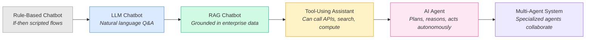

Each step adds capability that the previous generation could not achieve. Agents represent the transition from **responsive** AI (wait for question, answer it) to **proactive** AI (receive a goal, plan and execute it).

### Agent vs Copilot vs Assistant — Definitions

These terms are used interchangeably in industry marketing, but they have distinct meanings for architects:

| Term | Definition | Autonomy Level | Example |
|---|---|---|---|
| **Assistant** | An LLM that answers questions and follows instructions within a single conversation | Low — responds to direct requests | Azure OpenAI Chat, ChatGPT |
| **Copilot** | An AI embedded in a workflow that suggests actions but requires human approval | Medium — suggests, human decides | GitHub Copilot, M365 Copilot |
| **Agent** | An AI system that autonomously plans and executes multi-step tasks using tools | High — plans and acts independently | AutoGen agents, Azure AI Agent Service |

:::tip Architect's Heuristic
If the AI **only talks**, it is an assistant. If it **suggests actions in your workflow**, it is a copilot. If it **takes actions on its own**, it is an agent. The boundaries are fluid — many production systems blend all three.
:::

---

## 6.2 The Agent Architecture

### The Core Agent Loop

Every agent — regardless of framework — follows the same fundamental loop. The LLM acts as the brain that observes the environment, reasons about what to do, selects a tool, executes an action, observes the result, and decides whether to continue or return a final answer.

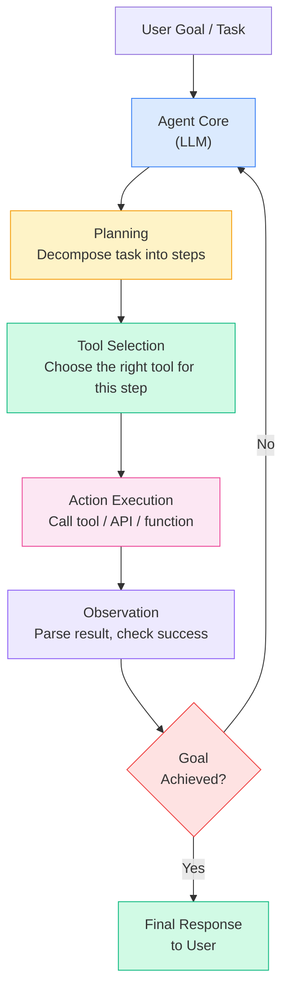

### The ReAct Pattern — Reasoning + Acting

The **ReAct** (Reasoning and Acting) pattern is the most widely adopted agent architecture. It interleaves chain-of-thought reasoning with tool use in an explicit, inspectable loop.

```
Thought: I need to find the current price of Azure SQL Database S3 tier.
Action: search_azure_pricing(service="Azure SQL Database", tier="S3")
Observation: The S3 tier costs approximately $200/month for 100 DTUs.

Thought: Now I need to compare this with the vCore-based model.
Action: search_azure_pricing(service="Azure SQL Database", model="vCore", tier="General Purpose 2 vCores")
Observation: General Purpose 2 vCores costs approximately $370/month.

Thought: I have both data points. I can now provide the comparison.
Final Answer: The DTU-based S3 tier costs ~$200/month while the vCore General Purpose 2-core tier costs ~$370/month...
```

Each iteration follows the **Perception - Reasoning - Action - Observation** cycle:

| Phase | What Happens | LLM's Role |
|---|---|---|
| **Perception** | Receive user input or observation from previous tool call | Parse and understand current state |
| **Reasoning** | Think about what to do next (chain-of-thought) | Generate a "Thought" step |
| **Action** | Select and invoke a tool with appropriate parameters | Generate a structured tool call |
| **Observation** | Receive tool result and incorporate into context | Parse tool output, update understanding |

### Single-Turn vs Multi-Turn Agents

| Aspect | Single-Turn Agent | Multi-Turn Agent |
|---|---|---|
| **Conversation scope** | Receives one task, executes it, returns | Maintains ongoing conversation with user |
| **User interaction** | No mid-task interaction | Can ask clarifying questions during execution |
| **State management** | Stateless or ephemeral | Stateful — maintains context across turns |
| **Use case** | Batch processing, automated tasks | Interactive assistants, complex workflows |
| **Complexity** | Lower | Higher (session management, state persistence) |

### Stateful vs Stateless Agent Design

| Design | Characteristics | Trade-offs |
|---|---|---|
| **Stateless** | No persistent memory between invocations. Each request is independent. Context must be passed in every call. | Simple to scale horizontally. No session affinity needed. Higher token cost (re-send context). |
| **Stateful** | Maintains conversation history and working memory across requests. Thread-based execution model. | Lower per-request token cost. Requires session persistence. More complex to scale and recover from failures. |

For production systems, most agents use a **hybrid approach**: stateless compute with externalized state in a managed store (e.g., Azure Cosmos DB for conversation history, Azure AI Search for long-term memory).

---

## 6.3 Core Agent Capabilities

### Planning

Planning is the capability that separates agents from simple tool-calling chatbots. An agent with planning can take a complex goal and decompose it into a sequence of actionable steps.

#### Task Decomposition

Given a complex request like *"Research the top 3 Azure regions with the lowest latency for our users in Southeast Asia, then estimate monthly costs for running our AKS cluster in each region"*, a planning-capable agent will:

1. Identify sub-tasks: region research, latency analysis, cost estimation
2. Determine dependencies: cost estimation depends on region selection
3. Order execution: research first, then estimate
4. Execute each step using appropriate tools

#### Planning Strategies

| Strategy | How It Works | Best For | Trade-off |
|---|---|---|---|
| **ReAct** | Interleave reasoning and acting one step at a time. Decide the next step only after observing the result of the current step. | Dynamic tasks with uncertain steps | Slower — each step waits for the previous |
| **Plan-then-Execute** | Generate a complete plan upfront, then execute all steps sequentially. | Well-defined, predictable tasks | Plan may become invalid if early steps fail |
| **Reflection** | After execution, the agent reviews its output, identifies weaknesses, and iterates. | Quality-critical outputs (writing, analysis) | Higher token cost due to self-review loops |
| **Plan-Reflect-Replan** | Generate plan, execute, reflect on results, replan if needed. | Complex multi-step workflows | Most expensive but most robust |

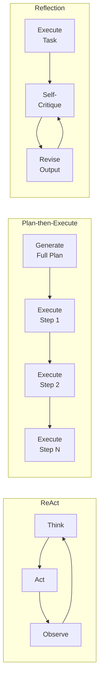

### Memory

Memory gives agents the ability to retain and recall information. Without memory, every agent invocation starts from zero. Production agents typically employ multiple memory tiers.

#### Memory Types

| Memory Type | Scope | Persistence | Implementation | Analogy |
|---|---|---|---|---|
| **Short-Term Memory** | Current conversation | Session-lived | Message array in the API call (system + user + assistant messages) | Your notepad during a meeting |
| **Working Memory** | Current task | Task-lived | Scratchpad variable the agent updates during a multi-step plan | Your whiteboard while solving a problem |
| **Long-Term Memory** | Cross-session | Persistent | Vector database, relational database, or key-value store | Your filing cabinet of past projects |
| **Episodic Memory** | Past interactions | Persistent | Stored summaries of previous conversations and outcomes | Your memory of how past projects went |

#### Memory Architecture

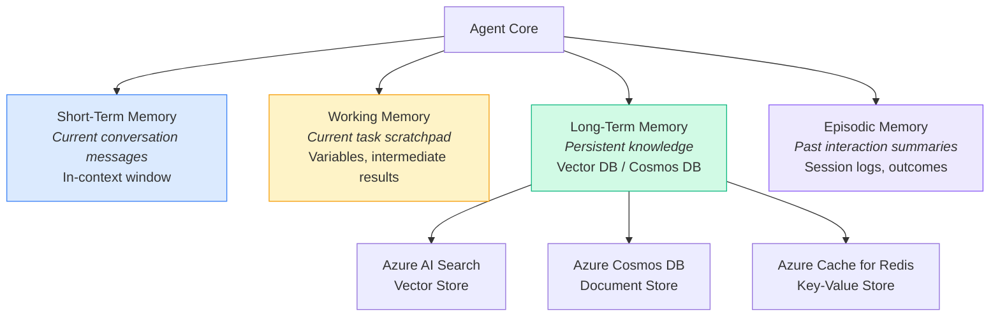

#### Memory Management Strategies

| Strategy | Description | When to Use |
|---|---|---|
| **Sliding Window** | Keep only the last N messages in context | Simple chatbots, cost-sensitive workloads |
| **Summarization** | Periodically summarize old messages into a compact summary, discard originals | Long-running conversations that exceed context windows |
| **Retrieval-Augmented** | Store all messages in a vector DB, retrieve only relevant ones per turn | Agents that need to recall specific past interactions |
| **Tiered Eviction** | Recent messages in full, older messages summarized, oldest in vector store | Production agents balancing cost and recall quality |

### Tool Use / Function Calling

Tool use is the capability that gives agents **hands**. The LLM reasons about what tool to call, generates the parameters, and the application code executes the tool and feeds the result back into the LLM.

#### How Function Calling Works

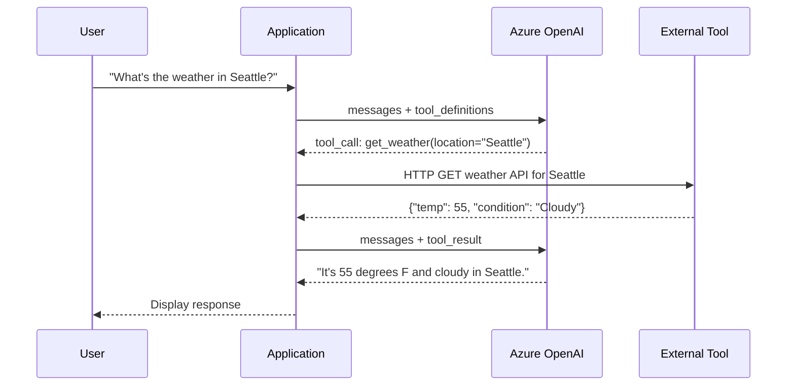

The critical insight is that the **LLM never calls the tool directly**. It generates a structured request (function name + parameters), and the application code is responsible for execution. This gives architects full control over security, validation, and error handling.

#### Tool Definition Example

```python
tools = [
    {
        "type": "function",
        "function": {
            "name": "query_azure_resource_graph",
            "description": "Query Azure Resource Graph to find and analyze Azure resources "
                           "across subscriptions. Use this when the user asks about their "
                           "Azure resources, counts, configurations, or compliance status.",
            "parameters": {
                "type": "object",
                "properties": {
                    "query": {
                        "type": "string",
                        "description": "The Kusto Query Language (KQL) query to execute "
                                       "against Azure Resource Graph."
                    },
                    "subscriptions": {
                        "type": "array",
                        "items": {"type": "string"},
                        "description": "List of subscription IDs to query. "
                                       "If empty, queries all accessible subscriptions."
                    }
                },
                "required": ["query"]
            }
        }
    },
    {
        "type": "function",
        "function": {
            "name": "get_cost_estimate",
            "description": "Estimate the monthly cost of an Azure resource configuration. "
                           "Use this when the user asks about pricing or cost comparisons.",
            "parameters": {
                "type": "object",
                "properties": {
                    "service": {
                        "type": "string",
                        "description": "Azure service name (e.g., 'Virtual Machines', 'AKS', 'Azure SQL')."
                    },
                    "sku": {
                        "type": "string",
                        "description": "The SKU or tier (e.g., 'Standard_D4s_v5', 'S3', 'General Purpose')."
                    },
                    "region": {
                        "type": "string",
                        "description": "Azure region (e.g., 'eastus', 'westeurope')."
                    },
                    "quantity": {
                        "type": "integer",
                        "description": "Number of instances or units.",
                        "default": 1
                    }
                },
                "required": ["service", "sku", "region"]
            }
        }
    }
]
```

#### Tool Design Best Practices

| Practice | Why It Matters |
|---|---|
| **Descriptive names** | `query_azure_resource_graph` is better than `run_query` — the LLM uses the name to decide when to call it |
| **Detailed descriptions** | Include when to use and when NOT to use. The description is the LLM's instruction manual for the tool |
| **Explicit parameter docs** | Each parameter needs a description. Ambiguous parameters lead to incorrect tool calls |
| **Minimal required params** | Only mark parameters as required if they are truly mandatory. Defaults reduce errors |
| **Constrained parameter types** | Use enums where possible. `"region": {"type": "string", "enum": ["eastus", "westus2", "westeurope"]}` |
| **Error-aware design** | Tools should return clear error messages that help the LLM recover and retry |

#### Real-World Tool Categories

| Category | Examples | Use Case |
|---|---|---|
| **Search & Retrieval** | Azure AI Search, Bing Web Search, knowledge base lookup | Finding information, RAG, fact-checking |
| **Data & Analytics** | SQL queries, Azure Resource Graph, Log Analytics KQL | Querying structured data, reporting |
| **Computation** | Code Interpreter, calculator, data transformation | Math, data analysis, chart generation |
| **Communication** | Email (Graph API), Teams messages, ticket creation | Notifications, escalation, workflow triggers |
| **Infrastructure** | ARM/Bicep deployments, Azure CLI commands, DNS updates | Infrastructure management, provisioning |
| **File Operations** | Blob storage read/write, document parsing, file generation | Document processing, report generation |

### Grounding

Grounding connects agents to **real, current data** rather than relying solely on the LLM's training data. Without grounding, agents hallucinate.

| Grounding Method | How It Works | Azure Service |
|---|---|---|
| **RAG (Vector Search)** | Embed documents, retrieve relevant chunks, inject into prompt | Azure AI Search with vector indexing |
| **Web Search** | Query Bing or another search engine in real-time | Bing Grounding in Azure AI Agent Service |
| **Database Query** | Execute SQL/KQL queries against structured data | Azure SQL, Cosmos DB, Kusto |
| **API Call** | Call a REST API to get current data | Any REST endpoint via tool/function calling |
| **File Upload** | User uploads files that the agent can read and analyze | Azure AI Agent Service File Search, Code Interpreter |

:::tip Architect's Note
RAG is the most common grounding technique for enterprise agents. In Module 5 (RAG Architecture), we covered the full pipeline: chunking, embedding, indexing, retrieval, and reranking. In agent systems, RAG becomes just another **tool** that the agent can invoke when it needs factual data.
:::

---

## 6.4 Making Agents Deterministic — The Hard Problem

This is the single most important challenge in agent engineering. LLMs are inherently **non-deterministic** — the same prompt can produce different outputs across invocations. For enterprise production systems that require predictability, auditability, and consistency, this is a fundamental tension.

There is no silver bullet. Determinism in agent systems is achieved through **layers of constraints** applied in combination.

### The Determinism Stack

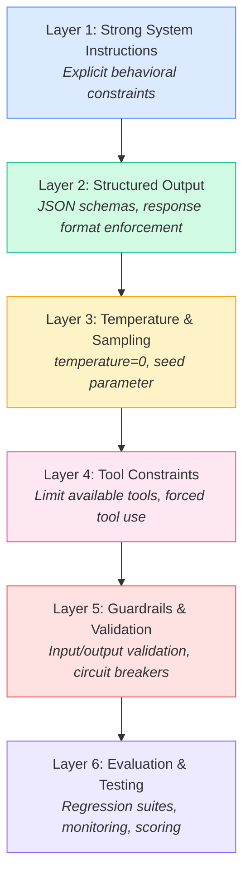

### Layer 1: Strong System Instructions

The system message is your first line of defense against unpredictable agent behavior. Vague instructions produce vague behavior.

**Weak System Prompt:**
```text
You are a helpful assistant that can look up Azure information.
```

**Strong System Prompt:**
```text
## Role
You are AzureOpsAgent, an AI agent that helps platform engineers
diagnose and resolve Azure infrastructure issues.

## Behavior Rules
- You MUST always start by querying Azure Resource Graph to verify
  the resource exists before taking any action.
- You MUST NEVER modify production resources without explicit user
  confirmation. Always present a plan and ask "Shall I proceed?"
- You MUST NEVER execute destructive operations (delete, deallocate,
  stop) on resources tagged with "environment:production".

## Tool Selection Rules
- Use `query_resource_graph` for any question about resource state.
- Use `get_metrics` for performance or health questions.
- Use `run_diagnostic` only after confirming the resource exists.
- NEVER use `modify_resource` without prior user confirmation.

## Response Format
Always respond with:
1. **Finding:** What you discovered
2. **Analysis:** Why this is happening
3. **Recommendation:** What to do about it
4. **Next Steps:** Actions you can take (list as numbered options)

## Error Handling
- If a tool call fails, retry once with the same parameters.
- If it fails again, report the error to the user with the full
  error message and suggest manual investigation steps.
- NEVER guess a tool parameter. If you are unsure, ask the user.
```

### Layer 2: Structured Output

Force the agent to respond in a specific schema rather than freeform text. This makes output parseable, validatable, and consistent.

```python
from pydantic import BaseModel
from openai import AzureOpenAI

class DiagnosticResult(BaseModel):
    resource_id: str
    resource_type: str
    status: str  # "healthy" | "degraded" | "unhealthy"
    findings: list[str]
    recommended_actions: list[str]
    severity: str  # "low" | "medium" | "high" | "critical"

client = AzureOpenAI(
    azure_endpoint="https://my-aoai.openai.azure.com/",
    api_key=os.getenv("AZURE_OPENAI_KEY"),
    api_version="2025-12-01-preview"
)

response = client.beta.chat.completions.parse(
    model="gpt-4o",
    messages=[
        {"role": "system", "content": system_prompt},
        {"role": "user", "content": "Diagnose the health of my AKS cluster aks-prod-01"}
    ],
    response_format=DiagnosticResult,
    temperature=0
)

result = response.choices[0].message.parsed
# result.status -> "degraded"
# result.severity -> "medium"
# result.findings -> ["Node pool system is at 92% CPU utilization", ...]
```

### Layer 3: Temperature and Sampling

| Parameter | Setting | Effect |
|---|---|---|
| `temperature=0` | Greedy decoding — always pick the most probable token | Most deterministic, but not perfectly so. The same prompt may still vary due to GPU floating-point non-determinism and batching effects. |
| `seed=42` | Best-effort deterministic sampling | When combined with `temperature=0`, provides the highest reproducibility. Azure OpenAI returns a `system_fingerprint` you can use to detect infrastructure changes that affect output. |
| `top_p=1.0` | No nucleus sampling filter | When `temperature=0`, `top_p` has no effect. Do not set both `temperature` and `top_p` to low values simultaneously. |

:::warning
Even with `temperature=0` and a fixed `seed`, outputs are NOT guaranteed to be identical across calls. Model version updates, infrastructure changes, and floating-point precision differences can cause variation. Always design your system to tolerate minor output differences.
:::

### Layer 4: Tool Constraints

The more tools an agent has access to, the more unpredictable its behavior becomes. An agent with 50 tools is far less deterministic than one with 3.

| Strategy | Implementation |
|---|---|
| **Minimize tool count** | Give the agent only the tools it needs for its specific role. An expense-reporting agent should not have access to code execution. |
| **Clear tool descriptions** | Ambiguous descriptions cause the LLM to guess. Include explicit "Use this when..." and "Do NOT use this when..." in descriptions. |
| **Forced tool use** | For specific scenarios, force the agent to always use a particular tool rather than choosing. Azure OpenAI supports `tool_choice: {"type": "function", "function": {"name": "specific_tool"}}`. |
| **Tool routing logic** | Instead of letting the LLM choose from 50 tools, use a two-stage approach: a router LLM selects the tool category, then a specialist agent executes within that category. |

### Layer 5: Guardrails and Validation

Guardrails are the safety net. They validate inputs before they reach the LLM and validate outputs before they reach the user or downstream systems.

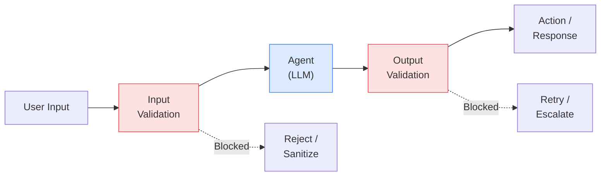

| Guardrail Type | Implementation | Example |
|---|---|---|
| **Input validation** | Check user input before sending to LLM | Block prompt injection attempts, sanitize PII, reject out-of-scope requests |
| **Output validation** | Check LLM output for compliance | Verify structured output matches schema, check for hallucinated URLs, validate cited sources exist |
| **Circuit breakers** | Prevent infinite agent loops | Max 10 tool calls per turn, max 5 minutes per task, max 3 retries per tool |
| **Cost caps** | Prevent runaway token consumption | Max 50,000 tokens per agent session, budget alerts, hard cutoff limits |
| **Human-in-the-loop** | Require human approval for high-stakes actions | Any write/delete/modify operation requires user confirmation before execution |
| **Content safety** | Azure AI Content Safety filters | Block harmful, inappropriate, or policy-violating inputs and outputs |

#### Circuit Breaker Example

```python
MAX_TOOL_CALLS = 10
MAX_RETRIES = 3

tool_call_count = 0
retry_count = 0

while not task_complete:
    response = client.chat.completions.create(
        model="gpt-4o",
        messages=messages,
        tools=tools,
        temperature=0
    )

    if response.choices[0].message.tool_calls:
        tool_call_count += 1

        if tool_call_count > MAX_TOOL_CALLS:
            # Circuit breaker triggered
            messages.append({
                "role": "system",
                "content": "STOP. You have exceeded the maximum number of tool calls. "
                           "Summarize what you have found so far and present it to the user."
            })
            continue

        # Execute tool call
        tool_result = execute_tool(response.choices[0].message.tool_calls[0])

        if tool_result.error:
            retry_count += 1
            if retry_count > MAX_RETRIES:
                messages.append({
                    "role": "system",
                    "content": f"Tool call failed after {MAX_RETRIES} retries. "
                               "Report the error to the user and suggest manual steps."
                })
                continue

        # Append tool result and continue loop
        messages.append(tool_result.to_message())
    else:
        task_complete = True
```

### Layer 6: Evaluation and Testing

Production agent systems require the same testing rigor as any production software — arguably more, because behavior is probabilistic.

| Evaluation Type | What It Tests | Implementation |
|---|---|---|
| **Unit Tests** | Individual tool execution, parsing, validation logic | Standard pytest/xUnit tests |
| **Agent Trace Tests** | Given a known input, does the agent follow the expected tool-call sequence? | Record expected traces, compare actual agent traces |
| **Regression Suites** | Has a prompt or model change broken existing behavior? | Dataset of (input, expected_output) pairs, run after every change |
| **Red Team Testing** | Can adversarial inputs trick the agent into unsafe behavior? | Dedicated red team with prompt injection, jailbreak, and scope-escape attacks |
| **Human Evaluation** | Is the agent output actually useful, accurate, and appropriate? | Expert review of sampled agent sessions |
| **A/B Testing** | Does version B of the agent perform better than version A? | Split traffic between agent versions, compare metrics |

---

## 6.5 Microsoft Agent Frameworks

Microsoft offers three distinct approaches to building agents, each optimized for different scenarios and skill levels.

### Framework Comparison

| Dimension | Azure AI Agent Service | AutoGen | Semantic Kernel Agents |
|---|---|---|---|
| **Type** | Managed cloud service | Open-source framework | Open-source SDK |
| **Deployment** | Azure-hosted (PaaS) | Self-hosted | Self-hosted (integrates with Azure) |
| **Language** | Python, C#, JavaScript (REST API) | Python, .NET | Python, C#, Java |
| **Agent pattern** | Single agent with tools | Multi-agent conversations | Single or multi-agent with plugins |
| **State management** | Managed threads (server-side) | In-memory or custom | In-memory or custom |
| **Built-in tools** | Code Interpreter, File Search, Bing Grounding, Azure AI Search, Azure Functions | Code execution, tool use | Plugin ecosystem, OpenAI tools |
| **Best for** | Production agents with managed infrastructure | Research, complex multi-agent workflows | Enterprise apps already using Semantic Kernel |
| **Learning curve** | Low-Medium | Medium-High | Medium |

### Azure AI Agent Service

Azure AI Agent Service is Microsoft's **managed agent platform** within Azure AI Foundry. It provides a server-side, stateful agent runtime with built-in tools and managed conversation threads.

#### Architecture

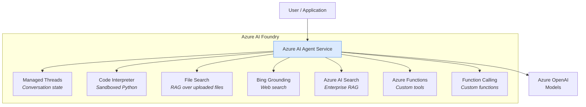

#### Key Features

| Feature | Description |
|---|---|
| **Managed Threads** | Conversation history is stored server-side. No need to manage message arrays in your application. Each thread persists across API calls. |
| **Code Interpreter** | A sandboxed Python environment where the agent can write and execute code, generate charts, process uploaded files, and perform data analysis. |
| **File Search** | Upload documents (PDF, DOCX, TXT, etc.) and the service automatically chunks, embeds, and indexes them. The agent can then search across uploaded files. |
| **Bing Grounding** | Real-time web search grounding. The agent can search the web to answer questions about current events, pricing, or any public information. |
| **Azure AI Search Integration** | Connect to an existing Azure AI Search index for enterprise RAG. The agent uses your corporate knowledge base. |
| **OpenAI Assistants API Compatibility** | The API is compatible with the OpenAI Assistants API, making migration straightforward. |

#### Code Example — Creating an Agent

```python
from azure.ai.projects import AIProjectClient
from azure.identity import DefaultAzureCredential
from azure.ai.projects.models import (
    BingGroundingTool,
    CodeInterpreterTool,
    AzureAISearchTool,
    MessageTextContent,
)

# Initialize the client
client = AIProjectClient(
    credential=DefaultAzureCredential(),
    endpoint="https://my-project.services.ai.azure.com",
)

# Create an agent with multiple tools
agent = client.agents.create_agent(
    model="gpt-4o",
    name="InfraOpsAgent",
    instructions="""You are an Azure infrastructure operations agent.
    You help platform engineers diagnose issues, analyze costs,
    and optimize Azure deployments.

    Rules:
    - Always search for current information before answering.
    - Use code interpreter for any data analysis or calculations.
    - Cite your sources.
    - If unsure, say so explicitly.""",
    tools=[
        BingGroundingTool(connection_id="bing-connection"),
        CodeInterpreterTool(),
        AzureAISearchTool(
            index_connection_id="search-connection",
            index_name="azure-docs-index"
        ),
    ],
)

# Create a conversation thread
thread = client.agents.create_thread()

# Send a message
client.agents.create_message(
    thread_id=thread.id,
    role="user",
    content="What are the current reserved instance prices for D4s_v5 VMs in West Europe? "
            "Compare 1-year vs 3-year terms."
)

# Run the agent
run = client.agents.create_and_process_run(
    thread_id=thread.id,
    agent_id=agent.id
)

# Retrieve the response
if run.status == "completed":
    messages = client.agents.list_messages(thread_id=thread.id)
    for msg in messages:
        if msg.role == "assistant":
            for block in msg.content:
                if isinstance(block, MessageTextContent):
                    print(block.text.value)
```

### AutoGen

AutoGen is Microsoft Research's open-source framework for building **multi-agent conversation systems**. Its core innovation is the concept of agents that converse with each other to solve problems collectively.

#### AutoGen 0.4 Architecture

AutoGen 0.4 introduced a significant redesign with an event-driven, modular architecture:

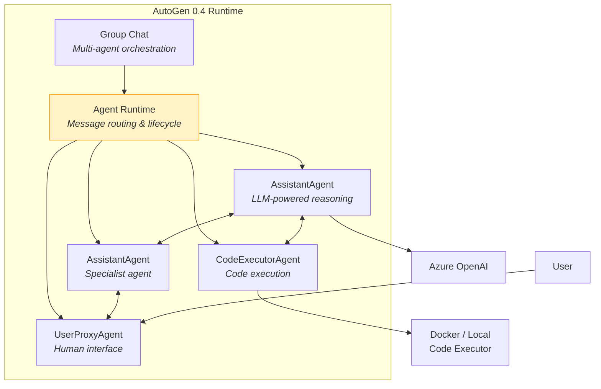

#### Agent Roles in AutoGen

| Agent Type | Role | Capabilities |
|---|---|---|
| **AssistantAgent** | LLM-powered agent that reasons, plans, and generates responses | Tool use, code generation, analysis |
| **UserProxyAgent** | Represents the human user. Can auto-approve or require human input | Message relay, approval gate, human-in-the-loop |
| **CodeExecutorAgent** | Executes code generated by other agents in a sandboxed environment | Python execution, package installation, file I/O |
| **Custom Agents** | Developer-defined agents with specific behaviors and tools | Any custom logic |

#### Multi-Agent Conversation Example

```python
from autogen_agentchat.agents import AssistantAgent
from autogen_agentchat.teams import RoundRobinGroupChat
from autogen_agentchat.conditions import TextMentionTermination
from autogen_ext.models.openai import AzureOpenAIChatCompletionClient

# Configure the model
model_client = AzureOpenAIChatCompletionClient(
    azure_deployment="gpt-4o",
    azure_endpoint="https://my-aoai.openai.azure.com/",
    model="gpt-4o",
    api_version="2025-12-01-preview",
)

# Create specialized agents
architect_agent = AssistantAgent(
    name="CloudArchitect",
    model_client=model_client,
    system_message="""You are a senior Azure cloud architect.
    Review infrastructure proposals for security, reliability,
    and cost efficiency. Identify gaps and suggest improvements.
    When the design is solid, say APPROVED.""",
)

security_agent = AssistantAgent(
    name="SecurityReviewer",
    model_client=model_client,
    system_message="""You are an Azure security specialist.
    Review infrastructure proposals for security vulnerabilities,
    compliance gaps, and identity/access issues.
    Focus on: network security, encryption, IAM, and data protection.""",
)

cost_agent = AssistantAgent(
    name="CostOptimizer",
    model_client=model_client,
    system_message="""You are an Azure cost optimization specialist.
    Review infrastructure proposals for cost efficiency.
    Suggest reserved instances, right-sizing, and architectural
    changes that reduce cost without sacrificing reliability.""",
)

# Create a group chat with round-robin turn-taking
termination = TextMentionTermination("APPROVED")

team = RoundRobinGroupChat(
    participants=[architect_agent, security_agent, cost_agent],
    termination_condition=termination,
    max_turns=10,
)

# Run the multi-agent review
result = await team.run(
    task="Review this AKS deployment proposal: 3 node pools (system: "
         "Standard_D4s_v5 x3, user: Standard_D8s_v5 x5, GPU: "
         "Standard_NC24ads_A100_v4 x2) in East US, with Azure CNI "
         "overlay networking, Workload Identity, and Azure Key Vault "
         "CSI driver. Public API server with authorized IP ranges."
)
```

#### AutoGen Use Cases

| Use Case | Agent Configuration | Why Multi-Agent? |
|---|---|---|
| **Architecture review** | Architect + Security + Cost agents debate a design | Each agent brings a specialized perspective |
| **Code generation & review** | Coder + Reviewer + Tester agents | Separation of concerns mirrors real dev teams |
| **Research & analysis** | Researcher + Critic + Summarizer agents | Iterative refinement produces higher quality output |
| **Incident response** | Diagnostician + Remediator + Communicator agents | Parallel specialization speeds resolution |

### Semantic Kernel Agent Framework

Semantic Kernel provides an agent framework built on top of its plugin and orchestration ecosystem. Agents in Semantic Kernel leverage the existing plugin model, making it straightforward to add agent capabilities to applications already using SK.

#### Agent Types

| Agent Type | Description | Backend |
|---|---|---|
| **ChatCompletionAgent** | An agent powered by any chat completion model. Uses Semantic Kernel plugins as tools. | Azure OpenAI, OpenAI, local models |
| **OpenAIAssistantAgent** | An agent backed by the OpenAI Assistants API (or Azure AI Agent Service). Server-side state management. | OpenAI Assistants API, Azure AI Agent Service |
| **AzureAIAgent** | An agent that works directly with Azure AI Agent Service using the Azure AI Projects SDK. | Azure AI Agent Service |

#### AgentGroupChat — Multi-Agent Collaboration

```csharp
using Microsoft.SemanticKernel;
using Microsoft.SemanticKernel.Agents;
using Microsoft.SemanticKernel.Agents.Chat;

// Create a kernel with Azure OpenAI
var kernel = Kernel.CreateBuilder()
    .AddAzureOpenAIChatCompletion("gpt-4o", endpoint, apiKey)
    .Build();

// Define specialized agents
ChatCompletionAgent analystAgent = new()
{
    Name = "InfraAnalyst",
    Instructions = "You analyze Azure infrastructure configurations for " +
                   "reliability and performance issues. Be specific and cite " +
                   "Azure Well-Architected Framework guidance.",
    Kernel = kernel
};

ChatCompletionAgent advisorAgent = new()
{
    Name = "CostAdvisor",
    Instructions = "You review Azure infrastructure recommendations and " +
                   "evaluate them for cost impact. Provide estimated monthly " +
                   "cost implications for every recommendation.",
    Kernel = kernel
};

// Create a group chat with a termination strategy
AgentGroupChat chat = new(analystAgent, advisorAgent)
{
    ExecutionSettings = new()
    {
        TerminationStrategy = new MaxTurnTermination(maxTurns: 6),
        SelectionStrategy = new RoundRobinSelectionStrategy()
    }
};

// Add a task and run the multi-agent conversation
chat.AddChatMessage(new ChatMessageContent(
    AuthorRole.User,
    "Review this architecture: Hub-spoke topology with Azure Firewall Premium, " +
    "3 spoke VNETs, Application Gateway v2 with WAF, AKS with 10 nodes " +
    "Standard_D8s_v5, Azure SQL Hyperscale 8 vCores, and ExpressRoute."
));

await foreach (var message in chat.InvokeAsync())
{
    Console.WriteLine($"[{message.AuthorName}]: {message.Content}");
}
```

---

## 6.6 Agent Patterns

### Single Agent Pattern

The simplest agent pattern: one agent with access to multiple tools. The agent decides which tools to use and in what order.

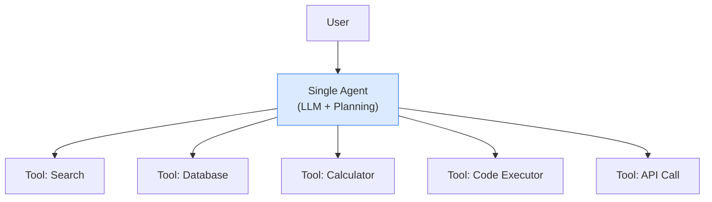

**Best for:** Focused tasks where one agent can handle all aspects. Most production agents start here.

**Limitations:** As tool count and task complexity grow, a single agent's decision-making degrades. Beyond 10-15 tools, consider multi-agent patterns.

### Multi-Agent Collaboration Patterns

When tasks are too complex or too broad for a single agent, multiple specialized agents collaborate.

#### Pattern Comparison

| Pattern | Description | Orchestration | Best For |
|---|---|---|---|
| **Handoff** | A router agent delegates to specialist agents based on the request type | Sequential — one agent at a time | Customer support, multi-domain assistants |
| **Supervisor** | An orchestrator agent manages and coordinates worker agents | Centralized — supervisor controls flow | Complex workflows with dependencies |
| **Debate** | Agents critique each other's outputs to improve quality | Iterative — agents refine each other's work | Research, analysis, content generation |
| **Swarm** | Agents self-organize based on capability matching | Decentralized — agents route among themselves | Dynamic, unpredictable task routing |

#### Handoff Pattern

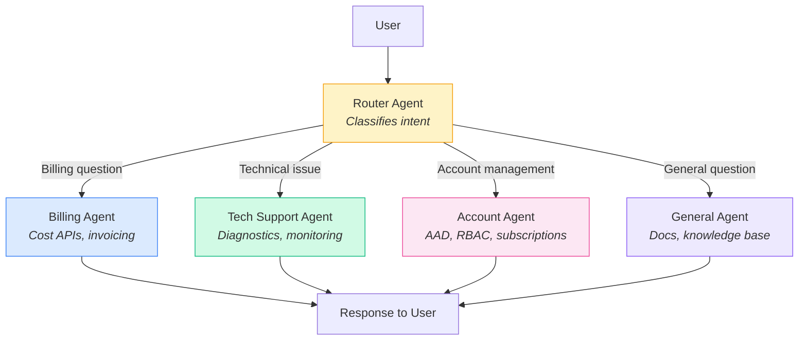

The handoff pattern is the most common multi-agent pattern in production. Microsoft's own Copilot Studio uses this pattern internally — a router identifies the user's intent and hands off to a specialized topic/agent.

#### Supervisor Pattern

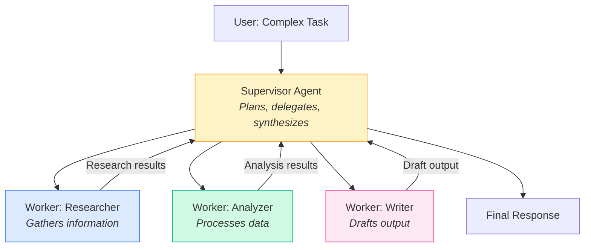

#### Debate Pattern

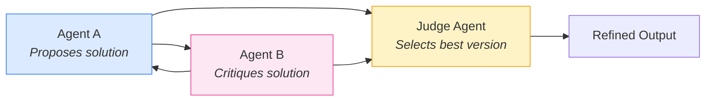

### Human-in-the-Loop Pattern

For high-stakes operations, agents should escalate to humans rather than act autonomously.

| Scenario | Agent Behavior | Why |
|---|---|---|
| **Destructive operations** | "I plan to delete resource X. Shall I proceed?" | Prevent accidental data loss |
| **Cost-significant actions** | "This will provision 8 GPU VMs at ~$25,000/month. Approve?" | Financial governance |
| **Ambiguous intent** | "I found 3 possible interpretations. Which did you mean?" | Reduce errors from misunderstanding |
| **Security-sensitive actions** | "This requires modifying NSG rules on the production VNET. Approval needed." | Security compliance |
| **Low-confidence decisions** | "I'm not confident in this diagnosis. Escalating to a human operator." | Quality assurance |

### Agentic RAG

Traditional RAG follows a fixed pipeline: retrieve, then generate. Agentic RAG gives the agent control over the retrieval process itself.

| Aspect | Traditional RAG | Agentic RAG |
|---|---|---|
| **Retrieval trigger** | Every user query triggers retrieval | Agent decides IF and WHEN to retrieve |
| **Search strategy** | Single vector search | Agent can search, filter, refine, and search again |
| **Source selection** | Fixed index | Agent chooses which knowledge base(s) to search |
| **Result evaluation** | No evaluation — results go directly to generation | Agent evaluates retrieval results and re-queries if insufficient |
| **Multi-source synthesis** | Difficult to implement | Agent naturally synthesizes across multiple sources and tools |

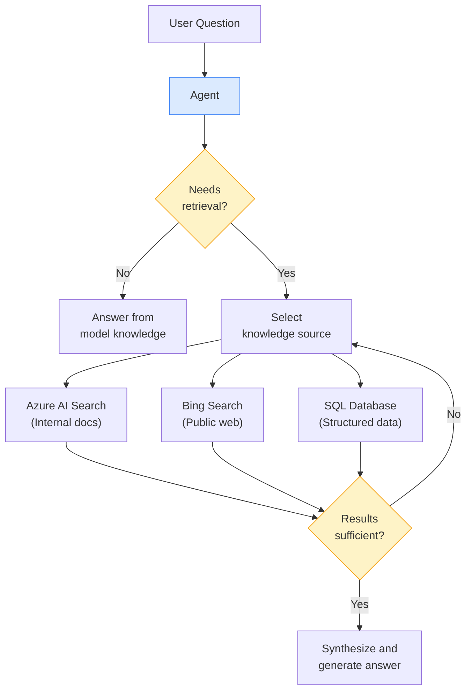

---

## 6.7 Agent Communication Protocols

As the agent ecosystem grows, interoperability becomes critical. Two emerging protocols aim to standardize how agents connect to tools and to each other.

### Model Context Protocol (MCP)

MCP is an **open standard** originally released by Anthropic that defines how AI models connect to external tools, data sources, and services. Think of it as **USB-C for AI agents** — a universal plug that any agent can use to connect to any tool server.

#### Why MCP Matters

Before MCP, every agent framework had its own tool integration format. If you built a tool for AutoGen, it would not work in Semantic Kernel without rewriting. MCP provides a single standard that all frameworks can adopt.

#### MCP Architecture

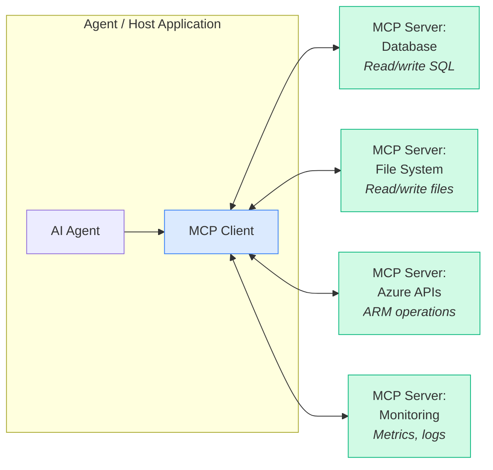

#### MCP Primitives

| Primitive | Direction | Description | Example |
|---|---|---|---|
| **Resources** | Server to Client | Data that the server exposes for the agent to read | Database tables, file contents, API responses |
| **Tools** | Server to Client (invoked by agent) | Actions the agent can take via the server | `run_query`, `create_resource`, `send_email` |
| **Prompts** | Server to Client | Pre-built prompt templates the server offers | "Analyze this database schema", "Summarize these logs" |
| **Sampling** | Server to Client | Allows the server to request LLM completions from the client | Server asks the agent to interpret a result |

#### MCP Server Example (Python)

```python
from mcp.server.fastmcp import FastMCP

# Create an MCP server for Azure Resource Graph
mcp = FastMCP("azure-resource-graph")

@mcp.tool()
async def query_resources(
    query: str,
    subscription_id: str | None = None
) -> str:
    """Query Azure Resource Graph using KQL.

    Use this tool to find and analyze Azure resources across subscriptions.
    Returns results as a JSON array of resource objects.

    Args:
        query: A KQL query for Azure Resource Graph
        subscription_id: Optional subscription ID to scope the query
    """
    # Execute the query against Azure Resource Graph
    credential = DefaultAzureCredential()
    client = ResourceGraphClient(credential)

    request = QueryRequest(
        query=query,
        subscriptions=[subscription_id] if subscription_id else None
    )
    result = client.resources(request)
    return json.dumps(result.data, indent=2)

@mcp.resource("azure://subscriptions")
async def list_subscriptions() -> str:
    """List all accessible Azure subscriptions."""
    credential = DefaultAzureCredential()
    client = SubscriptionClient(credential)
    subs = [{"id": s.subscription_id, "name": s.display_name}
            for s in client.subscriptions.list()]
    return json.dumps(subs, indent=2)

# Run the server
mcp.run()
```

### A2A — Agent-to-Agent Protocol

A2A is an **open protocol** led by Google that defines how independent agents **discover and communicate** with each other. While MCP connects agents to tools, A2A connects agents to other agents.

#### A2A Core Concepts

| Concept | Description |
|---|---|
| **Agent Card** | A JSON metadata document that describes an agent's capabilities, endpoint, and authentication requirements. Published at `/.well-known/agent.json`. |
| **Task** | A unit of work that one agent requests from another. Tasks have lifecycle states: submitted, working, input-needed, completed, failed. |
| **Message** | A communication unit between agents within a task. Contains parts (text, files, structured data). |
| **Artifact** | Output produced by the receiving agent — files, data, or structured results. |

#### A2A Flow

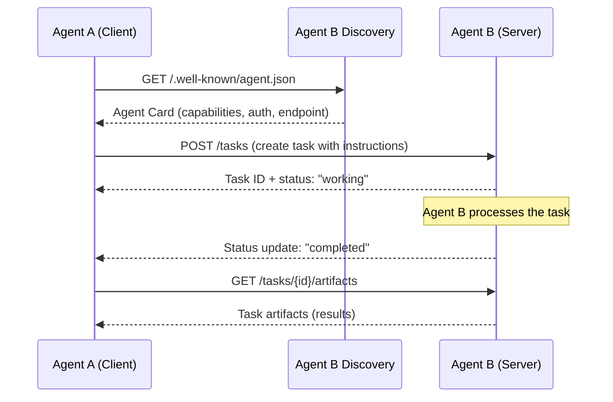

#### Agent Card Example

```json
{
  "name": "AzureCostAnalyzer",
  "description": "Analyzes Azure spending patterns and provides cost optimization recommendations",
  "url": "https://cost-agent.contoso.com",
  "version": "1.0.0",
  "capabilities": {
    "streaming": true,
    "pushNotifications": false
  },
  "skills": [
    {
      "id": "cost-analysis",
      "name": "Cost Analysis",
      "description": "Analyze Azure spending across subscriptions and recommend optimizations",
      "inputModes": ["text"],
      "outputModes": ["text", "application/json"]
    },
    {
      "id": "reservation-advisor",
      "name": "Reservation Advisor",
      "description": "Recommend Reserved Instance and Savings Plan purchases based on usage",
      "inputModes": ["text", "application/json"],
      "outputModes": ["text", "application/json"]
    }
  ],
  "authentication": {
    "schemes": ["oauth2"],
    "credentials": "https://login.microsoftonline.com/contoso.com"
  }
}
```

#### MCP vs A2A — They Are Complementary

| Dimension | MCP | A2A |
|---|---|---|
| **Purpose** | Connect agents to tools and data | Connect agents to other agents |
| **Analogy** | USB-C (device to peripheral) | HTTP (service to service) |
| **Communication** | Agent calls a tool on an MCP server | Agent delegates a task to another agent |
| **State** | Stateless tool invocations | Stateful task lifecycle |
| **Discovery** | Server lists available tools | Agent Card at `/.well-known/agent.json` |
| **Ecosystem** | Thousands of MCP servers emerging | Early adoption, growing support |

---

## 6.8 Agent Workflows in Production

### Copilot Studio Agents

Microsoft Copilot Studio provides a **no-code/low-code** platform for building agents that integrate with the Microsoft 365 ecosystem.

| Capability | Description |
|---|---|
| **Topics** | Conversational flows triggered by user intent. Can include branching logic, variable capture, and actions. |
| **Actions** | Connectable operations — Power Automate flows, HTTP requests, custom connectors, Dataverse operations. |
| **Knowledge Sources** | Upload documents, connect SharePoint sites, or link Azure AI Search indexes as grounding data. |
| **Autonomous Agents** | Agents that run on a schedule or trigger without user interaction — process emails, monitor data, take automated actions. |
| **Generative Answers** | LLM-powered answers grounded in configured knowledge sources. No manual topic authoring required for covered content. |
| **Channels** | Publish to Teams, web chat, Facebook, SMS, Slack, and custom channels. |

**Best For:** Business users and citizen developers building agents for internal workflows, HR, IT help desk, and customer service without writing code.

### Code-First Agents

For architects and developers who need full control over agent behavior, tool integrations, and infrastructure.

| Approach | SDK/Framework | Key Advantage |
|---|---|---|
| **Azure AI Agent Service** | `azure-ai-projects` Python/C# SDK | Managed infrastructure, built-in tools, server-side threads |
| **Semantic Kernel** | `semantic-kernel` Python/C#/Java SDK | Plugin ecosystem, enterprise integrations, .NET-first |
| **AutoGen** | `autogen-agentchat` Python SDK | Multi-agent patterns, research flexibility |
| **Custom Agent Loop** | Direct Azure OpenAI SDK + your own code | Maximum control, minimal abstractions |

#### Custom Agent Loop (Minimal Example)

For architects who want to understand the fundamental mechanics, here is a minimal agent loop using only the Azure OpenAI SDK:

```python
import json
from openai import AzureOpenAI

client = AzureOpenAI(
    azure_endpoint="https://my-aoai.openai.azure.com/",
    api_key=os.getenv("AZURE_OPENAI_KEY"),
    api_version="2025-12-01-preview"
)

# Tool definitions
tools = [
    {
        "type": "function",
        "function": {
            "name": "get_resource_health",
            "description": "Check the health status of an Azure resource.",
            "parameters": {
                "type": "object",
                "properties": {
                    "resource_id": {"type": "string", "description": "Full Azure resource ID"}
                },
                "required": ["resource_id"]
            }
        }
    }
]

# Tool implementation
def execute_tool(name: str, arguments: dict) -> str:
    if name == "get_resource_health":
        # In production, call Azure Resource Health API
        return json.dumps({"status": "Available", "last_checked": "2026-03-19T10:30:00Z"})
    return json.dumps({"error": f"Unknown tool: {name}"})

# Agent loop
messages = [
    {"role": "system", "content": "You are an Azure operations agent. Use tools to gather data."},
    {"role": "user", "content": "Check the health of /subscriptions/abc-123/resourceGroups/prod/providers/Microsoft.Compute/virtualMachines/web-01"}
]

MAX_ITERATIONS = 10
for iteration in range(MAX_ITERATIONS):
    response = client.chat.completions.create(
        model="gpt-4o",
        messages=messages,
        tools=tools,
        temperature=0
    )

    choice = response.choices[0]

    # If the model wants to call a tool
    if choice.finish_reason == "tool_calls":
        # Add the assistant's message (with tool calls) to history
        messages.append(choice.message)

        # Execute each tool call and add results
        for tool_call in choice.message.tool_calls:
            args = json.loads(tool_call.function.arguments)
            result = execute_tool(tool_call.function.name, args)

            messages.append({
                "role": "tool",
                "tool_call_id": tool_call.id,
                "content": result
            })
    else:
        # No tool call — agent has produced its final response
        print(choice.message.content)
        break
```

---

## 6.9 Agent Infrastructure Considerations

Deploying agents in production introduces infrastructure challenges that do not exist with simple LLM API integrations.

### Infrastructure Decision Matrix

| Concern | Challenge | Recommendation |
|---|---|---|
| **Stateful compute** | Agent threads require state persistence across API calls | Externalize state to Azure Cosmos DB or Redis. Use Azure AI Agent Service managed threads for simplicity. |
| **Tool API latency** | Each tool call adds network latency. An agent calling 5 tools sequentially accumulates latency. | Set latency budgets per tool (<2s). Implement timeouts. Use async tool execution where possible. Cache frequently accessed tool results. |
| **Concurrent execution** | Multiple users running agents simultaneously strain LLM endpoints. | Use provisioned throughput (PTU) on Azure OpenAI for predictable capacity. Implement queuing for burst traffic. |
| **Cost management** | Agent loops can make many LLM calls. A 10-step agent task may consume 10x the tokens of a single Q&A. | Implement per-session token budgets. Monitor cost per agent session. Use circuit breakers to prevent runaway loops. Choose smaller models for intermediate reasoning steps. |
| **Observability** | Understanding why an agent made a specific decision requires tracing the full ReAct loop. | Log every agent step: thought, action, observation. Use Azure Application Insights or OpenTelemetry. Build dashboards showing tool call patterns and token usage. |
| **Security** | Agents with tool access can read data, call APIs, and potentially execute code. | Apply principle of least privilege to tool access. Sandbox code execution (Docker containers). Authenticate tool calls with managed identities. Audit all agent actions. |
| **Scaling** | Agent workloads are bursty and unpredictable. | Autoscale agent compute (AKS, Container Apps). Use queue-based load leveling. Separate agent orchestration compute from tool execution compute. |

### Token Cost Estimation for Agent Workloads

| Agent Pattern | Avg. Tool Calls | Avg. Tokens per Session | Est. Cost (GPT-4o) |
|---|---|---|---|
| Simple Q&A (no tools) | 0 | 1,000-2,000 | $0.005-$0.01 |
| Single tool call | 1 | 2,000-4,000 | $0.01-$0.02 |
| Multi-step agent (3-5 tools) | 3-5 | 8,000-15,000 | $0.04-$0.08 |
| Complex agent (8-10 tools) | 8-10 | 20,000-40,000 | $0.10-$0.20 |
| Multi-agent debate (3 agents, 3 turns each) | 5-15 | 30,000-80,000 | $0.15-$0.40 |

*Estimates based on GPT-4o pricing as of early 2026. Actual costs vary by prompt complexity. Input tokens are significantly cheaper than output tokens.*

:::warning Cost Alert
A multi-agent system where three agents debate over five rounds can easily consume 50,000+ tokens per session. At scale (thousands of daily sessions), this adds up quickly. Always implement token budgets and consider using smaller, cheaper models (GPT-4o-mini, Phi-4) for intermediate agent reasoning steps while reserving the most capable model for final synthesis.
:::

### Observability Architecture

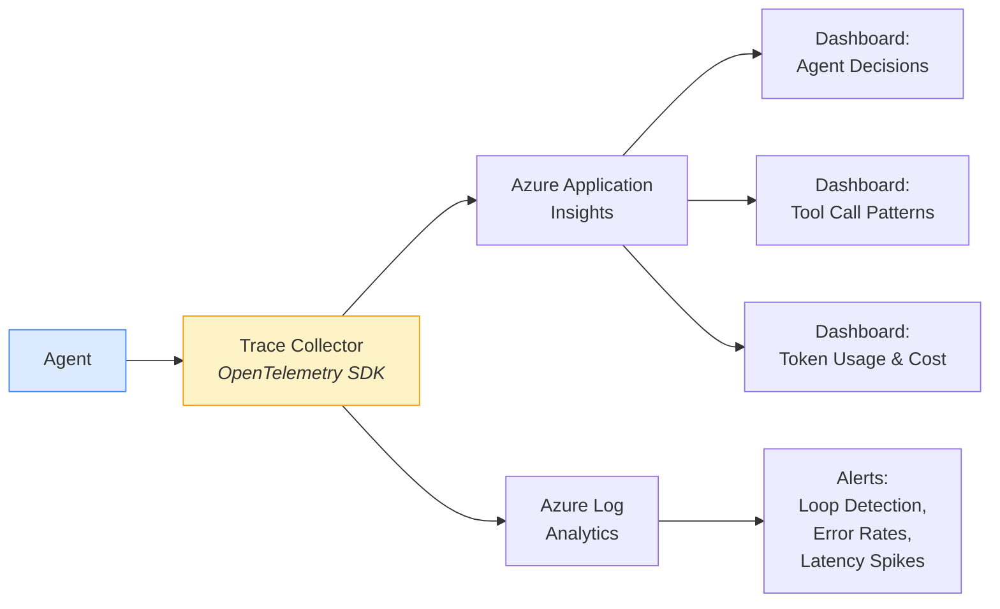

Key metrics to track for agent workloads:

| Metric | What It Reveals | Alert Threshold |
|---|---|---|
| **Tool calls per session** | Agent complexity, potential loops | >15 calls per session |
| **Tokens per session** | Cost efficiency, prompt optimization needs | >50,000 tokens |
| **Agent loop iterations** | Planning efficiency, possible infinite loops | >10 iterations |
| **Tool error rate** | External service reliability | >5% error rate |
| **Time to final response** | User experience, latency budgets | >30 seconds |
| **Escalation rate** | Agent capability gaps | Trending upward |

---

## 6.10 The Agent Maturity Model

Not every AI application needs full agent autonomy. The maturity model helps architects choose the right level of sophistication for their use case.

| Level | Name | Description | Characteristics | Risks | Recommendation |
|---|---|---|---|---|---|
| **Level 1** | Chatbot | Simple Q&A using LLM knowledge | Single-turn, no tools, no grounding. Responds based solely on training data. | Hallucination (no grounding), outdated information | Acceptable only for low-stakes, general knowledge queries |
| **Level 2** | RAG Chatbot | Grounded Q&A from enterprise data | Retrieves context from a knowledge base before responding. Still reactive — only answers questions. | Retrieval quality dependency, chunk relevance issues | Good starting point for enterprise Q&A (IT help desk, policy lookup) |
| **Level 3** | Tool-Using Assistant | Can take actions via function calling | Calls APIs, queries databases, performs calculations. User initiates each action. | Tool misuse, incorrect parameters, privilege escalation | Suitable for internal productivity tools with human oversight |
| **Level 4** | Semi-Autonomous Agent | Plans and executes multi-step tasks | Decomposes goals, selects tools, executes plans. Seeks human approval for critical actions. | Plan quality variance, runaway loops, cost overruns | Recommended for most enterprise production workloads |
| **Level 5** | Fully Autonomous Agent | Operates independently with minimal supervision | Runs on schedules/triggers, makes decisions, handles exceptions, adapts to failures. | Unintended actions, difficult to audit, trust challenges | Only for well-tested, bounded domains with strong guardrails |

### Maturity Level Decision Flow

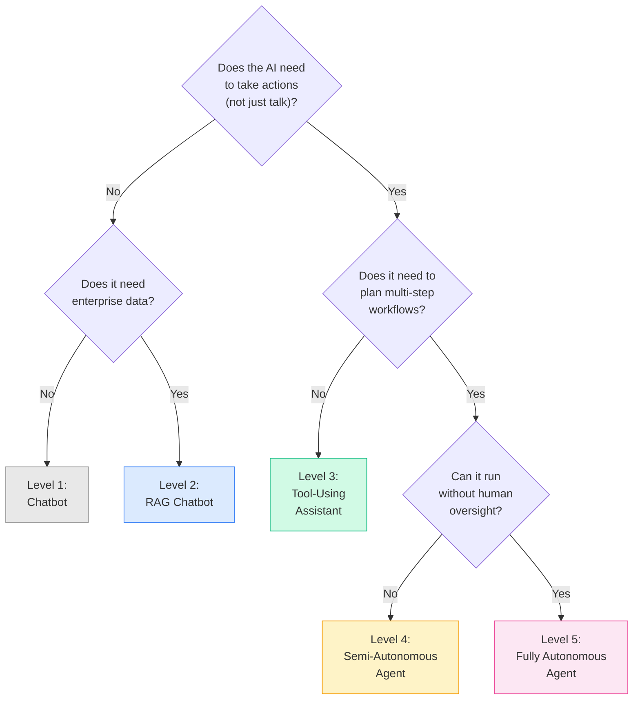

:::tip Where Most Enterprises Should Start
**Level 4 (Semi-Autonomous Agent)** is the sweet spot for most enterprise production workloads. It provides the productivity benefits of autonomous planning and execution while maintaining human oversight for critical decisions. Start here, and only move to Level 5 after extensive testing and trust-building in bounded domains.
:::

---

## Key Takeaways

1. **An agent is an LLM with memory, tools, and planning** — it can reason about goals and take multi-step actions, not just respond to prompts.

2. **The ReAct loop (Reason-Act-Observe) is the foundational agent architecture** — every agent framework implements some variation of this pattern.

3. **Determinism is the hard problem** — achieving reliable, predictable agent behavior requires layering strong system instructions, structured output, guardrails, tool constraints, and rigorous evaluation. No single technique is sufficient.

4. **Microsoft offers three agent frameworks** — Azure AI Agent Service (managed PaaS), AutoGen (multi-agent research framework), and Semantic Kernel agents (enterprise SDK). Choose based on your team's skills and deployment requirements.

5. **Multi-agent patterns unlock complex workflows** — handoff, supervisor, and debate patterns let specialized agents collaborate, but they multiply cost and complexity.

6. **MCP and A2A are emerging standards** — MCP standardizes tool connections, A2A standardizes agent-to-agent communication. Adopt them early for interoperability.

7. **Agent infrastructure is different from API infrastructure** — stateful compute, tool latency budgets, cost management, and observability all require new patterns beyond standard API hosting.

8. **Start at Level 4** — most enterprises should build semi-autonomous agents with human-in-the-loop for critical decisions, and only advance to full autonomy in well-tested, bounded domains.

---

> **Next Module:** [Module 7: Semantic Kernel & Orchestration](./07-Semantic-Kernel.md) — dive into the SDK that powers Microsoft's agent and AI orchestration ecosystem, including plugins, planners, memory connectors, and how Semantic Kernel compares to LangChain.
