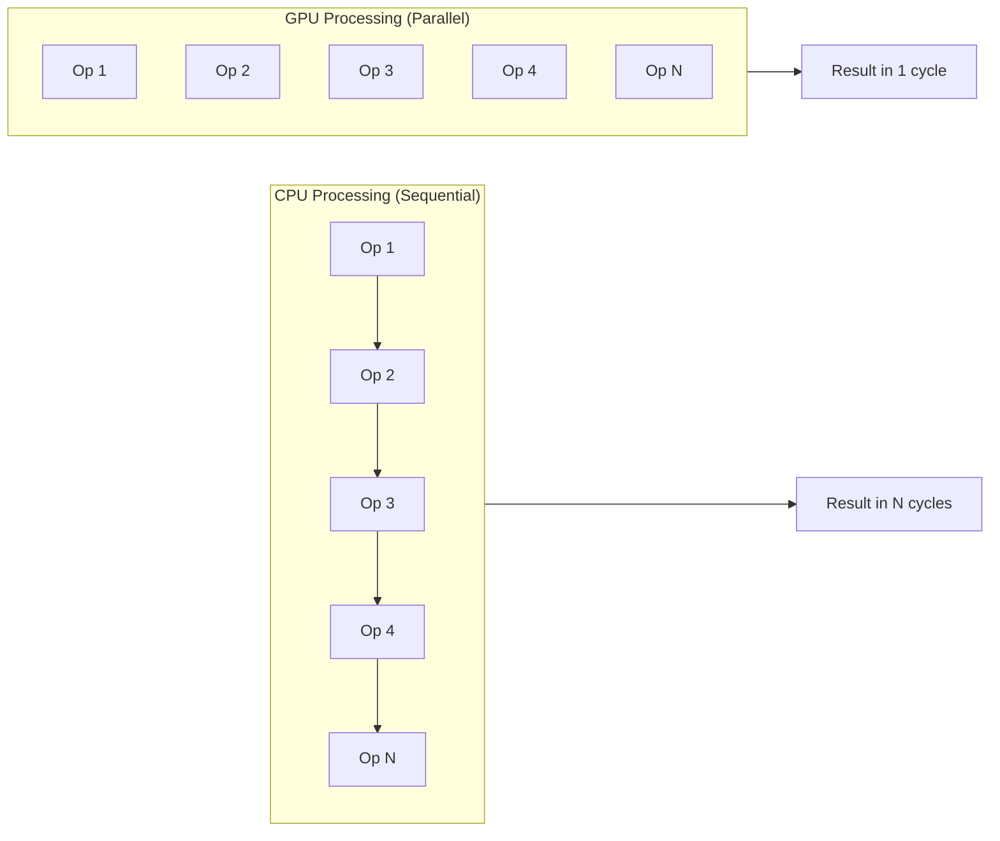
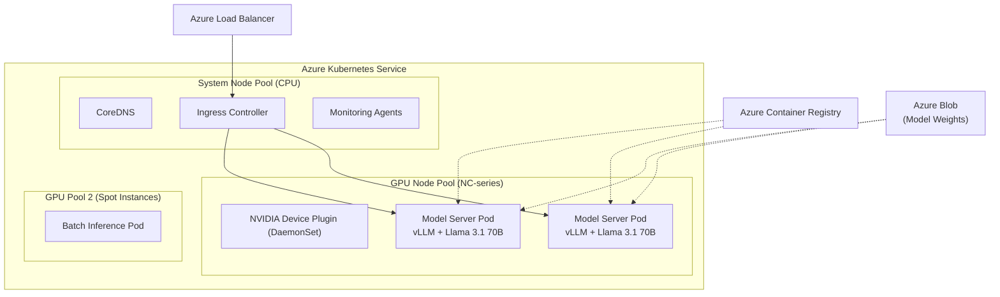
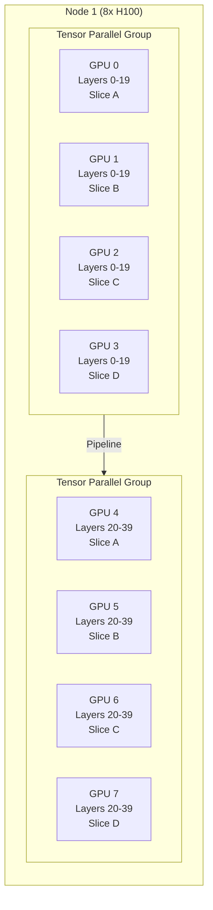
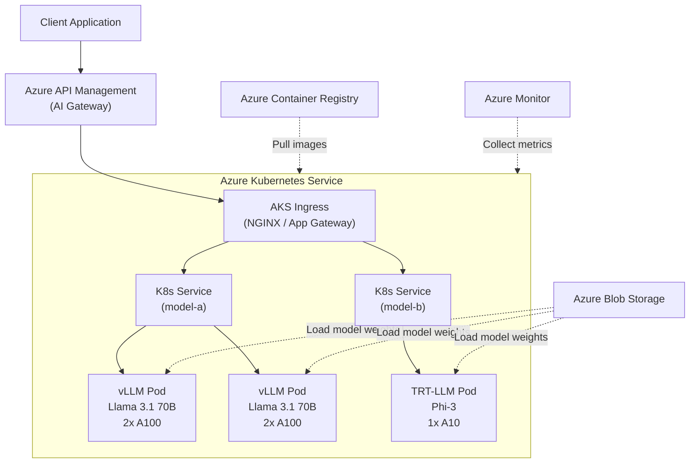
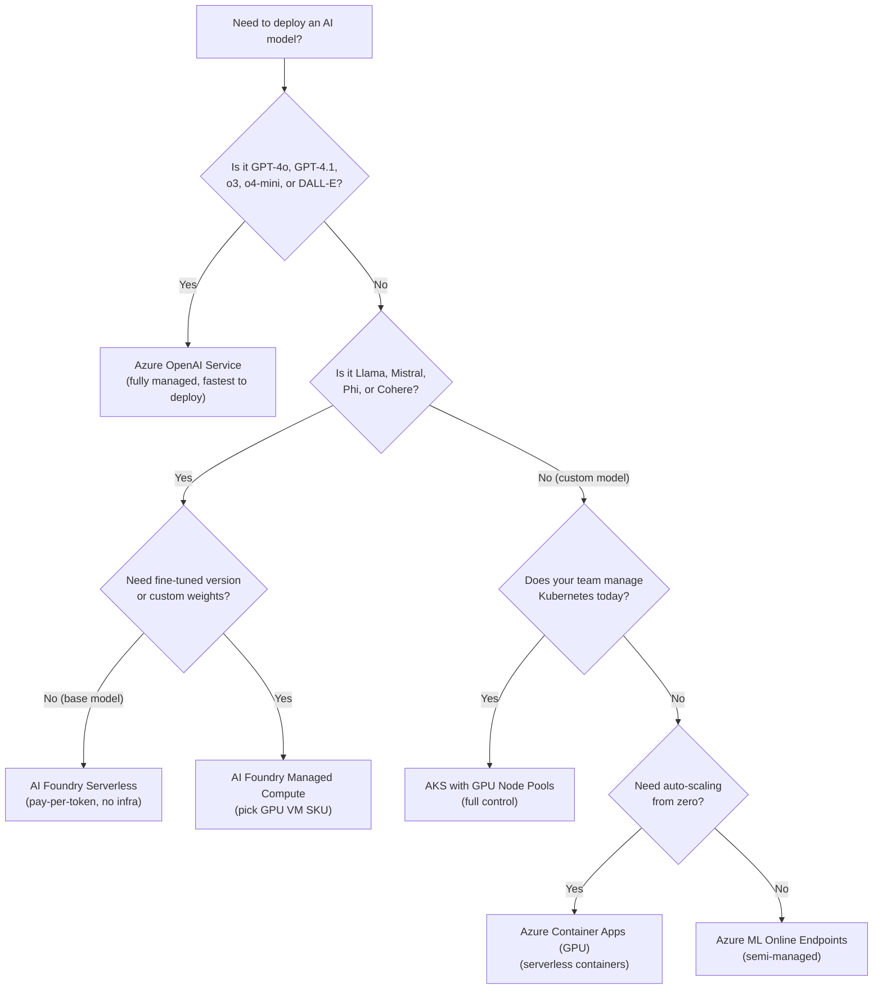
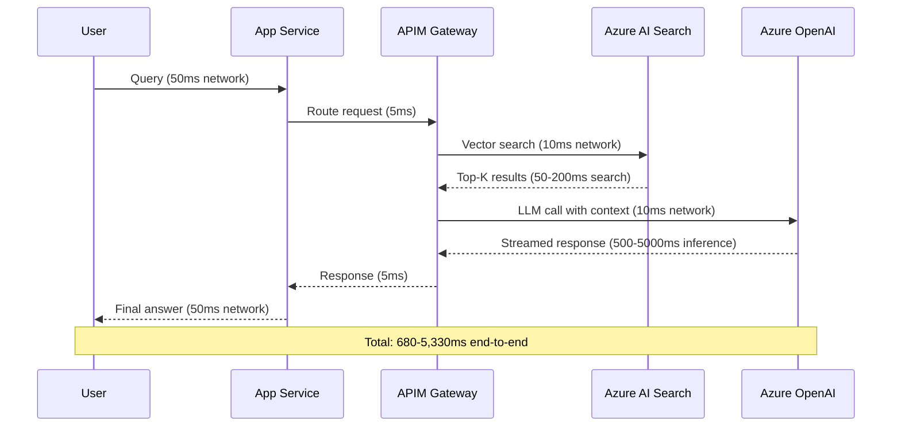
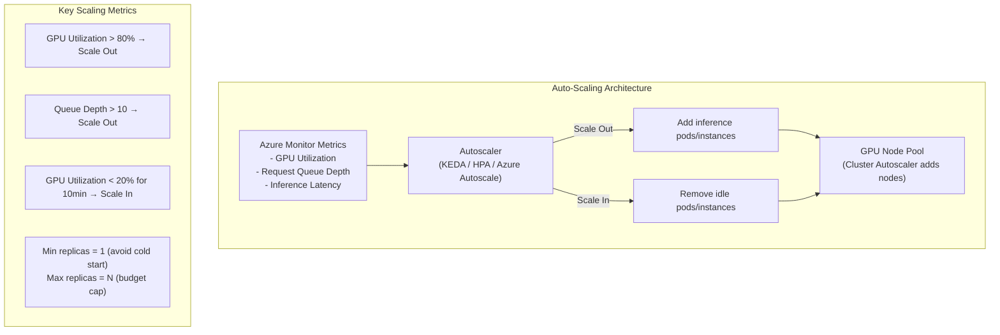
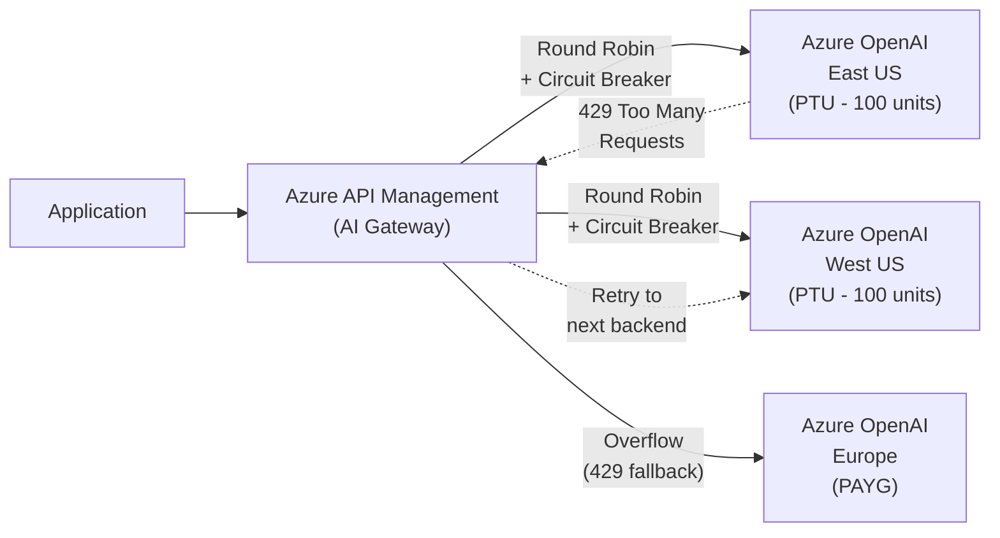
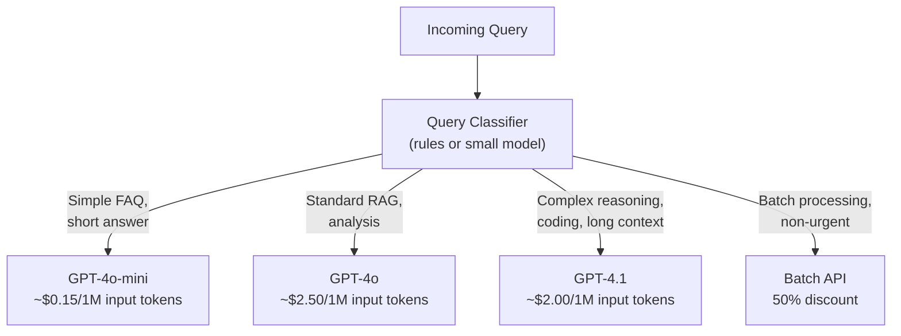
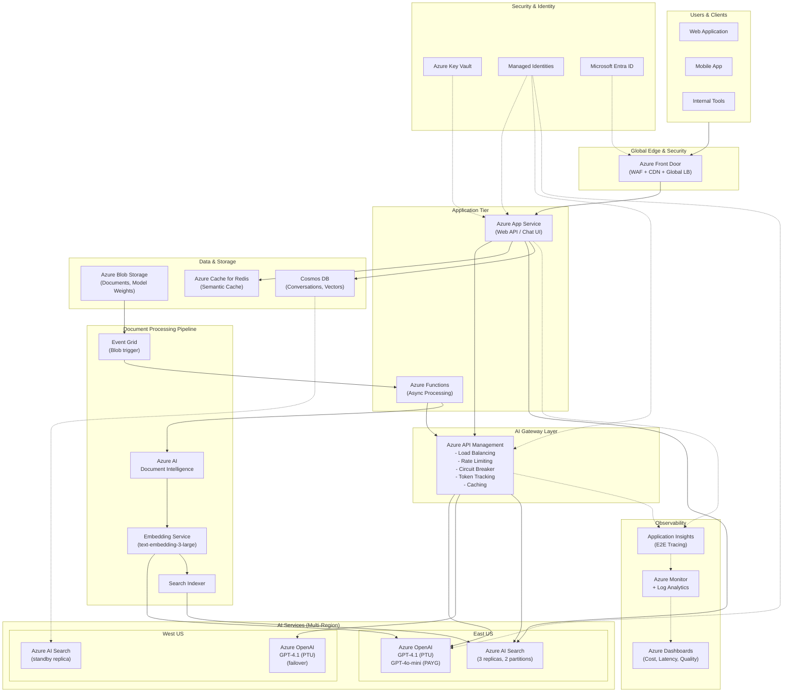

# Module 9: AI Infrastructure for Architects — GPU, Scaling & Production

> **Duration:** 60-90 minutes | **Level:** Strategic
> **Audience:** Cloud Architects, Platform Engineers, Infrastructure Engineers
> **Last Updated:** March 2026

---

## 9.1 The AI Compute Stack

Everything you have learned in Modules 1 through 8 — embeddings, vector search, RAG pipelines, fine-tuning, prompt engineering — eventually runs on infrastructure. This module connects the dots between **what AI does** and **what AI needs** from a platform perspective.

### Why AI Needs Different Infrastructure

Traditional enterprise applications and AI workloads have fundamentally different compute profiles. Understanding this gap is the first step to making sound infrastructure decisions.

| Dimension | Traditional App (e.g., Web API) | AI Inference Workload | AI Training Workload |
|---|---|---|---|
| **Compute type** | CPU-bound (sequential logic) | GPU-bound (parallel matrix ops) | GPU-bound (massive parallelism) |
| **Memory profile** | Low-moderate (MB-GB) | High (GB of VRAM per model) | Very high (hundreds of GB VRAM) |
| **Scaling pattern** | Horizontal scale-out, stateless | Complex (model in memory, stateful) | Distributed multi-node |
| **Latency profile** | Sub-100ms typical | 200ms-30s (depends on tokens) | Hours to weeks |
| **Network needs** | Standard throughput | Moderate (API calls, model loading) | InfiniBand / RDMA for multi-node |
| **Storage needs** | Database-centric | Model weight files (GB-TB) | Training datasets (TB-PB) |
| **Cost driver** | CPU hours, memory | GPU hours, VRAM, tokens consumed | GPU hours at massive scale |
| **Failure mode** | Request fails, retry | Model hallucination, timeout, OOM | Training divergence, checkpoint loss |

:::note Key Insight
The single biggest mistake architects make is treating AI workloads like traditional web services. AI workloads are **memory-bound, not CPU-bound**. Scaling decisions revolve around GPU memory (VRAM), not CPU cores.
:::

### CPU vs GPU vs TPU vs NPU

| Processor | Architecture | Strengths | AI Use Case | Azure Availability |
|---|---|---|---|---|
| **CPU** | Few powerful cores, sequential | General-purpose logic, low-parallelism tasks | Small model inference, preprocessing, orchestration | Every Azure VM |
| **GPU** | Thousands of small cores, massively parallel | Matrix multiplication, parallel processing | Model training, inference for medium-large models | N-series VMs, AKS GPU pools |
| **TPU** | Google custom ASIC for tensor operations | Optimized for TensorFlow workloads | Training at scale (Google Cloud only) | Not available on Azure |
| **NPU** | On-device neural processing unit | Low-power, edge inference | On-device AI (phones, laptops, IoT) | Azure Percept (retired), edge devices |
| **FPGA** | Field-programmable gate array | Custom low-latency inference | Specialized inference acceleration | Azure FPGA (limited availability) |

### What GPUs Actually Do for AI

At its core, every neural network — from a simple classifier to GPT-4o — performs the same fundamental operation billions of times: **matrix multiplication**.

```
Output = Input × Weights + Bias
```

A single transformer layer in a large language model performs multiple matrix multiplications:

1. **Query, Key, Value projections** — three separate matrix multiplications
2. **Attention score computation** — Q times K-transpose
3. **Attention-weighted sum** — scores times V
4. **Feed-forward network** — two more large matrix multiplications

A model like GPT-4o with ~200 billion parameters (estimated) performs these operations across hundreds of layers, for every token generated. A CPU processes these sequentially. A GPU like the NVIDIA H100 has **16,896 CUDA cores** that execute these matrix operations **in parallel**, delivering 100-1000x speedup over CPUs for this type of workload.



### GPU Programming Frameworks

As an architect, you will not write CUDA code — but you will hear these terms in vendor discussions and capacity planning conversations.

| Framework | Vendor | What It Does | Why You Care |
|---|---|---|---|
| **CUDA** | NVIDIA | GPU programming platform, the de facto standard | 95%+ of AI frameworks depend on it; locks you to NVIDIA GPUs |
| **cuDNN** | NVIDIA | Optimized deep learning primitives on CUDA | Accelerates training and inference on NVIDIA hardware |
| **TensorRT** | NVIDIA | Model optimization and inference engine | Converts models to optimized formats for production inference |
| **ROCm** | AMD | Open-source GPU compute platform | Alternative to CUDA for AMD GPUs (MI300X); growing ecosystem |
| **oneAPI** | Intel | Unified programming model across CPU/GPU/FPGA | Intel GPU support, less mature for AI than CUDA |
| **ONNX Runtime** | Microsoft | Cross-platform model inference engine | Hardware-agnostic inference; integrates with Azure ML |

:::tip Architect Takeaway
NVIDIA dominates AI infrastructure because of the CUDA ecosystem, not just hardware specs. When evaluating AMD alternatives (which can be cheaper), verify that your model serving stack supports ROCm. Most production inference servers (vLLM, TensorRT-LLM) have strong CUDA support; ROCm support varies.
:::

---

## 9.2 Azure GPU Compute Options

Azure offers GPU compute across a spectrum from fully self-managed VMs to fully managed services. Your choice depends on control requirements, operational maturity, and cost sensitivity.

### N-Series VMs (IaaS — Full Control)

These are standard Azure VMs with attached GPUs. You manage the OS, drivers, CUDA toolkit, and model serving software.

#### NC-Series — Training and Inference

| VM SKU | GPU | GPU Count | VRAM per GPU | Total VRAM | vCPUs | RAM | Use Case | Est. Price/hr (Pay-As-You-Go) |
|---|---|---|---|---|---|---|---|---|
| NC6s_v3 | NVIDIA V100 | 1 | 16 GB | 16 GB | 6 | 112 GB | Dev/test inference | ~$3.06 |
| NC24s_v3 | NVIDIA V100 | 4 | 16 GB | 64 GB | 24 | 448 GB | Multi-GPU training | ~$12.24 |
| NC24ads_A100_v4 | NVIDIA A100 | 1 | 80 GB | 80 GB | 24 | 220 GB | Large model inference | ~$3.67 |
| NC48ads_A100_v4 | NVIDIA A100 | 2 | 80 GB | 160 GB | 48 | 440 GB | Training + multi-GPU inference | ~$7.35 |
| NC96ads_A100_v4 | NVIDIA A100 | 4 | 80 GB | 320 GB | 96 | 880 GB | Large-scale training | ~$14.69 |

#### ND-Series — Large-Scale Training

| VM SKU | GPU | GPU Count | VRAM per GPU | Total VRAM | Interconnect | Use Case | Est. Price/hr |
|---|---|---|---|---|---|---|---|
| ND96asr_v4 | NVIDIA A100 | 8 | 40 GB | 320 GB | InfiniBand | Distributed training | ~$27.20 |
| ND96amsr_A100_v4 | NVIDIA A100 | 8 | 80 GB | 640 GB | InfiniBand | Large model training | ~$32.77 |
| ND96isr_H100_v5 | NVIDIA H100 | 8 | 80 GB | 640 GB | InfiniBand 400Gb/s | Frontier model training | ~$98.32 |
| ND96isr_H200_v5 | NVIDIA H200 | 8 | 141 GB | 1,128 GB | InfiniBand 400Gb/s | Largest model training | Contact Microsoft |
| ND96is_MI300X_v5 | AMD MI300X | 8 | 192 GB | 1,536 GB | InfiniBand | AMD-based training | ~$75.00 |

#### NV-Series — Visualization

| VM SKU | GPU | Use Case |
|---|---|---|
| NV-series v3 | NVIDIA Tesla M60 | Remote visualization, VDI |
| NVads A10 v5 | NVIDIA A10 | Graphics + light inference |

:::warning Regional Availability
GPU VMs are NOT available in every Azure region. NC A100 and ND H100 SKUs are concentrated in specific regions (East US, West US 2/3, South Central US, West Europe, Sweden Central). Always verify availability before designing your architecture. Use `az vm list-skus --location <region> --resource-type virtualMachines --query "[?contains(name,'NC')]"` to check.
:::

### Azure Managed GPU Compute

| Service | GPU Management | Scaling | Best For |
|---|---|---|---|
| **Azure OpenAI Service** | Fully managed (no GPU visibility) | PTU or PAYG rate limits | GPT-4o, GPT-4.1, o3, o4-mini inference |
| **Azure AI Foundry Serverless** | Fully managed | Auto-scaled | Llama, Mistral, Phi, Cohere models |
| **Azure ML Managed Endpoints** | Semi-managed (pick VM SKU) | Manual or auto-scale | Custom models, BYOM |
| **Azure ML Compute Clusters** | Semi-managed (pick VM SKU) | Auto-scale 0 to N nodes | Training jobs, batch inference |

### AKS with GPU Node Pools

For teams with Kubernetes expertise, AKS GPU node pools offer the best balance of control and operational efficiency.

**Architecture:**



**Key configuration for GPU node pools:**

- Install the **NVIDIA device plugin** as a DaemonSet — it exposes GPU resources (`nvidia.com/gpu`) to the Kubernetes scheduler
- Use `nodeSelector` or `nodeAffinity` to pin GPU workloads to GPU nodes
- Set resource requests: `nvidia.com/gpu: 1` (or more) per pod
- Enable **cluster autoscaler** on GPU node pools (scale from 0 to save costs)

**GPU Sharing Strategies on AKS:**

| Strategy | How It Works | Use Case | Trade-off |
|---|---|---|---|
| **Dedicated GPU** | 1 pod = 1 full GPU | Large models, predictable latency | Expensive, low utilization |
| **MIG (Multi-Instance GPU)** | Partition an A100/H100 into isolated slices | Multiple small models on one GPU | Hardware isolation, fixed partitions |
| **Time-Slicing** | Multiple pods share one GPU via time-division | Dev/test, light inference workloads | No memory isolation, unpredictable latency |
| **MPS (Multi-Process Service)** | CUDA-level multi-process sharing | Multiple inference processes | Better than time-slicing, still shared |

---

## 9.3 GPU Memory (VRAM) — The Real Bottleneck

VRAM — Video Random Access Memory on the GPU — is the single most important resource for AI workloads. It determines **which models you can run**, **how many concurrent requests you can serve**, and **how fast inference completes**.

### Why VRAM Matters More Than Compute

When you load a model for inference, the entire model weights must reside in VRAM. If the model does not fit, it simply **will not run**. There is no graceful degradation — the process crashes with an out-of-memory (OOM) error.

### Model Size to VRAM Requirements

The VRAM required depends on the model parameter count and the numerical precision (quantization level) used.

| Model | Parameters | FP32 (full) | FP16 / BF16 | INT8 | INT4 | Minimum GPU |
|---|---|---|---|---|---|---|
| Phi-3 Mini | 3.8B | 15.2 GB | 7.6 GB | 3.8 GB | 1.9 GB | 1x A10 (INT8) |
| Llama 3.1 8B | 8B | 32 GB | 16 GB | 8 GB | 4 GB | 1x A100 40GB (FP16) |
| Mistral 7B | 7.3B | 29.2 GB | 14.6 GB | 7.3 GB | 3.7 GB | 1x A10 24GB (INT4) |
| Llama 3.1 70B | 70B | 280 GB | 140 GB | 70 GB | 35 GB | 2x A100 80GB (FP16) |
| Llama 3.1 405B | 405B | 1,620 GB | 810 GB | 405 GB | 203 GB | 8x H100 80GB (INT4) |
| GPT-4 (estimated) | ~1.8T (MoE) | N/A | ~900 GB active | ~450 GB | N/A | Multi-node H100 cluster |

:::note The Rule of Thumb
**FP16 VRAM (GB) = Parameters (B) x 2**. A 7B parameter model needs approximately 14 GB of VRAM in FP16 precision. Each quantization step roughly halves the requirement: INT8 = Parameters x 1, INT4 = Parameters x 0.5.
:::

### But Wait — You Need More Than Just Model Weights

VRAM usage during inference includes:

| Component | VRAM Usage | Notes |
|---|---|---|
| **Model weights** | Fixed (see table above) | Loaded once, stays in memory |
| **KV cache** | Variable, grows with context length and batch size | The hidden VRAM consumer |
| **Activation memory** | Small during inference | Larger during training |
| **CUDA/framework overhead** | 500 MB - 2 GB | PyTorch, CUDA context |

The **KV cache** is particularly important. For each token in the context window, the model stores key-value pairs across all attention layers. For a 70B model with 80 layers and a 128K context window, the KV cache alone can consume **40+ GB of VRAM per concurrent request with a long context**.

### Multi-GPU Setups

When a model does not fit on a single GPU, you must split it across multiple GPUs.

| Strategy | How It Works | When to Use |
|---|---|---|
| **Tensor Parallelism (TP)** | Split individual layers across GPUs; each GPU holds a slice of every layer | Single-node multi-GPU (fast NVLink/NVSwitch interconnect required) |
| **Pipeline Parallelism (PP)** | Assign different layers to different GPUs; data flows through sequentially | Multi-node setups (tolerates slower interconnect) |
| **TP + PP combined** | TP within a node, PP across nodes | Very large models across multiple nodes |
| **Expert Parallelism** | For MoE models, place different experts on different GPUs | Mixture-of-Experts architectures |



---

## 9.4 Model Serving Infrastructure

Choosing the right inference server is critical for production AI workloads. The server determines throughput, latency, and cost efficiency.

### Inference Servers Compared

| Server | Vendor | Key Feature | Best For | Azure Integration |
|---|---|---|---|---|
| **vLLM** | UC Berkeley / Community | PagedAttention, continuous batching | High-throughput LLM serving | AKS, Azure ML |
| **TensorRT-LLM** | NVIDIA | Maximum NVIDIA GPU utilization | Lowest latency on NVIDIA hardware | AKS, Azure ML |
| **Triton Inference Server** | NVIDIA | Multi-model, multi-framework serving | Serving multiple model types together | AKS, Azure ML |
| **Ollama** | Community | Simple local model running | Dev/test, single-user | Local dev, small VMs |
| **SGLang** | Stanford / Community | Structured generation, RadixAttention | Structured output workloads | AKS |
| **Azure ML Online Endpoints** | Microsoft | Managed deployment + scaling | Production with minimal ops | Native Azure |

### Batching Strategies

Batching is how inference servers process multiple requests simultaneously to maximize GPU utilization.

| Strategy | How It Works | Throughput | Latency | Implementation |
|---|---|---|---|---|
| **No batching** | One request at a time | Very low (GPU idle 80%+) | Lowest per-request | Naive implementation |
| **Static batching** | Collect N requests, process together | Moderate | High (wait for batch to fill) | Basic servers |
| **Dynamic batching** | Batch requests within a time window | Good | Moderate (configurable wait) | Triton |
| **Continuous batching** | Insert new requests into running batch as slots free | Excellent | Low (no waiting) | vLLM, TensorRT-LLM |

### PagedAttention — Why It Matters

Traditional inference servers allocate a contiguous block of VRAM for each request's KV cache based on the **maximum possible** sequence length. This wastes enormous amounts of memory because most requests use far less than the maximum context.

**PagedAttention** (introduced by vLLM) borrows the concept of virtual memory paging from operating systems:

- KV cache is stored in non-contiguous **pages** (blocks)
- Pages are allocated on demand as the sequence grows
- Freed pages are returned to a shared pool
- Result: **2-4x more concurrent requests** on the same hardware

### Speculative Decoding

A technique where a smaller, faster "draft" model generates candidate tokens, and the larger "target" model verifies them in a single forward pass. This can reduce latency by 2-3x for the target model with minimal quality loss.

### Model Serving on AKS — Architecture



---

## 9.5 Azure AI Infrastructure Services

Azure provides multiple levels of abstraction for deploying AI models. The right choice depends on your team's operational maturity, performance needs, and cost constraints.

### Service Comparison

| Service | What You Manage | What Azure Manages | Models Available | Scaling | Cost Model |
|---|---|---|---|---|---|
| **Azure OpenAI** | Nothing (API calls only) | Everything (infra, model, scaling) | GPT-4o, GPT-4.1, o3, o4-mini, DALL-E, Whisper | PTU or PAYG rate limits | Per-token or per-PTU/hr |
| **AI Foundry Serverless** | Nothing (API calls only) | Everything | Llama, Mistral, Phi, Cohere, Jamba | Auto-scaled | Per-token |
| **AI Foundry Managed Compute** | Model selection, config | Infrastructure, deployment | Any supported model | Manual + auto | Per-VM-hour |
| **Azure ML Online Endpoints** | Model, container, config | VM provisioning, load balancing | Any model (BYOM) | Manual + auto | Per-VM-hour |
| **Azure Container Apps (GPU)** | Container, model serving stack | Infrastructure, scaling | Any (containerized) | Auto (KEDA) | Per-second GPU usage |
| **AKS with GPU** | Everything (K8s + model stack) | VM provisioning | Any | Full control | Per-VM-hour |

### Decision Tree: When to Use Which



:::tip Architect Recommendation
For most enterprise scenarios, start with **Azure OpenAI Service** for GPT-family models and **AI Foundry Serverless** for open-source models. Move to self-managed infrastructure (AKS + vLLM) only when you need: (1) cost optimization at very high volume, (2) specific model versions/configurations not available as managed services, or (3) data residency controls beyond what managed services offer.
:::

---

## 9.6 Networking for AI Workloads

AI workloads introduce networking requirements that many traditional architects have not encountered. From InfiniBand for distributed training to private endpoints for inference services, networking decisions can make or break your AI platform.

### Bandwidth Requirements

| Operation | Data Volume | Latency Sensitivity | Network Requirement |
|---|---|---|---|
| **Model loading** (cold start) | 1 GB - 800 GB | Tolerant (startup only) | High throughput (Azure Blob → VM) |
| **Real-time inference** | KB per request | Very sensitive (<100ms network) | Low latency, private endpoint |
| **Batch inference** | GB of input data | Tolerant | High throughput |
| **Distributed training** (gradient sync) | GB per step, continuously | Extremely sensitive | InfiniBand / RDMA required |
| **RAG retrieval** (search → LLM) | KB per query | Sensitive (adds to TTFT) | Low latency between services |

### InfiniBand for Distributed Training

When training models across multiple GPU nodes, each node must synchronize gradients after every training step. Standard Ethernet (even 100 Gbps) introduces unacceptable latency. Azure ND-series VMs include **InfiniBand** networking:

- **ND A100 v4**: 200 Gbps HDR InfiniBand
- **ND H100 v5**: 400 Gbps NDR InfiniBand (3.2 Tbps bisection bandwidth across 8 GPUs)
- Enables **RDMA** (Remote Direct Memory Access) — GPU-to-GPU communication bypassing the CPU and OS kernel entirely
- Required for efficient multi-node training with frameworks like DeepSpeed, Megatron-LM

### Private Endpoints for AI Services

Every AI service on Azure supports private endpoints. For enterprise workloads, **always** deploy AI services on private endpoints.

| Service | Private Endpoint Support | DNS Zone |
|---|---|---|
| Azure OpenAI | Yes | `privatelink.openai.azure.com` |
| Azure AI Search | Yes | `privatelink.search.windows.net` |
| Azure AI Foundry | Yes | `privatelink.api.azureml.ms` |
| Azure ML Workspace | Yes | `privatelink.api.azureml.ms` |
| Azure Cosmos DB | Yes | `privatelink.documents.azure.com` |
| Azure Blob Storage | Yes | `privatelink.blob.core.windows.net` |

### Latency Chain for RAG Applications

In a RAG-based application, the end-to-end latency is the **sum** of every hop in the chain. Network latency adds up quickly.



**Latency optimization strategies:**
- Co-locate services in the same Azure region (eliminates cross-region latency)
- Use private endpoints (bypasses public internet routing)
- Enable streaming responses (user sees first token faster)
- Use APIM connection pooling (reduces TLS handshake overhead)
- Consider Azure Front Door for global user distribution

### VNET Integration for AI Services

| Service | VNET Integration Method | Outbound Control |
|---|---|---|
| Azure OpenAI | Private endpoint + disable public access | NSG on subnet |
| Azure AI Search | Private endpoint + shared private link | Service-managed |
| App Service / Functions | VNET integration (outbound) + private endpoint (inbound) | NSG + Route Table |
| AKS | CNI networking, private cluster | NSG + Azure Firewall |
| Azure ML | Managed VNET (workspace-level) or custom VNET | NSG + UDR |

---

## 9.7 Storage for AI Workloads

AI workloads interact with storage differently than traditional applications. Model weights, training datasets, vector indexes, and caching layers each have distinct requirements.

### Storage Tiers for AI

| Data Type | Volume | Access Pattern | Recommended Storage | Throughput Need |
|---|---|---|---|---|
| **Model weights** | 1 GB - 800 GB per model | Read-heavy, loaded at cold start | Azure Blob (Hot tier) | High (fast cold starts) |
| **Training datasets** | GB to PB | Sequential read during training | ADLS Gen2 | Very high (parallel reads) |
| **Vector indexes** | GB to TB | Random read, low-latency queries | Azure AI Search / Cosmos DB | Low latency (<10ms) |
| **Prompt/response cache** | MB to GB | High-frequency read/write | Azure Cache for Redis | Sub-millisecond |
| **Conversation history** | MB to GB per user | Read/write per session | Cosmos DB | Low latency |
| **Fine-tuning data** | MB to GB (JSONL files) | Read once during training | Azure Blob | Moderate |
| **Document ingestion** | GB to TB (PDFs, docs) | Write-once, read during indexing | Azure Blob + AI Document Intelligence | Moderate |

### Model Weight Storage Best Practices

- Store model weights in **Azure Blob Storage** (Hot tier) with **LRS** or **ZRS** redundancy
- Use **managed identity** for access — never embed storage keys in containers
- For AKS workloads, consider **Azure Blob CSI driver** to mount weights as a volume
- For Azure ML, the model registry handles storage automatically
- Pre-download weights into the container image for fastest cold starts (tradeoff: larger image size)

### Caching for AI Workloads

| Cache Type | What It Caches | Tool | Savings |
|---|---|---|---|
| **Semantic cache** | Similar prompts → cached LLM responses | Azure Cache for Redis + embedding similarity | 50-90% cost reduction for repeated queries |
| **Retrieval cache** | Search query → cached search results | Azure Cache for Redis | Reduced AI Search costs, lower latency |
| **Embedding cache** | Text → cached embedding vector | Azure Cache for Redis | Avoid re-embedding identical text |
| **KV cache (model-level)** | Prefix tokens → cached internal state | vLLM prefix caching | 2-5x throughput for shared-prefix workloads |

---

## 9.8 Scaling AI Workloads

Scaling AI workloads is fundamentally different from scaling traditional web applications. You cannot simply "add more instances" without understanding the memory, compute, and cost implications.

### Vertical vs Horizontal Scaling

| Approach | How | When | Limitation |
|---|---|---|---|
| **Vertical** | Bigger GPU VM (A10 → A100 → H100) | Model needs more VRAM, need lower latency | VM SKU ceiling, single-point-of-failure |
| **Horizontal** | More instances of same VM | Need more throughput (requests/sec) | Model must fit on each instance, load balancing complexity |
| **Distributed** | Multi-GPU across nodes | Model too large for single node | InfiniBand required, complex orchestration |

### Azure OpenAI Scaling

Azure OpenAI uses a unique scaling model based on **rate limits** (PAYG) or **provisioned throughput units** (PTU).

| Scaling Model | How It Works | When to Use | Cost |
|---|---|---|---|
| **PAYG (Pay-As-You-Go)** | Per-token billing, shared capacity, rate-limited (TPM/RPM) | Development, variable/unpredictable workloads | ~$2.50/1M input tokens (GPT-4o) |
| **PTU (Provisioned Throughput)** | Reserved capacity, guaranteed throughput, monthly commitment | Production with predictable, high-volume workloads | ~$2/PTU/hr (model-dependent) |
| **PTU-M (Managed)** | Azure-managed PTU with auto-scaling | Production, want managed experience | Premium over standard PTU |

**PTU Sizing Rule of Thumb:** 1 PTU roughly corresponds to approximately 6 requests per minute for GPT-4o with ~500 input + ~200 output tokens. Actual capacity depends heavily on prompt/completion lengths. Always use the **Azure OpenAI capacity calculator** for accurate sizing.

### AI Search Scaling

| Dimension | What It Scales | How | Impact |
|---|---|---|---|
| **Replicas** | Query throughput (QPS) and availability | Add replicas (1-12, or more at higher tiers) | Each replica is a full copy of all indexes |
| **Partitions** | Data capacity (index size) | Add partitions (1, 2, 3, 4, 6, or 12) | Data is sharded across partitions |
| **Tier** | Overall limits (index count, size, features) | Upgrade SKU (Free → Basic → S1 → S2 → S3 → L1 → L2) | Higher tiers unlock larger indexes and more features |

:::note Search SLA
Azure AI Search requires **2+ replicas** for read SLA (99.9%) and **3+ replicas** for read/write SLA (99.9%). The default single-replica deployment has **no SLA**.
:::

### Auto-Scaling Patterns for Inference



### Queue-Based Scaling for Async Inference

For workloads that can tolerate latency (document processing, batch analysis, content generation), use a queue-based pattern to decouple request ingestion from processing.

| Component | Role | Azure Service |
|---|---|---|
| **Queue** | Buffer incoming requests | Azure Service Bus / Storage Queue |
| **Workers** | Pull from queue, call model, store results | Azure Functions / AKS pods |
| **Results store** | Store completed inferences | Cosmos DB / Blob Storage |
| **Scaler** | Scale workers based on queue depth | KEDA (AKS) / Azure Functions auto-scale |

### Load Balancing Across Model Endpoints with APIM

APIM is the recommended AI Gateway for load balancing across multiple Azure OpenAI or model endpoints. This connects directly to Module 5 (Azure OpenAI) and is a critical architectural pattern.



---

## 9.9 High Availability for AI

AI services require the same HA patterns as any critical system, with additional considerations around model-specific behavior and capacity allocation.

### Multi-Region Azure OpenAI Deployment

| Pattern | Description | Complexity | Availability |
|---|---|---|---|
| **Single region, PAYG** | One deployment in one region | Low | Subject to throttling (429) |
| **Single region, PTU** | Reserved capacity in one region | Low-Medium | No throttling, single-region risk |
| **Multi-region, APIM load balanced** | PTU in 2+ regions, APIM routes traffic | Medium | High — survive region outage |
| **Multi-region, PTU + PAYG overflow** | PTU primary, PAYG in other region as overflow | Medium | Very high — handles spikes + outages |
| **Multi-region, multi-model fallback** | GPT-4o primary → GPT-4.1-mini fallback → open-source fallback | High | Maximum — survive service-level issues |

### APIM as AI Gateway — HA Configuration

APIM provides built-in capabilities that make it ideal as an AI Gateway:

- **Backend pool**: Define multiple Azure OpenAI endpoints as a backend pool
- **Load balancing**: Round-robin, weighted, or priority-based routing
- **Circuit breaker**: Automatically stop routing to unhealthy backends
- **Retry policy**: On 429 (rate limit) or 503, retry to next backend
- **Rate limiting**: Enforce per-subscription or per-application token limits
- **Caching**: Cache responses for identical prompts
- **Monitoring**: Track per-backend latency, error rates, token consumption

### Fallback Model Strategies

| Priority | Model | Endpoint | Strategy |
|---|---|---|---|
| Primary | GPT-4.1 | Azure OpenAI (PTU, East US) | All traffic goes here first |
| Secondary | GPT-4.1 | Azure OpenAI (PTU, West US) | On 429/503 from primary |
| Tertiary | GPT-4o-mini | Azure OpenAI (PAYG, Europe) | Cheaper model, acceptable quality |
| Emergency | Llama 3.1 70B | AKS self-hosted (any region) | Full control, no external dependency |

### RPO/RTO for AI Services

| Service | RPO | RTO | HA Mechanism |
|---|---|---|---|
| Azure OpenAI | 0 (stateless service) | Minutes (APIM failover) | Multi-region deployment |
| Azure AI Search | Near-0 (replicated indexes) | Minutes (replica failover) | Multi-replica, or multi-region with index sync |
| Cosmos DB (vector store) | Seconds (multi-region writes) | Automatic | Multi-region, automatic failover |
| Model weights (Blob) | 0 (GRS/GZRS) | Minutes | Geo-redundant storage |
| Conversation history | Depends on store | Depends on store | Cosmos DB multi-region |

---

## 9.10 Cost Optimization for AI Infrastructure

AI infrastructure costs can escalate rapidly. A single H100 node costs ~$98/hour. A 10-node training cluster runs ~$24,000/day. Production inference can consume $10,000-$100,000+/month in Azure OpenAI tokens alone. Cost optimization is not optional — it is a core architectural responsibility.

### Azure OpenAI: PTU vs PAYG Break-Even

| Dimension | PAYG | PTU |
|---|---|---|
| **Billing** | Per token consumed | Per unit per hour (monthly commitment) |
| **Best for** | Variable, unpredictable workloads | Steady, high-volume production |
| **Availability** | Shared capacity (may get 429s) | Guaranteed, reserved capacity |
| **Cost efficiency** | Better at low volume | Better at high, consistent volume |

**Break-even analysis (approximate, GPT-4o):**
- 1 PTU costs approximately $2/hour = ~$1,460/month
- 1 PTU supports approximately 6 RPM (with ~700 total tokens per request)
- At consistent usage above ~60% utilization, PTU becomes cheaper than PAYG
- Below ~40% utilization, PAYG is more cost-effective

:::warning Always Measure First
Deploy on PAYG first to understand your actual usage patterns (RPM, TPM, peak vs average). Use 2-4 weeks of production data to model PTU sizing. Premature PTU commitment is a common cost mistake — you pay whether you use it or not.
:::

### Cost Optimization Levers

| Lever | Savings Potential | Effort | Trade-off |
|---|---|---|---|
| **Model routing** (use cheapest capable model) | 30-80% | Medium | Need to validate quality per model |
| **Semantic caching** (cache similar prompts) | 50-90% for repeated queries | Medium | Stale responses for dynamic data |
| **Prompt compression** (shorter prompts) | 10-40% | Low | May reduce quality if over-compressed |
| **Output token limits** (max_tokens) | 10-30% | Low | May truncate needed output |
| **Batch inference** (async, Azure Batch API) | 50% | Low | 24-hour SLA, not real-time |
| **Quantized models** (INT8/INT4 for self-hosted) | 50-75% GPU cost | Medium | Minor quality degradation |
| **Spot instances** (for training / batch) | 60-90% | Medium | Can be evicted mid-job |
| **Reserved VM instances** (1-year or 3-year) | 30-60% | Low | Commitment, less flexibility |
| **Auto-scaling from zero** (AKS GPU nodepool) | Variable (no idle cost) | Medium | Cold start latency (2-10 min for GPU nodes) |
| **Streaming** (stop early if user cancels) | Variable | Low | Engineering for cancellation handling |

### Model Routing for Cost Optimization

Not every query requires GPT-4.1. A smart routing layer can classify queries and route to the cheapest model that can handle them.



---

## 9.11 Observability & Monitoring

You cannot manage what you cannot measure. AI workloads introduce new metrics that traditional monitoring does not cover: token consumption, time-to-first-token, model quality, and hallucination rates.

### Key Metrics for AI Workloads

| Metric | What It Measures | Target | Tool |
|---|---|---|---|
| **TTFT** (Time to First Token) | Latency before first token appears | <1 second | Application Insights |
| **TPS** (Tokens Per Second) | Generation speed | 30-100 TPS | Azure OpenAI diagnostics |
| **E2E Latency** | Total time from request to complete response | <5s for interactive | Application Insights |
| **Token consumption** (input + output) | Cost driver | Within budget | Azure Monitor |
| **429 rate** | Rate limit rejections | <1% in production | Azure Monitor |
| **Error rate** (4xx, 5xx) | Service reliability | <0.1% | Azure Monitor |
| **GPU utilization** | Compute efficiency (self-hosted) | 60-85% sustained | NVIDIA DCGM / Azure Monitor |
| **VRAM utilization** | Memory pressure (self-hosted) | <90% | NVIDIA DCGM |
| **Queue depth** | Backlog of pending requests | Near zero for real-time | Custom metric |
| **Groundedness score** | Factual accuracy of responses | >4.0/5.0 | Azure AI Foundry evaluation |

### Azure Monitor for Azure OpenAI

Azure OpenAI emits diagnostic logs and metrics that should be sent to a Log Analytics workspace.

**Enable diagnostic settings:**
- **Audit logs**: Track who called the API, when, from where
- **Request/Response logs**: Log prompts and completions (be cautious with PII)
- **Metrics**: Token usage, latency, HTTP status codes

### KQL Queries for Azure OpenAI Monitoring

**Token consumption by deployment (last 24 hours):**
```kql
AzureDiagnostics
| where ResourceProvider == "MICROSOFT.COGNITIVESERVICES"
| where Category == "RequestResponse"
| where TimeGenerated > ago(24h)
| extend model = tostring(properties_s)
| summarize
    TotalRequests = count(),
    TotalPromptTokens = sum(toint(properties_promptTokens_d)),
    TotalCompletionTokens = sum(toint(properties_completionTokens_d))
    by bin(TimeGenerated, 1h), model
| order by TimeGenerated desc
```

**429 Rate Limit Tracking:**
```kql
AzureDiagnostics
| where ResourceProvider == "MICROSOFT.COGNITIVESERVICES"
| where ResultSignature == "429"
| summarize ThrottledRequests = count() by bin(TimeGenerated, 5m)
| render timechart
```

**P95 Latency by Model:**
```kql
AzureDiagnostics
| where ResourceProvider == "MICROSOFT.COGNITIVESERVICES"
| where Category == "RequestResponse"
| extend latency = DurationMs
| summarize P50 = percentile(latency, 50),
            P95 = percentile(latency, 95),
            P99 = percentile(latency, 99)
    by bin(TimeGenerated, 1h)
| render timechart
```

### Application Insights Integration

For end-to-end tracing of AI application requests, use Application Insights with the Azure Monitor OpenTelemetry SDK.

| What to Trace | How | Correlation |
|---|---|---|
| User request → App Service | Application Insights auto-instrumentation | Operation ID |
| App Service → Azure AI Search | Dependency tracking | Same Operation ID |
| App Service → Azure OpenAI | Dependency tracking | Same Operation ID |
| Token usage per request | Custom metrics via TelemetryClient | Same Operation ID |
| Model quality scores | Custom events | Per-request evaluation |

This gives you a **single correlated trace** from user request through search retrieval to LLM inference and back, enabling root-cause analysis of slow or poor-quality responses.

---

## 9.12 Security for AI Infrastructure

AI infrastructure introduces new attack surfaces: prompt injection, model theft, data exfiltration through model responses, and abuse of expensive GPU resources. Security must be layered across identity, network, data, and application tiers.

### Identity and Access Control

| Principle | Implementation | Azure Service |
|---|---|---|
| **Managed Identity** for service-to-service auth | App Service / AKS → Azure OpenAI via MI | Managed Identity + RBAC |
| **No API keys in code** | Store keys in Key Vault, prefer MI over keys | Azure Key Vault |
| **Least-privilege RBAC** | `Cognitive Services OpenAI User` for inference, `Contributor` for management | Azure RBAC |
| **Per-application identity** | Each app gets its own MI, audited separately | User-Assigned Managed Identity |
| **Human access control** | JIT access for production AI resources | PIM (Privileged Identity Management) |

### Network Security

| Layer | Control | Configuration |
|---|---|---|
| **AI service exposure** | Private endpoints, disable public access | PE + `publicNetworkAccess: disabled` |
| **Subnet isolation** | Dedicated subnets for AI workloads | NSG rules: deny all inbound except from app subnet |
| **DNS resolution** | Private DNS zones for PE resolution | Azure Private DNS Zones linked to VNET |
| **Egress control** | Control what AI services can reach outbound | Azure Firewall / NSG outbound rules |
| **Kubernetes network** | Network policies isolating GPU pods | Calico / Azure Network Policy |
| **DDoS protection** | Protect public-facing AI endpoints | Azure DDoS Protection |

### Data Protection

| Data State | Protection | Implementation |
|---|---|---|
| **At rest** | AES-256 encryption | Azure-managed keys (default) or CMK via Key Vault |
| **In transit** | TLS 1.2+ | Enforced by Azure services |
| **In use (training data)** | Access control, data classification | Purview + RBAC |
| **Prompts & responses** | Content filtering, logging controls | Azure OpenAI content safety filters |
| **Model weights** | Access control (prevent model theft) | RBAC on storage, private endpoints |

### Content Safety

Azure OpenAI includes built-in content safety filters that operate on both prompts and completions:

| Filter Category | What It Detects | Severity Levels |
|---|---|---|
| **Hate** | Content targeting identity groups | Low, Medium, High |
| **Sexual** | Sexually explicit content | Low, Medium, High |
| **Violence** | Violent content or threats | Low, Medium, High |
| **Self-harm** | Content related to self-harm | Low, Medium, High |
| **Jailbreak detection** | Attempts to bypass system instructions | Binary (detected/not) |
| **Protected material** | Copyrighted text or code reproduction | Binary (detected/not) |

Configure filter thresholds in Azure OpenAI content filtering policies. For enterprise deployments, set filters to **medium** sensitivity as a baseline and adjust based on your use case.

---

## 9.13 Reference Architecture — Enterprise AI Platform

This section brings together all the infrastructure components covered throughout this module into a cohesive enterprise reference architecture.

### Complete Architecture Diagram



### Architecture Layers Explained

| Layer | Components | Purpose | Key Decisions |
|---|---|---|---|
| **Edge** | Azure Front Door, WAF | Global distribution, DDoS protection, SSL termination | Enable WAF rules for OWASP + custom AI-specific rules |
| **Application** | App Service, Functions | Business logic, orchestration, UI | VNET-integrated, Managed Identity enabled |
| **AI Gateway** | APIM | Centralized AI endpoint management | Backend pools for multi-region, retry policies, token tracking |
| **AI Services** | Azure OpenAI, AI Search | Model inference, knowledge retrieval | Multi-region PTU + PAYG overflow, 3+ search replicas |
| **Data** | Blob, Cosmos DB, Redis | Document storage, state, caching | Private endpoints on all, semantic cache in Redis |
| **Document Pipeline** | Event Grid, Functions, Doc Intel | Automated document ingestion | Event-driven, scalable, idempotent |
| **Observability** | Azure Monitor, App Insights | Metrics, logs, traces, dashboards | Correlated tracing from user to LLM, KQL dashboards |
| **Security** | Entra ID, Managed Identity, Key Vault | AuthN, AuthZ, secrets management | Zero API keys in code, RBAC everywhere, private endpoints |

### Networking Architecture

All services communicate over private endpoints within a hub-and-spoke VNET topology:

| Subnet | CIDR (example) | Contains |
|---|---|---|
| `snet-appservice` | 10.1.1.0/24 | App Service VNET integration |
| `snet-apim` | 10.1.2.0/24 | APIM (internal mode) |
| `snet-privateendpoints` | 10.1.3.0/24 | Private endpoints for all PaaS services |
| `snet-aks-gpu` | 10.1.4.0/22 | AKS GPU node pool (if self-hosted models) |
| `snet-functions` | 10.1.5.0/24 | Azure Functions VNET integration |

### RBAC Assignments

| Identity | Role | Scope | Purpose |
|---|---|---|---|
| App Service MI | `Cognitive Services OpenAI User` | Azure OpenAI resource | Invoke models |
| App Service MI | `Search Index Data Reader` | AI Search resource | Query search indexes |
| App Service MI | `Storage Blob Data Reader` | Storage account | Read documents |
| Functions MI | `Cognitive Services OpenAI User` | Azure OpenAI resource | Generate embeddings |
| Functions MI | `Search Index Data Contributor` | AI Search resource | Write to search indexes |
| APIM MI | `Cognitive Services OpenAI User` | Azure OpenAI resource(s) | Route requests to OpenAI |
| DevOps SP | `Contributor` | Resource group | IaC deployments |
| AI Platform Team | `Cognitive Services OpenAI Contributor` | Azure OpenAI resource | Manage deployments and models |

---

## Key Takeaways

1. **AI workloads are memory-bound, not CPU-bound.** VRAM is the primary constraint for model inference. Always size infrastructure based on model VRAM requirements first, then consider compute throughput.

2. **Start managed, go self-hosted only when justified.** Azure OpenAI and AI Foundry Serverless handle infrastructure complexity. Move to AKS + vLLM only for cost optimization at scale, specific model requirements, or data sovereignty.

3. **APIM is your AI Gateway.** It solves load balancing, failover, rate limiting, token tracking, and retry logic in a single service. Every enterprise AI deployment should route through APIM.

4. **Multi-region is not optional for production.** Deploy Azure OpenAI in at least two regions with APIM-based failover. PTU provides guaranteed capacity; PAYG in a secondary region handles overflow and outages.

5. **Cost optimization has massive ROI.** Model routing (use the cheapest capable model), semantic caching, and batch inference can reduce AI infrastructure costs by 50-80%. Measure first with PAYG, then commit to PTU.

6. **Observability must include AI-specific metrics.** Token consumption, TTFT, TPS, 429 rates, and model quality scores are as important as traditional metrics like CPU and memory.

7. **Security is layered.** Managed Identity over API keys, private endpoints on every service, content safety filters, RBAC with least privilege, and VNET isolation form the security baseline for enterprise AI.

8. **The reference architecture is a starting point.** Adapt it based on your organization's scale, compliance requirements, and operational maturity. Not every organization needs multi-region from Day 1, but every organization should design for it.

---

## What Is Next

In **[Module 10: Responsible AI — Ethics, Safety & Governance](./10-Responsible-AI-Safety.md)**, we shift from infrastructure to responsibility. You will learn about AI fairness, transparency, content safety, and governance frameworks — the principles that ensure your AI infrastructure serves users ethically and complies with regulations. Infrastructure without governance is a liability; governance without infrastructure is theory.

---

> **Module 9 Complete.** You now understand the full AI infrastructure stack — from GPU silicon to production reference architectures. Combined with the knowledge from Modules 1-8, you can design, deploy, and operate enterprise AI systems on Azure with confidence.