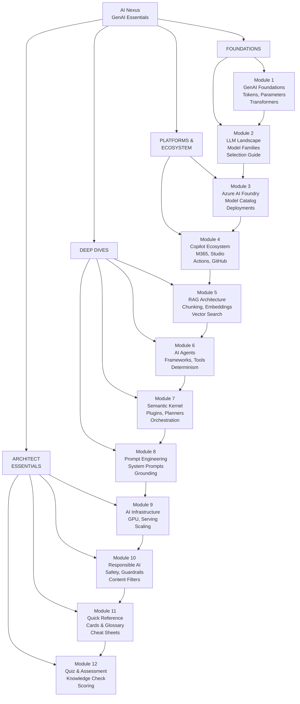

# AI Nexus — GenAI Essentials for Cloud Architects

> **Modules:** 12 | **Total Duration:** 10–14 hours | **Level:** Beginner → Expert
> **Audience:** Cloud Architects, Platform Engineers, Infrastructure Engineers, DevOps, SREs, CSAs
> **Scope:** Generative AI Foundations, Azure AI Platform, Microsoft Copilot Ecosystem, Agents, RAG, Prompt Engineering
> **Last Updated:** March 2026

---

## Why AI Nexus?

You build the infrastructure. You design the platforms. You manage the clusters, the networks, the security perimeters. But the workloads running on your infrastructure are increasingly **AI-native** — large language models, retrieval-augmented generation pipelines, autonomous agents, copilot integrations.

**AI Nexus** bridges the gap between infrastructure expertise and AI application knowledge. It is not a textbook — it is a **knowledge forge** designed for cloud architects who need to understand the full AI stack so they can:

- Design infrastructure that is **right-sized** for AI workloads from day one
- Have confident conversations about **RAG, agents, tokens, and model serving** with application teams
- Understand the **Microsoft AI ecosystem** end-to-end: from Azure AI Foundry to Copilot Studio to Semantic Kernel
- Make informed decisions about **GPU compute, networking, and scaling** for AI workloads
- Bridge the vocabulary gap between **platform engineering** and **AI engineering**

> **The soil is the platform. The roots are the infrastructure. The food is the application. You need to understand the food to grow the right roots.**

---

## Module Index

| # | Module | Duration | Level | Description |
|---|--------|----------|-------|-------------|
| 01 | [GenAI Foundations](./01-GenAI-Foundations.md) | 60–90 min | Foundation | Transformers, attention, tokenization, inference, parameters (temperature, top-k, top-p), context windows |
| 02 | [LLM Landscape](./02-LLM-Landscape.md) | 45–60 min | Foundation | Model families (GPT, Claude, Llama, Gemini, Phi), benchmarks, model selection, open vs proprietary |
| 03 | [Azure AI Foundry](./03-Azure-AI-Foundry.md) | 60–90 min | Platform | Model Catalog, deployments, endpoints, evaluation, prompt flow, fine-tuning, Azure AI Studio → Foundry |
| 04 | [Microsoft Copilot Ecosystem](./04-Copilot-Ecosystem.md) | 45–60 min | Platform | M365 Copilot, Copilot Studio, Copilot Actions, GitHub Copilot, Copilot for Azure, extensibility |
| 05 | [RAG Architecture](./05-RAG-Architecture.md) | 90–120 min | Deep-Dive | Retrieval-Augmented Generation, chunking, embeddings, vector search, Azure AI Search, reranking |
| 06 | [AI Agents Deep Dive](./06-AI-Agents-Deep-Dive.md) | 90–120 min | Deep-Dive | Agent concepts, planning, memory, tool use, Microsoft Agent Framework, AutoGen, deterministic agents |
| 07 | [Semantic Kernel & Orchestration](./07-Semantic-Kernel.md) | 60 min | Deep-Dive | Semantic Kernel, plugins, planners, memory, connectors, comparison with LangChain |
| 08 | [Prompt Engineering Mastery](./08-Prompt-Engineering.md) | 60–90 min | Tactical | System messages, few-shot, chain-of-thought, grounding, guardrails, structured output, function calling |
| 09 | [AI Infrastructure for Architects](./09-AI-Infrastructure.md) | 60–90 min | Strategic | GPU compute, model serving, scaling patterns, AI networking, Kubernetes for AI, cost optimization |
| 10 | [Responsible AI & Safety](./10-Responsible-AI-Safety.md) | 45–60 min | Strategic | Content safety, red teaming, guardrails, Azure AI Content Safety, evaluation frameworks |
| 11 | [Quick Reference Cards](./11-Quick-Reference-Cards.md) | Reference | Quick-Ref | One-page cards for every key concept — tokens, parameters, models, patterns, glossary |
| 12 | [Quiz & Assessment](./12-Quiz-Assessment.md) | 20 min | Assessment | 25 questions covering the full AI Nexus curriculum with expandable answers |

---

## How the Modules Connect

---

## Quick-Start Guide

| Your Role | Start Here | Then Go To |
|-----------|-----------|------------|
| **Cloud Architect** | Module 1 (Foundations) | Module 9 (Infrastructure) → Module 5 (RAG) → Module 6 (Agents) |
| **Platform Engineer** | Module 3 (AI Foundry) | Module 9 (Infrastructure) → Module 5 (RAG) → Module 11 (Cards) |
| **Infrastructure Engineer** | Module 1 (Foundations) | Module 2 (LLM Landscape) → Module 9 (Infrastructure) → Module 11 (Cards) |
| **CSA / Solutions Architect** | Module 11 (Quick Ref Cards) | Module 4 (Copilot) → Module 5 (RAG) → Module 6 (Agents) |
| **DevOps / SRE** | Module 9 (Infrastructure) | Module 3 (AI Foundry) → Module 10 (Responsible AI) |
| **Full AI Deep Dive** | Module 1 (Foundations) | Follow modules 1 → 2 → 3 → ... → 12 sequentially |

---

## What This Section Is NOT

- **Not a data science curriculum** — no model training math, no Jupyter notebooks
- **Not a developer tutorial** — no building apps from scratch
- **Not vendor marketing** — honest strengths and limitations of each tool

This section IS the essential AI knowledge that every infrastructure and platform professional needs to confidently architect, scale, and operate AI workloads in production.

---

## Prerequisites

| Requirement | Level |
|------------|-------|
| Azure fundamentals | Comfortable with Azure portal, subscriptions, resource groups |
| Networking basics | Understand VNETs, NSGs, DNS, load balancing |
| Container/Kubernetes | Familiarity with AKS or Kubernetes concepts |
| API concepts | Understand REST APIs, authentication, rate limiting |

No prior AI/ML experience required — that is exactly what this section teaches.

---

> **Ready? Start with [Module 1: GenAI Foundations](./01-GenAI-Foundations.md)** — understand how LLMs actually work, from tokens to transformers, in terms an infrastructure architect will appreciate.
