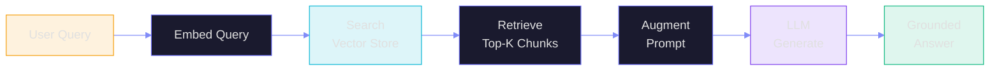
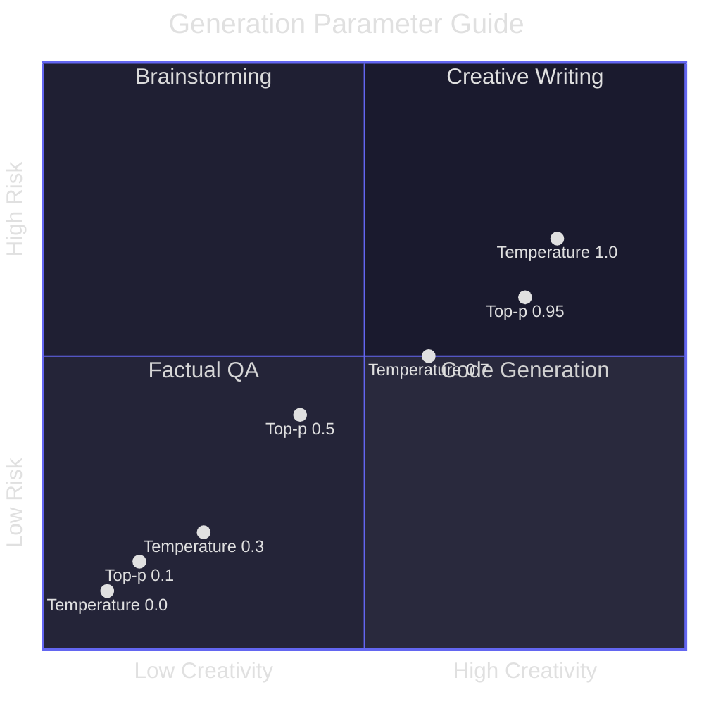

# F3: The AI Glossary A–Z

> **Type:** Reference | **Terms:** 200+ | **Use:** Keep this open in another tab
> **Part of:** 🌱 FROOT Foundations Layer
> **Last Updated:** March 2026

---

## How to Use This Glossary

Every term an architect, engineer, or consultant will encounter in the GenAI world — defined clearly, with context for *why* it matters, not just *what* it means. Terms are tagged by FROOT layer:

- 🌱 = Foundations | 🪵 = Reasoning | 🌿 = Orchestration | 🏗️ = Operations | 🍎 = Transformation

---

## A

### Ablation Study 🍎
Removing components of a model or system one at a time to measure which pieces contribute most to performance. Used during fine-tuning and evaluation to understand what matters.

### Activation Function 🌱
A mathematical function (ReLU, GELU, SiLU) applied to neuron outputs that introduces non-linearity. Without it, a neural network would just be linear algebra. **GELU** is the most common in modern transformers.

### Agent 🌿
An AI system that can **perceive, plan, decide, and act** autonomously. Unlike a simple chat completion, an agent has a loop: observe → think → act → observe results → repeat. See Module O2 for the full deep dive.

### Agent Framework (Microsoft) 🌿
Microsoft's SDK for building production AI agents. Supports tool calling, multi-agent orchestration, stateful conversations, and integration with Azure AI Foundry. Successor to AutoGen for production use cases. Compare with Semantic Kernel in Module O1.

### AI Landing Zone 🏗️
An enterprise-ready Azure environment pre-configured for AI workloads. Includes networking (private endpoints, VNets), identity (managed identities), governance (policies, RBAC), compute (GPU quotas), and data services (AI Search, storage). Built on the Cloud Adoption Framework.

### Alignment 🍎
Training a model to follow human intent, be helpful, and avoid harmful outputs. Techniques include RLHF, DPO, and constitutional AI. The reason ChatGPT says "I'd be happy to help" instead of producing raw completions.

### Attention (Self-Attention) 🌱
The core mechanism of transformers. For each token, attention computes how much "attention" to pay to every other token in the sequence. The formula: `Attention(Q,K,V) = softmax(QK^T / √d_k) × V`. This is what lets a model understand that "it" in "The cat sat on the mat because it was tired" refers to "the cat."

### AutoGen 🌿
Microsoft's open-source framework for multi-agent conversations. Agents are defined with roles and can collaborate in group chats. Being succeeded by Microsoft Agent Framework for production use, but remains popular for research and prototyping.

### Autoregressive Generation 🌱
The process of generating one token at a time, where each new token is conditioned on all previous tokens. This is how GPT, Claude, and Llama generate text. It's inherently sequential — which is why inference latency scales with output length.

---

## B

### Batch Size 🌱
The number of samples processed together during training or inference. Larger batches = better GPU utilization but more memory. For inference, **continuous batching** groups multiple requests to maximize throughput.

### BERT (Bidirectional Encoder Representations from Transformers) 🌱
An encoder-only transformer (2018). Unlike GPT which reads left-to-right, BERT reads in both directions. Used for classification, entity extraction, and embeddings — not for text generation. Still widely used for search and NLU tasks.

### BPE (Byte-Pair Encoding) 🌱
The most common tokenization algorithm. Starts with individual characters and iteratively merges the most frequent pairs. "unbelievable" → `["un", "believ", "able"]`. GPT-4 uses ~100K BPE tokens. Understanding BPE helps you estimate token costs.

### Beam Search 🌱
A decoding strategy that explores multiple candidate sequences simultaneously (keeping the top-k "beams"). Produces more coherent text than greedy decoding but is slower. Often used in translation and summarization.

---

## C

### Chain-of-Thought (CoT) 🪵
A prompting technique where you ask the model to "think step by step" before giving a final answer. Dramatically improves accuracy on math, logic, and reasoning tasks. Cost: more output tokens. See Module R1.

### Chunking 🪵
Splitting documents into smaller pieces for RAG retrieval. Strategies include fixed-size (512 tokens), semantic (by paragraph/section), recursive, and sentence-based. Chunk size directly impacts retrieval quality. See Module R2.

### Classification 🌱
The task of assigning a label to an input. Examples: sentiment analysis ("positive"/"negative"), intent detection ("book_flight"/"cancel_order"), content moderation ("safe"/"unsafe"). Can be done via prompting or fine-tuning.

### Completion 🌱
The output generated by a language model. In the API world, a "completion" is the model's response to a prompt. **Chat completions** use a messages array; **text completions** (legacy) use a single prompt string.

### Constitutional AI 🍎
An alignment technique (Anthropic) where the model critiques and revises its own outputs based on a set of principles ("constitution"). Reduces the need for human feedback in alignment training.

### Container Apps (Azure) 🏗️
A serverless container platform ideal for hosting AI agents and APIs. Supports auto-scaling (including scale-to-zero), GPU workloads, Dapr sidecars, and built-in ingress. Popular for deploying agent backends that need to scale dynamically.

### Content Safety (Azure AI) 🍎
Azure's service for detecting harmful content in text and images. Categories: hate, self-harm, sexual, violence. Severity levels 0–6. Used as a guardrail before and after model responses. See Module T2.

### Context Window 🌱
The maximum number of tokens a model can process in a single request (input + output combined). GPT-4o: 128K, Claude Opus 4: 200K, Gemini 1.5 Pro: 2M. Larger windows enable longer documents but cost more and may reduce focus on relevant content.

### Continuous Batching 🏗️
An inference optimization where new requests are added to a running batch without waiting for all current requests to finish. Dramatically improves GPU utilization and throughput in production serving.

### Copilot 🏗️
Microsoft's brand for AI assistants embedded in products. **M365 Copilot** (Office), **GitHub Copilot** (code), **Copilot for Azure** (cloud ops), **Copilot Studio** (custom copilots). Each uses different models and architectures underneath.

### Copilot Studio 🏗️
Microsoft's low-code platform for building custom copilots. Connects to enterprise data (SharePoint, Dataverse), supports topics, actions, and plugins. No code required for basic scenarios, extensible with code for advanced ones.

### Cosine Similarity 🪵
A measure of similarity between two vectors (0 = unrelated, 1 = identical). Used in RAG to compare query embeddings against document embeddings. Typical relevance threshold: 0.75–0.85. See Module R2.

### Cross-Attention 🌱
Attention where queries come from one sequence (e.g., decoder) and keys/values come from another (e.g., encoder). Used in encoder-decoder models like T5 and in multi-modal models where text attends to image patches.

---

## D

### Data Parallelism 🏗️
Distributing training data across multiple GPUs, each holding a copy of the model. Gradients are synchronized after each step. The simplest multi-GPU strategy. Used when the model fits in one GPU's memory.

### Decoder 🌱
The part of a transformer that generates output tokens one at a time, each conditioned on previous outputs and (optionally) encoder output. GPT, Claude, and Llama are **decoder-only** architectures.

### Deterministic AI 🪵
Making AI outputs reproducible and predictable. Techniques: `temperature=0`, fixed `seed` parameter, structured output schemas, constrained decoding, evaluation-driven guardrails. Even with `temperature=0`, GPU floating-point arithmetic can introduce tiny variations. See Module R3.

### Distillation (Knowledge Distillation) 🍎
Training a smaller "student" model to mimic a larger "teacher" model. The student learns from the teacher's probability distributions rather than raw data. Produces much smaller models that retain 90-95% of the teacher's capability.

### DPO (Direct Preference Optimization) 🍎
An alignment technique that skips the reward model step of RLHF and directly optimizes the policy from preference data. Simpler, more stable than RLHF. Used in Llama 3, Zephyr, and many fine-tuned models.

---

## E

### Embeddings 🌱
Dense vector representations of text (or images, audio) that capture semantic meaning. "King" and "Queen" have similar embeddings. Used in RAG for similarity search, in classification, and in clustering. Common dimensions: 768, 1536, 3072.

### Encoder 🌱
The part of a transformer that processes the full input sequence in parallel (bidirectionally). BERT is encoder-only. Encoder-decoder models (T5, BART) use the encoder to understand input and the decoder to generate output.

### Endpoint 🏗️
A URL that serves an AI model for inference. Azure AI Foundry provides **managed endpoints** (serverless, pay-per-token) and **dedicated endpoints** (reserved compute, predictable performance). Choice impacts cost, latency, and SLA.

### Evaluation 🍎
Measuring AI system quality. **Offline evaluation**: test set metrics (accuracy, F1, BLEU, ROUGE). **Online evaluation**: A/B testing in production. **LLM-as-judge**: using one model to score another's outputs. Azure AI Foundry has built-in evaluation tools.

---

## F

### Few-Shot Learning 🪵
Providing a few examples in the prompt to teach the model a task. Zero-shot = no examples. One-shot = one example. Few-shot = 2-10 examples. More examples improve consistency but use more tokens (and cost more).

### Fine-Tuning 🍎
Continuing the training of a pre-trained model on your specific dataset. Changes the model's weights. Use when prompting alone isn't enough — for domain-specific language, consistent formatting, or task specialization. See Module T1.

### Flash Attention 🏗️
An algorithm that makes attention computation faster and more memory-efficient by tiling and recomputing instead of materializing the full attention matrix. Enables longer context windows without quadratic memory growth.

### Floating Point Formats 🏗️
Numeric precision used for model weights. **FP32** (32-bit) = full precision, training. **FP16/BF16** (16-bit) = mixed precision training and inference. **INT8/INT4** = quantized inference, 2-4x smaller models. Lower precision = faster + cheaper but slightly less accurate.

### Foundation Model 🌱
A large model pre-trained on broad data that can be adapted to many tasks. GPT-4, Claude Opus 4, and Llama 3.1 are foundation models. The term emphasizes that these models serve as "foundations" for specialized applications.

### Function Calling 🌿
A model capability where it outputs structured JSON describing a function to call, rather than plain text. The application executes the function and feeds results back. Enables models to interact with databases, APIs, and tools. See Module O3.

---

## G

### GGUF (GPT-Generated Unified Format) 🏗️
A file format for quantized models optimized for CPU inference via llama.cpp. Common for running models locally. Variants: Q4_K_M (4-bit, medium quality), Q5_K_M, Q8_0 (8-bit, best quality).

### GPU (Graphics Processing Unit) 🏗️
The hardware that makes AI possible. AI workloads use **NVIDIA A100, H100, H200, B200** GPUs. Key specs: VRAM (memory), TFLOPS (compute), memory bandwidth. A single H100 has 80GB VRAM and can serve a 70B parameter model in FP16.

### Grounding 🪵
Anchoring model responses in factual, verifiable information. Techniques: RAG (retrieve relevant docs), system messages with facts, structured data injection, citation requirements. The primary defense against hallucination. See Module R3.

### Guardrails 🪵
Rules and filters that constrain AI behavior. Input guardrails filter harmful prompts. Output guardrails filter inappropriate responses. Can be rule-based (regex, blocklists), ML-based (classifiers), or LLM-based (a second model checks the first).

---

## H

### Hallucination 🪵
When a model generates confident-sounding but factually incorrect information. Causes: training data gaps, statistical pattern matching without understanding, high temperature. Mitigation: RAG, grounding, low temperature, structured output, evaluation. See Module R3.

### Hybrid Search 🪵
Combining keyword search (BM25) with vector search (embeddings) in RAG retrieval. Typically outperforms either alone. Azure AI Search supports hybrid natively. Weight: usually 50-70% vector, 30-50% keyword.

### Hyperparameter 🌱
A parameter set before training begins (not learned). Examples: learning rate, batch size, number of epochs, LoRA rank. Hyperparameter tuning is a key part of fine-tuning. See Module T1.

---

## I

### Inference 🌱
Running a trained model to generate predictions or outputs. Unlike training (which updates weights), inference only reads weights. Inference workloads are typically latency-sensitive and require different infrastructure than training.

### In-Context Learning (ICL) 🪵
The ability of LLMs to learn tasks from examples provided in the prompt, without any weight updates. Few-shot prompting is a form of ICL. Remarkable because the model "learns" at inference time, not training time.

### Instruction Tuning 🍎
Fine-tuning a model on a dataset of (instruction, response) pairs. Teaches the model to follow instructions rather than just predict next tokens. The difference between base GPT-4 and ChatGPT is largely instruction tuning + RLHF.

---

## J

### JSON Mode 🪵
A model configuration that constrains output to valid JSON. Essential for function calling, API integration, and structured data extraction. Supported by OpenAI, Azure OpenAI, and most modern model APIs. Reduces parsing errors in production.

---

## K

### KV Cache (Key-Value Cache) 🏗️
During autoregressive generation, the model caches the key and value tensors from previous tokens so they don't need to be recomputed. This is what makes generation fast but **eats VRAM**. A 128K context window with a 70B model can consume 40+ GB of KV cache.

### Knowledge Cutoff 🌱
The date after which a model has no training data. GPT-4o: Oct 2023. Claude Opus 4: early 2025. Any question about events after the cutoff requires RAG or tool access to answer correctly.

---

## L

### LangChain 🌿
An open-source framework for building LLM applications. Provides chains, agents, memory, and tool integrations. Python and JavaScript versions. Compare with Semantic Kernel (O1) — LangChain is more community-driven, SK is more enterprise/Microsoft-integrated.

### Large Language Model (LLM) 🌱
A neural network with billions of parameters trained on massive text corpora to predict the next token. The "large" refers to parameter count (7B to 1T+). All modern GenAI applications are built on LLMs.

### LoRA (Low-Rank Adaptation) 🍎
A parameter-efficient fine-tuning technique that freezes original model weights and trains small rank-decomposition matrices alongside them. Reduces fine-tuning compute by 10-100x. LoRA adapters are typically 10-100MB vs the full model at 10-100GB. See Module T1.

### Latency 🏗️
Time from request to first response token (TTFT — Time To First Token) or full response (TTLR — Time To Last Response). Production targets: TTFT < 500ms, TTLR < 3s for interactive use. Affected by model size, input length, and infrastructure.

---

## M

### MCP (Model Context Protocol) 🌿
An open protocol (by Anthropic, now industry-wide) for connecting AI models to external tools and data sources. MCP servers expose tools via a standardized schema. MCP clients (in agents) discover and call these tools. See Module O3.

### Memory (Agent) 🌿
How an agent retains information across interactions. **Short-term memory**: current conversation context. **Long-term memory**: persisted facts (vector store, database). **Episodic memory**: past conversation summaries. Critical for multi-turn and multi-session agents.

### Mixed Precision 🏗️
Using multiple floating-point formats during training/inference. Compute-heavy operations use FP16/BF16 for speed; accumulations use FP32 for accuracy. Standard for all modern AI training. BF16 preferred over FP16 for stability.

### Model Catalog (Azure AI Foundry) 🏗️
Azure's marketplace of 1,700+ AI models. Includes OpenAI (GPT-4o, o1), Meta (Llama), Mistral, Cohere, and more. Models can be deployed as serverless APIs (pay-per-token) or to dedicated compute.

### Model Parallelism 🏗️
Distributing a single model across multiple GPUs when it doesn't fit in one GPU's memory. **Tensor parallelism**: splits layers. **Pipeline parallelism**: assigns different layers to different GPUs. Complex in practice.

### Multi-Agent 🌿
Systems where multiple AI agents collaborate, each with specialized roles. Patterns: supervisor (one agent orchestrates), swarm (peer-to-peer), pipeline (sequential handoff). See Module O2.

### Multi-Modal 🌱
Models that process multiple input types: text, images, audio, video. GPT-4o, Claude Opus 4, and Gemini are multi-modal. Enables use cases like image understanding, document extraction, video analysis.

---

## N

### Neural Network 🌱
A computational model inspired by biological neurons. Layers of nodes (neurons) connected by weighted edges. Training adjusts weights to minimize a loss function. Transformers are a specific type of neural network architecture.

### Next-Token Prediction 🌱
The fundamental task of decoder LLMs: given a sequence of tokens, predict the probability distribution over the vocabulary for the next token. Every text generation capability — writing, reasoning, coding — emerges from this single task.

---

## O

### ONNX (Open Neural Network Exchange) 🏗️
An open format for representing ML models. Enables training in one framework (PyTorch) and deploying in another (ONNX Runtime). Azure uses ONNX Runtime for optimized inference. Supports quantization and hardware acceleration.

### Orchestrator 🌿
The component that coordinates between an LLM and other system components (tools, memory, RAG, other agents). Semantic Kernel's planner, LangChain's agent executor, and Microsoft Agent Framework's runtime are all orchestrators.

---

## P

### Parameters (Model Parameters) 🌱
The learned weights of a neural network. GPT-4: ~1.8T (estimated, MoE), Llama 3.1: 405B, Phi-4: 14B. More parameters generally = more capability but require more compute and memory. Size ≠ quality (architecture and training data matter enormously).

### Parameters (Generation Parameters) 🌱
Settings that control text generation behavior:

| Parameter | Range | What It Controls | Impact |
|-----------|-------|-------------------|--------|
| **Temperature** | 0.0–2.0 | Randomness of token selection | 0.0 = deterministic, 1.0 = balanced, 2.0 = creative chaos |
| **Top-k** | 1–100 | Number of tokens to consider | Lower = more focused, higher = more diverse |
| **Top-p** (nucleus) | 0.0–1.0 | Cumulative probability threshold | 0.1 = only top tokens, 0.95 = most tokens |
| **Frequency penalty** | -2.0–2.0 | Penalty for repeated tokens | Higher = less repetition |
| **Presence penalty** | -2.0–2.0 | Penalty for tokens already used | Higher = more topic diversity |
| **Max tokens** | 1–model max | Maximum output length | Controls cost and response length |
| **Seed** | Integer | Random seed for reproducibility | Same seed + same input = similar output |
| **Stop sequences** | Strings | Tokens that halt generation | Control where output ends |

### Pipeline (AI/ML) 🏗️
A sequence of automated steps: data ingestion → preprocessing → model training/inference → evaluation → deployment. Azure AI Foundry, MLflow, and GitHub Actions are common orchestrators for AI pipelines.

### Planner (Semantic Kernel) 🌿
A component that takes a user's goal and breaks it into a sequence of plugin function calls. **Handlebars Planner**: template-based. **Stepwise Planner**: iterative. In modern SK, planners are being replaced by function-calling models.

### Plugin (Semantic Kernel) 🌿
A collection of functions that extend model capabilities. **Native plugins**: C#/Python code. **OpenAPI plugins**: API specifications. **OpenAI plugins**: compatible format. Plugins are how Semantic Kernel connects LLMs to business logic.

### Private Endpoint 🏗️
An Azure networking feature that gives a service a private IP address within your VNet. Critical for AI Landing Zones — keeps model endpoints, search services, and storage off the public internet.

### Prompt 🪵
The input given to a language model. Composed of: **system message** (instructions/persona), **user message** (the request), **assistant message** (previous responses). Prompt quality is the single biggest lever for output quality. See Module R1.

### Prompt Flow 🏗️
An Azure AI Foundry tool for building and evaluating LLM workflows visually. Supports DAG-based flows with LLM nodes, Python nodes, tool nodes, and evaluation metrics. Being integrated into VS Code for local development.

### PTU (Provisioned Throughput Units) 🏗️
Azure OpenAI's dedicated capacity model. Instead of pay-per-token, you reserve a fixed amount of throughput. Predictable performance and cost. Best for: high-volume production workloads with predictable demand. Compare with pay-as-you-go (PAYG).

---

## Q

### QLoRA (Quantized LoRA) 🍎
LoRA applied to a quantized (4-bit) base model. Enables fine-tuning 70B+ models on a single consumer GPU (24GB VRAM). Minimal quality loss compared to full LoRA. The most accessible fine-tuning technique. See Module T1.

### Quantization 🏗️
Reducing the numerical precision of model weights (FP32 → INT8 → INT4). Reduces model size by 2-8x and speeds up inference. Techniques: GPTQ (post-training), AWQ (activation-aware), GGUF (CPU-friendly). Some quality loss at INT4.

---

## R

### RAG (Retrieval-Augmented Generation) 🪵
A pattern that grounds LLM responses in retrieved documents. Flow: query → embed query → search vector store → retrieve relevant chunks → inject into prompt → generate response. The most common pattern for enterprise AI. See Module R2.



### Reranking 🪵
A second-pass ranking step after initial retrieval. A cross-encoder model scores each (query, document) pair more accurately than cosine similarity. Dramatically improves relevance. Azure AI Search supports semantic reranking natively.

### Responsible AI 🍎
Microsoft's framework for trustworthy AI: fairness, reliability, safety, privacy, inclusiveness, transparency, accountability. Not just ethics — it's engineering practices: content filters, red teaming, evaluation, human oversight. See Module T2.

### RLHF (Reinforcement Learning from Human Feedback) 🍎
An alignment technique: (1) collect human preferences on model outputs, (2) train a reward model from preferences, (3) optimize the LLM policy against the reward model using PPO. How ChatGPT was aligned. Being partially replaced by DPO.

---

## S

### Scaling Laws 🌱
Empirical observations (Kaplan et al., Chinchilla) about how model performance improves with more parameters, data, and compute. Key insight: performance follows predictable power laws, enabling compute-optimal model sizing.

### Semantic Kernel 🌿
Microsoft's open-source SDK for building AI applications. Core concepts: kernel (orchestrator), plugins (tools), memory (context), planners (goal decomposition), connectors (external services). C# and Python SDKs. See Module O1.

### Semantic Ranking 🪵
Azure AI Search's built-in reranking capability that uses a cross-encoder model to reorder search results by semantic relevance. Activated with `queryType: semantic`. Significant quality improvement over BM25 alone.

### Semantic Search 🪵
Searching by meaning rather than keywords. Uses embeddings to find documents that are semantically similar to the query, even if they use different words. "How to fix a flat tire" matches "tire puncture repair guide."

### Serving (Model Serving) 🏗️
The infrastructure that makes models available for inference. Options: Azure AI Foundry endpoints, vLLM, TGI (Text Generation Inference), Triton, ONNX Runtime. Key metrics: TTFT, tokens/second, concurrent requests, GPU utilization.

### SLM (Small Language Model) 🌱
Models with fewer parameters (1B–14B) optimized for specific tasks or edge deployment. Microsoft Phi-4 (14B), Phi-3.5-mini (3.8B). Trade raw capability for speed, cost, and privacy (can run on-device). Often outperform larger models on narrow tasks.

### Stop Sequence 🌱
One or more strings that cause the model to stop generating when encountered. Examples: `"\n\n"`, `"```"`, `"END"`. Essential for controlling output format in production applications.

### Structured Output 🪵
Constraining model output to a specific format (JSON schema, XML, Markdown). Techniques: JSON mode, function calling with schema, regex-constrained generation. Critical for API integrations. See Module R1.

### System Message 🪵
The first message in a chat completion that sets the model's behavior, persona, constraints, and context. The most powerful prompt engineering lever. Example: "You are a helpful Azure architect. Only answer questions about Azure. Cite sources."

---

## T

### Temperature 🌱
A generation parameter (0.0–2.0) that controls randomness. At 0.0, the model always picks the most likely token (near-deterministic). At 1.0, probabilities are used as-is. At 2.0, the distribution is flattened (more random). For factual tasks: 0.0–0.3. For creative tasks: 0.7–1.0.

### Tensor 🌱
A multi-dimensional array of numbers. Scalars are 0D tensors, vectors are 1D, matrices are 2D. Neural networks process tensors. Model weights are stored as tensors. Understanding tensor shapes helps debug AI infrastructure issues.

### Tokenization 🌱
Converting text into a sequence of integer token IDs. Each model has its own tokenizer. "Hello, world!" might become `[9906, 11, 1917, 0]`. Token count determines cost (pay-per-token) and context limits. Rule of thumb: 1 token ≈ 4 characters in English.

### Tool Use 🌿
A model's ability to invoke external tools (APIs, databases, code interpreters). The model generates a structured tool call → the application executes it → the result is fed back to the model. Fundamental to agents. See Module O3.

### Top-k 🌱
A generation parameter. At each step, only the top-k most likely tokens are considered. `top_k=1` = greedy decoding (always pick the most likely). `top_k=40` = consider 40 options. Lower values = more focused, higher = more diverse.

### Top-p (Nucleus Sampling) 🌱
A generation parameter. Instead of a fixed count, considers the smallest set of tokens whose cumulative probability exceeds p. `top_p=0.1` = very focused (only top few tokens). `top_p=0.95` = most tokens eligible. Typically used instead of top_k, not with it.

### Transformer 🌱
The neural network architecture behind all modern LLMs (Vaswani et al., 2017 — "Attention Is All You Need"). Key innovation: self-attention replaces recurrence, enabling massive parallelization. Variants: encoder-only (BERT), decoder-only (GPT), encoder-decoder (T5).

### Transfer Learning 🌱
Using a pre-trained model as a starting point for a new task. Fine-tuning is a form of transfer learning. The pre-trained model has already learned general language understanding; you transfer that knowledge to your specific domain.

---

## U

### Uncertainty 🪵
A model's lack of confidence in its output. LLMs are notoriously bad at expressing uncertainty — they generate fluent text regardless of confidence. Techniques to surface uncertainty: token probabilities (logprobs), calibration, abstention prompting ("say 'I don't know' if unsure").

---

## V

### Vector Database 🪵
A database optimized for storing and searching high-dimensional vectors (embeddings). Used in RAG for similarity search. Options: Azure AI Search (hybrid), Pinecone, Weaviate, Qdrant, Chroma, pgvector. Choice depends on scale, hybrid search needs, and cloud integration.

### Vector Search 🪵
Finding similar items by comparing their vector embeddings. Algorithms: HNSW (most common, approximate but fast), IVF (inverted file index), flat (exact but slow). Azure AI Search uses HNSW for vector indexing.

### vLLM 🏗️
An open-source, high-performance LLM serving engine. Key innovation: PagedAttention (manages KV cache like virtual memory pages). Supports continuous batching, tensor parallelism, and OpenAI-compatible API. Popular for self-hosted model serving on AKS or Container Apps.

---

## W

### Weight 🌱
A numerical parameter in a neural network that is learned during training. A 70B model has 70 billion weights. Weights encode everything the model "knows." Saving weights = saving the model. Fine-tuning = updating weights.

### Window (Context Window) 🌱
See **Context Window**.

---

## X

### XAI (Explainable AI) 🍎
Techniques for understanding why a model made a specific prediction or generation. Attention visualization, feature attribution, and chain-of-thought prompting all contribute to explainability. Important for regulated industries.

---

## Z

### Zero-Shot 🪵
Asking a model to perform a task without any examples. "Classify this review as positive or negative: {review}". Works well for tasks similar to the model's training data. Performance improves with few-shot examples.

---

## Parameter Quick Reference Card



### When to Use What

| Use Case | Temperature | Top-p | Why |
|----------|-------------|-------|-----|
| Factual Q&A | 0.0 | 1.0 | Maximum determinism |
| Classification | 0.0 | 1.0 | Consistent labels |
| Code generation | 0.0–0.2 | 0.95 | Correct but slightly varied |
| Summarization | 0.3 | 0.9 | Faithful but fluent |
| Creative writing | 0.7–1.0 | 0.95 | Diverse and interesting |
| Brainstorming | 1.0–1.5 | 0.95 | Maximum diversity |

---

> **Tip:** Bookmark this page. You'll come back to it constantly.
> **AIFROOT** — *From Root to Fruit*
