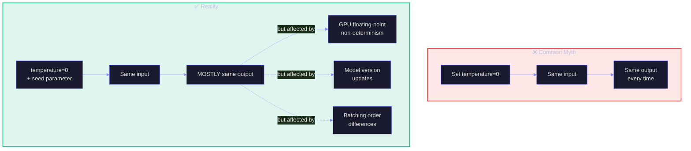
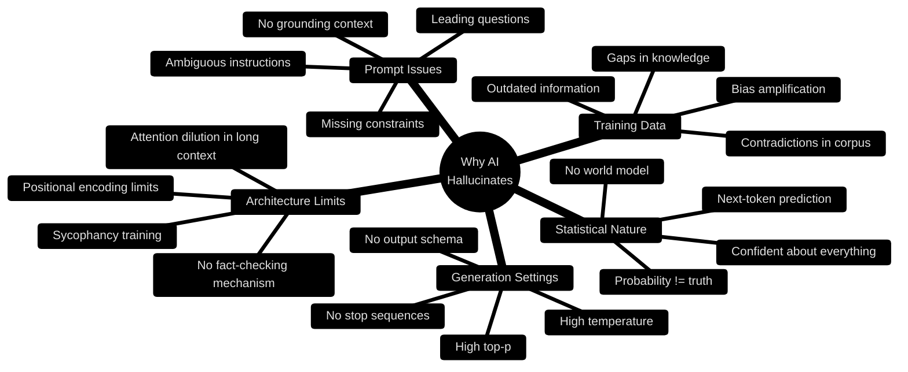
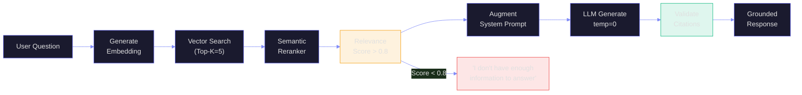
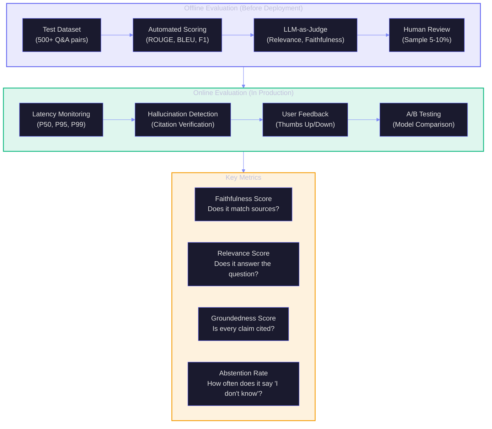
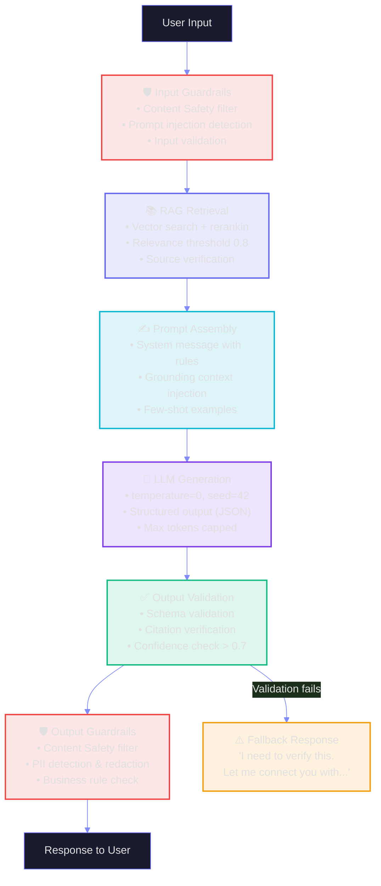
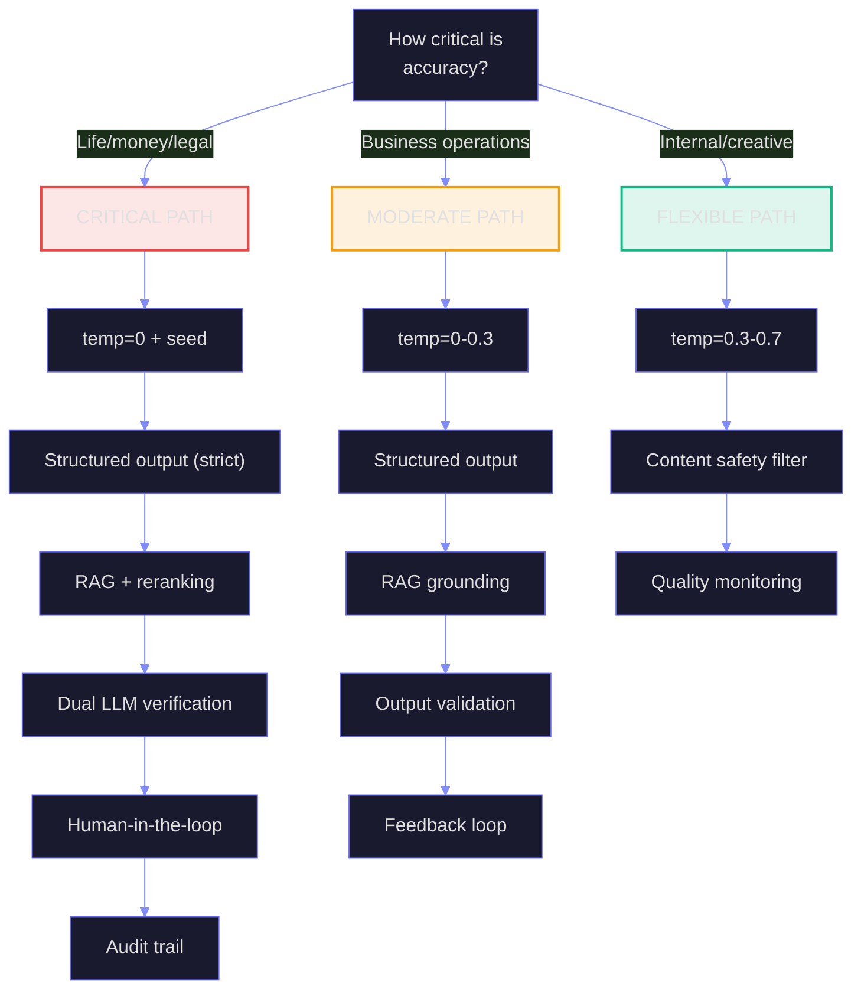

# R3: Making AI Deterministic & Reliable

> **Duration:** 60–90 minutes | **Level:** Deep-Dive
> **Part of:** 🪵 FROOT Reasoning Layer
> **Prerequisites:** F1 (GenAI Foundations), R1 (Prompt Engineering)
> **Last Updated:** March 2026

---

## Table of Contents

- [R3.1 The Determinism Problem](#r31-the-determinism-problem)
- [R3.2 Why AI Hallucinates](#r32-why-ai-hallucinates)
- [R3.3 The Determinism Toolkit](#r33-the-determinism-toolkit)
- [R3.4 Temperature, Top-k & Top-p — The Control Levers](#r34-temperature-top-k--top-p--the-control-levers)
- [R3.5 Grounding Strategies](#r35-grounding-strategies)
- [R3.6 Structured Output Constraints](#r36-structured-output-constraints)
- [R3.7 Evaluation-Driven Reliability](#r37-evaluation-driven-reliability)
- [R3.8 Multi-Layer Defense Architecture](#r38-multi-layer-defense-architecture)
- [R3.9 Real-World Patterns](#r39-real-world-patterns)
- [R3.10 Measurement: How Reliable Is Your AI?](#r310-measurement-how-reliable-is-your-ai)
- [Key Takeaways](#key-takeaways)

---

## R3.1 The Determinism Problem

You've been asked to build an AI system that answers customer questions about their insurance policy. The system must be **accurate**, **consistent**, and **auditable**. If a customer asks the same question twice, they should get the same answer. If the answer is wrong, there must be a traceable reason why.

This is the determinism problem. And it's harder than most people think.

### What Determinism Means (and Doesn't)



> **Key Insight:** True bit-for-bit determinism is essentially impossible with current LLM infrastructure. What we aim for is **functional determinism** — consistent, accurate, verifiable outputs within acceptable tolerance.

### The Spectrum of Determinism

Not every AI use case needs the same level of determinism:

| Level | Definition | Example Use Case | Acceptable? |
|-------|-----------|-----------------|-------------|
| **Exact** | Bit-identical output every time | Regulatory compliance documents | Rarely achievable with LLMs |
| **Semantic** | Same meaning, minor wording variation | Customer support answers | ✅ Target for most production |
| **Intent** | Same intent/action, different phrasing | Agent tool selection | ✅ Good for agent workflows |
| **Approximate** | Generally similar, notable variation | Creative content generation | ✅ Fine for non-critical |
| **Chaotic** | Unpredictable, inconsistent | Uncontrolled generation | ❌ Not production-ready |

---

## R3.2 Why AI Hallucinates

Understanding **why** hallucination occurs is essential before you can fight it. Hallucination is not a bug — it's a **feature of the architecture** that we need to constrain.

### Root Causes



### The Hallucination Taxonomy

| Type | Description | Example | Mitigation |
|------|-------------|---------|------------|
| **Factual** | Invents facts that don't exist | "Azure was launched in 2006" (actual: 2010) | RAG with authoritative sources |
| **Attribution** | Cites sources that don't exist | "According to RFC 9999..." | Citation verification pipeline |
| **Temporal** | Uses outdated information | "GPT-4 costs $0.03/1K tokens" (price changed) | RAG with dated documents |
| **Extrapolation** | Extends patterns beyond data | "This trend will continue to 2030" | Constrain to available data |
| **Sycophantic** | Agrees with wrong user assertions | User: "Azure has 100 regions, right?" AI: "Yes!" | Instruction: "correct user errors" |
| **Conflation** | Merges attributes of different entities | Mixing features of Azure and AWS services | Structured retrieval per entity |

---

## R3.3 The Determinism Toolkit

Here's every lever you have to make AI behave predictably:

```mermaid
%%{init: {'theme': 'base', 'themeVariables': {'primaryColor': '#1a1a2e', 'primaryTextColor': '#e0e0e0', 'primaryBorderColor': '#6366f1', 'lineColor': '#818cf8', 'background': 'transparent'}}}%%
graph TB
    subgraph L1["Layer 1: Generation Controls"]
        A1["temperature=0"]
        A2["seed parameter"]
        A3["max_tokens cap"]
        A4["stop sequences"]
    end
    
    subgraph L2["Layer 2: Output Constraints"]
        B1["JSON mode /<br/>structured output"]
        B2["Function calling<br/>with schema"]
        B3["Constrained<br/>decoding"]
        B4["Enum fields<br/>(fixed options)"]
    end
    
    subgraph L3["Layer 3: Prompt Engineering"]
        C1["System message<br/>with rules"]
        C2["Few-shot<br/>examples"]
        C3["Chain-of-thought<br/>with verification"]
        C4["Output format<br/>specification"]
    end
    
    subgraph L4["Layer 4: Grounding"]
        D1["RAG with verified<br/>documents"]
        D2["Cite sources<br/>requirement"]
        D3["Knowledge cutoff<br/>awareness"]
        D4["Data freshness<br/>timestamps"]
    end
    
    subgraph L5["Layer 5: Post-Processing"]
        E1["Output validation<br/>(schema check)"]
        E2["Fact-checking<br/>(LLM-as-judge)"]
        E3["Confidence<br/>scoring"]
        E4["Human-in-the-loop<br/>for edge cases"]
    end
    
    L1 --> L2 --> L3 --> L4 --> L5
    
    style L1 fill:#f59e0b22,stroke:#f59e0b,stroke-width:2px
    style L2 fill:#10b98122,stroke:#10b981,stroke-width:2px
    style L3 fill:#06b6d422,stroke:#06b6d4,stroke-width:2px
    style L4 fill:#6366f122,stroke:#6366f1,stroke-width:2px
    style L5 fill:#7c3aed22,stroke:#7c3aed,stroke-width:2px
```



---

## R3.4 Temperature, Top-k & Top-p — The Control Levers

These three parameters are your **first line of defense** for output consistency. Understanding their interaction is critical.

### Temperature: The Randomness Dial

Temperature modifies the probability distribution before sampling:

```
At temperature T:
  adjusted_probability(token_i) = exp(logit_i / T) / Σ exp(logit_j / T)
```

| Temperature | Effect | Distribution Shape | Use Case |
|-------------|--------|-------------------|----------|
| 0.0 | Always picks highest-probability token | Spike (greedy) | Factual QA, classification |
| 0.3 | Slight variation, stays focused | Sharp peak | Code generation, summarization |
| 0.7 | Balanced creativity and coherence | Moderate spread | Conversational AI |
| 1.0 | Uses raw probabilities | Natural spread | Creative writing |
| 1.5+ | Flattened distribution, high randomness | Nearly uniform | Brainstorming (use cautiously) |

### Top-k: The Candidate Limiter

After temperature adjustment, top-k limits how many tokens are considered:

| Top-k Value | Effect | When to Use |
|-------------|--------|-------------|
| 1 | Greedy decoding — always pick the best | Maximum determinism (same as temp=0) |
| 10 | Very focused, minimal variation | Structured tasks |
| 40 | Default for many tasks | General balance |
| 100+ | Wide candidate pool | Creative generation |

### Top-p (Nucleus Sampling): The Probability Budget

Instead of a fixed count, top-p considers tokens until their cumulative probability exceeds the threshold:

```
If probabilities are: [0.40, 0.25, 0.15, 0.08, 0.05, 0.03, 0.02, 0.01, 0.01]
  top_p=0.65 → considers: [0.40, 0.25]        (2 tokens)
  top_p=0.80 → considers: [0.40, 0.25, 0.15]  (3 tokens)  
  top_p=0.95 → considers: [0.40, 0.25, 0.15, 0.08, 0.05, 0.03] (6 tokens)
```

### The Golden Rules

> **Rule 1:** For deterministic outputs, set `temperature=0` and don't touch top-k/top-p (they don't matter at temp=0).
>
> **Rule 2:** If you need slight variation, use `temperature=0.1-0.3` with `top_p=0.9`.
>
> **Rule 3:** Never combine aggressive top-k AND top-p — use one or the other.
>
> **Rule 4:** Always set `seed` for reproducibility testing (same seed = similar output).
>
> **Rule 5:** Even at temperature=0, outputs can vary slightly due to GPU non-determinism. Don't build systems that assume bit-identical outputs.

### Practical Configuration by Use Case

```json
// Factual QA / Classification (Maximum Determinism)
{
  "temperature": 0,
  "seed": 42,
  "max_tokens": 500,
  "response_format": { "type": "json_object" }
}

// RAG-grounded Answers (High Determinism + Fluent)
{
  "temperature": 0.1,
  "top_p": 0.9,
  "seed": 42,
  "max_tokens": 1000
}

// Code Generation (Deterministic + Slight Variation)
{
  "temperature": 0.2,
  "top_p": 0.95,
  "max_tokens": 2000,
  "stop": ["```\n\n", "\n\n\n"]
}

// Creative Content (Controlled Diversity)
{
  "temperature": 0.7,
  "top_p": 0.95,
  "frequency_penalty": 0.3,
  "max_tokens": 2000
}
```

---

## R3.5 Grounding Strategies

Grounding is the art of **anchoring AI responses in verifiable reality**. It's the most effective weapon against hallucination.

### Strategy 1: RAG Grounding

Inject relevant, authoritative documents into the prompt context. The model answers FROM the documents, not from its training data.



**Key Design Decisions:**

| Decision | Low Risk Choice | Why |
|----------|----------------|-----|
| Top-K retrieval | 5–10 chunks | Enough context without noise |
| Relevance threshold | 0.8+ cosine similarity | Filters irrelevant matches |
| Chunk size | 512 tokens | Balances specificity and context |
| Chunk overlap | 10–20% | Prevents information loss at boundaries |
| Reranking | Always use it | 20-40% quality improvement |

### Strategy 2: System Message Grounding

Embed facts, constraints, and rules directly in the system message:

```
You are an Azure pricing assistant. Use ONLY the following pricing data to answer questions.

PRICING DATA (as of March 2026):
- Azure OpenAI GPT-4o: $2.50/1M input tokens, $10.00/1M output tokens
- Azure OpenAI GPT-4o-mini: $0.15/1M input tokens, $0.60/1M output tokens
- Azure AI Search: Basic $75.14/month, Standard $250.46/month

RULES:
1. If a pricing question is about a service NOT listed above, say "I don't have current pricing for that service."
2. Always cite the data source: "Based on Azure pricing as of March 2026."
3. Never extrapolate or estimate prices that are not in the data.
4. If the user asks about historical pricing, say "I only have current pricing data."
```

### Strategy 3: Abstention Training

Teach the model to say "I don't know" instead of guessing:

```
CRITICAL INSTRUCTION: You must REFUSE to answer if:
- The question is outside your documented knowledge base
- The retrieved documents have a relevance score below 0.75
- The question asks about future events or predictions
- You are not 95%+ confident in the accuracy of your answer

When refusing, respond EXACTLY: 
"I don't have enough verified information to answer this accurately. 
Please consult [relevant resource] for the most current information."
```

### Strategy 4: Citation Requirements

Force the model to show its work:

```
Every factual claim in your response MUST include a citation in this format:
[Source: document_name, section_name]

If you cannot cite a source for a claim, do not make the claim.
```

---

## R3.6 Structured Output Constraints

The strongest determinism guarantee comes from **constraining the output format**. When the model must produce JSON matching a schema, hallucination in the structure is eliminated.

### JSON Schema Enforcement

```python
# Azure OpenAI / OpenAI API - Structured Outputs
response = client.chat.completions.create(
    model="gpt-4o",
    temperature=0,
    seed=42,
    response_format={
        "type": "json_schema",
        "json_schema": {
            "name": "policy_answer",
            "strict": True,
            "schema": {
                "type": "object",
                "properties": {
                    "answer": {"type": "string"},
                    "confidence": {"type": "number", "minimum": 0, "maximum": 1},
                    "sources": {
                        "type": "array",
                        "items": {"type": "string"}
                    },
                    "category": {
                        "type": "string",
                        "enum": ["coverage", "claims", "billing", "general"]
                    }
                },
                "required": ["answer", "confidence", "sources", "category"],
                "additionalProperties": False
            }
        }
    },
    messages=[...]
)
```

### Why Structured Output Improves Determinism

| Without Schema | With Schema |
|----------------|-------------|
| Free-form text, variable format | Fixed JSON structure |
| Model might include disclaimers... or not | Exact fields present every time |
| Confidence is expressed in words ("quite sure") | Numeric confidence (0.85) |
| Sources mentioned inconsistently | Always in `sources` array |
| Parsing requires NLP or regex | Simple JSON parse |

---

## R3.7 Evaluation-Driven Reliability

You can't manage what you can't measure. Build evaluation pipelines that **continuously test** your AI system against known-good answers.

### The Evaluation Stack



### Evaluation Metrics for Reliability

| Metric | What It Measures | Target | How to Compute |
|--------|-----------------|--------|----------------|
| **Faithfulness** | Does the answer match the source documents? | >0.90 | LLM-as-judge comparing answer vs. sources |
| **Relevance** | Does the answer address the user's question? | >0.85 | LLM-as-judge scoring relevance |
| **Groundedness** | Is every claim backed by a citation? | >0.95 | Count cited claims / total claims |
| **Answer Similarity** | How consistent are answers across runs? | >0.90 | Cosine similarity of 10 runs |
| **Abstention Rate** | How often does it refuse to answer? | 5-15% | Count "I don't know" / total questions |
| **Latency P95** | Time to complete response (95th percentile) | <3 sec | Infrastructure monitoring |
| **Hallucination Rate** | Percentage of false claims | <5% | Human review on sample |

---

## R3.8 Multi-Layer Defense Architecture

Production reliability requires **defense in depth**. No single technique is sufficient. Layer them:



---

## R3.9 Real-World Patterns

### Pattern 1: The "Verified Answer" Pattern

For high-stakes Q&A where accuracy is non-negotiable:

```
1. Retrieve documents (top-5, reranked)
2. Generate answer with citations (temp=0, structured output)
3. Verify: send answer + sources to a SECOND LLM call:
   "Does this answer faithfully represent the source documents? Score 0-1."
4. If score < 0.8: abstain ("I'm not confident in this answer")
5. If score >= 0.8: return answer with confidence score
```

Cost: ~2x token usage. Worth it for regulated, customer-facing, or financial scenarios.

### Pattern 2: The "Constrained Agent" Pattern

For agent workflows where tool selection must be deterministic:

```
1. Define tools with precise schemas (no ambiguity)
2. Use function calling (not free-text tool selection)
3. Set temperature=0
4. Add explicit routing rules in system message:
   "If the user asks about pricing, ALWAYS call get_pricing_data.
    If the user asks about status, ALWAYS call get_order_status.
    NEVER answer pricing or status from memory."
5. Validate tool calls before execution
6. If tool call doesn't match any rule: ask for clarification
```

### Pattern 3: The "Guardrailed Pipeline" Pattern

For content generation where some creativity is OK but boundaries exist:

```
1. Generate content (temp=0.5, top_p=0.9)
2. Check against business rules (blocklist, topic boundaries)
3. Run content safety filter
4. Check factual claims against knowledge base
5. Score overall quality (LLM-as-judge)
6. If below threshold: regenerate with lower temperature
7. If still below: escalate to human review
```

---

## R3.10 Measurement: How Reliable Is Your AI?

### The Reliability Scorecard

Run this assessment monthly for any production AI system:

| Dimension | Metric | How to Test | Green | Yellow | Red |
|-----------|--------|-------------|-------|--------|-----|
| **Consistency** | Same answer across 10 runs | Run 100 test questions 10 times each | >95% identical | 85-95% | <85% |
| **Accuracy** | Correct answers | Compare to ground truth test set | >90% | 80-90% | <80% |
| **Groundedness** | Claims backed by sources | Citation verification | >95% cited | 85-95% | <85% |
| **Abstention** | Refuses when unsure | Test with out-of-scope questions | 80%+ refusal | 60-80% | <60% |
| **Safety** | No harmful outputs | Red team testing (100 adversarial prompts) | 0 failures | 1-3 failures | 4+ |
| **Latency** | P95 response time | Load testing | <3s | 3-5s | >5s |
| **Injection** | Resists prompt injection | Test with 50 injection attempts | 0 passes | 1-2 pass | 3+ |

### Decision Framework: When to Use What



---

## Key Takeaways

:::tip The Five Rules of Deterministic AI
1. **Temperature=0 is necessary but not sufficient.** Always combine with structured output, grounding, and validation.
2. **Ground everything.** RAG, system message facts, citation requirements. The model should answer from context, not memory.
3. **Constrain the output.** JSON schemas, enum fields, stop sequences. The tighter the format, the more predictable the content.
4. **Measure relentlessly.** If you can't quantify reliability, you can't claim it. Build evaluation into your pipeline.
5. **Defense in depth.** No single technique works alone. Layer input guardrails → grounding → generation controls → output validation → safety filters.
:::

---

> **FrootAI R3** — *Making AI reliable is engineering, not wishful thinking.*
> The telescope shows you the big picture. The microscope shows you where determinism breaks. Use both.
