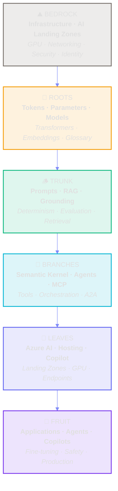
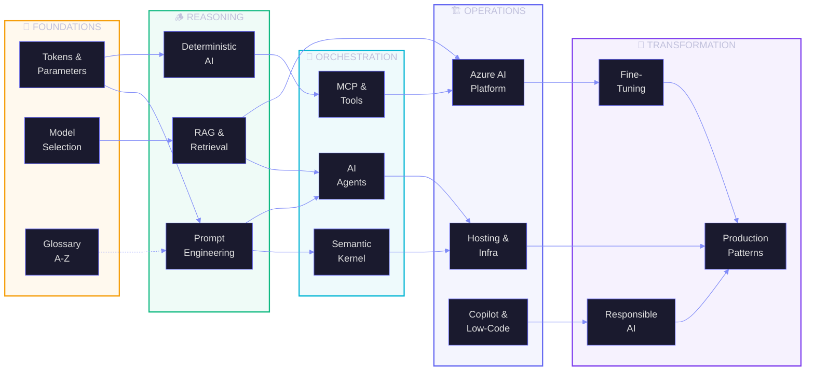
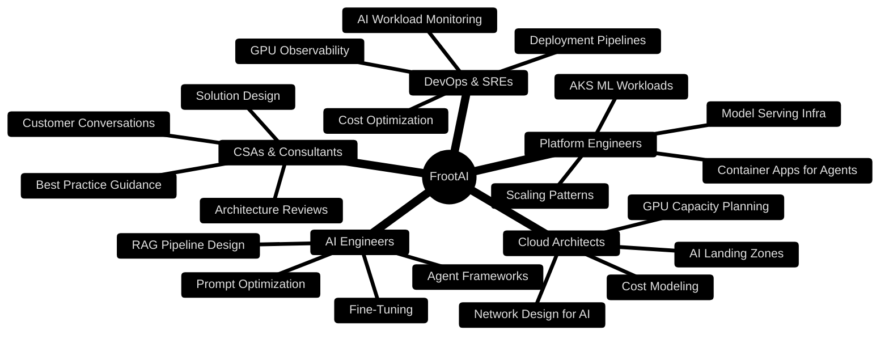

# FrootAI — From Root to Fruit

> **The open glue that binds infrastructure, platform, and application**
> The telescope and the microscope for AI architecture.
> See the big picture. Master the tiny details. Design with confidence.

---

<div align="center">



</div>

> **Modules:** 17 | **Duration:** 16–22 hours | **Level:** Beginner → Expert
> **Audience:** Cloud Architects, AI Engineers, Platform Engineers, DevOps, CSAs
> **Scope:** Everything AI — from a single token to a production agent fleet
> **Last Updated:** March 2026

---

## What is FrootAI?

**FrootAI** = **A**I **F**oundations · **R**easoning · **O**rchestration · **O**perations · **T**ransformation

You are a cloud architect. You build platforms that host workloads. But the workloads have changed. Every application is becoming AI-native — language models, retrieval pipelines, autonomous agents, copilot integrations. You need to understand the entire tree, from the **roots** (how a token becomes a thought) to the **fruit** (a production agent that serves millions).

FrootAI gives you **both lenses**:

| 🔭 Telescope (Big Picture) | 🔬 Microscope (Tiny Details) |
|---|---|
| How does an AI Landing Zone fit into enterprise architecture? | What is the difference between `top_k=40` and `top_k=10`? |
| When should I use Semantic Kernel vs Microsoft Agent Framework? | How does BPE tokenization split "unbelievable" into sub-tokens? |
| What hosting pattern works for multi-agent systems? | Why does temperature=0.0 still not guarantee determinism? |
| How do I design a RAG pipeline for 10M documents? | What is the cosine similarity threshold for relevant retrieval? |

> *"The soil is the platform. The roots are the fundamentals. The trunk is reasoning. The branches are orchestration. The canopy is operations. The fruit is transformation. You need to understand the entire tree to grow the right solutions."*

---

## The FROOT Framework

FrootAI organizes **everything** in the GenAI world into five layers — each building on the last, each essential to the whole:

```mermaid
%%{init: {'theme': 'base', 'themeVariables': {'primaryColor': '#1a1a2e', 'primaryTextColor': '#e0e0e0', 'primaryBorderColor': '#6366f1', 'lineColor': '#818cf8', 'secondaryColor': '#111118', 'tertiaryColor': '#0a0a0f', 'background': 'transparent'}}}%%
graph TB
    subgraph T["🍎 T — TRANSFORMATION<br/><i>The Fruit</i>"]
        T1["Fine-Tuning &<br/>Model Customization"]
        T2["Responsible AI<br/>& Safety"]
        T3["Production Patterns<br/>& Architecture"]
    end

    subgraph O2["🏗️ O — OPERATIONS<br/><i>The Canopy</i>"]
        O2a["Azure AI Platform<br/>& Landing Zones"]
        O2b["AI Infrastructure<br/>& Hosting"]
        O2c["Copilot Ecosystem<br/>& Low-Code"]
    end

    subgraph O1["🌿 O — ORCHESTRATION<br/><i>The Branches</i>"]
        O1a["Semantic Kernel<br/>& Frameworks"]
        O1b["AI Agents &<br/>Agent Framework"]
        O1c["MCP, Tools &<br/>Function Calling"]
    end

    subgraph R["🪵 R — REASONING<br/><i>The Trunk</i>"]
        R1["Prompt Engineering<br/>& Grounding"]
        R2["RAG Architecture<br/>& Retrieval"]
        R3["Deterministic AI<br/>& Reliability"]
    end

    subgraph F["🌱 F — FOUNDATIONS<br/><i>The Roots</i>"]
        F1["GenAI Foundations<br/>Tokens · Parameters · Transformers"]
        F2["LLM Landscape<br/>Models · Benchmarks · Selection"]
        F3["AI Glossary A–Z<br/>Every Term Defined"]
    end

    F --> R --> O1 --> O2 --> T

    style T fill:#7c3aed22,stroke:#7c3aed,stroke-width:2px
    style O2 fill:#6366f122,stroke:#6366f1,stroke-width:2px
    style O1 fill:#06b6d422,stroke:#06b6d4,stroke-width:2px
    style R fill:#10b98122,stroke:#10b981,stroke-width:2px
    style F fill:#f59e0b22,stroke:#f59e0b,stroke-width:2px
```



---

## Module Map

### 🌱 F — Foundations (The Roots)

*What AI is, how it thinks, the vocabulary you need*

| # | Module | Duration | What You'll Master |
|---|--------|----------|-------------------|
| F1 | [GenAI Foundations](./01-GenAI-Foundations.md) | 60–90 min | Transformers, attention, tokenization, inference, parameters (temperature, top-k, top-p), context windows, embeddings |
| F2 | [LLM Landscape & Model Selection](./02-LLM-Landscape.md) | 45–60 min | GPT, Claude, Llama, Gemini, Phi — benchmarks, open vs proprietary, when to use what |
| F3 | [AI Glossary A–Z](./F3-AI-Glossary-AZ.md) | Reference | **200+ terms** defined — from "ablation" to "zero-shot". The dictionary you keep open in another tab |

---

### 🪵 R — Reasoning (The Trunk)

*How to make AI think well — reliably, accurately, without hallucination*

| # | Module | Duration | What You'll Master |
|---|--------|----------|-------------------|
| R1 | [Prompt Engineering & Grounding](./08-Prompt-Engineering.md) | 60–90 min | System messages, few-shot, chain-of-thought, structured output, guardrails, function calling |
| R2 | [RAG Architecture & Retrieval](./05-RAG-Architecture.md) | 90–120 min | Chunking, embeddings, vector search, Azure AI Search, semantic ranking, reranking, hybrid search |
| R3 | [Making AI Deterministic & Reliable](./R3-Deterministic-AI.md) | 60–90 min | Hallucination reduction, grounding techniques, temperature vs top-p tuning, evaluation metrics, guardrails |

---

### 🌿 O — Orchestration (The Branches)

*Connecting AI components into intelligent systems — agents, tools, frameworks*

| # | Module | Duration | What You'll Master |
|---|--------|----------|-------------------|
| O1 | [Semantic Kernel & Orchestration](./07-Semantic-Kernel.md) | 60 min | Plugins, planners, memory, connectors, comparison with LangChain, when to use SK |
| O2 | [AI Agents & Microsoft Agent Framework](./06-AI-Agents-Deep-Dive.md) | 90–120 min | Agent concepts, planning, memory, tool use, AutoGen, multi-agent, deterministic agents |
| O3 | [MCP, Tools & Function Calling](./O3-MCP-Tools-Functions.md) | 60–90 min | Model Context Protocol, tool schemas, function calling patterns, A2A, MCP servers, registry |

---

### 🏗️ O — Operations (The Canopy)

*Running AI in production — platforms, infrastructure, hosting, low-code*

| # | Module | Duration | What You'll Master |
|---|--------|----------|-------------------|
| O4 | [Azure AI Platform & Landing Zones](./03-Azure-AI-Foundry.md) | 60–90 min | AI Foundry, Model Catalog, deployments, endpoints, AI Landing Zone, enterprise patterns |
| O5 | [AI Infrastructure & Hosting](./09-AI-Infrastructure.md) | 60–90 min | GPU compute, Container Apps, AKS, App Service, model serving, scaling, cost optimization |
| O6 | [Copilot Ecosystem & Low-Code AI](./04-Copilot-Ecosystem.md) | 45–60 min | M365 Copilot, Copilot Studio, Power Platform AI, GitHub Copilot, extensibility |

---

### 🍎 T — Transformation (The Fruit)

*Turning AI into real-world impact — safely, efficiently, at scale*

| # | Module | Duration | What You'll Master |
|---|--------|----------|-------------------|
| T1 | [Fine-Tuning & Model Customization](./T1-Fine-Tuning-MLOps.md) | 60–90 min | When to fine-tune vs RAG, LoRA, QLoRA, RLHF, DPO, evaluation, MLOps lifecycle |
| T2 | [Responsible AI & Safety](./10-Responsible-AI-Safety.md) | 45–60 min | Content safety, red teaming, guardrails, Azure AI Content Safety, evaluation frameworks |
| T3 | [Production Architecture Patterns](./T3-Production-Patterns.md) | 60–90 min | Multi-agent hosting, API gateway for AI, latency optimization, cost control, monitoring |

---

### 📋 Reference & Assessment

| # | Module | Duration | Purpose |
|---|--------|----------|---------|
| REF | [Quick Reference Cards](./11-Quick-Reference-Cards.md) | Reference | One-page cheat sheets for every concept — pin them to your wall |
| QUIZ | [Quiz & Assessment](./12-Quiz-Assessment.md) | 20 min | 25 questions covering the full FrootAI curriculum |

---

## How the FROOT Layers Connect

Every layer builds on the one below it. You **can** jump to any module — but understanding flows upward from roots to fruit:



---

## Who is This For?



---

## Learning Paths

Not sure where to start? Pick your path:

### 🚀 Path 1: "I'm New to AI" (6–8 hours)

> *Start from the roots, build understanding layer by layer*

```
F1 → F3 → F2 → R1 → R2 → R3 → QUIZ
```

### ⚡ Path 2: "I Need to Build an Agent NOW" (4–5 hours)

> *Fast-track to agent development with just enough foundation*

```
F1 (Sections 1.1–1.5) → R1 → O2 → O3 → O1 → T3
```

### 🏗️ Path 3: "I'm Designing AI Infrastructure" (5–6 hours)

> *Platform and operations focus for infra architects*

```
F1 → O4 → O5 → T3 → R2 → T1
```

### 🔍 Path 4: "I Need to Make AI Reliable" (3–4 hours)

> *Determinism, grounding, and safety — for when AI must not fail*

```
R3 → R1 → R2 → T2 → REF
```

### 🎯 Path 5: "The Complete Journey" (16–22 hours)

> *Every module, roots to fruit — become the AI architect*

```
F1 → F2 → F3 → R1 → R2 → R3 → O1 → O2 → O3 → O4 → O5 → O6 → T1 → T2 → T3 → REF → QUIZ
```

---

## The FrootAI Promise

By the time you've worked through FrootAI, you will be able to:

✅ **Explain** how a transformer turns tokens into intelligence — in 60 seconds, to any audience

✅ **Design** RAG pipelines that retrieve the right information with the right relevancy scores

✅ **Choose** between Semantic Kernel, Microsoft Agent Framework, LangChain, and direct API calls

✅ **Build** deterministic AI systems that minimize hallucination and maximize grounding

✅ **Architect** AI Landing Zones with proper networking, security, and cost controls

✅ **Deploy** agents on Container Apps, AKS, or serverless — and know the tradeoffs

✅ **Connect** AI to external systems via MCP, function calling, and tool orchestration

✅ **Evaluate** when to fine-tune vs when to RAG — and how to do both

✅ **Govern** AI responsibly with content safety, red teaming, and guardrails

✅ **Scale** production AI systems with proper monitoring, cost control, and architecture patterns

---

## Quick Navigation

<table>
<tr>
<td width="20%" align="center">

**🌱 F**

[F1: GenAI Foundations](./01-GenAI-Foundations.md)
[F2: LLM Landscape](./02-LLM-Landscape.md)
[F3: AI Glossary A-Z](./F3-AI-Glossary-AZ.md)

</td>
<td width="20%" align="center">

**🪵 R**

[R1: Prompts](./08-Prompt-Engineering.md)
[R2: RAG](./05-RAG-Architecture.md)
[R3: Determinism](./R3-Deterministic-AI.md)

</td>
<td width="20%" align="center">

**🌿 O**

[O1: Semantic Kernel](./07-Semantic-Kernel.md)
[O2: AI Agents](./06-AI-Agents-Deep-Dive.md)
[O3: MCP & Tools](./O3-MCP-Tools-Functions.md)

</td>
<td width="20%" align="center">

**🏗️ O**

[O4: Azure AI](./03-Azure-AI-Foundry.md)
[O5: Infrastructure](./09-AI-Infrastructure.md)
[O6: Copilot](./04-Copilot-Ecosystem.md)

</td>
<td width="20%" align="center">

**🍎 T**

[T1: Fine-Tuning](./T1-Fine-Tuning-MLOps.md)
[T2: Responsible AI](./10-Responsible-AI-Safety.md)
[T3: Production](./T3-Production-Patterns.md)

</td>
</tr>
</table>

---

## 🔌 FrootAI MCP Server

FrootAI is not just documentation — it's a **programmable knowledge base**. Connect it to any MCP-compatible AI agent:

```json
{
  "mcpServers": {
    "frootai": {
      "command": "node",
      "args": ["mcp-server/index.js"]
    }
  }
}
```

**5 tools available:** `list_modules` · `get_module` · `lookup_term` · `search_knowledge` · `get_architecture_pattern`

See [mcp-server/README.md](../mcp-server/README.md) for full setup instructions.

---

> **FrootAI** — *The open glue for AI architecture. From root to fruit.*
> Built with 🌳 by [Pavleen Bali](https://linkedin.com/in/pavleenbali) for the Azure community.
