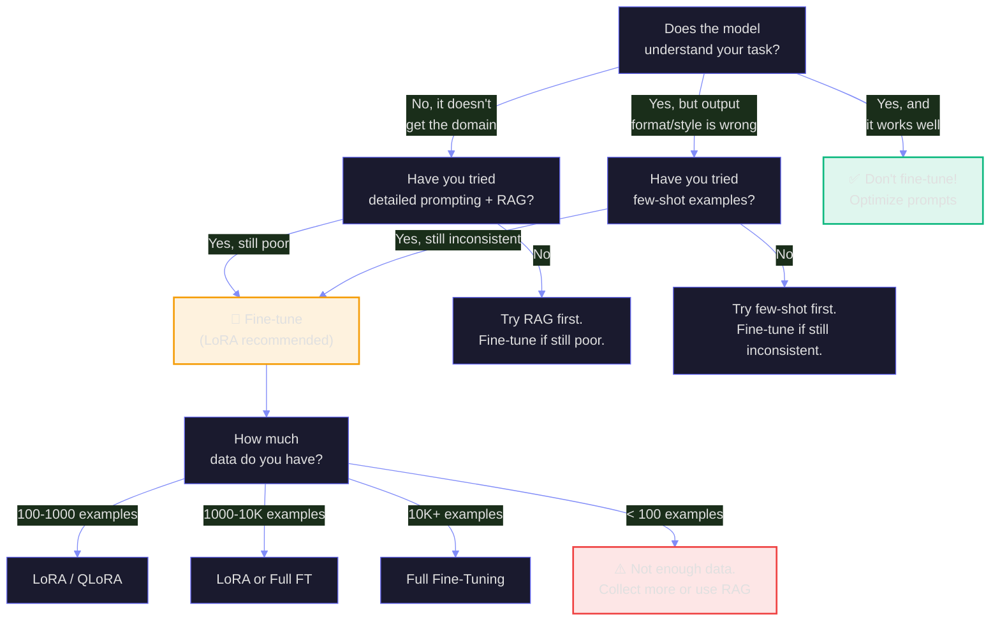
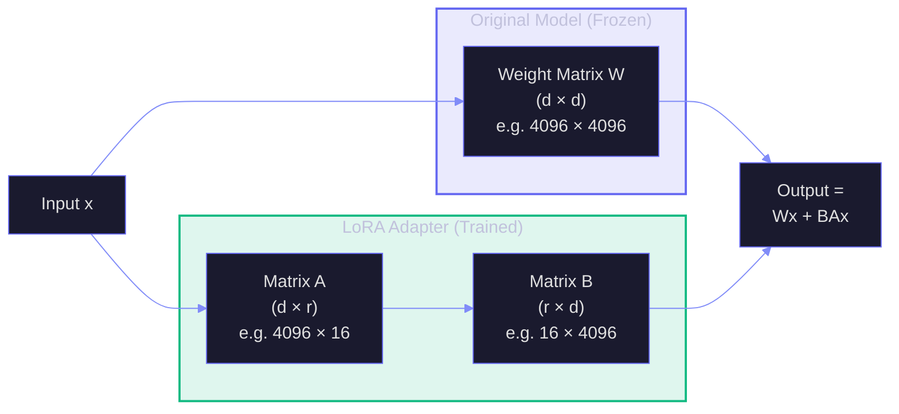
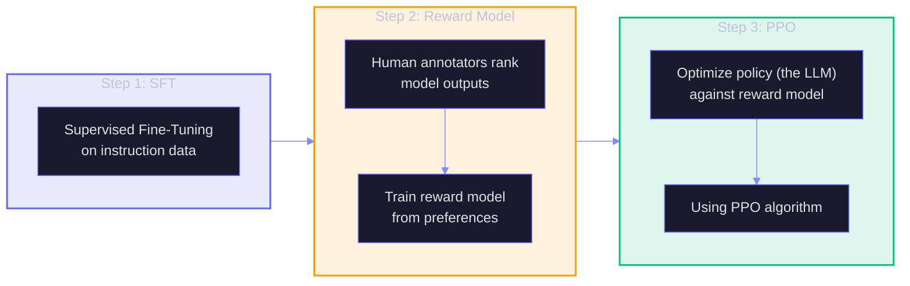
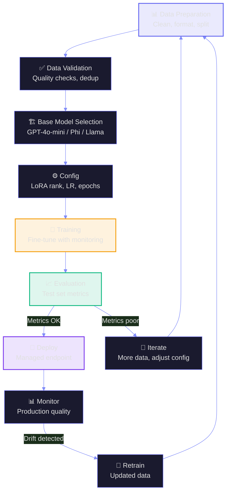
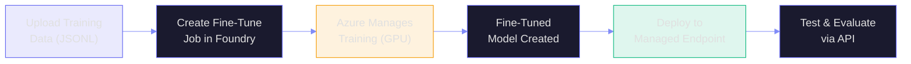
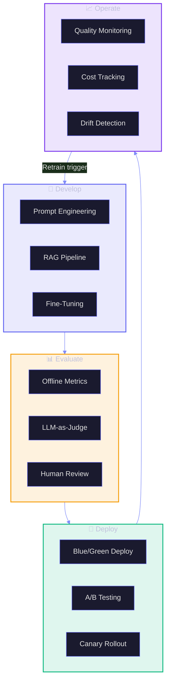

# T1: Fine-Tuning & Model Customization

> **Duration:** 60–90 minutes | **Level:** Deep-Dive
> **Part of:** 🍎 FROOT Transformation Layer
> **Prerequisites:** F1 (GenAI Foundations), F2 (LLM Landscape)
> **Last Updated:** March 2026

---

## Table of Contents

- [T1.1 The Customization Spectrum](#t11-the-customization-spectrum)
- [T1.2 When to Fine-Tune (and When Not To)](#t12-when-to-fine-tune-and-when-not-to)
- [T1.3 Fine-Tuning Methods](#t13-fine-tuning-methods)
- [T1.4 LoRA & QLoRA — The Practical Revolution](#t14-lora--qlora--the-practical-revolution)
- [T1.5 Alignment: RLHF & DPO](#t15-alignment-rlhf--dpo)
- [T1.6 Data Preparation](#t16-data-preparation)
- [T1.7 The Fine-Tuning Pipeline](#t17-the-fine-tuning-pipeline)
- [T1.8 Evaluation — Did It Work?](#t18-evaluation--did-it-work)
- [T1.9 Azure AI Foundry Fine-Tuning](#t19-azure-ai-foundry-fine-tuning)
- [T1.10 MLOps for LLMs](#t110-mlops-for-llms)
- [Key Takeaways](#key-takeaways)

---

## T1.1 The Customization Spectrum

Not every AI problem needs fine-tuning. Understanding the full spectrum of customization — from simple to complex — lets you pick the right tool:

```mermaid
%%{init: {'theme': 'base', 'themeVariables': {'primaryColor': '#1a1a2e', 'primaryTextColor': '#e0e0e0', 'primaryBorderColor': '#6366f1', 'lineColor': '#818cf8', 'background': 'transparent'}}}%%
graph LR
    subgraph SIMPLE["Low Effort / Low Control"]
        A["Prompt<br/>Engineering"]
        B["Few-Shot<br/>Examples"]
    end
    
    subgraph MEDIUM["Medium Effort / Medium Control"]
        C["RAG<br/>(Retrieval)"]
        D["System<br/>Instructions"]
    end
    
    subgraph ADVANCED["High Effort / High Control"]
        E["LoRA / QLoRA<br/>Fine-Tuning"]
        F["Full<br/>Fine-Tuning"]
    end
    
    subgraph EXTREME["Extreme Effort / Maximum Control"]
        G["Continued<br/>Pre-Training"]
        H["Training<br/>From Scratch"]
    end
    
    A --> B --> C --> D --> E --> F --> G --> H
    
    style SIMPLE fill:#10b98122,stroke:#10b981,stroke-width:2px
    style MEDIUM fill:#06b6d422,stroke:#06b6d4,stroke-width:2px
    style ADVANCED fill:#f59e0b22,stroke:#f59e0b,stroke-width:2px
    style EXTREME fill:#ef444422,stroke:#ef4444,stroke-width:2px
```



| Method | Effort | Data Needed | Cost | When to Use |
|--------|--------|-------------|------|-------------|
| **Prompt Engineering** | Minutes | 0 | Free | Always start here |
| **Few-Shot Examples** | Hours | 5–20 examples | Minimal | When output format matters |
| **RAG** | Days | Your knowledge base | Medium | When accuracy on specific data matters |
| **System Instructions** | Hours | Rules & constraints | Free | When behavioral alignment matters |
| **LoRA Fine-Tuning** | Days-Weeks | 100–10K examples | $50–$500 | When domain language/style matters |
| **Full Fine-Tuning** | Weeks | 10K–100K examples | $1K–$50K | When deep behavioral change needed |
| **Continued Pre-Training** | Weeks-Months | Millions of tokens | $10K–$1M | New domain/language |
| **Training From Scratch** | Months-Years | Trillions of tokens | $1M–$100M+ | Only for frontier labs |

---

## T1.2 When to Fine-Tune (and When Not To)

### The Decision Framework



### Fine-Tune When

| Use Case | Why Fine-Tuning Helps | Example |
|----------|----------------------|---------|
| **Domain-specific language** | Model needs to understand jargon | Medical terminology, legal language |
| **Consistent output format** | Need reliable structure despite varying inputs | Always output XML in a specific schema |
| **Behavioral alignment** | Model should act in a specific way consistently | Always formal, always cites sources |
| **Cost reduction** | Replace long prompts with trained behavior | 2000-token system message → fine-tuned, save $$ |
| **Latency reduction** | Shorter prompts = faster responses | Remove few-shot examples from every call |

### Don't Fine-Tune When

| Situation | Better Alternative |
|-----------|-------------------|
| Model needs current/changing data | RAG |
| You have <100 examples | Few-shot prompting |
| The issue is prompt clarity | Better prompts |
| You need quick iteration | Prompt engineering |
| You want to add new knowledge | RAG, not fine-tuning |

> **Critical Insight:** Fine-tuning teaches the model **how** to respond, not **what** to know. For new knowledge, use RAG. For new behavior, use fine-tuning. For both, combine RAG + fine-tuning.

---

## T1.3 Fine-Tuning Methods

### Full Fine-Tuning

Updates **all** model parameters. Most powerful but most expensive.

| Aspect | Detail |
|--------|--------|
| **Parameters updated** | All (7B = 7 billion, 70B = 70 billion) |
| **GPU requirements** | 4–8x A100/H100 (80GB) for 7B, 32+ for 70B |
| **Training data** | 10K–100K examples ideal |
| **Risk** | Catastrophic forgetting — model loses general capabilities |
| **When to use** | When you need deep behavioral change AND have enough data |

### LoRA (Low-Rank Adaptation)

The **most practical** fine-tuning technique. Freezes original weights and trains small adapter matrices.



| LoRA Parameter | Typical Value | Effect |
|----------------|---------------|--------|
| **Rank (r)** | 8–64 | Higher = more expressive, more compute |
| **Alpha** | 16–128 | Scaling factor, usually alpha = 2 × rank |
| **Target modules** | q_proj, v_proj, k_proj, o_proj | Which attention matrices to adapt |
| **Dropout** | 0.05–0.1 | Regularization to prevent overfitting |

### QLoRA (Quantized LoRA)

LoRA applied to a **4-bit quantized** base model. The democratizer of fine-tuning.

| Comparison | LoRA | QLoRA |
|-----------|------|-------|
| **Base model format** | FP16/BF16 | NF4 (4-bit) |
| **Memory for 7B model** | ~14 GB | ~4 GB |
| **Memory for 70B model** | ~140 GB | ~35 GB |
| **Quality loss** | None vs full FT | <1% vs LoRA |
| **GPU required** | A100 40GB+ | RTX 4090 (24GB) |

---

## T1.4 LoRA & QLoRA — The Practical Revolution

### Why LoRA Changed Everything

Before LoRA (2023): fine-tuning a 7B model required 4x A100 GPUs ($30K+ in hardware). Fine-tuning 70B? Enterprise-only.

After LoRA: fine-tune 7B on a single consumer GPU. Fine-tune 70B on a single A100. Adapters are 10-100MB (instead of the full model at 14-140GB).

```
Full Fine-Tuning:  70B × 2 bytes (FP16) = 140 GB VRAM  → Need 32x A100
LoRA:              70B frozen + 0.1B trained = ~140 GB + ~200 MB → Need 4x A100
QLoRA:             70B in 4-bit + 0.1B trained = ~35 GB + ~200 MB → Need 1x A100
```

### LoRA Best Practices

| Practice | Recommendation | Why |
|----------|---------------|-----|
| Start with low rank | r=8 or r=16 | Most tasks don't need high rank |
| Target attention layers | q_proj, v_proj minimum | Most impactful for behavioral change |
| Set alpha = 2 × rank | alpha=32 for r=16 | Good balance of adapter influence |
| Use learning rate | 1e-4 to 2e-4 | Lower than full FT to avoid instability |
| Train for 1-3 epochs | More risks overfitting | Monitor eval loss, stop when it rises |
| Validate frequently | Every 100-500 steps | Catch overfitting early |

---

## T1.5 Alignment: RLHF & DPO

### RLHF (Reinforcement Learning from Human Feedback)

The technique that turned GPT-3 into ChatGPT:



### DPO (Direct Preference Optimization)

A simpler alternative that skips the reward model:

| Aspect | RLHF | DPO |
|--------|------|-----|
| **Complexity** | 3-step pipeline | Single training step |
| **Reward model** | Required (separate training) | Not needed |
| **Stability** | Can be finicky (PPO training) | More stable |
| **Data needed** | Preference pairs + reward model data | Preference pairs only |
| **Quality** | Gold standard | Comparable (sometimes better) |
| **Adoption** | ChatGPT, Claude | Llama 3, Zephyr, many open models |

### Preference Data Format

```json
{
  "prompt": "Explain what a token is in the context of LLMs.",
  "chosen": "A token is the smallest unit of text that a language model processes. Rather than reading individual characters, models break text into subword units called tokens using algorithms like Byte-Pair Encoding (BPE). For example, 'unbelievable' might become ['un', 'believ', 'able']. In GPT-4, one token averages about 4 English characters. Token count matters because it determines both the cost and the context window usage.",
  "rejected": "A token is basically a word. Like when you type 'hello world' that's 2 tokens. Tokens are used by AI."
}
```

---

## T1.6 Data Preparation

Data quality is **more important than data quantity** for fine-tuning. A thousand excellent examples outperform ten thousand mediocre ones.

### Data Format (Chat Format)

```jsonl
{"messages": [{"role": "system", "content": "You are an Azure architect..."}, {"role": "user", "content": "What's the best VM for a SQL workload?"}, {"role": "assistant", "content": "For SQL workloads, I recommend..."}]}
{"messages": [{"role": "system", "content": "You are an Azure architect..."}, {"role": "user", "content": "Explain Azure Front Door."}, {"role": "assistant", "content": "Azure Front Door is a global..."}]}
```

### Data Quality Checklist

| Check | Why It Matters | How to Verify |
|-------|---------------|---------------|
| **Diverse inputs** | Prevent overfitting to patterns | Cluster queries by type, ensure coverage |
| **High-quality outputs** | Model learns from examples | Expert review of assistant messages |
| **Consistent format** | Reinforces desired structure | Schema validation on outputs |
| **No contradictions** | Confuses the model | Deduplication and consistency check |
| **Balanced classes** | Prevents bias toward over-represented types | Category distribution analysis |
| **Length variety** | Handles both short and long responses | Histogram of response lengths |
| **Edge cases** | Teaches robust behavior | Include tricky/ambiguous examples (10-20%) |

### How Much Data?

| Model Size | Minimum | Good | Excellent |
|-----------|---------|------|-----------|
| **7B** | 100 examples | 500–1,000 | 5,000+ |
| **13B** | 200 examples | 1,000–2,000 | 10,000+ |
| **70B** | 500 examples | 2,000–5,000 | 20,000+ |

---

## T1.7 The Fine-Tuning Pipeline



---

## T1.8 Evaluation — Did It Work?

### Evaluation Framework

| Metric | What It Measures | How to Compute | Target |
|--------|-----------------|----------------|--------|
| **Loss (eval)** | Training convergence | Built into training | Decreasing, not diverging |
| **Accuracy** | Correct answers on test set | Compare to ground truth | >85% for most tasks |
| **Format compliance** | Follows output format | Schema validation | >98% |
| **Regression check** | Didn't break general capability | Test on general benchmarks | <5% degradation |
| **Human preference** | Humans prefer fine-tuned vs base | A/B blind evaluation | >60% prefer fine-tuned |
| **Task-specific** | Domain-relevant metrics | Task-dependent | Improvement vs base |

### A/B Evaluation Pattern

```
1. Prepare 100 test prompts (not in training data)
2. Generate responses from BOTH base model and fine-tuned model
3. Randomize order (evaluator doesn't know which is which)
4. Expert evaluators score each response 1-5 on:
   - Accuracy
   - Relevance
   - Format compliance
   - Helpfulness
5. Compare aggregate scores
6. Fine-tuned should win on task-specific metrics
   without significant regression on general metrics
```

---

## T1.9 Azure AI Foundry Fine-Tuning

Azure AI Foundry supports fine-tuning several model families:

| Model | Fine-Tuning Support | Method | Min Data |
|-------|-------------------|--------|----------|
| **GPT-4o** | ✅ Managed | Full FT | 10 examples (50+ recommended) |
| **GPT-4o-mini** | ✅ Managed | Full FT | 10 examples |
| **Phi-4** | ✅ Managed | LoRA | 100 examples |
| **Llama 3.1** | ✅ Managed | LoRA | 100 examples |
| **Mistral** | ✅ Managed | LoRA | 100 examples |

### Azure Fine-Tuning Flow



### Cost Estimation

| Model | Training Cost | Hosting Cost |
|-------|--------------|-------------|
| **GPT-4o-mini** | ~$3.00/1M training tokens | Standard PAYG pricing |
| **GPT-4o** | ~$25.00/1M training tokens | Standard PAYG pricing |
| **Phi-4 (14B)** | Compute hours (GPU reservation) | Managed compute pricing |

---

## T1.10 MLOps for LLMs

### The LLMOps Lifecycle



### Key LLMOps Tools

| Tool | Purpose | Integration |
|------|---------|-------------|
| **Azure AI Foundry** | Model management, fine-tuning, evaluation | Native Azure |
| **MLflow** | Experiment tracking, model registry | Open source, Azure-integrated |
| **Prompt Flow** | Prompt development and evaluation | Azure AI Foundry, VS Code |
| **GitHub Actions** | CI/CD for model pipelines | Azure-integrated |
| **Azure Monitor** | Production observability | Native Azure |
| **LangSmith / LangFuse** | LLM-specific tracing and evaluation | Open source alternatives |

---

## Key Takeaways

:::tip The Five Rules of Model Customization
1. **Start with prompts, not fine-tuning.** 80% of problems are solved with better prompts + RAG. Fine-tune only when you've exhausted simpler options.
2. **LoRA is the default.** Unless you have a specific reason for full fine-tuning, LoRA or QLoRA gives you 95% of the quality at 5% of the cost.
3. **Data quality > data quantity.** 500 expert-curated examples beat 50,000 mediocre ones. Invest in data preparation.
4. **Always evaluate rigorously.** Don't just check if fine-tuning "feels better" — measure accuracy, format compliance, and regression on general capability.
5. **Fine-tuning teaches HOW, not WHAT.** For new knowledge, use RAG. For new behavior/style/format, use fine-tuning. For both, combine them.
:::

---

> **FrootAI T1** — *Fine-tuning is the art of teaching a model your language. LoRA made it accessible. QLoRA made it affordable. Good data makes it work.*
