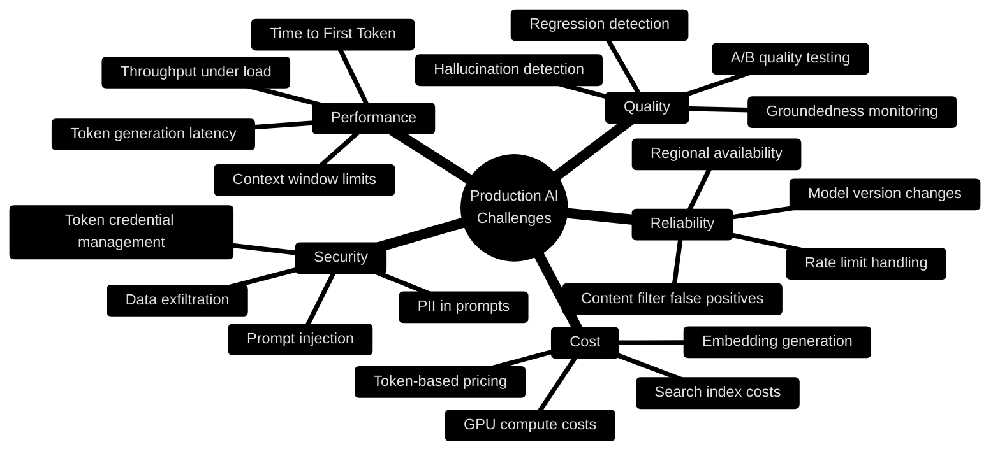
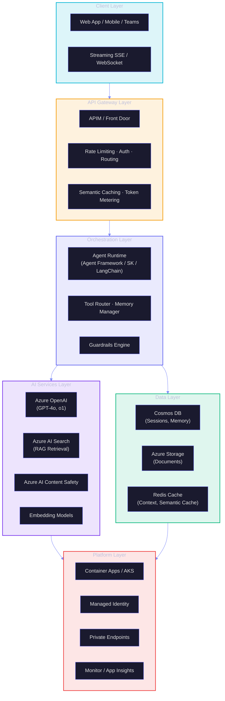
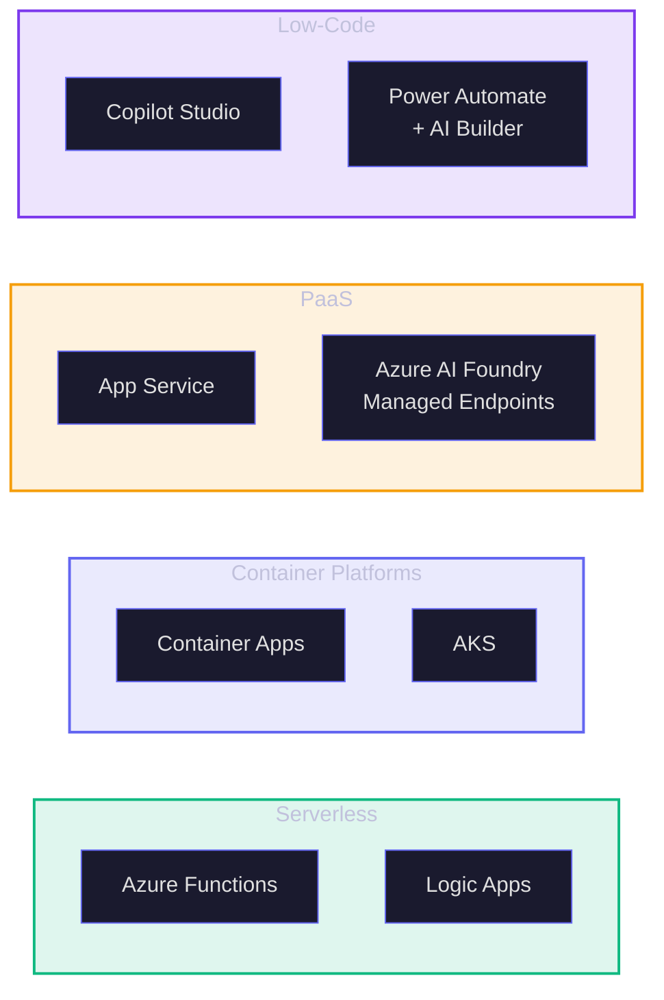
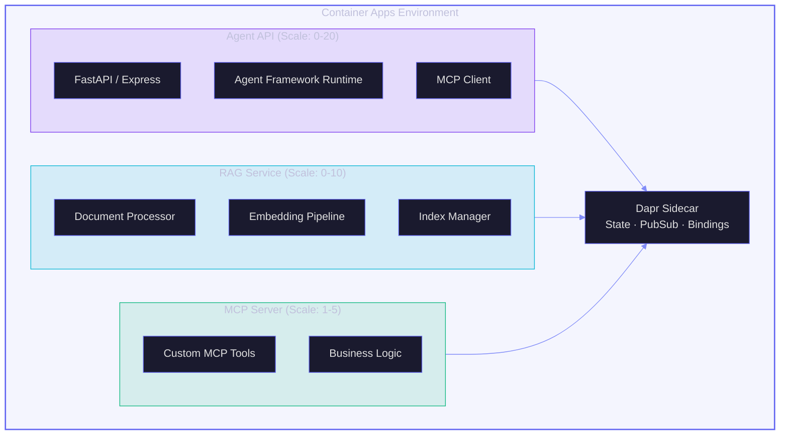
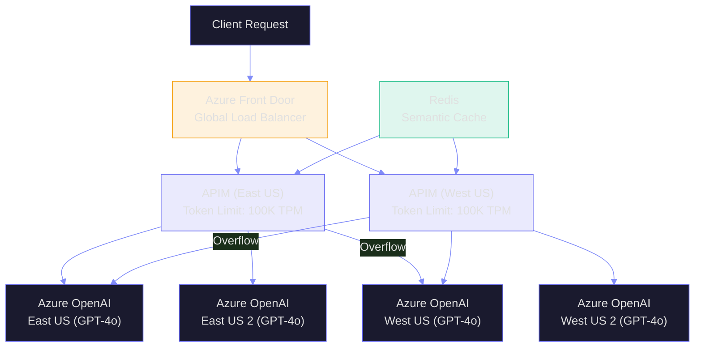
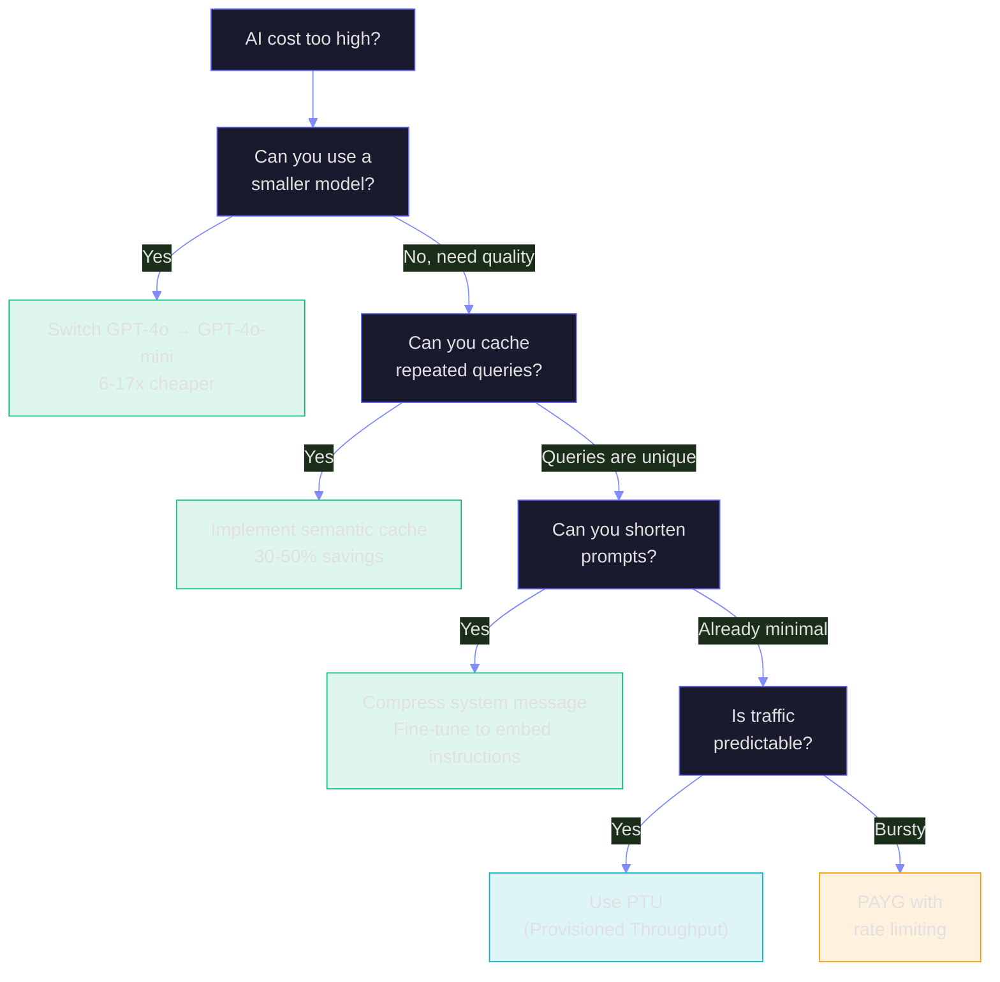
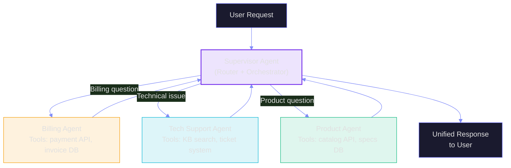
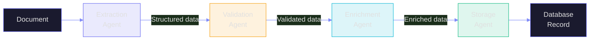
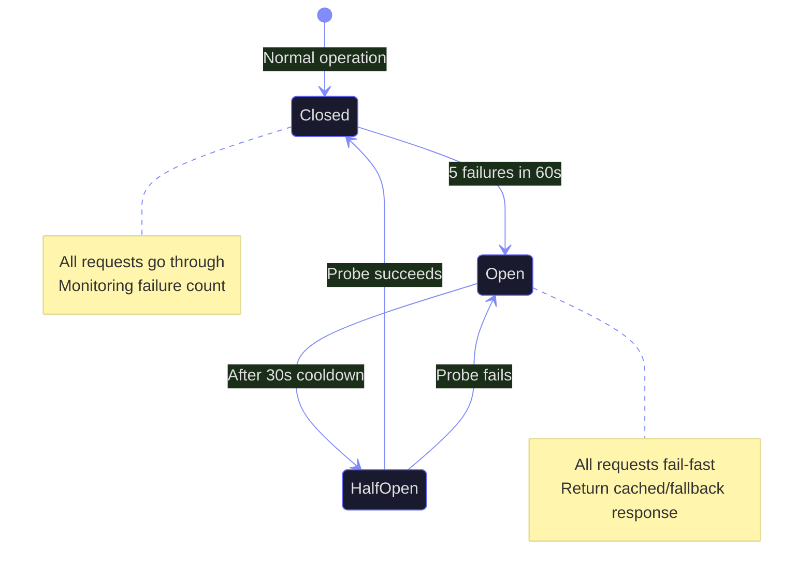

# T3: Production Architecture Patterns

> **Duration:** 60–90 minutes | **Level:** Strategic
> **Part of:** 🍎 FROOT Transformation Layer
> **Prerequisites:** O4 (Azure AI Platform), O5 (AI Infrastructure)
> **Last Updated:** March 2026

---

## Table of Contents

- [T3.1 Production AI is Different](#t31-production-ai-is-different)
- [T3.2 The AI Application Architecture Stack](#t32-the-ai-application-architecture-stack)
- [T3.3 Hosting Patterns: Where Agents Live](#t33-hosting-patterns-where-agents-live)
- [T3.4 API Gateway for AI](#t34-api-gateway-for-ai)
- [T3.5 Latency Optimization Patterns](#t35-latency-optimization-patterns)
- [T3.6 Cost Control Architecture](#t36-cost-control-architecture)
- [T3.7 Multi-Agent Production Patterns](#t37-multi-agent-production-patterns)
- [T3.8 Monitoring & Observability for AI](#t38-monitoring--observability-for-ai)
- [T3.9 Resilience Patterns](#t39-resilience-patterns)
- [T3.10 The Production Readiness Checklist](#t310-the-production-readiness-checklist)
- [Key Takeaways](#key-takeaways)

---

## T3.1 Production AI is Different

Your POC worked beautifully in the demo. Now you need to serve 10,000 users concurrently, handle API rate limits, manage costs, respond in under 2 seconds, never hallucinate on financial data, and stay available 99.9% of the time.

Welcome to production AI.



---

## T3.2 The AI Application Architecture Stack

Every production AI system has these layers. Missing any one of them is a production incident waiting to happen.



---

## T3.3 Hosting Patterns: Where Agents Live

### Pattern Comparison



### Decision Matrix

| Criterion | Container Apps | AKS | App Service | Functions | Copilot Studio |
|-----------|---------------|-----|-------------|-----------|----------------|
| **Complexity** | Low-Medium | High | Low | Low | Very Low |
| **Scaling** | Auto (0→N) | Auto (custom) | Manual/Auto | Auto (0→N) | Managed |
| **GPU Support** | ✅ Preview | ✅ Full | ❌ | ❌ | N/A |
| **Long-running** | ✅ | ✅ | ✅ | ⚠️ (max 10 min) | ✅ |
| **WebSocket/SSE** | ✅ | ✅ | ✅ | ❌ | ✅ |
| **Dapr sidecar** | ✅ Built-in | ✅ Add-on | ❌ | ❌ | N/A |
| **Cost at scale** | 💰💰 | 💰💰💰 | 💰💰 | 💰 | 💰💰 |
| **Best for** | AI APIs, agents | ML serving, multi-model | Simple APIs | Event-driven AI | Business users |

### Container Apps — The Sweet Spot for Most AI Workloads



---

## T3.4 API Gateway for AI

Azure API Management (APIM) becomes critical for production AI — it's the **control plane** for all AI traffic.

### AI Gateway Capabilities

| Capability | What It Does | Why It Matters |
|------------|-------------|----------------|
| **Semantic Caching** | Cache similar queries, not just identical ones | 30-50% cost reduction on repeated patterns |
| **Token Rate Limiting** | Limit tokens/minute per user or app | Prevent runaway costs |
| **Load Balancing** | Distribute across multiple Azure OpenAI instances | Handle rate limits, improve availability |
| **Circuit Breaking** | Stop calling failing endpoints | Protect against cascading failures |
| **Token Metering** | Track token consumption per user/team | Cost allocation and chargeback |
| **Content Safety** | Pre-screen requests before they hit models | Prevent policy violations |
| **Prompt Injection Detection** | Detect and block injection attempts | Security guardrail |

### Multi-Region AI Gateway



---

## T3.5 Latency Optimization Patterns

### Where Latency Hides

| Component | Typical Latency | Optimization |
|-----------|----------------|-------------|
| **Network to AOAI** | 10-50ms | Private endpoints, regional affinity |
| **Token generation** | 20-80ms per token | Smaller model, shorter output, PTU |
| **Embedding generation** | 50-200ms | Batch, cache frequently used |
| **Vector search** | 10-50ms | HNSW index, filter before search |
| **Reranking** | 100-500ms | Limit to top-20 candidates |
| **Total RAG pipeline** | 500ms-3s | Parallel retrieval, streaming |

### Streaming for Perceived Performance

Instead of waiting for the full response, stream tokens to the user as they're generated:

```
Without streaming:  [---- 3 seconds of nothing ----] Full response appears
With streaming:     H-e-l-l-o-,- -h-e-r-e-'-s- -y-o-u-r- -a-n-s-w-e-r-... (progressive)
```

TTFT (Time To First Token) drops from 3s to ~200ms. The user sees progress immediately.

### Caching Strategies

| Cache Type | What It Caches | Hit Rate | Savings |
|------------|---------------|----------|---------|
| **Exact cache** | Identical queries | 5-10% | 100% per hit |
| **Semantic cache** | Similar queries (embedding similarity) | 20-40% | 100% per hit |
| **Embedding cache** | Document embeddings | 80%+ | Avoid re-embedding |
| **Context cache** | RAG retrieval results | 30-50% | Skip retrieval step |

---

## T3.6 Cost Control Architecture

### Token Economics

```
Cost per request = (input_tokens × input_rate) + (output_tokens × output_rate)

Example (GPT-4o, March 2026):
  System message:      800 tokens  × $2.50/1M = $0.002
  User message:        200 tokens  × $2.50/1M = $0.0005
  RAG context:       2,000 tokens  × $2.50/1M = $0.005
  Output:              500 tokens  × $10.00/1M = $0.005
  ─────────────────────────────────────────────────────
  Total per request:                              $0.0125

  At 100K requests/day = $1,250/day = $37,500/month
```

### Cost Optimization Decision Tree



---

## T3.7 Multi-Agent Production Patterns

### Pattern 1: Supervisor Agent



**When:** Clear domain boundaries, need routing intelligence, want centralized control.

### Pattern 2: Pipeline (Sequential Handoff)



**When:** Document processing, data pipelines, workflows with clear sequential steps.

### Pattern 3: Swarm (Peer-to-Peer)

**When:** Creative tasks, complex reasoning, research — agents negotiate and collaborate without a central controller.

### Hosting Multi-Agent: The Microservices Approach

```
Agent 1 (Supervisor)   → Container App (scale 2-10)
Agent 2 (Billing)      → Container App (scale 0-5)
Agent 3 (Tech Support) → Container App (scale 0-5)
Agent 4 (Product)      → Container App (scale 0-5)

Communication: Dapr pub/sub (async) or HTTP (sync)
State: Cosmos DB (conversation memory)
Observability: Application Insights (distributed tracing)
```

---

## T3.8 Monitoring & Observability for AI

### The AI Observability Stack

| Layer | What to Monitor | Tool |
|-------|----------------|------|
| **Infrastructure** | CPU, memory, GPU, network | Azure Monitor, Container Insights |
| **API** | Latency, throughput, errors, rate limits | APIM Analytics, App Insights |
| **Model** | Token usage, TTFT, quality scores | Custom metrics in App Insights |
| **Quality** | Hallucination rate, groundedness, relevance | LLM evaluation pipeline |
| **Cost** | Token consumption, cost per request, per user | Cost Management + custom dashboards |
| **Safety** | Content filter triggers, injection attempts | Azure AI Content Safety logs |

### Key Metrics Dashboard

| Metric | Formula | Alert Threshold |
|--------|---------|-----------------|
| **TTFT P95** | 95th percentile Time To First Token | >1 second |
| **Total Latency P95** | 95th percentile end-to-end | >5 seconds |
| **Token Cost/Request** | Total tokens × rate / request count | >$0.05/request |
| **Error Rate** | Failed requests / total requests | >2% |
| **Rate Limit Hits** | 429 responses / total requests | >5% |
| **Groundedness Score** | Avg score from evaluation pipeline | <0.85 |
| **User Satisfaction** | Thumbs up / (thumbs up + thumbs down) | <80% |

---

## T3.9 Resilience Patterns

### Circuit Breaker for AI Endpoints



### Fallback Chain

```
Primary:    Azure OpenAI (East US) GPT-4o
  ↓ (429 or 500)
Fallback 1: Azure OpenAI (West US) GPT-4o
  ↓ (429 or 500)
Fallback 2: Azure OpenAI (East US) GPT-4o-mini (degraded quality, lower cost)
  ↓ (both down)
Fallback 3: Cached response for similar queries
  ↓ (no cache hit)
Fallback 4: "I'm experiencing high demand. Please try again shortly."
```

---

## T3.10 The Production Readiness Checklist

Before going live, verify every item:

### Architecture & Infrastructure

- [ ] Hosting platform selected (Container Apps / AKS / App Service)
- [ ] Private endpoints for all AI services
- [ ] Managed Identity (no API keys in code)
- [ ] Multi-region deployment (if SLA requires >99.9%)
- [ ] Auto-scaling configured with appropriate min/max
- [ ] Load testing completed at 2x expected peak

### Security

- [ ] Prompt injection detection enabled
- [ ] Content Safety filters configured
- [ ] Input validation on all user inputs
- [ ] PII detection and redaction
- [ ] RBAC configured with least privilege
- [ ] Audit logging for all AI interactions

### Quality & Reliability

- [ ] Evaluation pipeline running (offline + online)
- [ ] Hallucination rate measured and <5%
- [ ] Groundedness score >0.85
- [ ] Circuit breaker and fallback chain configured
- [ ] Rate limiting per user/application
- [ ] Retry with exponential backoff for transient errors

### Cost Management

- [ ] Token budget per user/team configured
- [ ] Cost alerts at 50%, 80%, 100% of budget
- [ ] Semantic caching for common queries
- [ ] Model tier optimization (mini for simple, full for complex)
- [ ] Cost dashboard accessible to stakeholders

### Monitoring & Operations

- [ ] Application Insights with custom AI metrics
- [ ] Distributed tracing across agent interactions
- [ ] Alerts for latency, errors, cost, quality degradation
- [ ] Runbook for common incidents (rate limits, model outage)
- [ ] On-call rotation for AI-specific issues

---

## Key Takeaways

:::tip The Five Rules of Production AI Architecture
1. **AI is an API problem, not a magic problem.** Apply the same engineering rigor you'd use for any production API — rate limiting, caching, circuit breaking, monitoring.
2. **Container Apps is the sweet spot.** For most AI agent workloads, Container Apps gives you auto-scaling (including zero), Dapr integration, and managed infrastructure without Kubernetes complexity.
3. **APIM is your AI control plane.** Semantic caching, token metering, load balancing across regions, and prompt injection detection — all in one gateway.
4. **Stream everything.** Users don't mind waiting 3 seconds for an answer if they see tokens appearing after 200ms. Streaming is non-negotiable for interactive AI.
5. **Cost is the silent killer.** A runaway AI agent can burn through thousands of dollars in hours. Token budgets, semantic caching, and model tier optimization are as important as the AI logic itself.
:::

---

> **AIFROOT T3** — *Production AI is where engineering meets intelligence. Build it like infrastructure. Monitor it like a service. Budget it like a business.*
