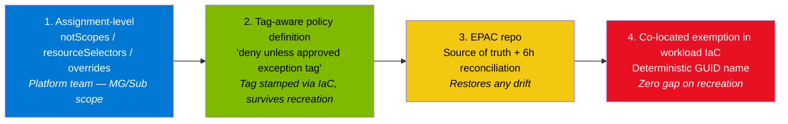

# Durable, Fine-Grained Azure Policy Exemptions for IaC Workflows

> **Problem.** Azure Policy exemptions scoped to a resource or resource group are lost when IaC recreates the target. To stay durable, teams move exemptions up to subscription scope — but that breaks least privilege by exempting more than intended.
>
> **This guide.** A short, layered design that gives you both **durability** and **fine-grained scope**, without using broad subscription-level exemptions.

---

## 1. Why exemptions disappear

`Microsoft.Authorization/policyExemptions` is an **extension resource** bound to the lifecycle of its target. Three facts to internalize:

- Recreate the resource (or the resource group) → the exemption is cascade-deleted with the parent.
- A Bicep deployment at RG scope in **Complete mode** removes any out-of-band exemption in that RG.
- `resourceSelectors` on exemptions are limited to `resourceType`, `resourceLocation`, `resourceWithoutLocation`, and (preview) identity-based selectors. **None** of them re-bind an exemption to a recreated resource by name.

So Azure does not offer a native "durable + fine-grained" exemption primitive. The answer is to change the *design*, not the exemption type.

---

## 2. Four mechanisms — pick the right one for the job

| # | Mechanism | When to use | Durable? | Fine-grained? | Carries audit metadata? |
|---|---|---|---|---|---|
| 1 | **`notScopes` / `resourceSelectors` / `overrides` on the assignment** | Stable, permanent platform exclusions (jump-box RG, DMZ, lab subscription) | ✅ | Resource ID list / type / location | ❌ |
| 2 | **Tag-driven self-exclusion in the policy definition** | Workload-managed exceptions that must survive any IaC churn | ✅ (tag travels in IaC) | Per resource via approved tag value | ⚠️ Partial — via tag values |
| 3 | **EPAC (Enterprise Policy as Code) reconciliation** | Authoritative, audited fine-grained exemptions; source of truth in git | ✅ (scheduled pipeline restores drift) | Per resource / per RG | ✅ Full |
| 4 | **Co-located exemption in workload IaC, deterministic name** | Zero-gap atomic recreation alongside the target | ✅ (recreated with target) | Per resource | ✅ Full |

There is no single primitive that wins on every column. The recommended pattern combines them.

---

## 3. Recommended pattern



| Use… | When |
|---|---|
| **Layer 1** | The exclusion is permanent and well-known. No ticket needed. |
| **Layer 2** | Workload teams need to self-exempt without a platform-team PR. The policy logic *is* the durable anchor. |
| **Layer 3** | The exception needs an audit trail, time-box, and approval review. EPAC keeps state honest even if a workload accidentally wipes the exemption. |
| **Layer 4** | The exemption must be re-created the instant the target is re-created (no eventual-consistency window). |

For most enterprises, **Layer 2 (tag-aware policy) + Layer 3 (EPAC)** removes the need for subscription-level exemptions entirely.

---

## 4. Layer 2 — tag-aware policy definition (the durability anchor)

The exception is encoded in the policy rule. Because the tag travels with the workload IaC, recreation re-stamps the tag, and the resource stays carved-out automatically. **No exemption object is required.**

```json
{
  "properties": {
    "displayName": "Storage accounts must use private endpoints unless approved exception tag is present",
    "mode": "Indexed",
    "parameters": {
      "exemptionTagName": {
        "type": "String",
        "defaultValue": "policyExceptionId"
      },
      "approvedExemptionIds": {
        "type": "Array",
        "metadata": { "description": "List of approved exception IDs that opt a resource out of this control." }
      }
    },
    "policyRule": {
      "if": {
        "allOf": [
          { "field": "type", "equals": "Microsoft.Storage/storageAccounts" },
          { "field": "Microsoft.Storage/storageAccounts/publicNetworkAccess", "notEquals": "Disabled" },
          {
            "not": {
              "field": "[concat('tags[', parameters('exemptionTagName'), ']')]",
              "in": "[parameters('approvedExemptionIds')]"
            }
          }
        ]
      },
      "then": { "effect": "deny" }
    }
  }
}
```

Pair with a companion `audit` policy that requires `policyExceptionId`, `exceptionTicket`, and `exceptionExpiry` tags to **all be present together**, so the carve-out cannot be used without ticket + expiry.

Use `modify` to inherit the tag from the resource group where appropriate, so workload templates do not need to stamp it per resource.

---

## 5. Layer 4 — co-located exemption in workload IaC

When you need a real `policyExemption` object (for compliance reporting or because the policy is a built-in you cannot replace), put it in the **same Bicep / Terraform module** as the resource, with a **deterministic name** so it is idempotent across redeploys.

```bicep
@description('Storage account intentionally exempt from the require-private-endpoint policy.')
param storageAccountName string
param location string
param policyAssignmentId string
param exemptionTicket string
param exemptionExpiresOn string  // ISO 8601, e.g. 2026-12-31T23:59:59Z

resource storage 'Microsoft.Storage/storageAccounts@2024-01-01' = {
  name: storageAccountName
  location: location
  sku: { name: 'Standard_LRS' }
  kind: 'StorageV2'
  properties: {
    publicNetworkAccess: 'Enabled'   // the reason we need the exemption
    minimumTlsVersion: 'TLS1_2'
    allowBlobPublicAccess: false
  }
}

// Deterministic GUID => idempotent across deploys; recreated atomically with the target.
resource exemption 'Microsoft.Authorization/policyExemptions@2022-07-01-preview' = {
  name: guid('policy-exemption', policyAssignmentId, storage.id, 'requirePrivateEndpoint')
  scope: storage
  properties: {
    policyAssignmentId: policyAssignmentId
    exemptionCategory: 'Waiver'   // or 'Mitigated' if a compensating control exists
    displayName: 'Waiver: ${storageAccountName} — public access required for partner ingestion'
    description: 'Approved by Cloud Security Council. Ticket ${exemptionTicket}.'
    expiresOn: exemptionExpiresOn
    policyDefinitionReferenceIds: [ 'storageAccountsShouldDisablePublicNetworkAccess' ]
    metadata: {
      approvalTicket: exemptionTicket
      compensatingControl: 'IP allow-list on storage firewall'
    }
  }
}
```

Why this works: the `guid()` function produces the same name on every deploy, so the exemption is updated in place rather than orphaned, and it is recreated in the **same** template that recreates `storage` — no gap window.

---

## 6. Layer 3 — EPAC as the safety net

[Enterprise Policy as Code (EPAC)](https://github.com/Azure/enterprise-azure-policy-as-code) treats definitions, assignments, and **exemptions** as code in a git repo. A scheduled pipeline reconciles real state to declared state, restoring anything that workload IaC accidentally removed.

```jsonc
// Definitions/policyExemptions/prod/waivers.jsonc
{
  "exemptions": [
    {
      "name": "partner-ingestion-storage-waiver",
      "displayName": "Waiver: partner-ingestion storage public access",
      "exemptionCategory": "Waiver",
      "scope": "/subscriptions/<subId>/resourceGroups/rg-partner-ingest/providers/Microsoft.Storage/storageAccounts/stpartneringest",
      "policyAssignmentId": "/providers/Microsoft.Management/managementGroups/<mg>/providers/Microsoft.Authorization/policyAssignments/require-pe",
      "policyDefinitionReferenceIds": [ "storageAccountsShouldDisablePublicNetworkAccess" ],
      "description": "Approved by CSC ticket XYZ-1234",
      "expiresOn": "2026-12-31T23:59:59Z",
      "metadata": { "approvalTicket": "XYZ-1234", "reviewDate": "2026-06-01" }
    }
  ]
}
```

```yaml
# Reconciliation pipeline runs every 6 hours
schedules:
  - cron: "0 */6 * * *"
    branches: { include: [ main ] }
    always: true

steps:
  - task: AzurePowerShell@5
    inputs:
      azureSubscription: epac-deploy-spn
      pwsh: true
      ScriptType: InlineScript
      Inline: |
        Install-Module EnterprisePolicyAsCode -Force -AllowClobber
        Build-DeploymentPlans -DefinitionsRootFolder $(Build.SourcesDirectory)/Definitions `
                              -OutputFolder       $(Build.ArtifactStagingDirectory)/plans
        Deploy-PolicyPlan      -PlanFile $(Build.ArtifactStagingDirectory)/plans/policy-plan.json
```

If a workload destroys + recreates a target, the exemption is missing for at most one reconcile interval. The git PR is the audit record.

---

## 7. Guardrails — keep exemptions honest

| Guardrail | How |
|---|---|
| Every exemption MUST have `expiresOn` | `deny` policy on `Microsoft.Authorization/policyExemptions` where `properties.expiresOn` is null |
| Every exemption MUST carry `approvalTicket` | `audit` policy on missing `metadata.approvalTicket` |
| No exemption may exceed 12 months | Compare `properties.expiresOn` to `utcNow()` in a custom policy |
| Drift visibility | Azure Resource Graph query (below), pinned in a Workbook |

```kql
PolicyResources
| where type == "microsoft.authorization/policyexemptions"
| extend expiresOn = todatetime(properties.expiresOn),
         ticket    = tostring(properties.metadata.approvalTicket),
         scope     = tostring(properties.policyAssignmentId),
         daysToExpiry = datetime_diff('day', todatetime(properties.expiresOn), now())
| project name, ticket, scope, expiresOn, daysToExpiry, id
| order by daysToExpiry asc
```

---

## 8. Anti-patterns

- Subscription-level exemption to "make the problem go away" → exempts every current and future resource in the subscription.
- Exemption without `expiresOn` → becomes permanent; never re-reviewed.
- Exemption on an initiative without `policyDefinitionReferenceIds` → silences the entire initiative when only one control is the issue.
- Bicep at RG scope in **Complete mode** + out-of-band exemptions → silent deletion on every deploy.
- Portal-only management → no audit trail, no PR review, lost on workload redeploy.

---

## 9. Customer recommendation (paste-ready)

> RG- or resource-scoped Azure Policy exemptions are lifecycle-bound to the target resource hierarchy, so any IaC workflow that destroys + recreates the target removes the exemption. Azure's exemption `resourceSelectors` are limited to location, type, and identity-based selectors and therefore cannot re-bind to a recreated resource. Subscription-scope exemptions remain durable but violate least privilege.
>
> The recommended pattern is a four-layer model:
>
> 1. Keep `notScopes` / `resourceSelectors` / `overrides` on the policy assignment for permanent platform-wide exclusions (jump-box RG, DMZ, lab subscription).
> 2. Encode workload-managed exceptions in the policy rule itself using a `policyExceptionId` tag pattern — the tag travels with the IaC and survives any recreation, so no exemption object is required.
> 3. Adopt Enterprise Policy as Code (EPAC) as the source of truth for fine-grained, time-bounded, audited exemptions. A scheduled reconciliation pipeline restores any exemption that workload IaC accidentally removes.
> 4. For exemptions that must survive redeployment with zero gap, co-locate the `Microsoft.Authorization/policyExemptions` resource in the workload Bicep/Terraform module with a deterministic GUID name so it is recreated atomically with its target.
>
> Pair the design with three guardrails: a `deny` policy that requires `expiresOn` on every exemption, an `audit` policy that requires an `approvalTicket` in `metadata`, and an Azure Resource Graph workbook for drift visibility. Subscription-scope exemptions can then be retired without weakening compliance.

---

## 10. References

- [Azure Policy exemption structure](https://learn.microsoft.com/azure/governance/policy/concepts/exemption-structure)
- [Excluded scopes (`notScopes`) on policy assignments](https://learn.microsoft.com/azure/governance/policy/concepts/assignment-structure#excluded-scopes)
- [Resource selectors and overrides](https://learn.microsoft.com/azure/governance/policy/concepts/assignment-structure#resource-selectors)
- [Enterprise Policy as Code (EPAC) on GitHub](https://github.com/Azure/enterprise-azure-policy-as-code)
- [Bicep deployment modes (Complete vs Incremental)](https://learn.microsoft.com/azure/azure-resource-manager/templates/deployment-modes)
