# Azure Data Lake Storage Gen2 / Blob Storage Strategy Guidance
**Enterprise Storage Environment | Cool Tier Optimization | Global File System Integration**

---

## Executive Summary

This document provides guidance on Azure Storage strategic decisions to optimize enterprise storage environments while maintaining performance and protection. The analysis covers decision-making in the following key areas:

### 1. Redundancy Strategy (Zone vs Geo-Redundancy)
**Context**: Evaluating Zone-Redundant Storage (ZRS) configuration compared to geo-redundant alternatives for environments with global file system deployments.

**Guidance**: ZRS is often well-suited for global file system deployments due to the inherent multi-region architecture. Geo-redundancy may add significant costs without meaningful protection enhancement when edge appliances already provide geographic distribution.

### 2. Soft Delete Retention Settings
**Context**: Best practice recommendations on soft delete retention periods.

**Guidance**: Microsoft recommends 7-day retention as optimal for environments with independent backup/snapshot systems. This balances protection against storage overhead while avoiding duplication of native file system capabilities.

### 3. Monitoring & Reporting Options
**Context**: Assessing data access patterns to inform future tiering decisions (Cool → Cold tier migration evaluation).

**Guidance**: Combination of Azure Monitor metrics and native file system reporting provides visibility into access frequency, which is critical for tiering decisions. Cold tier reduces storage costs but increases transaction costs 10x - making it unsuitable for continuous sync workloads.

---

### Background: Typical Enterprise Environment

Enterprise environments operating large-scale Azure Blob Storage with global file system integration typically have these characteristics:

- **Storage Tier**: Cool tier (optimal for file system workloads with moderate access)
- **Redundancy**: Zone-Redundant Storage (ZRS) for regional protection
- **Access Pattern**: Active global file system with continuous edge synchronization
- **Data Characteristics**: Mixed data with varying ownership and access patterns
- **Constraint**: Archive tier often not supported by global file system architecture
- **Timeline**: Collect usage data over 30-60 days before making tiering decisions
- **Priority**: Strategic planning exercise for cost optimization

---

## 1. Zone vs Geo-Redundancy: Cost and Security Evaluation

### Question

What are the cost and security implications of Zone-Redundant Storage (ZRS) configuration compared to geo-redundant alternatives (GRS/GZRS) in the context of global file system deployments?

### Current Configuration Analysis

Zone-Redundant Storage (ZRS) replicates data synchronously across three availability zones within a single region. This provides:

- **Protection Level**: Survives zone-level failures (data center outages within region)
- **Replication**: Synchronous across zones (zero data loss within region)
- **Availability**: 99.9% SLA for Cool tier access
- **Durability**: 99.9999999999% (12 nines)

---

### Current State Assessment Template

| Configuration Element | Value | Microsoft SLA | Status |
|----------------------|-------|---------------|--------|
| **Redundancy Model** | ZRS (Zone-Redundant Storage) | 3 availability zones | ✅ Optimal |
| **Durability** | 99.9999999999% (12 nines) | 12 nines guaranteed | ✅ Meets standard |
| **Availability SLA** | 99.9% read/write | [Official SLA](https://azure.microsoft.com/support/legal/sla/storage/v1_5/) | ✅ Cool tier standard |
| **Maximum Downtime** | 43.8 minutes/month | Calculated from 99.9% SLA | ✅ Acceptable |
| **Region** | Single region, multi-zone | Aligned with data residency | ✅ Configured |
| **Replication Method** | Synchronous across zones | Zero RPO (Recovery Point Objective) | ✅ No data loss |

---

### Architect's Decision Tree: Redundancy Selection for Global File System Deployments


---

### Financial Analysis: Redundancy Options (100TB, Cool Tier, 2025 Pricing)

| Option | Monthly Storage<br/>Cost | Monthly Transaction<br/>Cost (Est.) | **Annual Total** | vs ZRS | When to Use |
|--------|----------------------|--------------------------------|----------------|--------|-------------|
| **ZRS<br/>(Recommended)** | $1,150 | $290 | **$17,280** | Baseline | ✅ **Global FS deployments with multi-region edges** |
| **GRS** | $2,000 | $575 | **$30,900** | +$13,620<br/>(79%) | Single-region apps needing DR without global FS |
| **GZRS** | $2,300 | $575 | **$34,500** | +$17,220<br/>(100%) | Compliance mandates for zone + geo redundancy |
| **RA-GZRS** | $2,550 | $575 | **$37,500** | +$20,220<br/>(117%) | Applications requiring read access to secondary region |

**Cost Formula**: (Capacity × Tier Price) + (Transactions × Rate) + (Replication overhead)

**Key Finding**: Paying for GRS/GZRS may duplicate global file system's built-in global replication capability

---

### Technical Comparison: ZRS vs GZRS (Global File System Context)

| Technical Factor | ZRS (Recommended) | GZRS (Alternative) | Global FS Role |
|------------------|-------------------|-------------------|----------------|
| **Intra-Region Protection** | ✅ 3 availability zones, synchronous | ✅ 3 availability zones, synchronous | N/A |
| **Inter-Region Protection** | ❌ Single region only | ✅ Secondary region (async, 15-min lag) | **✅ Edge appliances provide this** |
| **Zero Data Loss (RPO=0)** | ✅ Within region | ✅ Within region only<br/>⚠️ Up to 15-min loss across regions | ✅ Snapshots = zero loss |
| **Automatic Failover** | ✅ Zone failure (seconds) | ⚠️ Manual region failover (hours) | ✅ Edge appliances auto-route |
| **Read Performance** | ✅ Low latency (local region) | ✅ Primary region<br/>⚠️ Higher latency from secondary | ✅ Cache = local read performance |
| **User Access During Outage** | ✅ Transparent (same endpoints) | ⚠️ Endpoint change required after failover | **✅ Global namespace = seamless access** |
| **Data Residency** | ✅ Single region only | ⚠️ Data replicated to paired region | ✅ Controlled via edge placement |

**Architect's Insight**: In global file system architectures, the system provides superior failover and user experience compared to Azure's geo-redundancy alone. GZRS would add cost without meaningful protection improvement.

---

### Global File System Architecture: Built-in Geographic Redundancy


**How It Works**:
1. **Users in Region 1** → Access local edge → Near-instant reads from cache
2. **Users in Region 2** → Access regional edge → Reads from cache, writes sync to Azure
3. **Azure region failure** → Edges continue serving cached data, sync resumes when region recovers
4. **Edge appliance failure** → Users redirected to nearest edge, access same global namespace

**Result**: Geographic redundancy achieved through global file system, not Azure replication

---

### ✅ Recommendation: MAINTAIN ZRS for Global File System Deployments

#### Decision Rationale

| Decision Factor | Analysis | Weight | Verdict |
|-----------------|----------|--------|----------|
| **Cost Optimization** | Save significant costs vs GRS/GZRS | 🔴 High | ZRS wins |
| **Data Protection** | Edge appliances provide multi-region DR | 🔴 High | ZRS sufficient |
| **Performance** | Synchronous replication (zero RPO) | 🟡 Medium | ZRS optimal |
| **Compliance** | No regulatory geo-replication mandate | 🟡 Medium | ZRS acceptable |
| **Operational Complexity** | No manual failover procedures needed | 🟢 Low | ZRS simpler |
| **Future Expansion** | Can upgrade to GZRS if requirements change | 🟢 Low | ZRS flexible |

#### Implementation Actions

| Action | Timeline | Owner | Success Criteria |
|--------|----------|-------|------------------|
| **Validate current ZRS configuration** | Week 1 | IT Team | Azure Portal confirmation + Bicep export |
| **Document edge DR procedures** | Week 2 | IT + FS Team | Runbook with RTO/RPO targets |
| **Set quarterly review trigger** | Ongoing | IT Manager | Review if: (1) New compliance req, (2) >3 regions deployed, (3) Contract change |
| **Update disaster recovery plan** | Week 3 | IT + Business | DRP reflects global FS-primary, Azure-secondary model |

#### If Future Upgrade Needed

If business requirements change in the future (e.g., regulatory compliance mandates, contract changes, or expansion beyond current edge appliance footprint), upgrading from ZRS to GZRS would involve:
- One-time data replication cost
- Ongoing monthly increase
- Potential file system configuration updates to support secondary region endpoints

The current architecture provides flexibility to upgrade if needed while avoiding unnecessary costs today.

---

## 2. Best Practices for Soft Delete Protection

### Multi-Layer Data Protection Strategy


---

### Retention Period Analysis

#### Cost vs Protection Trade-off (per 100TB)

| Retention Period | Storage Overhead | Annual Cost | Protection Level | Recommendation |
|------------------|------------------|-------------|------------------|----------------|
| **7 days** | ~4.4% | ~$726 | Basic | ✅ Minimum acceptable |
| **14 days** | ~8.8% | ~$1,451 | Good | ✅ **Recommended** |
| **30 days** | ~18.8% | ~$3,113 | High | ⚠️ Excessive with FS snapshots |
| **90 days** | ~56.3% | ~$9,339 | Maximum | ❌ Cost prohibitive |

**Formula**: Overhead % = (Deleted data % per day × Retention days)  
**Assumption**: ~0.63% daily deletion rate (industry average)

---

### Best Practice Recommendations

#### ✅ **Recommended Configuration**

| Protection Type | Retention Period | Rationale |
|-----------------|------------------|-----------|
| **Blob Soft Delete** | **7-14 days** | Optimal balance for environments with native snapshots |
| **Container Soft Delete** | **7 days** | Lower risk, faster cleanup |
| **Change Feed** | **30 days** | Compliance audit requirements |
| **Blob Versioning** | **Disabled** | File system handles versioning natively |

**Justification for Global File System Environments:**
- File system maintains **independent snapshot capability** across edge appliances
- Global file system provides **instant recovery** from native snapshots
- Azure soft delete serves as **secondary safety net** for blob-level protection
- 7-14 days balances **cost efficiency** with adequate recovery window

---

### Protection Layer Details

#### Layer 1: File System Snapshots (Primary Protection)
- **Retention**: Policy-based (configurable per volume)
- **Recovery Time**: < 5 minutes via native interface
- **Granularity**: File and folder level
- **User Access**: Self-service recovery through Previous Versions
- **Cost**: Included in platform

#### Layer 2: Blob Soft Delete (Azure Protection)
- **Retention**: 7-14 days recommended
- **Recovery Time**: < 10 minutes via Azure Portal/PowerShell
- **Granularity**: Individual blob level
- **Trigger**: Protects against accidental blob deletion or overwrite
- **Cost**: Storage overhead during retention period

#### Layer 3: Container Soft Delete (Bulk Protection)
- **Retention**: 7 days recommended
- **Recovery Time**: < 15 minutes for entire container
- **Granularity**: Container level (all blobs within)
- **Trigger**: Protects against accidental container deletion
- **Cost**: Minimal (containers rarely deleted)

#### Layer 4: Change Feed (Audit Trail)
- **Retention**: 30 days
- **Purpose**: Compliance, forensic analysis, audit trail
- **Access**: Read-only log of all blob changes
- **Integration**: Can feed into SIEM or analytics tools
- **Cost**: ~$0.01 per 10,000 operations

---

### Implementation Guide

#### Enable All Protection Layers

```powershell
# Variables - UPDATE THESE
$resourceGroup = "your-storage-rg"
$storageAccount = "yourstorageaccount"

# Layer 2: Enable Blob Soft Delete (7-14 days)
Update-AzStorageBlobServiceProperty `
    -ResourceGroupName $resourceGroup `
    -StorageAccountName $storageAccount `
    -DeleteRetentionPolicyEnabled $true `
    -DeleteRetentionPolicyDays 14

# Layer 3: Enable Container Soft Delete (7 days)
Update-AzStorageBlobServiceProperty `
    -ResourceGroupName $resourceGroup `
    -StorageAccountName $storageAccount `
    -ContainerDeleteRetentionPolicyEnabled $true `
    -ContainerDeleteRetentionPolicyDays 7

# Layer 4: Enable Change Feed (30 days)
Update-AzStorageBlobServiceProperty `
    -ResourceGroupName $resourceGroup `
    -StorageAccountName $storageAccount `
    -ChangeFeedEnabled $true `
    -ChangeFeedRetentionInDays 30

# Disable Blob Versioning (file system handles this)
Update-AzStorageBlobServiceProperty `
    -ResourceGroupName $resourceGroup `
    -StorageAccountName $storageAccount `
    -IsVersioningEnabled $false
```

#### Validation Commands

```powershell
# Verify soft delete configuration
$properties = Get-AzStorageBlobServiceProperty `
    -ResourceGroupName $resourceGroup `
    -StorageAccountName $storageAccount

Write-Host "Blob Soft Delete: $($properties.DeleteRetentionPolicy.Enabled) - $($properties.DeleteRetentionPolicy.Days) days"
Write-Host "Container Soft Delete: $($properties.ContainerDeleteRetentionPolicy.Enabled) - $($properties.ContainerDeleteRetentionPolicy.Days) days"
Write-Host "Change Feed: $($properties.ChangeFeed.Enabled)"
Write-Host "Versioning: $($properties.IsVersioningEnabled)"
```

---

### Recovery Procedures

#### Scenario 1: Recover Accidentally Deleted File

```powershell
# Option A: File System Recovery (Fastest - Layer 1)
# 1. Navigate to file location in Windows Explorer
# 2. Right-click → Properties → Previous Versions
# 3. Select snapshot and restore (< 5 minutes)

# Option B: Azure Soft Delete Recovery (Layer 2)
# List soft-deleted blobs
Get-AzStorageBlob `
    -Container "your-container" `
    -Context $ctx `
    -IncludeDeleted | 
    Where-Object {$_.IsDeleted -eq $true} |
    Format-Table Name, DeletedTime, RemainingDaysBeforePermanentDelete

# Restore specific blob
Undelete-AzStorageBlob `
    -Container "your-container" `
    -Blob "path/to/file.xlsx" `
    -Context $ctx
```

#### Scenario 2: Recover Deleted Container

```powershell
# List deleted containers (Layer 3)
Get-AzStorageContainer `
    -Context $ctx `
    -IncludeDeleted |
    Where-Object {$_.IsDeleted -eq $true}

# Restore container
Restore-AzStorageContainer `
    -Name "archive-data" `
    -DeletedVersion "version-id" `
    -Context $ctx
```

#### Scenario 3: Audit Trail Analysis

```kusto
// KQL query for Change Feed analysis (Layer 4)
StorageBlobLogs
| where TimeGenerated > ago(30d)
| where OperationName == "DeleteBlob"
| where AccountName == "yourstorageaccount"
| project TimeGenerated, CallerIpAddress, Uri, StatusCode
| order by TimeGenerated desc
```

---

## 3. Monitoring and Reporting Options

### Unified Monitoring Architecture

```mermaid
---
title: Monitoring & Reporting Architecture
---
flowchart TD
    subgraph Sources["Data Sources"]
        A1["Azure Storage<br/>• Metrics<br/>• Logs<br/>• Diagnostics"]
        A2["File System Platform<br/>• Cache Metrics<br/>• Sync Performance<br/>• Edge Health"]
    end
    
    A1 -->|"Diagnostic Settings"| B1["Azure Log<br/>Analytics<br/>Workspace"]
    A2 -->|"API Export"| B2["File System<br/>Management<br/>Console"]
    
    B1 --> C["Azure Monitor<br/>Workbooks"]
    B1 --> D["KQL Queries<br/>& Alerts"]
    B2 --> E["Native<br/>Dashboards"]
    
    C --> F["Unified<br/>Reporting<br/>Dashboard"]
    D --> F
    E --> F
    
    F --> G1["Tiering<br/>Decisions"]
    F --> G2["Redundancy<br/>Validation"]
    F --> G3["Performance<br/>Optimization"]
    F --> G4["Cost<br/>Analysis"]
    
    style Sources fill:#e3f2fd,stroke:#1565c0,stroke-width:3px
    style A1 fill:#42a5f5,stroke:#1565c0,stroke-width:2px,color:#fff
    style A2 fill:#66bb6a,stroke:#2e7d32,stroke-width:2px,color:#fff
    style B1 fill:#ffa726,stroke:#e65100,stroke-width:2px,color:#fff
    style B2 fill:#26c6da,stroke:#00838f,stroke-width:2px,color:#fff
    style C fill:#ab47bc,stroke:#6a1b9a,stroke-width:2px,color:#fff
    style D fill:#ab47bc,stroke:#6a1b9a,stroke-width:2px,color:#fff
    style E fill:#26c6da,stroke:#00838f,stroke-width:2px,color:#fff
    style F fill:#ef5350,stroke:#c62828,stroke-width:3px,color:#fff
    style G1 fill:#9ccc65,stroke:#558b2f,stroke-width:2px,color:#000
    style G2 fill:#9ccc65,stroke:#558b2f,stroke-width:2px,color:#000
    style G3 fill:#9ccc65,stroke:#558b2f,stroke-width:2px,color:#000
    style G4 fill:#9ccc65,stroke:#558b2f,stroke-width:2px,color:#000
```



---

### Azure Monitor - Essential Metrics

#### Performance & Availability Metrics

| Metric Category | Metric Name | Threshold | Alert Action | Data-Driven Decision |
|----------------|-------------|-----------|--------------|---------------------|
| **Availability** | Storage Account Uptime | < 99.9% | P1 - Immediate escalation | Evaluate redundancy upgrade |
| **Latency** | Success E2E Latency | > 100ms P95 | P2 - Investigate within 1hr | Review tier placement |
| **Throughput** | Transactions/second | Baseline +50% | P3 - Analyze patterns | Scale or optimize |
| **Ingress** | Data upload rate | Baseline +100% | P3 - Verify sync | Check edge sync issues |
| **Egress** | Data download rate | Baseline +100% | P2 - Review cache efficiency | Optimize cache size |
| **Capacity** | Used capacity trend | >80% of reserved | P3 - Capacity planning | Purchase more reserved capacity |

#### Cost Optimization Metrics

| Metric | Purpose | Query Method | Tiering Decision Impact |
|--------|---------|--------------|----------------------|
| **Transaction Cost %** | Identify tier inefficiency | Cost Management API | If >40%, review Cold tier placement |
| **Cost per GB** | Track efficiency trend | Azure Cost Analysis | Should be <$0.015/GB for Cool tier |
| **Early Deletion Events** | Penalty avoidance | Lifecycle policy logs | Adjust lifecycle rules if >0 events |
| **Reserved Capacity Utilization** | ROI tracking | Reservation API | Purchase more if >90% utilized |

---

### Critical KQL Queries for Data-Driven Decisions

#### Query 1: Tiering Recommendation Analysis

```kusto
// Identify blobs eligible for tier optimization
StorageBlobLogs
| where TimeGenerated > ago(60d)
| where Category == "StorageRead" or Category == "StorageWrite"
| summarize 
    LastAccess = max(TimeGenerated),
    AccessCount = count(),
    TotalSize = sum(ObjectSize)
    by Uri, Tier = tostring(Tier)
| extend DaysSinceAccess = datetime_diff('day', now(), LastAccess)
| extend RecommendedTier = case(
    DaysSinceAccess < 30 and AccessCount > 100, "Hot",
    DaysSinceAccess < 90 and AccessCount > 10, "Cool",
    DaysSinceAccess < 180, "Cold",
    "Archive"
  )
| where Tier != RecommendedTier
| project 
    Blob = Uri,
    CurrentTier = Tier,
    RecommendedTier,
    DaysSinceAccess,
    AccessCount,
    SizeGB = TotalSize / (1024*1024*1024),
    EstimatedMonthlySavings = case(
        RecommendedTier == "Cold", SizeGB * (0.0115 - 0.0045),
        RecommendedTier == "Archive", SizeGB * (0.0115 - 0.002),
        0
    )
| order by EstimatedMonthlySavings desc
```

**Decision Output**: List of blobs to move with projected savings

---

#### Query 2: Redundancy Health Validation

```kusto
// Monitor availability and replication health
AzureMetrics
| where ResourceProvider == "MICROSOFT.STORAGE"
| where MetricName == "Availability"
| where TimeGenerated > ago(7d)
| summarize 
    AvgAvailability = avg(Average),
    MinAvailability = min(Average),
    FailureEvents = countif(Average < 99.9)
    by bin(TimeGenerated, 1h), Resource
| where MinAvailability < 99.9
| project 
    TimeGenerated,
    Resource,
    AvailabilityPercent = round(MinAvailability, 2),
    ImpactMinutes = (100 - MinAvailability) * 60,
    Alert = "Availability below SLA - Consider redundancy upgrade"
| order by TimeGenerated desc
```

**Decision Output**: Determine if ZRS→GZRS upgrade needed based on availability patterns

---

#### Query 3: Sync Performance Analysis

```kusto
// Analyze synchronization efficiency and latency
StorageBlobLogs
| where TimeGenerated > ago(24h)
| where OperationName in ("PutBlob", "PutBlock", "PutBlockList")
| summarize 
    SyncOperations = count(),
    AvgLatencyMs = avg(DurationMs),
    MaxLatencyMs = max(DurationMs),
    P95LatencyMs = percentile(DurationMs, 95),
    TotalDataGB = sum(ObjectSize) / (1024*1024*1024)
    by bin(TimeGenerated, 1h), CallerIpAddress
| extend PerformanceStatus = case(
    P95LatencyMs < 500, "Excellent",
    P95LatencyMs < 1000, "Good",
    P95LatencyMs < 2000, "Degraded",
    "Critical"
  )
| where PerformanceStatus in ("Degraded", "Critical")
| project 
    TimeGenerated,
    EdgeAppliance = CallerIpAddress,
    SyncOperations,
    P95LatencyMs,
    TotalDataGB,
    PerformanceStatus,
    Recommendation = "Investigate network latency or tier configuration"
| order by P95LatencyMs desc
```

**Decision Output**: Identify edge appliances needing network or cache optimization

---

### File System Native Reporting Capabilities

#### Available Dashboards & Reports

| Report Type | Data Provided | Frequency | Decision Support |
|-------------|---------------|-----------|------------------|
| **Cache Hit Rates** | % of file access served from cache | Real-time | Optimize cache size allocation |
| **Global File Access** | User access patterns by region | Daily | Plan edge appliance deployment |
| **Sync Performance** | Replication lag and bandwidth | Hourly | Network optimization decisions |
| **Capacity Planning** | Growth trends and projections | Weekly | Storage capacity planning |
| **Version History** | Snapshot usage and retention | Daily | Backup policy validation |
| **User Activity** | File operations by user/location | Real-time | Security and compliance |

---

### Executive Summary View Template

| KPI | Current Value | Target | Trend | Action Required |
|-----|---------------|--------|-------|-----------------|
| **Storage Availability** | 99.95% | 99.9%+ | ✅ Stable | None |
| **Cache Hit Rate** | 87% | >85% | ✅ Good | Monitor |
| **Avg Global Latency** | 145ms | <150ms | ✅ Good | None |
| **Monthly Storage Cost** | $X,XXX | <$Y,YYY | ✅ On target | None |
| **Transaction Cost %** | 8% | <25% | ✅ Efficient | None |

---

### Alert Configuration

#### Critical Alerts (Immediate Action)

```powershell
# Create action group - UPDATE VALUES
$actionGroup = New-AzActionGroup `
    -Name "Storage-Critical-Alerts" `
    -ResourceGroupName "your-rg" `
    -ShortName "STORCRIT" `
    -EmailReceiver @(
        @{name="OpsTeam"; emailAddress="ops@yourdomain.com"}
    )

# Availability alert
New-AzMetricAlertRuleV2 `
    -Name "Storage-Availability-Critical" `
    -ResourceGroupName "your-rg" `
    -TargetResourceId "/subscriptions/.../storageAccounts/yourstorageaccount" `
    -Condition "Availability < 99.9%" `
    -WindowSize 00:05:00 `
    -Frequency 00:01:00 `
    -ActionGroup $actionGroup `
    -Severity 1
```

#### Warning Alerts (Review Within 4 Hours)

| Alert Name | Trigger Condition | Purpose |
|------------|------------------|---------|
| **High Transaction Cost** | Transaction cost >40% of total | Review tier placement |
| **Cache Hit Rate Low** | Cache <80% | Increase cache size or investigate |
| **Latency Degradation** | P95 latency >200ms sustained | Network or tier optimization needed |
| **Capacity Planning** | Used capacity >75% of reserved | Plan capacity expansion |

---

## 4. Cold Tier Migration Evaluation

### Context

Collecting usage data over 30-60 days is essential to evaluate potential migration of infrequently accessed data from Cool tier to Cold tier as a cost optimization strategy.

### Cold Tier Characteristics

| Attribute | Cool Tier (Current) | Cold Tier | Impact |
|-----------|-------------------|-----------|--------|
| **Storage Cost** | $0.0115/GB/month | $0.0045/GB/month | **60% reduction** |
| **Read Transaction** | $0.01 per 10,000 | $0.10 per 10,000 | **10x increase** |
| **Write Transaction** | $0.10 per 10,000 | $0.18 per 10,000 | **80% increase** |
| **Minimum Retention** | 30 days | **90 days** | Early deletion penalty |
| **Best For** | Infrequent access (monthly) | Rare access (quarterly+) | Access pattern dependent |

### Critical Consideration for Global File System Environments

**Transaction Cost Impact**: Cold tier is typically **not recommended** for global file system-backed storage due to:

1. **Continuous Sync Operations**: Edge appliances perform frequent metadata operations and sync activities
2. **Transaction Cost Multiplication**: 10x transaction cost means even modest sync activity eliminates storage savings
3. **Cache Miss Penalties**: When edge cache misses occur, read operations incur 10x cost

**Example Cost Scenario** (10TB subset migrated to Cold):
- Storage savings: 10,000 GB × ($0.0115 - $0.0045) = **$70/month saved**
- Transaction increase: If 100,000 operations/month → 100,000 × ($0.10 - $0.01) / 10,000 = **$90/month added cost**
- **Net impact**: -$20/month (losing money)

### When Cold Tier Makes Sense

✅ **Potentially suitable for**:
- Data explicitly excluded from file system sync (separate container)
- Archive/compliance data accessed <1 time per quarter
- Data with clear access patterns confirmed by 30+ days of monitoring

❌ **Not suitable for**:
- Any data within file system-managed containers
- Data accessed via edge appliance caching
- Data without confirmed access pattern data

### Monitoring Approach

To make an informed decision, monitor these metrics over 30-60 days:

```kusto
// Identify low-access blobs (Cold tier candidates)
StorageBlobLogs
| where TimeGenerated > ago(60d)
| where Category == "StorageRead" or Category == "StorageWrite"
| summarize 
    LastAccess = max(TimeGenerated),
    ReadCount = countif(Category == "StorageRead"),
    WriteCount = countif(Category == "StorageWrite"),
    TotalOps = count()
    by BlobUri = Uri
| extend DaysSinceAccess = datetime_diff('day', now(), LastAccess)
| where DaysSinceAccess > 90  // No access in 90 days
| where TotalOps < 10  // Minimal historical access
| project 
    BlobUri,
    DaysSinceAccess,
    TotalOps,
    ColdTierCandidate = "Yes - Verify not in managed container"
```

**Recommendation**: Wait for usage data collection to complete before making Cold tier migration decision. Focus on containers/blobs explicitly outside file system management.

---

## 5. General Azure Blob Storage Cost Optimization

Beyond file system-specific considerations, several general Azure Blob Storage optimization strategies can reduce costs while maintaining performance and data protection.

### 5.1 Lifecycle Management Automation

**Purpose**: Rule-based policies to automatically tier or delete data without manual intervention.

**Key Capabilities**:
- Transition blobs to cooler tiers based on last access/modified time
- Auto-tier back to Hot when accessed (avoids early deletion penalties)
- Expire temporary data (logs, compliance retention)
- Target entire accounts, containers, or prefixes

**Impact**: 50-90% storage cost reduction for aging data; policies execute within 24 hours.

**Best Practice**: Enable last access time tracking for data-driven decisions.

---

### 5.2 Reserved Capacity Discounts

**Overview**: 1-year or 3-year capacity commitments provide discounts up to 38% vs pay-as-you-go.

**Cost Comparison** (100TB):

| Tier | Monthly (PAYG) | 3-Year Reserved | Savings |
|------|----------------|-----------------|---------|
| Hot  | $2,130 | $1,406 | 34% |
| Cool | $963 | $872 | 9% |
| Archive | $205 | $168 | 18% |

**Recommendation**: 3-year Cool tier reservation for stable capacity can provide meaningful savings.

**Consideration**: Applies to capacity only (transactions remain pay-as-you-go); unused hours don't carry forward.

---

### 5.3 Data Protection Feature Optimization

**Challenge**: Versioning, soft delete, and snapshots provide recovery but can double/triple storage costs if unmanaged.

| Feature | Cost Impact | Optimization |
|---------|-------------|--------------|
| **Versioning** | Every write creates version | Disable (file system provides versioning) |
| **Soft Delete** | Retention period × capacity | 7-day minimum (not 30+ days) |
| **Snapshots** | Unique blocks accumulate | Delete/recreate vs incremental updates |

**Cost Example** (100TB):
- Base Cool tier: $1,150/month
- With versioning + 30-day soft delete: $1,898/month (+65%)
- Optimized (no versioning, 7-day soft delete): $1,231/month
- **Savings: $667/month ($8,004/year)**

**Recommendation**: Disable versioning (redundant with file system); use 7-day soft delete.

---

### 5.4 Configuration Best Practices

**Common Cost Leaks**:

| Setting | Action | Monthly Impact |
|---------|--------|----------------|
| SFTP Endpoint | Disable when not in use | $216 |
| Encryption Scopes | Delete unused scopes | $1 per scope |
| Default Access Tier | Set to Cool (file system workload) | Prevents Hot uploads |
| Upload Target Tier | Specify tier during upload | Avoids double write costs |

**Upload Best Practice**:
```bash
az storage blob upload --tier Cool  # Avoid Hot → Cool tier change
```
Uploading to Hot then moving to Cool = 100% cost increase ($0.40 vs $0.20 per 10K ops).

---

### 5.5 Monitoring & Cost Alerts

**Proactive Monitoring Prevents Surprises**:

**Key Metrics**:
1. Storage capacity by tier (watch for unexpected increases)
2. Transaction counts (read/write/list cost drivers)
3. Soft-deleted blob accumulation (should be <10% total)

**Azure Monitor Alert** (capacity spike):
```kusto
// Alert on >10% capacity increase in 24 hours
Usage
| where MetricName == "UsedCapacity"
| summarize CurrentCapacity = max(Average) by bin(TimeGenerated, 1d)
| extend PercentIncrease = ((CurrentCapacity - prev(CurrentCapacity, 1)) / prev(CurrentCapacity, 1)) * 100
| where PercentIncrease > 10
```

**Cost Management**:
- Set budget alerts at 80%, 90%, 100% thresholds
- Use tags for cost allocation (Environment, Workload, Department)
- Export cost data for Power BI trending analysis

---

### 5.6 Blob Inventory for Usage Analysis

**Purpose**: Automated reports on blob properties, access patterns, and tier distribution.

**Cost**: $0.003 per million objects (minimal for most environments)

**Analysis Tools**:
- **Azure Synapse Serverless SQL**: Query inventory files without compute costs
- **Power BI**: Visualize tier distribution, growth trends, stale data

**Use Case**: Identify Cold tier migration candidates outside managed containers after usage data collection completes.

---

### 5.7 Small File Optimization

**Problem**: Transaction costs exceed storage costs for many small files:
- 1M files (10KB each) = $0.11/month storage but $11/month List operations (100x higher)

**Solutions**:
1. **Aggregate to TAR/ZIP** before moving to cooler tiers (10,000 files → 1 archive = 10,000x fewer operations)
2. **Convert append blobs to block blobs** before tiering (enables lifecycle policies)
3. **Use blob index tags** vs directory structure (reduces List operations)

**Context**: File system manages file structure; applicable to non-managed containers only.

---

### 5.8 Azure Storage Actions (Multi-Account Scenarios)

**Purpose**: Serverless automation for bulk operations across storage accounts.

**Use Cases**: Multi-account tiering, compliance policies, bulk tier changes, metadata management.

**Cost Model**: $0.25 per run + $0.10/million objects + operation costs.

**Context**: Most valuable for organizations with multiple accounts.

---

### 5.9 Summary: Optimization Opportunities

| Optimization | Current State | Recommendation | Typical Monthly Savings |
|--------------|---------------|----------------|------------------------|
| Versioning | Unknown | Disable (file system provides) | Significant |
| Soft Delete | Unknown | 7-day retention | Moderate |
| Reserved Capacity | Pay-as-you-go | 3-year commitment | ~9-34% |
| SFTP Endpoint | Unknown | Disable if unused | $216 |
| Default Tier | Unknown | Set to Cool | Prevents errors |

**Lowest-Risk Actions**:
1. Disable versioning (file system redundancy)
2. Purchase reserved capacity (committed savings)
3. Set soft delete to 7 days
4. Disable SFTP endpoint (if not used)

---

### Implementation Phases

**Immediate** (Week 1):
- Verify versioning status, soft delete retention, SFTP endpoint
- Check encryption scopes and default tier configuration

**Quick Wins** (Weeks 2-3):
- Disable versioning (if enabled)
- Adjust soft delete to 7 days
- Disable SFTP (if not actively used)
- Set default tier to Cool

**Strategic** (Month 1):
- Evaluate reserved capacity ROI
- Enable blob inventory reports
- Configure cost alerts and budgets

**Ongoing** (Quarterly):
- Review inventory for tier optimization
- Analyze cost trends vs forecasts
- Reassess Cold tier candidates post-data collection

---

## 6. 90-Day Implementation Roadmap
### Strategic Optimization Journey - All Recommendations Combined


### Comprehensive Implementation Guide

**Phase 1: Foundation & Assessment (Days 1-30)**

*Redundancy Strategy (Section 1)*
- Analyze current ZRS configuration vs business requirements
- Evaluate GRS/GZRS options for disaster recovery needs
- Decision point: Stay with ZRS or move to GRS/GZRS
- Document redundancy requirements and cost implications

*Soft Delete Best Practices (Section 2)*
- Audit current soft delete configuration
- Optimize retention to 7-day minimum (latest Microsoft guidance)
- Calculate storage savings from retention optimization
- Enable container-level soft delete

*Monitoring Setup (Section 3)*
- Enable Last Access Time tracking (FREE - foundation for all optimizations)
- Deploy Azure Monitor alerts and cost budgets
- Configure KQL queries for storage analytics
- Set up weekly/monthly cost reporting dashboards

*Cost Analysis Baseline*
- Document current spend: Storage, transactions, data protection
- Identify cost drivers and optimization opportunities
- Establish success metrics for 90-day journey

**Phase 2: Quick Wins & Strategic Decisions (Days 31-60)**

*Immediate Cost Reductions*
- **Disable blob versioning**: Significant savings (file system provides versioning)
- **Optimize soft delete to 7 days**: Moderate savings
- **Cleanup orphaned snapshots**: Variable savings
- **Disable SFTP endpoint** (if unused): $216/month savings

*Tier Migration Strategy (Section 4)*
- Test lifecycle policies on non-managed containers
- Identify candidates for Cool→Cold tier migration
- **Critical**: Avoid Cold tier for file system-managed data (10x transaction cost)
- Deploy automated lifecycle management policies

*Redundancy Decision Implementation (Section 1)*
- Finalize ZRS vs GRS/GZRS decision based on business requirements
- Plan migration if changing redundancy strategy
- Calculate annual cost impact of decision

*Reserved Capacity Evaluation (Section 5)*
- Analyze 30+ days of usage data
- Determine stable capacity baseline
- Prepare business case for 3-year reserved capacity commitment

**Phase 3: Advanced Optimization (Days 61-90)**

*Reserved Capacity Implementation (Section 5)*
- **Purchase 3-year reserved capacity** for stable workloads
- **Savings**: 9-34% from reserved capacity discount
- Lock in predictable costs for stable workloads

*Cold Tier Pilot (Section 4)*
- Select 5-10TB of infrequently accessed non-managed data
- Monitor transaction costs closely during pilot
- Validate 90-day retention commitment (avoid early deletion penalties)
- Scale to additional data if pilot successful

*Operational Excellence (Sections 3 & 5)*
- Deploy Power BI cost dashboards with drill-down capabilities
- Implement blob inventory for ongoing usage analysis
- Configure automated alerting for cost anomalies
- Enable small file optimization strategies

*Governance & Monitoring (Section 3)*
- Finalize cost allocation and tagging strategies
- Document lifecycle policies and retention schedules
- Create quarterly optimization review process
- Establish ongoing monitoring and tuning procedures

### Expected Outcomes by Phase

| Phase | Timeframe | Key Deliverables | Cost Savings | Operational Impact |
|-------|-----------|------------------|--------------|-------------------|
| **Phase 1** | Days 1-30 | Monitoring enabled, baseline documented, redundancy analyzed | Minimal | Foundation established |
| **Phase 2** | Days 31-60 | Versioning disabled, soft delete optimized, lifecycle policies deployed | Significant | Quick wins realized |
| **Phase 3** | Days 61-90 | Reserved capacity purchased, Cold tier pilot, dashboards live | Additional 9-34% | Full optimization active |
| **Total** | 90 Days | Complete optimization framework | **Substantial annual savings** | **Optimized operations** |

### Critical Success Factors

**✅ Must-Haves**
- Executive approval for reserved capacity commitment
- File system team coordination for cache performance validation
- 30+ days usage data before Cold tier migration decisions
- Monitoring and cost alerts active from Day 1

**⚠️ Key Risks & Mitigations**
- **Risk**: Cold tier early deletion penalties (90-day minimum)
  - **Mitigation**: Only migrate data with guaranteed 90+ day retention
- **Risk**: Transaction cost spikes from inappropriate tiering
  - **Mitigation**: Keep file system-managed data in Cool tier, monitor transaction patterns
- **Risk**: Redundancy change impacting availability SLAs
  - **Mitigation**: Thorough business requirements analysis before changing ZRS

**🎯 Priority Quick Wins (First 30 Days)**
1. **Disable versioning** → Immediate savings
2. **Optimize soft delete to 7 days** → Moderate savings
3. **Enable monitoring** → FREE (enables all future optimizations)
4. **Finalize redundancy strategy** → Informed decision for long-term costs

---

## Summary

This guidance document addresses key areas for Azure Storage environments supporting global file system deployments:

### 1. Zone vs Geo-Redundancy Evaluation
**Guidance Provided**: Three options analyzed (ZRS, GRS, GZRS) with cost, protection characteristics, and architecture considerations.

**Key Insight**: Global file systems with multi-region edge appliances already provide geographic redundancy, potentially making Azure geo-replication redundant for this specific workload.

**Decision Framework**: Provided evaluation criteria considering file system architecture, compliance requirements, budget constraints, DR requirements, and operational complexity.

**⚠️ Limitations & Challenges**:
- **Archive Tier Not Supported**: ZRS accounts cannot use Archive tier for blob storage - only LRS/GRS/GZRS support Archive tier
- **Failover to ZRS Blocked**: After any failover (planned or unplanned), cannot convert back to ZRS/GZRS until completing a failback operation to original primary region
- **Geo-Replication Lag**: GRS/GZRS use asynchronous replication to secondary region - typical RPO <15 minutes but NOT guaranteed (potential data loss during unplanned failover)
- **Conversion Time**: Changing from ZRS to GRS/GZRS can take significant time (hours to days) depending on data size - during conversion, existing data gradually replicates to secondary region
- **Last Sync Time Monitoring Required**: Must check "Last Sync Time" property before initiating any failover to understand potential data loss window
- **Failover Downtime**: Customer-managed failover typically completes within 60 minutes (RTO), but both primary and secondary endpoints unavailable during this period
- **DNS Caching Issues**: Applications that cache DNS entries may require manual cache clearing after failover to route traffic to new primary region

---

### 2. Soft Delete Best Practices
**Guidance Provided**: Microsoft recommends 7-day retention as minimum for environments with independent backup/snapshot capabilities.

**Rationale**: 
- Balances protection against storage overhead costs
- Avoids duplication of native snapshot functionality
- Reduces soft delete overhead

**Protection Approach**: Multi-layer strategy combining:
- Primary: File system snapshots (instant recovery, included in platform)
- Secondary: Azure soft delete (7-day safety net)
- Audit: Change feed for compliance

**Optimization Opportunity**: Disabling blob versioning (which duplicates file system capabilities) provides significant savings.

**⚠️ Limitations & Challenges**:
- **Hierarchical Namespace Rename Issues**: If parent directories are renamed, soft-deleted files/directories may not display correctly in Azure Portal (requires PowerShell/CLI to list and restore)
- **Archive Tier No Protection**: Soft delete does NOT protect against operations that overwrite blob metadata or properties - no soft-deleted snapshot created when metadata/properties updated
- **Soft Delete Billing**: All soft-deleted data billed at same rate as active data until retention period expires - frequent overwrites can significantly increase storage costs
- **Directory Disconnect Risk**: In hierarchical namespace accounts, renaming a directory containing soft-deleted blobs disconnects those blobs from the directory - must revert directory name to restore
- **Container Deletion Gap**: Container soft delete can only restore whole containers and their contents at deletion time - CANNOT restore individual deleted blobs within an active container (requires blob soft delete)
- **Blob Inventory Exclusion**: Reports may exclude soft-deleted blobs in deleted containers/directories (hierarchical namespace) even with `includeDeleted=true` - causes discrepancy vs capacity metrics
- **Versioning NOT Supported**: Blob versioning NOT supported for accounts with hierarchical namespace enabled (Data Lake Storage Gen2)

---

### 3. Monitoring & Reporting Options
**Guidance Provided**: Combination of Azure Monitor and native file system reporting recommended for access pattern visibility.

**Azure Monitor Capabilities**:
- Blob-level access frequency tracking
- Transaction cost analysis
- Performance and availability metrics
- KQL queries for tiering candidate identification

**Native Reporting**:
- Cache hit rates by edge appliance
- Global file access patterns by region
- Synchronization performance metrics
- Capacity planning trends

**Use Case**: Essential for making data-driven decisions on Cool → Cold tier migration after usage data collection period completes.

**⚠️ Limitations & Challenges**:
- **Cannot Log to Same Storage Account**: Diagnostic settings CANNOT send logs to the same storage account being monitored (creates recursive logging loop) - must use separate account
- **No Retention Policy in Diagnostic Settings**: Cannot set retention policy in diagnostic settings directly - must use lifecycle management policies if archiving logs to storage account
- **Cross-Region Query Overhead**: Log queries spanning multiple Log Analytics workspaces across Azure regions can experience significant performance overhead
- **Query Result Limits**: Maximum 100 Application Insights resources and Log Analytics workspaces in single cross-resource query
- **KQL Language Restrictions**: Basic/Auxiliary log tables support all scalar/aggregation functions BUT limited to single table (no `join`, `find`, `search`, `externaldata` operators)
- **Maximum 5 Diagnostic Settings**: Only 5 diagnostic settings allowed per storage account resource
- **Basic Logs Time Range**: Basic log tables only support queries for past 30 days via Log Analytics (older data requires search jobs)
- **Storage Analytics 20TB Limit**: Legacy Storage Analytics logs have 20TB limit independent of storage account total capacity
- **User Query Throttling**: Azure Monitor has throttling limits to protect against excessive queries - extreme usage scenarios can trigger service-level throttling

---

### 4. Cold Tier Migration Considerations
**Guidance Provided**: Cold tier generally not recommended for file system-managed containers due to 10x transaction cost increase.

**Critical Factor**: Continuous synchronization and edge caching operations would likely negate storage cost savings through increased transaction costs.

**Potential Use Cases**: Cold tier may be suitable for:
- Data explicitly outside managed containers
- Compliance/archive data accessed <1 time per quarter
- Blobs with confirmed minimal access patterns (90+ days no access)

**⚠️ Limitations & Challenges**:
- **90-Day Early Deletion Penalty**: Blobs moved to Cold tier subject to early deletion charge if deleted/moved before 90 days - prorated penalty based on remaining days
- **10x Transaction Cost**: Cold tier read operations cost $0.10 per 10K vs Cool tier $0.01 per 10K - frequent sync operations can negate all storage savings
- **Overwrite = Early Deletion**: ANY operation that rewrites the entire blob (Put Blob, Put Block List, Copy Blob) triggers early deletion penalty within 90-day window
- **Storage Savings vs Transaction Costs**: Storage savings can be completely offset by transaction cost increases if access patterns are not well understood
- **Access Pattern Validation Required**: Must have 30-60 days telemetry data BEFORE migrating to Cold tier - unpredictable access patterns can negate all cost benefits
- **Lifecycle Policy Execution Delay**: Lifecycle management policies execute within 24 hours (not immediate) - cannot use for urgent tier changes
- **Cannot Rehydrate via Lifecycle**: Lifecycle management policies CANNOT rehydrate archived blobs to online tiers - must use Copy Blob or Set Blob Tier operations
- **Set Blob Tier Restrictions**: Cannot use Set Blob Tier to archive blobs that use encryption scopes (only move between online tiers)
- **Soft Delete Penalty Interaction**: If soft delete enabled and blob moved to Cold tier then soft-deleted before 90 days, early deletion penalty applies even during soft-delete retention period

---

### 5. General Cost Optimization Strategies
**⚠️ Limitations & Challenges**:
- **Reserved Capacity Rigidity**: Reserved capacity is per-region, per-tier, and per-redundancy type - CANNOT change tier, region, or redundancy during reservation term (1 or 3 years)
- **Unused Reservation = Wasted Money**: If actual usage drops below reserved capacity, you still pay for full reservation (no refunds or adjustments)
- **Lifecycle Policy Conservativeness**: Overly aggressive policies can move frequently accessed data to cooler tiers resulting in higher access costs than storage savings
- **Versioning Cost Multiplication**: Blob versioning can double or triple storage costs if unmanaged - every overwrite creates new version consuming additional capacity
- **Default Tier Change Impact**: Changing storage account default access tier applies to ALL blobs without explicit tier setting - can trigger significant write operation charges (per 10,000) for large accounts
- **Blob Inventory Job Failures**: Inventory jobs can take >24 hours for hierarchical namespace accounts with hundreds of millions of blobs - sometimes fail without creating output file
- **Object Replication Streaming Cost**: Frequent writes to stream in Blob Storage with object replication enabled creates new version for EACH write - each version replicated to destination (exponential costs)
- **Small File Inefficiency**: Storing millions of small files (<256KB) costs more than equivalent data in larger files due to per-blob metadata overhead and transaction costs

---

## Next Steps

This guidance document provides options and analysis to support decision-making. Suggested follow-up discussions:

1. **Redundancy Decision** - Review edge deployment roadmap and compliance requirements to finalize ZRS vs geo-redundancy choice

2. **Soft Delete Configuration** - Determine acceptable retention period based on recovery time requirements and budget

3. **Monitoring Implementation** - Prioritize Azure Monitor queries and native reporting integration based on usage data needs

4. **Cold Tier Evaluation** - Reconvene after usage data collection period to assess specific migration candidates

---

**Document Purpose**: Strategic guidance and options analysis (not implementation directive)  
**Prepared**: 2025  
**Environment**: Azure Blob Storage (Cool Tier, ZRS) with Global File System Integration  
**Applicability**: Enterprise environments with global file system deployments

---

## Contributing

If you find this guide helpful, feel free to:
- ⭐ Star the repository
- 🔀 Submit pull requests with improvements
- 📝 Open issues for questions or suggestions

## License

This document is provided as-is for informational purposes. Always consult official Microsoft documentation and your organization's requirements before implementing changes.

## References

- [Azure Storage Redundancy](https://learn.microsoft.com/en-us/azure/storage/common/storage-redundancy)
- [Soft Delete for Blobs](https://learn.microsoft.com/en-us/azure/storage/blobs/soft-delete-blob-overview)
- [Access Tiers for Blob Data](https://learn.microsoft.com/en-us/azure/storage/blobs/access-tiers-overview)
- [Azure Storage Reserved Capacity](https://learn.microsoft.com/en-us/azure/storage/blobs/storage-blob-reserved-capacity)
- [Lifecycle Management Policies](https://learn.microsoft.com/en-us/azure/storage/blobs/lifecycle-management-overview)
- [Azure Monitor for Storage](https://learn.microsoft.com/en-us/azure/storage/blobs/monitor-blob-storage)
