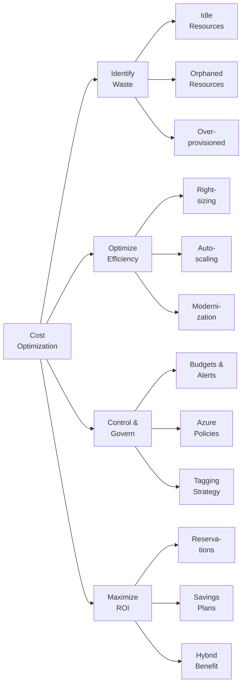
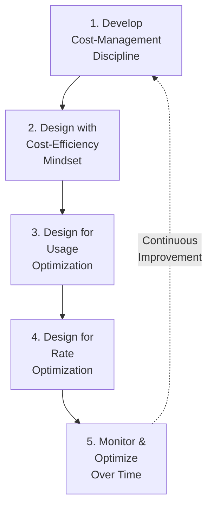
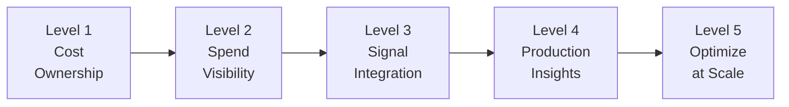
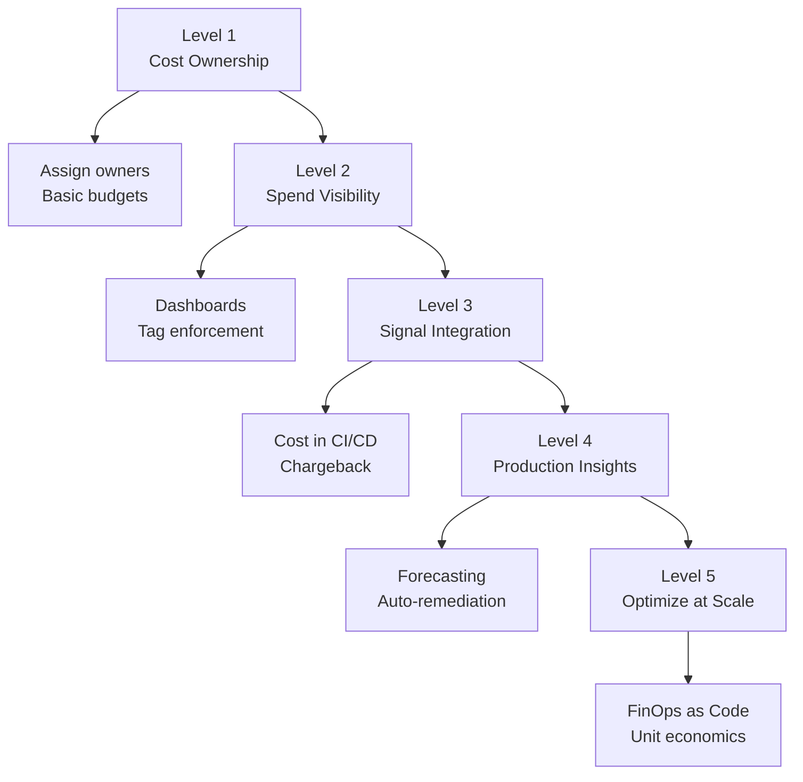
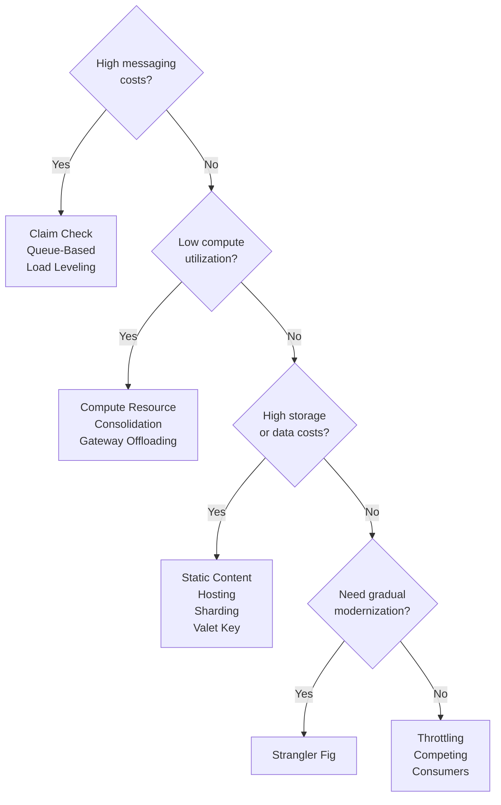
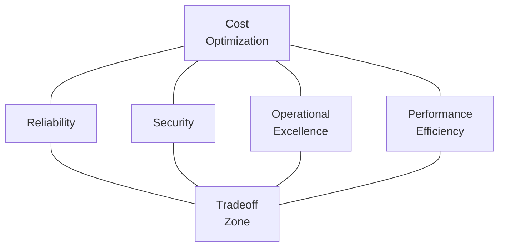
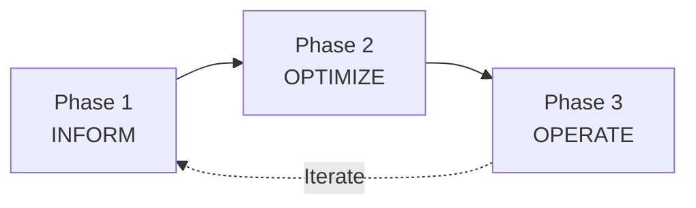
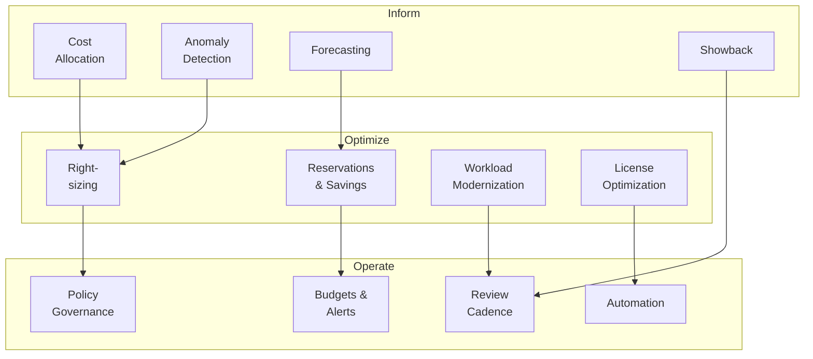
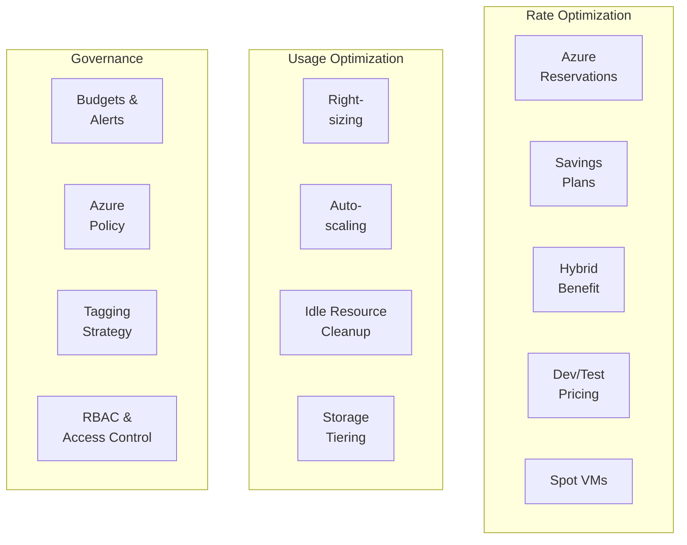

# Module 1: Azure Cost Optimization Fundamentals

> **Duration:** 60–90 minutes | **Level:** Strategic + Tactical  
> **Aligned with:** [Microsoft Azure Well-Architected Framework — Cost Optimization Pillar](https://learn.microsoft.com/en-us/azure/well-architected/cost-optimization/)  
> **Audience:** Cloud Architects, FinOps Practitioners, Platform Engineers, IT Leadership  
> **Last Updated:** February 2026

---

## Table of Contents

- [1.1 What is Cost Optimization?](#11-what-is-cost-optimization)
- [1.2 The Three Fundamental Cloud Cost Drivers](#12-the-three-fundamental-cloud-cost-drivers)
- [1.3 WAF Cost Optimization Design Principles](#13-waf-cost-optimization-design-principles)
- [1.4 WAF Cost Optimization Checklist (CO:01–CO:14)](#14-waf-cost-optimization-checklist-co01co14)
- [1.5 WAF Cost Optimization Maturity Model — Five Levels](#15-waf-cost-optimization-maturity-model--five-levels)
- [1.6 Architecture Design Patterns for Cost Optimization](#16-architecture-design-patterns-for-cost-optimization)
- [1.7 WAF Cost Optimization Tradeoffs](#17-waf-cost-optimization-tradeoffs)
- [1.8 FinOps Three-Phase Lifecycle](#18-finops-three-phase-lifecycle)
- [1.9 Azure Cost Management — Capabilities Deep-Dive](#19-azure-cost-management--capabilities-deep-dive)
- [1.10 Azure Native FinOps Tools](#110-azure-native-finops-tools)
- [1.11 Ways to Optimize Costs on Azure](#111-ways-to-optimize-costs-on-azure)
- [1.12 Key Takeaways](#112-key-takeaways)
- [References](#references)

---

## 1.1 What is Cost Optimization?

Cost optimization is **not** about cutting costs. It is about **maximizing the business value delivered per unit of cloud spend** while meeting performance, reliability, security, and compliance requirements. A well-optimized workload delivers the required service levels at the lowest feasible cost, without sacrificing the qualities that matter to the business.

> *"A cost-optimized workload isn't necessarily a low-cost workload. There are significant tradeoffs. Cost optimization is about reducing unnecessary expenses and improving operational efficiencies while still investing appropriately to meet business and compliance requirements."*  
> — [Microsoft Well-Architected Framework — Cost Optimization Pillar](https://learn.microsoft.com/en-us/azure/well-architected/cost-optimization/)

Cost optimization spans the entire workload lifecycle — from initial architecture design, through deployment, day-to-day operations, and continuous improvement. It requires collaboration among engineering, finance, and business stakeholders.

### Why It Matters

- **Cloud spending is variable by design.** Unlike on-premises capital expenditures with fixed depreciation, cloud costs fluctuate. Without active management, spend can drift far above the value delivered.
- **72–80 % of cloud waste** is typically attributable to idle or over-provisioned resources, making usage optimization the single highest-impact lever.
- **Commitment-based discounts** (Azure Reservations, Azure Savings Plans) can reduce compute costs by 30–72 %, but only when used correctly with adequate planning.
- **FinOps culture** — embedding financial accountability into engineering teams — is the organisational enabler that sustains optimization over time.

---

## 1.2 The Three Fundamental Cloud Cost Drivers

Every Azure bill ultimately derives from three categories of metered consumption. Understanding these drivers is essential for targeting optimization efforts where they will have the greatest impact.

| Driver | Description | Typical Share of Bill | Optimization Strategies |
|--------|-------------|----------------------|------------------------|
| **Compute** | VMs, AKS clusters, App Services, Functions, Container Apps, Azure SQL compute, Cosmos DB RU/s | 50–70 % | Right-size, autoscale, Reserved Instances, Savings Plans, Spot VMs, B-series burstable VMs, shut down non-production hours, containerize monoliths |
| **Storage** | Managed Disks, Blob Storage, Azure Files, Data Lake, database storage, backup vaults | 15–25 % | Lifecycle management policies, access tiering (Hot → Cool → Cold → Archive), reserved capacity, delete orphaned disks/snapshots, compression |
| **Data Transfer (Egress)** | Outbound data from Azure, cross-region replication, VPN/ExpressRoute metered data | 5–15 % | Co-locate services in the same region, use CDN for static content, Private Endpoints, Azure Front Door caching, minimize cross-region calls |

> **Pro Tip:** Use [Azure Cost Analysis](https://learn.microsoft.com/en-us/azure/cost-management-billing/costs/quick-acm-cost-analysis) grouped by **Meter Category** to visualize which driver dominates your bill.

### Additional Cost Considerations

| Category | Examples | Notes |
|----------|----------|-------|
| **Licensing** | Windows Server, SQL Server, Red Hat, SUSE | Azure Hybrid Benefit (AHB) can eliminate license costs for eligible workloads |
| **Support** | Microsoft Unified Support, Premier | Negotiate at EA/MCA level; shared across workloads |
| **Marketplace** | Third-party SaaS, ISV solutions | Often overlooked in cost reviews; use Azure Marketplace cost analysis |
| **Networking** | Load Balancers, Application Gateway, Firewall, DNS | Fixed + variable components; consolidate where possible |

---

## 1.3 WAF Cost Optimization Design Principles

The [Microsoft Well-Architected Framework](https://learn.microsoft.com/en-us/azure/well-architected/cost-optimization/principles) defines **five core design principles** for cost optimization. These principles form the foundation for every architectural and operational decision.

### Principle Details

| # | Principle | What It Means | Key Actions |
|---|-----------|---------------|-------------|
| 1 | **[Develop Cost-Management Discipline](https://learn.microsoft.com/en-us/azure/well-architected/cost-optimization/principles#develop-cost-management-discipline)** | Build a FinOps culture with clear ownership, accountability models, and cost awareness across every team. Cost management is a cross-functional discipline, not an afterthought. | Create cost models before deployment, set budgets with alerts, define cost ownership (RACI), train engineers on cost implications, establish a FinOps team or community of practice |
| 2 | **[Design with a Cost-Efficiency Mindset](https://learn.microsoft.com/en-us/azure/well-architected/cost-optimization/principles#design-with-a-cost-efficiency-mindset)** | Every architectural decision has a financial impact. The cost-efficient mindset means evaluating tradeoffs between cost and other quality attributes at design time, not after deployment. | Establish cost baselines, use cost-aware architecture patterns, treat environments differently (production vs. dev/test), enforce guardrails via Azure Policy, select regions strategically based on pricing |
| 3 | **[Design for Usage Optimization](https://learn.microsoft.com/en-us/azure/well-architected/cost-optimization/principles#design-for-usage-optimization)** | Maximize the return on every resource you provision. Ensure that purchased capacity is consumed and that workloads dynamically scale to actual demand. | Right-size VMs and databases, implement autoscaling, shut down dev/test outside business hours, delete orphaned/idle resources, consolidate underutilized workloads |
| 4 | **[Design for Rate Optimization](https://learn.microsoft.com/en-us/azure/well-architected/cost-optimization/principles#design-for-rate-optimization)** | Reduce the per-unit cost of cloud resources through commitment-based and program-based discounts. | Purchase Azure Reservations (1-year or 3-year), enroll in Azure Savings Plans, activate Azure Hybrid Benefit, use Dev/Test pricing for non-production, leverage Spot VMs for fault-tolerant workloads |
| 5 | **[Monitor and Optimize Over Time](https://learn.microsoft.com/en-us/azure/well-architected/cost-optimization/principles#monitor-and-optimize-over-time)** | Cost optimization is a continuous practice. Workloads change, pricing changes, better services become available. Regular review and iteration are essential. | Set up cost anomaly alerts, conduct monthly cost reviews, track optimization KPIs, decommission unused resources, benchmark against Azure Advisor recommendations, re-evaluate commitments quarterly |

---

## 1.4 WAF Cost Optimization Checklist (CO:01–CO:14)

The [WAF Cost Optimization Checklist](https://learn.microsoft.com/en-us/azure/well-architected/cost-optimization/checklist) provides 14 actionable recommendations. Each maps to detailed guidance on Microsoft Learn. The table below expands each item with a description, priority, and concrete actions.

| Code | Recommendation | Description | Priority | Key Actions |
|------|---------------|-------------|----------|-------------|
| **[CO:01](https://learn.microsoft.com/en-us/azure/well-architected/cost-optimization/create-culture-financial-responsibility)** | **Create a culture of financial responsibility** | Train personnel on cloud economics, foster accountability at every level, and ensure engineering teams understand the cost impact of their decisions. Financial responsibility is a shared ownership model, not solely a finance function. | 🔴 HIGH | Establish a FinOps team or CoP; include cost metrics in sprint reviews; run cost-awareness training; assign cost owners per workload |
| **[CO:02](https://learn.microsoft.com/en-us/azure/well-architected/cost-optimization/cost-model)** | **Create and maintain a cost model** | Develop a detailed cost model that estimates initial costs, run-rate costs, and ongoing operational costs for each workload. The model should be a living document updated as the workload evolves. | 🔴 HIGH | Use Azure Pricing Calculator for pre-deployment estimates; maintain a cost model spreadsheet per workload; include compute, storage, networking, licensing, and support costs; review quarterly |
| **[CO:03](https://learn.microsoft.com/en-us/azure/well-architected/cost-optimization/collect-review-cost-data)** | **Collect and review cost data** | Capture daily cost data, trend analysis, and forecasts. Use Azure Cost Management to create custom views, exports, and reports. Ensure cost data is democratized — visible to engineering, not just finance. | 🔴 HIGH | Configure daily cost exports to Storage Account; build Power BI dashboards; enable cost anomaly detection; schedule weekly cost review meetings; use Azure Cost Analysis with grouping by tag, resource group, or service |
| **[CO:04](https://learn.microsoft.com/en-us/azure/well-architected/cost-optimization/set-spending-guardrails)** | **Set spending guardrails** | Implement governance mechanisms — Azure Budgets with action groups, Azure Policy for resource constraints, and approval gates in CI/CD pipelines — to prevent cost overruns before they happen. | 🔴 HIGH | Set budgets at subscription and resource group level; configure alerts at 50 %, 75 %, 90 %, 100 % thresholds; use Azure Policy to deny expensive SKUs in dev/test; add cost gates to deployment pipelines |
| **[CO:05](https://learn.microsoft.com/en-us/azure/well-architected/cost-optimization/get-best-rates)** | **Get the best rates from providers** | Leverage regional pricing differences, commitment discounts, program-level pricing (EA, CSP, PAYG), and tier-based pricing to minimize per-unit costs. | 🟡 MEDIUM | Compare pricing across regions; purchase Reserved Instances for stable workloads; enroll in Azure Savings Plans for compute flexibility; activate Azure Hybrid Benefit for Windows/SQL; use Dev/Test subscriptions |
| **[CO:06](https://learn.microsoft.com/en-us/azure/well-architected/cost-optimization/align-usage-to-billing-increments)** | **Align usage to billing increments** | Understand how Azure meters charge (per hour, per GB, per transaction) and align resource usage patterns to minimize waste within billing increments. | 🟡 MEDIUM | Understand per-second vs. per-hour billing for VMs; align storage access patterns to tier pricing; batch transactions where possible; use consumption-based services (Functions, Logic Apps) for intermittent workloads |
| **[CO:07](https://learn.microsoft.com/en-us/azure/well-architected/cost-optimization/optimize-component-costs)** | **Optimize component costs** | Evaluate each component in the architecture. Remove legacy, unneeded, or underutilized components. Replace expensive components with cost-effective alternatives. | 🔴 HIGH | Audit all deployed resources against Advisor recommendations; remove orphaned disks, NICs, public IPs; replace Premium SSD with Standard SSD where performance allows; consolidate similar workloads |
| **[CO:08](https://learn.microsoft.com/en-us/azure/well-architected/cost-optimization/optimize-environment-costs)** | **Optimize environment costs** | Non-production environments (dev, test, staging, sandbox) should not mirror production cost profiles. Apply aggressive optimization to lower environments. | 🟡 MEDIUM | Use B-series VMs for dev/test; shut down non-prod VMs on nights/weekends (Azure Automation, Start/Stop); use Dev/Test pricing; reduce replication and redundancy in lower environments; use smaller SKUs |
| **[CO:09](https://learn.microsoft.com/en-us/azure/well-architected/cost-optimization/optimize-flow-costs)** | **Optimize flow costs** | Identify the critical user and system flows in your workload. Align spending so that high-priority flows receive appropriate investment while low-priority flows are optimized aggressively. | 🟡 MEDIUM | Map user flows to infrastructure components; assign cost to each flow; throttle or queue low-priority flows; use priority-based processing; align SLAs to flow importance |
| **[CO:10](https://learn.microsoft.com/en-us/azure/well-architected/cost-optimization/optimize-data-costs)** | **Optimize data costs** | Manage data lifecycle — tiering, retention policies, compression, deduplication, and replication strategy — to minimize storage and transfer costs. | 🟡 MEDIUM | Implement Blob Storage lifecycle management (Hot → Cool → Cold → Archive); set data retention policies; reduce backup retention for non-critical data; use locally-redundant storage (LRS) where geo-redundancy is not required; compress data before storage |
| **[CO:11](https://learn.microsoft.com/en-us/azure/well-architected/cost-optimization/optimize-code-costs)** | **Optimize code costs** | Write efficient code that meets functional requirements while consuming fewer compute, memory, and I/O resources. Poorly optimized code can turn a right-sized resource into an under-provisioned one. | 🟡 MEDIUM | Profile application performance; optimize database queries (eliminate N+1 patterns); use caching (Azure Cache for Redis); batch API calls; use async patterns; reduce logging verbosity in production |
| **[CO:12](https://learn.microsoft.com/en-us/azure/well-architected/cost-optimization/optimize-scaling-costs)** | **Optimize scaling costs** | Evaluate scaling configurations to find the best balance between performance and cost. Consider scale-up vs. scale-out, autoscale rules, and cool-down periods. | 🟡 MEDIUM | Configure autoscale with appropriate min/max/default; set conservative scale-in rules to avoid flapping; use VMSS Flexible orchestration; consider Azure Functions consumption plan for event-driven workloads |
| **[CO:13](https://learn.microsoft.com/en-us/azure/well-architected/cost-optimization/optimize-personnel-time)** | **Optimize personnel time** | Reduce the time engineers spend on toil — manual, repetitive, automatable tasks — without degrading outcomes. Personnel time is the largest hidden cost in cloud operations. | 🟡 MEDIUM | Automate deployments with IaC (Bicep/Terraform); use Azure Automation for runbooks; implement self-service portals; standardize with landing zones; use managed services to reduce operational burden |
| **[CO:14](https://learn.microsoft.com/en-us/azure/well-architected/cost-optimization/consolidation)** | **Consolidate resources and increase density** | Increase resource utilization by consolidating workloads, using shared services, and increasing compute density. Avoid one-VM-per-app anti-patterns. | 🟡 MEDIUM | Use AKS or App Service Plans to host multiple apps; share Application Gateway, Firewall, Log Analytics across workloads; consolidate databases into elastic pools; use multi-tenant designs |

---

## 1.5 WAF Cost Optimization Maturity Model — Five Levels

The [WAF Cost Optimization Maturity Model](https://learn.microsoft.com/en-us/azure/well-architected/cost-optimization/maturity-model) defines five progressive levels of cost optimization maturity. Each level builds on the previous, guiding organizations from ad-hoc cost awareness to automated, data-driven optimization at scale.

### Level 1: Cost Ownership

**Theme:** Establish accountability and a culture of cost awareness.

At Level 1, the organization begins the journey by assigning ownership of cloud costs and creating foundational practices for financial accountability.

| Area | Description |
|------|-------------|
| **Ownership Model** | Assign a cost owner (individual or team) for every workload, subscription, or resource group. Ensure ownership is documented and visible. |
| **Cost Awareness** | Conduct initial training for engineering and operations teams on cloud billing models, metering, and the financial impact of architectural choices. |
| **Basic Budgets** | Set initial budgets at the subscription level with alert notifications to stakeholders. |
| **Tagging Foundation** | Implement a minimum viable tagging standard (e.g., `CostCenter`, `Owner`, `Environment`, `Application`). |
| **Key Strategies** | Define a RACI matrix for cost decisions; establish a FinOps community of practice; publish cost ownership documentation; run a "cloud cost 101" workshop for all engineering teams. |

### Level 2: Spend Visibility

**Theme:** Gain clear, actionable visibility into where money is being spent and why.

| Area | Description |
|------|-------------|
| **Cost Reporting** | Build Cost Analysis views and dashboards (Power BI, Azure Workbooks) that provide spend breakdowns by service, resource group, tag, and subscription. |
| **Tagging Enforcement** | Enforce tagging policies via Azure Policy (deny deployment if required tags are missing). Achieve >95 % tag compliance. |
| **Showback** | Implement showback reporting — showing teams their cost consumption — even if formal chargeback is not yet in place. |
| **Anomaly Detection** | Enable Azure Cost Management anomaly alerts to detect unexpected spend spikes within 24 hours. |
| **Key Strategies** | Publish weekly cost reports; create per-team cost dashboards; enforce mandatory tags via Azure Policy Deny effect; enable cost anomaly email alerts; export cost data daily to a storage account for trend analysis. |

### Level 3: Signal Integration

**Theme:** Integrate cost signals into engineering and operational workflows.

| Area | Description |
|------|-------------|
| **Cost in CI/CD** | Add cost estimation gates to deployment pipelines. Before a PR is merged, the team can see the projected cost impact. |
| **Advisor Integration** | Systematically review and act on Azure Advisor cost recommendations. Track Advisor score over time. |
| **Chargeback** | Implement chargeback or internal billing — actual cost allocation to business units or product teams based on consumption. |
| **Right-Sizing Cadence** | Establish a monthly right-sizing review cadence using Azure Advisor, Azure Monitor metrics, and workload-specific benchmarks. |
| **Key Strategies** | Integrate Infracost or similar tools into PR workflows; schedule monthly Advisor review meetings; build a chargeback model based on tags; set up automated right-sizing recommendations with approval workflows; track and report on Advisor score improvement. |

### Level 4: Production Insights

**Theme:** Use telemetry and data analytics to drive cost decisions with confidence.

| Area | Description |
|------|-------------|
| **Cost Forecasting** | Use Azure Cost Management forecasting and custom models to predict future spend with >90 % accuracy. |
| **Workload-Level Costing** | Attribute costs to individual workloads, features, or even user flows — not just subscriptions or resource groups. |
| **Commitment Planning** | Make data-driven decisions on Reserved Instance and Savings Plan purchases based on historical utilization and forecasted demand. |
| **Automated Remediation** | Implement automated responses to cost signals — auto-shutdown idle VMs, auto-scale-in during low demand, auto-delete orphaned resources. |
| **Key Strategies** | Build cost forecasting models using exported cost data; implement Azure Automation runbooks for idle resource cleanup; create commitment purchase review boards; attribute costs to workloads using resource tags plus Log Analytics correlation; build cost-per-transaction dashboards. |

### Level 5: Optimize at Scale

**Theme:** Continuous, automated, organization-wide optimization driven by data and policy.

| Area | Description |
|------|-------------|
| **FinOps as Code** | All optimization policies, budgets, and guardrails are defined as code (Azure Policy, Bicep/Terraform) and deployed through CI/CD. |
| **Cross-Pillar Optimization** | Cost optimization is balanced with reliability, security, and performance objectives using formal tradeoff analysis frameworks. |
| **Advanced Analytics** | Use Azure Data Explorer, Power BI, or custom analytics to run unit economics analysis (cost per user, cost per transaction, cost per API call). |
| **Continuous Benchmarking** | Continuously benchmark workload costs against industry peers, Azure Advisor scores, and internal baselines. Drive improvement targets quarter over quarter. |
| **Key Strategies** | Codify all policies and budgets in IaC; run quarterly cross-pillar architectural reviews; build unit economics dashboards; establish cost reduction OKRs per engineering team; automate commitment coverage analysis; participate in FinOps Foundation benchmarking. |

### Maturity Progression Summary

---

## 1.6 Architecture Design Patterns for Cost Optimization

The [WAF Cost Optimization Design Patterns](https://learn.microsoft.com/en-us/azure/well-architected/cost-optimization/design-patterns) recommend specific cloud architecture patterns that help reduce costs. These patterns are proven strategies from the [Azure Architecture Center](https://learn.microsoft.com/en-us/azure/architecture/patterns/).

| Pattern | Description | Cost Optimization Benefit | Azure Services |
|---------|-------------|--------------------------|----------------|
| **[Claim Check](https://learn.microsoft.com/en-us/azure/architecture/patterns/claim-check)** | Split a large message into a claim token and a payload stored separately. The receiver uses the token to retrieve the payload when needed. | Reduces messaging costs by avoiding large message payloads in queues. Minimizes egress and messaging tier costs. | Azure Service Bus, Azure Blob Storage, Event Grid |
| **[Competing Consumers](https://learn.microsoft.com/en-us/azure/architecture/patterns/competing-consumers)** | Multiple consumers process messages from a single queue concurrently, distributing the load. | Enables elastic scaling of processing based on queue depth rather than provisioning for peak. Reduces idle compute. | Azure Service Bus, Azure Functions, Azure Queue Storage |
| **[Compute Resource Consolidation](https://learn.microsoft.com/en-us/azure/architecture/patterns/compute-resource-consolidation)** | Consolidate multiple tasks or workloads into a single compute unit to increase resource utilization and reduce the number of provisioned units. | Increases compute density, reduces the number of VMs or App Service Plans, lowers per-unit cost. | AKS, App Service, Container Apps |
| **[Gateway Offloading](https://learn.microsoft.com/en-us/azure/architecture/patterns/gateway-offloading)** | Offload shared functionality (SSL termination, authentication, rate limiting) from individual services to a centralized gateway. | Eliminates redundant processing across services. Reduces compute requirements per service. | Azure Application Gateway, Azure API Management, Azure Front Door |
| **[Queue-Based Load Leveling](https://learn.microsoft.com/en-us/azure/architecture/patterns/queue-based-load-leveling)** | Use a queue between a producer and a consumer to decouple the rate of production from the rate of consumption. | Enables consumers to be provisioned for average load rather than peak, reducing over-provisioning. Smooths burst handling without scaling compute. | Azure Queue Storage, Azure Service Bus, Azure Functions |
| **[Sharding](https://learn.microsoft.com/en-us/azure/architecture/patterns/sharding)** | Divide data across multiple databases or storage accounts (shards) to distribute load. | Allows use of lower-tier databases per shard instead of one large premium-tier instance. Scales horizontally at lower cost. | Azure SQL Database, Cosmos DB, Azure Table Storage |
| **[Static Content Hosting](https://learn.microsoft.com/en-us/azure/architecture/patterns/static-content-hosting)** | Serve static content (HTML, CSS, JS, images) directly from cloud storage or a CDN rather than from a compute service. | Eliminates compute cost for serving static files. Blob Storage + CDN is orders of magnitude cheaper than App Service for static content. | Azure Blob Storage (static website), Azure CDN, Azure Front Door |
| **[Strangler Fig](https://learn.microsoft.com/en-us/azure/architecture/patterns/strangler-fig)** | Incrementally migrate a legacy system by gradually replacing components with modern cloud services. | Allows modernization without a big-bang rewrite. Migrate highest-cost components first for immediate savings. Avoids dual-running costs of a long parallel-run. | Azure API Management, Azure App Service, Azure Functions |
| **[Throttling](https://learn.microsoft.com/en-us/azure/architecture/patterns/throttling)** | Control the rate of resource consumption by limiting the number of requests or operations per time window. | Prevents runaway consumption and protects against cost spikes from unexpected traffic surges or abuse. | Azure API Management, Azure Functions, Application Gateway WAF |
| **[Valet Key](https://learn.microsoft.com/en-us/azure/architecture/patterns/valet-key)** | Provide clients with a limited-access token (SAS token) for direct access to a storage resource, bypassing the application tier. | Eliminates compute costs for data-transfer proxy operations. Clients upload/download directly to/from storage. | Azure Blob Storage (SAS tokens), Azure Data Lake Storage |

### Pattern Selection Guidance

---

## 1.7 WAF Cost Optimization Tradeoffs

Cost optimization does not exist in isolation. Every cost reduction decision has potential implications on the other Well-Architected Framework pillars. The [WAF Cost Optimization Tradeoffs](https://learn.microsoft.com/en-us/azure/well-architected/cost-optimization/tradeoffs) section documents these tensions explicitly. Understanding these tradeoffs is critical for making informed decisions.

### Cost Optimization vs. Reliability

| Tradeoff | Cost-Optimized Choice | Reliability Impact | Guidance |
|----------|----------------------|-------------------|----------|
| **Redundancy** | Single-region deployment, LRS storage | No geo-failover; single point of failure | Accept for dev/test; require multi-region for production workloads with strict SLAs |
| **Instance Count** | Run fewer instances to save on compute | Reduced fault tolerance; single instance failure can cause downtime | Use autoscale with minimum instance count ≥ 2 for availability-critical services |
| **Cheaper SKUs** | Use Basic/Standard tiers instead of Premium | Reduced availability SLA (e.g., single-instance VM = 99.9 % vs. Availability Zones = 99.99 %) | Map SKU selection to workload SLA requirements using [Azure SLA summary](https://www.microsoft.com/licensing/docs/view/Service-Level-Agreements-SLA-for-Online-Services) |
| **Backup Retention** | Shorter retention periods, fewer backups | Greater RPO (Recovery Point Objective); risk of data loss | Define RPO per workload; align backup retention to RPO; use lifecycle policies for long-term retention |

> **Reference:** [Cost Optimization and Reliability Tradeoffs](https://learn.microsoft.com/en-us/azure/well-architected/cost-optimization/tradeoffs#cost-optimization-tradeoffs-with-reliability)

### Cost Optimization vs. Security

| Tradeoff | Cost-Optimized Choice | Security Impact | Guidance |
|----------|----------------------|----------------|----------|
| **WAF / DDoS Protection** | Skip Azure DDoS Network Protection (approx. $2,944/month) | No advanced DDoS telemetry, cost protection guarantee, or rapid response | Use DDoS IP Protection for individual IPs where Network Protection is too expensive; never skip entirely for internet-facing workloads |
| **Private Endpoints** | Use service endpoints (free) instead of Private Endpoints (metered) | Traffic still traverses public network backbone; potential data exposure | Use Private Endpoints for sensitive data flows; service endpoints are acceptable for low-sensitivity internal workloads |
| **Logging & Monitoring** | Reduce log ingestion to cut Log Analytics costs | Reduced security visibility; slower threat detection and investigation | Use data collection rules (DCR) to filter noise; retain security-critical logs at full fidelity; use Basic Logs tier for verbose, low-value logs |
| **Managed HSM / Key Vault Premium** | Use Key Vault Standard instead of Premium or Managed HSM | No HSM-backed keys; may not meet compliance requirements (FIPS 140-2 Level 3) | Standard is sufficient for most workloads; Premium/Managed HSM required for regulated industries |

> **Reference:** [Cost Optimization and Security Tradeoffs](https://learn.microsoft.com/en-us/azure/well-architected/cost-optimization/tradeoffs#cost-optimization-tradeoffs-with-security)

### Cost Optimization vs. Operational Excellence

| Tradeoff | Cost-Optimized Choice | Operational Impact | Guidance |
|----------|----------------------|-------------------|----------|
| **Automation** | Manual processes to avoid automation tooling costs | Higher toil, slower deployments, more human error | Invest in automation (IaC, CI/CD, runbooks); the ROI from reduced personnel time almost always exceeds tooling costs |
| **Monitoring Granularity** | Fewer metrics, longer collection intervals | Slower issue detection; reduced observability | Use adaptive sampling in Application Insights; retain detailed metrics for critical systems; use basic tier for non-critical |
| **Environment Parity** | Dev environments are significantly different from production | "Works on my machine" defects; harder to reproduce production issues | Maintain architectural parity; reduce scale, SKU tier, and redundancy — not topology |
| **Documentation & Training** | Reduce investment in documentation | Knowledge silos; slower onboarding; higher risk during incidents | Use lightweight-but-maintained runbooks; automate what can be automated; document architecture decisions (ADRs) |

> **Reference:** [Cost Optimization and Operational Excellence Tradeoffs](https://learn.microsoft.com/en-us/azure/well-architected/cost-optimization/tradeoffs#cost-optimization-tradeoffs-with-operational-excellence)

### Cost Optimization vs. Performance Efficiency

| Tradeoff | Cost-Optimized Choice | Performance Impact | Guidance |
|----------|----------------------|--------------------|----------|
| **SKU Sizing** | Use smaller VM sizes or lower-tier databases | Higher latency, lower throughput, potential throttling during peaks | Right-size based on actual utilization data (p95); avoid guessing; use Azure Monitor metrics |
| **Caching** | Skip Redis Cache or CDN to save costs | Every request hits the origin; higher latency and origin load | Caching is usually cost-positive — reduced compute/database load offsets cache costs |
| **Scaling Limits** | Set aggressive autoscale max limits to cap costs | Risk of service degradation or request drops during demand spikes | Set max to handle known peak + buffer; use alerts to notify when nearing max scale limits |
| **Premium Storage** | Use Standard HDD/SSD instead of Premium SSD or Ultra Disk | Higher I/O latency; reduced IOPS; potential performance bottleneck | Use Premium only for I/O-intensive workloads (databases, OLTP); Standard SSD is sufficient for most general-purpose workloads |

> **Reference:** [Cost Optimization and Performance Efficiency Tradeoffs](https://learn.microsoft.com/en-us/azure/well-architected/cost-optimization/tradeoffs#cost-optimization-tradeoffs-with-performance-efficiency)

---

## 1.8 FinOps Three-Phase Lifecycle

The [FinOps Foundation](https://www.finops.org/framework/phases/) defines a three-phase lifecycle for cloud financial management. This lifecycle is iterative — organizations continuously cycle through all three phases, improving maturity with each iteration.

### Phase 1: Inform — Visibility & Allocation

**Objective:** Provide accurate, timely, and accessible cost data to all stakeholders. Create a shared understanding of cloud spending.

| Capability | Description | Azure Implementation |
|------------|-------------|---------------------|
| **Cost Allocation** | Attribute costs to teams, products, business units, or cost centers using a consistent allocation methodology. | [Azure Cost Management + Tagging](https://learn.microsoft.com/en-us/azure/cost-management-billing/costs/quick-acm-cost-analysis) — group by tag (CostCenter, Owner, Application); use Management Groups and Subscriptions for structural allocation |
| **Data Analysis & Showback** | Analyze cost trends, identify anomalies, and create showback reports that give teams visibility into their consumption without formal billing. | [Cost Analysis views](https://learn.microsoft.com/en-us/azure/cost-management-billing/costs/cost-analysis-common-uses), [Power BI connector for Cost Management](https://learn.microsoft.com/en-us/azure/cost-management-billing/costs/analyze-cost-data-azure-cost-management-power-bi-template-app), scheduled exports to Storage Accounts |
| **Anomaly Detection** | Automatically detect unexpected cost increases and alert responsible teams within hours. | [Azure Cost Management Anomaly Alerts](https://learn.microsoft.com/en-us/azure/cost-management-billing/understand/analyze-unexpected-charges) — machine-learning-based detection with email notifications |
| **Forecasting** | Predict future costs based on historical trends, planned deployments, and commitment schedules. | [Azure Cost Management Forecasting](https://learn.microsoft.com/en-us/azure/cost-management-billing/costs/quick-acm-cost-analysis#forecast-future-costs) — built-in 12-month forecast in Cost Analysis |
| **Benchmarking** | Compare workload costs against baselines, peer teams, or industry benchmarks. | [Azure Advisor Score](https://learn.microsoft.com/en-us/azure/advisor/azure-advisor-score), custom KPIs (cost per user, cost per transaction) |

### Phase 2: Optimize — Rates & Usage

**Objective:** Take action to reduce costs through rate optimization (discounts) and usage optimization (efficiency).

| Capability | Description | Azure Implementation |
|------------|-------------|---------------------|
| **Rate Optimization** | Secure the lowest possible unit price for cloud resources through commitment-based and program-based discounts. | [Azure Reservations](https://learn.microsoft.com/en-us/azure/cost-management-billing/reservations/save-compute-costs-reservations) (1-year / 3-year for VMs, SQL, Cosmos DB, Storage, etc.); [Azure Savings Plans](https://learn.microsoft.com/en-us/azure/cost-management-billing/savings-plan/savings-plan-compute-overview) (flexible compute commitment); [Azure Hybrid Benefit](https://learn.microsoft.com/en-us/azure/cost-management-billing/scope-level/transition-existing) (BYOL for Windows, SQL, Linux) |
| **Usage Optimization** | Right-size, scale, and clean up resources to ensure every provisioned resource is actively utilized. | [Azure Advisor right-sizing recommendations](https://learn.microsoft.com/en-us/azure/advisor/advisor-cost-recommendations); autoscaling (VMSS, AKS, App Service); delete orphaned resources; implement start/stop schedules |
| **Workload Optimization** | Re-architect workloads to use more cost-effective services (e.g., migrate VMs to containers, use serverless for event-driven workloads). | Migrate to PaaS/serverless (Azure Functions, Container Apps); use managed databases; adopt microservices for independent scaling |
| **Licensing Optimization** | Maximize the value of existing software licenses and avoid unnecessary license costs. | [Azure Hybrid Benefit](https://learn.microsoft.com/en-us/azure/cost-management-billing/scope-level/transition-existing) for Windows Server, SQL Server; [Extended Security Updates](https://learn.microsoft.com/en-us/azure/azure-sql/virtual-machines/windows/sql-server-extend-end-of-support) for free on Azure; Dev/Test pricing to eliminate license costs in non-production |

### Phase 3: Operate — Continuous Process & Governance

**Objective:** Embed cost optimization into the organization's operating model. Automate governance. Make cost management a continuous practice, not a project.

| Capability | Description | Azure Implementation |
|------------|-------------|---------------------|
| **Policy-Driven Governance** | Codify cost guardrails as policy and enforce them automatically across all subscriptions. | [Azure Policy](https://learn.microsoft.com/en-us/azure/governance/policy/overview) — Deny expensive SKUs, enforce tagging, audit unused resources; [Management Groups](https://learn.microsoft.com/en-us/azure/governance/management-groups/overview) for hierarchical policy assignment |
| **Budgets & Alerts** | Set financial boundaries with automated alerting and optionally automated actions (e.g., shut down resources when budget is exhausted). | [Azure Budgets](https://learn.microsoft.com/en-us/azure/cost-management-billing/costs/tutorial-acm-create-budgets) with Action Groups — alert at thresholds; trigger Azure Automation runbooks or Logic Apps on budget breach |
| **Continuous Review Cadence** | Establish recurring meetings and review rhythms for cost optimization — weekly tactical, monthly strategic, quarterly commitment planning. | Weekly: Advisor review + anomaly triage; Monthly: cost trend review + right-sizing; Quarterly: reservation/savings plan evaluation + architectural review |
| **Automation & Self-Healing** | Automate repetitive optimization actions to reduce toil and ensure consistency. | [Azure Automation runbooks](https://learn.microsoft.com/en-us/azure/automation/automation-runbook-types) for idle resource cleanup; [Azure Logic Apps](https://learn.microsoft.com/en-us/azure/logic-apps/logic-apps-overview) for approval workflows; custom Functions for cost event processing |
| **FinOps Reporting** | Produce executive-level reports on cost optimization progress, savings achieved, and maturity improvement. | Custom Power BI dashboards; [FinOps Toolkit](https://microsoft.github.io/finops-toolkit/) Power BI reports; monthly savings summary reports with before/after metrics |

### FinOps Lifecycle — Capability Mapping

---

## 1.9 Azure Cost Management — Capabilities Deep-Dive

[Azure Cost Management + Billing](https://learn.microsoft.com/en-us/azure/cost-management-billing/cost-management-billing-overview) is the native, no-additional-cost platform for monitoring, allocating, and optimizing Azure spend. It is the primary tool for any FinOps practice on Azure.

### Core Features

| Feature | Description | How to Access |
|---------|-------------|---------------|
| **[Cost Analysis](https://learn.microsoft.com/en-us/azure/cost-management-billing/costs/quick-acm-cost-analysis)** | Interactive cost exploration tool. Pivot, filter, and group costs by service, resource, resource group, tag, meter, location, or subscription. View daily, monthly, or cumulative trends. Built-in forecasting shows projected spend for the current billing period. | Azure Portal → Cost Management → Cost Analysis |
| **[Budgets](https://learn.microsoft.com/en-us/azure/cost-management-billing/costs/tutorial-acm-create-budgets)** | Set spending thresholds at the management group, subscription, or resource group scope. Configure alerts at percentage thresholds (e.g., 50 %, 75 %, 90 %, 100 %). Optionally trigger automated actions via Action Groups when thresholds are breached. | Azure Portal → Cost Management → Budgets |
| **[Cost Alerts](https://learn.microsoft.com/en-us/azure/cost-management-billing/costs/cost-mgt-alerts-monitor-usage-spending)** | Three types of alerts: Budget alerts (threshold-based), Credit alerts (EA/MCA prepayment depletion), and Department spending quota alerts. | Azure Portal → Cost Management → Cost Alerts |
| **[Anomaly Detection](https://learn.microsoft.com/en-us/azure/cost-management-billing/understand/analyze-unexpected-charges)** | Machine-learning-based detection of unexpected cost increases. Automatically identifies anomalies and sends email notifications with root-cause analysis. | Azure Portal → Cost Management → Cost Analysis → Anomalies tab |
| **[Exports](https://learn.microsoft.com/en-us/azure/cost-management-billing/costs/tutorial-export-acm-data)** | Schedule automatic exports of cost data (actual costs, amortized costs, or usage) to an Azure Storage Account in CSV format. Use for custom reporting, data warehousing, or Power BI ingestion. | Azure Portal → Cost Management → Exports |
| **[Power BI Integration](https://learn.microsoft.com/en-us/azure/cost-management-billing/costs/analyze-cost-data-azure-cost-management-power-bi-template-app)** | Connect Power BI directly to Cost Management data for advanced visualization, custom reports, and executive dashboards. Template apps provide pre-built reports. | Power BI Desktop → Azure Cost Management connector |
| **[Advisor Recommendations](https://learn.microsoft.com/en-us/azure/advisor/advisor-cost-recommendations)** | Personalized cost optimization recommendations: shut down/right-size VMs, buy reservations, delete idle resources, use Hybrid Benefit. Each recommendation includes estimated annual savings. | Azure Portal → Advisor → Cost tab |
| **[Reservation Recommendations](https://learn.microsoft.com/en-us/azure/cost-management-billing/reservations/reserved-instance-purchase-recommendations)** | AI-driven recommendations for Reserved Instance and Savings Plan purchases based on historical usage patterns. Shows potential savings amount and break-even point. | Azure Portal → Cost Management → Advisor → Reservations |

### Cost Analysis — Common Views

| View | Purpose |
|------|---------|
| **Accumulated Cost** | Running total of spend over the selected period. Useful for tracking budget consumption. |
| **Daily Cost** | Day-by-day breakdown showing spend patterns. Identifies spikes and anomalies. |
| **Cost by Service** | Groups costs by Azure service (Compute, Storage, Networking, etc.). Identifies top cost drivers. |
| **Cost by Resource** | Drills down to individual resource-level costs. Finds the most expensive resources. |
| **Cost by Tag** | Groups costs by tag values (CostCenter, Owner, Application). Essential for showback/chargeback. |
| **Forecast** | Projects future costs based on historical trends. Compare actual vs. forecast vs. budget. |

### Setting Up Effective Budgets — Best Practices

1. **Layer budgets hierarchically:** Management Group → Subscription → Resource Group → Tag-based
2. **Set meaningful thresholds:** 50 % (awareness), 75 % (action planning), 90 % (escalation), 100 % (freeze or auto-action)
3. **Use Action Groups:** Connect budget alerts to email, SMS, webhook, Azure Automation, or Logic Apps for automated response
4. **Review monthly:** Adjust budgets based on changing requirements; budgets should reflect planned spend, not arbitrary limits
5. **Use both actual and forecast alerts:** Actual alerts fire after the fact; forecast alerts fire before you exceed the budget

> **Reference:** [Tutorial — Create and manage Azure Budgets](https://learn.microsoft.com/en-us/azure/cost-management-billing/costs/tutorial-acm-create-budgets)

---

## 1.10 Azure Native FinOps Tools

| Tool | Purpose | Key Capability | Link |
|------|---------|----------------|------|
| **Azure Cost Management + Billing** | Monitor, allocate, and optimize costs across all Azure subscriptions | Cost analysis, budgets, cost alerts, anomaly detection, exports, Power BI integration, reservation recommendations | [Learn more](https://learn.microsoft.com/en-us/azure/cost-management-billing/cost-management-billing-overview) |
| **Azure Advisor** | Personalized, actionable recommendations across five pillars | Cost recommendations (shut down VMs, buy reservations, right-size), reliability, security, performance, operational excellence recommendations with estimated savings | [Learn more](https://learn.microsoft.com/en-us/azure/advisor/advisor-overview) |
| **Azure Pricing Calculator** | Estimate costs before deploying any resource | Mix and match services, configure regions, see monthly cost estimates, export estimates for budget planning | [Open Calculator](https://azure.microsoft.com/en-us/pricing/calculator/) |
| **Azure TCO Calculator** | Compare total cost of on-premises infrastructure vs. Azure | Input current server, database, storage, and networking costs; see 1–5 year TCO comparison with Azure equivalents | [Open Calculator](https://azure.microsoft.com/en-us/pricing/tco/calculator/) |
| **Azure Hybrid Benefit Calculator** | Estimate savings from bringing existing licenses to Azure | Calculate savings for Windows Server, SQL Server, and Linux subscriptions (RHEL, SUSE) | [Open Calculator](https://azure.microsoft.com/en-us/pricing/hybrid-benefit/) |
| **FinOps Toolkit** | Open-source starter kits for FinOps on Azure | Power BI reports (Cost Summary, Rate Optimization), Azure Workbooks, Bicep modules, PowerShell scripts for cost data ingestion | [GitHub — FinOps Toolkit](https://microsoft.github.io/finops-toolkit/) |
| **Cost Optimization Workbook** | Centralized Azure Monitor workbook for cost review | Consolidates Advisor cost recommendations, idle resource detection, Azure Hybrid Benefit tracking, reservation utilization — all in a single workbook pane | [Learn more](https://learn.microsoft.com/en-us/azure/advisor/advisor-cost-optimization-workbook) |
| **Azure Optimization Engine (AOE)** | Automated optimization recommendation engine | Extends Advisor with custom recommendations; runs on a schedule; stores data in Log Analytics for trending and reporting | [GitHub — AOE](https://github.com/microsoft/finops-toolkit) |

---

## 1.11 Ways to Optimize Costs on Azure

### Rate Optimization — Detailed Savings Potential

| Strategy | Description | Typical Savings | Commitment | Best For |
|----------|-------------|----------------|------------|----------|
| **[Azure Reservations](https://learn.microsoft.com/en-us/azure/cost-management-billing/reservations/save-compute-costs-reservations)** | Pre-commit to 1-year or 3-year term for specific resource types (VMs, SQL, Cosmos DB, App Service, Storage). Pay upfront or monthly. | 30–72 % vs. PAYG | 1 or 3 years, specific SKU + region | Stable, predictable workloads with consistent resource requirements |
| **[Azure Savings Plans](https://learn.microsoft.com/en-us/azure/cost-management-billing/savings-plan/savings-plan-compute-overview)** | Commit to a fixed hourly spend on compute ($/hr) for 1 or 3 years. Applies automatically to VMs, App Service, Functions, Container Apps, AKS across any region or SKU. | 15–65 % vs. PAYG | 1 or 3 years, compute-wide | Dynamic workloads that change SKUs or regions frequently |
| **[Azure Hybrid Benefit](https://learn.microsoft.com/en-us/azure/cost-management-billing/scope-level/transition-existing)** | Use existing Windows Server, SQL Server, or Linux (RHEL/SUSE) licenses on Azure. Eliminates the license cost component. | Up to 85 % (Windows VMs), up to 55 % (SQL) | Existing SA licenses required | Organizations with active Software Assurance or qualifying subscriptions |
| **[Dev/Test Pricing](https://learn.microsoft.com/en-us/azure/devtest/offer/overview)** | Discounted rates for non-production workloads under Visual Studio subscriptions. No Windows license charges on VMs; discounted rates on PaaS services. | 20–55 % vs. PAYG | Visual Studio subscription | Development, testing, QA, staging environments |
| **[Spot VMs](https://learn.microsoft.com/en-us/azure/virtual-machines/spot-vms)** | Use unused Azure capacity at deep discounts. VMs can be evicted with 30 seconds notice when Azure needs the capacity back. | Up to 90 % vs. PAYG | None (can be evicted) | Fault-tolerant batch jobs, CI/CD build agents, dev workloads, HPC |

### Usage Optimization — Key Actions

| Strategy | Description | Implementation |
|----------|-------------|---------------|
| **Right-Sizing** | Match resource SKUs to actual utilization. Most VMs and databases are over-provisioned by 25–75 %. | Use [Azure Advisor](https://learn.microsoft.com/en-us/azure/advisor/advisor-cost-recommendations) right-sizing recommendations; analyze CPU, memory, disk, and network metrics in [Azure Monitor](https://learn.microsoft.com/en-us/azure/azure-monitor/overview); target p95 utilization of 60–80 % |
| **Autoscaling** | Dynamically add or remove instances based on demand signals (CPU, memory, queue depth, custom metrics). | Configure [VMSS autoscale](https://learn.microsoft.com/en-us/azure/virtual-machine-scale-sets/virtual-machine-scale-sets-autoscale-overview), [App Service autoscale](https://learn.microsoft.com/en-us/azure/app-service/manage-scale-up), [AKS cluster autoscaler](https://learn.microsoft.com/en-us/azure/aks/cluster-autoscaler) |
| **Start/Stop Schedules** | Shut down non-production VMs, AKS clusters, and other resources outside business hours. | Use [Start/Stop VMs v2](https://learn.microsoft.com/en-us/azure/azure-functions/start-stop-vms/overview), Azure Automation schedules, or AKS planned maintenance windows |
| **Orphaned Resource Cleanup** | Delete idle resources that were provisioned but are no longer attached to any active workload — unattached disks, orphaned NICs, unused public IPs, empty App Service Plans. | Run [Azure Advisor](https://learn.microsoft.com/en-us/azure/advisor/advisor-cost-recommendations) audit; use [Cost Optimization Workbook](https://learn.microsoft.com/en-us/azure/advisor/advisor-cost-optimization-workbook); deploy automated cleanup scripts (see Module 5 — Usage Optimization) |
| **Storage Tiering** | Move infrequently accessed data to lower-cost tiers automatically using lifecycle management policies. | Configure [Blob Storage lifecycle management](https://learn.microsoft.com/en-us/azure/storage/blobs/lifecycle-management-overview) rules (Hot → Cool after 30 days → Cold after 90 days → Archive after 180 days) |

### Governance — Foundation for Sustainable Optimization

| Strategy | Description | Implementation |
|----------|-------------|---------------|
| **Budgets & Alerts** | Set spending limits with proactive notifications at multiple thresholds. | [Azure Budgets](https://learn.microsoft.com/en-us/azure/cost-management-billing/costs/tutorial-acm-create-budgets) at subscription and resource group level; configure Action Groups for email, SMS, webhook |
| **Azure Policy** | Enforce cost-related governance rules organization-wide through policy-as-code. | [Azure Policy built-in definitions](https://learn.microsoft.com/en-us/azure/governance/policy/samples/built-in-policies) — enforce tagging, restrict expensive SKUs, deny deployments to prohibited regions, audit idle resources |
| **Tagging Strategy** | Implement a consistent taxonomy of tags for cost allocation, showback, chargeback, and resource lifecycle management. | Define mandatory tags (`CostCenter`, `Owner`, `Environment`, `Application`, `BudgetCode`); enforce via Azure Policy deny effect; validate in CI/CD |
| **RBAC & Access Control** | Limit who can create, modify, or delete expensive resources. Prevent cost surprises from unauthorized deployments. | Use [Azure RBAC](https://learn.microsoft.com/en-us/azure/role-based-access-control/overview) custom roles; restrict contributor access to approved resource types; require approval for premium SKUs |

---

## 1.12 Key Takeaways

1. **Cost optimization is a continuous process**, not a one-time activity. It requires ongoing vigilance, regular reviews, and iterative improvement across the FinOps lifecycle (Inform → Optimize → Operate).

2. **Align with the WAF 5 Design Principles** and use the **CO:01–CO:14 checklist** as your operational roadmap. Each checklist item maps to specific actions you can take today.

3. **Use Azure native tools** — Cost Management, Advisor, Budgets, and the Cost Optimization Workbook — as the foundation. They are included at no additional cost with every Azure subscription.

4. **Build a FinOps culture** with clear cost ownership, accountability, training, and governance. Technology alone cannot optimize costs; people and processes are equally important.

5. **Understand and accept tradeoffs.** Every cost reduction has potential impacts on reliability, security, operational excellence, or performance. Make these tradeoffs deliberately, not accidentally.

6. **Progress through the maturity model** systematically — from Level 1 (Cost Ownership) to Level 5 (Optimize at Scale). Assess your current level and target the next level's capabilities.

7. **Leverage architecture patterns** (Claim Check, Competing Consumers, Static Content Hosting, etc.) to build cost-efficient architectures from the start.

8. **Commitment-based discounts** (Reservations, Savings Plans, Hybrid Benefit) are the single highest-value rate optimization lever — typically saving 30–72 % on compute.

---

## References

### Microsoft Well-Architected Framework — Cost Optimization

- [WAF Cost Optimization Pillar — Overview](https://learn.microsoft.com/en-us/azure/well-architected/cost-optimization/)
- [WAF Cost Optimization Design Principles](https://learn.microsoft.com/en-us/azure/well-architected/cost-optimization/principles)
- [WAF Cost Optimization Checklist (CO:01–CO:14)](https://learn.microsoft.com/en-us/azure/well-architected/cost-optimization/checklist)
- [WAF Cost Optimization Maturity Model](https://learn.microsoft.com/en-us/azure/well-architected/cost-optimization/maturity-model)
- [WAF Cost Optimization Tradeoffs](https://learn.microsoft.com/en-us/azure/well-architected/cost-optimization/tradeoffs)
- [WAF Cost Optimization Design Patterns](https://learn.microsoft.com/en-us/azure/well-architected/cost-optimization/design-patterns)

### Azure Cost Management + Billing

- [Azure Cost Management Overview](https://learn.microsoft.com/en-us/azure/cost-management-billing/cost-management-billing-overview)
- [Cost Analysis — Quick Start](https://learn.microsoft.com/en-us/azure/cost-management-billing/costs/quick-acm-cost-analysis)
- [Create and Manage Budgets](https://learn.microsoft.com/en-us/azure/cost-management-billing/costs/tutorial-acm-create-budgets)
- [Cost Alerts](https://learn.microsoft.com/en-us/azure/cost-management-billing/costs/cost-mgt-alerts-monitor-usage-spending)
- [Export Cost Data](https://learn.microsoft.com/en-us/azure/cost-management-billing/costs/tutorial-export-acm-data)
- [Analyze Unexpected Charges (Anomaly Detection)](https://learn.microsoft.com/en-us/azure/cost-management-billing/understand/analyze-unexpected-charges)

### Rate Optimization

- [Azure Reservations Overview](https://learn.microsoft.com/en-us/azure/cost-management-billing/reservations/save-compute-costs-reservations)
- [Azure Savings Plans for Compute](https://learn.microsoft.com/en-us/azure/cost-management-billing/savings-plan/savings-plan-compute-overview)
- [Azure Hybrid Benefit](https://learn.microsoft.com/en-us/azure/cost-management-billing/scope-level/transition-existing)
- [Spot VMs](https://learn.microsoft.com/en-us/azure/virtual-machines/spot-vms)
- [Dev/Test Pricing](https://learn.microsoft.com/en-us/azure/devtest/offer/overview)

### Azure Advisor

- [Azure Advisor Overview](https://learn.microsoft.com/en-us/azure/advisor/advisor-overview)
- [Advisor Cost Recommendations](https://learn.microsoft.com/en-us/azure/advisor/advisor-cost-recommendations)
- [Cost Optimization Workbook](https://learn.microsoft.com/en-us/azure/advisor/advisor-cost-optimization-workbook)

### FinOps

- [FinOps Foundation — Framework](https://www.finops.org/framework/)
- [FinOps Foundation — Phases](https://www.finops.org/framework/phases/)
- [FinOps Foundation — Capabilities](https://www.finops.org/framework/capabilities/)
- [Microsoft FinOps Toolkit](https://microsoft.github.io/finops-toolkit/)
- [Azure FinOps Guide (Community)](https://github.com/dolevshor/azure-finops-guide)

### Architecture Patterns

- [Claim Check Pattern](https://learn.microsoft.com/en-us/azure/architecture/patterns/claim-check)
- [Competing Consumers Pattern](https://learn.microsoft.com/en-us/azure/architecture/patterns/competing-consumers)
- [Compute Resource Consolidation Pattern](https://learn.microsoft.com/en-us/azure/architecture/patterns/compute-resource-consolidation)
- [Gateway Offloading Pattern](https://learn.microsoft.com/en-us/azure/architecture/patterns/gateway-offloading)
- [Queue-Based Load Leveling Pattern](https://learn.microsoft.com/en-us/azure/architecture/patterns/queue-based-load-leveling)
- [Sharding Pattern](https://learn.microsoft.com/en-us/azure/architecture/patterns/sharding)
- [Static Content Hosting Pattern](https://learn.microsoft.com/en-us/azure/architecture/patterns/static-content-hosting)
- [Strangler Fig Pattern](https://learn.microsoft.com/en-us/azure/architecture/patterns/strangler-fig)
- [Throttling Pattern](https://learn.microsoft.com/en-us/azure/architecture/patterns/throttling)
- [Valet Key Pattern](https://learn.microsoft.com/en-us/azure/architecture/patterns/valet-key)

### Azure Governance

- [Azure Policy Overview](https://learn.microsoft.com/en-us/azure/governance/policy/overview)
- [Azure RBAC Overview](https://learn.microsoft.com/en-us/azure/role-based-access-control/overview)
- [Management Groups](https://learn.microsoft.com/en-us/azure/governance/management-groups/overview)

---

> **Next Module:** [Module 2 — Cost Transparency & Tagging](./02-Module-Cost-Transparency.md)  
> **Back to Overview:** [README — Cost Optimization](./README.md)
