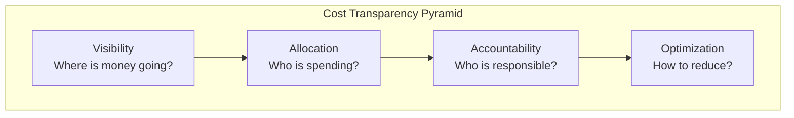
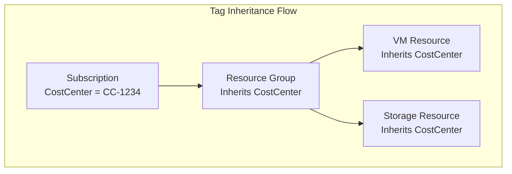
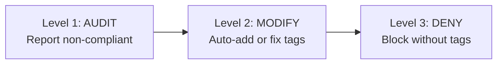
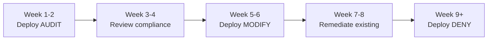
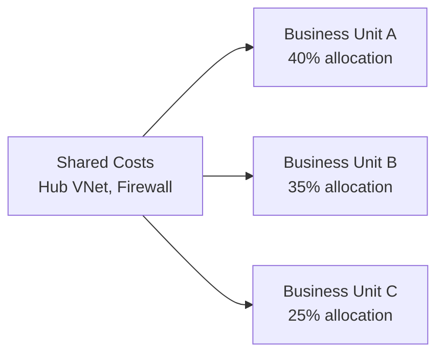
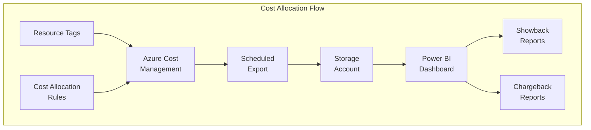

# Module 2: Cost Transparency & Tagging Strategy

> **Duration:** 45 minutes | **Level:** Tactical  
> **WAF Alignment:** [CO:01 (Financial Responsibility)](https://learn.microsoft.com/en-us/azure/well-architected/cost-optimization/principles#establish-financial-responsibility), [CO:03 (Cost Data)](https://learn.microsoft.com/en-us/azure/well-architected/cost-optimization/collect-review-cost-data), [CO:04 (Guardrails)](https://learn.microsoft.com/en-us/azure/well-architected/cost-optimization/set-spending-guardrails)

---

## 2.1 Why Cost Transparency Matters



Cost transparency is the **foundation** of any FinOps practice. Without it, organizations cannot:

- Perform **showback/chargeback** to business units
- Understand **cost per workload or application**
- Identify **cost anomalies** or **orphaned resources**
- Establish an **accountability model** for cost ownership
- Make **data-driven decisions** about infrastructure spend
- Benchmark cloud spend against **industry standards**

> **Key Insight:** Organizations that implement robust cost transparency typically achieve **20-30% cost reduction** within the first 6 months by exposing waste that was previously invisible.
>
> Reference: [FinOps Foundation - State of FinOps Report](https://www.finops.org/insights/state-of-finops/)

---

## 2.2 Azure Tagging Strategy for Cost Management

Tags are **key-value pairs** applied to Azure resources, resource groups, and subscriptions. They are the primary mechanism for **organizing**, **categorizing**, and **allocating** cloud costs.

> **Microsoft Learn:** [Use tags to organize your Azure resources](https://learn.microsoft.com/en-us/azure/azure-resource-manager/management/tag-resources)

### Recommended Cost Tags

| Tag Name | Purpose | Example Values | Required? | Scope |
|----------|---------|---------------|-----------|-------|
| `CostCenter` | Financial allocation code | `CC-1234`, `IT-OPS-001` | **YES** | All resources |
| `BusinessUnit` | Organizational unit | `Engineering`, `Marketing`, `HR` | **YES** | All resources |
| `WorkloadName` | Application/workload name | `ERP-Production`, `WebApp-v2` | **YES** | All resources |
| `Environment` | Deployment environment | `Production`, `Staging`, `Dev`, `Test` | **YES** | All resources |
| `BudgetApproved` | Budget approval status | `Yes`, `No`, `Pending` | **YES** | All resources |
| `Owner` | Responsible person/team | `team-platform@company.com` | RECOMMENDED | All resources |
| `Project` | Project identifier | `PRJ-2026-Migration` | RECOMMENDED | All resources |
| `EndDate` | Expected decommission date | `2026-12-31` | RECOMMENDED | Non-production |
| `DataClassification` | Data sensitivity level | `Public`, `Internal`, `Confidential` | RECOMMENDED | Data resources |
| `CreatedBy` | Who created the resource | `john.doe@company.com` | OPTIONAL | All resources |
| `Criticality` | Business criticality | `High`, `Medium`, `Low` | OPTIONAL | Production |

### Tag Naming Convention Rules

| Rule | Good Example | Bad Example |
|------|-------------|-------------|
| Use **PascalCase** consistently | `CostCenter` | `cost_center`, `costcenter` |
| Keep names **short but descriptive** | `BusinessUnit` | `TheBusinessUnitThisResourceBelongsTo` |
| Use **standard values** | `Production`, `Dev` | `prod`, `PROD`, `production` |
| Avoid **special characters** | `PRJ-2026` | `PRJ/2026`, `PRJ@2026` |
| Document conventions in a **tag dictionary** | Published wiki | Tribal knowledge |

> **Microsoft Learn:** [Define your tagging strategy](https://learn.microsoft.com/en-us/azure/cloud-adoption-framework/ready/azure-best-practices/resource-tagging)

---

## 2.3 Tag Inheritance Strategies

Azure does **not** automatically inherit tags from subscription to resource group to resource. You must implement tag inheritance manually using Azure Policy.



### Strategy 1: Inherit Tag from Resource Group (Built-in Policy)

Azure provides a **built-in policy** to inherit tags from resource groups to resources:

- **Policy Name:** `Inherit a tag from the resource group`
- **Policy ID:** `cd3aa116-8754-49c9-a813-ad46512ece54`
- **Effect:** Modify (automatically applies the tag)

> **Microsoft Learn:** [Assign policy for tag inheritance](https://learn.microsoft.com/en-us/azure/azure-resource-manager/management/tag-policies#assign-policy-for-tag-inheritance)

### Strategy 2: Inherit Tag from Subscription (Built-in Policy)

- **Policy Name:** `Inherit a tag from the subscription`
- **Policy ID:** `b27a0cbd-a167-4571-a2ee-5f4b6cc94836`
- **Effect:** Modify (automatically applies the tag)

### Implementation: Assign Tag Inheritance Policy via CLI

```powershell
# Inherit CostCenter tag from Resource Group to child resources
az policy assignment create `
  --name "Inherit-CostCenter-from-RG" `
  --display-name "Inherit CostCenter tag from Resource Group" `
  --policy "cd3aa116-8754-49c9-a813-ad46512ece54" `
  --params '{"tagName": {"value": "CostCenter"}}' `
  --scope "/subscriptions/<subscription-id>" `
  --mi-system-assigned `
  --location "westeurope" `
  --role "Tag Contributor" `
  --identity-scope "/subscriptions/<subscription-id>"

# Inherit BusinessUnit tag from Subscription to child resources
az policy assignment create `
  --name "Inherit-BusinessUnit-from-Sub" `
  --display-name "Inherit BusinessUnit tag from Subscription" `
  --policy "b27a0cbd-a167-4571-a2ee-5f4b6cc94836" `
  --params '{"tagName": {"value": "BusinessUnit"}}' `
  --scope "/subscriptions/<subscription-id>" `
  --mi-system-assigned `
  --location "westeurope" `
  --role "Tag Contributor" `
  --identity-scope "/subscriptions/<subscription-id>"
```

> **Important:** The `Modify` effect requires a **managed identity** with `Tag Contributor` role. The policy assignment will create a remediation task for existing resources.
>
> **Microsoft Learn:** [Remediate non-compliant resources](https://learn.microsoft.com/en-us/azure/governance/policy/how-to/remediate-resources)

---

## 2.4 Azure Policy for Tag Enforcement

### Three Levels of Tag Governance



| Level | Effect | Behavior | When to Use |
|-------|--------|----------|-------------|
| **Level 1** | `Audit` | Flags non-compliant resources in dashboard | Starting out, building awareness |
| **Level 2** | `Modify` | Auto-adds or corrects tags on resources | Remediating existing estate |
| **Level 3** | `Deny` | Blocks resource creation without tags | Mature governance, strict enforcement |

> **Microsoft Learn:** [Understand Azure Policy effects](https://learn.microsoft.com/en-us/azure/governance/policy/concepts/effects)

### Policy: Audit Missing Tags (Level 1)

This policy audits resources missing required cost tags. Non-compliant resources appear in the [Azure Policy compliance dashboard](https://learn.microsoft.com/en-us/azure/governance/policy/how-to/get-compliance-data).

```json
{
  "properties": {
    "displayName": "Audit-Cost-Tags",
    "policyType": "Custom",
    "mode": "Indexed",
    "description": "Audit resources missing required cost transparency tags. Non-compliant resources are reported but not blocked.",
    "metadata": {
      "category": "Tags",
      "version": "1.0.0"
    },
    "parameters": {
      "tagName1": {
        "type": "String",
        "metadata": {
          "displayName": "Tag Name 1",
          "description": "First required tag name, e.g., 'CostCenter'"
        }
      },
      "tagName2": {
        "type": "String",
        "metadata": {
          "displayName": "Tag Name 2",
          "description": "Second required tag name, e.g., 'BusinessUnit'"
        }
      },
      "tagName3": {
        "type": "String",
        "metadata": {
          "displayName": "Tag Name 3",
          "description": "Third required tag name, e.g., 'WorkloadName'"
        }
      }
    },
    "policyRule": {
      "if": {
        "anyOf": [
          {
            "field": "[concat('tags[', parameters('tagName1'), ']')]",
            "exists": "false"
          },
          {
            "field": "[concat('tags[', parameters('tagName2'), ']')]",
            "exists": "false"
          },
          {
            "field": "[concat('tags[', parameters('tagName3'), ']')]",
            "exists": "false"
          }
        ]
      },
      "then": {
        "effect": "audit"
      }
    }
  }
}
```

### Policy: Auto-Remediate Tags Using Modify Effect (Level 2)

The `modify` effect is the **recommended** approach for tag remediation automation. It automatically adds missing tags with default values and can correct incorrect tag values. Unlike `append`, the `modify` effect can update **existing** resources through remediation tasks.

```json
{
  "properties": {
    "displayName": "Modify-Add-CostCenter-Tag",
    "policyType": "Custom",
    "mode": "Indexed",
    "description": "Adds CostCenter tag with a default value if the tag is missing. Uses modify effect to support remediation of existing resources.",
    "metadata": {
      "category": "Tags",
      "version": "1.0.0"
    },
    "parameters": {
      "tagName": {
        "type": "String",
        "defaultValue": "CostCenter",
        "metadata": {
          "displayName": "Tag Name",
          "description": "Name of the tag to add, e.g., 'CostCenter'"
        }
      },
      "tagValue": {
        "type": "String",
        "defaultValue": "UNASSIGNED",
        "metadata": {
          "displayName": "Tag Value",
          "description": "Default value for the tag, e.g., 'UNASSIGNED'"
        }
      }
    },
    "policyRule": {
      "if": {
        "field": "[concat('tags[', parameters('tagName'), ']')]",
        "exists": "false"
      },
      "then": {
        "effect": "modify",
        "details": {
          "roleDefinitionIds": [
            "/providers/Microsoft.Authorization/roleDefinitions/4a9ae827-6dc8-4573-8ac7-8239d42aa03f"
          ],
          "operations": [
            {
              "operation": "addOrReplace",
              "field": "[concat('tags[', parameters('tagName'), ']')]",
              "value": "[parameters('tagValue')]"
            }
          ]
        }
      }
    }
  }
}
```

> **Key Detail:** The `roleDefinitionIds` value `4a9ae827-...` is the built-in **Tag Contributor** role. The policy engine needs this role to modify resource tags.
>
> **Microsoft Learn:** [Azure Policy modify effect](https://learn.microsoft.com/en-us/azure/governance/policy/concepts/effects#modify)

### Running a Remediation Task for Existing Resources

After deploying a `Modify` policy, existing non-compliant resources are **not** automatically fixed. You must create a **remediation task**:

```powershell
# Create a remediation task for an existing policy assignment
az policy remediation create `
  --name "Remediate-CostCenter-Tags" `
  --policy-assignment "Inherit-CostCenter-from-RG" `
  --scope "/subscriptions/<subscription-id>" `
  --resource-discovery-mode "ReEvaluateCompliance"
```

> **Microsoft Learn:** [Create a remediation task](https://learn.microsoft.com/en-us/azure/governance/policy/how-to/remediate-resources#create-a-remediation-task)

### Policy: Append Tags with Default Values (Level 2 - Legacy)

This policy adds default tag values at resource creation time. Note: `append` is the **legacy** approach; prefer `modify` for new implementations.

```json
{
  "properties": {
    "displayName": "Append-Cost-Tags",
    "policyType": "Custom",
    "mode": "Indexed",
    "description": "Add cost tags with default values to resources at creation time.",
    "metadata": {
      "category": "Tags",
      "version": "1.0.0"
    },
    "parameters": {
      "tagName1": {
        "type": "String",
        "metadata": {
          "displayName": "Tag Name 1",
          "description": "Name of first tag, such as 'WorkloadName'"
        }
      },
      "tagValue1": {
        "type": "String",
        "metadata": {
          "displayName": "Tag Value 1",
          "description": "Default value of the tag, such as 'UNASSIGNED'"
        }
      },
      "tagName2": {
        "type": "String",
        "metadata": {
          "displayName": "Tag Name 2",
          "description": "Name of second tag, such as 'BusinessUnit'"
        }
      },
      "tagValue2": {
        "type": "String",
        "metadata": {
          "displayName": "Tag Value 2",
          "description": "Default value of the tag, such as 'UNASSIGNED'"
        }
      }
    },
    "policyRule": {
      "if": {
        "allOf": [
          {
            "field": "[concat('tags[', parameters('tagName1'), ']')]",
            "exists": "false"
          },
          {
            "field": "[concat('tags[', parameters('tagName2'), ']')]",
            "exists": "false"
          }
        ]
      },
      "then": {
        "effect": "append",
        "details": [
          {
            "field": "[concat('tags[', parameters('tagName1'), ']')]",
            "value": "[parameters('tagValue1')]"
          },
          {
            "field": "[concat('tags[', parameters('tagName2'), ']')]",
            "value": "[parameters('tagValue2')]"
          }
        ]
      }
    }
  }
}
```

### Policy: Enforce Required Tags - Deny (Level 3)

This policy **blocks resource creation** if required cost tags are missing. Deploy this only after Level 1 and Level 2 have been in place and compliance is above 90%.

```json
{
  "properties": {
    "displayName": "Enforce-Cost-Tags-Deny",
    "policyType": "Custom",
    "mode": "Indexed",
    "description": "Deny resource creation without required cost tags: CostCenter, BusinessUnit, WorkloadName, Environment, BudgetApproved",
    "metadata": {
      "category": "Tags",
      "version": "1.0.0"
    },
    "parameters": {
      "tagName1": {
        "type": "String",
        "defaultValue": "CostCenter",
        "metadata": {
          "displayName": "Tag Name 1",
          "description": "First required tag, e.g., 'CostCenter'"
        }
      },
      "tagName2": {
        "type": "String",
        "defaultValue": "BusinessUnit",
        "metadata": {
          "displayName": "Tag Name 2",
          "description": "Second required tag, e.g., 'BusinessUnit'"
        }
      },
      "tagName3": {
        "type": "String",
        "defaultValue": "WorkloadName",
        "metadata": {
          "displayName": "Tag Name 3",
          "description": "Third required tag, e.g., 'WorkloadName'"
        }
      },
      "tagName4": {
        "type": "String",
        "defaultValue": "Environment",
        "metadata": {
          "displayName": "Tag Name 4",
          "description": "Fourth required tag, e.g., 'Environment'"
        }
      },
      "tagName5": {
        "type": "String",
        "defaultValue": "BudgetApproved",
        "metadata": {
          "displayName": "Tag Name 5",
          "description": "Fifth required tag, e.g., 'BudgetApproved'"
        }
      }
    },
    "policyRule": {
      "if": {
        "anyOf": [
          {
            "field": "[concat('tags[', parameters('tagName1'), ']')]",
            "exists": "false"
          },
          {
            "field": "[concat('tags[', parameters('tagName2'), ']')]",
            "exists": "false"
          },
          {
            "field": "[concat('tags[', parameters('tagName3'), ']')]",
            "exists": "false"
          },
          {
            "field": "[concat('tags[', parameters('tagName4'), ']')]",
            "exists": "false"
          },
          {
            "field": "[concat('tags[', parameters('tagName5'), ']')]",
            "exists": "false"
          }
        ]
      },
      "then": {
        "effect": "deny"
      }
    }
  }
}
```

> **Available in knowledge base:** `Module Cost Transparency/Policy-Audit-Tags.json`, `Policy-Enforce-Cost-Tags.json`, `Policy-Append-Cost-Tags.json`

### Policy Rollout Best Practice



1. **Weeks 1-2:** Deploy `Audit` policies to assess current compliance
2. **Weeks 3-4:** Review compliance dashboard, socialize results with teams
3. **Weeks 5-6:** Deploy `Modify` policies with default values (e.g., `UNASSIGNED`)
4. **Weeks 7-8:** Run remediation tasks, verify tag coverage reaches >90%
5. **Weeks 9+:** Deploy `Deny` policies to enforce going forward

---

## 2.5 Azure Resource Graph Queries for Untagged Resources

[Azure Resource Graph](https://learn.microsoft.com/en-us/azure/governance/resource-graph/overview) enables fast queries across your entire Azure estate. Use these queries to find resources missing cost tags.

### Query: Find All Resources Missing CostCenter Tag

```kusto
resources
| where isnull(tags['CostCenter']) or tags['CostCenter'] == ''
| project name, type, resourceGroup, subscriptionId, location
| order by type asc
```

### Query: Count Untagged Resources by Resource Type

```kusto
resources
| where isnull(tags['CostCenter']) or tags['CostCenter'] == ''
| summarize count() by type
| order by count_ desc
```

### Query: Tag Compliance Summary Across Subscriptions

```kusto
resources
| extend hasCostCenter = isnotnull(tags['CostCenter']) and tags['CostCenter'] != ''
| extend hasBusinessUnit = isnotnull(tags['BusinessUnit']) and tags['BusinessUnit'] != ''
| extend hasWorkloadName = isnotnull(tags['WorkloadName']) and tags['WorkloadName'] != ''
| extend hasEnvironment = isnotnull(tags['Environment']) and tags['Environment'] != ''
| summarize 
    totalResources = count(),
    taggedCostCenter = countif(hasCostCenter),
    taggedBusinessUnit = countif(hasBusinessUnit),
    taggedWorkloadName = countif(hasWorkloadName),
    taggedEnvironment = countif(hasEnvironment)
    by subscriptionId
| extend compliancePct = round(todouble(taggedCostCenter) / todouble(totalResources) * 100, 1)
| order by compliancePct asc
```

### Query: Find Resources with UNASSIGNED Default Tags

```kusto
resources
| where tags['CostCenter'] == 'UNASSIGNED' 
    or tags['BusinessUnit'] == 'UNASSIGNED'
| project name, type, resourceGroup, subscriptionId, tags
| order by type asc
```

### Query: List All Unique Tag Keys in Use

```kusto
resources
| mvexpand tags
| extend tagKey = tostring(bag_keys(tags)[0])
| distinct tagKey
| order by tagKey asc
```

### Query: Find Resources by Specific Tag Value

```kusto
resources
| where tags['Environment'] == 'Dev'
| summarize resourceCount = count(), estimatedMonthlyCost = sum(todouble(tags['MonthlyCost']))
    by resourceGroup, subscriptionId
| order by resourceCount desc
```

### Run Resource Graph Queries via CLI

```powershell
# Run a Resource Graph query from Azure CLI
az graph query -q "
resources
| where isnull(tags['CostCenter']) or tags['CostCenter'] == ''
| summarize count() by type
| order by count_ desc
" --output table

# Export results to CSV for reporting
az graph query -q "
resources
| where isnull(tags['CostCenter'])
| project name, type, resourceGroup, subscriptionId
" --output tsv > untagged-resources.csv
```

> **Microsoft Learn:** [Starter Resource Graph queries](https://learn.microsoft.com/en-us/azure/governance/resource-graph/samples/starter)

---

## 2.6 FOCUS Specification (FinOps Open Cost and Usage Specification)

### What is FOCUS?

The **FinOps Open Cost and Usage Specification (FOCUS)** is an open-source specification that defines a **vendor-neutral schema** for cloud cost and usage data. It was created by the [FinOps Foundation](https://www.finops.org/) to standardize how cloud cost data is structured across providers, making multi-cloud cost management possible.

> **FOCUS Website:** [https://focus.finops.org/](https://focus.finops.org/)  
> **Microsoft Learn:** [Understand FOCUS cost details](https://learn.microsoft.com/en-us/azure/cost-management-billing/automate/focus-dataset-overview)

### Why FOCUS Matters

| Challenge Without FOCUS | Solution With FOCUS |
|------------------------|---------------------|
| Each cloud provider uses different column names | Standardized column names across providers |
| AWS "Blended Rate" vs Azure "EffectivePrice" | Unified `EffectivePrice`, `BilledCost`, `ListCost` |
| Comparing costs across clouds is manual | Join datasets using common schema |
| FinOps tooling must handle provider-specific formats | Single schema all tools can consume |
| Showback/chargeback logic differs per cloud | Consistent allocation logic |

### Key FOCUS Columns

| FOCUS Column | Description | Example Value |
|-------------|-------------|---------------|
| `BillingAccountId` | Unique ID for the billing account | `1234567890` |
| `BillingAccountName` | Friendly name of the billing account | `Contoso Enterprise` |
| `BillingPeriodStart` | Start date of the billing period | `2026-02-01` |
| `BillingPeriodEnd` | End date of the billing period | `2026-02-28` |
| `ChargePeriodStart` | Start of the charge window | `2026-02-15T00:00:00Z` |
| `ChargePeriodEnd` | End of the charge window | `2026-02-16T00:00:00Z` |
| `ChargeCategory` | Type of charge | `Usage`, `Purchase`, `Tax` |
| `ChargeFrequency` | How often the charge recurs | `Usage-Based`, `One-Time`, `Recurring` |
| `CommitmentDiscountId` | ID of commitment (reservation/savings plan) | `reservations/abc123` |
| `EffectiveCost` | Cost after all discounts applied | `12.50` |
| `BilledCost` | Amount actually billed | `12.50` |
| `ListCost` | Cost at on-demand/list pricing | `25.00` |
| `ListUnitPrice` | On-demand unit price | `0.10` |
| `PricingQuantity` | Quantity used for pricing | `125` |
| `PricingUnit` | Unit of measure for pricing | `Hours`, `GB` |
| `ProviderName` | Cloud provider name | `Microsoft` |
| `PublisherName` | Publisher of the service | `Microsoft` |
| `RegionId` | Region identifier | `westeurope` |
| `RegionName` | Friendly region name | `West Europe` |
| `ResourceId` | Unique resource identifier | `/subscriptions/.../vm1` |
| `ResourceName` | Friendly resource name | `myVirtualMachine01` |
| `ResourceType` | Type of resource | `Virtual Machine` |
| `ServiceCategory` | Category of service | `Compute`, `Storage`, `Networking` |
| `ServiceName` | Name of the service | `Virtual Machines` |
| `SkuId` | SKU identifier | `DZH318Z0BPS6` |
| `SubAccountId` | Sub-account (subscription) ID | `sub-guid-here` |
| `SubAccountName` | Sub-account (subscription) name | `Production-Sub` |
| `Tags` | Resource tags as key-value pairs | `{"CostCenter":"CC-1234"}` |

### FOCUS vs Azure Native Cost Data Mapping

| Azure Native Column | FOCUS Equivalent | Notes |
|---------------------|-----------------|-------|
| `SubscriptionId` | `SubAccountId` | Direct mapping |
| `SubscriptionName` | `SubAccountName` | Direct mapping |
| `ResourceId` | `ResourceId` | Direct mapping |
| `MeterCategory` | `ServiceName` | Approximate mapping |
| `CostInBillingCurrency` | `BilledCost` | Direct mapping |
| `EffectivePrice` | `EffectiveCost` / `PricingQuantity` | Calculated |
| `PayGPrice` | `ListUnitPrice` | Direct mapping |
| `ReservationId` | `CommitmentDiscountId` | Direct mapping |
| `Tags` | `Tags` | Direct mapping (JSON format) |

### Accessing FOCUS Data in Azure

Azure Cost Management supports **FOCUS-aligned exports**:

```powershell
# Create a FOCUS-format cost export
az costmanagement export create `
  --name "FocusExport" `
  --scope "/subscriptions/<subscription-id>" `
  --type "FocusCost" `
  --timeframe "MonthToDate" `
  --storage-account-id "/subscriptions/<sub>/resourceGroups/<rg>/providers/Microsoft.Storage/storageAccounts/<sa>" `
  --storage-container "focusexports" `
  --storage-directory "daily" `
  --schedule-recurrence "Daily" `
  --schedule-status "Active"
```

> **Microsoft Learn:** [FOCUS cost and usage details](https://learn.microsoft.com/en-us/azure/cost-management-billing/automate/focus-dataset-overview)

---

## 2.7 Cost Allocation Rules in Azure Cost Management

### What Are Cost Allocation Rules?

[Cost allocation rules](https://learn.microsoft.com/en-us/azure/cost-management-billing/costs/allocate-costs) allow you to **redistribute shared costs** (like networking, security, or platform services) across business units, subscriptions, or resource groups — even when those costs cannot be directly tagged.



### When to Use Cost Allocation Rules

| Scenario | Example |
|----------|---------|
| **Shared networking** | Hub VNet, ExpressRoute, Firewall costs split across spokes |
| **Platform services** | Shared AKS cluster costs distributed by namespace usage |
| **Security services** | Microsoft Defender for Cloud costs shared across subscriptions |
| **Management overhead** | Log Analytics workspace costs split by ingestion volume |
| **License pools** | Shared SQL elastic pool costs split by DTU consumption |

### How to Configure Cost Allocation Rules

1. Navigate to **Azure Portal > Cost Management > Settings > Cost allocation (preview)**
2. Click **+ Add** to create a new rule
3. Define the **source** (shared cost to split) using subscription, resource group, or tag
4. Define the **targets** (who receives the allocation) using subscription, resource group, or tag
5. Choose the **allocation method**:
   - **Proportional** — distribute based on actual cost of targets
   - **Even distribution** — split equally among targets
   - **Fixed percentage** — manually set percentages per target
6. Set the **effective date** (rules apply from the start of the month)

### Cost Allocation Behavior

| Aspect | Detail |
|--------|--------|
| **Processing time** | Rules take up to 24 hours to reflect in Cost Analysis |
| **Retroactive** | Rules can be applied retroactively to the start of the current month |
| **Scope** | Available at EA enrollment, MCA billing profile, and MPA partner scopes |
| **Limits** | Up to 50 rules per billing account |
| **Visibility** | Allocated costs appear as separate line items in Cost Analysis |

> **Microsoft Learn:** [Create and manage cost allocation rules](https://learn.microsoft.com/en-us/azure/cost-management-billing/costs/allocate-costs)

---

## 2.8 Implementing Showback & Chargeback



### Showback vs Chargeback

| Approach | Description | Best For | Complexity |
|----------|-------------|----------|------------|
| **Showback** | Display costs to teams without billing them | Building awareness, early-stage FinOps | Low |
| **Chargeback** | Bill costs back to business units via journal entries | Mature organizations with cost centers | High |
| **Hybrid** | Showback for shared resources, chargeback for dedicated | Most enterprises | Medium |

### Step-by-Step: Showback/Chargeback with Power BI

#### Step 1: Configure Scheduled Cost Exports

```powershell
# Create a daily amortized cost export to a storage account
az costmanagement export create `
  --name "DailyAmortizedExport" `
  --scope "/subscriptions/<subscription-id>" `
  --type "AmortizedCost" `
  --timeframe "MonthToDate" `
  --storage-account-id "/subscriptions/<sub>/resourceGroups/<rg>/providers/Microsoft.Storage/storageAccounts/<sa>" `
  --storage-container "costexports" `
  --storage-directory "amortized" `
  --schedule-recurrence "Daily" `
  --schedule-status "Active"
```

#### Step 2: Connect Power BI to Azure Cost Management

1. Open Power BI Desktop
2. **Get Data > Azure > Azure Cost Management**
3. Authenticate with your Azure credentials
4. Select the billing scope (EA enrollment or MCA billing profile)
5. Choose **Amortized cost** for reservation/savings plan distribution
6. Set the date range

> **Microsoft Learn:** [Connect to Azure Cost Management data in Power BI Desktop](https://learn.microsoft.com/en-us/power-bi/connect-data/desktop-connect-azure-cost-management)

#### Step 3: Build Showback Reports

Create Power BI visuals using these recommended dimensions:

| Visual Type | Dimension | Metric | Purpose |
|-------------|-----------|--------|---------|
| **Bar chart** | `CostCenter` tag | Sum of `CostInBillingCurrency` | Cost per cost center |
| **Treemap** | `BusinessUnit` tag | Sum of `CostInBillingCurrency` | Proportional spend |
| **Line chart** | `Date` (daily) | Sum of `CostInBillingCurrency` | Trend over time |
| **Table** | `ResourceGroup`, `ServiceName` | Sum of `CostInBillingCurrency` | Detailed drill-down |
| **KPI card** | N/A | Month-over-month change | Executive summary |

#### Step 4: Automate Distribution

- Schedule Power BI dataset refresh (daily or weekly)
- Configure Power BI **email subscriptions** for stakeholders
- Use Power BI **workspaces** to segment access by business unit
- Optionally embed reports in **Microsoft Teams** channels

#### Step 5: Chargeback Integration (Advanced)

For true chargeback, integrate cost data with financial systems:

1. Export cost data grouped by `CostCenter` tag to CSV/Parquet
2. Map `CostCenter` values to GL (General Ledger) codes
3. Generate journal entries for your ERP system (SAP, Oracle, etc.)
4. Post entries monthly using your ERP's batch import API
5. Reconcile Azure invoices with posted journal entries

> **Microsoft Learn:** [Tutorial: Create and manage exported data](https://learn.microsoft.com/en-us/azure/cost-management-billing/costs/tutorial-export-acm-data)

---

## 2.9 Azure Cost Management Features for Transparency

| Feature | What It Does | How to Access | Learn More |
|---------|-------------|---------------|------------|
| **Cost Analysis** | Interactive cost explorer with filters, grouping, pivots | Portal > Cost Management > Cost Analysis | [Link](https://learn.microsoft.com/en-us/azure/cost-management-billing/costs/quick-acm-cost-analysis) |
| **Cost Alerts** | Email notifications at budget thresholds | Portal > Cost Management > Cost Alerts | [Link](https://learn.microsoft.com/en-us/azure/cost-management-billing/costs/cost-mgt-alerts-monitor-usage-spending) |
| **Anomaly Detection** | ML-powered detection of unexpected spend changes | Automatically enabled in Cost Analysis | [Link](https://learn.microsoft.com/en-us/azure/cost-management-billing/understand/analyze-unexpected-charges) |
| **Cost Exports** | Scheduled CSV/Parquet exports to Storage Account | Portal > Cost Management > Exports | [Link](https://learn.microsoft.com/en-us/azure/cost-management-billing/costs/tutorial-export-acm-data) |
| **FOCUS Dataset** | Standardized cost/usage format across cloud providers | Available in Cost Exports | [Link](https://learn.microsoft.com/en-us/azure/cost-management-billing/automate/focus-dataset-overview) |
| **Cost Allocation** | Redistribute shared costs to business units | Portal > Cost Management > Cost allocation | [Link](https://learn.microsoft.com/en-us/azure/cost-management-billing/costs/allocate-costs) |
| **Smart Views** | Saved and shared cost analysis views | Portal > Cost Management > Views | [Link](https://learn.microsoft.com/en-us/azure/cost-management-billing/costs/save-share-views) |
| **Copilot in Cost Mgmt** | Natural language cost queries powered by AI | Portal > Cost Management (Copilot icon) | [Link](https://learn.microsoft.com/en-us/azure/cost-management-billing/costs/enable-preview-features-cost-management-labs) |

---

## 2.10 Best Practices for Cost Transparency

### Implementation Checklist

| # | Practice | Priority | Status |
|---|----------|----------|--------|
| 1 | Define a **tag dictionary** with mandatory and optional tags | **P0** | |
| 2 | Deploy **audit policies** first to assess current compliance | **P0** | |
| 3 | Enable **tag inheritance** from resource group to resources | **P0** | |
| 4 | Use **modify policies** to auto-remediate untagged resources | **P1** | |
| 5 | Run **Resource Graph queries** weekly to track tag compliance | **P1** | |
| 6 | Configure **cost exports** (daily, amortized, FOCUS format) | **P1** | |
| 7 | Build **Power BI showback dashboards** by business unit | **P1** | |
| 8 | Set up **cost allocation rules** for shared infrastructure | **P2** | |
| 9 | Deploy **deny policies** once compliance exceeds 90% | **P2** | |
| 10 | Integrate chargeback with **ERP/financial systems** | **P2** | |
| 11 | Review **FOCUS exports** for multi-cloud cost normalization | **P3** | |
| 12 | Automate **tag compliance reporting** via Logic Apps or Functions | **P3** | |

### Common Pitfalls to Avoid

| Pitfall | Why It's a Problem | Solution |
|---------|-------------------|----------|
| Enforcing `Deny` without `Audit` first | Blocks deployments, frustrates teams | Follow the Audit > Modify > Deny progression |
| Inconsistent tag naming (`CostCenter` vs `costcenter`) | Breaks filtering and allocation | Enforce PascalCase via a published tag dictionary |
| Not tagging **resource groups** | Tags don't flow down to child resources | Use tag inheritance policies |
| Relying only on tags for shared costs | Shared resources can't be directly tagged to single owners | Use Cost Allocation Rules |
| Manual tag application | Tags drift quickly, humans forget | Automate with Azure Policy Modify effect |
| Not using amortized cost view | Reservations appear as lump-sum purchases | Always use amortized view for showback |
| Ignoring FOCUS format | Lock-in to Azure-specific column names | Export in FOCUS format for portability |

---

## References

- [Azure Policy for Tags](https://learn.microsoft.com/en-us/azure/azure-resource-manager/management/tag-policies)
- [Cost Allocation in Azure](https://learn.microsoft.com/en-us/azure/cost-management-billing/costs/allocate-costs)
- [FOCUS Specification](https://focus.finops.org/)
- [FOCUS Dataset Overview in Azure](https://learn.microsoft.com/en-us/azure/cost-management-billing/automate/focus-dataset-overview)
- [Azure Resource Graph Queries](https://learn.microsoft.com/en-us/azure/governance/resource-graph/samples/starter)
- [Azure Policy Effects](https://learn.microsoft.com/en-us/azure/governance/policy/concepts/effects)
- [Tag Inheritance Policies](https://learn.microsoft.com/en-us/azure/azure-resource-manager/management/tag-policies#assign-policy-for-tag-inheritance)
- [Power BI + Azure Cost Management](https://learn.microsoft.com/en-us/power-bi/connect-data/desktop-connect-azure-cost-management)
- [Tutorial: Export Cost Data](https://learn.microsoft.com/en-us/azure/cost-management-billing/costs/tutorial-export-acm-data)
- [Azure Policy Remediation](https://learn.microsoft.com/en-us/azure/governance/policy/how-to/remediate-resources)
- [Cloud Adoption Framework - Tagging Strategy](https://learn.microsoft.com/en-us/azure/cloud-adoption-framework/ready/azure-best-practices/resource-tagging)
- [Analyze Unexpected Charges](https://learn.microsoft.com/en-us/azure/cost-management-billing/understand/analyze-unexpected-charges)
- [Cost Management Best Practices](https://learn.microsoft.com/en-us/azure/cost-management-billing/costs/cost-mgt-best-practices)
- Knowledge Base: `Module Cost Transparency/` folder

---

> **Previous Module:** [Module 1 — Cost Optimization Fundamentals](./01-Module-Cost-Optimization-Fundamentals.md)  
> **Next Module:** [Module 3 — Financial Controls & Budgets](./03-Module-Financial-Controls.md)  
> **Back to Overview:** [README — Cost Optimization](./README.md)
